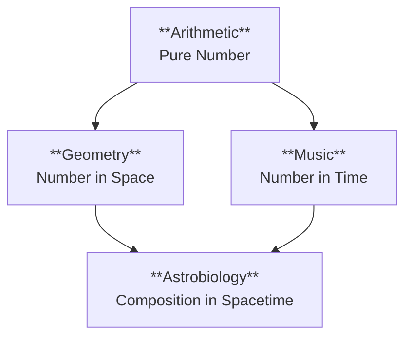

# Prologue of Spacetime: A Demonstrative Example of the Unifying Namespace

> *"Number is the ruler of forms and ideas, and the cause of gods and daemons."* — Iamblichus

**Prologue of Spacetime** is more than a curriculum or a game; it is a **Demonstrative Example** proving the power of a **Unifying Namespace** to relate concepts, persist memory, and index data assets in a way that **maximizes latent opportunities** in a structural and systematic manner.

---

## 🧊 The Core Value Proposition: Cubical Logic Model (CLM)

Everything in the **Prologue of Spacetime**—and its parent ecosystem, **PKC-OS**—is stored and indexed using the **Cubical Logic Model (CLM)**. This ensures that **all content**, without exception, can be related to one of three canonical data types:

| CLM Dimension | Handle Type | Description | Worst-Case Fallback |
| :--- | :--- | :--- | :--- |
| **1. Abstract Specification** | `Spec` | The "What" (Intent, Requirement, Rhetoric). | Content Hash |
| **2. Concrete Implementation** | `Impl` | The "How" (Code, Process, Logic). | Content Hash |
| **3. Balanced Expectations** | `Exp` | The "Proof" (Test Data, Verification, Grammar). | Content Hash |

> **The Guarantee**: We always have a **Handle** to deal with content. The worst case is that the handle is the content's **Default Content Hash**. Content can never be "orphaned" or "unaddressable." This is the foundation of a truly **Universal Memory**.

---

## 💡 Why This Matters: The Power of a Unifying Namespace

Traditional systems fail because they create **information silos**. Data in one system cannot be meaningfully related to data in another. The **Prologue of Spacetime** demonstrates a different paradigm:

1.  **All Concepts Are Relatable**: By indexing all content via CLM, any piece of information (a lesson, a code snippet, a test result) can be mathematically related to any other. A "Biology lesson" and a "Git commit" are both just vectors in the CLM space.

2.  **Latent Opportunities Are Surfaced**: A "Unifying Namespace" allows AI agents to discover **non-obvious connections**. If my `Spec` for "water irrigation" has a high cosine similarity to a `Spec` for "network packet routing," the system can surface this **latent opportunity** for a cross-domain insight.

3.  **Memory is Persistent and Addressable**: Using Content Hashes as the ultimate fallback ensures that no piece of information is ever lost. Everything is part of the **Append-Only Log** of Truth.

---

## 🎓 Methodology: GASing with Universality

The project operationalizes the CLM through the **GASing Methodology** (Gampang, Asyik, Menyenangkan):

| GASing | CLM Dimension | Principle |
| :--- | :--- | :--- |
| **Menyenangkan (Enjoyable)** | Abstract Specification | Start with "Why"—the Rhetoric that hooks the user's *Vibe*. |
| **Asyik (Fun)** | Concrete Implementation | The "How"—turn Logic into a discovery game. |
| **Gampang (Easy)** | Balanced Expectations | The "What"—cement Grammar using verifiable tests and types. |

---

## 🗂 The 12-Chapter Structure (Trivium × Quadrivium)

The entire curriculum is structured as a **3 × 4 Matrix**, a demonstrative example of how the CLM organizes knowledge:

|                             | **Arithmetic** (Number) | **Geometry** (Space) | **Music** (Time) | **Astronomy** (Spacetime) |
| --------------------------- | :---------------------- | :------------------- | :--------------- | :------------------------ |
| **Rhetoric** (Spec)   | Ch 1: Counting Value    | Ch 2: Deep Shape     | Ch 3: Rhythm     | Ch 4: Observation         |
| **Logic** (Impl)      | Ch 5: Allocation        | Ch 6: Pathfinding    | Ch 7: Causality  | Ch 8: Prediction          |
| **Grammar** (Exp)     | Ch 9: Schema            | Ch 10: Topology      | Ch 11: Lifecycle | Ch 12: Coordination       |

### 1. The Revived Quadrivium (Arithmetic as Foundation)
We do not treat the "Arts" as decorative. We treat them as **Computational Primitives**, with **Arithmetic** as the common mechanism to reason about reality.

*   **Arithmetic**: The discrete mechanism of **Representability**.
*   **Geometry**: Reasoning about **Structure** and **Boundary**.
*   **Music**: Reasoning about **Frequency** and **Cost/Energy**.
*   **Astrobiology**: The composition of Structure and Energy = **Life/Evolution**.

Each chapter produces an **MVP Card** that is indexed into the CLM:
*   **MCard (Memory)**: The `Spec` (Static Truth).
*   **PCard (Process)**: The `Impl` (Transformation Logic).
*   **VCard (Verification)**: The `Exp` (Proof of Correctness).

---

## 🤖 CodeWiki Workspace

This repository serves as a specialized **Project Workspace** for the **Prologue of Spacetime**, designed for collaboration with **CodeWiki by Google**.

### File Management Strategy (SSOT via CLM)

1.  **Vault-Centric Truth**: Core documents reside in the user's `DataVault/WorkingNotes`.
2.  **Symlink Synchronization**: Key documents are symbolically linked into `docs/`.
3.  **CLM Indexing**: All documents, once finalized, are indexed as a CLM triple: `(Spec, Impl, Exp)`. Even a simple `.md` file is treated as the `Spec` for a future `Impl`.

---

## 📚 Active Context (in `docs/`)

*   **[`Prologue of Spacetime.md`](docs/Prologue%20of%20Spacetime.md)**: The core "Game" document (CLM: `Spec`).
*   **[`Structure and Vision`](chapters/00_Structure_and_Vision.md)**: The project architecture (CLM: `Spec + Impl`).
*   **[`Brain_Factory_Implementation_Case_Study.md`](chapters/Brain_Factory_Implementation_Case_Study.md)**: Real-world validation (CLM: `Exp`).
*   **[`Cubical Logic Model — Monadic Patterns and Consensus.md`](docs/Cubical%20Logic%20Model%20—%20Monadic%20Patterns%20and%20Consensus.md)**: The formal definition of the CLM.

---

## 🗝 Key Concepts

### 1. The Unifying Namespace (CLM)
*   All content is a vector in a 3D space: (`Spec`, `Impl`, `Exp`).
*   Relatedness is measured by **Cosine Similarity**.
*   **Consensus** is achieved via **Pre-Established Harmony** (Vector Alignment), not negotiation.

### 9. Development Status & Updates
*   **[2026-02-06: The Polynomial Architecture Update](docs/Update_History/2026-02-06_Polynomial_Architecture.md)**: A major refactor integrating Boundedness, Laplace Damping, and Economic Accounting into the core MVP logic.
*   **[2026-01-26: Initial Release](docs/Update_History/2026-01-26_Initial_Release.md)**: The launch of the Prologue of Spacetime vision.

### 2. The Universal Grammar (Polynomial Functors)
The project operationalizes the **[Universal Grammar of Decomposition](docs/WorkingNotes/Hub/Theory/Integration/The%20Universal%20Grammar%20of%20Decomposition.md)** via **Polynomial Functors**:
$$ P(X) = \sum A_i \times X^{B_i} $$
*   **$A_i$ (Position)**: The **MCard** (Abstract Spec / Memory).
*   **$X^{B_i}$ (Direction)**: The **PCard** (Concrete Impl / Process).
*   **Boundedness**: We respect the **Region of Convergence (ROC)**. Resources ($c_k$) act as the **Laplace Damping** factor. If you cannot afford the verification cost, the truth is "Undefined."

### 3. Accounting as Verification
*   **Algebraic Accounting** is not just about money; it is about **Energy Conservation**.
*   A **VCard** is a "Balance Sheet" that proves a computation **Converged** within its Energy Budget.
*   **Sovereignty** = The ability to audit your own Energy inputs and outputs.

### 4. Representability Enables Observability
*   Because the system is **Representable** (via the **Yoneda Lemma**), identifying truth through relationships, it is inherently **Observable**.
*   **Telemetry** is the "Accounting Ledger" of these relationships.

### 5. Monad-Polynomial Duality
*   **Invariant Container (Monad)**: The Runtime (PTR) that enforces Safety and Context.
*   **Variant Content (Polynomial)**: The MVP Cards that hold Data and Logic.
*   This duality ensures **Systematic Compression**, allowing us to represent infinite complexity compactly within finite resources.

### 6. Content-Addressable Handles
*   Every asset has a **unique identifier**.
*   The fallback is always the **SHA-3 Content Hash**.
*   This guarantees **Experimental-Operational Symmetry (EOS)**.

### 7. Sovereign Operational Networks (SON)
*   The story demonstrates that true sovereignty comes from owning the **decision-making intelligence** (The "Maxwell's Demon").
*   The CLM ensures that this intelligence is **verifiable** via Conscientious Accounting.

### 8. Digital Synesthesia
*   The CLM enables **Digital Synesthesia**—mapping abstract data (`Spec`) into sensory experience (`Exp`).
*   Students "feel" the correctness of a system via the **Rhythm of Convergence**.

---

## Conclusion

**Prologue of Spacetime** is not just a curriculum. It is a **Proof of Concept** for a new way of organizing knowledge. By demonstrating that a **Unifying Namespace (CLM)** can relate all concepts, persist all memory, and surface all latent opportunities, it lays the groundwork for an **AI-Native Knowledge Infrastructure**.

> **The CLM is the Universal Language**. It is the protocol that allows Humans, Machines, and Institutions to speak the same truth.

---

*This project is part of the **PKC (Personal Knowledge Container)** ecosystem, dedicated to enabling **Computational Governance** and **Cultural Sovereignty** through open-source technology.*
