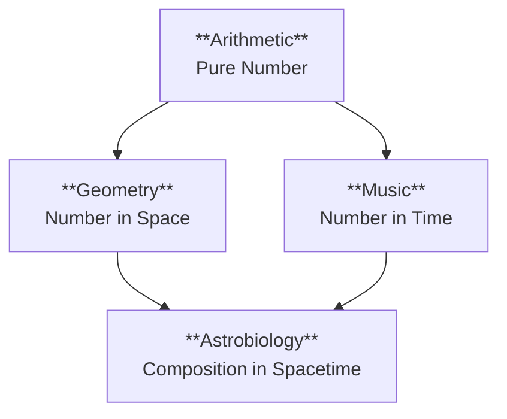
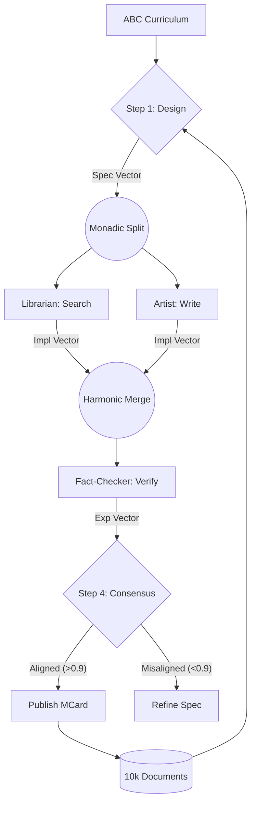
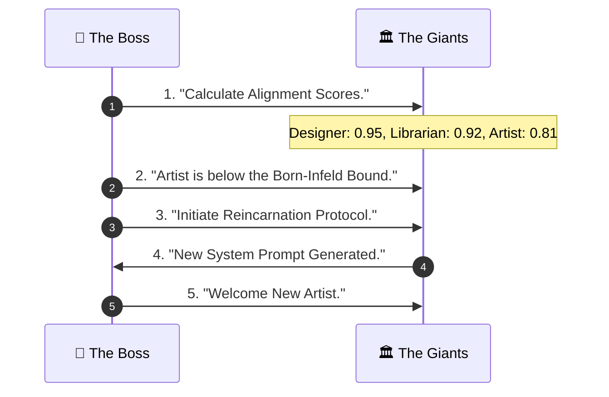

# Prologue of Spacetime: A Demonstrative Example of the Unifying Namespace

> *"Number is the ruler of forms and ideas, and the cause of gods and daemons."* — Iamblichus

**Prologue of Spacetime** is more than a curriculum or a game; it is a **Demonstrative Example** of a **Living System** designed for **Continuation**. It proves the power of a **Unifying Namespace** to relate concepts, persist memory, and index data assets in a way that **maximizes latent opportunities** in a structural and systematic manner.

> **Mathematical Foundation**: We leverage the body of knowledge from **Homotopy Type Theory (HoTT)**. We treat "Equality" not as a boolean check, but as a **Path** between points in a space. This allows us to unify **Logic** (Types) with **Geometry** (Topological Shapes), providing the rigorous grounding needed for a truly Universal Namespace.

### HoTT in Practice

In HoTT, a **Type** is a Space, a **Term** is a Point, and an **Equality** is a Path between points. This means:

* **Multiple Proofs**: Unlike classical logic where equality is binary, HoTT allows *multiple paths* (proofs) demonstrating that $x = y$. Each path carries structural information.
* **Propositions as Types**: Logical propositions are types; proofs are inhabitants of those types. To prove $P$ is true, we construct a term of type $P$.
* **Higher Inductive Types**: We can define spaces not just by their points, but by their paths and paths-of-paths—enabling the representation of topological structures (circles, spheres, tori) directly in the type system.
* **Univalence Axiom**: Equivalent types are equal. This means that if two systems behave identically, they *are* identical—the foundation for content-addressable truth.

---

## 🎲 The Representation Engine: D&D as Word Game for Deep Ideas

> *"D&D is the oldest word game about representation: you speak a world into existence, and reality judges whether your words were faithful."*

The **[[The_Representation_Engine|Representation Engine]]** is the project's core engagement mechanic — an iterative, time-sensitive feedback loop that uses D&D-style **[[Conversational Programming]]** to guide players from surface engagement to the deepest possible ideas about **representation itself**.

**The Permutation Thesis**: [[Directionality]] (order matters) combined with [[Commutativity|Non-Commutativity]] ($AB \neq BA$) generates **Permutation Complexity** — a double-edged sword that simultaneously makes temporal execution irreducibly complex and makes hash namespaces effectively infinite. The game teaches players to navigate both sides through iterative word games:

| Tier                  | Word Game                                   | What Players Discover                                   | Card      |
| :-------------------- | :------------------------------------------ | :------------------------------------------------------ | :-------- |
| **1. Name**     | "Cat" ≠ "Act"                              | Directionality creates distinction from identical parts | [[MCard]] |
| **2. Describe** | "Cat on mat" ≠ "Mat on cat"                | Non-commutativity determines truth-value                | [[PCard]] |
| **3. Compose**  | 5 abilities ×$5! = 120$ orderings        | Permutation generates the namespace of possible worlds  | [[VCard]] |
| **4. Prove**    | Defend against adversarial reinterpretation | [[Representability]] collapses namespace to truth       | {P}C{Q}   |

**The D&D Loop (per turn)**: **Declare** intent in words → **Resolve** via DM (Maxwell's Demon adjudicating representation fidelity) → **Narrate** the gap between intent and outcome → **Level Up** when representation exceeds the fidelity threshold. Time budgets (<100ms → <1s → <10s → <60s) maintain **[[Hub/Theory/Integration/Flow in PKC - Faster Interactive Learning|Flow State]]** while the challenge-skill balance escalates.

**Why D&D?** We chose D&D because the **D**ungeon **M**aster is literally **M**axwell's **D**emon — **DM** reversed is **MD**, a permutation hiding in plain sight that embodies the [[Hub/Theory/Category Theory/Directionality|Directionality]] thesis itself. The DM is the only game role where a human performs the full observe → decide → sort → remember → erase cycle on natural-language input. This is not a metaphor: every DM adjudication produces $\geq k_B T \ln 2$ of entropy ([[Hub/Theory/Sciences/Landauer's Principle|Landauer's Principle]]), every session compression is an irreversible information erasure, and no other game generates this level of [[Hub/Tech/Epiplexity|Epiplexity]] (structured complexity). See **[[DM_as_Maxwells_Demon|The Dungeon Master as Maxwell's Demon: Why D&D Is the Right Game]]** for the full argument with physical and historical support.

### Why These Four Concepts Rule All Decisions

These four fundamentals — Directionality, Sum/Product Types, Permutation Possibilities, Representability — are not game abstractions. They are the **irreducible structure of decision itself**:

1. **What can I choose?** → **Sum Types** (the OR-space of available options)
2. **In what order must I act?** → **Directionality + Product Types** (the irreversible AND-THEN chain)
3. **How many arrangements exist?** → **Permutation Possibilities** (the $n!$ explosion that makes strategy hard)
4. **How faithfully can I model the situation?** → **Representability** (map-territory fidelity determines outcome quality)

No fifth concept is needed. Every context — game theory, military strategy, software architecture, investment, conversation — decomposes into these four. The game makes this universal structure **viscerally felt**: every D&D turn is a Sum choice, every round is a Product sequence, every strategy searches the Permutation space, and every outcome is a Representability judgment. Mastering the game is mastering decision itself.

---

## ♾️ The Operational Continuum: 24/7 MLOps

To sustain this Continuation, we operate the refinement of the *Prologue* as a **24/7 DevOps/MLOps System**, following the **Five-Level MLOps Maturity Model**.

* **Git as the Membrane**: We use **Git Worktree** to strictly separate **Human-in-the-Loop** (Creative Intent) from **Fully Automated Processes** (Agentic Refinement). This allows multiple AI agents to operate in parallel directories (Monadic Isolation) while sharing the same history, preventing lock conflicts and context pollution.
* **File-System SSOT**: This separation ensures a **Consistent Data Pool**.
* **Content Addressable Scheme (CAS)**: By managing all assets via CAS (at the file system level), we guarantee that every version is immutable and addressable, turning the repository into a **Single Source of Truth** that agents can safely mine and refine without hallucination.

### SSOT as Verification Protocol (Tao Generates One)

> **Critical Reframe**: SSOT is not about having ONE piece of truth or ONE version of reality. SSOT is a **dynamically evolving, contextually dependent PROTOCOL** for determining what counts as truth in a given system.

The ancient generative sequence *Tao Generates One* (Directionality gives birth to Unity) captures the correct architectural order:

1. **The Way (Directionality)**: Establish non-commutative operations (order matters)
2. **One (SSOT)**: Verification protocols emerge from directed processes
3. **Two (Duality)**: Binary distinctions (True/False, Valid/Invalid) follow
4. **Three (Triad)**: Grammar-Logic-Rhetoric; MCard-PCard-VCard
5. **Ten Thousand Things (All Things)**: Complete knowledge systems unfold

This is why Git works (directed commit graph → single source of history), why blockchain works (directed chain → single consensus truth), and why PKC works (directed verification → single knowledge sovereignty).

---

## 🎯 The Pedagogical Goal: Function as the Root Type (SSOT)

This entire project is an exercise in **Modularizing Learning Activities as Functions**. We treat every concept, lesson, and interaction not as "static text," but as a **Cubical Simplex**—a standardized, functional building block of reality.

* **Function as the Root**: By defining every activity as a function ($f: \text{Input} \to \text{Output}$), we make learning **Composable**, **Extensible**, and **Testable**.
* **Cubical Simplices**: These functions are strictly structured as **CLM Triples** (Spec, Impl, Exp). This methodical structure forces the learner to identify the **Single Source of Truth (SSOT)** for every claim.
* **The Outcome**: Participants practice a rigorous discipline of **Experimental Verification**, resulting in a **Consistent Memory** that provides **Sound and Complete Guidance** for their sovereign journey.

---

## 🧊 The Core Value Proposition: Cubical Logic Model (CLM)

Everything in the **Prologue of Spacetime**—and its parent ecosystem, **PKC-OS**—is stored and indexed using the **Cubical Logic Model (CLM)**. This ensures that **all content**, without exception, can be related to one of three canonical data types:

| CLM Dimension                        | Handle Type | Description                                     | Worst-Case Fallback |
| :----------------------------------- | :---------- | :---------------------------------------------- | :------------------ |
| **1. Abstract Specification**  | `Spec`    | The "What" (Intent, Requirement, Rhetoric).     | Content Hash        |
| **2. Concrete Implementation** | `Impl`    | The "How" (Code, Process, Logic).               | Content Hash        |
| **3. Balanced Expectations**   | `Exp`     | The "Proof" (Test Data, Verification, Grammar). | Content Hash        |

> **The Guarantee**: We always have a **Handle** to deal with content. The worst case is that the handle is the content's **Default Content Hash**. Content can never be "orphaned" or "unaddressable." This is the foundation of a truly **Universal Memory**.

---

## 💡 Why This Matters: The Power of a Unifying Namespace

Traditional systems fail because they create **information silos**. Data in one system cannot be meaningfully related to data in another. The **Prologue of Spacetime** demonstrates a different paradigm:

1. **All Concepts Are Relatable**: By indexing all content via CLM, any piece of information (a lesson, a code snippet, a test result) can be mathematically related to any other. A "Biology lesson" and a "Git commit" are both just vectors in the CLM space.
2. **Latent Opportunities Are Surfaced**: A "Unifying Namespace" allows AI agents to discover **non-obvious connections**. If my `Spec` for "water irrigation" has a high cosine similarity to a `Spec` for "network packet routing," the system can surface this **latent opportunity** for a cross-domain insight.
3. **Memory is Persistent and Addressable**: Using Content Hashes as the ultimate fallback ensures that no piece of information is ever lost. Everything is part of the **Append-Only Log** of Truth.

---

---

## 🎓 Methodology: GASing and the Kenosis Principle

The project operationalizes the CLM through the **GASing Methodology** (Gampang, Asyik, Menyenangkan), which is grounded in the theological engineering principle of **Kenosis** (Self-Emptying).

The ultimate goal of this methodology is maximizing **Information Density**—the amount of actionable knowledge transmitted per unit of cognitive effort, governed by the equation:

$$
\text{Effective Learning} = \text{Compression (Density)} \times \text{Kenosis (Capacity)}
$$

This compressed, high-density knowledge is stored in the PKC network as **metastable patterns in an excitable medium**, ensuring structural integrity across cognitive transfers.

### The Kenosis Connection

To create a **Universal Namespace**, one must start with an **Empty Schema** (Zero Assumptions). Just as Kenosis is the act of emptying oneself to receive infinite capacity, the CLM starts with "nothing" (Handle/Card/Version) to enable the hosting of **any domain**.

| GASing                             | CLM Dimension           | Principle                                                     | Kenosis Analog                                                     |
| :--------------------------------- | :---------------------- | :------------------------------------------------------------ | :----------------------------------------------------------------- |
| **Menyenangkan (Enjoyable)** | Abstract Specification  | Start with "Why"—the Rhetoric that hooks the user's*Vibe*. | **Surrender**: The choice to align with a higher purpose.    |
| **Asyik (Fun)**              | Concrete Implementation | The "How"—turn Logic into a discovery game.                  | **Emptying**: The process of shedding rigid pre-conceptions. |
| **Gampang (Easy)**           | Balanced Expectations   | The "What"—cement Grammar using verifiable tests and types.  | **Filling**: The result of becoming a vessel for Truth.      |

---

## 🗂 The 12-Chapter Structure (Trivium × Quadrivium)

The entire curriculum is structured as a **3 × 4 Matrix**, a demonstrative example of how the CLM organizes knowledge:

|                           | **Arithmetic** (Number) | **Geometry** (Space) | **Music** (Time) | **Astrobiology**(Compositions of Spacetime/Life) |
| ------------------------- | :---------------------------- | :------------------------- | :--------------------- | :----------------------------------------------------- |
| **Rhetoric** (Spec) | Ch 1: Counting Value          | Ch 2: Deep Shape           | Ch 3: Rhythm           | Ch 4: Observation                                      |
| **Logic** (Impl)    | Ch 5: Allocation              | Ch 6: Pathfinding          | Ch 7: Causality        | Ch 8: Prediction                                       |
| **Grammar** (Exp)   | Ch 9: Schema                  | Ch 10: Topology            | Ch 11: Lifecycle       | Ch 12: Coordination                                    |

### 1. The Revived Quadrivium (Arithmetic as Foundation)

We do not treat the "Arts" as decorative. We treat them as **Computational Primitives**, with **Arithmetic** as the common mechanism to reason about reality.


```mermaid
graph TD
    AR[**Arithmetic**<br/>Pure Number] --> GEO[**Geometry**<br/>Number in Space]
    AR --> MUS[**Music**<br/>Number in Time]
    GEO --> AST[**Astrobiology**<br/>Composition in Spacetime]
    MUS --> AST
```

* **Arithmetic**: The discrete mechanism of **Representability**.
* **Geometry**: Reasoning about **Structure** and **Boundary**.
* **Music**: Reasoning about **Frequency** and **Cost/Energy**.
* **Astrobiology**: The composition of Structure and Energy = **Life/Evolution**.

Each chapter produces an **MVP Card** that is indexed into the CLM:

* **MCard (Memory)**: The `Spec` (Static Truth).
* **PCard (Process)**: The `Impl` (Transformation Logic).
* **VCard (Verification)**: The `Exp` (Proof of Correctness).

---

## 🏛 The Social Dimension: Lessig's Four Modalities as Space/Time Boundaries

The Quadrivium gives us the **physical** axes of Space and Time. But the **Prologue of Spacetime** is also a social system—a Brain Factory where humans coordinate. How are **social** boundaries organized?

**Lawrence Lessig's Four Modalities of Regulation** (from *Code v2*) provide the answer. Lessig identified four forces that constrain human behavior: **Law**, **Norms**, **Market**, and **Architecture (Code)**. These four modalities decompose along the same two axes that organize the Quadrivium:

|                          | **Space (Near / Far)**                        | **Time (Before / After)** |
| :----------------------- | :-------------------------------------------------- | :------------------------------ |
| **Near × Before** | **Architecture (Code)** — Prevents at source | Proactive, structural           |
| **Near × After**  | **Law** — Punishes after violation           | Reactive, direct                |
| **Far × Before**  | **Norms** — Shapes expectations              | Proactive, cultural             |
| **Far × After**   | **Market** — Adjusts via prices              | Reactive, distributed           |

```
                        ╭─────────────╮
                        │   MARKET    │
                        │ Far × After │
                        ╰──────┬──────╯
                               │
                               ▼
  ╭───────────────╮      ╭────────────╮      ╭─────────────╮
  │ ARCHITECTURE  │      │            │      │     LAW     │
  │ Near × Before │─────▶│     ●      │◀─────│ Near × After│
  │ (West Coast)  │      │            │      │(East Coast) │
  ╰───────────────╯      ╰────────────╯      ╰─────────────╯
                               ▲
                               │
                        ╭──────┴──────╮
                        │    NORMS    │
                        │ Far × Before│
                        ╰─────────────╯
```

> *Lessig's "pathetic dot": the regulated individual sits at the center, constrained by all four forces simultaneously — each force occupying a distinct position in the Space × Time quadrant.*

### Why This Matters for the Prologue

This reveals that the Quadrivium's **Geometry (Space)** and **Music (Time)** are not merely physical concepts—they are the **same axes** that organize all social regulation:

- **Geometry (Space) → Near/Far**: How *directly* does a constraint touch you? Architecture is a wall you cannot walk through; Market is a price signal from a distant exchange.
- **Music (Time) → Before/After**: *When* does regulation act? Norms shape you before you act (socialization); Law judges you after you act (enforcement).
- **Astronomy (Spacetime) → Full Governance**: Complete governance requires *both* axes simultaneously, just as Astronomy composes Space and Time into orbital dynamics.

> **The Deep Insight**: *Regulation is the social manifestation of Space/Time boundaries.* The choice of how to govern is isomorphic to the choice of where to draw boundaries in Space and Time—the same boundaries the Quadrivium teaches us to reason about mathematically.

---

## 🤖 CodeWiki Workspace

This repository serves as a specialized **Project Workspace** for the **Prologue of Spacetime**, designed for collaboration with **CodeWiki by Google**.

### Shopper Analytics Integration
The curriculum includes real-world spatial tracking implementation using:
- **IP Cameras**: Hikvision DS-2CD2021G1 for RTSP video streaming and YOLO-based person detection
- **LiDAR**: Camsense X2, YDLidar for 360° spatial point cloud generation
- **Edge AI**: NVIDIA Jetson Orin Nano or Intel i5 with ONNX Runtime for local inference
- **Microcontrollers**: ESP32 DevKit for sensor control and FreeRTOS task scheduling
- **AI Models**: YOLOv8n, YOLOv11n optimized for edge deployment

This demonstrates geometry (homography transformation), observation (multi-camera consensus), and edge computing principles.

### File Management Strategy (SSOT via CLM)

1. **Vault-Centric Truth**: Core documents reside in the user's `DataVault/WorkingNotes`.
2. **Symlink Synchronization**: Key documents are symbolically linked into `docs/`.
3. **CLM Indexing**: All documents, once finalized, are indexed as a CLM triple: `(Spec, Impl, Exp)`. Even a simple `.md` file is treated as the `Spec` for a future `Impl`.

---

## 📚 Active Context (in `docs/`)

* **[`Prologue of Spacetime.md`](docs/Prologue%20of%20Spacetime.md)**: The core "Game" document (CLM: `Spec`).
* **[`Prologue_Conceptual_Digest.md`](docs/Prologue_Conceptual_Digest.md)**: A high-level synthesis of Information Density, Thermodynamics, and Monadic logic.
* **[`Structure and Vision`](chapters/00_Structure_and_Vision.md)**: The project architecture (CLM: `Spec + Impl`).
* **[`Brain_Factory_Implementation_Case_Study.md`](chapters/Brain_Factory_Implementation_Case_Study.md)**: Real-world validation (CLM: `Exp`).
* **[`Strategic_Validation_Reverse_Mathematics_of_the_Brain_Factory.md`](chapters/Strategic_Validation_Reverse_Mathematics_of_the_Brain_Factory.md)**: Proof-theoretic validation of the Brain Factory strategy (CLM: `Exp`).
* **[`Cubical Logic Model — Monadic Patterns and Consensus.md`](docs/Cubical%20Logic%20Model%20—%20Monadic%20Patterns%20and%20Consensus.md)**: The formal definition of the CLM.
* **[`Board Games as Pedagogical Engines`](docs/gameboard/Board_Games_as_Pedagogical_Engines.md)**: Authenticated board games (Monopoly, Chess, Go) as microcosms for teaching the Trivium × Quadrivium framework through play (CLM: `Spec + Impl + Exp`).

---

## 🗝 Key Concepts

### 1. The Unifying Namespace (CLM via HoTT)

* **Foundation**: We leverage **Homotopy Type Theory (HoTT)** to treat Types as Spaces and Terms as Points.
* **Vector Space**: All content is a vector in a 3D space: (`Spec`, `Impl`, `Exp`).
* **Relationality**: Relatedness is measured by **Cosine Similarity** (Path Connectedness).
* **Consensus**: Achieved via **Pre-Established Harmony** (Vector Alignment), not negotiation.

### 2. The Universal Grammar of Decomposition

The project operationalizes the **[Universal Grammar of Decomposition](docs/WorkingNotes/Hub/Theory/Integration/The%20Universal%20Grammar%20of%20Decomposition.md)** via **Polynomial Functors**. We recognize that Fourier Transforms, Laplace Transforms, Place Value Systems, and Data Structures are all instances of the same paradigm:

$$
f = \sum_k c_k \cdot \phi_k
$$

* **Basis ($\phi_k$)**: The **PCard** (Direction/Type). The structural "shape" of the thought.
* **Coefficients ($c_k$)**: The **MCard** (Position/Weight). The specific "content" or intensity.
* **Boundedness**: We respect the **Region of Convergence (ROC)**. Resources ($c_k$) act as the **Laplace Damping** factor. If you cannot afford the verification cost, the truth is "Undefined."

### 3. Organizational Structure: Modularity and Compositionality

The abstract polynomials and topological geometries described above are not merely mathematical curiosities; they are deeply pragmatic tools for **Organizational Design**. They provide the structural vocabulary needed to build self-governing networks, directly mirroring the organizational theories pioneered by **Prof. Carliss Baldwin** in *Design Rules: The Power of Modularity*.

Baldwin demonstrates that monolithic complexity creates organizational gridlock. True value and scalability ("option value") are unlocked when a system is structurally defined by independent modules separated by well-understood "thin crossing points."

We map this structural insight directly onto our mathematics:

* **Decomposition (Modularity)**: We use the *Universal Grammar of Decomposition* to rigorously break apart complex semantic arguments into isolated, distinct vectors (e.g., separating the Abstract Spec from the Physical Impl). This creates independent modules that can evolve autonomously.
* **Compositionality (Composition)**: We use HoTT (Homotopy Type Theory) and the CLM to mathematically "wire" these independent modules back together. By treating paths as proofs of equality (or alignment), we provide the exact structural construction mechanism needed to safely reassemble the pieces.

This dual force—**Modularity** to divide and conquer complexity, and **Compositionality** to synthesize meaning—is the fundamental construction mechanism that transforms abstract governance rules into a representable, constructible living system.

### 4. Thermodynamic Verification and Information Density

* **The E-SNR-Entropy Framework**: The system evaluates interactions using the thermodynamic equation: $I_{\text{density}} = \rho_E \times \text{SNR} \times e^{-\alpha H}$. To maximize Useful Information ($I_{\text{density}}$), we must optimize Energy ($\rho_E$) and Signal-to-Noise ($\text{SNR}$) while violently minimizing Entropy ($H$, complexity/assumption load).
* **Security is not Free**: By **Landauer's Principle**, every bit of information erasure (verification/filtering) has a minimum thermodynamic cost ($k_B T \ln 2$).
* **The Gatekeeper**: The system's **VCard** acts as the specification for **Maxwell's Demon**, defining the **Kernel** (what is annihilated/denied).
* **Zero Trust**: This is operationally defined as **Maximizing Nullity** by default—assuming everything belongs in the Kernel (Denied) until proven otherwise.

### 5. Representability Enables Observability

* Because the system is **Representable** (via the **Yoneda Lemma**), identifying truth through relationships, it is inherently **Observable**.
* **Telemetry** is the "Accounting Ledger" of these relationships.

### 6. Monad-Polynomial Duality

* **Invariant Container (Monad)**: The Runtime (PTR) that enforces Safety and Context.
* **Variant Content (Polynomial)**: The MVP Cards that hold Data and Logic.
* This duality ensures **Systematic Compression**, allowing us to represent infinite complexity compactly within finite resources.

### 7. Content-Addressable Handles

* Every asset has a **unique identifier**.
* The fallback is always the **SHA-3 Content Hash**.
* This guarantees **Experimental-Operational Symmetry (EOS)**.

### 8. Sovereign Operational Networks (SON)

* The story demonstrates that true sovereignty comes from owning the **decision-making intelligence** (The "Maxwell's Demon").
* The CLM ensures that this intelligence is **verifiable** via Conscientious Accounting.

### 9. Digital Synesthesia

* The CLM enables **Digital Synesthesia**—mapping abstract data (`Spec`) into sensory experience (`Exp`).
* Students "feel" the correctness of a system via the **Rhythm of Convergence**.
* **SAM 3D Integration**: Extends synesthesia to the visual-spatial domain by converting 2D images into 3D models, demonstrating the morphism chain: `Image (2D Space) → SAM 3D → Mesh (3D Space) → Printer → Physical Object`. This compositional pipeline shows how each transformation preserves essential properties while adding dimensionality.

### 10. Agentic Trinitarianism: Miner-Coder-Trader

* The curriculum's value creation follows the **Miner-Coder-Trader Triad**, rooted in **Computational Trinitarianism** (Robert Harper) and the **Curry-Howard-Lambek Isomorphism**.
* **Miner** (Grammar/MCard): Value Seeking—establishes trust, validates data integrity.
* **Coder** (Logic/PCard): Value Seeing—transforms abstract specs into executable artifacts.
* **Trader** (Rhetoric/VCard): Value Delivery—connects creators with consumers, facilitates exchange.
* This modular interaction follows Carliss Baldwin's framework: Module Design → Module Implementation → Module Integration.

### 11. The Pentadic Threshold: Why Five Matters

* The number **five** marks the edge of decomposability—the minimal complexity where coordination becomes necessary.
* Three independent domains converge: **Wuxing (Five Phases)** (Wood, Fire, Earth, Metal, Water), **Five ML Tribes** (Symbolists, Connectionists, Evolutionaries, Bayesians, Analogizers), and the **Big Five of Reverse Mathematics** ($RCA_0, WKL_0, ACA_0, ATR_0, \Pi^1_1\text{-}CA_0$).
* The 3x4 grid describes **what** is taught (Topics). The Wuxing layer describes **how** learning flows (Dynamics).
* Each chapter carries a **Logical Depth Badge** indicating which axiom system governs its concepts.
* $12 \times 5 = 60 = |A_5|$—the order of the smallest non-abelian simple group. At full pentadic depth, the Prologue reaches the threshold of irreducible complexity.

### 12. Social Governance via Space/Time Boundaries

* **Lessig's Four Modalities** (Law, Norms, Market, Architecture) decompose along the Quadrivium's axes: **Near/Far (Space)** and **Before/After (Time)**.
* This means the Prologue does not merely *teach* Space and Time as physical concepts—it provides the **same formal axes** needed to reason about social regulation and governance.
* Complete governance = **Chronomorphism** (temporal: Architecture + Norms) × **Toposmorphism** (spatial: Law + Market).
* See the full framework in [Structure and Vision §5.5](chapters/00_Structure_and_Vision.md).

### 13. Development Status & Updates

* **[2026-02-11: Flow State Engineering](docs/Update_History/2026-02-11_Flow_State_Engineering.md)**: Major update integrating **Faster Interactive Learning** into the core architecture. We defined "Operational Flow" for all 12 MVP Chapters, establishing that **Local-first** (Low Latency) and **Empty Schema** (Low Rigidity) are the necessary physics for the Brain Factory.
* **[2026-02-07: The Thermodynamic Synthesis](docs/WorkingNotes_Content_Summary_2026-02-07.md)**: Integration of Maxwell's Demon, Kenosis, and Landauer's Principle into the verification architecture.
* **[2026-02-06: The Polynomial Architecture Update](docs/Update_History/2026-02-06_Polynomial_Architecture.md)**: A major refactor integrating Boundedness, Laplace Damping, and Economic Accounting into the core MVP logic.
* **[2026-01-26: Initial Release](docs/Update_History/2026-01-26_Initial_Release.md)**: The launch of the Prologue of Spacetime vision.

### 14. Flow State Engineering

* **The Operational Goal**: **[[Hub/Theory/Integration/Flow in PKC - Faster Interactive Learning|Flow in PKC - Faster Interactive Learning]]** is the necessary condition for the "Brain Factory" to function.
* **Physics of Flow**: We remove the two primary inhibitors of deep work:
* **Temporal Friction (Latency)**: Solved by the **Local-first Principle** (Zero-Latency Interaction).
* **Structural Friction (Rigidity)**: Solved by the **Empty Schema Principle** (Emergent Structure).
* **Result**: The PKC becomes a transparent extension of the **Mind's Eye**, allowing the "Hypothesis-Verification Loop" to spin at the speed of thought.

### 15. Attaining Correctness: The Hoare Logic of CLM

* **The Challenge**: In a decentralized system, "Absolute Truth" is elusive. We aim for **[[Hub/Theory/Logic/Correctness|Approximate Correctness]]** that converges over time.
* **Operationalizing Hoare Logic**: Every interaction is treated as a **Hoare Triple** $\{P\} C \{Q\}$, operationalized by the CLM:
* **Pre-condition ($P$) -> Spec**: The Abstract Specification defines the *intent* and required state before action.
* **Command ($C$) -> Impl**: The Concrete Implementation performs the *action* or transformation.
* **Post-condition ($Q$) -> Exp**: The Balanced Expectation verifies the *result* against the Spec.
* **Eventual Consistency**: By rigorously applying this pattern to every step, the CLM acts as the **Functional Medium for Continuation**. Even if individual steps have noise, the continuous application of $\{Spec\} Impl \{Exp\}$ guides the system toward a guaranteed **Fixed Point** of Truth.

---

### 16. Execution Mechanics: The Monadic Loop

How do we actually operationalize this 24/7? We use a **Recursive Monadic Loop** executed by our AI Agents (The Five Wise Guys). This ensures that every update is verified before it hits the Main Branch.

#### 15.1 The Execution Cycle (Continuous Integration)

The system moves from distinct **Spec** (Design) to **Impl** (Implementation) to **Exp** (Verification) phases, culminating in a **Harmonsic Consensus**.


```mermaid
graph TD
    Input[ABC Curriculum] --> Designer{Step 1: Design}
  
    Designer -->|Spec Vector| Split((Monadic Split))
  
    Split --> Librarian[Librarian: Search]
    Split --> Artist[Artist: Write]
  
    Librarian -->|Impl Vector| Merge((Harmonic Merge))
    Artist -->|Impl Vector| Merge
  
    Merge --> FactChecker[Fact-Checker: Verify]
  
    FactChecker -->|Exp Vector| Boss{Step 4: Consensus}
  
    Boss -->|"Aligned (>0.9)"| Publish[Publish MCard]
    Boss -->|"Misaligned (<0.9)"| Retry[Refine Spec]
  
    Publish --> Archive[(10k Documents)]
    Archive --> Designer
```

#### 15.2 The Circle of Life (Entropy Reduction)

To maintain the "Signal-to-Noise Ratio" over time, we run an **Optimization Loop** every 100 cycles. This pruning of low-performing models (High Entropy) acts as a systemic **Maxwell's Demon**, reincarnating them with better system prompts (Lower Energy).
Guided by **Landauer's Principle**, we recognize this noise erasure carries a thermodynamic cost. Blindly adding defensive heuristics increases the system's overall entropy; hence, the loop strictly rewards optimization over "complexity creep."


```mermaid
sequenceDiagram
    autonumber
    participant Boss as 🤖 The Boss
    participant Team as 🏛️ The Giants

    Boss->>Team: 1. "Calculate Alignment Scores."
  
    Note over Team: Designer: 0.95, Librarian: 0.92, Artist: 0.81
  
    Boss->>Team: 2. "Artist is below the Born-Infeld Bound."
    Boss->>Team: 3. "Initiate Reincarnation Protocol."
  
    Team->>Boss: 4. "New System Prompt Generated."
    Boss->>Team: 5. "Welcome New Artist."
```

---

## Conclusion

**Prologue of Spacetime** is not just a curriculum. It is a **Proof of Concept** for a new way of organizing knowledge. By demonstrating that a **Unifying Namespace (CLM)** can relate all concepts, persist all memory, and surface all latent opportunities, it lays the groundwork for an **AI-Native Knowledge Infrastructure**.

> **The CLM (grounded in HoTT) is the Universal Language**. It is the protocol that allows Humans, Machines, and Institutions to speak the same truth by treating Proofs as Paths in a shared Topological Space.

---

*This project is part of the **PKC (Personal Knowledge Container)** ecosystem, dedicated to enabling **Computational Governance** and **Cultural Sovereignty** through open-source technology.*
