# Prologue of Spacetime: A Demonstrative Example of the Unifying Namespace

> *"Number is the ruler of forms and ideas, and the cause of gods and daemons."* — Iamblichus

**Prologue of Spacetime** is more than a curriculum or a game; it is a **Demonstrative Example** of a **Living System** designed for **Continuation**. It proves the power of a **Unifying Namespace** to relate concepts, persist memory, and index data assets in a way that **maximizes latent opportunities** in a structural and systematic manner.

## ♾️ The Operational Continuum: 24/7 MLOps
To sustain this Continuation, we operate the refinement of the *Prologue* as a **24/7 DevOps/MLOps System**, following the **Five-Level MLOps Maturity Model**.

*   **Git as the Membrane**: We use Git to strictly separate **Human-in-the-Loop** (Creative Intent) from **Fully Automated Processes** (Agentic Refinement).
*   **File-System SSOT**: This separation ensures a **Consistent Data Pool**.
*   **Content Addressable Scheme (CAS)**: By managing all assets via CAS (at the file system level), we guarantee that every version is immutable and addressable, turning the repository into a **Single Source of Truth** that agents can safely mine and refine without hallucination.

---

## 🎯 The Pedagogical Goal: Function as the Root Type (SSOT)

This entire project is an exercise in **Modularizing Learning Activities as Functions**. We treat every concept, lesson, and interaction not as "static text," but as a **Cubical Simplex**—a standardized, functional building block of reality.

*   **Function as the Root**: By defining every activity as a function ($f: \text{Input} \to \text{Output}$), we make learning **Composable**, **Extensible**, and **Testable**.
*   **Cubical Simplices**: These functions are strictly structured as **CLM Triples** (Spec, Impl, Exp). This methodical structure forces the learner to identify the **Single Source of Truth (SSOT)** for every claim.
*   **The Outcome**: Participants practice a rigorous discipline of **Experimental Verification**, resulting in a **Consistent Memory** that provides **Sound and Complete Guidance** for their sovereign journey.

---

## 🧊 The Core Value Proposition: Cubical Logic Model (CLM)

Everything in the **Prologue of Spacetime**—and its parent ecosystem, **PKC-OS**—is stored and indexed using the **Cubical Logic Model (CLM)**. This ensures that **all content**, without exception, can be related to one of three canonical data types:

| CLM Dimension | Handle Type | Description | Worst-Case Fallback |
| :--- | :--- | :--- | :--- |
| **1. Abstract Specification** | `Spec` | The "What" (Intent, Requirement, Rhetoric). | Content Hash |
| **2. Concrete Implementation** | `Impl` | The "How" (Code, Process, Logic). | Content Hash |
| **3. Balanced Expectations** | `Exp` | The "Proof" (Test Data, Verification, Grammar). | Content Hash |

> **The Guarantee**: We always have a **Handle** to deal with content. The worst case is that the handle is the content's **Default Content Hash**. Content can never be "orphaned" or "unaddressable." This is the foundation of a truly **Universal Memory**.

---

## 💡 Why This Matters: The Power of a Unifying Namespace

Traditional systems fail because they create **information silos**. Data in one system cannot be meaningfully related to data in another. The **Prologue of Spacetime** demonstrates a different paradigm:

1.  **All Concepts Are Relatable**: By indexing all content via CLM, any piece of information (a lesson, a code snippet, a test result) can be mathematically related to any other. A "Biology lesson" and a "Git commit" are both just vectors in the CLM space.

2.  **Latent Opportunities Are Surfaced**: A "Unifying Namespace" allows AI agents to discover **non-obvious connections**. If my `Spec` for "water irrigation" has a high cosine similarity to a `Spec` for "network packet routing," the system can surface this **latent opportunity** for a cross-domain insight.

3.  **Memory is Persistent and Addressable**: Using Content Hashes as the ultimate fallback ensures that no piece of information is ever lost. Everything is part of the **Append-Only Log** of Truth.

---

---

## 🎓 Methodology: GASing and the Kenosis Principle

The project operationalizes the CLM through the **GASing Methodology** (Gampang, Asyik, Menyenangkan), which is grounded in the theological engineering principle of **Kenosis** (Self-Emptying).

### The Kenosis Connection
To create a **Universal Namespace**, one must start with an **Empty Schema** (Zero Assumptions). Just as Kenosis is the act of emptying oneself to receive infinite capacity, the CLM starts with "nothing" (Handle/Card/Version) to enable the hosting of **any domain**.

| GASing | CLM Dimension | Principle | Kenosis Analog |
| :--- | :--- | :--- | :--- |
| **Menyenangkan (Enjoyable)** | Abstract Specification | Start with "Why"—the Rhetoric that hooks the user's *Vibe*. | **Surrender**: The choice to align with a higher purpose. |
| **Asyik (Fun)** | Concrete Implementation | The "How"—turn Logic into a discovery game. | **Emptying**: The process of shedding rigid pre-conceptions. |
| **Gampang (Easy)** | Balanced Expectations | The "What"—cement Grammar using verifiable tests and types. | **Filling**: The result of becoming a vessel for Truth. |

---

## 🗂 The 12-Chapter Structure (Trivium × Quadrivium)

The entire curriculum is structured as a **3 × 4 Matrix**, a demonstrative example of how the CLM organizes knowledge:

|                             | **Arithmetic** (Number) | **Geometry** (Space) | **Music** (Time) | **Astronomy** (Spacetime) |
| --------------------------- | :---------------------- | :------------------- | :--------------- | :------------------------ |
| **Rhetoric** (Spec)   | Ch 1: Counting Value    | Ch 2: Deep Shape     | Ch 3: Rhythm     | Ch 4: Observation         |
| **Logic** (Impl)      | Ch 5: Allocation        | Ch 6: Pathfinding    | Ch 7: Causality  | Ch 8: Prediction          |
| **Grammar** (Exp)     | Ch 9: Schema            | Ch 10: Topology      | Ch 11: Lifecycle | Ch 12: Coordination       |

### 1. The Revived Quadrivium (Arithmetic as Foundation)
We do not treat the "Arts" as decorative. We treat them as **Computational Primitives**, with **Arithmetic** as the common mechanism to reason about reality.


*   **Arithmetic**: The discrete mechanism of **Representability**.
*   **Geometry**: Reasoning about **Structure** and **Boundary**.
*   **Music**: Reasoning about **Frequency** and **Cost/Energy**.
*   **Astrobiology**: The composition of Structure and Energy = **Life/Evolution**.

Each chapter produces an **MVP Card** that is indexed into the CLM:
*   **MCard (Memory)**: The `Spec` (Static Truth).
*   **PCard (Process)**: The `Impl` (Transformation Logic).
*   **VCard (Verification)**: The `Exp` (Proof of Correctness).

---

## 🏛 The Social Dimension: Lessig's Four Modalities as Space/Time Boundaries

The Quadrivium gives us the **physical** axes of Space and Time. But the **Prologue of Spacetime** is also a social system—a Brain Factory where humans coordinate. How are **social** boundaries organized?

**Lawrence Lessig's Four Modalities of Regulation** (from *Code v2*) provide the answer. Lessig identified four forces that constrain human behavior: **Law**, **Norms**, **Market**, and **Architecture (Code)**. These four modalities decompose along the same two axes that organize the Quadrivium:

| | **Space (Near / Far)** | **Time (Before / After)** |
| :--- | :--- | :--- |
| **Near × Before** | **Architecture (Code)** — Prevents at source | Proactive, structural |
| **Near × After** | **Law** — Punishes after violation | Reactive, direct |
| **Far × Before** | **Norms** — Shapes expectations | Proactive, cultural |
| **Far × After** | **Market** — Adjusts via prices | Reactive, distributed |

```
                        ╭─────────────╮
                        │   MARKET    │
                        │ Far × After │
                        ╰──────┬──────╯
                               │
                               ▼
  ╭───────────────╮      ╭────────────╮      ╭─────────────╮
  │ ARCHITECTURE  │      │            │      │     LAW     │
  │ Near × Before │─────▶│     ●      │◀─────│ Near × After│
  │ (West Coast)  │      │            │      │(East Coast) │
  ╰───────────────╯      ╰────────────╯      ╰─────────────╯
                               ▲
                               │
                        ╭──────┴──────╮
                        │    NORMS    │
                        │ Far × Before│
                        ╰─────────────╯
```

> *Lessig's "pathetic dot": the regulated individual sits at the center, constrained by all four forces simultaneously — each force occupying a distinct position in the Space × Time quadrant.*

### Why This Matters for the Prologue

This reveals that the Quadrivium's **Geometry (Space)** and **Music (Time)** are not merely physical concepts—they are the **same axes** that organize all social regulation:

- **Geometry (Space) → Near/Far**: How *directly* does a constraint touch you? Architecture is a wall you cannot walk through; Market is a price signal from a distant exchange.
- **Music (Time) → Before/After**: *When* does regulation act? Norms shape you before you act (socialization); Law judges you after you act (enforcement).
- **Astronomy (Spacetime) → Full Governance**: Complete governance requires *both* axes simultaneously, just as Astronomy composes Space and Time into orbital dynamics.

> **The Deep Insight**: *Regulation is the social manifestation of Space/Time boundaries.* The choice of how to govern is isomorphic to the choice of where to draw boundaries in Space and Time—the same boundaries the Quadrivium teaches us to reason about mathematically.

---

## 🤖 CodeWiki Workspace

This repository serves as a specialized **Project Workspace** for the **Prologue of Spacetime**, designed for collaboration with **CodeWiki by Google**.

### File Management Strategy (SSOT via CLM)

1.  **Vault-Centric Truth**: Core documents reside in the user's `DataVault/WorkingNotes`.
2.  **Symlink Synchronization**: Key documents are symbolically linked into `docs/`.
3.  **CLM Indexing**: All documents, once finalized, are indexed as a CLM triple: `(Spec, Impl, Exp)`. Even a simple `.md` file is treated as the `Spec` for a future `Impl`.

---

## 📚 Active Context (in `docs/`)

*   **[`Prologue of Spacetime.md`](docs/Prologue%20of%20Spacetime.md)**: The core "Game" document (CLM: `Spec`).
*   **[`Structure and Vision`](chapters/00_Structure_and_Vision.md)**: The project architecture (CLM: `Spec + Impl`).
*   **[`Brain_Factory_Implementation_Case_Study.md`](chapters/Brain_Factory_Implementation_Case_Study.md)**: Real-world validation (CLM: `Exp`).
*   **[`Strategic_Validation_Reverse_Mathematics_of_the_Brain_Factory.md`](chapters/Strategic_Validation_Reverse_Mathematics_of_the_Brain_Factory.md)**: Proof-theoretic validation of the Brain Factory strategy (CLM: `Exp`).
*   **[`Cubical Logic Model — Monadic Patterns and Consensus.md`](docs/Cubical%20Logic%20Model%20—%20Monadic%20Patterns%20and%20Consensus.md)**: The formal definition of the CLM.

---

## 🗝 Key Concepts

### 1. The Unifying Namespace (CLM)
*   All content is a vector in a 3D space: (`Spec`, `Impl`, `Exp`).
*   Relatedness is measured by **Cosine Similarity**.
*   **Consensus** is achieved via **Pre-Established Harmony** (Vector Alignment), not negotiation.

### 2. The Universal Grammar of Decomposition
The project operationalizes the **[Universal Grammar of Decomposition](docs/WorkingNotes/Hub/Theory/Integration/The%20Universal%20Grammar%20of%20Decomposition.md)** via **Polynomial Functors**. We recognize that Fourier Transforms, Laplace Transforms, Place Value Systems, and Data Structures are all instances of the same paradigm:

$$ f = \sum_k c_k \cdot \phi_k $$

*   **Basis ($\phi_k$)**: The **PCard** (Direction/Type). The structural "shape" of the thought.
*   **Coefficients ($c_k$)**: The **MCard** (Position/Weight). The specific "content" or intensity.
*   **Boundedness**: We respect the **Region of Convergence (ROC)**. Resources ($c_k$) act as the **Laplace Damping** factor. If you cannot afford the verification cost, the truth is "Undefined."

### 3. Thermodynamic Verification (Maxwell's Demon)
*   **Security is not Free**: By **Landauer's Principle**, every bit of information erasure (verification/filtering) has a minimum thermodynamic cost ($k_B T \ln 2$).
*   **The Gatekeeper**: The system's **VCard** acts as the specification for **Maxwell's Demon**, defining the **Kernel** (what is annihilated/denied).
*   **Zero Trust**: This is operationally defined as **Maximizing Nullity** by default—assuming everything belongs in the Kernel (Denied) until proven otherwise.

### 4. Representability Enables Observability
*   Because the system is **Representable** (via the **Yoneda Lemma**), identifying truth through relationships, it is inherently **Observable**.
*   **Telemetry** is the "Accounting Ledger" of these relationships.

### 5. Monad-Polynomial Duality
*   **Invariant Container (Monad)**: The Runtime (PTR) that enforces Safety and Context.
*   **Variant Content (Polynomial)**: The MVP Cards that hold Data and Logic.
*   This duality ensures **Systematic Compression**, allowing us to represent infinite complexity compactly within finite resources.

### 6. Content-Addressable Handles
*   Every asset has a **unique identifier**.
*   The fallback is always the **SHA-3 Content Hash**.
*   This guarantees **Experimental-Operational Symmetry (EOS)**.

### 7. Sovereign Operational Networks (SON)
*   The story demonstrates that true sovereignty comes from owning the **decision-making intelligence** (The "Maxwell's Demon").
*   The CLM ensures that this intelligence is **verifiable** via Conscientious Accounting.

### 8. Digital Synesthesia
*   The CLM enables **Digital Synesthesia**—mapping abstract data (`Spec`) into sensory experience (`Exp`).
*   Students "feel" the correctness of a system via the **Rhythm of Convergence**.

### 9. Social Governance via Space/Time Boundaries
*   **Lessig's Four Modalities** (Law, Norms, Market, Architecture) decompose along the Quadrivium's axes: **Near/Far (Space)** and **Before/After (Time)**.
*   This means the Prologue does not merely *teach* Space and Time as physical concepts—it provides the **same formal axes** needed to reason about social regulation and governance.
*   Complete governance = **Chronomorphism** (temporal: Architecture + Norms) × **Toposmorphism** (spatial: Law + Market).
*   See the full framework in [Structure and Vision §5.5](chapters/00_Structure_and_Vision.md).

### 10. Development Status & Updates
*   **[2026-02-11: Flow State Engineering](docs/Update_History/2026-02-11_Flow_State_Engineering.md)**: Major update integrating **Faster Interactive Learning** into the core architecture. We defined "Operational Flow" for all 12 MVP Chapters, establishing that **Local-first** (Low Latency) and **Empty Schema** (Low Rigidity) are the necessary physics for the Brain Factory.
*   **[2026-02-07: The Thermodynamic Synthesis](docs/WorkingNotes_Content_Summary_2026-02-07.md)**: Integration of Maxwell's Demon, Kenosis, and Landauer's Principle into the verification architecture.
*   **[2026-02-06: The Polynomial Architecture Update](docs/Update_History/2026-02-06_Polynomial_Architecture.md)**: A major refactor integrating Boundedness, Laplace Damping, and Economic Accounting into the core MVP logic.
*   **[2026-01-26: Initial Release](docs/Update_History/2026-01-26_Initial_Release.md)**: The launch of the Prologue of Spacetime vision.

### 11. Flow State Engineering
*   **The Operational Goal**: **[[Hub/Theory/Integration/Flow in PKC - Faster Interactive Learning|Flow in PKC - Faster Interactive Learning]]** is the necessary condition for the "Brain Factory" to function.
*   **Physics of Flow**: We remove the two primary inhibitors of deep work:
    *   **Temporal Friction (Latency)**: Solved by the **Local-first Principle** (Zero-Latency Interaction).
    *   **Structural Friction (Rigidity)**: Solved by the **Empty Schema Principle** (Emergent Structure).
*   **Result**: The PKC becomes a transparent extension of the **Mind's Eye**, allowing the "Hypothesis-Verification Loop" to spin at the speed of thought.

### 12. Attaining Correctness: The Hoare Logic of CLM
*   **The Challenge**: In a decentralized system, "Absolute Truth" is elusive. We aim for **[[Hub/Theory/Logic/Correctness|Approximate Correctness]]** that converges over time.
*   **Operationalizing Hoare Logic**: Every interaction is treated as a **Hoare Triple** $\{P\} C \{Q\}$, operationalized by the CLM:
    *   **Pre-condition ($P$) -> Spec**: The Abstract Specification defines the *intent* and required state before action.
    *   **Command ($C$) -> Impl**: The Concrete Implementation performs the *action* or transformation.
    *   **Post-condition ($Q$) -> Exp**: The Balanced Expectation verifies the *result* against the Spec.
*   **Eventual Consistency**: By rigorously applying this pattern to every step, the CLM acts as the **Functional Medium for Continuation**. Even if individual steps have noise, the continuous application of $\{Spec\} Impl \{Exp\}$ guides the system toward a guaranteed **Fixed Point** of Truth.

---

### 13. Execution Mechanics: The Monadic Loop

How do we actually operationalize this 24/7? We use a **Recursive Monadic Loop** executed by our AI Agents (The Five Wise Guys). This ensures that every update is verified before it hits the Main Branch.

#### 13.1 The Execution Cycle (Continuous Integration)
The system moves from distinct **Spec** (Design) to **Impl** (Implementation) to **Exp** (Verification) phases, culminating in a **Harmonsic Consensus**.

```mermaid
graph TD
    Input[ABC Curriculum] --> Designer{Step 1: Design}
    
    Designer -->|Spec Vector| Split((Monadic Split))
    
    Split --> Librarian[Librarian: Search]
    Split --> Artist[Artist: Write]
    
    Librarian -->|Impl Vector| Merge((Harmonic Merge))
    Artist -->|Impl Vector| Merge
    
    Merge --> FactChecker[Fact-Checker: Verify]
    
    FactChecker -->|Exp Vector| Boss{Step 4: Consensus}
    
    Boss -->|Aligned (>0.9)| Publish[Publish MCard]
    Boss -->|Misaligned (<0.9)| Retry[Refine Spec]
    
    Publish --> Archive[(10k Documents)]
    Archive --> Designer
```

#### 13.2 The Circle of Life (Entropy Reduction)
To maintain the "Signal-to-Noise Ratio" over time, we run an **Optimization Loop** every 100 cycles. This prunes low-performing models (High Entropy) and reincarnates them with better system prompts (Lower Energy).

```mermaid
sequenceDiagram
    autonumber
    participant Boss as 🤖 The Boss
    participant Team as 🏛️ The Giants

    Boss->>Team: 1. "Calculate Alignment Scores."
    
    Note over Team: Designer: 0.95, Librarian: 0.92, Artist: 0.81
    
    Boss->>Team: 2. "Artist is below the Born-Infeld Bound."
    Boss->>Team: 3. "Initiate Reincarnation Protocol."
    
    Team->>Boss: 4. "New System Prompt Generated."
    Boss->>Team: 5. "Welcome New Artist."
```



---

## Conclusion

**Prologue of Spacetime** is not just a curriculum. It is a **Proof of Concept** for a new way of organizing knowledge. By demonstrating that a **Unifying Namespace (CLM)** can relate all concepts, persist all memory, and surface all latent opportunities, it lays the groundwork for an **AI-Native Knowledge Infrastructure**.

> **The CLM is the Universal Language**. It is the protocol that allows Humans, Machines, and Institutions to speak the same truth.

---

*This project is part of the **PKC (Personal Knowledge Container)** ecosystem, dedicated to enabling **Computational Governance** and **Cultural Sovereignty** through open-source technology.*
