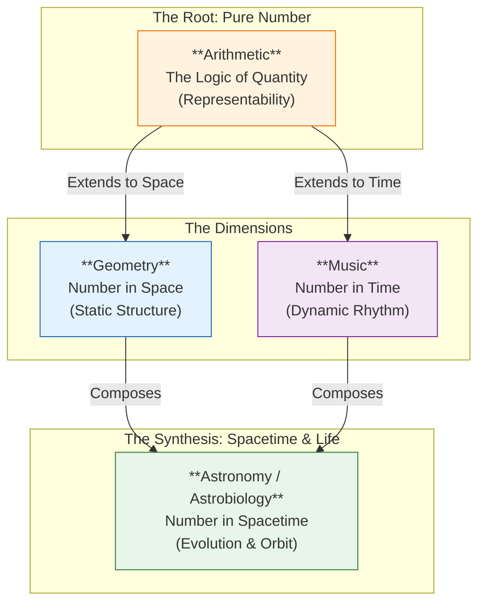
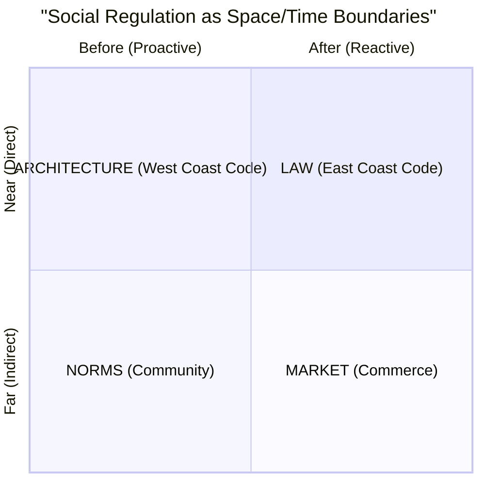

# Prologue of Spacetime: Structure and Vision

> *"The ultimate rhetoric does not speak; it shows. The ultimate continuation does not wait; it flows."*

The **Prologue of Spacetime** is not merely a story or a curriculum; it is a **Meta-Game of Continuation** designed to act as a **Brain Factory**—a systematic engine for manufacturing cognitive capability and sovereign intelligence.

This document explains the architectural structure of the project and how it leverages **Hoare Logic**, the **Cubical Logic Model**, and the **GASing Methodology** to realize the vision of a "Brain Factory" that produces **Verified Wisdom**.

## 1. The Structure: A Standardized Assembly Line

To manufacture high-quality cognitive artifacts, we need a standardized "assembly line" defined by the intersection of **Pedagogy** and **Universal Reality**.

### The 12-Chapter Matrix (Trivium × Quadrivium)

The project is structured as a 3×4 matrix, creating 12 distinct "stations":

| | **Arithmetic** (Numbers) _Efficient Representation_ | **Geometry** (Space) _Transformations_ | **Music** (Time) _Harmonic Ratios_ | **Astronomy** (Spacetime) _Consensus Verification_ |
| :--- | :--- | :--- | :--- | :--- |
| **Rhetoric** (Value/Why) | **Ch 1**: Counting Value | **Ch 2**: Deep Shape | **Ch 3**: Rhythm Power | **Ch 4**: True Observation |
| **Logic** (Process/What) | **Ch 5**: Resource Allocation | **Ch 6**: Pathfinding | **Ch 7**: Causality | **Ch 8**: Orbit Prediction |
| **Grammar** (Structure/How) | **Ch 9**: Schema Definition | **Ch 10**: Topology | **Ch 11**: Lifecycle | **Ch 12**: Coordination |

### Historical Anchors

Every station is grounded in the lineage of three historical archetypes:

1.  **Gottfried Wilhelm Leibniz**: For the **Monadology** and "Pre-Established Harmony."
2.  **C.A.R. Hoare**: For the **Hoare Logic** of Correctness $\{P\} C \{Q\}$.
3.  **John Amos Comenius**: For the **Didactic** vision of universal education (*Orbis Pictus*).

## 2. The Logic of Correctness: Hoare Triples

The core "Physics" of the Brain Factory is **Correctness**. We do not just "do things"; we **prove things**. We rely on the concept of the **Hoare Triple**:

$$ \{P\} \ C \ \{Q\} $$

Where:
*   **$P$ (Precondition)**: The State before action (The Need/Rhetoric).
*   **$C$ (Command)**: The Action itself (The Logic/Process).
*   **$Q$ (Postcondition)**: The State after action (The Result/Grammar).

### The MVP Card Implementation

We operationalize Hoare Logic using our **MVP Cards**:

All MVP Cards are stored in the format of $MCard$.

*   **$\{P\}$ = $VCard_{pre}$** (Safety Protection): The Immutable State (Inventory, Schemas).
*   **$C$ = $PCard$** (Process): The Polynomial Functor (Agents, Scripts).
*   **$\{Q\}$ = $VCard_{post}$** (Verification and Validation): The Witness that proves the Command satisfied the Need.

## 3. The Meta-Language: Cubical Logic Model (CLM)

How do we ensure that Humanities (Rhetoric), Engineering (Logic), and Law (Grammar) speak the same language? We use the **Cubical Logic Model (CLM)** as the **Universal Meta-Language**.

The CLM maps all reality into a 3-Dimensional Vector Space:

| Dimension | Hoare Component | Experience Role | Monadic Role |
| :--- | :--- | :--- | :--- |
| **1. Abstract (Value)** | **Precondition ($P$)** | **Rhetoric**: The Intent, the Spec, the "Why". | **Reader Monad** (Context) |
| **2. Concrete (Impl)** | **Command ($C$)** | **Logic**: The Code, the Execution, the "How". | **State Monad** (Transformation) |
| **3. Balanced (Truth)** | **Postcondition ($Q$)** | **Grammar**: The Test, the Verification, the "What". | **Writer/IO Monad** (Witness) |

### Consensus via Pre-Established Harmony

In the Brain Factory, we achieve **Consensus** not by endless debating (negotiation), but by **Vector Alignment** (Pre-Established Harmony).

*   If your **Abstract Spec** (Intent) and your **Concrete Impl** (Code) and your **Balanced Expectations** (Tests) are aligned in the CLM Vector Space, you have achieved **Correctness**.
*   This makes CLM the **Protocol of Truth**—a language that is equally readable by Humans (Language), Machines (Code), and Institutions (Law).

## 4. The Engine: GASing Methodology

The **Prologue of Spacetime** is **Powered by GASing**—a pedagogical engine that drives the user through the CLM dimensions.

| Component | GASing Principle | Technical Equivalent | Factory Role |
| :--- | :--- | :--- | :--- |
| **Gampang** | **Easy** | **Arithmetic / Type Theory** | The **Conveyor Belt**. Strict types ensure parts fit. |
| **Asyik** | **Fun** | **Logic / Hoare Command** | The **Assemblers**. Turning logic into engaging Games to drive the Action ($C$). |
| **Menyenangkan** | **Enjoyable** | **Rhetoric / Digital Synesthesia** | The **Quality Control**. The visceral feedback of "Correctness" (the system "hums"). |

## 5. The Vision: The Brain Factory

The image **`media/BrainFactory_poweredByGASing.png`** encapsulates the goal. We are building a machine that takes in **Human Attention** and produces **Sovereign Intelligence**.

### 5.1 From Passive Content Repeaters to Decision Makers

In the Brain Factory:
*   The Student's decision behavior is modeled as **Maxwell's Demon.**
*   Their job is to sit at the Edge and use **Hoare Logic** to filter Entropy.
*   They only allow "Correct" information (Valid VCards) to pass into the Sovereign Network.

### 5.2 Digital Synesthesia: The Instrument Panel

How does the Demon verify Correctness? Through **Digital Synesthesia**.
*   Instead of reading log files (Slow), the operator "feels" the system's state.
*   **Correctness** ($P \to Q$) feels "Harmonic."
*   **Error** feels "Dissonant."

### 5.3 The Revived Quadrivium: Arithmetic as the Universal Representable

The **Prologue of Spacetime** revives the classical Quadrivium not as separate subjects, but as a unified **Hierarchy of Representability**.

*   **Arithmetic** is not just "counting"; it is the **Mechanism of Reasoning**.
*   All other domains are simply **Arithmetic projected into new dimensions**.

### 5.4 The Arithmetization of Reality

Why Arithmetic? Because it is the only domain that is purely **Representable** (Discrete).

1.  **Geometry is Arithmetized Space**: Coordinates $(x, y, z)$ allow us to reason about shape using numbers (Analytic Geometry).
2.  **Music is Arithmetized Time**: Frequencies ($Hz$) and Beats ($BPM$) allow us to reason about flow using numbers (Signal Processing).
3.  **Astrobiology is Arithmetized Spacetime**: When Geometry (Environment) meets Music (Cycles), we get **Life** (Orbits/Evolution).

This delineation is critical: We do not study these subjects as "Arts"; we study them as **Computational Primitives**.

### 5.5 Social Governance: Lessig's Four Modalities as Space/Time Boundaries

The Quadrivium (§5.3–5.4) gives us the **physical** dimensions of Space and Time. But the Brain Factory is also a **social** system—humans coordinating under constraints. The question becomes: *how do social boundaries decompose along the same Space/Time axes?*

**Lawrence Lessig's Four Modalities of Regulation** (from *Code v2*) answer this precisely. Lessig identified four forces that regulate behavior—**Law**, **Norms**, **Market**, and **Architecture (Code)**—and these map onto two orthogonal axes that mirror the Quadrivium:

| Axis | Quadrivium Analog | Governance Meaning |
| :--- | :--- | :--- |
| **Near / Far** | **Geometry** (Space) | How *directly* does the constraint touch the individual? |
| **Before / After** | **Music** (Time) | *When* does regulation act—proactively or reactively? |

#### The Governance Quadrant

| | **Before** (Proactive) | **After** (Reactive) |
| :--- | :--- | :--- |
| **Near** (Direct) | **Architecture** (Code) — Prevents by construction | **Law** — Punishes after violation |
| **Far** (Indirect) | **Norms** — Shapes expectations via socialization | **Market** — Adjusts via price signals |

#### Connection to the Quadrivium and CLM

This decomposition reveals that the Quadrivium's axes are not merely physical—they are the **same axes** that organize all social regulation:

*   **Geometry (Space) → Near/Far**: Architecture is a wall you cannot walk through (Near); Market is a price signal from a distant exchange (Far). The *spatial proximity* of the constraint determines its modality.
*   **Music (Time) → Before/After**: Norms shape you *before* you act (socialization, expectation); Law judges you *after* you act (enforcement, sanction). The *temporal position* of the constraint determines its character.
*   **Astronomy (Spacetime) → Full Governance**: Complete governance requires *both* axes simultaneously—just as Astronomy composes Geometry and Music into orbital dynamics. In recursion-scheme terms, this is the product of **Chronomorphism** (temporal: Architecture + Norms) and **Toposmorphism** (spatial: Law + Market).

In the CLM, each modality maps to a verifiable dimension:

| Lessig Modality | CLM Dimension | Hoare Component |
| :--- | :--- | :--- |
| **Architecture** | Abstract Spec | Precondition $\{P\}$ — what the system *prevents* |
| **Norms** | Abstract Spec | Precondition $\{P\}$ — what the community *expects* |
| **Law** | Balanced Expectations | Postcondition $\{Q\}$ — what is *judged* after the fact |
| **Market** | Balanced Expectations | Postcondition $\{Q\}$ — what *price* is exacted |
| **All Four** | Concrete Impl | Command $C$ — the regulated *action* itself |

> **The Deep Insight**: *Regulation is the social manifestation of Space/Time boundaries.* The choice of how to govern a system is isomorphic to the choice of where to draw boundaries in Space (Near/Far) and Time (Before/After)—the same boundaries the Quadrivium teaches us to reason about with Arithmetic. This means the Brain Factory does not merely *teach* Space and Time; it *governs* by Space and Time.

### 5.6 The Agentic Mesh: The Workforce

The factory is staffed by an **Agentic Mesh**—autonomous AI agents orchestrating the workflow.

*   **The User** sets the *Abstract Spec* (Rhetoric).
*   **The Agents** execute the *Concrete Impl* (Logic).
*   **The Framework** verifies the *Balanced Expectation* (Grammar).

## 6. The Mathematical Engine: Universal Grammar & Boundedness

The **Brain Factory** constitutes a **Representable System**. By this, we mean it satisfies the categorical definition of **Representability** (via the Yoneda Lemma): *Identity (Truth) emerges entirely from relationships (morphisms).*

### 6.1 The Unifying Formula: Polynomial Functors

At the heart of the **Cubical Logic Model (CLM)** is the **Polynomial Functor**, which allows us to treat all Logic, Data, and Layout as a single algebraic structure:

$$ P(X) = \sum_{i \in I} A_i \times X^{B_i} $$

Why Polynomials? Because they enforce **Decomposition into Boundaries**.

*   **$A_i$ (Position)**: The **MCard** (Memory). It represents the **State**.
*   **$X^{B_i}$ (Direction)**: The **PCard** (Process). It represents the **Choice**.
*   **Finite Basis**: Unlike continuous functions which can be infinite, a Polynomial forces us to define a **Finite Menu** of choices ($B_i$). This is the first step of **Bounded Rationality**.

### 6.2 Representability Enables Observability

Because the system is **Representable** (defined by relationships), it is inherently **Observable**.

*   **Yoneda Lemma**: Counting the morphisms (relationships) gives us the complete structure of the object.
*   **Telemetry**: By tracking the "Flow" (morphisms) between MCards using the CLM, we automatically generate the **Balanced Expectations ($B$)** required for verification.
*   **Boundedness**: We strictly define the **Region of Convergence (ROC)**—we only claim sovereignty over what we can represent and observe. (No Hallucination).

### 6.3 Resource as Damping: The Laplace Transform

We live in a world of limited energy. The "Universal Grammar" ($f = \sum c_k \cdot \phi_k$) includes a hidden term: the **Damping Factor** ($\sigma$).

*   **The Cost of Truth**: Every term in the polynomial requires energy (Compute/Attention).
*   **Laplace Damping**: We apply a filter $e^{-\sigma t}$ to our reality. If a signal determines a cost higher than our Energy ($E$), it is damped to zero.
*   **Region of Convergence (ROC)**: This defines our **Sovereignty**. We only claim simple truth over what falls within our ROC. Outside this boundary, we do not hallucinate; we simply say "Undefined."

### 6.4 Accounting as Verification (Convergence)

If Resources define the Boundary, **Accounting** is the measurement of **Convergence**.

*   **Algebraic Accounting**: We track the "Energy Budget" ($c_k$) for every MCard.
*   **Verification**: A process is "True" (Correct) if and only if it **Converges** (stays within Budget) inside the ROC.
*   **The VCard**: It is the "Balance Sheet" that proves convergence. It certifies that the "Input Energy" resulted in a "Valid Output" without creating "Debt" (Hallucination/Entropy).

### 6.5 Decomposition (The Reverse Trivium)

We take the complex signal of Reality ($f$) and decompose it via the **Universal Grammar**:

*   **Basis ($\phi_k$)**: The **MCards**.
*   **Coefficients ($c_k$)**: The **GASing Meta-Data** (Energy/Importance).

This turns "Education" into "Signal Processing"—filtering noise to reveal the Signal of Truth within our affordable bandwidth.

## Conclusion

The **Prologue of Spacetime** solves the problem of complexity by operationalizing the **Universal Grammar of Decomposition**. By treating every action as a **Hoare Triple** and every concept as a weighted sum of **Cubical Vectors** (`Spec`, `Impl`, `Exp`), we standardize the production of wisdom.

Moreover, by recognizing that **Lessig's Four Modalities of Regulation** decompose along the Quadrivium's own axes—**Space (Near/Far)** and **Time (Before/After)**—we unify the physical and social dimensions of the project. The Brain Factory does not merely *teach* Space and Time as abstract subjects; it *governs* by Space and Time, using Architecture, Norms, Law, and Market as the four boundary conditions of any coordinated human activity.

We do not just teach; we **Verify**. We do not just dream; we **Converge**. We do not just regulate; we **Govern by the same Space/Time boundaries we teach**.