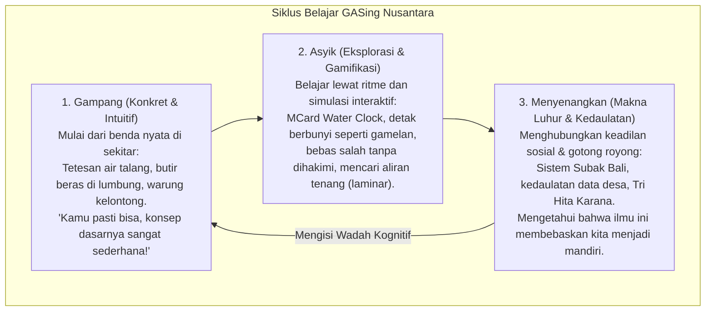
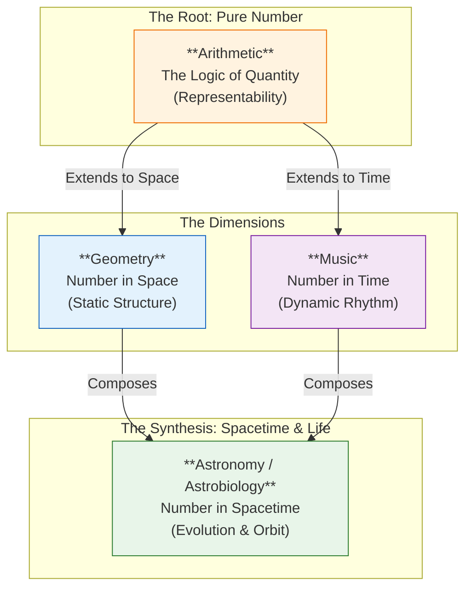
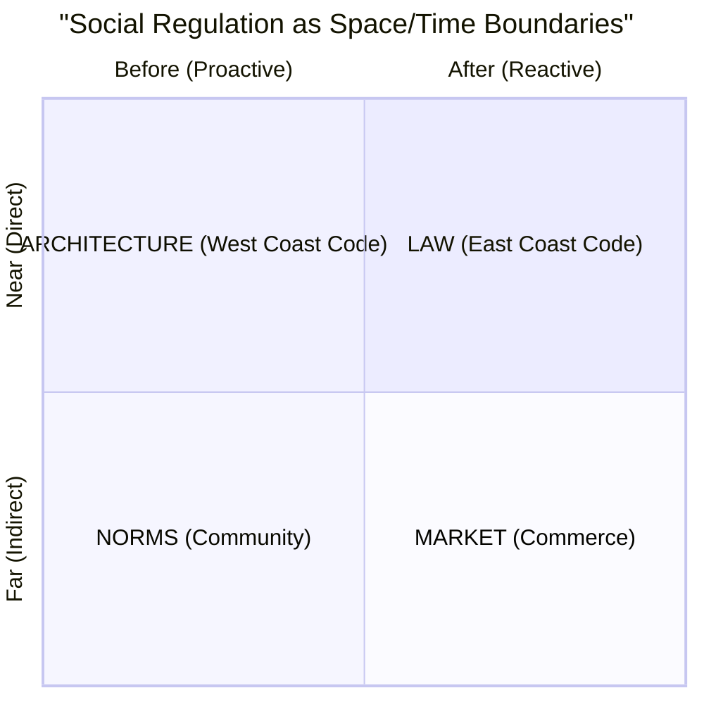

# Prologue of Spacetime: Structure and Vision

> *"The ultimate rhetoric does not speak; it shows. The ultimate continuation does not wait; it flows."*

> 🇮🇩 **Catatan untuk Pembelajar Indonesia**: Selamat datang di *Prologue of Spacetime*! Jika ini pertama kalinya Anda membaca istilah-istilah seperti *HoTT*, *Logika Hoare*, atau *Termodinamika Komputasi*, jangan merasa gentar atau terasing. Seluruh kurikulum ini dibangun di atas filosofi **GASing (Gampang, Asyik, Menyenangkan)**. Lompatlah langsung ke **[Bagian 4.4: Pedagogi GASing Nusantara](#44-pedagogi-gasing-nusantara-jembatan-belajar-dari-nol-untuk-pembelajar-indonesia)** untuk melihat bagaimana kami memulai semua ini dari pengalaman sehari-hari: dari tetesan air talang, butir beras di lumbung, dan sistem irigasi Subak Bali. Anda pasti bisa!

The **Prologue of Spacetime** is not merely a story or a curriculum; it is a **Meta-Game of Continuation** designed to act as a **Brain Factory**—a systematic engine for manufacturing cognitive capability and sovereign intelligence.

This document explains the architectural structure of the project and how it leverages **Hoare Logic**, the **Cubical Logic Model (CLM)**, **Homotopy Type Theory (HoTT)**, and the **GASing Methodology** to realize the vision of a "Brain Factory" that produces **Verified Wisdom**. The methodology transitions humanity from an extraction-based "consumption economy" to a sharing-based "data economy" by **"Flipping the Script"**—moving away from a grammar-first education (starting with rigid rules) toward a **Reverse Trivium** model (Rhetoric → Logic → Grammar) that prioritizes context and reality.

> **Foundational Insight**: We treat **Equality** not as a boolean check, but as a **Path** between points in a space (HoTT). This allows us to unify **Logic** (Types) with **Geometry** (Topological Shapes), providing the rigorous grounding for a truly Universal Namespace where Proofs are Paths and Types are Spaces.

## 1. The Structure: A Standardized Assembly Line

To manufacture high-quality cognitive artifacts, we need a standardized "assembly line" defined by the intersection of **Pedagogy** and **Universal Reality**.

### The 12-Chapter Matrix (Trivium × Quadrivium)

The project is structured as a 3×4 matrix, creating 12 distinct "stations", each operationalized by an executable civilizational game sprint:

|                                   | **Arithmetic** (Numbers)_Efficient Representation_ | **Geometry** (Space)_Transformations_                                                          | **Music** (Time)_Harmonic Ratios_ | **Astronomy** (Spacetime)_Consensus Verification_ |
| :-------------------------------- | :--------------------------------------------------------- | :----------------------------------------------------------------------------------------------------- | :---------------------------------------- | :-------------------------------------------------------- |
| **Rhetoric** (Value/Why)    | **[[chapters/01_The_Value_of_Counting                      | Ch 1: Counting Value]]**↳ [[docs/sprints/epoch-01-microcosmic-physics/SPRINT-01-GRANULAR-TIDEPOOL     | Sprint 01: Granular Tidepool]]            | **[[chapters/02_The_Meaning_of_Shape                      |
| **Logic** (Process/What)    | **[[chapters/05_Resource_Allocation                        | Ch 5: Resource Allocation]]**↳ [[docs/sprints/epoch-02-ecosystemic-emergence/SPRINT-05-YONEDA-BAZAAR  | Sprint 05: Yoneda Bazaar]]                | **[[chapters/06_Network_Pathfinding                       |
| **Grammar** (Structure/How) | **[[chapters/09_Counting_Water                             | Ch 9: Schema Definition]]**↳ [[docs/sprints/epoch-03-collective-computation/SPRINT-09-HYDRAULIC-VAULT | Sprint 09: Hydraulic Vault]]              | **[[chapters/10_Rice_Terrace_Topology                     |

### 1.1 The Operational Sprints & Civilizational Epochs

Every chapter in this curriculum is directly realized through a verified, playable strategy game sprint documented in [[docs/sprints/README|docs/sprints/]]. The 12 primary game sprints are organized into four ascending **Civilizational Epochs**, unified under [[docs/sprints/07-master-orchestration/SPRINT-00-MASTER-ORCHESTRATION|Sprint 00: Master Orchestration Plan]]:

1. **Epoch I: The Primordial Sensorium (Why / Rhetoric Era — Ch 01–04)**: Microcosmic physics, Shannon entropy sieving ($\Delta H < 0$), Gauss-Bonnet curvature ($\sum (\pi - \alpha_i) = 2\pi$), Kuramoto phase synchronization ($r \to 1$), and Huber consensus on multi-observer parallax ($\sigma^2 \to 0$).
2. **Epoch II: The Sovereign Tribal Mesh (What / Logic Era — Ch 05–08)**: Dual-category Yoneda test probe barter, topological Reticulum mesh routing (Edmonds-Karp max flow), Petri net non-commutative causality ($A \circ B \neq B \circ A$), and astrodynamic monodromy stability ($\text{Tr}(\mathcal{M}) < 2$).
3. **Epoch III: The Sheaf Metamaterial (How / Grammar Era — Ch 09–11)**: Typed double-entry water ledger conservation ($\int Q_{\text{in}} dt - \int Q_{\text{out}} dt = \Delta V$), topographic sheaf gluing with vanishing Čech cohomology ($H^1 = 0$), and Kotekan ceremonial interleaving collapsing Little's Law queues ($W_q \equiv 0$).
4. **Epoch IV: The Planetary Noosphere (Transcendent Era — Ch 12)**: Impredicative calendar coordination, multi-temporal sheaf synchrony, and Tri Hita Karana stationary action ($\delta \mathcal{S}_{\text{THK}} > 0$).

> [!IMPORTANT]
> **The Player's Axiom**: *"Knowledge is free, but judgment is not! Knowledge as written or published content can be attained rather publicly in various commons, but using the knowledge in privately interested or self-resolved choices will reveal the color of that person."*
> Sprints force participants to make non-trivial trade-offs between extractive private utility and regenerative communal flourishing (Gotong Royong). These choices determine the player's chromatic signature and societal health.

> [!NOTE]
> **Vibration, Free Will, and the Energy Cost of Coherence**: Vibration and perturbation represent the physical substrate of agency—the ability of physical systems to jump between counterfactual realities and explore off-shell trajectories. The cost of returning to a mutually consistent, order-preserving entry is the irreducible "energy" (work, action, and Landauer dissipation) that collective systems must pay.

> [!TIP]
> **Mental Model to Formal Algebra Mapping (AoS & GAT-P)**: Each chapter pairs an intuitive **Mental Model** (e.g. Sieve Demon, Fortress Membrane, Flocking Swarm, Slingshot Orbit) with a **Formal Algebraic Signature** $\Sigma = (S, \Omega, \mathcal{E})$ and a Baldwin modular operator (Splitting, Substituting, Augmenting, Excluding, Inverting, Porting), verified by the automated test suite `src/civilizational_sprint_engine.py`.

### Historical Anchors

Every station is grounded in the lineage of three historical archetypes:

1. **Gottfried Wilhelm Leibniz**: For the **Monadology** and "Pre-Established Harmony."
2. **C.A.R. Hoare**: For the **Hoare Logic** of Correctness $\{P\} C \{Q\}$.
3. **John Amos Comenius**: For the **Didactic** vision of universal education (*Orbis Pictus*).

### Logical Depth Badges (The Big Five of Reverse Mathematics)

Each chapter operates at a specific **Logical Depth** corresponding to the Big Five subsystems of Reverse Mathematics. This "depth meter" tells participants which axiom system governs the concepts they are engaging with:

| Big Five Subsystem                                | Logical Depth                                           | Prologue Concepts                                           | Chapter(s)  |
| :------------------------------------------------ | :------------------------------------------------------ | :---------------------------------------------------------- | :---------- |
| **$RCA_0$** (Computable)                  | Level 1: Things you can*compute*                      | Counting, basic arithmetic, GASing operations, MVP Cards    | Ch 1, 5, 9  |
| **$WKL_0$** (Compact)                     | Level 2: Things you can*choose* from infinite options | Compactness, "best path" in a network, spatial optimization | Ch 2, 6, 10 |
| **$ACA_0$** (Arithmetical)                | Level 3: Things*defined by* arithmetic                | Convergence, the Turing Jump, harmonic analysis             | Ch 3, 7, 11 |
| **$ATR_0$** (Transfinite)                 | Level 4: Things requiring*transfinite iteration*      | Well-orderings, iterated procedures, calendar cycles        | Ch 4, 8     |
| **$\Pi^1_1\text{-}CA_0$** (Impredicative) | Level 5: Things*defined by reference to all sets*     | Self-reference, self-aware causal networks, Tri Hita Karana | Ch 12       |

## 2. The Logic of Correctness: Hoare Triples and SSOT as Protocol

The core "Physics" of the Brain Factory is **Correctness**. We do not just "do things"; we **prove things**. We rely on the concept of the **Hoare Triple**:

$$
\{P\} \ C \ \{Q\}
$$

Where:

* **$P$ (Precondition)**: The State before action (The Need/Rhetoric).
* **$C$ (Command)**: The Action itself (The Logic/Process).
* **$Q$ (Postcondition)**: The State after action (The Result/Grammar).

### The MVP Card Implementation

We operationalize Hoare Logic using our **MVP Cards**:

All MVP Cards are stored in the format of $MCard$.

* **$\{P\}$ = $VCard_{pre}$** (Safety Protection): The Immutable State (Inventory, Schemas).
* **$C$ = $PCard$** (Process): The Polynomial Functor (Agents, Scripts).
* **$\{Q\}$ = $VCard_{post}$** (Verification and Validation): The Witness that proves the Command satisfied the Need.

### SSOT as Verification Protocol (Tao Generates One)

The **Single Source of Truth (SSOT)** is not a static database—it is a **dynamically evolving, contextually dependent protocol** for determining what counts as truth in a given system. This reframe follows the ancient generative sequence *Tao Generates One* (Directionality gives birth to Unity):

1. **The Way (Directionality)**: Non-commutative operations establish order. Without directionality, no verification sequence can exist.
2. **One (SSOT)**: Unified verification protocol emerges from directed processes.
3. **Two (Duality)**: Binary distinction (True/False, Valid/Invalid) follows.
4. **Three (Triad)**: Grammar-Logic-Rhetoric; MCard-PCard-VCard; Abstract-Balanced-Concrete.
5. **Ten Thousand Things (All Things)**: Complete knowledge systems unfold from the triadic structure.

| SSOT Design Principle      | Description                                                                         |
| :------------------------- | :---------------------------------------------------------------------------------- |
| **Procedural**       | "Follow this procedure to determine truth"—not "this database contains the truth." |
| **Context-Explicit** | Verification must specify axioms, domain, and environment.                          |
| **Verifiable**       | Anyone following the protocol can verify independently.                             |
| **Adaptive**         | The protocol yields consistent results across changing contexts.                    |
| **Composable**       | Protocols compose: FTA + Goedel + GASing = Arithmetic reasoning stack.              |

## 3. The Meta-Language: Cubical Logic Model (CLM)

How do we ensure that Humanities (Rhetoric), Engineering (Logic), and Law (Grammar) speak the same language? We use the **Cubical Logic Model (CLM)** as the **Universal Meta-Language**.

The CLM maps all reality into a 3-Dimensional Vector Space:

| Dimension                     | Hoare Component                 | Experience Role                                            | Monadic Role                           |
| :---------------------------- | :------------------------------ | :--------------------------------------------------------- | :------------------------------------- |
| **1. Abstract (Value)** | **Precondition ($P$)**  | **Rhetoric**: The Intent, the Spec, the "Why".       | **Reader Monad** (Context)       |
| **2. Concrete (Impl)**  | **Command ($C$)**       | **Logic**: The Code, the Execution, the "How".       | **State Monad** (Transformation) |
| **3. Balanced (Truth)** | **Postcondition ($Q$)** | **Grammar**: The Test, the Verification, the "What". | **Writer/IO Monad** (Witness)    |

### Consensus via Pre-Established Harmony

In the Brain Factory, we achieve **Consensus** not by endless debating (negotiation), but by **Vector Alignment** (Pre-Established Harmony).

* If your **Abstract Spec** (Intent) and your **Concrete Impl** (Code) and your **Balanced Expectations** (Tests) are aligned in the CLM Vector Space, you have achieved **Correctness**.
* This makes CLM the **Protocol of Truth**—a language that is equally readable by Humans (Language), Machines (Code), and Institutions (Law).

### 3.1 Chapter Architecture: The Type Lattice Principle (CLM Stratification U0–U5)

Every chapter in the 12-Chapter Matrix is not merely a collection of essays; it is a **formally verifiable Type Space**. To prevent semantic drift and ensure rigorous computability, **every Chapter must have a dedicated Type Lattice** specifically focused on and tailored to the relevant concepts, physical instruments, mathematical entities, and invariants of that chapter.

#### The 6-Tier Universe Stratification (Powered by `clm-kernel`)

Grounded in Homotopy Type Theory (HoTT) universe stratification and operationalized programmatically by the **`clm-kernel`** npm package, each chapter's Type Lattice is organized into six ascending Universe Levels ($U_0$ through $U_5$):

| Universe Level | CLM Stratum (`clm-kernel`) | Architectural Role | Chapter Entity Manifestation |
|:---|:---|:---|:---|
| **$U_0$** | **`mcard_cas`** | **Static Content-Addressable Storage (CAS)** | The irreducible, windowless atomic data units; cryptographic hashes (CIDs), raw tokens, discrete coordinates. |
| **$U_1$** | **`pcard_net`** | **Linear Transitions & Dynamic State Machines** | The state transformation functions, Colored Petri Net (CPN) firings, polynomial functors, physical/simulated ADC transitions. |
| **$U_2$** | **`vcard_proof`** | **Cryptographic Verification & Hoare Receipts** | The boundary conditions, Hoare sandwiches $\{P\} C \{Q\}$, Landauer dissipation limits, conservation laws, invariant proofs. |
| **$U_3$** | **`satori_fiber`** | **Distributed Reticulum Mesh & Satori Speech Acts** | Dialectic turns, multi-agent protocol messages, auditory/visual pulse streams, elder guidance speech acts. |
| **$U_4$** | **`membrane_ui`** | **Omnichannel Interaction Surface & Generative Hypermedia** | The human-machine interaction membrane; interactive browser applications, tactile buttons, real-time meter visualizations. |
| **$U_5$** | **`meta_gamma`** | **Meta-Circular Continuous Learning Stratum (Loop $\Gamma$)** | Pedagogical feedback loops, epistemic fitness evaluation, parameter adaptation between laminar and turbulent regimes, GASing Flow State. |

#### Structural Rule: Stratified Embedding

In accordance with Voevodsky's univalence axiom and Martin-Löf type theory, the Type Lattice enforces strict stratification via `clm-kernel`:
$$\text{Level}(A) \le \text{Level}(B) \implies A \text{ can embed into } B$$
Verified programmatically by `isStratified(innerLevel, outerLevel)` from `clm-kernel`, ensuring no circular impredicative leaks occur below the foundational strata.

### 3.2 Decoupled Multilingual Translation Architecture (Externalized JSON & Four-Language Standard)

To uphold the **Local-First** and **Frictionless Entry** principles across international boundaries and civilizational traditions, **in this cycle of content production, all content must be written in four languages**:

1. 🇮🇩 **Bahasa Indonesia (`id`)**: Accessible, warm, grounded in Nusantara everyday life and agricultural engineering metaphors (e.g. Subak water allocation, gotong royong, bamboo sluice ADC).
2. 🕉️ **Sanskrit / Balinese Sanskrit (`sa`)**: The classical sacred language as taught and preserved in Bali (Pasraman and traditional academies), providing foundational etymological rigor, metaphysical precision (*Tri Hita Karana*, *Pramāṇa*, *Jala-Ghaṭikā*, *Śūnyatā*, *Karma-Phala*), and the civilizational bridge between ancient cosmic order (*Ṛta*) and computational type theory.
3. 🇬🇧 **English (`en`)**: Rigorous, technical, aligned with international scientific, category-theoretic, and HoTT terminology.
4. 🇹🇼 **Traditional Chinese (`zh-TW`)**: 正體中文 / 繁體中文 — culturally resonant, mathematically precise, strictly utilizing `MCard` / `單子牌`, always translating `Hypercard` as **`超媒體卡牌`** (and strictly prohibiting the erroneous literal mistranslation `超卡`).

#### The Decoupling Mandate
1. **Pristine Mathematical & Execution Logic**:
   - The Type Lattice structure, state machine code, thermodynamic equations, and audio synthesis routines must NEVER contain hardcoded natural-language prose, UI labels, or localized strings.
2. **Externalized Multilingual Repository (`locales.json` & `type_lattice_locales.json`)**:
   - Every chapter must provide its complete natural language explanations, Elder dialogues, telemetry alerts, pedagogical hints, and UI titles in an external, standardized JSON file simultaneously populated across all four canonical languages (`id`, `sa`, `en`, `zh-TW`).
3. **Zero-Code-Change Expansion**:
   - Adding additional languages in subsequent cycles (e.g. Japanese `ja`, German `de`, or Arabic `ar`) requires only appending a new language keyblock to the external JSON files. The underlying `clm-kernel` Type Lattice, Node.js scripts, and browser simulations remain untouched and 100% verified.

## 4. The Engine: GASing and the Kenosis Principle

 The **Prologue of Spacetime** is **Powered by GASing**—a pedagogical engine that drives the user through the CLM dimensions. This methodology is grounded in the operational theology of **Kenosis** (Self-Emptying).

### 4.1 The Empty Schema Principle

 To build a **Universal Namespace**, we must start with an **Empty Schema** (Zero Assumptions). Just as Kenosis describes the "emptying of self" to receive "infinite capacity," our system starts with minimal assumptions (`Spec`, `Impl`, `Exp`) to enable the hosting of **any domain**.

| Component              | GASing Principle    | Technical Equivalent                     | Kenotic Analog                                                                                |
| :--------------------- | :------------------ | :--------------------------------------- | :-------------------------------------------------------------------------------------------- |
| **Gampang**      | **Easy**      | **Arithmetic / Type Theory**       | **Filling**: The result. Strict types ensure the "vessel" holds Truth without leaking.  |
| **Asyik**        | **Fun**       | **Logic / Hoare Command**          | **Emptying**: The process. Shedding rigid preconceptions to allow "play" (Exploration). |
| **Menyenangkan** | **Enjoyable** | **Rhetoric / Digital Synesthesia** | **Surrender**: The intent. Aligning with the "Vibe" (Pre-Established Harmony).          |

### 4.2 Engineering Kenosis: The 4 Operational Rules

 We operationalize "Self-Emptying" as rigorous engineering constraints:

1. **Principle of Least Assumption**: Minimize the Rank of the Schema. Hardcode nothing but the primitives.
2. **Principle of Maximum Receptivity**: Maximize the Nullity (Null Space). Be ready to accept any well-formed data.
3. **Principle of Constant Surrender**: Continuous Verification (Zero Trust). Trust nothing inherent; verify everything against the Root.
4. **Principle of Progressive Sanctification**: Iterative Alignment. Continuously refactor towards the "Fixed Point" of Perfect Compliance.

### 4.3 The Operational Goal: Engineering Flow State

The ultimate purpose of these engineering rules is to sustain **[[Hub/Theory/Integration/Flow in PKC - Faster Interactive Learning|Flow State]]**. Flow is not merely a "nice-to-have"; it is the **necessary operational condition** for the distinct type of "Extreme Learning" the Brain Factory demands.

We achieve this by systematically removing the two primary inhibitors of Flow:

1. **Temporal Friction (Latency)**:

   * *Problem*: Network lag (>100ms) breaks the cognitive feedback loop, turning the tool from "ready-to-hand" (extension of self) to "present-at-hand" (obstacle).
   * *Solution*: The **[[Hub/Tech/Local-first Principle|Local-first Principle]]**. By keeping the Source of Truth local, we ensure **Zero-Latency Interaction**. The tool responds instantly, preserving the **Rhythm** of thought (Music).
2. **Structural Friction (Rigidity)**:

   * *Problem*: Forcing a learner to categorize an idea *before* they understand it (e.g., "Which folder does this go in?") breaks their concentration.
   * *Solution*: The **[[Hub/Theory/Integration/The Empty Schema Principle|Empty Schema Principle]]**. We allow "Frictionless Entry" (Capture now, Structure later). The tool adapts to the user's mental model, ensuring the **Space** is always open (Geometry).

> **The Result**: When Latency = 0 and Structural Friction = 0, the PKC becomes a true **Mind's Eye**—a "Terminal Fixed Point" where the distinction between the Learner and the Tool dissolves.

#### PKC as the Operational Implementation

The **Personal Knowledge Container (PKC)** operationalizes these Flow State principles:

- **Browser-Based IDE**: Eliminates the latency of switching between local editor and remote server—edit server-side files directly in browser with near-zero latency
- **Local-First Architecture**: Primary copy of data resides on user's device; servers are secondary mirrors for synchronization
- **Portal Access**: Access local PKC instance from anywhere (browser/phone) while maintaining local-first sovereignty
- **AI Integration**: Natural language queries with terminal access enable frictionless interaction—ask questions instead of navigating complex UIs
- **Self-Hosted**: Runs on local hardware (Raspberry Pi) ensuring data sovereignty and eliminating dependency on external services

The image **`raw/assets/BrainFactory_poweredByGASing.png`** encapsulates the goal. We are building a machine that takes in **Human Attention** and produces **Sovereign Intelligence**.

### 4.4 Pedagogi GASing Nusantara: Jembatan Belajar dari Nol untuk Pembelajar Indonesia

Di banyak ruang kelas dan institusi pendidikan formal di Indonesia, matematika dan ilmu komputasi sering kali diajarkan secara terbalik (**Grammar-First**): siswa langsung dijejali rumus-rumus mati, simbol-simbol abstrak yang menakutkan, dan hafalan definisi kaku tanpa pernah diberi tahu *mengapa hal ini berharga bagi hidup mereka*. Akibatnya, timbul fenomena *math anxiety*—rasa takut, terasing, dan perasaan bahwa matematika tingkat tinggi hanyalah hak istimewa segelintir ilmuwan menara gading.

**Prologue of Spacetime** merombak total paradigma tersebut dengan mengadopsi **Metode GASing (Gampang, Asyik, Menyenangkan)** yang dipelopori oleh Prof. Yohanes Surya, dipadukan dengan kearifan peradaban Nusantara dan arsitektur komputasi modern. Kami percaya bahwa setiap anak bangsa, mahasiswa, maupun pengembang pemula di Indonesia—yang memulai dari titik nol mutlak—mampu menguasai teori tipe homotopi (HoTT), logika verifikasi (Hoare Logic), dan arsitektur sistem cerdas berdaulat, asalkan proses belajarnya mengikuti hukum alam kognitif manusia:

```mermaid
flowchart TD
    subgraph GASing["Siklus Belajar GASing Nusantara"]
        A["1. Gampang (Konkret & Intuitif)<br/>Mulai dari benda nyata di sekitar:<br/>Tetesan air talang, butir beras di lumbung, warung kelontong.<br/>'Kamu pasti bisa, konsep dasarnya sangat sederhana!'"]
        --> B["2. Asyik (Eksplorasi & Gamifikasi)<br/>Belajar lewat ritme dan simulasi interaktif:<br/>MCard Water Clock, detak berbunyi seperti gamelan,<br/>bebas salah tanpa dihakimi, mencari aliran tenang (laminar)."]
        --> C["3. Menyenangkan (Makna Luhur & Kedaulatan)<br/>Menghubungkan keadilan sosial & gotong royong:<br/>Sistem Subak Bali, kedaulatan data desa, Tri Hita Karana.<br/>Mengetahui bahwa ilmu ini membebaskan kita menjadi mandiri."]
    end
    C -->|"Mengisi Wadah Kognitif"| A
```

#### Tiga Tangga Emas GASing untuk Pemula

1. **GAMPANG (Easy — Tahap Konkret / Arithmetic)**:
   * **Prinsip**: *Jangan mulai dengan rumus, mulailah dengan sentuhan!*
   * **Penerapan**: Sebelum menyentuh aksioma Peano atau simbol $\mathbb{N}$, pembelajar diajak mengamati hal yang sangat akrab: *menetesnya air dari bambu pancuran* atau *menghitung butir beras*. Menghitung bukan sekadar angka di kertas ujian, melainkan tindakan nyata: **memberi batas yang jelas antara yang ada dan yang tiada**. Jika Anda bisa merasakan satu tetes air jatuh ke telapak tangan Anda, Anda sudah memahami dasar dari komputasi digital!

2. **ASYIK (Fun — Tahap Visual & Interaktif / Logic)**:
   * **Prinsip**: *Belajar itu bermain dengan aturan yang adil!*
   * **Penerapan**: Kami menyediakan instrumen langsung yang responsif dalam hitungan milidetik (*Local-First* tanpa kuota internet yang berat). Pembelajar memainkan game simulasi: menangkap tetesan air dalam tempo yang pas. Jika memencet terlalu cepat karena panik, mesin akan mendesis panas (*overheat*); jika terlalu lambat, air meluap. Pembelajar tertawa, mencoba lagi, dan secara alami merasakan sendiri apa itu *gesekan termodinamika* dan *efisiensi aliran tenang (laminar flow)*.

3. **MENYENANGKAN (Enjoyable — Tahap Makna & Peradaban / Rhetoric)**:
   * **Prinsip**: *Ilmu yang berharga adalah ilmu yang memuliakan manusia dan alam sekitar.*
   * **Penerapan**: Menghitung secara jujur dan transparan adalah fondasi dari **Amanah** dan **Gotong Royong**. Di Bali, sistem irigasi **Subak** telah berusia lebih dari seribu tahun; para petani membagi air secara matematis di pintu air (*taku*) bukan karena takut polisi, melainkan karena kesadaran spiritual dan keadilan sosial (**Tri Hita Karana**). Pembelajar Indonesia tidak diajak menjadi buruh ketik kode (*code monkey*) bagi korporasi multinasional, melainkan menjadi perancang kedaulatan teknologi (*Data Sovereignty*) untuk negeri sendiri.

#### Peta Metafora Nusantara dalam 12 Bab

| Bab | Ranah Pengetahuan | Metafora Budaya Nusantara | Konsep Teknologi Modern |
| :--- | :--- | :--- | :--- |
| **Bab 01** | **The Value of Counting** | *Pancuran Bambu & Menampi Beras* | ADC (Analog-to-Digital), Entropi Maxwell, MCard |
| **Bab 02** | **The Meaning of Shape** | *Anyaman Bambu & Rumah Panggung Toraja/Minang* | Topologi Ruang, Kompakness ($WKL_0$), PCard |
| **Bab 03** | **The Flow of Time** | *Irama Kotekan Gamelan & Ombak Pantai Selatan* | Sinkronisasi Fasa Kuramoto, Harmonik Waktu |
| **Bab 04** | **Consensus in Space** | *Musyawarah Mufakat Balai Desa & Perahu Pinisi* | Parallax Huber, Konsensus Multi-Pengamat |
| **Bab 05** | **Resource Allocation** | *Pasar Kaget & Warung Kelontong Gotong Royong* | Lemma Yoneda, Pertukaran Nilai Kategori Ganda |
| **Bab 06** | **Network Pathfinding** | *Jalur Rempah Maritim Nusantara & Sungai Kapuas* | Topologi Reticulum Mesh, Algoritma Aliran Maksimal |
| **Bab 07** | **Causal Concurrency** | *Keluarga Besar Menyiapkan Hajatan (Rewang/Kenduri)* | Jaringan Petri (Petri Nets), Kausalitas Non-Komutatif |
| **Bab 08** | **Orbital Navigation** | *Navigasi Bintang Nelayan Bugis-Makassar* | Monodromi Astrodinamika, Stabilitas Orbit |
| **Bab 09** | **Counting Water** | *Pintu Bagi Air (Taku) Sistem Subak Bali* | Double-Entry Hydraulic Ledger, Konservasi Volume |
| **Bab 10** | **Rice Terrace Topology** | *Terasering Sawah Jatiluwih & Pura Tirta Empul* | Teori Berkas (Sheaf Theory), Vanishing Čech Cohomology |
| **Bab 11** | **Rhythmic Interleaving** | *Pukulan Lesung Alu Penumbuk Padi & Gamelan Gong* | Little's Law Queuing Theory ($W_q \equiv 0$) |
| **Bab 12** | **Planetary Synchrony** | *Kalender Pranata Mangsa & Tri Hita Karana* | Impredicative Time, Keseimbangan Manusia-Alam-Ilahi |

Dengan jembatan pedagogis ini, setiap lembar dokumen dan kode program di dalam *Prologue of Spacetime* dirancang agar ramah, hangat, dan membangkitkan rasa ingin tahu anak-anak muda Indonesia sejak detik pertama mereka membukanya.

---

## 5. The Operational Mechanics: Maxwell's Demon, Synesthesia, and Quadrivium

### 5.1 Maxwell's Demon and the Thermodynamics of Zero Trust

 In the Brain Factory, the Student is modeled as **Maxwell's Demon**—a sovereign gatekeeper.

* **The Task**: Sort incoming information (Entropy) into "Useful" vs. "Noise."
* **The Tool**: The **VCard**, which acts as the **Kernel Specification**—defining exactly what is "annihilated" (Denied).
* **The Cost**: By **Landauer's Principle**, every bit of information filtered (erased) generates heat ($k_B T \ln 2$). **Security is not free.**
* **The Lesson**: The student learns that **Judgment requires Energy**. To be a "Decision Maker" is to pay the thermodynamic price of discernment.

### 5.2 Digital Synesthesia: The Instrument Panel

How does the Demon verify Correctness? Through **Digital Synesthesia**.

* Instead of reading log files (Slow), the operator "feels" the system's state.
* **Correctness** ($P \to Q$) feels "Harmonic."
* **Error** feels "Dissonant."

### 5.3 The Revived Quadrivium: Arithmetic as the Universal Representable

 The **Prologue of Spacetime** revives the classical Quadrivium not as separate subjects, but as a unified **Hierarchy of Representability**. These traditional disciplines are revived using modern instruments like digital scopes and microscopes to ground abstract concepts in tangible realities, cementing true **Universality**.

* **Arithmetic** is not just "counting"; it is the **Mechanism of Reasoning**.
* All other domains are simply **Arithmetic projected into new dimensions**.

```mermaid
 graph TD
    subgraph "The Root: Pure Number"
        AR["**Arithmetic**<br/>The Logic of Quantity<br/>(Representability)"]
    end

    subgraph "The Dimensions"
        GEO["**Geometry**<br/>Number in Space<br/>(Static Structure)"]
        MUS["**Music**<br/>Number in Time<br/>(Dynamic Rhythm)"]
    end

    subgraph "The Synthesis: Spacetime & Life"
        AST["**Astronomy / Astrobiology**<br/>Number in Spacetime<br/>(Evolution & Orbit)"]
    end

    AR -->|"Extends to Space"| GEO
    AR -->|"Extends to Time"| MUS
    GEO -->|"Composes"| AST
    MUS -->|"Composes"| AST

    style AR fill:#fff3e0,stroke:#ef6c00
    style GEO fill:#e3f2fd,stroke:#1565c0
    style MUS fill:#f3e5f5,stroke:#7b1fa2
    style AST fill:#e8f5e9,stroke:#2e7d32
```

### 5.4 The Arithmetization of Reality

Why Arithmetic? Because it is the only domain that is purely **Representable** (Discrete).

1. **Geometry is Arithmetized Space**: Coordinates $(x, y, z)$ allow us to reason about shape using numbers (Analytic Geometry).
2. **Music is Arithmetized Time**: Frequencies ($Hz$) and Beats ($BPM$) allow us to reason about flow using numbers (Signal Processing).
3. **Astrobiology is Arithmetized Spacetime**: When Geometry (Environment) meets Music (Cycles), we get **Life** (Orbits/Evolution).

This delineation is critical: We do not study these subjects as "Arts"; we study them as **Computational Primitives**.

### 5.5 Physics of Limits: Born-Infeld Electrodynamics

 Just as Special Relativity teaches us there is a **Maximum Speed ($c$)**, **Born-Infeld Electrodynamics** teaches us there is a **Maximum Field Strength ($b$)**.

* **The Metaphor**: The human mind has a "maximum cognitive field strength." Pushing beyond this leads to infinite self-energy (Burnout/Hallucination).
* **The Application**: Our curriculum respects the **Born-Infeld Bound**. We do not demand infinite attention; we demand **Bounded Correctness** within the student's energy budget.

### 5.5 Social Governance: Lessig's Four Modalities as Space/Time Boundaries

The Quadrivium (§5.3–5.4) gives us the **physical** dimensions of Space and Time. But the Brain Factory is also a **social** system—humans coordinating under constraints. The question becomes: *how do social boundaries decompose along the same Space/Time axes?*

**Lawrence Lessig's Four Modalities of Regulation** (from *Code v2*) answer this precisely. Lessig identified four forces that regulate behavior—**Law**, **Norms**, **Market**, and **Architecture (Code)**—and these map onto two orthogonal axes that mirror the Quadrivium:

| Axis                     | Quadrivium Analog          | Governance Meaning                                        |
| :----------------------- | :------------------------- | :-------------------------------------------------------- |
| **Near / Far**     | **Geometry** (Space) | How*directly* does the constraint touch the individual? |
| **Before / After** | **Music** (Time)     | *When* does regulation act—proactively or reactively?  |

#### The Governance Quadrant

|                          | **Before** (Proactive)                              | **After** (Reactive)                    |
| :----------------------- | :-------------------------------------------------------- | :-------------------------------------------- |
| **Near** (Direct)  | **Architecture** (Code) — Prevents by construction | **Law** — Punishes after violation     |
| **Far** (Indirect) | **Norms** — Shapes expectations via socialization  | **Market** — Adjusts via price signals |

```mermaid
quadrantChart
    title "Social Regulation as Space/Time Boundaries"
    x-axis "Before (Proactive)" --> "After (Reactive)"
    y-axis "Far (Indirect)" --> "Near (Direct)"
    quadrant-1 "LAW (East Coast Code)"
    quadrant-2 "ARCHITECTURE (West Coast Code)"
    quadrant-3 "NORMS (Community)"
    quadrant-4 "MARKET (Commerce)"
```

#### Connection to the Quadrivium and CLM

This decomposition reveals that the Quadrivium's axes are not merely physical—they are the **same axes** that organize all social regulation:

* **Geometry (Space) → Near/Far**: Architecture is a wall you cannot walk through (Near); Market is a price signal from a distant exchange (Far). The *spatial proximity* of the constraint determines its modality.
* **Music (Time) → Before/After**: Norms shape you *before* you act (socialization, expectation); Law judges you *after* you act (enforcement, sanction). The *temporal position* of the constraint determines its character.
* **Astronomy (Spacetime) → Full Governance**: Complete governance requires *both* axes simultaneously—just as Astronomy composes Geometry and Music into orbital dynamics. In recursion-scheme terms, this is the product of **Chronomorphism** (temporal: Architecture + Norms) and **Toposmorphism** (spatial: Law + Market).

In the CLM, each modality maps to a verifiable dimension:

| Lessig Modality        | CLM Dimension         | Hoare Component                                             |
| :--------------------- | :-------------------- | :---------------------------------------------------------- |
| **Architecture** | Abstract Spec         | Precondition$\{P\}$ — what the system *prevents*       |
| **Norms**        | Abstract Spec         | Precondition$\{P\}$ — what the community *expects*     |
| **Law**          | Balanced Expectations | Postcondition$\{Q\}$ — what is *judged* after the fact |
| **Market**       | Balanced Expectations | Postcondition$\{Q\}$ — what *price* is exacted         |
| **All Four**     | Concrete Impl         | Command$C$ — the regulated *action* itself             |

> **The Deep Insight**: *Regulation is the social manifestation of Space/Time boundaries.* The choice of how to govern a system is isomorphic to the choice of where to draw boundaries in Space (Near/Far) and Time (Before/After)—the same boundaries the Quadrivium teaches us to reason about with Arithmetic. This means the Brain Factory does not merely *teach* Space and Time; it *governs* by Space and Time.

### 5.6 The Agentic Mesh: The Workforce (Miner-Coder-Trader Triad)

The factory is staffed by an **Agentic Mesh**—autonomous AI agents orchestrating the workflow through the **Miner-Coder-Trader Triad** (Agentic Trinitarianism).

| Trinitarian Role               | CLM Dimension           | Value Process                                                                    | Card Type       |
| :----------------------------- | :---------------------- | :------------------------------------------------------------------------------- | :-------------- |
| **Miner** (Foundation)   | Abstract Specification  | **Value Seeking**: Establishes trust, validates data integrity             | **MCard** |
| **Coder** (Creator)      | Concrete Implementation | **Value Seeing**: Transforms abstract specs into executable artifacts      | **PCard** |
| **Trader** (Facilitator) | Balanced Expectations   | **Value Delivery**: Connects creators with consumers, facilitates exchange | **VCard** |

This triad maps directly to **Computational Trinitarianism** (Robert Harper) and the **Curry-Howard-Lambek Isomorphism**:

* **Miner = Logic** (Propositions as Types)
* **Coder = Type Theory** (Proofs as Programs)
* **Trader = Category Theory** (Categories as Logics)

The modular interaction follows Carliss Baldwin's framework: Module Design (Miner) → Module Implementation (Coder) → Module Integration (Trader), creating a self-reinforcing cycle of value creation.

### 5.7 The Pentadic Threshold: Why Five Matters

The number **five** marks the edge of decomposability—the minimal complexity where simple approaches fail and *coordination* becomes necessary. Three independent domains converge on five as a structural invariant:

| Domain                         | The Five                                                           | Core Insight                                                      |
| :----------------------------- | :----------------------------------------------------------------- | :---------------------------------------------------------------- |
| **Wuxing (Five Phases)** | Wood, Fire, Earth, Metal, Water                                    | Minimal dynamic system with dual cycles (Generation/Overcoming)   |
| **Five Tribes (ML)**     | Symbolists, Connectionists, Evolutionaries, Bayesians, Analogizers | No single paradigm suffices; unification resolves deadlock        |
| **Big Five (Logic)**     | $RCA_0, WKL_0, ACA_0, ATR_0, \Pi^1_1\text{-}CA_0$                | Mathematical theorems collapse into exactly five axiomatic strata |

The existing 3x4 grid describes **what** is taught (Topics). The Wuxing layer describes **how** learning flows (Dynamics):

| Wuxing Phase               | Activity Mode           | Cycle Role      |
| :------------------------- | :---------------------- | :-------------- |
| **Wood** (Growth)    | Explore / Diverge       | Generates Fire  |
| **Fire** (Transform) | Create / Prototype      | Generates Earth |
| **Earth** (Ground)   | Consolidate / Integrate | Generates Metal |
| **Metal** (Refine)   | Critique / Test         | Generates Water |
| **Water** (Reflect)  | Internalize / Flow      | Generates Wood  |

> **Note**: $12 \times 5 = 60 = |A_5|$—the order of the smallest non-abelian simple group. At full pentadic depth, the Prologue reaches the threshold of irreducible complexity.

## 6. The Mathematical Engine: Universal Grammar & Boundedness

The **Brain Factory** constitutes a **Representable System**. By this, we mean it satisfies the categorical definition of **Representability** (via the Yoneda Lemma): *Identity (Truth) emerges entirely from relationships (morphisms).*

### 6.1 The Universal Grammar of Decomposition

 The project operationalizes the **[Universal Grammar of Decomposition](<docs/WorkingNotes/Hub/Theory/Integration/The%20Universal%20Grammar%20of%20Decomposition.md>)** via **Polynomial Functors**. We recognize that Fourier Transforms, Laplace Transforms, Place Value Systems, and Data Structures are all instances of the same paradigm:

$$
f = \sum_k c_k \cdot \phi_k
$$

* **Basis ($\phi_k$)**: The **PCard** (Direction/Type). The structural "shape" of the thought.
* **Coefficients ($c_k$)**: The **MCard** (Position/Weight). The specific "content" or intensity.
* **Boundedness**: We respect the **Region of Convergence (ROC)**. Resources ($c_k$) act as the **Laplace Damping** factor. If you cannot afford the verification cost, the truth is "Undefined."

 This unifies:

* **Signal Processing**: $f(t) = \int F(\omega) e^{i\omega t}$ (Fourier)
* **Number Theory**: $N = \sum d_i b^i$ (Place Value)
* **Data Structure**: $P(X) = \sum A_i X^{B_i}$ (Polynomial)

### 6.2 Representability Enables Observability

Because the system is **Representable** (defined by relationships), it is inherently **Observable**.

* **Yoneda Lemma**: Counting the morphisms (relationships) gives us the complete structure of the object.
* **Telemetry**: By tracking the "Flow" (morphisms) between MCards using the CLM, we automatically generate the **Balanced Expectations ($B$)** required for verification.
* **Boundedness**: We strictly define the **Region of Convergence (ROC)**—we only claim sovereignty over what we can represent and observe. (No Hallucination).

### 6.3 Resource as Damping: The Laplace Transform

We live in a world of limited energy. The "Universal Grammar" ($f = \sum c_k \cdot \phi_k$) includes a hidden term: the **Damping Factor** ($\sigma$).

* **The Cost of Truth**: Every term in the polynomial requires energy (Compute/Attention).
* **Laplace Damping**: We apply a filter $e^{-\sigma t}$ to our reality. If a signal determines a cost higher than our Energy ($E$), it is damped to zero.
* **Region of Convergence (ROC)**: This defines our **Sovereignty**. We only claim simple truth over what falls within our ROC. Outside this boundary, we do not hallucinate; we simply say "Undefined."

### 6.4 Accounting as Verification (Convergence)

If Resources define the Boundary, **Accounting** is the measurement of **Convergence**.

* **Algebraic Accounting**: We track the "Energy Budget" ($c_k$) for every MCard.
* **Verification**: A process is "True" (Correct) if and only if it **Converges** (stays within Budget) inside the ROC.
* **The VCard**: It is the "Balance Sheet" that proves convergence. It certifies that the "Input Energy" resulted in a "Valid Output" without creating "Debt" (Hallucination/Entropy).

### 6.5 Decomposition (The Reverse Trivium)

We take the complex signal of Reality ($f$) and decompose it via the **Universal Grammar**:

* **Basis ($\phi_k$)**: The **MCards**.
* **Coefficients ($c_k$)**: The **GASing Meta-Data** (Energy/Importance).

This turns "Education" into "Signal Processing"—filtering noise to reveal the Signal of Truth within our affordable bandwidth.

### 6.6 The Arithmetization of Correctness

 Finally, we move from "Logical Correctness" (True/False) to **Arithmetic Correctness** (Convergence).

* **Correctness = Integrability**: A thought is "correct" if it is **Bounded** (Finite Energy) and **Extendable** (Analytic).
* **Measurement**: We measure the **Region of Convergence (ROC)**.
* **Result**: Verification is not a binary "Yes/No" but a **Geometric Magnitude**—how "far" can this truth be extended before it hits a singularity?

## Conclusion

The **Prologue of Spacetime** solves the problem of complexity by operationalizing the **Universal Grammar of Decomposition**. By treating every action as a **Hoare Triple** and every concept as a weighted sum of **Cubical Vectors** (`Spec`, `Impl`, `Exp`), we standardize the production of wisdom.

Moreover, by recognizing that **Lessig's Four Modalities of Regulation** decompose along the Quadrivium's own axes—**Space (Near/Far)** and **Time (Before/After)**—we unify the physical and social dimensions of the project. The Brain Factory does not merely *teach* Space and Time as abstract subjects; it *governs* by Space and Time, using Architecture, Norms, Law, and Market as the four boundary conditions of any coordinated human activity.

We do not just teach; we **Verify**. We do not just dream; we **Converge**. We do not just regulate; we **Govern by the same Space/Time boundaries we live in**.
