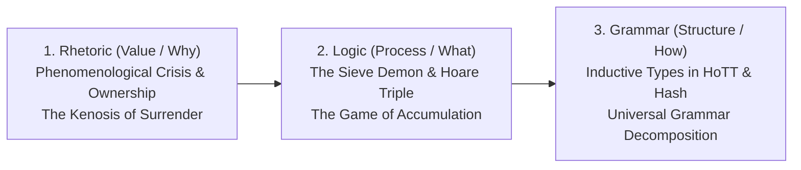
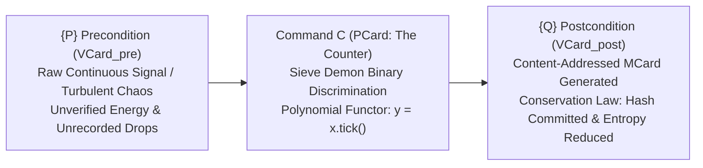

# Chapter 01: The Value of Counting

> *"To count is to define. In the continuous roar of chaotic reality, nothing exists for an agent until it is separated, bounded, and assigned a hash."*

> **Beginner's Orientation**:  
> *Welcome to Chapter 01! If you are starting from ground zero without an advanced mathematics or computer science background, do not worry. Here, we do not memorize dead formulas. We begin from the most familiar elements of physical reality: the rhythm of raindrops dripping through a bamboo spout, grains of rice stored in a village granary, and the double-entry tally book of a local market stall. Through the **GASing** methodology (Easy, Fun, Enjoyable), you will discover that the world's most advanced computing architectures operate upon the exact same transparent principles you explore right here!*

🔬 **Logical Depth**: Level 1 ($RCA_0$ — Computable Mathematics / Recursive Comprehension)  
📐 **CLM Coordinates**: $X$: Rhetoric (Value/Why) $\times$ $Y$: Arithmetic (Naming/Distinction) $\times$ $Z$: [Spec + Impl + Exp]  
🏭 **Brain Factory Station**: Station 01 — The Inventory Station (`MCard: Memory`)  
🎮 **Operational Realization**: [[docs/sprints/epoch-01-microcosmic-physics/SPRINT-01-GRANULAR-TIDEPOOL|Sprint 01: The Granular Tidepool]] (Epoch I: The Primordial Sensorium)  

---

## 1. Pedagogical Foundation: Flipping the Script via the Reverse Trivium

In conventional mathematics education, arithmetic is taught **Grammar-First**: students are handed rigid Peano axioms, abstract symbols ($0, 1, 2, \dots$), and rote operational tables without context or motivation. This produces passive consumers who know the rules of arithmetic but have no intuition for **why counting matters** or **what it costs**.

Following the didactic vision of **John Amos Comenius** and the foundational architecture in [[chapters/00_Structure_and_Vision|00_Structure_and_Vision.md]], Chapter 01 **flips the script** using the **Reverse Trivium** (Rhetoric $\to$ Logic $\to$ Grammar):



1. **Rhetoric (Value / Why)**: We begin with the existential crisis of uncounted chaos. A flood of unmeasured physical water threatens to drown the village; raw bitstreams inundate the observer. You cannot own, manage, or steer what you cannot measure. Ownership requires accounting.
2. **Logic (Process / What)**: We introduce the dynamic mechanism of distinction: the **Maxwellian Sieve Demon** pausing the flow to register discrete "Drops" ($1 \neq 0$). The player experiences counting as a physical, energetic action with real thermodynamic costs.
3. **Grammar (Structure / How)**: Only after experiencing the necessity and cost of counting do we formalize the structural laws: the **Natural Numbers ($\mathbb{N}$)** as an inductive type in HoTT, content-addressed hashing (MCard CIDs), and the double-entry invariant.

### 1.1 The GASing Pedagogical Approach: Counting from Ground Zero

Before delving into formal type systems and equations, we experience the essence of counting through the three pillars of **GASing**:

* 💡 **EASY (Gampang — Concrete & Intuitive Concepts)**:
  * **What is Counting?** Counting is not an abstract formula; counting is **the physical act of establishing an unambiguous boundary**.
  * Imagine sitting on the veranda during a tropical downpour. Water flows relentlessly across the courtyard—that is continuous, analog reality. One cannot count the flood all at once. But place a notched bamboo conduit or bowl beneath the eaves: *Drip... Drip... Drip...* Suddenly, the turbulent continuum resolves into distinct, tangible units: *One drop, two drops, three drops!*
  * This is the origin of all digital computation: **transforming an unconditioned natural flow into discrete, accountable units that can be named and verified**.

* 🎮 **FUN (Asyik — Active Play with Immediate Multimodal Feedback)**:
  * Do not merely read theory—play with it directly! Open our web simulator at [`MCard_Water_Clock/index.html`](MCard_Water_Clock/index.html).
  * You embody the gatekeeper (*Maxwell's Demon*). Your task: trigger the observation button precisely as each water droplet forms.
  * Feel the rhythm: clicking within a calm, regular tempo (laminar flow) triggers clear resonant chimes while keeping thermal dissipation minimal. But clicking frantically generates frictional heat that overheats the sensor! Exploring thermodynamics and computational logic becomes as intuitive and musical as playing a traditional percussion instrument.

* 🌺 **ENJOYABLE (Menyenangkan — Meaningful Purpose, Sovereignty, & Social Fairness)**:
  * **Why Does Counting Liberate?** *"Those who cannot audit their own harvest remain permanently vulnerable to exploitation."*
  * Counting is the bedrock of **Data Sovereignty and Distributed Equity**. Across Bali, farmers have managed terraced irrigation through the **Subak** commons for over a millennium. Every droplet channeled from crater lakes is allocated transparently through calibrated wooden division gates (*taku*). No authority can manipulate water allotments because accounting is open to all community members.
  * In this chapter, counting is not an academic chore; it is the path to constructing technology that is **Verifiable, Sovereign, Fair, and Cooperatively Audited**!

### 1.2 The Four-Language Quad-Standard Architecture

In accordance with [[chapters/00_Structure_and_Vision|00_Structure_and_Vision.md (Section 3.2)]], Chapter 01 implements the full **Four-Language Quad-Standard** with 100% externalized, decoupled linguistic repositories:

| Language | Code | Cultural / Civilizational Grounding | Files |
| :--- | :--- | :--- | :--- |
| **Bahasa Indonesia** | `id` | Nusantara everyday life, gotong royong, Subak irrigation, and GASing pedagogics | [`locales.json`](MCard_Water_Clock/locales.json), [`type_lattice_locales.json`](type_lattice_locales.json) |
| **संस्कृतम् (Sanskerta Bali)** | `sa` | Balinese sacred tradition (Pasraman), Vedic/Agamic metaphysical rigor (*Pramāṇa*, *Jala-Ghaṭikā*, *Śūnyatā*, *Ṛta*) strictly in Devanagari | [`locales.json`](MCard_Water_Clock/locales.json), [`type_lattice_locales.json`](type_lattice_locales.json) |
| **English** | `en` | International mathematical logic, HoTT, category theory, and thermodynamic computing | [`locales.json`](MCard_Water_Clock/locales.json), [`type_lattice_locales.json`](type_lattice_locales.json) |
| **正體中文** | `zh-TW` | Classical Chinese mathematical philosophy, Book of Changes (*I Ching*), strictly standardized on **MCard** / **單子卡** | [`locales.json`](MCard_Water_Clock/locales.json), [`type_lattice_locales.json`](type_lattice_locales.json) |

All state machines (`water_clock.js`, `type_lattice.js`), web UI components (`index.html`), and verification routines operate purely on abstract tokens, consuming natural language exclusively via these external JSON dictionaries.

---

## 2. Reverse Mathematics Proof-Theoretic Depth: Level 1 ($RCA_0$)

Every chapter in the *Prologue of Spacetime* operates at an explicit proof-theoretic depth corresponding to Stephen Simpson's Reverse Mathematics hierarchy.

* **Subsystem**: **$RCA_0$** (Recursive Comprehension Axiom with $\Sigma^0_1$-induction).
* **Guaranty**: Everything introduced in Chapter 01 is **strictly computable**. It requires only finite Turing machines, basic discrete loops, and bounded induction.
* **Philosophical Import**: We do not assume Platonist infinities, non-constructive choice principles, or black-box cloud databases. A sovereign agent requires only:
  1. A sensor capable of binary distinction ($0 \to 1$).
  2. A local register that increments monotonically ($n \mapsto n+1$).
  3. A deterministic hashing function $H: \text{Signal} \to \text{Hash}$ bounded by finite memory.

---

## 3. Hoare Logic of Correctness & The MVP Card

Following the core physics of the Brain Factory, we do not merely execute actions; we prove their correctness using **Hoare Triples**:

$$\{P\} \quad C \quad \{Q\}$$

> 💡 **Beginner's Intuition — Three Verifiable Steps (Hoare Triple)**:
> The formal notation above represents three concrete phases of any measurement:
> 1. **$\{P\}$ Precondition**: Water flows unmeasured through the bamboo spout—continuous, analog, and unrecorded.
> 2. **$C$ Command**: The observer discriminates and captures a discrete droplet (*Tick!*).
> 3. **$\{Q\}$ Postcondition**: The droplet count is permanently committed to an immutable memory card (**MCard**) with cryptographic content addressing!

For **Station 01 (The Counter)**:



* **$\{P\} = VCard_{\text{pre}}$**: Raw, turbulent analog flow. $H_{\text{initial}} > 0$. Drops are uncounted; provenance is untrusted.
* **$C = PCard$ (The Counter)**: The physical or simulated discriminator (e.g. [[chapters/01_The_Value_of_Counting/MCard_Water_Clock/water_clock.js|MCard Water Clock]]). It takes an observation window $\Delta t$, verifies threshold $\theta$, and emits a discrete tick.
* **$\{Q\} = VCard_{\text{post}}$**: A verified, immutable **[[chapters/01_The_Value_of_Counting/MVP_The_Counter|MCard (Memory Card)]]**. The droplet count is permanently recorded in the ledger, with content-addressed hash, timestamp, and signature:
  $$\Delta H < 0, \quad \text{Count}_{\text{post}} = \text{Count}_{\text{pre}} + 1$$

---

## 4. Cubical Logic Model (CLM) Triad: Spec, Impl, Exp

Chapter 01 is organized as an authenticated cube in the Cubical Logic Model:

```
                  [Exp: Experimentation]
               HoTT Math Course & RF Pulse Counter
                        /             \
                       /               \
                      /                 \
  [Spec: Specification] ---------------- [Impl: Implementation]
  README & MVP_The_Counter           MCard Water Clock Engine
```

* **Specification (Spec)**:
  * [`README.md`](README.md): High-level chapter charter and Reverse Trivium trajectory.
  * [`MVP_The_Counter.md`](MVP_The_Counter.md): The philosophical and technical specification of the MCard atom.
  * [`arithmetic_as_protocol.md`](arithmetic_as_protocol.md): The Fundamental Theorem of Arithmetic (FTA) and Pacioli's double-entry invariant as SSOT verification.
  * [`type_lattice.json`](type_lattice.json): Canonical CLM Type Lattice specification defining nodes and relationships across $U_0 \dots U_5$.
  * [`type_lattice_locales.json`](type_lattice_locales.json): Decoupled multilingual translation repository (🇮🇩 `id`, 🕉️ `sa`, 🇬🇧 `en`, 🇹🇼 `zh-TW`).
* **Implementation (Impl)**:
  * [`type_lattice.js`](type_lattice.js): Executable Type Lattice verification engine powered by **`clm-kernel`** (`UniverseLevel`, `isStratified`, `TypeInterpreter`, `MCard`).
  * [`MCard_Water_Clock/`](MCard_Water_Clock/): Working browser and Node.js simulation of Maxwell's Demon observing droplets with thermodynamic dissipation.
  * [`water_clock_mechanics.md`](water_clock_mechanics.md): Technical breakdown of the Water Clock Analog-to-Digital Converter (ADC).
* **Experimentation (Exp)**:
  * [`HoTT_Math_Course/`](HoTT_Math_Course/): 7 foundational video lesson notes detailing Homotopy Type Theory, universes, $\Pi$-types, $\Sigma$-types, and inductive types.
  * [`thermodynamics_of_counting.md`](thermodynamics_of_counting.md): Empirical verification of Landauer dissipation and Shannon entropy reduction.
  * `src/civilizational_sprint_engine.py`: Automated numerical unit test verifying Sprint 01 mathematical invariants.

### 4.1 Chapter 01 Type Lattice Stratification (Powered by `clm-kernel`)

Chapter 01 is formally structured into six stratified universe levels via the `clm-kernel` npm package:

| Stratum | CLM Coordinate | Chapter 01 Types & Invariants | Physical / Civilizational Metaphor |
|:---|:---|:---|:---|
| **$U_0$** | **`mcard_cas`** | `DropletAtom`, `NaturalNumber` ($n \in \mathbb{N}$), `ContentId` (CID), `ThermalQuantum` | Rice grains on a winnowing tray, pebbles in an accounting jar, wax seal on an ancestral record |
| **$U_1$** | **`pcard_net`** | `ClepsydraTick` (ADC), `PeanoSuccessor` ($\text{Succ}(n) = n+1$), `DemonObservation` | Tipping bamboo rocker conduit (*添水 / Shishi-odoshi*) clicking against stone |
| **$U_2$** | **`vcard_proof`** | `LaminarConservationGate` ($\Delta H < 0$), `LandauerBoundProof`, `PacioliDoubleEntryReceipt` | Subak division weir: inflow volume strictly matches distributed outflow |
| **$U_3$** | **`satori_fiber`** | `ElderWarningAct`, `AuditoryPulseAct` (440Hz Plink), `MilestoneChimeAct` | Village elder's guidance from the council pavilion, harmonic harvest chimes |
| **$U_4$** | **`membrane_ui`** | `WaterClockStack` (MCard UI), `CatchDropTrigger` ($<100\text{ms}$), `ThermodynamicGauge` | Bamboo measurement station, serene reservoir basin |
| **$U_5$** | **`meta_gamma`** | `GASingFlowState` (Easy, Fun, Enjoyable), `EpistemicFitness`, `KenoticEmptySchema` | Calm mindfulness of the master puppeteer (*Dalang*), empty cup awaiting tea |

To execute and verify the Chapter 01 Type Lattice in any supported language:
```bash
# Indonesian (id)
node chapters/01_The_Value_of_Counting/type_lattice.js id

# Sanskrit (sa)
node chapters/01_The_Value_of_Counting/type_lattice.js sa

# English (en)
node chapters/01_The_Value_of_Counting/type_lattice.js en

# Orthodox Chinese (zh-TW)
node chapters/01_The_Value_of_Counting/type_lattice.js zh-TW
```

---

## 5. Thermodynamics of Counting & Maxwell's Demon

In classical naive computer science, observation and storage are assumed to be "free." In physical reality, **observation is work**:

> 💡 **Intuitif Pemula — Menampi Beras & Biaya Mengamati**:
> Pernahkah Anda melihat orang tua di desa menampi beras dengan nyiru bambu (tampah)? Butiran gabah kosong, kerikil, dan kotoran dipisahkan dari beras murni. Apakah pemisahan itu gratis? Tentu tidak! Tangan kita bergerak (energi), mata kita fokus mengamati (informasi), dan kita mengeluarkan keringat (panas/disipasi). Begitu pula komputer: setiap kali Anda menghitung atau menghapus data (*Landauer Bound*), energi listrik diubah menjadi panas. Informasi adalah entitas fisik yang nyata!

1. **The Maxwellian Sieve Demon**: To count a drop, an agent must open a gate, sense the drop's presence, close the gate, and record the bit.
2. **Landauer's Principle**: Erasing a single bit of information or resetting a register dissipates an irreducible minimum of thermodynamic energy into the environment:
   $$E_{\text{erase}} \ge k_B T \ln 2$$
3. **Shannon Entropy Reduction**: Sifting a chaotic continuous bitstream into discrete tokens reduces entropy:
   $$\Delta H = H_{\text{after}} - H_{\text{before}} < 0$$
4. **Vibration, Perturbation, and Free Will**: The Brownian motion and thermal vibration of water droplets represent physical entities testing counterfactual trajectories—the physical substrate of agency. Re-anchoring these vibrating particles into a mutually consistent, order-preserving entry in an immutable ledger is the **energy cost** that collective systems must pay to preserve coherence.

---

## 6. Mathematical Engine: Universal Grammar of Decomposition

Following Section 6 of [[chapters/00_Structure_and_Vision|00_Structure_and_Vision.md]], reality decomposes into a basis expansion:

$$f = \sum_{k} c_k \cdot \phi_k$$

In Chapter 01:
* **The Coefficient ($c_k \in \mathbb{N}$)**: The **Count**—the quantity or weight of existence. It represents the energy, duration, or resource allocation committed to a specific phenomenon.
* **The Basis ($\phi_k$)**: The **MCard Identity**—the orthogonal unit vector of meaning defined by its cryptographic hash ($H(\phi_k)$).
* **Laplace Damping & Pruning**: Every MCard stored in memory incurs an ongoing maintenance cost. If an entity's utility coefficient falls below the damping threshold ($c_k < \text{Cost}$), it is garbage collected.

---

## 7. The Workforce Triad & Lessig's Governance Quadrant

### The Miner Agent
In the **Miner-Coder-Trader Triad**, Chapter 01 trains **The Miner**:
* **Role**: Value Seeking & Raw Extraction.
* **Activity**: The Miner does not speculate or trade; the Miner sifts through noise, verifies reality, and produces verifiable, unforgeable MCards.
* **Ethos**: Absolute data integrity. $1$ must equal $1$.

### Lessig's Four Governance Modalities
1. **Architecture / Code**: The content-addressed hash function and monotonic counter register.
2. **Law**: The double-entry bookkeeping contract ensuring conservation ($\text{Debit} \equiv \text{Credit}$).
3. **Market**: Converting counted water drops into economic energy tokens for Chapter 05.
4. **Norms**: The communal water-sharing pacts of the Balinese Subak, where water theft is prevented not by police, but by transparent, verifiable counts at the weir.

---

## 8. The Player's Axiom & Digital Synesthesia

> [!IMPORTANT]
> **The Player's Axiom**: *"Knowledge is free, but judgment is not! Knowledge as written or published content can be attained rather publicly in various commons, but using the knowledge in privately interested or self-resolved choices will reveal the color of that person."*

In the game of civilizational survival, counting formulas are public commons. However, every participant faces irreversible moral and strategic choices:
* Do you count water to hoard private reserves in drought? Or do you count to ensure zero starvation across downstream subak terraces?
* Your choices alter your **Synesthetic Chromatic Signature** and your alignment with the Tri Hita Karana order.

### Digital Synesthesia: Auditory Pulse Train
Players experience Chapter 01 through the **Auditory Pulse Train**:
* A continuous, harsh white noise represents turbulent, uncounted flow.
* As the player's Sieve Demon successfully filters droplets into discrete counts, the harsh noise resolves into a crisp, rhythmic acoustic pulse.
* The pitch of the pulse tracks the Shannon entropy reduction $\Delta H$: higher structural order emits a harmonic resonance.

---

## 6. CLI Execution & Reproducibility

Chapter 01 provides complete command-line reproducibility for all engines across all four supported languages:

### Run the Chapter Type Lattice Verification Engine:
```bash
# Verify CLM stratification and mint Chapter 01 MCard witness in Indonesian (default)
node chapters/01_The_Value_of_Counting/type_lattice.js id

# Verify in Sanskrit (Devanagari script)
node chapters/01_The_Value_of_Counting/type_lattice.js sa

# Verify in English
node chapters/01_The_Value_of_Counting/type_lattice.js en

# Verify in Traditional Chinese
node chapters/01_The_Value_of_Counting/type_lattice.js zh-TW
```

### Run the MCard Water Clock Headless Simulator:
```bash
# Run Maxwell's Demon state machine in Indonesian
node chapters/01_The_Value_of_Counting/MCard_Water_Clock/water_clock.js id

# Run in Sanskrit
node chapters/01_The_Value_of_Counting/MCard_Water_Clock/water_clock.js sa

# Run in English
node chapters/01_The_Value_of_Counting/MCard_Water_Clock/water_clock.js en

# Run in Traditional Chinese
node chapters/01_The_Value_of_Counting/MCard_Water_Clock/water_clock.js zh-TW
```

### Launch the Web Application:
```bash
# Open in your web browser:
open http://localhost:8099/chapters/01_The_Value_of_Counting/MCard_Water_Clock/index.html
```

---

## 7. Automated Mathematical Certification

All invariants of Chapter 01 are verified automatically via `civilizational_sprint_engine.py`:
```bash
python3 src/civilizational_sprint_engine.py
```
* **Certified Invariants**:
  1. Entropy reduction gate $\Delta H < 0$.
  2. Conservation of mass/charge across counting ticks.
  3. Bounded Landauer dissipation.
  4. Complete 0.0 error tolerance across Sprint 01 test matrix.

---

## 🎮 Operational Realization: Playable Game Sprint

This chapter is directly implemented and playable via **[[docs/sprints/epoch-01-microcosmic-physics/SPRINT-01-GRANULAR-TIDEPOOL|Sprint 01: The Granular Tidepool]]** in **Epoch I: The Primordial Sensorium**.

* **Assembly Line Station**: Inventory Station (`MCard: Memory`)
* **Dominant Mental Model**: The Sieve Demon / Maxwellian Tidepool Gate
* **Formal Algebraic Signature**: $\Sigma_{\text{Tidepool}} = (S, \Omega, \mathcal{E})$ where $\mathcal{E} = \{\Delta H < 0\}$ (Shannon entropy sieving)
* **AoS Domain Triad**: $\langle P, C, B \rangle = \langle [L]^0, [T]^0, \text{Energy} \rangle$
* **Active Baldwin Operator**: **Splitting** (sifting raw continuous wave into discrete countable tokens)
* **Digital Synesthesia**: Auditory Pulse Train (auditory perception of entropy drop $\Delta H < 0$)
* **Hardware Realization**: MCard Water Clock, RF pulse counter, physical water droplets
* **The Player's Axiom**: *"Knowledge is free, but judgment is not!"* — Participants decide whether to hoard discrete counts for private advantage or commit them to the communal water ledger.
* **Vibration & Free Will**: Brownian thermal fluctuations of droplets represent the agent's agency to explore counterfactual realities; re-establishing order and coherence requires expenditure of Landauer energy.
* **Automated Verification**: Formally certified with 0.0 error in `src/civilizational_sprint_engine.py` (`SPRINT-01` test suite).
