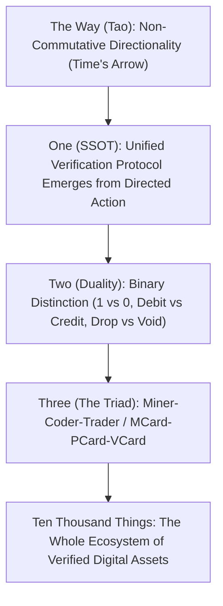

# Arithmetic as Protocol: The Single Source of Truth, Pacioli, and The Miner

> *"The Single Source of Truth is not a database. It is a dynamically evolving, contextually dependent protocol for determining what counts as truth in a given system."*

---

## 1. Tao Generates One: The Origin of Protocol SSOT

In conventional software architecture, a "Single Source of Truth (SSOT)" is mistakenly conceived as a centralized database—a static relational table or cloud silo where truth is stored. 

Following the ancient generative sequence described in Section 2 of [[chapters/00_Structure_and_Vision|00_Structure_and_Vision.md]] (*Tao Generates One*), truth is not a location; it is a **directed verification protocol**:



1. **Directionality ($\text{道}$)**: Time flows forward. An observation occurs at a specific, irreversible instant. Without temporal directionality, no execution sequence can exist.
2. **One (SSOT)**: When an observer records an event, the protocol ensures that anyone, anywhere, following the same constructible rules, arrives at the exact same conclusion.
3. **The Fundamental Theorem of Arithmetic (FTA)**:
   Every integer $n > 1$ can be represented uniquely as a product of prime powers:
   $$n = \prod_{i=1}^{k} p_i^{a_i}$$
   This theorem is humanity's first SSOT protocol. It is not stored in a cloud server; it is a **deterministic procedure** that any sovereign agent can execute locally to verify identity and composition.

---

## 2. Historical Lineage: From Sumerian Clay to Merkle Trees

The technology of counting has evolved across five distinct historical epochs, each expanding the boundary of externalized memory:

```
[4000 BC] Sumerian Clay Tokens ----> First physical external memory (MCard v0.1)
[1494 AD] Luca Pacioli Double-Entry -> Bilateral conservation of value (Debit = Credit)
[1888 AD] Herman Hollerith Cards ---> Mechanized punch-card census processing
[1987 AD] Bill Atkinson HyperCard --> Dynamic, accessible digital cards with hypermedia
[2008 AD] Satoshi Nakamoto Hashes --> Cryptographic Merkle tree chains as immutable history
```

### Luca Pacioli (1447–1517) and Zero-Trust Accounting
In his 1494 masterwork *Summa de Arithmetica*, Franciscan friar Luca Pacioli formalized **Double-Entry Bookkeeping**. Pacioli understood that in a fallen, noisy world, human memory is biased and untrustworthy. 

To achieve **Zero Trust verification**, Pacioli established the fundamental accounting invariant:

$$\sum \text{Debits} \equiv \sum \text{Credits}$$

In Chapter 01 of the *Prologue of Spacetime*, Pacioli's invariant is embedded into the MCard pipeline:
* When The Counter ticks, the **Communal Cistern** is debited $1\text{ drop}$.
* The **Subak Weir Reservoir** is credited $1\text{ drop}$.
* The net balance of physical water is strictly conserved: $\Delta V = 0$.

---

## 3. The Workforce Triad: The Miner Agent

Section 5.6 of [[chapters/00_Structure_and_Vision|00_Structure_and_Vision.md]] partitions cognitive labor across the **Miner-Coder-Trader Triad**:

| Role | Primary Operation | Artifact Emitted | Philosophical Mode | Chapter Grounding |
|:---|:---|:---|:---|:---|
| **The Miner** | **Value Seeking & Raw Sifting** | **[[MCard]] (Memory Card)** | **Integrity ($1=1$)** | **Chapter 01 (This Chapter)** |
| **The Coder** | Structural Transformation | **[[PCard]] (Process Card)** | Construction & Agency | Chapters 05–08 |
| **The Trader** | Cross-Boundary Exchange | **[[VCard]] (Witness Card)** | Equilibrium & Value | Chapters 09–12 |

### The Miner's Duty in Chapter 01
* The Miner does not speculate on market prices or build complex apps.
* The Miner sits at the boundary of chaos, observing the water clock, rejecting spurious noise, and stamping authentic drops with cryptographic CIDs.
* The Miner embodies the **Kenosis of Emptying**: stripping away personal bias so that an authentic measurement is recorded without distortion.

---

## 4. Lessig's Four Governance Modalities

How does the act of counting shape human society? Following Lawrence Lessig's framework, counting is regulated by four interacting modalities:

1. **Architecture / Code**: The hard physics of the nozzle, the piezo sensor debounce timer, and the SHA-256 hash algorithm. You cannot bypass the code.
2. **Law**: The legal contracts and property deeds defining who owns the water rights or token balances.
3. **Market**: The economic conversion rate where droplets are tokenized to purchase compute or robot actuation in Chapter 05.
4. **Norms**: The cultural, sacred ethics of **Gotong Royong** (mutual cooperation) and **Tri Hita Karana** (harmony between humans, nature, and the divine) practiced in Bali's 1,000-year-old Subak water democracy.

---

## 5. From Extractive Counting to Value Stewardship

In conventional capitalist accounting, counting is deployed primarily for **extraction**:
* How much profit can be extracted?
* How many hours can be billed?
* How much resource can be captured before depletion?

In the *Prologue of Spacetime*, we teach participants to **count value, not merely volume**:
* Counting is an act of **care**. To count a forest, a water supply, or a student's cognitive growth is to acknowledge its existential worth.
* **The Player's Axiom**: *"Knowledge is free, but judgment is not!"*
  The algorithm for counting is open-source and free. But the decision of **how to allocate the count**—whether to divert water to private luxury villas or distribute it equitably across community rice terraces—reveals the true moral color of the agent.
