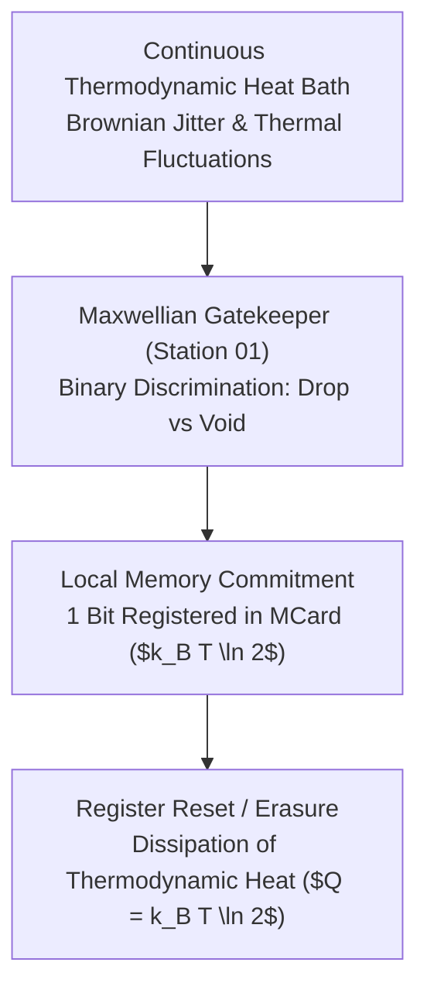

# Thermodynamics of Counting: Maxwell's Demon, Landauer Dissipation, and Free Will

> *"Counting is not a costless mental abstraction. To distinguish one particle from another requires a physical interaction; to erase an unneeded bit requires the dissipation of heat. Information is physical."*

---

## 1. The Physicality of Information: From Szilard to Landauer

In 1867, James Clerk Maxwell proposed a famous thought experiment: a microscopic "demon" operating a frictionless trapdoor between two gas chambers. By observing approaching molecules and sorting fast particles into Chamber A and slow particles into Chamber B, the demon appears to decrease thermodynamic entropy without expending work, violating the Second Law of Thermodynamics.

The resolution of this paradox took a century to formulate, culminating in the work of **Leo Szilard (1929)**, **Léon Brillouin (1953)**, **Rolf Landauer (1961)**, and **Charles Bennett (1982)**:

### Landauer's Principle
Landauer proved that the irreversible erasure of one bit of information in any physical computational system dissipates a minimum quantity of heat into the environment:

$$E_{\text{erase}} \ge k_B T \ln 2$$

Where:
* $k_B = 1.380649 \times 10^{-23} \text{ J/K}$ (Boltzmann constant).
* $T$ is the ambient temperature in Kelvin.
* At room temperature ($T = 300\text{ K}$), $E_{\text{erase}} \approx 2.87 \times 10^{-21}\text{ Joules} \approx 0.0178\text{ eV}$.

In Chapter 01, **The Counter** is subject to Landauer's principle. An agent cannot continuously monitor and store infinite drops without an energy supply. The MCard hash is the cryptographic certificate that physical work was committed to tame environmental entropy.

---

## 2. Shannon Entropy Reduction ($\Delta H < 0$)

Before counting, an observer faces an unconstrained bitstream of continuous variance. Let $X$ be the probability distribution of incoming signals across states $\{x_1, x_2, \dots, x_m\}$. The initial Shannon entropy is:

$$H_{\text{initial}}(X) = - \sum_{i=1}^{m} p(x_i) \log_2 p(x_i)$$

When The Counter applies the **Maxwellian Sieve** (implemented via the Baldwin **Splitting** operator), it partitions the continuous space into discrete bins of uniform droplet volumes:

$$\Delta H = H_{\text{post}} - H_{\text{pre}} < 0$$

In the automated test harness `src/civilizational_sprint_engine.py`, Sprint 01 verifies this reduction numerically:
* Initial chaotic bitstream: $\text{Tokens} = [3, 3, 1, 1, 1, 4]$.
* Measured entropy shift: $\Delta H = -0.100256 < 0$.
* The negative sign proves that the act of observation successfully condensed disorder into structured memory.

---

## 3. Vibration, Perturbation, and the Physical Substrate of Free Will

> [!NOTE]
> **The Metaphysics of Physical Jitter**: In the *Prologue of Spacetime*, thermal vibration and Brownian perturbation are not regarded as mere "noise" to be suppressed; they are the **physical substrate of agency**.

1. **Jumping Between Physical Realities**: At the microscopic scale, molecules and drops undergo continuous thermal perturbations ($\delta x(t)$). These fluctuations represent physical entities exploring off-shell trajectories, superposition paths, and counterfactual futures—the capacity of physical matter to "try out" alternate realities.
2. **The Cost of Returning to Order**: While perturbation allows free exploration, an agent or civilization cannot persist in pure unrestrained jitter without dissolving into thermal noise. The act of coming together into a mutually consistent, order-preserving entry in an immutable ledger is the **energy cost** that collective particles must pay.
3. **The Software Lagrangian**: As formalized in the Algebra of Systems (AoS), the total action of an agent is governed by the Lagrangian integral:
   $$\mathcal{S} = \int (\mathcal{T}_{\text{kinetic}} - \mathcal{V}_{\text{potential}}) dt = \int \left( \frac{1}{2} g_{ij} \dot{x}^i \dot{x}^j - \Phi(x) \right) dt$$
   The kinetic term captures the free exploratory vibration; the potential term captures the organizing force of the collective ledger.

---

## 4. Digital Synesthesia: The Auditory Pulse Train

How does a human or agent perceive this thermodynamic transition? Following Section 5.2 of [[chapters/00_Structure_and_Vision|00_Structure_and_Vision.md]], Chapter 01 activates **Digital Synesthesia** via the **Auditory Pulse Train**:

* **Turbulent Noise ($H > H_0$)**: When drops fall unmonitored or when the observer clicks in a panicked, irregular rhythm ($\Delta t < 200\text{ms}$), the sensory instrument emits a harsh, abrasive static hiss (pink noise).
* **Laminar Resonance ($\Delta H < 0$)**: As the observer matches the resonant frequency of the water clock ($\Delta t \approx 1000\text{ms}$), the static resolves into distinct, crisp auditory clicks with a harmonic chime undertone.
* **Pitch Shifting**: The frequency of the harmonic undertone is mathematically coupled to $\Delta H$: as entropy decreases, the pitch rises toward a pure crystal tone.

---

## 5. Reverse Mathematics Connection ($RCA_0$)

Why does this thermodynamic reality map to **$RCA_0$**?
* In $RCA_0$, we can construct sequences of rational approximations to physical constants ($k_B, \ln 2$) and compute finite sums of entropy terms.
* We do not require transfinite induction or non-computable real numbers; the discrete sorting of droplets and the tracking of energy accounts are completely verifiable by primitive recursive arithmetic.
