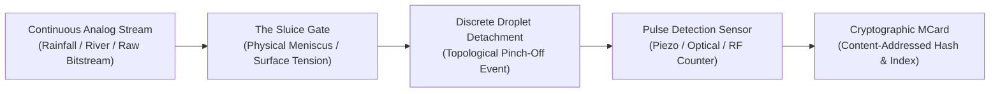

# Water Clock Mechanics: Analog-to-Digital Transduction

> *"In the physical world, water flows as an analog continuum. In the computational world, decisions require discrete bits. The Water Clock is the boundary converter where continuum collapses into countable time."*

> 🇮🇩 **Catatan Pemula — Dari Pancuran Bambu ke Komputer Modern**:  
> *Apa hubungan antara air pancuran bambu di pedesaan dan komputer super canggih? Komputer digital hanya mengerti data diskrit (terputus-putus): angka 0 atau 1. Namun alam semesta ini bergerak secara mengalir tanpa henti (kontinu / analog): air sungai yang mengalir, hembusan angin, atau cahaya matahari. **Jam Air (Water Clock / Clepsydra)** adalah jembatan penjelas: ia mengubah aliran air yang bersambung menjadi butir tetesan demi tetesan yang bisa dihitung dengan pasti (*TIK, TIK, TIK!*). Dalam dunia teknik, ini disebut **ADC (Analog-to-Digital Converter)**. Konsepnya sangat alami dan mudah dipahami!*

---

## 1. The Physical Archetype: Clepsydra to MCard Stacks

The **Clepsydra (Water Clock)** is one of humanity's earliest precision instruments for civilizational coordination. From the ancient water clocks of Babylon and Alexandria to the synchronized irrigation weirs of the Balinese **Subak**, water clocks solve a foundational problem: **How do we measure the passage of continuous time through discrete physical events?**

In Chapter 01 of the *Prologue of Spacetime*, the Water Clock serves as the primary **Analog-to-Digital Converter (ADC)** for Station 01 (The Inventory Station):



---

## 2. Maxwellian Demon Architecture in `water_clock.js`

The computational realization of the Water Clock is implemented in [[chapters/01_The_Value_of_Counting/MCard_Water_Clock/water_clock.js|MCard_Water_Clock/water_clock.js]]. The core entity is **Maxwell's Demon**, an active observer that pauses the chaotic flow to extract discrete information.

> 💡 **Intuitif Pemula — Menjaga Irama Aliran (Laminar vs Turbulen)**:  
> Bayangkan Anda sedang menuang teh panas ke dalam cangkir. Jika tangan Anda tenang dan stabil, teh mengalir anggun dan sejuk tanpa tumpah (*Aliran Laminar*). Tetapi jika Anda gugup, tangan Anda bergetar cepat dan air muncrat ke mana-mana (*Aliran Turbulen*). Di dalam simulasi `water_clock.js`, kita belajar menjaga ketenangan: menangkap tetesan air dalam tempo teratur (~1 detik sekali). Jika Anda panik dan memencet tombol terlalu cepat, energi pengamat akan terkuras habis dan mesin mengalami *overheat* (kepanasan)!

### 2.1 The Thermodynamic State Machine
The Demon maintains an internal state tuple:

$$\mathcal{S}_{\text{Demon}} = \langle E, H, n, t_{\text{last}}, \text{isOverheated} \rangle$$

* **$E$ (Energy Reservoir)**: Depleted with every observation action.
* **$H$ (Entropy Register)**: Accumulates when sampling rhythm deviates from natural resonance.
* **$n$ (Tick Count)**: The monotonically increasing natural number index ($n \in \mathbb{N}$).
* **$t_{\text{last}}$**: Timestamp of the previous droplet detection.

### 2.2 Delta-Timing Dynamics & Friction
The observer cannot sample arbitrarily fast without paying a thermodynamic penalty:

```javascript
const now = Date.now();
const delta = now - this.lastTickTime;

let cost = 5; // Base energy cost
let entropyGenerated = 1;

if (delta < 200) {
  // Too fast! High-frequency sampling friction generates heat
  cost = 20;
  entropyGenerated = 15;
} else if (delta > 2000) {
  // Too slow! Droplets overflow unrecorded; pattern washes away
  entropyGenerated = 5;
}
```

* **Laminar Flow Regime ($\Delta t \in [500\text{ms}, 1500\text{ms}]$)**: The observer is locked in phase resonance with the natural drip cadence. Energy consumption is minimal; entropy generation is zero or negative ($\Delta H < 0$).
* **Turbulent Friction Regime ($\Delta t < 200\text{ms}$)**: "Panic clicking" or over-sampling burns the observer's energy and overheats the system, simulating sensor saturation.
* **Stale Overflow Regime ($\Delta t > 2000\text{ms}$)**: Under-sampling allows unrecorded water to escape, violating conservation laws.

---

## 3. Physical Hardware Realization: IoT & RF Counter

In the physical deployment of Station 01:
1. **Drip Chamber & Nozzle**: Calibrated orifice producing uniform droplets ($V_{\text{drop}} \approx 0.05\text{ mL}$).
2. **Piezoelectric Transducer**: Converts the mechanical impact of the falling drop into an electrical voltage spike ($V_{\text{peak}} \ge 2.5\text{V}$).
3. **ESP32 Edge Microcontroller**:
   * Hardware interrupt pin (`GPIO_NUM_4`) configured for rising-edge detection.
   * Debounce window hardware-locked at $150\text{ms}$ to prevent acoustic ringing.
   * RF pulse emitter broadcasting local packet over LoRa/ESP-NOW mesh.
4. **Local MCard Generator**: Computes the cryptographic CID from the tuple `(device_id, count, timestamp, delta_t)` and stores it in local SQLite/DuckDB storage.

---

## 4. Connection to Chapter 05 & Future Epochs

The droplets counted by the Water Clock do not vanish into the past; they form the **Initial Capital** of the agent:
* In **[[chapters/01_The_Value_of_Counting|Chapter 01]]**, a droplet is a measure of physical volume and past time.
* In **[[chapters/05_Resource_Allocation|Chapter 05: Resource Allocation]]**, droplets are converted 1:1 into **Actuation Tokens** powering physical DC motors, Nitinol shape-memory alloy actuators, and VR displays.
* In **[[chapters/09_Counting_Water|Chapter 09: Counting Water]]**, the single-point water clock scales into a multi-weir network governed by typed sum and product algebraic types.

---

## 5. Summary Invariants

$$\text{Count}_{\text{post}} = \text{Count}_{\text{pre}} + 1 \iff \Delta t \ge \Delta t_{\text{refractory}}$$
$$E_{\text{system}} = E_{\text{initial}} - \sum_{i=1}^{n} \text{Cost}(\Delta t_i) > 0$$
$$\Delta H_{\text{observed}} < 0 \implies \text{Laminar Resonance Achieved}$$
