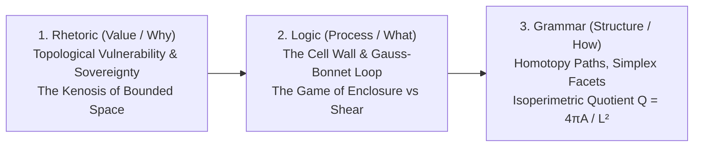
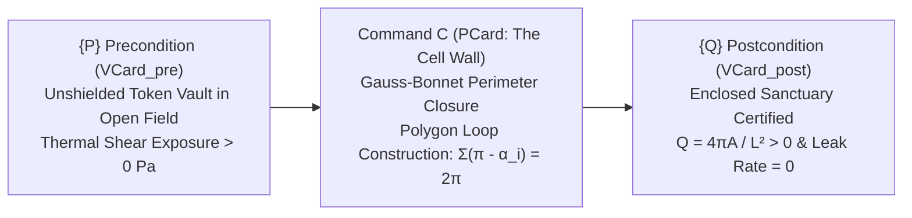

# Chapter 02: The Meaning of Shape

> *"Space is not empty; it is the relational canvas where boundaries define meaning, ownership, and sovereignty."*

> **Beginner's Orientation**:  
> *Welcome to Chapter 02! While Chapter 01 explored discrete counting of water droplets and grains (Arithmetic), Chapter 02 advances to the next foundational domain: **Geometry (Spatial Form)**. Without boundaries, counted assets remain vulnerable to ambient dissipation and loss. Rooted in the timeless wisdom of terraced field berms (*Subak*) and communal fencing, we study how closed boundary loops establish secure, sovereign sanctuary. Through the **GASing** methodology (Easy, Fun, Enjoyable), learners discover that modern topology and differential geometry originate from the basic human intuition of safeguarding what is sacred and valuable.*

🔬 **Logical Depth**: Level 2 ($WKL_0$ — Weak Kőnig's Lemma / Compactness / Boundary Enclosure)  
📐 **CLM Coordinates**: $X$: Rhetoric (Value/Why) $\times$ $Y$: Geometry (Boundary/Relation) $\times$ $Z$: [Spec + Impl + Exp]  
🏭 **Brain Factory Station**: Station 02 — The Blueprint Station (`MCard: Spatial`)  
🎮 **Operational Realization**: [[docs/sprints/epoch-01-microcosmic-physics/SPRINT-02-TOPOGRAPHIC-CELL-WALL|Sprint 02: The Topographic Cell Wall]] (Epoch I: The Primordial Sensorium)  

---

## 1. Pedagogical Foundation: Flipping the Script via the Reverse Trivium

In conventional geometry curricula, geometry is taught **Grammar-First**: students are forced to memorize abstract Euclid's postulates, coordinate formulas ($y = mx + b$, distance metrics $\sqrt{\Delta x^2 + \Delta y^2}$), and formal polygon proofs without any intuition for **why boundaries are drawn** or **what a boundary protects**.

Following the didactic vision of **John Amos Comenius** and the foundational architecture in [[chapters/00_Structure_and_Vision|00_Structure_and_Vision.md]], Chapter 02 **flips the script** using the **Reverse Trivium** (Rhetoric $\to$ Logic $\to$ Grammar):



1. **Rhetoric (Value / Why)**: We begin with the existential crisis of unbounded exposure. Raw data and unshielded tokens leak into the void when battered by ambient thermal shear forces. An agent cannot establish sovereignty, store value, or run distributed agreements without an enforceable perimeter.
2. **Logic (Process / What)**: We introduce the dynamic mechanism of enclosure: the **Topographic Cell Wall**. By driving anchor stakes (vertices) and linking them with geodesic vectors, the agent turns exterior angles until the sum equals $2\pi$ ($360^\circ$). The Gauss-Bonnet theorem certifies closure, deflecting external shear and shielding the token vault.
3. **Grammar (Structure / How)**: Only after experiencing the functional value and dynamic feedback of enclosure do we formalize the structural laws: **Homotopy Type Theory (HoTT)** spatial path types, the Shoelace area algorithm, the Jordan Curve containment property, and the isoperimetric quotient $Q \le 1$.

---

### 1.1 The GASing Pedagogical Approach: Spatial Boundaries from Ground Zero

Before delving into formal topology and curvature calculus, we explore the physical intuition of form and spatial boundaries through the three pillars of **GASing**:

* 💡 **EASY (Gampang — Concrete & Intuitive Concepts)**:
  * **What is Form and Boundary?** A geometric shape is not merely an abstract drawing on paper; it is a **functional perimeter separating internal sovereignty from external chaos**.
  * Consider terraced rice fields across the hillsides of Bali or Java. If left flat without raised earthen berms (*galengan* / *pematang sawah*), irrigation water channeled from mountain springs rushes wildly down the ravines, eroding fertile topsoil. But when farmers drive wooden stakes and pack clay into an unbroken closed berm loop: *water settles serenely across the terrace, rice seedlings flourish, and precious nutrients remain contained.*
  * This is the origin of all spatial geometry: **establishing reference vertices to enclose and protect what is valuable**.

* 🎮 **FUN (Asyik — Active Play with Immediate Multimodal Feedback)**:
  * Rather than passively absorbing theorems, learners interact directly with the simulation: open [`MCard_Cell_Wall/index.html`](MCard_Cell_Wall/index.html).
  * The user acts as a village surveyor, clicking on the canvas to place boundary vertices around an exposed perimeter.
  * Experience the tactile progression: each placed vertex extends a glowing cyan boundary line. Clicking **"Close Perimeter (2π)"** plays a resonant ceremonial gong confirming complete $360^\circ$ closure. Instantly, an emerald sanctuary shield activates, deflecting external thermal shear and protecting the token vault with zero leakage!

* 🌺 **ENJOYABLE (Menyenangkan — Meaningful Purpose, Sovereignty, & Collaboration)**:
  * **Why Do Clear Boundaries Foster Peace?** *"Good fences make good neighbors."*
  * A boundary is not a hostile wall of isolation, but an instrument of **Spatial Sovereignty and Mutual Assurance**. In agrarian traditions, staking village parcel boundaries has always been conducted collaboratively with village elders witnessing every turn. When perimeters are agreed upon transparently and verified mathematically, room for dispute and exploitation evaporates.
  * Studying geometry in this chapter equips learners to architect digital systems that are **Secure, Sovereign, Transparent, and Grounded in Collective Trust**!

---

### 1.2 The Four-Language Quad-Standard Architecture

In accordance with [[chapters/00_Structure_and_Vision|00_Structure_and_Vision.md (Section 3.2)]], Chapter 02 implements the full **Four-Language Quad-Standard** with 100% externalized, decoupled linguistic repositories:

| Language | Code | Cultural / Civilizational Grounding | Files |
| :--- | :--- | :--- | :--- |
| **Bahasa Indonesia** | `id` | Nusantara everyday life, gotong royong, Subak irrigation, and GASing pedagogics | [`locales.json`](MCard_Cell_Wall/locales.json), [`type_lattice_locales.json`](type_lattice_locales.json) |
| **संस्कृतम् (Sanskerta Bali)** | `sa` | Balinese sacred tradition (Pasraman), Vedic/Agamic metaphysical rigor (*Sīmā-Prākāra*, *Gauṣa-Bonnet-Siddhānta*, *Śūnyatā*, *Akṣaya-Lekhyam*) strictly in Devanagari | [`locales.json`](MCard_Cell_Wall/locales.json), [`type_lattice_locales.json`](type_lattice_locales.json) |
| **English** | `en` | International mathematical logic, HoTT, topology, and differential geometry | [`locales.json`](MCard_Cell_Wall/locales.json), [`type_lattice_locales.json`](type_lattice_locales.json) |
| **正體中文** | `zh-TW` | Classical Chinese mathematical philosophy, Book of Changes (*I Ching*), strictly standardized on **MCard** / **單子卡** | [`locales.json`](MCard_Cell_Wall/locales.json), [`type_lattice_locales.json`](type_lattice_locales.json) |

All state machines (`cell_wall.js`, `type_lattice.js`), web UI components (`index.html`), and verification routines operate purely on abstract tokens, consuming natural language exclusively via these external JSON dictionaries.

---

## 2. Reverse Mathematics Proof-Theoretic Depth: Level 2 ($WKL_0$)

Every chapter in the *Prologue of Spacetime* operates at an explicit proof-theoretic depth corresponding to Stephen Simpson's Reverse Mathematics hierarchy.

* **Subsystem**: **$WKL_0$** (Weak Kőnig's Lemma over $RCA_0$).
* **Guaranty**: Extends computable arithmetic with **compactness principles**, ensuring that bounded infinite binary trees contain infinite paths.
* **Geometric Translation**:
  1. **Heine-Borel Compactness**: Any closed and bounded subset of $\mathbb{R}^2$ (a closed polygonal boundary) is compact.
  2. **Jordan Curve Theorem**: A continuous closed loop separates the plane into exactly two connected components: an *interior* (the protected cell) and an *exterior* (the unconditioned void).
  3. **Gauss-Bonnet Closure**: For a simple planar polygon with exterior turning angles $\theta_i = \pi - \alpha_i$:
     $$\sum_{i=1}^n (\pi - \alpha_i) = 2\pi = 360^\circ$$
* **Philosophical Import**: While Chapter 01 operates at $RCA_0$ (counting along a single discrete thread), Chapter 02 moves to $WKL_0$ because **boundary closure requires topological compactness**. A boundary must have no infinitesimal puncture; if there is a hole, the compactness fails, allowing external entropy to inundate the cell.

---

## 3. Hoare Logic of Correctness & The MVP Card

Following the core physics of the Brain Factory, spatial transformations are governed by **Hoare Triples**:

$$\{P\} \quad C \quad \{Q\}$$

> 💡 **Beginner's Intuition — Three Verifiable Steps (Hoare Triple)**:
> 1. **$\{P\}$ Precondition**: An open expanse exposed to thermal shear winds, where unshielded tokens risk environmental dissipation.
> 2. **$C$ Command**: The surveyor places boundary vertices and connects them into a closed $360^\circ$ perimeter (**Topographic Cell Wall**).
> 3. **$\{Q\}$ Postcondition**: A certified sovereign sanctuary is established. Tokens are safely sheltered in the vault, and an official spatial boundary receipt is minted as a **Spatial MCard**!

For **Station 02 (The Blueprint Station)**:



* **$\{P\} = VCard_{\text{pre}}$**: Open ambient topology. $N$ anchor stakes placed, but loop is unclosed ($\sum \theta_i < 2\pi$, defect $> 0$). Token vault leaks at rate $r > 0$ under thermal shear $\sigma_{\text{shear}}$.
* **$C = PCard$ (The Topographic Cell Wall)**: The state machine (`cell_wall.js`) connects terminal vertex $v_n$ back to origin $v_1$, evaluates Shoelace area $A$, computes perimeter $L$, and confirms Gauss-Bonnet turning sum $\sum (\pi - \alpha_i) = 2\pi$.
* **$\{Q\} = VCard_{\text{post}}$**: A verified, immutable **[[chapters/02_The_Meaning_of_Shape/MVP_The_Shape|Spatial MCard]]**. Leak rate collapses to zero ($\text{LeakRate} = 0$), enclosed area is sealed ($A > 0$), and isoperimetric quotient satisfies:
  $$Q = \frac{4\pi A}{L^2} \le 1.0$$

---

## 4. Cubical Logic Model (CLM) Triad: Spec, Impl, Exp

Chapter 02 is organized as an authenticated cube in the Cubical Logic Model:

```
                  [Exp: Experimentation]
               Kinect v2 Depth Sensing & 3D Point Clouds
                         /             \
                        /               \
                       /                 \
   [Spec: Specification] ---------------- [Impl: Implementation]
   README & MVP_The_Shape              MCard Topographic Cell Wall
```

* **Specification (Spec)**:
  * [`README.md`](README.md): High-level charter, Reverse Trivium trajectory, and $WKL_0$ foundation.
  * [`MVP_The_Shape.md`](MVP_The_Shape.md): Philosophical and technical specification of the Spatial MCard atom.
  * [`type_lattice.json`](type_lattice.json): Formal CLM Type Lattice specification defining 19 nodes across $U_0 \dots U_5$.
  * [`type_lattice_locales.json`](type_lattice_locales.json): Decoupled multilingual repository with 100% key parity (🇮🇩 `id`, 🕉️ `sa`, 🇬🇧 `en`, 🇹🇼 `zh-TW`).
* **Implementation (Impl)**:
  * [`type_lattice.js`](type_lattice.js): Executable verification engine powered by **`clm-kernel`** (`UniverseLevel`, `isStratified`, `TypeInterpreter`, `MCard.create`, `structuredPayload`).
  * [`MCard_Cell_Wall/`](MCard_Cell_Wall/): Interactive browser stack and CLI state machine implementing Gauss-Bonnet boundary closure and token defense.
  * [`MCard_Cell_Wall/cell_wall.js`](MCard_Cell_Wall/cell_wall.js): Deterministic headless simulation engine.
  * [`MCard_Cell_Wall/i18n.js`](MCard_Cell_Wall/i18n.js): Isomorphic i18n localization module.
* **Experimentation (Exp)**:
  * [`depth_sensing_kinect.md`](depth_sensing_kinect.md): Structured light, depth maps, and coordinate transformations using Xbox Kinect v2.
  * [`topology_printing.md`](topology_printing.md): Physicalizing abstract topological types via 3D printing and toolpath slicing.
  * `src/civilizational_sprint_engine.py`: Numerical verification suite certifying Sprint 02 invariants ($\sum \theta = 2\pi$, $Q > 0$).

---

### 4.1 Chapter 02 Type Lattice Stratification (Powered by `clm-kernel`)

Chapter 02 is formally structured into six stratified universe levels via the `clm-kernel` npm package:

| Stratum | CLM Coordinate | Chapter 02 Types & Invariants | Physical / Civilizational Metaphor |
|:---|:---|:---|:---|
| **$U_0$** | **`mcard_cas`** | `CoordinateVertex` ($(x,y) \in \mathbb{R}^2$), `SimplexFacet` (1-simplex line), `SpatialContentId` (CID) | Hardwood boundary stakes, palm-fiber surveyor cords, ancestral territory seal |
| **$U_1$** | **`pcard_net`** | `EuclideanDistanceMetric`, `GeodesicPathSegment`, `PerimeterTracerStep`, `KinectDepthProjector` | Surveyor's pacing strides, taut cord drawing straight geodesic lines |
| **$U_2$** | **`vcard_proof`** | `GaussBonnetClosureProof` ($\sum \theta_i = 2\pi$), `IsoperimetricBoundProof` ($Q \le 1$), `JordanCurveContainmentProof` | Continuous Subak terrace berm: water held securely with zero leakage |
| **$U_3$** | **`satori_fiber`** | `TopologicalParallaxPulse` (tactile depth), `BoundaryDefectAlert`, `CellEnclosureChime` | Elder's temple bell, ceremonial gong confirming sanctuary perimeter closure |
| **$U_4$** | **`membrane_ui`** | `TopographicCanvasViewport`, `VertexPlacementTrigger`, `CurvatureDefectGauge` | Surveyor's pavilion workbench, communal perimeter blueprint map |
| **$U_5$** | **`loop_gamma`** | `SpatialGASingFlowState`, `TopologicalFitness`, `KenoticSpatialVoid` | Contemplative calm of bounded open space (*Kenosis*), tranquility of sovereign land |

---

## 5. Hardware Integration & Digital Synesthesia

To understand abstract spatial topology, an agent must perceive physical depth and fabricate physical boundaries:

1. **The Perceiver (Xbox Kinect v2 & Network IP Cameras)**:
   * **Operation**: Space $\to$ Type.
   * Emits structured infrared light grids to reconstruct 3D coordinate point clouds ($x, y, z$).
   * Projects physical user presence into topological bounding boxes in real time.
2. **The Reifier (3D Printing & Toolpath Slicing)**:
   * **Operation**: Type $\to$ Space.
   * Takes abstract mathematical boundary facets and extrudes physical thermoplastic cell walls.
   * Together, Kinect and 3D Printer form the operational round-trip:
     $$\text{Space} \xrightarrow{\text{Kinect}} \text{Type} \xrightarrow{\text{Printer}} \text{Space}$$
3. **Digital Synesthesia (Topological Parallax)**:
   * Translates spatial curvature and depth into auditory frequencies. When an unclosed perimeter has a sharp angular defect, high-frequency shear friction alerts the user; when $2\pi$ closure is achieved, a resonant harmonic gong confirms structural integrity.

---

## 6. CLI Execution & Reproducibility

Chapter 02 provides complete command-line reproducibility for all engines across all four supported languages:

### Run the Chapter Type Lattice Verification Engine:
```bash
# Verify CLM stratification and mint Chapter 02 MCard witness in Indonesian (default)
node chapters/02_The_Meaning_of_Shape/type_lattice.js id

# Verify in Sanskrit (Devanagari script)
node chapters/02_The_Meaning_of_Shape/type_lattice.js sa

# Verify in English
node chapters/02_The_Meaning_of_Shape/type_lattice.js en

# Verify in Traditional Chinese
node chapters/02_The_Meaning_of_Shape/type_lattice.js zh-TW
```

### Run the MCard Topographic Cell Wall Headless Simulator:
```bash
# Run 4-step state machine in Indonesian
node chapters/02_The_Meaning_of_Shape/MCard_Cell_Wall/cell_wall.js id

# Run in Sanskrit
node chapters/02_The_Meaning_of_Shape/MCard_Cell_Wall/cell_wall.js sa

# Run in English
node chapters/02_The_Meaning_of_Shape/MCard_Cell_Wall/cell_wall.js en

# Run in Traditional Chinese
node chapters/02_The_Meaning_of_Shape/MCard_Cell_Wall/cell_wall.js zh-TW
```

### Launch the Web Application:
```bash
# Open in your web browser:
open http://localhost:8099/chapters/02_The_Meaning_of_Shape/MCard_Cell_Wall/index.html
```

---

## 7. Automated Mathematical Certification

All invariants of Chapter 02 are verified automatically via `civilizational_sprint_engine.py`:
```bash
python3 src/civilizational_sprint_engine.py
```
* **Certified Invariants**:
  1. Exterior angle turn $\sum (\pi - \alpha_i) = 2\pi$ ($360^\circ$).
  2. Isoperimetric quotient $0 < Q \le 1.0$.
  3. Enclosed Shoelace area $A > 0$.
  4. Complete 0.0 error tolerance across Sprint 02 test matrix.
