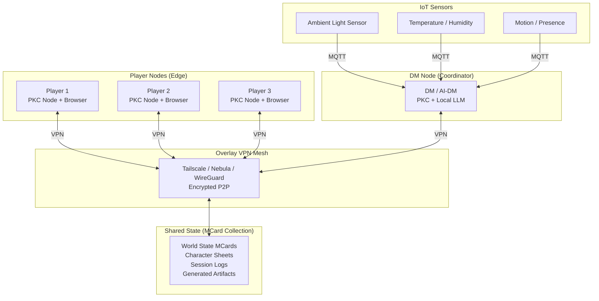
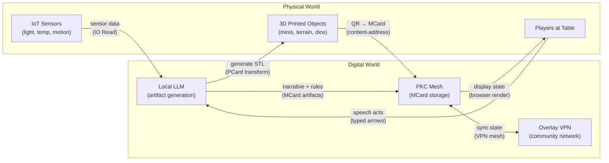

# D&D Sovereign Playground: IoT, LLM, and Arithmetized Game Dynamics

> **Thesis**: Every element of a D&D game — characters, spells, dice, maps, items, stories, communities — can be **arithmetized** as compositions of **Sum Types** (choices) and **Product Types** (combinations). When played over a **[[Hub/Tech/Approaches/PKC as the Mesh Network|PKC mesh network]]** with **[[Hub/Tech/Overlay VPN as Sovereign Network|Overlay VPN]]**, enriched by **LLM-generated artifacts** and **[[3D printing|3D-printed gadgets]]**, the game becomes a universal training ground where **functions ARE generalized numbers**, **names ARE arrows**, and **language precision IS computational power**.

This article extends [[D&D as Engine for Prologue of Spacetime and Conversational Programming]] with three new dimensions: **physical-digital fusion** (IoT + 3D printing), **generative AI integration** (LLM as co-DM), and **type-theoretic grounding** (everything is $A + B$ or $A \times B$).

---

## 1. Everything Is a Sum or a Product: The Arithmetic of D&D

### 1.1 The Two Primordial Operations

[[Category Theory]] and [[Homotopy Type Theory]] teach that *all* data structures reduce to two operations:

| Operation | Type Theory | Arithmetic | D&D Manifestation |
| :--- | :--- | :--- | :--- |
| **Sum** ($A + B$) | Coproduct / Either / `\|` | Choice (OR) | *Which class do you choose?* Fighter **OR** Wizard **OR** Cleric |
| **Product** ($A \times B$) | Product / Pair / `×` | Combination (AND) | *Your character IS* Race **AND** Class **AND** Background **AND** Abilities |

> **Core claim**: The entire D&D system — from character sheets to combat resolution to world-building — is an **algebra over Sum and Product types**. Learning to see this is learning to program.

### 1.2 Character as Product Type

A D&D character **is** a Product type — a tuple of components that must all be defined simultaneously:

$$\text{Character} = \text{Race} \times \text{Class} \times \text{Background} \times \text{Abilities} \times \text{Alignment}$$

Each component is itself a **Sum type** — a choice from a finite set:

$$\text{Race} = \text{Human} + \text{Elf} + \text{Dwarf} + \text{Halfling} + \text{Tiefling} + \cdots$$
$$\text{Class} = \text{Fighter} + \text{Wizard} + \text{Cleric} + \text{Rogue} + \text{Bard} + \cdots$$

**Nested Sum-Product structure**:

```
Character = (Human + Elf + Dwarf + ...)          -- Sum: choose Race
          × (Fighter + Wizard + Cleric + ...)    -- Sum: choose Class
          × (Sage + Criminal + Noble + ...)      -- Sum: choose Background
          × (STR × DEX × CON × INT × WIS × CHA) -- Product: all ability scores
```

This is precisely the structure of **[[Algebraic Data Type vs. Abstract Data Type|Algebraic Data Types]]** — the foundation of functional programming.

### 1.3 The d20 Resolution as Sum Type

Every d20 check produces a **Sum** (disjoint union of outcomes):

$$\text{d20Check} = \text{CriticalSuccess}_{20} + \text{Success} + \text{Failure} + \text{CriticalFailure}_{1}$$

The modifier refines this: `Roll + Modifier ≥ DC → Success | Failure`. This is the `Either` monad:

$$\text{resolve} : \text{Action} \times \text{Modifier} \times \text{DC} \to \text{Success}(\text{Effect}) + \text{Failure}(\text{Reason})$$

### 1.4 Spells as Exponential Types (Functions)

In type theory, **functions are exponentials**: $B^A$ represents all morphisms from $A$ to $B$. A D&D spell is exactly this:

$$\text{Spell} = \text{Effect}^{\text{Components}}$$

Where:
- **Components** $= \text{Verbal} \times \text{Somatic} \times \text{Material}$ (Product: all required)
- **Effect** $= \text{Damage}(\text{Amount}) + \text{Heal}(\text{Amount}) + \text{Control}(\text{Duration}) + \text{Utility}(\text{Info})$ (Sum: one outcome chosen)

> **The key insight for [[Conversational Programming]]**: **Functions are special numbers.** Just as $3^2 = 9$ counts the number of functions from a 2-element set to a 3-element set, `Spell` counts the number of distinct magical effects available from a given set of components. Language, names, spells — they are all **arrows in a category**, hence **generalized numbers** in the sense of [[Homotopy Type Theory]].

### 1.5 The Inventory as Multiset (Polynomial)

A player's inventory is a **polynomial** — a formal sum of items with multiplicities:

$$\text{Inventory} = 2 \cdot \text{HealthPotion} + 1 \cdot \text{Longsword} + 50 \cdot \text{Gold} + 3 \cdot \text{Torch}$$

This is a **polynomial functor** — exactly what [[PCard]] represents. Polynomials over types are the bridge between arithmetic and programming, between counting and computing.

---

## 2. Functions as Generalized Numbers: Why Names Are Arrows

### 2.1 The Yoneda Perspective

[[Yoneda Lemma|The Yoneda Lemma]] teaches: **an object is completely determined by its relationships to all other objects**. In D&D terms:

> You don't know what a "Wizard" *is* in isolation. You know what a Wizard *does* — its arrows to other objects: casts spells (arrow to Spell), has low HP (arrow to HitPoints), studies tomes (arrow to Knowledge).

**A name IS a bundle of arrows.** When a player says "I cast Fireball," they invoke a name that *is* a function — an arrow $\text{Caster} \to \text{Effect}$.

### 2.2 The Arithmetic of Names

In [[Homotopy Type Theory]], types are spaces, and terms of a type are points in that space. **Paths between points are proofs of equality.** This gives us:

| D&D Concept | HoTT Structure | Arithmetic Interpretation |
| :--- | :--- | :--- |
| **Character Name** | A point in the type `Character` | A specific number in the product $\text{Race} \times \text{Class} \times \cdots$ |
| **Spell Name** | A point in the type `Spell` | A specific function $\text{Components} \to \text{Effect}$ |
| **"Fireball = Fireball"** | Reflexivity path `refl` | $x = x$ (identity) |
| **"This wand casts Fireball"** | Transport along a path | Substitution: the wand *is* the spell in context |
| **Multiclass** | Path between types | An equivalence between $\text{Fighter}$ and $\text{Wizard}$ abilities |

### 2.3 Language Effectiveness = Arrow Precision

When a player speaks at the D&D table, they are **selecting arrows** in a category. The effectiveness of their language is the **precision of arrow selection**:

| Language Quality | Arrow Quality | Game Outcome |
| :--- | :--- | :--- |
| "I do something" | Identity arrow (no action) | DM: "Nothing happens" |
| "I attack" | Underspecified arrow (ambiguous target) | DM: "Attack what? With what?" |
| "I attack the goblin with my longsword" | Well-typed arrow `attack : (Goblin, Longsword) → Damage` | DM: "Roll to hit" |
| "I feint left, then strike at the goblin's exposed right flank" | Composed arrow `feint >>= strike` with tactical modifier | DM: "You gain advantage" |

> **Conversational Programming lesson**: The effectiveness of language in D&D — and in programming — is proportional to the **compositional precision of the arrows invoked**. Vague names invoke vague functions; precise names invoke precise functions.

---

## 3. The PKC Mesh as D&D Campaign Server

### 3.1 Architecture: D&D Over Sovereign Networks

The D&D game becomes a **distributed application** running on [[Hub/Tech/Approaches/PKC as the Mesh Network|PKC's mesh network]], connected via [[Hub/Tech/Overlay VPN as Sovereign Network|Overlay VPN]]:



Diagram: D&D campaign as a sovereign PKC mesh application

### 3.2 Game Artifacts as MVP Cards

Every game object maps to the [[Hub/Tech/Approaches/PKC as the Mesh Network#HyperCard-Based Architecture Networks of Arrows Realized|MVP Card]] stack:

| D&D Game Object | Card Type | Type Theoretic View |
| :--- | :--- | :--- |
| **Character Sheet** | `MCard` — immutable, content-addressed snapshot | Product type: $\text{Race} \times \text{Class} \times \cdots$ |
| **Adventure Module** | `PCard` — executable specification | Exponential: $\text{Outcome}^{\text{PlayerChoices}}$ (function from choices to outcomes) |
| **Spell Scroll** | `PCard` — transformation with pre/post conditions | Arrow: $\text{Components} \to \text{Effect}$ |
| **Session Treasury** | `VCard` — accountable value ledger | Polynomial: $\sum_i n_i \cdot \text{Item}_i$ |
| **DM's World Map** | `MCard` — versioned, hash-linked world state | Product of location states: $\prod_{loc} \text{State}_{loc}$ |
| **Session Log** | `MCard` chain — append-only event history | List type: $[\text{Event}]$ (inductive Sum) |

### 3.3 Community Formation via Overlay VPN

Following the [[Hub/Tech/Approaches/PKC as the Mesh Network#Prelude|IT Del model]] of progressive network sovereignty:

| Sovereignty Level | D&D Analog | VPN Configuration |
| :--- | :--- | :--- |
| **Private** | DM preparing campaign materials solo | Personal Tailscale node |
| **Community** | A party of 3–6 players forming a campaign group | Invited peers join a shared Tailscale network |
| **Public** | A guild of multiple parties sharing a world | Campus/regional Overlay VPN with shared MCard collections |
| **Federated** | Inter-guild tournaments across communities | Federated PKC mesh across multiple Overlay VPNs |

> **Pedagogical progression**: Players first learn **personal digital sovereignty** (managing their own PKC node), then **collaborative sovereignty** (forming a campaign group on Overlay VPN), then **institutional sovereignty** (joining the broader community mesh). This mirrors the [[Hub/Tech/Approaches/PKC as the Mesh Network#Progressive Network Sovereignty Education|IT Del three-level model]] exactly.

---

## 4. LLM as Co-Dungeon-Master and Artifact Generator

### 4.1 The LLM's Role: Generative Functions

The LLM acts as a **higher-order function factory** — it generates functions (artifacts) on demand:

$$\text{LLM} : \text{Prompt} \to \text{Artifact}$$

Where `Artifact` is a Sum type of everything the game needs:

$$\text{Artifact} = \text{Narrative} + \text{Map} + \text{NPC} + \text{Item} + \text{Puzzle} + \text{3DModel} + \text{SoundEffect} + \text{RuleInterpr}$$

### 4.2 Artifact Generation by Dimensionality

The LLM generates objects across the spectrum from text to physical:

| Dimension | Artifact Type | LLM Generation Method | D&D Use |
| :--- | :--- | :--- | :--- |
| **1D (Text)** | NPC dialogue, lore entries, riddles, session summaries | Direct text generation | DM reads aloud; players interact with NPCs |
| **2D (Image/Map)** | Battle maps, character portraits, item illustrations | Image generation (DALL-E, Stable Diffusion) | Visual aids on shared screen or printed |
| **3D (Printable)** | Miniatures, terrain tiles, custom dice, puzzle boxes | Generate [[OpenSCAD]] / STL code via LLM → 3D print | Physical game pieces on the table |
| **Code** | Game scripts, automation rules, dice rollers | Python/JavaScript generation | Automated combat resolution, NPC AI |

### 4.3 The LLM–DM Conversation as Monadic Pipeline

When the human DM collaborates with the LLM, they form a monadic pipeline:

```
DM Prompt:    "Generate a haunted forest encounter for level 3 party"
LLM Response: Either Error (PCard EncounterSpec)

DM Prompt:    "Create a 3D printable miniature for the forest guardian"
LLM Response: Either Error (MCard STLFile)

DM Prompt:    "Write the guardian's dialogue in archaic Balinese-inspired speech"
LLM Response: Either Error (MCard NPCDialogue)

Full pipeline:
  generateEncounter >>= create3DModel >>= writeDialogue >>= packageModule
  :: Prompt → Either Error (PCard AdventureModule)
```

Each generated artifact is stored as a content-addressed `MCard` in the PKC mesh — **immutable, verifiable, shareable** across the Overlay VPN.

---

## 5. IoT and 3D Printing: Breaking the Fourth Wall

### 5.1 IoT Sensors as Environmental Input

Following the [[Gamifying the Reverse Trivium - IoT AI and Video Games in ABC Curriculum#2.3 The Grammar Layer IoT as the "Reality Check"|Reverse Trivium Grammar Layer]], IoT sensors inject **physical reality** into the game world:

| IoT Sensor | D&D Integration | Type-Theoretic Role |
| :--- | :--- | :--- |
| **Ambient Light** | Room darkens → torches needed in game | `Reader LightLevel` — environment context |
| **Temperature** | Hot day → desert episode; cold → tundra | `Reader Temperature` — world-state modifier |
| **Motion/Presence** | New person enters room → NPC appears | `IO PresenceEvent` — observable side effect |
| **Sound Level** | Loud real room → monsters attracted in game | `State NoiseLevel → Either Encounter Safe` |
| **Humidity** | High humidity → swamp scenario triggers | Polynomial coefficient modifier on terrain type |

**The game world responds to the physical world**: an IoT-augmented D&D session creates a **feedback loop** between physical space and narrative space, making the [[Prologue of Spacetime]]'s concept of "spatially-anchored computation" tangible.

### 5.2 3D Printed Game Artifacts

LLM-generated designs become **physical game objects** via [[3D printing]]:

| 3D Printed Artifact | Generation Pipeline | Pedagogical Value |
| :--- | :--- | :--- |
| **Custom Miniatures** | Player describes character → LLM generates STL → Print | Character-as-Product-Type becomes tangible |
| **Terrain Tiles** | DM describes dungeon → LLM generates modular tiles → Print | Spatial reasoning, modular composition |
| **Custom Dice** | Community designs cultural dice (Balinese motifs) → Print | Sum types (outcomes) made physical |
| **Puzzle Boxes** | LLM designs lock puzzles with physical mechanisms → Print | Functions as physical transformations |
| **IoT Sensor Enclosures** | Community designs weather-proof sensor cases → Print | Infrastructure as community craft |
| **NPC Token Stands** | LLM generates portrait → Print base with QR code linking to MCard | Physical-digital bridge via content-addressing |

> **The pipeline**: `Player describes (1D text) → LLM generates (code/3D model) → 3D printer manufactures (physical object) → Object enters game space`. This is the **full Reverse Trivium**: Rhetoric (describe) → Logic (generate) → Grammar (manufacture).

### 5.3 The Complete Physical-Digital Loop



Diagram: The complete IoT–LLM–3D printing–PKC loop for sovereign D&D

---

## 6. Arithmetizing Sophisticated Activities

### 6.1 HoTT: Paths, Equivalences, and Game Mechanics

[[Homotopy Type Theory]] provides the framework to see that **many sophisticated game activities are simply arithmetic in disguise**:

| HoTT Concept | D&D Implementation | Why It's "Just Arithmetic" |
| :--- | :--- | :--- |
| **Path** $p : a =_A b$ | Two routes through a dungeon that reach the same room | Different computations yielding the same result — both are *valid* |
| **Transport** | Carrying proficiency bonuses to a new context | Moving values along a path: if Fighter ≡ Paladin in combat context, transport stats |
| **Higher Inductive Type** | The game world itself — with both locations (points) and passages (paths) | A space defined by generators (rooms) AND relations (corridors) — Sum + Product |
| **Univalence** | "Equivalent characters are equal" | If two character builds produce identical mechanical outcomes, they're the *same* build |
| **Truncation** | Abstracting from *which* path you took to *whether* you arrived | Forgetting strategy details, keeping only success/failure — the `Bool` truncation of `Either` |

### 6.2 The Universal Arithmetic: Sum + Product Suffice

**Claim**: Every game mechanic in D&D can be expressed as nested Sum and Product types.

| D&D Mechanic | Sum/Product Decomposition |
| :--- | :--- |
| **Turn Order** | $\text{Turn} = \text{Move} \times \text{Action} \times \text{BonusAction?} \times \text{Reaction?}$ where `?` means $\text{Some}(X) + \text{None}$ |
| **Combat** | $\text{Attack} = \text{MeleeAttack}(\text{Weapon} \times \text{Target}) + \text{RangedAttack}(\text{Weapon} \times \text{Target}) + \text{SpellAttack}(\text{Spell} \times \text{Target})$ |
| **Saving Throw** | $\text{Save} = (\text{STR} + \text{DEX} + \text{CON} + \text{INT} + \text{WIS} + \text{CHA}) \times \text{Roll} \times \text{DC} \to \text{Success} + \text{Failure}$ |
| **Inventory Management** | Polynomial: $\sum_{\text{item}} \text{count}_{\text{item}} \cdot \text{Item}$ |
| **Multi-class** | Product of class features: $\text{Fighter}_3 \times \text{Wizard}_2$ (3 levels Fighter AND 2 levels Wizard) |
| **Advantage/Disadvantage** | $\text{Advantage} = \max(\text{d20}_1, \text{d20}_2)$; product of two Sums |
| **Party Composition** | Product of characters: $\text{Party} = \text{Char}_1 \times \text{Char}_2 \times \cdots \times \text{Char}_n$ |
| **Quest Branching** | Sum of possible outcomes: $\text{Quest} = \text{Path}_1 + \text{Path}_2 + \text{Path}_3$ |

### 6.3 Polynomial Functors: The Bridge

**[[Hub/Theory/Algebra/polynomial monad|Polynomial functors]]** are the mathematical bridge between "counting" and "computing":

$$P(X) = \sum_{i \in I} X^{A_i}$$

In D&D terms:
- $I$ = the set of **game situations** (Sum: which situation are we in?)
- $A_i$ = the set of **available actions** in situation $i$
- $X^{A_i}$ = the function space from actions to outcomes (Exponential: function type)
- $P(X)$ = the total game state as a polynomial in outcome types

> **This is exactly what [[PCard]] represents**: a polynomial functor over MCard types. The D&D game *is* a PCard — a polynomial composition of typed transformations.

---

## 7. Putting It All Together: A Sample Session

### Session: "The Subak Water Crisis" (IoT + LLM + 3D + PKC)

**Setup**:
- 4 players on PKC nodes connected via Tailscale Overlay VPN
- 1 human DM + 1 AI co-DM (local [[Ollama]] LLM via [[MCP]])
- IoT sensors in the physical room (light, temp, noise)
- 3D printer in the makerspace next door

**Turn 1: Scene Setting** (LLM generates, IoT modifies)

```
Human DM: "We need a monsoon scene"
AI co-DM: [Generates narrative MCard]
    "Dark clouds gather over the rice terraces.
     The air hangs heavy with moisture..."
IoT Input: Room humidity sensor reads 78%
AI co-DM: [Modifies narrative]
    "...the humidity is almost unbearable.
     Your clothes cling to your skin.
     (Humidity reading: 78% — matching game world!)"

Type: Reader HumidityLevel × Writer NarrativeLog → MCard SceneDescription
```

**Turn 2: Player Action** (Language precision as arrow selection)

```
Player (Water Manager role):
  "I inspect the upstream dam for structural integrity"

Type analysis:
  inspect : WaterManager × Dam × Aspect → IO (Either DamageReport SafeReport)
  -- Well-typed: specific actor, target, and aspect
  -- DC 12 Investigation check

DM: "Roll Investigation"
Player: d20 + 3 = 17 → Success
Result: Right (DamageReport "Cracks in the east wall")

Stored: MCard(hash=0x7f3a..., content=DamageReport)
        pushed to PKC mesh → all players see update
```

**Turn 3: Collaborative Problem Solving** (Monadic composition)

```
Party plan (composed arrows):
  assessDamage >>= calculateRepairMaterials >>= allocateLabor >>= scheduleRepair
  :: DamageReport
     → Either Error (MaterialList × LaborPlan × Schedule)

-- Each step is a d20 check with modifiers from player specializations
-- Failure at any step short-circuits (Either monad)
-- All decisions logged (Writer monad) → stored as MCard chain
```

**Turn 4: 3D Printing Integration**

```
AI co-DM: [Generates dam cross-section model]
  "Here's a cross-section of the damaged dam.
   I've generated an STL file showing the cracks."

Pipeline:
  describeStructure >>= generateOpenSCAD >>= compileSTL >>= print3D
  :: DamageReport → IO (MCard STLFile)

-- Players 3D print the dam section
-- Physical model on table shows exactly where cracks are
-- Physical object has QR code linking to its MCard hash
```

**Turn 5: Meta-Reflection** (Arithmetization made visible)

```
DM Debrief:
  "Notice what just happened:
   - Your character IS a Product type (role × skills × resources)
   - Your choices WERE Sum types (inspect OR reinforce OR evacuate)
   - Your plan WAS monadic composition (>>= chaining)
   - The dam model IS a polynomial (set of surfaces × parameters)
   - The session log IS content-addressed (every event has a hash)
   - You're playing over a SOVEREIGN NETWORK (your own VPN)
   - The AI generated ARTIFACTS (text + 3D model) as FUNCTIONS on demand
   
   Everything was arithmetic. Sum and Product. All the way down."
```

---

## 8. Why D&D Is the Optimal Vehicle for These Ideas

| Property of D&D | Why It Matters for This Framework |
| :--- | :--- |
| **50 years of proven engagement** | The game loop is addictive — people WANT to play |
| **Conversation IS the mechanic** | Language precision is rewarded, not optional |
| **Asymmetric roles (DM/Players)** | Models the LLM/User dynamic naturally |
| **Extensible rule system** | Easy to add IoT, 3D printing, PKC rules as "house rules" |
| **Session persistence** | Natural fit for content-addressed MCard chains |
| **Community formation** | Campaigns create tight-knit groups — natural Overlay VPN communities |
| **Dice = controlled randomness** | Models bounded rationality, Born-Infeld limits |
| **Everything has a name** | Names ARE arrows — language IS function invocation |

---

## See Also

- [[D&D as Engine for Prologue of Spacetime and Conversational Programming]] — The foundational mapping (speech acts, monadic pipeline, DM as Maxwell's Demon)
- [[Dungeons & Dragons]] — Core D&D article with mechanics and digital ecosystem
- [[Hub/Tech/Approaches/PKC as the Mesh Network]] — PKC architecture: arrows, cards, mesh
- [[Hub/Tech/Overlay VPN as Sovereign Network]] — Overlay VPN for community formation
- [[Prologue of Spacetime]] — The meta-game of continuation through counting
- [[Conversational Programming]] — Principles and practice of Vibe Coding
- [[Hub/Theory/Sciences/Computer Science/Programming Model/Functional Programming/Algebraic Data Type vs. Abstract Data Type]] — Sum/Product type foundations
- [[Homotopy Type Theory]] — Paths, transport, and univalence
- [[3D printing]] — Additive manufacturing as digital-to-physical bridge
- [[Gamifying the Reverse Trivium - IoT AI and Video Games in ABC Curriculum]] — AI as DM, IoT as Grammar Layer
- [[Hub/Theory/Algebra/polynomial monad]] — Polynomial functors as game state representations

## References

```dataview
Table title as Title, authors as Authors
where contains(subject, "Dungeons & Dragons") or contains(subject, "Sum Type") or contains(subject, "IoT") or contains(subject, "3D Printing") or contains(subject, "Overlay VPN")
sort title, authors, modified
```
