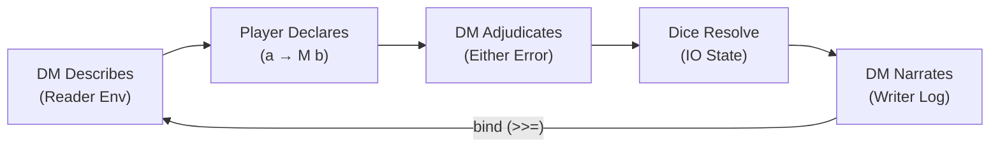

# D&D as Engine for Prologue of Spacetime and Conversational Programming

> **Core Thesis**: [[Dungeons & Dragons]]'s 50-year-old game loop — *describe → declare → adjudicate → resolve → narrate* — is a **living prototype of [[Conversational Programming]]**. Every utterance at the table is a **speech act** whose success depends on **word choice, context management, and compositional precision** — exactly the skills the [[Prologue of Spacetime]] aims to cultivate.

## 1. Why D&D? The Structural Isomorphism

D&D's core mechanism is a **structured conversation protocol** (see [[Dungeons & Dragons#1. How It Works The Core Mechanism]]). This loop maps directly onto the Conversational Programming pipeline:

| D&D Game Loop | Conversational Programming | Monadic Type |
| :--- | :--- | :--- |
| **DM Describes** the scene | **System presents** context/prompt | `Reader Env` |
| **Player Declares** an action | **User issues** a natural-language instruction | `a → M b` (typed arrow) |
| **DM Adjudicates** rules | **System validates** against pre-conditions | `Either Error a` |
| **Dice Resolve** the outcome | **Computation executes** with controlled randomness | `IO (State Seed)` |
| **DM Narrates** the result | **System returns** verifiable output | `Writer Log a` |
| ↻ Loop | ↻ Iterative refinement | `bind (>>=)` chains turns |

Diagram: D&D game loop as a monadic pipeline



**Key insight**: D&D is already Conversational Programming — participants just don't know they're doing functional composition with monadic context threading.

## 2. Speech Acts at the Table: Language Precision as Game Mechanic

Drawing on **J. L. Austin's [[speech act theory|Speech-act theory]]**, every D&D utterance carries three forces that map to computational layers:

| Speech-Act Force | D&D Example | Conversational Programming Analog | Prologue of Spacetime Lesson |
| :--- | :--- | :--- | :--- |
| **Locutionary** (literal meaning) | "I attack the goblin" | The raw text of the prompt | Words have **denotational semantics** — precision matters |
| **Illocutionary** (intended function) | Declaring an action vs. asking a question vs. bluffing | The **intent type**: command, query, assertion | The *function* of language shapes what computation is triggered |
| **Perlocutionary** (actual effect) | The goblin dies; party gains XP | The **output** of the computation | Effects are **bounded** — you can't get more than what the system allows (cf. [[Hub/Theory/Sciences/Physics/Born-Infeld Electrodynamics\|Born-Infeld Bound]]) |

### 2.1 Felicity Conditions = Pre-conditions

Austin's felicity conditions for successful speech acts map directly to monadic pre-conditions in Conversational Programming:

- **Preparatory**: The speaker must have the *authority* to perform the act → The player must *have* the spell slot, *be* in range, *possess* the key
- **Sincerity**: The speaker must *intend* the act → The player must declare actions in character (not meta-gaming)
- **Essential**: Both parties must *recognize* the act → The DM and player must share the rules vocabulary

> **Pedagogical outcome**: Playing D&D forces participants to distinguish between what they *say*, what they *mean*, and what *actually happens* — the three layers of every conversational programming turn.

## 3. The DM as Maxwell's Demon

The [[Prologue of Spacetime]] frames intelligence as Maxwell's-Demon-style decision-making (see [[Prologue of Spacetime#Maxwell's Demon in Prologue of Spacetime]]). The DM is precisely this demon:

| Maxwell's Demon Operation | DM Role | Computational Analog |
| :--- | :--- | :--- |
| **Observe** — measure molecule velocity | **Gather context** — listen to player declarations, assess world state | `IO (Reader Env)` — acquire information |
| **Decide** — open or close the gate | **Adjudicate** — apply rules, set difficulty class (DC) | `State GameWorld → Either Error Action` |
| **Act** — sort molecules | **Narrate** — describe consequences | `Writer NarrativeLog a` |
| **Remember** — store observations | **Track** — update NPC states, world changes, XP | `State (Map EntityId EntityState)` |
| **Erase** — Landauer's cost | **Forget** — abstract away irrelevant detail | Information compression; irreducibility |

**The D&D table is a training ground for demon placement**: Players learn *when* to make edge decisions (individual combat actions) vs. *when* to delegate to centralized coordination (party strategy), mirroring the edge/cloud sovereign network architecture.

## 4. D&D Mechanics → Prologue of Spacetime Game Design

### 4.1 Character Creation as Monad Construction

Each D&D character is a **product type** (combination of race × class × background × ability scores) wrapped in monadic context:

```
Character :: Race × Class × Background × AbilityScores
          → Reader TriHitaKarana        -- cultural context
          → State VillageCondition      -- evolving state
          → Writer DecisionLog          -- accumulated wisdom
          → Maybe ContinuationPath      -- survival uncertainty
```

**For Prologue of Spacetime**: Replace D&D character components with village-role components:

| D&D Component | Spacetime Analog | Monadic Role |
| :--- | :--- | :--- |
| **Race** | Cultural background (Balinese, urban tech, agrarian) | `Reader CulturalEnv` |
| **Class** | Functional role (Water Manager, Sensor Operator, Story Keeper) | Determines available `a → M b` arrows |
| **Ability Scores** | Resource capacities (Attention, Energy, Knowledge, Social Capital, Time, Resilience) | Modifiers on dice/resolution |
| **Alignment** | Orientation toward [[Tri Hita Karana]] dimensions | Guides `Reader` environment |

### 4.2 The d20 as Bounded Rationality

The d20 system elegantly encodes the **Born-Infeld bound** — the recognition that no decision-maker has infinite information:

- **Difficulty Class (DC)**: The system's threshold for "enough certainty"
- **Modifiers**: The player's accumulated competence (investment in edge-demon capability)
- **The roll itself**: Irreducible randomness — the universe's noise that no amount of preparation eliminates
- **Advantage/Disadvantage** (roll 2d20, take best/worst): A clean encoding of **information quality** — better observations reduce variance

### 4.3 The Session Log as Shared Verifiable Artifact

D&D's session log is already what Conversational Programming calls a **Shared Context** of content-addressed artifacts (see [[Dungeons & Dragons#5.6 The Session as Ledger Connecting D&D to Accounting]]):

| D&D Artifact | MCard/PCard/VCard Analog |
| :--- | :--- |
| **Character Sheet** | `MCard` — immutable snapshot of entity state |
| **Session Log** | `PCard` — sequence of state transitions with pre/post conditions |
| **Party Inventory** | `VCard` — shared ledger of accountable value |

## 5. Practical Game Design: D&D Exercises for Conversational Programming

### Exercise 1: "Say Exactly What You Mean"

**Setup**: The DM is a **literal parser**. Ambiguous instructions fail.

| Player Says | DM Response | Lesson |
| :--- | :--- | :--- |
| "I look around" | "You see: a room. What specifically do you examine?" | **Vague inputs → vague outputs**. Precision in prompts matters. |
| "I search the north wall for hidden doors" | "Roll Investigation (DC 15). You find a seam." | **Specific inputs → actionable outputs**. Type your intent. |
| "I open the door" | "Which door? There are three." | **Missing context → ambiguity error**. Provide sufficient `Reader Env`. |

**Conversational Programming learning**: Prompt engineering as typed arrows `a → M b` — sharper inputs yield sharper outputs.

### Exercise 2: "Chain Your Actions" (Monadic Composition)

**Setup**: Multi-step challenge requiring composed actions.

```
Player plan:
  1. Scout the guard patrol pattern  (IO observation)
  2. Pick the lock during the gap     (State → Either Error)
  3. Retrieve the artifact             (IO action)
  4. Leave a decoy                     (Writer → cover tracks)
  5. Escape through the window         (Maybe → success or capture)

DM evaluates:
  scout >>= pickLock >>= retrieve >>= plantDecoy >>= escape
  -- Each step's output feeds the next
  -- Failure at any step short-circuits (Either monad)
```

**Conversational Programming learning**: Operations compose through `bind (>>=)`. Context threads automatically. Errors propagate explicitly.

### Exercise 3: "The Subak Negotiation" (Reader + State + Writer)

**Setup**: Players role-play a Subak water-allocation meeting using D&D social mechanics.

- **Reader**: Tri Hita Karana values thread through all decisions
- **State**: Water levels, crop health, community prosperity evolve
- **Writer**: Every decision must be justified and logged for future generations
- **Charisma checks** (d20 + modifier) resolve disputes — but the *words used* affect the DC:
  - Invoking shared cultural values: DC reduced by 3
  - Using precise, measurable proposals: DC reduced by 2
  - Vague hand-waving: DC increased by 5

**Learning**: The effectiveness of language is not just semantic content but **pragmatic force** — how you frame matters as much as what you say.

## 6. The DM ↔ LLM Correspondence

The Prologue already positions AI as a "Dungeon Master" for learning (see [[Gamifying the Reverse Trivium - IoT AI and Video Games in ABC Curriculum#2.2 The Logic Layer AI as the "Dungeon Master"]]). D&D makes this correspondence concrete:

| D&D Dungeon Master | LLM in Conversational Programming |
| :--- | :--- |
| Maintains world state across sessions | Maintains context window / `State` |
| Adjusts difficulty to player skill | Adapts response complexity to user level |
| Never gives answers directly — poses challenges | Socratic companion: "Why did your approach fail?" |
| Improvises within rule constraints | Generates within prompt/guardrail constraints |
| Uses published modules as scaffolding | Uses [[SpecKit]] specifications as scaffolding |
| Coordinates multiple players toward shared goals | Orchestrates multi-agent workflows via [[BMAD-Method\|BMAD]] |

### 6.1 The MCP Tool as D&D Spell

Each [[MCP]] tool invocation is structurally identical to casting a D&D spell:

```
D&D Spell:
  Name:        Fireball
  Components:  V, S, M (a tiny ball of bat guano)
  Range:       150 feet
  Duration:    Instantaneous
  Effect:      8d6 fire damage, DC 15 Dexterity save for half

MCP Tool:
  Name:        search_web
  Parameters:  { query: string, domain?: string }
  Scope:       Internet-scale
  Latency:     Variable
  Effect:      Returns { summary: string, sources: URL[] }
```

Both require: **precise invocation** (correct name + components/parameters), **pre-conditions** (spell slot available / tool accessible), **bounded effects** (damage range / result quality), and **explicit costs** (spell slot consumed / compute time).

## 7. Reverse Trivium via D&D

Following the [[Hub/Theory/Sciences/Reverse Trivium - 1 Overview|Reverse Trivium]] (Rhetoric → Logic → Grammar):

| Trivium Stage | D&D Activity | Formalization |
| :--- | :--- | :--- |
| **Rhetoric** (context-first) | "We need to save the village from flooding!" | Immersive scenario creates motivation |
| **Logic** (pattern discovery) | "If I open the upstream gate AND close the downstream gate..." | Players discover conditional logic, resource trade-offs |
| **Grammar** (formalization) | "That's a State monad threading water-level changes through a pipeline of gate operations" | Named pattern becomes reusable tool |

## 8. Implementation Roadmap

### Phase 1: D&D One-Shot as Prologue Workshop (2–3 hours)

1. Pre-built characters mapped to Subak village roles
2. DM script with water-management scenarios
3. Emphasis on **language precision** — DM rewards precise action declarations
4. Post-session debrief: "What worked? Why did ambiguous language fail?"

### Phase 2: Campaign as Conversational Programming Course (2–3 day sprint)

1. Session 1: Character creation → Monad construction workshop
2. Session 2: Dungeon crawl → Monadic composition (chained actions)
3. Session 3: Social negotiation → Speech-act precision, Reader/Writer patterns
4. Session 4: Meta-reflection → Connect D&D patterns to Conversational Programming framework

### Phase 3: AI DM Integration (Ongoing)

1. LLM-powered DM using [[MCP]] tools for scene generation
2. Players practice Conversational Programming by *directing the AI DM*
3. Session logs become content-addressed [[MCard]] artifacts
4. Community builds reusable "adventure modules" as [[SpecKit]] specifications

## The Representation Ladder: Word Precision Scales with Power

The [[The_Representation_Engine|Representation Engine]] reveals that D&D naturally maps **representational precision** to **power level**. Each tier demands more precise word games because the consequences of imprecision scale with the power wielded:

| Tier | D&D Power Level | Representational Demand | Example | Consequence of Imprecision |
|:---|:---|:---|:---|:---|
| **Name** | **Cantrips** (at-will) | Distinguish A from B | "That's an Owlbear, not a Bear-Owl" | Fizzles harmlessly |
| **Describe** | **Spells** (slot-limited) | Functional precision | "Fireball: 20ft radius, 8d6 fire, DEX save halves" | Backfires painfully |
| **Compose** | **Rituals** (time-intensive) | Systemic coherence | "If Fighter grapples while Wizard readies Lightning..." | Summons wrong entity |
| **Prove** | **Epic Magic** (world-shaping) | Invariant truth | "This portal *must* work because spacetime is locally flat" | Tears a hole in reality |

**The insight**: D&D already teaches this implicitly — a mispronounced Cantrip is funny, a misdescribed Wish spell destroys the campaign. The Representation Engine makes this progression **explicit and systematic**, turning every power level into a lesson about how word precision determines representational fidelity.

Each progression follows the **Kleisli arrow** dependency chain: you cannot Describe what you haven't Named, Compose what you haven't Described, or Prove what you haven't Composed. This mirrors the monadic structure of D&D spellcasting — each higher-level spell **binds** the results of lower-level precision.

## See Also

- [[D&D Sovereign Playground - IoT, LLM, and Arithmetized Game Dynamics]] — Extended version: IoT, 3D printing, PKC mesh, Sum/Product arithmetization
- [[Dungeons & Dragons]] — Core D&D article with mechanics and digital ecosystem
- [[Prologue of Spacetime]] — The meta-game of continuation through counting
- [[Conversational Programming]] — Principles and practice of Vibe Coding
- [[Gamifying the Reverse Trivium - IoT AI and Video Games in ABC Curriculum]] — AI as Dungeon Master for learning
- [[Meta-Narrative Framework for Prologue of Spacetime]] — Agentic workflow for story development
- [[Cubical Logic Model]] — CLM three-dimensional verification framework

## References

```dataview
Table title as Title, authors as Authors
where contains(subject, "Dungeons & Dragons") or contains(subject, "Conversational Programming") or contains(subject, "Prologue of Spacetime")
sort title, authors, modified
```
