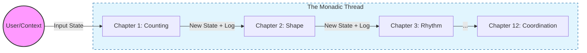

# Execution Plan: The 12-Chapter Genesis of Spacetime

This document outlines the incremental execution plan for creating the twelve chapters of the **Prologue of Spacetime**. It operationalizes the **Meta-Narrative Framework** by integrating **MVP Cards**, **HyperCard**, and **PKC** through the rigorous lens of the **Cubical Logic Model (CLM)**.

## 🧊 The Cubical Logic Model (CLM) Foundation

Every chapter and story element is constructed as a configuration of the **Cubical Logic Model**, which defines the three orthogonal dimensions of any well-formed concept.

### 🧬 The Monad as the Archetype of All Functions
If we subscribe to the belief that **all concepts can be expressed as Functions**, then the **Monad** is not just a pattern—it is the **Archetype** of the Function itself.

Just as Jung defined Archetypes as the "organs of the pre-rational psyche" that structure our perception, the Monad is the **Computational Archetype** that structures all valid operations. It is the **Primal Container** that:
1.  **Encapsulates Purity**: Holding the immutable truth (The Type/Abstract).
2.  **Manages Impurity**: Safely handling the chaotic reality of state and IO (The Concrete).
3.  **Enables Composition**: allowing disparate functions to connect (The Balanced).

To start with the Monad is to start with the **Unit of Meaning**. Any function that is *not* monadic is merely a fragment; only the Monad is complete.

1.  **Abstract Specification (The Type)**: The pure mathematical or logical definition (e.g., "A Count").
2.  **Concrete Implementation (The Instance)**: The tangible manifestation in the story or code (e.g., "A Water Drop", "A Variable").
3.  **Balanced Expectation (The Property)**: The testable truth or invariant (e.g., "Conservation of Mass", "Equality").

### 🧵 The Narrative as a Monadic Thread

The story itself is not just a sequence of events, but a **Monadic Computation** that threads through these CLM cubes. The narrative acts as the **Monad** (specifically, a composition of *Reader*, *State*, *Writer*, and *IO* monads) that traverses the "Spacetime" of the project.

*   **The Reader Monad**: Carries the *Cultural Context* (Tri Hita Karana) and *Configuration* (PKC Settings) that are immutable and accessible everywhere.
*   **The State Monad**: Carries the evolving *World State* (Village Prosperity, Network Topology, User Progress).
*   **The Writer Monad**: Accumulates the *Log* of the journey (The Story Text, The Audit Trail).
*   **The IO Monad**: Handles the *Effects* at the boundaries (User Interaction, System Deployment).

**The Meta-Game**: The user is essentially "running" this monadic chain. Each chapter is a function `Chapter :: Context -> State -> (Result, NewState, Log)`.

### ➕✖️ The Two Modes of Monadic Composition

All Monads compose via exactly **two fundamental operations**, which map directly to **Type Theory** and **Arithmetic**:

| Mode | Type Theory | Arithmetic | Intuition | Spacetime |
|------|-------------|------------|-----------|-----------|
| **Horizontal (×)** | Product Type (`A × B`) | Multiplication | "A **and** B together" | **Space** (Extension) |
| **Vertical (+)** | Sum Type (`A + B`) | Addition | "A **or** B in sequence" | **Time** (Sequence) |

*   **Horizontal Composition (Product / ×)**: Independent monads running in parallel. This is the structure of **Space**, **Tuples**, and **Pre-Established Harmony**.
*   **Vertical Composition (Sum / +)**: Sequential choices, one after another. This is the structure of **Time**, **Alternatives**, and **Appetition**.

**The Prologue Structure**:
*   The **Quadrivium** (4 columns) is a **Product**: Arithmetic × Geometry × Music × Astronomy.
*   The **Trivium** (3 rows) is a **Sum/Sequence**: Rhetoric → Logic → Grammar.
*   The **12 Chapters** = `3 × 4` = the full compositional space.

See [[docs/Monadic Composition - The Algebra of Types|Monadic Composition - The Algebra of Types]] for the complete theory.

---

## 🛠 Core Components Strategy

### 1. HyperCard (The Interactive Medium)
*   **Role**: The browser-based, hyperlink-driven interface where the story's interactivity takes place. It serves as the "Game Board" that renders the narrative and allows users to conduct *Conversational Programming*.
*   **Function**: By clicking, linking, and scripting within this medium, users drive the monadic computation of the story forward.

### 2. The Trinity of Cards (CLM Architecture)
*   **Role**: To guide recursive and universal thinking, we organize the story's agents and objects into three types of "Cards" arranged as the **Cubical Logic Model (CLM)**. These act as the **Representables**, serving as functors that map concepts across dimensions:
*   **CLM Mapping**:
    *   **VCard (Value Card)**: The *Abstract* dimension. Represents **The Principle** (e.g., The Accounting Principle) or the **MVP** (Most Valuable Participant). It defines the "Why".
    *   **PCard (Process Card)**: The *Concrete* dimension. Represents **The Character** (e.g., "The Counter") or the executable logic. It defines the "How".
    *   **MCard (Memory Card)**: The *Balanced* dimension. Represents **The Evidence** (e.g., The Ledger of counted items). It defines the "What" and serves as the verifiable record.

### 3. PKC (Personal Knowledge Container)
*   **Role**: The sovereign container that holds all different use cases and interactive events.
*   **Emergence**: As users generate VCards, PCards, and MCards, the **PKC** emerges as the comprehensive **Container of Knowledge**, persisting the state, history, and sovereignty of the user's digital world.

---

## 📅 Phase 1: Rhetoric - The "Why" (VCards)
*Focus: Establishing Value (Abstract Dimension focus).*

### Chapter 1: The Value of Counting (Arithmetic/Rhetoric)
*   **Narrative Arc**: A village elder explains why we must count water drops to ensure fairness.
*   **The Yoneda Insight**: Counting is not just enumeration; it is **Relationship**. As per the **Yoneda Lemma**, an object is defined by its relationships to other objects. To count "one drop" is to establish a morphism between the *Observer* and the *Observed*. Arithmetic and Relations cannot be separated.
*   **Monadic Action**: `IO (Maybe Count)` - The user observes and attempts to quantify.
*   **CLM Configuration**:
    *   *Abstract*: **Discrete Representation** (Natural Numbers).
    *   *Concrete*: **Water Drops** in a bamboo clock.
    *   *Balanced*: **Fairness** (Equal distribution).
*   **MVP Card**: **The Counter**.
*   **PKC Task**: **Initialize Identity**. (Root VCard).

### Chapter 2: The Meaning of Shape through Interaction(Geometry/Rhetoric)
*   **Monadic Action**: `State Topology (Graph)` - The user maps the connections.
*   **CLM Configuration**:
    *   *Abstract*: **Connectivity** (Graph Theory).
    *   *Concrete*: **Rice Terraces** and Irrigation Canals.
    *   *Balanced*: **Flow** (Gravity/Data routing).
*   **MVP Card**: **The Surveyor**.
*   **PKC Task**: **Establish Topology**. (Overlay Network).

### Chapter 3: The Power of Rhythm (Music/Rhetoric)
*   **Monadic Action**: `Writer Schedule ()` - The user logs the sequence of events.
*   **CLM Configuration**:
    *   *Abstract*: **Causality** (Non-Commutativity).
    *   *Concrete*: **Gamelan Beats** and Planting Cycles.
    *   *Balanced*: **Harmony** (Synchronization).
*   **MVP Card**: **The Conductor**.
*   **PKC Task**: **Define Causality**. (Event Log).

### Chapter 4: The Truth of Observation (Astronomy/Rhetoric)
*   **Monadic Action**: `Reader Context (Either Dispute Consensus)` - The user validates truth against the stars.
*   **CLM Configuration**:
    *   *Abstract*: **Verification** (SSOT).
    *   *Concrete*: **Star Alignment** (Calendar).
    *   *Balanced*: **Agreement** (Consensus).
*   **MVP Card**: **The Witness**.
*   **PKC Task**: **Establish SSOT**. (Verification Protocol).

---

## ⚙️ Phase 2: Logic - The "How" (PCards)
*Focus: Process and Execution (Concrete Dimension focus).*

### Chapter 5: Resource Allocation (Arithmetic/Logic)
*   **Monadic Action**: `State Resources (Distribution)` - Managing scarcity.
*   **CLM Configuration**:
    *   *Abstract*: **Division** (Rational Numbers).
    *   *Concrete*: **Water Shares** (Subak).
    *   *Balanced*: **Sustainability** (Quota limits).
*   **MVP Card**: **The Allocator**.
*   **PKC Task**: **Resource Quotas**. (Kubernetes Limits).

### Chapter 6: Network Pathfinding (Geometry/Logic)
*   **Monadic Action**: `Reader Map (Path)` - Finding the optimal route.
*   **CLM Configuration**:
    *   *Abstract*: **Routing** (Pathfinding Algorithms).
    *   *Concrete*: **Canal Gates** / **VPN Routes**.
    *   *Balanced*: **Efficiency** (Least resistance/latency).
*   **MVP Card**: **The Navigator**.
*   **PKC Task**: **Path Computation**. (Routing Rules).

### Chapter 7: Temporal Causality (Music/Logic)
*   **Monadic Action**: `State Machine (Transition)` - Moving from state to state.
*   **CLM Configuration**:
    *   *Abstract*: **State Transition** (Automata).
    *   *Concrete*: **Ceremony Sequence** (Dry -> Wet).
    *   *Balanced*: **Validity** (Legal transitions only).
*   **MVP Card**: **The Automaton**.
*   **PKC Task**: **State Management**. (Pipelines).

### Chapter 8: Orbit Prediction (Astronomy/Logic)
*   **Monadic Action**: `IO (Future Prediction)` - Forecasting based on data.
*   **CLM Configuration**:
    *   *Abstract*: **Extrapolation** (Functions).
    *   *Concrete*: **Harvest Date** / **System Load**.
    *   *Balanced*: **Accuracy** (Error margins).
*   **MVP Card**: **The Oracle**.
*   **PKC Task**: **Telemetry & Prediction**. (Dashboards).

---

## 🏗 Phase 3: Grammar - The "What" (MCards)
*Focus: Structure and Verification (Balanced Dimension focus).*

### Chapter 9: Counting Water (Arithmetic/Grammar)
*   **Monadic Action**: `Writer Ledger (Token)` - Immutable recording.
*   **CLM Configuration**:
    *   *Abstract*: **Schema** (Type Definition).
    *   *Concrete*: **Water Token** (MCard).
    *   *Balanced*: **Immutability** (Hash integrity).
*   **MVP Card**: **The Scribe**.
*   **PKC Task**: **Data Schema**. (MCard Structure).

### Chapter 10: Rice Terrace Topology (Geometry/Grammar)
*   **Monadic Action**: `State World (Structure)` - Building the container.
*   **CLM Configuration**:
    *   *Abstract*: **Architecture** (System Design).
    *   *Concrete*: **Islands Architecture** (Directory Tree).
    *   *Balanced*: **Modularity** (Separation of concerns).
*   **MVP Card**: **The Architect**.
*   **PKC Task**: **Topological Structure**. (Component Map).

### Chapter 11: Ceremonial Beats (Music/Grammar)
*   **Monadic Action**: `IO (Deployment)` - Executing the lifecycle.
*   **CLM Configuration**:
    *   *Abstract*: **Lifecycle** (CI/CD).
    *   *Concrete*: **Ritual Script** (Pipeline).
    *   *Balanced*: **Repeatability** (Idempotence).
*   **MVP Card**: **The Ritualist**.
*   **PKC Task**: **Lifecycle Management**. (GitOps).

### Chapter 12: Calendar Coordination (Astronomy/Grammar)
*   **Monadic Action**: `Reader Context (Harmony)` - System-wide integration.
*   **CLM Configuration**:
    *   *Abstract*: **Governance** (Protocol).
    *   *Concrete*: **Master Control** (PKC Interface).
    *   *Balanced*: **Sovereignty** (Self-rule).
*   **MVP Card**: **The Governor**.
*   **PKC Task**: **System Integration**. (Full SON).

---

## 🚀 Execution Workflow (The "Genesis Protocol")

For each chapter, we follow this recursive cycle:

1.  **Specify (VCard)**: Define the *Abstract* dimension (Value/Type).
2.  **Implement (PCard)**: Build the *Concrete* dimension (HyperCard/Code).
3.  **Verify (MCard)**: Validate the *Balanced* dimension (PKC Artifact/Test).

### Immediate Next Steps
1.  Create the directory structure for `Chapter 01`.
2.  Draft the **MVP Card: The Counter** (Specification).
3.  Build the **HyperCard Prototype** for the "Water Clock".
