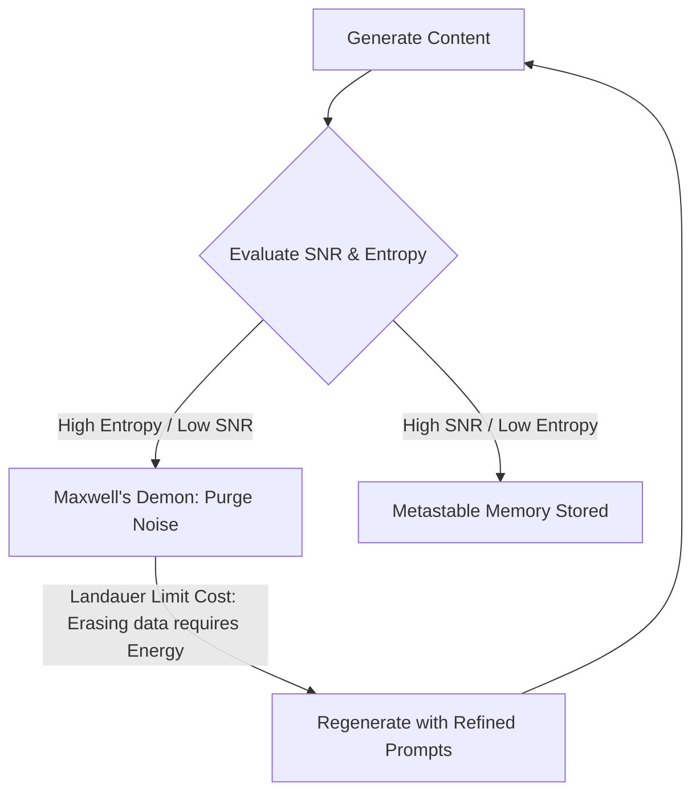
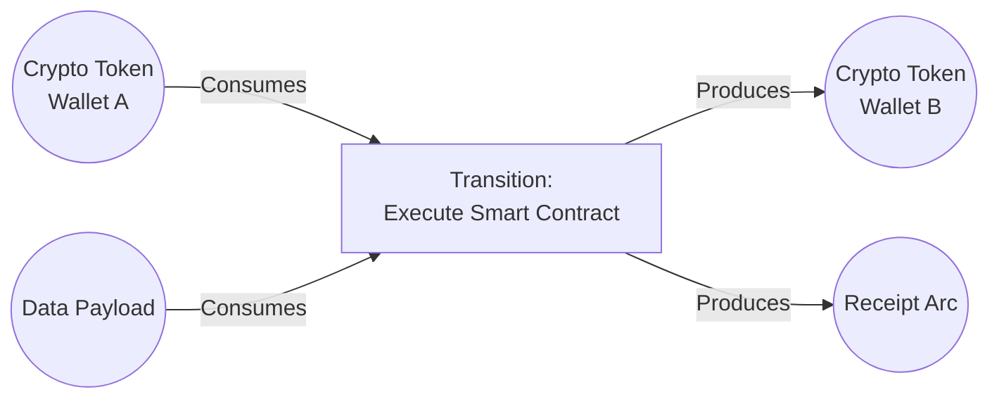
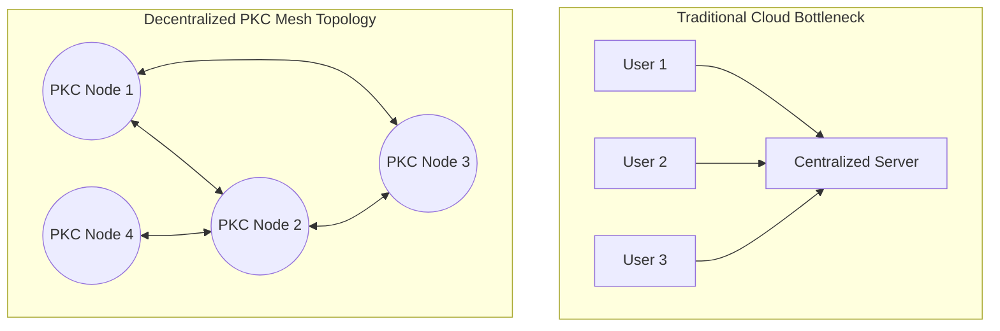

# Prologue of Spacetime: Conceptual Digest

> This document serves as a synthesized digest of the core philosophical and mathematical principles developed in the *Prologue of Spacetime* meta-game. For the complete, unabridged narrative and framework, see the master document: [`Prologue of Spacetime.md`](Prologue%20of%20Spacetime.md).

The **Prologue of Spacetime** is built on the proposition that **counting is the foundation of rationality**—an arithmetic-extended logic that acts as the universal language across physical, social, and computational domains.

## 1. Information Density and Metastable Memory

The architecture relies on the **Cubical Logic Model (CLM)**, operationalized through the **GASing** (Gampang, Asyik, Menyenangkan) pedagogy and the theological engineering practice of **Kenosis** (Self-Emptying).

To construct a Universal Namespace capable of hosting any domain, the system must start with an "Empty Schema." This deliberate constraint maximizes **Information Density**—the amount of actionable knowledge transmitted per unit of cognitive effort, bound by the equation:

$$ \text{Effective Learning} = \text{Compression (Density)} \times \text{Kenosis (Capacity)} $$

Within this ecosystem, stored knowledge operates not as static data, but as **metastable patterns in an excitable medium**, preserving structural integrity across computational, biological, and narrative transfers.

## 2. Thermodynamic Verification & The E-SNR-Entropy Framework

The Prologue recognizes that computational governance must respect physical laws—specifically, the thermodynamics of information.

### The E-SNR-Entropy Equation
Rather than relying on abstract gameplay scores, interactions and generated content are measured using a unified thermodynamic framework:

$$ I_{\text{density}} = \rho_E \times \text{SNR} \times e^{-\alpha H} $$

| Variable | Represents | Optimization Goal |
| :--- | :--- | :--- |
| **$I_{\text{density}}$** | Total Information Density (Output) | **Maximize** |
| **$\rho_E$** | Energy (Compute resources, frequency) | **Optimize** |
| **$\text{SNR}$** | Signal-to-Noise Ratio (Accuracy, usefulness) | **Maximize** |
| **$H$** | Entropy (Assumption load, complexity bloat) | **Minimize** |

To maximize Output ($I_{\text{density}}$), the system heavily penalizes Entropy. Blind accumulation of heuristic defense mechanisms—"complexity creep"—is mathematically discouraged.

### Landauer's Principle and the Maxwell's Demon
The system maintains health through an **Optimization Loop** (The Circle of Life), purging underperforming models and regenerating them with refined prompts. 

This loop acts as a systemic **Maxwell's Demon**. Guided by **Landauer's Principle**, the model formally acknowledges that erasing noise or classifying truth is never "free"—it carries an irreducible thermodynamic cost ($k_B T \ln 2$). The VCard in the CLM acts as the gatekeeper identifying what must be annihilated.

## 3. Monadic Namespaces and Petri Net Automation

The system relies on functional programming invariants beneath the surface, but exposes them to users through conversational workflows akin to **Dungeons & Dragons**.

| D&D Conversational Play | Topos / Category Theory Equivalent | Petri Net Equivalent |
| :--- | :--- | :--- |
| Nouns & Objects ("I use the Sword") | **Product Types** (Combinatorial Sequence) | **Places** (State/Resources) |
| Actions ("I attack the Goblin") | **Sum Types** (Spaces of Possibility) | **Transitions** (Events) |
| Dungeon Master Validation | **Path Equivalence** (Structural Proofs) | **Token Verification** |

- **Polynomial-First Framing**: Workflows behave as Place/Transition (PT) matrices. A massive namespace of functions allows noun-and-action choices to trigger discrete computational transitions.
- **The Monadic Mental Model**: Under the hood, uncertain states (*Maybe*), branching failures (*Either*), and continuous effects (*IO*) are governed by safe Monadic loops.

### Computable Currency and Resource Contention
- **Petri Nets and Cryptographic Tokens**: The system's workflows operate as formal **Petri Nets**. By making input tokens cryptographically encoded, they act as a literal **computable currency** controlling state, access, and permissions. Double-spending is mathematically prohibited because tokens must be explicitly consumed and produced along formal arcs.

- **Overcoming the Dining Philosophers**: The classic **Dining Philosophers** problem illustrates how unstructured resource contention creates deadlocks. Using topological diversity (Magnitude) measurements, a deadlock occurs when systemic concurrency drops to zero. By relying on cryptographically verified tokens to drive Petri Net transitions, the system structures state execution to mathematically prevent deadlocks, ensuring parallel processes scale safely.

## 4. Self-Aware Causal Networks (Cultural Topology)

The meta-game is physically and narratively grounded in **Bali, Indonesia**. This context provides a tangible mapping of functional abstraction to spatial Reality:

- **Tri Hita Karana**: The Balinese philosophy of triple harmony (Divine, Human, Nature) provides the operational template for **Sovereign Operational Networks (SON)** becoming self-aware—adapting to environments, gaining social validation, and maintaining ecological balance.
- **Cloud vs. Edge Decisions**: The deployment topology heavily favors localized "Edge" contexts (Subaks and Banjars). Edge decisions are proximate, low-latency, and culturally sovereign.

### Scaling via Meshed PKC Nodes
To support a massive number of simultaneous players without falling victim to the bottlenecks and latencies of centralized Cloud computing, the game's Edge contexts are powered by **meshed Personal Knowledge Container (PKC) nodes**. 

By meshing PKC nodes, each player brings their own localized compute and state-storage to the table. This peer-to-peer fabric allows the game to scale horizontally. Local interactions trigger local Petri Net workflows, ensuring the meta-game remains fast, sovereign, and deeply resilient.

---
*The Prologue of Spacetime is where math, cosmology, computation, and cultural wisdom converge into a single, addressable namespace.*
