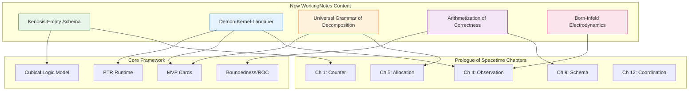

# WorkingNotes Content Summary: Integration Opportunities for Prologue of Spacetime

> **Generated**: 2026-02-07
> **Period Analyzed**: February 4-7, 2026 (Last 3 Days)
> **Source**: `docs/WorkingNotes/`

---

## Executive Summary

This document summarizes **recently added content** (Feb 4-7, 2026) in the `docs/WorkingNotes` directory and identifies material **most suitable for incorporation** into the **Prologue of Spacetime** project. The analysis reveals significant theoretical developments that directly extend and strengthen the project's core framework—the **Cubical Logic Model (CLM)**, **MVP Cards architecture**, and the **Quadrivium-based curriculum**.

---

## 🔥 High Priority: Core Framework Extensions

These newly developed articles directly extend the conceptual architecture of the Prologue of Spacetime and should be considered for **immediate integration**.

### 1. The Kernel-Demon-Landauer Synthesis

**Key Articles Created:**
- `Hub/Theory/Sciences/Maxwell's Demon.md` (updated)
- `Hub/Theory/Integration/Maxwell's Demon as Kernel Operator - The Thermodynamics of Information Annihilation.md` (new)
- `Permanent/Projects/PKC Kernel/PTR as Maxwell's Demon - The Thermodynamics of Zero Trust Governance.md` (new)
- `Hub/Theory/Sciences/Landauer's Principle.md` (updated)
- `Hub/Theory/Mathematics/Kernel.md` (new)
- `Hub/Theory/Mathematics/Rank-Nullity Theorem.md` (updated)

**Core Insight:**
> PTR (Polynomial Type Runtime) is operationally isomorphic to Maxwell's Demon. Both are **classification operators** that sort information with an irreducible thermodynamic cost governed by Landauer's Principle.

**Relevance to Prologue:**
| Prologue Concept | New Content Connection |
| :--- | :--- |
| **VCard (Verification)** | VCard = Kernel Specification (defines what is annihilated vs. allowed) |
| **PTR Execution** | PTR = Maxwell's Demon (the gatekeeper of truth) |
| **Zero Trust Architecture** | Zero Trust = Maximizing Nullity by Default |
| **Energy/Cost Accounting** | Landauer: Every denied request has a thermodynamic cost |

**Recommended Actions:**
1. **Incorporate into Chapter 4 (Observation)**: The Demon-Gatekeeper isomorphism enriches the "Observer" chapter with a physics-based verification framework.
2. **Update MVP Cards Design Rationale**: Add the thermodynamic dimension—VCards have a "cost" measured in Landauer bits.
3. **Link from the Boundedness Framework**: The new content operationalizes the "bounded verification" concept already in the README.

---

### 2. Kenosis and the Empty Schema Principle (Operationalized)

**Key Articles Updated:**
- `Hub/Theory/Integration/Kenosis and the Empty Schema Principle - Operationalizing the Theology of Emptiness.md`
- `Hub/Theory/Sciences/Computer Science/Programming Model/Functional Programming/The Wordless Book - The Generating Principle of Universal Semiotics.md` (updated)
- `Hub/Theory/Category Theory/Wordless Book - Universal Application Pattern.md` (updated)
- `Hub/Philosophy/Ontology/The Nullity of Ontology.md` (new)

**Core Insight:**
> Kenosis (self-emptying) is not a metaphor but a **rigorous engineering constraint**. Universal applicability requires emptiness. The Empty Schema Principle is the operational form of this ancient theological insight.

**Relevance to Prologue:**
| Prologue Concept | New Content Connection |
| :--- | :--- |
| **CLM's "Wordless Book"** | Kenosis = Mathematical foundation for the domain-independent schema |
| **Three Tables (Handle/Card/Version)** | Corresponds to the irreducible Kenotic triad (Surrender/Emptying/Filling) |
| **GASing Methodology** | Kenosis provides the *why* behind starting with "nothing" |

**Recommended Actions:**
1. **Add "Kenosis" Section to Chapter 1 (The Counter)**: Explain that counting "from zero" is not arbitrary—it is the Kenotic Principle operationalized.
2. **Link from Structure and Vision**: Reference the Kenosis article as the philosophical basis for the Empty Schema design.
3. **Operational Rules**: The four engineering rules (Least Assumption, Maximum Receptivity, Constant Surrender, Progressive Sanctification) can be mapped directly to chapter learning objectives.

---

### 3. The Universal Grammar of Decomposition

**Key Article Created:**
- `Hub/Theory/Integration/The Universal Grammar of Decomposition.md`

**Core Insight:**
> Fourier Transform, Laplace Transform, Polynomial Functors, and Place Value Systems are all instances of a single paradigm: **Decomposition into a Basis and Composition via Weighted Summation**.
> 
> $$f = \sum_k c_k \cdot \phi_k$$

**Relevance to Prologue:**
| Prologue Concept | New Content Connection |
| :--- | :--- |
| **Polynomial Functor Architecture** | $P(X) = \sum A_i \times X^{B_i}$ — This article formalizes *why* the polynomial structure is universal |
| **MCard/PCard Structure** | MCard = Digit (Atomic), PCard = Polynomial Functor (Composite) |
| **Hash Polynomial** | Rabin Fingerprint $H = \sum h_i \cdot p^i \mod q$ as a Place Value System |

**Recommended Actions:**
1. **Incorporate into Chapter 5 (Allocation)**: The "Grammar of Decomposition" is the foundational logic for resource allocation.
2. **Update the README's "Universal Grammar" Section**: Link directly to this article.
3. **Create a Diagram**: The mermaid diagram in the article can be integrated into the main project documentation.

---

### 4. The Arithmetization of Correctness

**Key Articles Created:**
- `Hub/Theory/Integration/The Arithmetization of Correctness - Boundedness as Proof.md`
- `Hub/Theory/Mathematics/The Epsilon-Delta Definition - The Arithmetic of Continuity.md`
- `Hub/Theory/Category Theory/Logic/Correctness.md` (updated)
- `Hub/Theory/Category Theory/Logic/Continuous.md` (updated)

**Core Insight:**
> Correctness is not binary (True/False) but a **Geometric Magnitude**. To be "Correct" means to be **Integrable** (Bounded) and **Extendable** (Analytic). The measure of correctness is the **Region of Convergence (ROC)**.
>
> **Perfect Correctness**: $\text{Left Kan} \cong \text{Right Kan}$

**Relevance to Prologue:**
| Prologue Concept | New Content Connection |
| :--- | :--- |
| **Balanced Expectations (CLM Axis 3)** | "Boundedness as Proof" formalizes what it means for expectations to be "balanced" |
| **VCard Verification** | VCard checks whether the system is within its ROC |
| **GASing "Gampang" (Easy)** | Easy = Bounded = Convergent |

**Recommended Actions:**
1. **Integrate into Chapter 9 (Schema)**: The Arithmetization framework provides the formal definition of schema correctness.
2. **Update the Boundedness Framework in README**: The current README mentions boundedness; link to this article for the formal theory.
3. **Add to "Reliability" Document**: The Epsilon-Delta article strengthens the "Continuous Presence" discussion.

---

## 📖 Medium Priority: Enriching the Quadrivium Chapters

These articles provide rich theoretical context for specific chapters.

### 5. Born-Infeld Electrodynamics (New Physics Article)

**Key Article:** `Hub/Theory/Sciences/Physics/Born-Infeld Electrodynamics.md`

**Core Insight:**
> Born-Infeld theory introduces a **maximum electric field strength $b$**, solving the infinite self-energy problem. This is the physics analog of the Kernel Bound: states exceeding $b$ are "annihilated."

**Relevance:**
- **Chapter 4 (Observation)**: Models how observers can only perceive within bounded ranges.
- **Chapter 8 (Prediction)**: Links to the D-brane action in string theory—predictive cosmology.

---

### 6. Structure and Vision Refinements (Feb 6)

**Key Commits:**
- `Hub/Theory/Sciences/SoG/Structure and Vision for Prologue of Spacetime.md` (detailed refinements)

**Core Insight:**
> The Quadrivium is formally articulated with Arithmetic as the **universal representable** for Geometry, Music, and Astrobiology.

**Relevance:**
- **Directly updates `chapters/00_Structure_and_Vision.md`**: Any changes in WorkingNotes should be mirrored.
- **README Consistency**: Ensure the mermaid diagram (Arithmetic → Geometry/Music → Astrobiology) is synchronized.

---

### 7. Diary Insights (Feb 6-7)

**Key Files:**
- `Fleeting/Diary/2026-02-06.md`
- `Fleeting/Diary/2026-02-07.md`

**Notable Session Summaries:**
| Date | Key Development |
| :--- | :--- |
| **Feb 6** | "The Day of Arithmetization" — The Epsilon-Delta Definition, Boundedness, Extension, and Decomposition articles |
| **Feb 7** | "Operationalizing Theology & Unifying Paradigms" — Kenosis engineering rules, Demon-Kernel-Landauer synthesis, Born-Infeld electrodynamics |

**Recommended Action:**
- Use these diary entries as **narrative material** for the Prologue's "Story" dimension. The intellectual journey itself is a demonstration of the CLM methodology.

---

## 🔗 Proposed Integration Map

---

## ✅ Recommended Next Steps

### Immediate (This Week)
1. **Symlink** the "Maxwell's Demon as Kernel Operator" article into `docs/` as it directly extends the PTR architecture documentation.
2. **Update README.md** to reference the "Universal Grammar of Decomposition" in the "Universal Grammar" section.
3. **Add Thermodynamic Cost** sidebar to `MVP Cards Design Rationale` referencing Landauer's Principle.

### Short-Term (Next 2 Weeks)
4. **Create `chapters/Kenosis_and_the_Empty_Schema.md`**: A formal bridge article connecting the theology to the Empty Schema implementation.
5. **Integrate Arithmetization of Correctness** into the "Balanced Expectations" axis definition in the CLM documentation.
6. **Update Observability Document**: Add the Maxwell's Demon perspective to the "Living Spaces" section.

### Medium-Term (Next Month)
7. **Develop Chapter 12 (Coordination)** using the Demon-Kernel-Landauer synthesis as the theoretical backbone.
8. **Create a "Thermodynamics of Governance" section** in the Structure and Vision document, linking Law/Norms/Market/Architecture to Landauer costs.

---

## 📁 Full List of Recently Modified/Created Files

The following files were added or modified in `docs/WorkingNotes/` between Feb 4-7, 2026 (based on git log):

| Category | Files |
| :--- | :--- |
| **Core Synthesis** | `Maxwell's Demon as Kernel Operator`, `PTR as Maxwell's Demon`, `Kenosis and the Empty Schema Principle`, `The Universal Grammar of Decomposition`, `The Arithmetization of Correctness` |
| **Mathematics** | `Kernel.md`, `Rank-Nullity Theorem.md`, `The Epsilon-Delta Definition` |
| **Physics** | `Born-Infeld Electrodynamics.md`, `Maxwell's Equations.md`, `Landauer's Principle.md` |
| **Philosophy** | `The Nullity of Ontology.md` |
| **Architecture** | `PTR.md`, `PTR Gatekeeper Pattern.md`, `MVP Cards Design Rationale.md` |
| **Structure** | `Structure and Vision for Prologue of Spacetime.md` |
| **Diaries** | `2026-02-06.md`, `2026-02-07.md` |

---

## Conclusion

The last three days have produced a remarkable synthesis connecting **thermodynamics**, **linear algebra**, **category theory**, and **theology** through the unifying concept of the **Kernel** (Null Space). This work directly strengthens the Prologue of Spacetime's foundational claims about the **CLM as a Universal Namespace** and provides the formal machinery to understand **verification costs**.

> **Key Insight to Propagate**: *Every act of verification has a thermodynamic cost. The VCard is not just a "policy file"—it is an energy budget.*

By integrating these insights, the Prologue of Spacetime can demonstrate that its **Unifying Namespace** is not merely pedagogically convenient, but **physically necessary** for any system that respects the laws of information thermodynamics.

---

*Document generated by analyzing git history and file contents in `docs/WorkingNotes/` for modifications between 2026-02-04 and 2026-02-07.*
