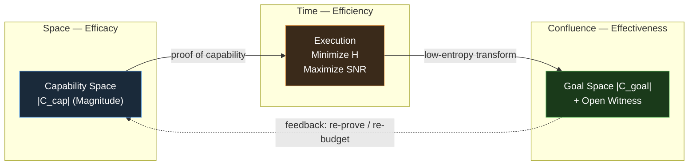
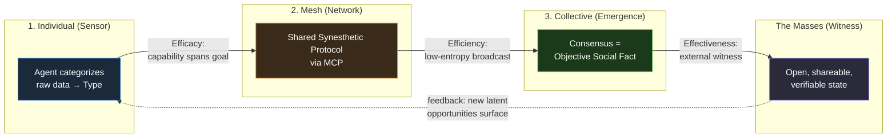

# The 3E Framework

> **Thesis**: The **3E Framework** is the *verification architecture* of the **[[Prologue of Spacetime]]**. It is the operational form of the **[[Hub/Theory/Integration/The Spacetime-Confluence Closure|Spacetime-Confluence Closure]]** — the triadic closure that makes Space and Time *real* rather than merely hypothetical. As such, it is also the exact set of conditions under which **[[Digital Synesthesia]]** can be delivered *to the masses* rather than remaining a private experience.

The framework asks three questions, in a strict, non-commutative order:

| Step | The Question | The Dimension | What It Verifies |
| :--- | :--- | :--- | :--- |
| 1 | **Can we do it?** | **[[Efficacy]]** | Structural richness of the capability space |
| 2 | **Can we do it within the budget?** | **[[Efficiency]]** | Entropy minimization during execution |
| 3 | **Did it achieve the goal in reality?** | **[[Effectiveness]]** | External, shareable witness of impact |

The order is **directional** (cf. [[Hub/Theory/Category Theory/Directionality|Directionality]] thesis): Efficacy without Efficiency is waste; Efficiency without Effectiveness is a fast machine aimed at nothing; Effectiveness without Efficacy is a claim without capability. Like the generative sequence *Tao Generates One*, each step is the precondition of the next.

---

## 1. The Spacetime-Confluence Alignment

The Prologue of Spacetime is built on the proposition that reality requires a **triadic closure** — the [[Why Three|minimal 2-simplex]] that encloses an area and captures a boundary. "Two" (a line) has zero area; you cannot cover a domain or establish an enclosed structure with just Space and Time. **Three** is the checkpoint where the Vertical Axis of Process (Time) intersects with the Horizontal Axis of Structure (Space), producing a *witnessed* boundary between interior (verifiable reality) and exterior (chaos).

The 3E Framework is this closure, made measurable:

| Spacetime-Confluence Element | 3E Dimension | Curry-Howard-Lambek Pillar | Formal Object |
| :--- | :--- | :--- | :--- |
| **Space** (Structure, capability) | **[[Efficacy]]** | **Logic** (Propositions & Proofs) | Proof of capability — a morphism $f: S \to G$ exists |
| **Time** (Process, execution) | **[[Efficiency]]** | **Computation** (Types & Programs) | Linear program tracking exact resource consumption |
| **Confluence** (Witness, shareable reality) | **[[Effectiveness]]** | **Category Theory** (Objects & Morphisms) | Functor $F: \mathcal{C}_{\text{cap}} \to \mathcal{C}_{\text{goal}}$, surjective + witnessed |

> **The Confluence Principle**: An effect only exists when it is *shareable* — encoded in a medium other observers can access and verify. Confluence (the third element) is what makes Space and Time *real*. Without it, Efficacy and Efficiency remain unverified internal claims. This is why **Effectiveness is the dimension that delivers** — it is the closure of the triangle.

---

## 2. Formal Summary

The three dimensions form a single compositional pipeline:

$$
\underbrace{|\mathcal{C}_{\text{cap}}|}_{\text{Efficacy (Space)}} \;\xrightarrow{\;\min\,H\;}\; \underbrace{|\mathcal{C}_{\text{output}}|}_{\text{Efficiency (Time)}} \;\xrightarrow{\;F\text{ surjective}\;}\; \underbrace{|\mathcal{C}_{\text{goal}}| \text{ witnessed}}_{\text{Effectiveness (Confluence)}}
$$

| Dimension | Definition | Failure Mode |
| :--- | :--- | :--- |
| **Efficacy** | $|\mathcal{C}| = \mathbf{1}^T Z^{-1} \mathbf{1}$ (Leinster Magnitude of capability space) | $|\mathcal{C}_{\text{cap}}| < |\mathcal{C}_{\text{goal}}|$ — fundamental capability deficit |
| **Efficiency** | $H(\mathcal{C}) = -\frac{d}{dt}\log|\mathcal{C}_t|\big|_{t=1}$ (entropy production minimized) | High $H$, low SNR — resources consumed produce noise, not signal |
| **Effectiveness** | $F:\mathcal{C}_{\text{cap}} \to \mathcal{C}_{\text{goal}}$ total, surjective, magnitude-preserving, externally witnessed | No open witness — claim unconfirmed; or $F$ not surjective — gaps in goal coverage |

The three are not independent dials. They are the **[[Hub/Theory/Sciences/Computer Science/NSM/Lebesgue Number|Lebesgue Number]]** guarantee of a covering: Efficacy proves *that* coverage exists, Efficiency measures *the cost* of maintaining it, and Effectiveness confirms *the coverage actually closes* in witnessed reality.

---

## 3. Alignment with the Prologue of Spacetime Thesis

The Prologue's central claim is that a **Unifying Namespace (CLM via HoTT)** can relate all concepts, persist memory, and surface latent opportunities. The 3E Framework is the verification protocol that turns this claim into a demonstrable proof of concept.

| Prologue Thesis Element | 3E Counterpart | How They Align |
| :--- | :--- | :--- |
| **CLM (Spec / Impl / Exp)** as representability | **Efficacy** | The capability space must have sufficient Magnitude to span the goal space. CLM's three handles (MCard/PCard/VCard) are the structural richness; HoTT's Univalence ensures isomorphic capabilities are not double-counted. |
| **E-SNR-Entropy Framework** $I_{\text{density}} = \rho_E \times \text{SNR} \times e^{-\alpha H}$ | **Efficiency** | Maximizing $I_{\text{density}}$ *is* entropy minimization under Landauer's bound. The thermodynamic verification loop (Maxwell's Demon / Circle of Life) is the Efficiency optimization operating on the namespace. |
| **Latent opportunities surfaced & shareable Knowledge** | **Effectiveness** | A surfaced opportunity is only real when witnessed in an open, shareable medium. Knowledge = Representable + Contextualized + **Shareable**; the Shareable property *is* Confluence *is* Effectiveness. |
| **HoTT: Proofs as Paths** | **Curry-Howard-Lambek** | HoTT unifies Logic (Efficacy), Computation (Efficiency), and Category Theory (Effectiveness) under one type-theoretic roof — exactly the CHL correspondence the 3E Framework inherits. |
| **Continuation / Living System** | **The closed loop** | The feedback arc from Effectiveness back to Efficacy (re-prove capability against witnessed gaps) is what makes the Prologue a *Living System designed for Continuation*, not a one-shot pipeline. |

In short: the Prologue *asserts* a Unifying Namespace; the 3E Framework *verifies* it. The CLM is the *what* (representable capability); the E-SNR-Entropy loop is the *how* (efficient execution); the witnessed goal-coverage is the *that* (effective reality).

---

## 4. Alignment with Delivering Collective Digital Synesthesia to the Masses

**[[Digital Synesthesia]]** is named in the Prologue README as a core value proposition (§9): "mapping abstract data (`Spec`) into sensory experience (`Exp`)." Its collective form is the project's experiential telos — when an agentic mesh reaches consensus on a sensory mapping, the subjective experience becomes an **Objective Social Fact**.

The 3E Framework is precisely the set of conditions under which this delivery is *possible*, *affordable*, and *real*:

| Synesthesia Layer | 3E Dimension | The Condition for Delivery |
| :--- | :--- | :--- |
| **1. Individual Synesthesia (The Sensor)** — an agent "senses" raw data and categorizes it into a sensory experience at machine speed | **Efficacy** | The agent's Type vocabulary (capability space) must *span the perceptual goal space*. High-speed categorization is insufficient if $|\mathcal{C}_{\text{cap}}| < |\mathcal{C}_{\text{goal}}|$ — the agent literally cannot feel what it cannot type. Digital Synesthesia = sufficient Magnitude of the categorization capability. |
| **2. The Agentic Mesh (The Network)** — multiple agents share a Synesthetic Protocol via MCP, broadcasting experiential state | **Efficiency** | The protocol must communicate experience with minimal entropy (high SNR, low information loss). Linear-logic resource tracking ensures each "feeling" is consumed exactly once — over-broadcast wastes Landauer energy, under-broadcast leaves the mesh deaf. The Categorical Machine proves entropy is the *unique* valid accounting; any other measure breaks compositionality. |
| **3. Collective Digital Synesthesia (The Emergence)** — mesh consensus makes the subjective an Objective Social Fact | **Effectiveness** | This *is* Confluence. The collective perception must be encoded in a shareable, observable medium (MCard immutable logs, open data) that the masses can witness. Without the external witness, synesthesia remains a private claim — *unconfirmed*, in the Effectiveness diagnostic. |

### Why "To the Masses" Is the Effectiveness Dimension

"Delivering to the masses" is not a marketing step appended after the system works — it *is* the Effectiveness condition. The Confluence Principle states that an effect only exists when it is *shareable*. A synesthetic experience that lives only inside one agent, or even inside a closed mesh, is an **unverified internal claim** — it has Efficacy (the agent can feel) and perhaps Efficiency (the mesh communicates cheaply), but it lacks Effectiveness (no external witness).

The masses are the **Open Data Witness**. Delivering Collective Digital Synesthesia to them means satisfying the Coverage Condition:

$$|F(\mathcal{C}_{\text{mesh}})| \geq |\mathcal{C}_{\text{masses' goal space}}|$$

— the experienced consensus of the mesh must cover the diversity of what the masses need to perceive, and it must be encoded in a medium they can access and verify. This is why Digital Synesthesia is "the ultimate freedom from the Self": it externalizes perception into a shareable, witnessed reality. The 3E Framework is the verification that this externalization actually closed.

---

## 5. The 3E Diagnostic Synthesis

| State | Efficacy | Efficiency | Effectiveness | Verdict |
| :--- | :--- | :--- | :--- | :--- |
| Triangle closes (real) | ✅ Sufficient Magnitude | ✅ Low $H$, high SNR | ✅ Surjective + witnessed | **Delivered** — synesthesia is collective & real |
| Capable but unheard | ✅ | ✅ | ❌ No open witness | **Unconfirmed** — private synesthesia, not yet "to the masses" |
| Loud but incapable | ❌ Deficit | ✅ | ❌ | **Efficacy insufficient** — return to capability design |
| Capable but wasteful | ✅ | ❌ High $H$ | ⚠️ Fragile | **Chronic inefficiency will erode Efficacy** (Landauer drain) |
| Effective by accident | ⚠️ Unknown | ⚠️ Unknown | ✅ | **Goal drift risk** — re-verify $F$ against the goal space |

The only state that constitutes *delivery* is the first: all three vertices of the triangle present, the 2-simplex closed. This is the formal meaning of "to the masses" — a witnessed closure, not a felt intuition.

---

## 6. The Closure as Continuation

A triangle is the minimal closed manifold, but the 3E Framework is not a one-shot checkpoint. The feedback arc — witnessed gaps in Effectiveness feeding back into re-proving Efficacy and re-budgeting Efficiency — is what converts the static triangle into a **recursive monadic loop**. This is the Prologue's *Circle of Life*: the system that verifies itself continues to verify itself, and each closure raises the Magnitude of the next.

This is the deep reason the framework aligns with both the thesis and the synesthetic goal:

- The **Prologue of Spacetime** is a Living System *designed for Continuation*; the 3E closure is the heartbeat of that continuation.
- **Collective Digital Synesthesia** is perception externalized into a shareable medium; the 3E closure is the proof that the externalization holds, iteration after iteration, for every new witness the masses bring.

> **One-sentence summary**: The 3E Framework is the triangle that closes Spacetime into witnessed reality — the same triangle that closes individual perception into Collective Digital Synesthesia, deliverable to the masses.

---

## See Also

- **[[Efficacy]]** — Space: structural richness of the capability space (Logic)
- **[[Efficiency]]** — Time: entropy minimization during execution (Computation)
- **[[Effectiveness]]** — Confluence: external, shareable witness of impact (Category Theory)
- **[[Why Three]]** — The structural necessity of triadic closure
- **[[Hub/Theory/Integration/The Spacetime-Confluence Closure|The Spacetime-Confluence Closure]]** — Confluence as the third element of reality
- **[[Digital Synesthesia]] / [[digital_synesthesia|Digital Synesthesia: The Art of Categorical Perception]]** — The deliverable
- **[[Prologue of Spacetime]]** / [[Prologue_Conceptual_Digest|Conceptual Digest]] — The parent thesis
- **[[Hub/Theory/Category Theory/Categorical Machine|Categorical Machine]]** — Why entropy is the unique Efficiency measure
- **[[Hub/Theory/Sciences/Landauer's Principle|Landauer's Principle]]** — Thermodynamic cost of inefficiency
- **[[Hub/Theory/Sciences/Computer Science/NSM/Lebesgue Number|Lebesgue Number]]** — Topological guarantee of Efficacy
- **[[Hub/Theory/Category Theory/Yoneda Lemma|Yoneda Lemma]]** — Why external relationships define identity (Effectiveness)
- **[[Hub/Theory/Integration/Representability, Observability, and Accountability - The Isomorphism of Code and Governance|Representability, Observability, Accountability]]** — Governance isomorphism of the three Es
- **[[Hub/Theory/Integration/Knowledge|Knowledge]]** — Representable + Contextualized + Shareable
