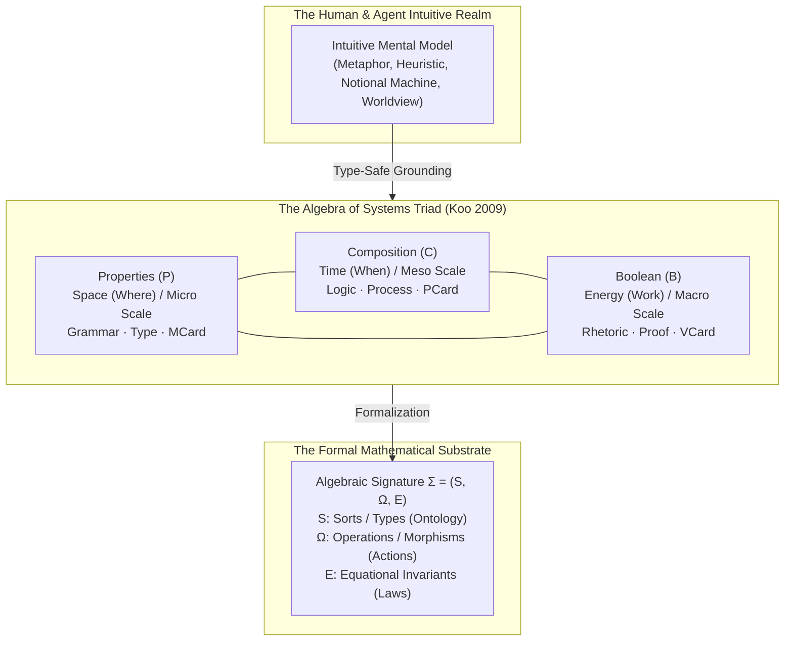

# Algebra of Systems and Mental Model Mapping: Grounding Intuitive Paradigms in Algebraic Signatures

> **"A mental model without a matching formal algebra is a hallucination; a formal algebra without an intuitive mental model is sterile syntax. True systems mastery emerges when human intuition and autonomous agents map distinct mental models to their exact algebraic signatures—preventing category errors, bounding uncertainty, and enabling continuous evolution under real options."**

---

## 1. The Algebra of Systems (AoS): The Universal Triadic Rosetta Stone

Developed by Dr. Benjamin Koo, Dr. Will Simmons, and Prof. Edward Crawley at MIT (2009), the **Algebra of Systems (AoS)** was formulated for complex multi-disciplinary systems engineering under extreme uncertainty. It provides the invariant foundation of *Prologue of Spacetime*, connecting physical reality, category-theoretic semantics, and economic real options valuation:

| Conceptual Axis | AoS Domain (Koo 2009) | Physical Ground | Real Options Scale (ROV) | Classical Trivium | Computational Trinitarianism | CLM Dimension | Geometric Simplex |
| :--- | :--- | :--- | :--- | :--- | :--- | :--- | :--- |
| **State / Memory** | **Properties ($P$)** | **Space (Where)** | **Micro Scale** (Parametric & Operational Options) | **Grammar** (Legal Terms) | **Type** (Currency Denomination) | **Abstract Spec ($A$)** | **0-Simplex (MCard)** |
| **Process / Flow** | **Composition ($C$)** | **Time (When)** | **Meso Scale** (Modular Architecture Options) | **Logic** (Causal Consequence) | **Algorithm** (Currency Transaction) | **Concrete Impl ($C$)** | **1-Simplex (PCard)** |
| **Proof / Boundary** | **Boolean ($B$)** | **Energy (Work)** | **Macro Scale** (Strategic Portfolio Options) | **Rhetoric** (Free Consensus) | **Proof** (Ledger Settlement) | **Balanced Exp ($B$)** | **2-Simplex (VCard)** |

### 1.1 The Multi-Scale Real Options Lens
- **Macro Scale (Real Options "On" Projects)**: Strategic flexibility, staged commitments ($\max(V_T - I, 0)$), and portfolio survivability under macroeconomic and cosmological shocks.
- **Meso Scale (Real Options "In" Projects)**: Baldwin-Clark modularity. Decoupling dependencies through **Transaction-Free Zones (TFZs)** generates a portfolio of independent upgrade options ($\sum_i \sigma_i \sqrt{T}$), enabling hot-swapping without stranding the architecture.
- **Micro Scale (Operational Dispatch)**: Component-level sizing, dynamic throttling, and invariant runtime checks ($\{P\}\,C\,\{Q\}$), ensuring execution never breaches mass, thermal, or Landauer energy budgets.

---

## 2. The Cognitive Imperative: Mapping Mental Models to Matching Algebras

### 2.1 The "Vibe Coding" & Novice Bottleneck
Cognitive Load Theory (Sweller) demonstrates that beginners cannot process abstract, ungrounded mathematical formalisms directly. They inevitably construct **Mental Models** (internal simulations, spatial metaphors, or mechanical "notional machines").

However, when mental models are unformalized:
1. **Category Errors**: Developers treat asynchronous distributed networks as sequential state machines, or confuse coordinate Doppler shifts with invariant token quantities.
2. **Semantic Drift ("Vibe Coding")**: Complex codebases degenerate into fragile heuristics because components lack formal equational invariants.
3. **Model Inflexibility**: Practitioners cling to an inappropriate mental model (e.g., Newtonian point-masses) when the problem demands another (e.g., Hamiltonian phase space).

### 2.2 The Solution: The Algebraic Signature $\Sigma = (S, \Omega, \mathcal{E})$
To achieve cognitive sovereignty, every mental model must be anchored to its **Matching Formal Algebra**:
- **Sorts ($S$)**: The distinct types of entities that exist in the model.
- **Operations ($\Omega$)**: The allowable transformations and composition rules.
- **Equational Laws ($\mathcal{E}$)**: The immutable conservation rules that hold across all observer perspectives.

---

## 3. The Master Sprint Mapping: Mental Models to Matching Algebras

Across the *Prologue of Spacetime* active sprints (`SPRINT-01` through `SPRINT-12`), each epoch trains players to transition from intuitive mental models to rigorous algebraic signatures:

| Sprint | Intuitive Mental Model | Matching Formal Algebra Signature $\Sigma = (S, \Omega, \mathcal{E})$ | AoS Domain | Active Baldwin Operator | Real Options Scale |
| :--- | :--- | :--- | :--- | :--- | :--- |
| **01. Tidepool** | The Sieve / Maxwell's Demon | **Discrete Monoid & Shannon Filtration**: $(\mathbb{N}, +, 0, \le)$ with sigma-algebra filtration $\mathcal{F}_t$; $\Delta H < -\epsilon$ | Properties ($P$) | Splitting ($\times$) & Excluding ($-$) | Micro Scale (Parametric) |
| **02. Cell Wall** | Fortress / Semi-Permeable Skin | **Heyting Algebra & Boundary Topology**: $(\mathcal{O}(X), \cap, \cup, \text{Int}, \partial)$; Gauss-Bonnet curvature closure | Properties ($P$) / Boolean ($B$) | Splitting ($\times$) | Micro/Meso Scale |
| **03. Swarm** | Flocking Birds / Orchestra | **Kuramoto Lie-Group Phase Action**: $(S^1, \oplus, \omega_i)$ over Leinster metric space; $D(P) > \theta$ | Composition ($C$) | Augmenting ($+$) & Inverting ($\text{Adj}$) | Meso Scale (Modular) |
| **04. Consensus** | Megalithic Skywatching Observatory | **Causal Poset & Univalent Identity Types**: $(E, \prec, \equiv)$ under BFT quorum intersection; $\sigma^2_{\text{truth}} \to 0$ | Boolean ($B$) / Composition ($C$) | Substituting ($\simeq \implies =$) | Meso/Macro Scale |
| **05. Bazaar** | Open Marketplace / Double Auction | **Polynomial Functors & Yoneda Lemma**: $y(A) = \text{Hom}(-, A)$; zero deadweight loss $\sum \text{In} = \sum \text{Out}$ | Composition ($C$) | Substituting ($\simeq$) & Inverting (Curry) | Meso Scale (Market) |
| **06. Subak** | Balinese Water Temple / Mesh Router | **Symmetric Monoidal Flow Network**: $(\text{Canals}, \otimes, I, \text{Weir})$; zero starvation across all edge paddies | Properties ($P$) $\to$ Composition ($C$) | Porting ($\operatorname{Lan}_K F$) | Meso Scale (Logistics) |
| **07. Monad** | Bronze Metallurgy Forge / Petri Net | **State Monad & Petri Net Incidence Algebra**: $(S \to (A, S), \mathbf{W}, M_0 \xrightarrow{\sigma} M_n)$; strict monotonic causal poset | Composition ($C$) | Splitting ($\times$) & Excluding ($-$) | Micro/Meso Scale |
| **08. Nexus** | Celestial Clock / Orbital Slingshot | **Hamiltonian Symplectic Manifold**: $(T^*Q, \omega = dq \wedge dp, \{H, -\})$; periodic Keplerian invariant tori | Composition ($C$) / Boolean ($B$) | Inverting (Platform Interface) | Macro Scale (Trajectory) |
| **09. Vault** | Secret Water Clock / Cryptographic Citadel | **Elliptic Curve Pairing & Circuit Ideal**: $(\mathbb{G}_1 \times \mathbb{G}_2 \to \mathbb{G}_T, \mathbb{F}_p[\vec{x}]/\mathcal{I})$; zero-knowledge verification | Boolean ($B$) | Substituting ($\simeq$) & Excluding ($-$) | Macro Scale (Zero-Leakage) |
| **10. Sheaf** | Terrace Hillside Ecosystem | **Sheaf Cohomology & Čech Nerve**: $(\mathcal{F}(U), \text{res}_{U,V}, \check{H}^1 = 0)$; unobstructed global section | Properties ($P$) $\to$ Boolean ($B$) | Splitting ($\times$) & Augmenting ($+$) | Meso/Macro Scale |
| **11. Ceremony** | Precision Metronome / Transit Turnstile | **Queueing Algebra & Tropical Semiring**: $(\mathbb{R} \cup \{\infty\}, \min, +)$; isochronous zero-queue laminar flow | Composition ($C$) | Substituting ($\simeq$) & Porting ($\operatorname{Lan}$) | Meso Scale (Throughput) |
| **12. Calendar** | Cosmic Spiral / Noospheric Harmonizer | **Software Lagrangian & Poly-Temporal Category**: $L_{\text{software}} = S_T - H_T$ under 210-day Pawukon cycle | Master $\langle P, C, B \rangle$ | Full Baldwin Suite | Macro Scale (Civilizational) |

---

## 4. Operational Rule: The 4-Stage Learning Protocol

When introducing a new domain or implementing a new agent skill, always execute the **4-Stage Protocol**:
1. **Elicit the Mental Model**: Identify the user's intuitive metaphor (e.g., "Think of this as a water pipeline").
2. **Expose the Boundary Breakdown**: Show where the intuition fails (e.g., "Water pipelines don't experience packet drops or Byzantine forks").
3. **Formalize the Matching Algebra**: Define the signature $\Sigma = (S, \Omega, \mathcal{E})$ and map it to AoS $\langle P, C, B \rangle$.
4. **Stress-Test with Invariant Diagnostics**: Run verification tests on boundary edge-cases to guarantee type-safety and energy efficiency.

---

## 5. Connections to Other Wiki Nodes

- [[docs/concepts/Generalized_Algebraic_Theory_of_Programming|Generalized Algebraic Theory of Programming]] — the concrete programming semantics of Baldwin operators and Scott domain closure.
- [[docs/concepts/Perspective_and_Referential_Coordinates_in_Spacetime_Compositionality|Perspective and Referential Coordinates in Spacetime Compositionality]] — covariant tensorial invariants across observer frames.
- [[docs/concepts/Vibration_Perturbation_and_the_Energy_Cost_of_Coherence|Vibration, Perturbation, and the Energy Cost of Coherence]] — why holding order across an algebraic structure requires thermodynamic energy.
- [[docs/principles/Cordis_Spatiotemporal_Composability|Cordis: Spatiotemporal Composability]] — the production microkernel runtime executing AoS fibers.
