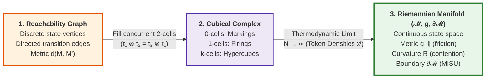
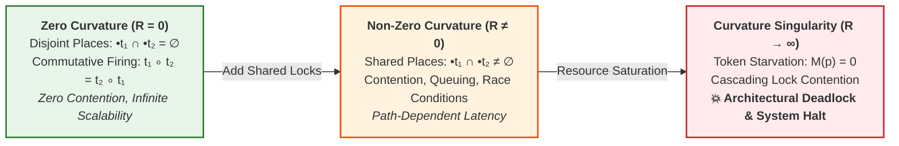

# AoS: The Interaction Manifold and Software Lagrangian

> **Parent Hub:** [[Hub/Theory/Category Theory/Algebra of Systems|Algebra of Systems Master Index]]  
> **Key Concepts:** Cubical Complex, High-Density Continuum Limit, Metric Tensor $g_{ij}$, Curvature Tensor $R$, Software Lagrangian $\mathcal{L} = T - V$.

---

## 1. The Continuum Limit: From Discrete Networks to Smooth Manifolds

How does a discrete network of tokens and transitions transform into a continuous **Manifold**? Through a rigorous topological progression analogous to statistical mechanics:

*Diagram: Topological continuum from discrete reachability graphs to smooth Riemannian manifolds.*

1. **Reachability Graph $\mathcal{R}(N, M_0)$:** Discrete metric space under shortest-path firing distance.
2. **Cubical Complex $\mathcal{K}(\mathcal{R})$:** When concurrent transitions $t_1, t_2$ have disjoint inputs ($\bullet t_1 \cap \bullet t_2 = \emptyset$), the commuting square is filled by a solid 2-cell $[0, 1]^2$. Concurrent $k$-tuples fill $k$-hypercubes.
3. **High-Density Scaling ($N \to \infty$):** Discrete token counts normalize to continuous density fields:
   $$x^i = \lim_{N \to \infty} \frac{M(p_i)}{N} \in \mathbb{R}_{\ge 0}$$
   The dense hypercubes converge to a smooth **Riemannian Manifold with Boundary** $(\mathcal{M}, g, \partial\mathcal{M})$.
4. **Tangent Space $T_x \mathcal{M}$:** Represents admissible instantaneous interaction velocities:
   $$\dot{x} = \sum_{k=1}^{|T|} v_k \mathbf{d}_k \in T_x \mathcal{M}$$
   where $\mathbf{d}_k$ is the $k$-th column of incidence matrix $D$.

---

## 2. Metric Friction & Riemannian Curvature

Once embedded as a manifold, differential geometry formalizes system performance:

### 2.1 The Metric Tensor $g_{ij}$: Action Cost and Landauer Friction
Infinitesimal distance $ds^2 = g_{ij} dx^i dx^j$ quantifies the thermodynamic dissipation and latency required to shift token densities:
$$g_{ij}(x) = 2 \left(S_T(x) - H_T(x)\right) \delta_{ij}$$
In low-friction **Transaction-Free Zones (TFZs)**, $S_T - H_T \to 0$, rendering metric distance minimal.

### 2.2 Curvature as Resource Contention & Deadlock
The Riemann Curvature Tensor $[\nabla_\mu, \nabla_\nu] V^\rho = R^\rho_{\;\sigma\mu\nu} V^\sigma$ measures the non-commutativity of parallel transport:

*Diagram: Geometric interpretation of systems performance: Curvature measures contention and architectural deadlock.*

- **Flat Manifold ($R \equiv 0$):** Independent concurrent processes commute unconditionally. Zero lock contention.
- **Curved Manifold ($R \ne 0$):** Processes compete for shared places (mutexes, channels). The manifold curves in proportion to contention.
- **Singularities ($R \to \infty$):** Resource starvation causes curvature to diverge. **An architectural deadlock is a coordinate singularity on the interaction manifold!**

---

## 3. Boundary Strata: Make Illegal States Unrepresentable (MISU)

The boundary $\partial\mathcal{M}$ is defined by the Boolean Domain $B$ (token non-negativity $x^i \ge 0$, buffer limits, invariant safety guards $\phi(P) = \text{TRUE}$).
$$\boxed{\;\text{Illegal States} \notin \mathcal{M}\;}$$
Because invalid states lie outside the manifold atlas, **illegal states are mathematically unrepresentable**. Systems cannot crash into an invalid state because the geometry terminates at the boundary.

---

## 4. Geodesic Evolution via the Software Lagrangian: Spacetime Compositionality

On the interaction manifold, **[[Hub/Theory/Integration/SpatioTemporal Compositionality - The New Programming Paradigm of Geometric Execution|Spacetime Compositionality]]** is governed by variational calculus:
- **Space:** Continuous token density coordinates $x^i \in \mathcal{M}$.
- **Time:** Trajectory velocities $\dot{x}^i = \frac{dx^i}{dt} \in T_x \mathcal{M}$.
- **Energy:** The **Software Lagrangian** $\mathcal{L} = T - V$ acting as the physical referee:
$$\mathcal{L}(x, \dot{x}) = T(\dot{x}) - V(x) = \frac{1}{2} g_{ij}(x) \dot{x}^i \dot{x}^j - V(x)$$

- **Kinetic Energy $T(\dot{x})$:** Execution throughput and deployment velocity ($T_{\text{cycle}} \to 0$).
- **Potential Energy $V(x)$:** Penalty field from backlog latency, unmet requirements, and proximity to failure boundaries $\partial\mathcal{M}$.

System execution evolves along **geodesics** that minimize total action $\mathcal{S} = \int \mathcal{L} \, dt$ according to Hamilton's Principle ($\delta \mathcal{S} = 0$):
$$\ddot{x}^i + \Gamma^i_{jk} \dot{x}^j \dot{x}^k = -g^{im} \frac{\partial V}{\partial x^m}$$

**The Triadic Spacetime Unity:** Space ($x$) and Time ($\dot{x}$) are dynamically coupled and optimized by Energy ($\mathcal{L}$). Under modular isolation, decoupled charts zero the cross-module curvature ($R \to 0$), guaranteeing that composite workflows follow frictionless, minimum-dissipation paths.

---

## See Also
- **[[Hub/Theory/Category Theory/Algebra of Systems|Algebra of Systems Master Index]]**
- **[[Hub/Theory/Category Theory/Algebra of Systems/AoS - The Computable Network Ontology|AoS: The Computable Network Ontology]]**
- **[[Hub/Theory/Integration/Knowledge Manifold|The Knowledge Manifold]]**
- **[[Hub/Theory/Integration/Software-Lagrangian|The Software Lagrangian]]**
