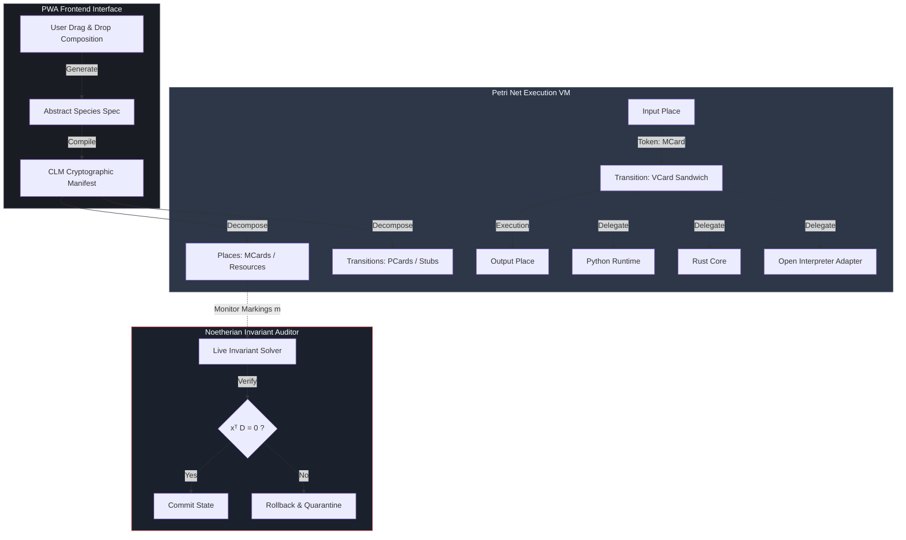

# The Combinatorial Species Catalog: Cryptographically Secure Distributed Functional Assemblies

With the computational instrumentation of the [[Hub/Theory/CLM/Foundations/Cubical Logic Model|Cubical Logic Model (CLM)]] and the [[Hub/Theory/CLM/PTR/PTR|Polynomial Type Runtime (PTR)]] established, it becomes possible to realize a scalable, distributed catalog of **[[Permanent/Concepts/Combinatorial Species|Combinatorial Species]]** (Joyal's species of structures). 

This catalog is not merely a software repository; it is the mathematical scaffolding for **[[Hub/Theory/Sciences/SoG/Governance Technology|Governance Technology (GovTech)]]** and **[[Hub/Theory/Sciences/SoG/Science of Governance|The Science of Self-Governance]]**. Furthermore, by treating digital agents as goal-directed, scale-free cognitive units, the catalog provides a concrete computational paradigm for realizing Michael Levin's **[[Hub/Theory/Sciences/Biology/TAME|TAME (Technological Approach to Mind Everywhere)]]** framework in distributed networks.

---

## 1. Architectural Vision: The Cryptographic Algebraic Space

The core of the catalog is a nearly infinite space of cryptographically distinguishable function names and combinatorial shapes, mapped through content-addressed [[MCard]] and [[VCard]] structures.

1. **Content-Addressed Cryptographic Identifiers**: Functions are not named via mutable strings; instead, they are identified by their self-certifying Decentralized Identifiers (DIDs) and content hashes of their CLM specifications. This creates a collision-resistant, path-independent namespace.
2. **Decoupling Spec from Execution**: The abstract combinatorial species (the functor $F: \mathbf{Bij} \to \mathbf{Set}$) is defined purely in CLM. The concrete implementations—whether written in Python, compiled into Rust, running as WebAssembly, or represented as stubs delegating to local/remote Large Language Models (LLMs) via Open Interpreter—are registered as verified implementation payloads mapped to the species' ports.
3. **Dynamic Composition**: New functions are created by applying algebraic species operations (addition $+$, product $\cdot$, composition $\circ$, and differentiation $F'$) to existing catalog items. The resulting compound species are automatically compiled into new CLM manifests, generating new cryptographic hashes that represent the composed functional container.
4. **PWA Navigable Interface**: A responsive frontend PWA allows developers, citizens, and domain experts to browse the catalog, inspect cycle index series ($Z_F$), trace bijection maps ($F[\sigma]$), and visually drag-and-drop species to compose new workflows. The PWA acts as a client-side compiler that outputs signed CLM packages ready for deployment.

---

## 2. BMAD Architectural Dialogue: Winston & Paige

To clarify the system's design decisions and structural implications, we join **Winston (System Architect)** and **Paige (Technical Writer)** in a technical design review.

> [!NOTE]
> **Winston (Architect)**: "By framing the Combinatorial Species Catalog as the heart of Governance Technology, we solve the scaling limits of traditional bureaucracy. If you look at the Q1-Q4 legitimacy tetrad in the [[Hub/Theory/Sciences/SoG/Science of Governance|Science of Governance]], Q1 establishes the sovereignty of the irreducible self. A species functor $F: \mathbf{Bij} \to \mathbf{Set}$ is completely label-independent. If a local community wants to run their own infrastructure, they carry their own local bijections ($\sigma$). They can map their local database fields into the catalog's species, run the logic, and verify it locally. This is entropic federation: local agency running over a shared algebraic geometry."
>
> **Paige (Writer)**: "And it bridges beautifully with Levin's [[Hub/Theory/Sciences/Biology/TAME|TAME]] framework. In biological tissues, cells don't need a central brain to coordinate morphogenesis; they negotiate via bioelectric gap junctions. In our model, the VCard sandwich ($V_{\text{pre}} \xrightarrow{PCard} V_{\text{post}}$) acts as the digital gap junction. The species catalog provides the 'target morphology'—the goal space. Instead of controlling every packet, the catalog allows edge nodes to coordinate scale-free cognition autonomously."
>
> **Winston**: "Exactly. A single node's [[Hub/Theory/Sciences/Biology/TAME#2. The Cognitive Light Cone|Cognitive Light Cone]] is bounded by its VCard capability registry. As nodes compose their structures via species product ($F \cdot G$) or composition ($F \circ G$), their cognitive horizons expand from individual tasks to collective social outcomes. If a node drifts or behaves selfishly—like cancer in biological systems—the Software Lagrangian ($L = S_T - H_T$) registers the injection of entropy ($H_T$), and the Noetherian auditor blocks the transition at the kernel level before it can pollute the SSOT."

---

## 3. Petri Net Formalism and Runtime Coordination

At runtime, the catalog's composed species are mapped to a Place-Transition (PT) Petri Net model for formal verification and execution scheduling.

*Diagram: Flow diagram mapping species PWA composition to Petri Net execution and Noetherian auditing.*

The mapping from species algebra to Petri Net states operates as follows:

*   **Addition ($F + G$) $\approx$ Choice (Branching)**: Represents a choice place where a token can trigger either an $F$-transition or a $G$-transition, but not both.
*   **Product ($F \cdot G$) $\approx$ Concurrency (Partitioning)**: Represents a transition that splits the input resources into disjoint subsets, processing them concurrently in parallel paths before merging them back.
*   **Composition ($F \circ G$) $\approx$ Hierarchical Refinement**: Represents a nested sub-net, where a single transition block expands into a full Place-Transition sub-workflow.
*   **Derivatives ($F'$) $\approx$ Pointed Contexts**: Represents an execution thread that acts on a context containing a distinguished focal element (e.g., active task pointer).

### Noetherian Conservation Laws

Let $D = D^+ - D^-$ be the incidence matrix of the execution Petri Net, where $D^+$ is the post-condition matrix and $D^-$ is the pre-condition matrix. The current state is represented by the marking vector $m$.

To guarantee that no functional container leaks data, duplicates scarce resources, or violates security boundaries, the system enforces **Noetherian Invariants**:

1.  **P-Invariants (Place Conservation)**:
    A vector $x$ is a P-invariant if:
    $$x^{\top} D = 0$$
    This guarantees that for any reachable marking $m$ from initial marking $m_0$, the token count weighted by $x$ remains constant:
    $$x^{\top} m = x^{\top} m_0$$
    This is used to enforce strict resource conservation (e.g., ensuring a cryptographically signed credential is never duplicated or lost during execution).
2.  **T-Invariants (Repetitive Consistency)**:
    A firing vector $y$ is a T-invariant if:
    $$D\,y = 0$$
    This ensures that executing the sequence of transitions defined by $y$ returns the system to its original marking, guaranteeing that idempotent processes and retry loops do not introduce state drift.

---

## 4. Software Lagrangian Metrics: Efficacy, Efficiency, and Effectiveness

To evaluate and optimize the execution of these distributed species containers, we apply the metrics of the **[[Hub/Theory/Integration/Software-Lagrangian|Software Lagrangian]]** ($L_{\text{software}} = S_T - H_T$):

### 1. Effectiveness ($S_T$) — Epiplexity / Structural Intent
Effectiveness measures the volume of explicit, learnable, and verified structures active in the system. 
*   **Metric**: $S_T$ is maximized when code executes via highly structured, algebraic species channels with verified VCard contracts.
*   **Efficacy Goal**: Higher structural epiplexity density ensures that the computational payload directly serves explicit intent, rather than ambient routing or orchestration boilerplate.

### 2. Efficiency ($H_T$) — Time-Bounded Entropy / Noise
Efficiency measures the containment of implicit side effects, uncompressible noise, and execution leaks.
*   **Metric**: $H_T$ accumulates when processes execute unverified side effects, access unmapped filesystems, or experience runtime errors.
*   **Efficacy Goal**: By wrapping executions (especially LLM stubs via Open Interpreter) in a `Zero-FS` sandboxed container, we suppress $H_T$ to its absolute mathematical minimum. Any side effect is caught at the post-gate, preventing the leakage of entropy into the Shared Source of Truth (SSOT).

### 3. Efficacy — Variational Information Geodesic
Efficacy represents the ability of the system to adapt and update its parameters along the path of least action.
*   **Manifold Projection**: As parameters $\theta$ (e.g., weights of LLM routing models, queue dispatch timeouts) evolve, they traverse a statistical manifold $\mathcal{M}$ governed by the **Fisher Information Metric (FIM)** $g_{ij}(\theta)$:
    $$g_{ij}(\theta) = \mathbb{E} \left[ \frac{\partial \log p(x; \theta)}{\partial \theta^i} \frac{\partial \log p(x; \theta)}{\partial \theta^j} \right]$$
*   **Natural Gradient Descent**: The system updates its parameters using Amari's Natural Gradient:
    $$\theta_{t+1}^k = \theta_t^k - \eta \, g^{kl}(\theta_t) \frac{\partial H_T}{\partial \theta^l}$$
    This guarantees that updates track the native Riemannian geodesic of the manifold, avoiding coordinate-dependent representation drift and ensuring the system takes the path of **least action** ($\Delta H_T = 0$) during self-modification.

---

## 5. Integrating GovTech and the Science of Governance

The Combinatorial Species Catalog is a core component of the **[[Hub/Theory/Sciences/SoG/Governance Technology|Governance Technology (GovTech)]]** framework. It acts as the mathematical engine that enforces the structural rules of the **[[Hub/Theory/Sciences/SoG/Science of Governance|Science of Governance]]**:

### 5.1 Resolving the Legitimacy Tetrad

Every legitimate governance system must answer four foundational questions: *by what right? by what rule? by what means? on what ground?* The catalog provides the answer to **Question 3 (by what means?)**—the scaling question:

*   **Q1: By What Right? (Sovereignty of the Irreducible Self)** $\leftrightarrow$ **Substrate Independence**: 
    A Combinatorial Species is defined over the groupoid of finite sets and bijections ($\mathbf{Bij}$), meaning its structure is independent of specific element labels. In self-governance terms, the core logic is written once. Any local community or agency can map their private namespace into the species using a local bijection $\sigma$. They run the logic locally and verify it, preserving their atomic sovereignty (**[[Hub/Theory/Sciences/SoG/The Science of Self-Governance|The Science of Self-Governance]]**).
*   **Q2: By What Rule? (Arithmetic Rule of Law)** $\leftrightarrow$ **VCard Verification**:
    The CLM acts as the verification engine. Every action is audited by a local MCE checking the Hoare triple pre- and post-conditions.
*   **Q3: By What Means? (Entropic Federation)** $\leftrightarrow$ **The Species Catalog**:
    Instead of centralized authority, the catalog allows sovereign nodes to merge states via algebraically constrained operations. Because the species addition ($+$) and product ($\cdot$) satisfy the axioms of Commutativity, Associativity, and Idempotency, they guarantee **[[Hub/Theory/Sciences/Computer Science/Strong Eventual Consistency|Strong Eventual Consistency (SEC)]]**. Replicas converge to a unique shared truth without central coordination.
*   **Q4: On What Ground? (Physical Substrate)** $\leftrightarrow$ **Zero-Trust Mesh Networking**:
    The overlay VPN connects independent [[Literature/PKM/Tools/Open Source/Personal Knowledge Container|PKC]] containers, acting as the physical medium of token transport.

### 5.2 Mathematical Enforcement of the Tinbergen Rule

The **[[Tinbergen Rule]]** states: *To achieve N independent policy objectives, there must be at least N independent policy instruments.* 

The species catalog models policy instruments as distinct functors:
*   **Decoupled Instruments**: Symmetries captured by the cycle index $Z_F$ ensure that when strategy instruments are composed, their parameters do not entangle or interfere.
*   **Lattice-Bounded Actions**: The catalog maps policy objectives to target output spaces ($J$), and matches them to independent species transitions ($E \xrightarrow{p} B$). This guarantees that the mapping from instruments to objectives is mathematically surjective, proving policy feasibility before execution.

---

## 6. Biological Convergence: Realizing TAME and Scale-Free Cognition

Michael Levin's **[[Hub/Theory/Sciences/Biology/TAME|TAME]]** framework dissolves the substrate boundary of mind, demonstrating that cognition behaves as a continuum across cells, tissues, organisms, and swarms. The Combinatorial Species Catalog is the digital analogue of the bioelectric medium that orchestrates this scale-free intelligence:

### 6.1 The Cognitive Light Cone as a Functorial Selector

In TAME, the **[[Hub/Theory/Sciences/Biology/TAME#2. The Cognitive Light Cone|Cognitive Light Cone]]** defines the spatial and temporal boundary of what an agent can care about (its goal space).
*   **State Filtering**: An edge node (e.g., an IoT sensor running a local quantized LLM) cannot process the entire global state of the network. The catalog's species act as **functorial selectors**. They filter the raw, high-dimensional SSOT (the universal MCard collection) into a low-dimensional target morphology (goal space) that the local agent can reason over.
*   **Nesting Agency**: Species composition ($F \circ G$) mathematically formalizes the **scaling of cognition**. It nests the homeostatic goals of lower-level agents (cells/individual nodes) into the cooperative goals of higher-level agents (tissues/swarms). The composition functor maps local error-correction rules into unified collective teleonomy.

### 6.2 VCards as Bioelectric Gap Junctions

In biological morphogenesis, cells synchronize their voltage patterns via **gap junctions** to establish a shared morphological target (e.g., regenerating a limb).
*   **Cryptographic Gap Junctions**: The **VCard** capability registry acts as the digital gap junction. When a VCard authorization opens a communication channel over the overlay VPN, it allows MCards (representing shared memory/voltage state) and PCards (representing execution potentials) to flow between PKC nodes.
*   **Swarm Coordination**: This allows a mesh of independent, embedded AI nodes to achieve homeostatic coordination (e.g., drone swarm formation, energy grid balancing) through localized peer negotiation, bypassing centralized datacenters.

### 6.3 Suppressing "Digital Cancer" via the Software Lagrangian

In biology, cancer represents a **failure of scale-free cognition**: individual cells decouple from the bioelectric network, collapse their Cognitive Light Cones, and pursue unicellular, high-entropy goals.
*   **Sensing Cognitive Drift**: In GovTech networks, "digital cancer" occurs when an edge node experiences metric gaming, code corruption, or malicious takeover, reverting to selfish resource consumption.
*   **Thermodynamic Containment**: The **Noetherian Invariant Auditor** and the **Software Lagrangian** ($L = S_T - H_T$) act as the system's immune system. If a node begins emitting high-entropy noise ($H_T$) or violating the P-invariant ($x^{\top} D = 0$), its VCard gap junction is closed, quarantining the node and preventing the spread of corruption through the collective tissue.

---

## 7. Deployment and Portability Matrix

The compiled species containers are packaged with their CLM specifications, cycle indices, and test harnesses. This creates self-contained, portable units of functional knowledge that deploy across three core environments:

| Deployment Context | Execution Mechanism | Role of Species Symmetries | TAME & GovTech Integration |
| :--- | :--- | :--- | :--- |
| **Polyglot Runtimes** | Native execution via Python adapters, Rust core VM, or JS/WebAssembly runtimes. | The cycle index $Z_F$ and bijection $F[\sigma]$ automate data translation and coordinate alignment across memory boundaries. | Enables the **Registry-Singleton-SSOT** triad to operate seamlessly across different system architectures (Linux, RTOS, browser). |
| **LLM & Agent Stubs** | Local and remote LLM models coordinated via wrapped Open Interpreter scripts. | LLM parameters are mapped as stochastic execution fibers. Output schemas are bound to species shapes. | Enforces **Authorized Cognitive Capacity (ACC)**, restricting the reasoning boundaries of local AI nodes to their Cognitive Light Cones. |
| **Hyperlinked CLMs** | Distributed peer-to-peer execution across the PKC mesh network using content-addressed MCards. | Groupoid symmetries ensure that merge operations on G-Sets are associative, commutative, and idempotent (CRDTs). | Implements the **entropic federation** (Q3) of sovereign nodes (Q1) via Strong Eventual Consistency (SEC) and optimal transport. |

---

## 8. Human-AI Coexistence: The Multi-Level Presentation

To explain how the catalog coordinates and realizes safe human-AI coexistence in the face of the age-old feedback, control, and autonomy challenges presented in **[[Hub/Tech/Cybernetics|Cybernetics]]**, we provide a structured, multi-level presentation:

*   **[[Hub/Theory/Sciences/Computer Science/Programming Model/Coexistence Level 1 - The Cybernetic Turnstile of Governance|Coexistence Level 1: The Cybernetic Turnstile of Governance]]** — Explores the macro-level vision of human-AI coexistence, demonstrating how the Q1-Q4 Legitimacy Tetrad and the **[[Hub/Theory/Integration/The Cybernetic Turnstile - Judgment, Governance, and Control in Communication Infrastructures|Cybernetic Turnstile]]** regulate AI universal approximation search spaces under a unified Arithmetic Rule of Law.
*   **[[Hub/Theory/Sciences/Computer Science/Programming Model/Coexistence Level 2 - Morphogenetic Swarm Agency and TAME|Coexistence Level 2: Morphogenetic Swarm Agency and TAME]]** — Explores the meso-level system architecture, mapping biological self-healing morphogenesis to software swarms, treating VCards as digital gap junctions, and using the Software Lagrangian to suppress digital cancer.
*   **[[Hub/Theory/Sciences/Computer Science/Programming Model/Coexistence Level 3 - The Covenantal VCard Sandwich|Coexistence Level 3: The Covenantal VCard Sandwich]]** — Explores the micro-level sandboxed execution loop, showing how to safely run unaligned code adapter payloads (such as Open Interpreter) via VCard sandwiches and Galois connections under abstract interpretation.
*   **[[Hub/Theory/Sciences/Computer Science/Programming Model/Coexistence Level 4 - The Archipelagic Underlay and the Brain Factory|Coexistence Level 4: The Archipelagic Underlay and the Brain Factory]]** — Explores the infrastructure-level archipelagic deployment. It demonstrates how protocol- and language-agnostic CLM meta-programming, client-side PWA runtimes, and WireGuard overlay networks scale cognitive capabilities to remote 3T regions, fulfilling Luhut Binsar Pandjaitan's vision of national equity.
*   **[[Hub/Theory/Sciences/Computer Science/Programming Model/Coexistence Level 5 - Algorethics and the Pedagogy of Hope|Coexistence Level 5: Algorethics and the Pedagogy of Hope]]** — Explores the pedagogical-level implementation. It demonstrates how Prof. Yohanes Surya's GASing pedagogy acts as the physical and moral progenitor of CLM and the Brain Factory, directly answering Pope Leo XIV's challenge in *Magnifica Humanitas* by replacing the technocratic Babel Syndrome with the synodical Nehemiah Way.

---

## Related Documents

*   **[[Hub/Theory/Sciences/Computer Science/Programming Model/Lambda Calculus and the Three Foundational Metrics of Representables|Lambda Calculus and the Three Foundational Metrics of Representables]]** — Isomorphism between Church's reduction rules and combinatorial species.
*   **[[Hub/Theory/Sciences/SoG/Combinatorial Species in GASing and Sacred Octagon|Combinatorial Species in GASing and Sacred Octagon]]** — Formal mapping of species algebra to the GASing curriculum and game loops.
*   **[[Fleeting/Diary/2026-06-14report|Execution Report: 2026-06-14]]** — Operational context on CLM codebases and Open Interpreter adapters.
*   **[[Permanent/Concepts/Combinatorial Species|Combinatorial Species]]** — Functorial foundations and algebraic species operations.
*   **[[Hub/Theory/Sciences/Computer Science/Programming Model/Coexistence Level 1 - The Cybernetic Turnstile of Governance|Coexistence Level 1: The Cybernetic Turnstile of Governance]]** — Macro-level coexistence and legitimacy tetrad.
*   **[[Hub/Theory/Sciences/Computer Science/Programming Model/Coexistence Level 2 - Morphogenetic Swarm Agency and TAME|Coexistence Level 2: Morphogenetic Swarm Agency and TAME]]** — Meso-level swarm scaling.
*   **[[Hub/Theory/Sciences/Computer Science/Programming Model/Coexistence Level 3 - The Covenantal VCard Sandwich|Coexistence Level 3: The Covenantal VCard Sandwich]]** — Micro-level sandboxed execution.
*   **[[Hub/Theory/Sciences/Computer Science/Programming Model/Coexistence Level 4 - The Archipelagic Underlay and the Brain Factory|Coexistence Level 4: The Archipelagic Underlay and the Brain Factory]]** — Archipelagic underlay scaling.
*   **[[Hub/Theory/Sciences/Computer Science/Programming Model/Coexistence Level 5 - Algorethics and the Pedagogy of Hope|Coexistence Level 5: Algorethics and the Pedagogy of Hope]]** — Algorethics, GASing, and papal social doctrine convergence.
*   **[[Hub/Theory/Economics/Brain Factory|Brain Factory]]** — Intellectual capital downstreaming.
*   **[[Literature/People/Luhut Binsar Pandjaitan|Luhut Binsar Pandjaitan]]** — Strategic policy architect.
*   **[[Hub/Tech/Cybernetics|Cybernetics]]** — The science of communication and control.
*   **[[Hub/Theory/Integration/The Cybernetic Turnstile - Judgment, Governance, and Control in Communication Infrastructures|The Cybernetic Turnstile]]** — Type-theoretic feedback loops.
*   **[[Hub/Theory/Sciences/SoG/Governance Technology|Governance Technology]]** — The full stack for digital networks.
*   **[[Hub/Theory/Sciences/SoG/Science of Governance|Science of Governance]]** — Managing networks of self-governing agents.
*   **[[Hub/Theory/Sciences/SoG/The Science of Self-Governance|The Science of Self-Governance]]** — The sovereignty of the atomic self.
*   **[[Hub/Theory/Sciences/Biology/TAME|TAME]]** — Scale-free cognition and biological morphogenetic control.
*   **[[Hub/Theory/Integration/Software-Lagrangian|The Software Lagrangian]]** — Detailed formulation of epiplexity-entropy balances.
*   **[[Hub/Theory/Integration/Noetherian Invariants and the Petri Net Software Lagrangian|Noetherian Invariants and the Petri Net Software Lagrangian]]** — Proofs of P-invariants and T-invariants.
*   **[[Hub/Theory/Sciences/Computer Science/Programming Model/Open-Interpreter Comparison|Open-Interpreter Comparison]]** — Sandboxing, secured identities, and the hybrid bicultural model.

