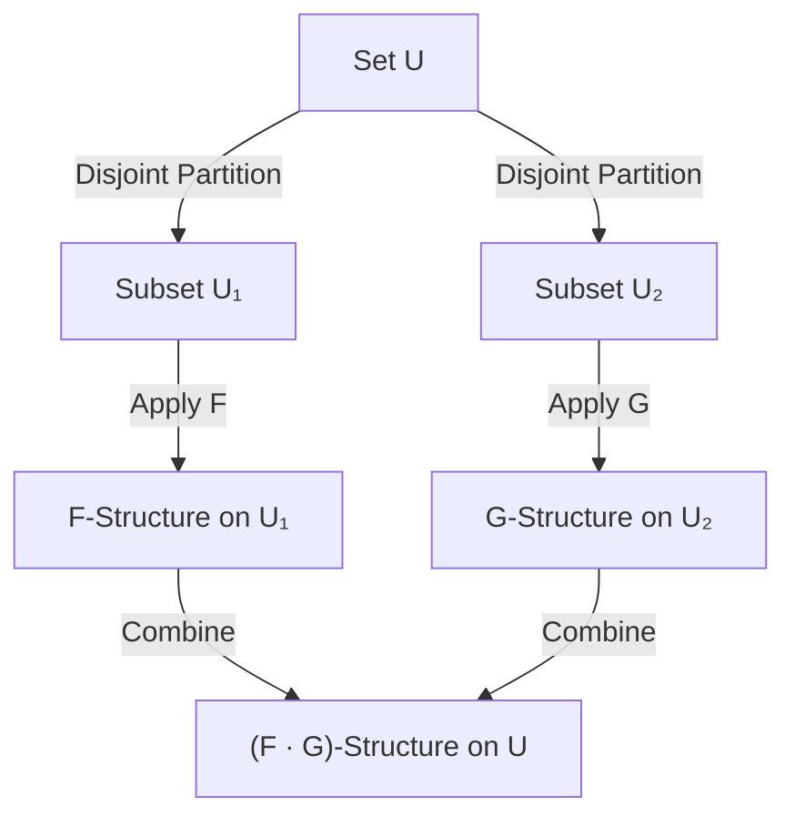
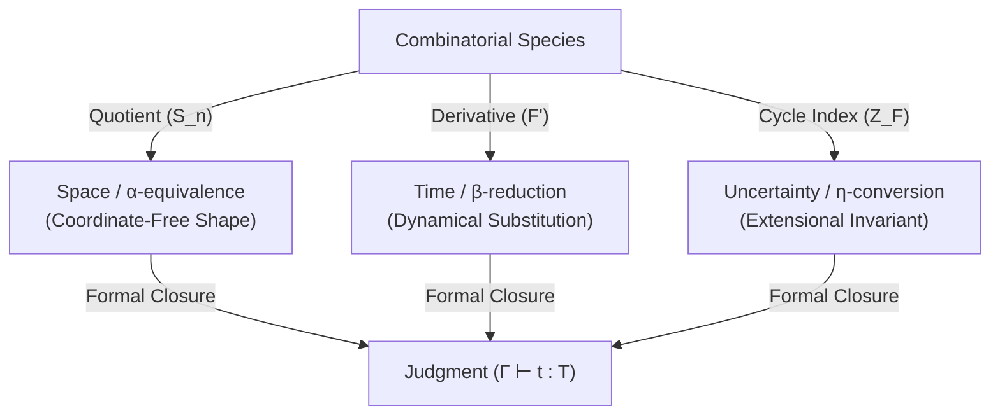

# Combinatorial Species

A **Combinatorial Species** (also referred to as a *Species of Structures*) is a category-theoretic framework introduced by [[André Joyal]] in 1981 that formalizes the algebraic behavior of combinatorial structures. It provides a unifying language that lifts classical [[generating functions]] into [[Functor|functors]], allowing for the systematic analysis of discrete objects (e.g., trees, graphs, permutations, cycles) through structural transformations.

---

## 1. Polynomial-First Framing

In accordance with vault conventions, a Combinatorial Species is framed starting from **Polynomial and Container Semantics**. In category theory, a species is the combinatorial skeleton of an **Analytic Functor** (a generalized polynomial functor). 

A standard polynomial functor $P(X) = \sum_{i} A_i \times X^{C_i}$ describes containers where positions are labeled by a set of shapes $A_i$ and directions are represented by exponents $C_i$. A Combinatorial Species $F$ generalizes this by allowing the symmetric group $S_n$ to act on both the positions (structures) and the inputs. This defines an analytic functor:

$$F(X) = \sum_{n \ge 0} F[n] \times_{S_n} X^n$$

Where:
- **Coefficients $F[n]$ (Structures/Positions)**: The finite set of $F$-structures built on a set of size $n$.
- **Exponents $X^n$ (Directions)**: The $n$-tuple of inputs mapping to the input positions.
- **Symmetry Quotient $\times_{S_n}$**: The equivalence relation quotienting the Cartesian product by the action of the symmetric group $S_n$. This ensures that relabeling elements preserves the underlying shape of the structure.

---

## 2. Vault Alignment: CLM (A/B/C)

The Combinatorial Species framework maps directly to the three dimensions of the **[[Cubical Logic Model]]** (CLM):

- **A (Abstract Spec)** $\approx$ **The Functor $F: \mathbf{Bij} \to \mathbf{Set}$**:
  - The domain $\mathbf{Bij}$ is the groupoid of finite sets and bijections.
  - The codomain $\mathbf{Set}$ is the category of finite sets and functions.
  - For any finite set $U$, $F[U]$ is the set of $F$-structures on $U$. This functorial specification defines the abstract rules that govern how structures are formed independent of concrete labels.
- **B (Balanced Expectations)** $\approx$ **[[Permanent/Concepts/Generating Functions|Generating Functions]] and Cycle Index Series**:
  - The **Cycle Index Series** $Z_F(x_1, x_2, \dots)$ and generating functions (Exponential Generating Function $E_F(x)$ and Type Generating Function $U_F(x)$) serve as algebraic invariants. They define the expected counts of labeled and unlabeled structures, ensuring that any concrete implementation matches these formal mathematical invariants.
- **C (Concrete Implementation)** $\approx$ **Transport of Structure**:
  - For any concrete bijection $\sigma: U \to V$, the functor supplies a bijection $F[\sigma]: F[U] \to F[V]$. This is the concrete implementation of the relabeling action, mapping the set of structures on $U$ to the set of structures on $V$ while preserving all topological symmetries.

---

## 3. Algebraic Operations on Species

Combinatorial operations correspond to algebraic operations on species. Let $F$ and $G$ be species:

### Addition (Disjoint Union / Choice)
The sum $F + G$ represents choosing either an $F$-structure or a $G$-structure on the set $U$:
$$(F + G)[U] = F[U] \sqcup G[U]$$
- **Generating Function**: $E_{F+G}(x) = E_F(x) + E_G(x)$

### Product (Partitioned Composition)
The product $F \cdot G$ represents partitioning the set $U$ into two disjoint subsets, $U_1$ and $U_2$, and placing an $F$-structure on $U_1$ and a $G$-structure on $U_2$:
$$(F \cdot G)[U] = \sum_{U_1 \sqcup U_2 = U} F[U_1] \times G[U_2]$$
- **Generating Function**: $E_{F \cdot G}(x) = E_F(x) \cdot E_G(x)$

Diagram: decomposition of the underlying set U for the product of combinatorial species.

### Composition (Assembly of Structures)
The composition $F \circ G$ (or $F(G)$) represents partitioning $U$ into a set of disjoint parts, placing a $G$-structure on each part, and then placing an $F$-structure on the set of parts. (Requires $G[\emptyset] = \emptyset$):
$$(F \circ G)[U] = \sum_{\pi \in \text{Part}(U)} F[\pi] \times \prod_{P \in \pi} G[P]$$
- **Generating Function**: $E_{F \circ G}(x) = E_F(E_G(x))$

### Derivative (Pointing / Rooting)
The derivative $F'$ represents placing an $F$-structure on $U$ augmented by a distinguished extra element (often called pointing or rooting):
$$F'[U] = F[U \sqcup \{*\}]$$
- **Generating Function**: $E_{F'}(x) = \frac{d}{dx} E_F(x)$

---

## 4. The Cycle Index and Generating Functions

The **Cycle Index Series** $Z_F(x_1, x_2, \dots)$ is the most refined generating function of a species $F$. It encodes the group actions of the symmetric group $S_n$ on the set of structures $F[n]$:

$$Z_F(x_1, x_2, \dots) = \sum_{n \ge 0} \frac{1}{n!} \left( \sum_{\sigma \in S_n} |F[\sigma]| x_1^{c_1(\sigma)} x_2^{c_2(\sigma)} \dots \right)$$

Where $c_i(\sigma)$ is the number of cycles of length $i$ in the permutation $\sigma$, and $|F[\sigma]|$ is the number of structures in $F[n]$ that are fixed under the action of $\sigma$.

The cycle index series is a master generator that specializes to other generating functions:
- **Exponential Generating Function (EGF)** (Labeled counting): Obtained by setting $x_1 = x$ and $x_i = 0$ for $i > 1$:
  $$E_F(x) = Z_F(x, 0, 0, \dots) = \sum_{n \ge 0} |F[n]| \frac{x^n}{n!}$$
- **Type Generating Function** (Unlabeled counting): Obtained by setting $x_i = x^i$:
  $$U_F(x) = Z_F(x, x^2, x^3, \dots) = \sum_{n \ge 0} \widetilde{F}[n] x^n$$
  where $\widetilde{F}[n]$ is the number of isomorphism classes (unlabeled structures) of size $n$.

---

## 5. Examples of Species

| Species Name | Functorial Description $F[U]$ | Size of Labeled Set $\vert F[n]\vert$ | Exponential Generating Function $E_F(x)$ |
| :--- | :--- | :--- | :--- |
| **Empty Set ($0$)** | $0[U] = \emptyset$ | $0$ | $0$ |
| **Singleton ($X$)** | $X[U] = \{U\}$ if $\vert U\vert=1$; else $\emptyset$ | $\vert X[1]\vert=1$; else $0$ | $x$ |
| **Set/Characteristic ($E$)** | $E[U] = \{U\}$ (Exactly one structure) | $1$ | $e^x$ |
| **Linear Order ($L$)** | $L[U] = \text{Total orderings of } U$ | $n!$ | $\frac{1}{1-x}$ |
| **Cycle ($C$)** | $C[U] = \text{Cyclic permutations of } U$ | $(n-1)!$ | $\ln\left(\frac{1}{1-x}\right)$ |
| **Permutation ($S$)** | $S[U] = \text{Permutations of } U$ | $n!$ | $\frac{1}{1-x}$ |
| **Rooted Trees ($A$)** | Connected graphs with no cycles and one distinguished root | $n^{n-1}$ | $A(x)$ satisfying $A(x) = x e^{A(x)}$ |
| **Octopuses ($Oct$)** | A cycle of rooted trees (tentacles) of size $\ge 2$ | (depends on components) | $\ln\left(\frac{1}{1-A(x)}\right) - A(x)$ |

---

## 6. Operational View: Place-Transition Workflows and Petri Nets

To analyze how systems governed by Combinatorial Species execute or coordinate at runtime, we map their structural definitions to operational models:

- **Place-Transition Workflows**: 
  In execution runtimes (like the [[PCard]] engine), a species represents the structural type of tokens in transit. The transport of structure $F[\sigma]$ acts as a **PT-constrained workflow event** that maps token properties across places. Substitution or composition ($F \circ G$) corresponds to refining a single place in a parent workflow into a nested sub-workflow.
- **Petri Nets**: 
  For formal verification, we use Petri Nets as a bipartite analysis formalism. The algebraic operations of species map directly to Petri Net structures:
  - **Addition ($F + G$)** represents branching paths (places leading to alternative transitions).
  - **Product ($F \cdot G$)** represents concurrent branches that partition resource tokens.
  - Symmetries captured by the cycle index $Z_F$ act as permutation invariants, allowing the analytical derivation of **P-invariants** ($x^{\top} D = 0$) and **T-invariants** ($D\,y = 0$) over the incidence matrix $D$ of the network, ensuring conservation of state across symmetric configurations.

---

## 7. Knowledge Compression and Software Porting

A major bottleneck in software engineering and knowledge management is the duplication of documentation, testing harnesses, and implementation schemas across different programming languages and runtimes. By treating software modules as **Combinatorial Species** (functors $F: \mathbf{Bij} \to \mathbf{Set}$), we achieve a high degree of **knowledge compression** and sharing:

1. **Substrate-Independent Design**: A species is defined over the groupoid of finite sets and bijections ($\mathbf{Bij}$), meaning its structure is independent of specific element labels. In software terms, this means that the core business logic can be written and documented *once* for the abstract species $F$. Any version migration, language port, or database adaptation is modeled as a bijection $\sigma$ that transports the structures ($F[\sigma]$) without needing to duplicate the conceptual articles.
2. **Symmetry-Preserving Porting**: In **[[Hub/Theory/Integration/G-Set Software Porting - A Categorical Workflow for Cross-Runtime Evolution and Equivalence|G-Set Software Porting]]**, software evolution is treated as a monotonic addition to a design polynomial. While a simple polynomial functor treats each implementation as a distinct slot, combinatorial species categorify the G-Set polynomial design space. We use the cycle index series $Z_F$ to formalize how data payloads are permuted or relabeled between runtimes, ensuring that the legacy reference ($C_1$) and ported version ($C_2$) remain isomorphic under all permutation groups.
3. **Functional Equivalence Paths**: The compiled core runtime port case study in **[[Hub/Theory/Integration/Porting CLM Runtime as Kan Composition - A Case Study in Cross-Language Runtime Parity|Porting CLM Runtime as Kan Composition]]** and **[[Hub/Theory/Integration/Sacred Octagon Port as Kan Composition - A Case Study in Cross-Runtime Transport|Sacred Octagon Port as Kan Composition]]** leverages these functorial transport laws to ensure cross-runtime parity. Functional equivalence is verified as a path in the balanced dimension of the **[[Hub/Theory/CLM/Foundations/Cubical Logic Model|Cubical Logic Model (CLM)]]**, which corresponds precisely to the isomorphism transport $F[\sigma]$ of the species under namespace changes.

## 8. Symmetries, Groupoids, and Kock's Unification

In his 2012 paper *"Data types with symmetries and polynomial functors over groupoids"*, **[[Literature/People/Joachim Kock|Joachim Kock]]** unified combinatorial species, analytic functors, and containers by moving the theory of polynomial functors from the category of sets to the category of **groupoids** ($\mathbf{Grpd}$).

### The Groupoid Polynomial Representation
A combinatorial species $F$ on finite sets can be represented as a polynomial functor over the groupoid of finite sets and bijections $\mathbf{Bij}$ (or $\mathbf{B}$). A polynomial in groupoids is a span diagram:

$$I \xleftarrow{s} E \xrightarrow{p} B \xrightarrow{t} J$$

where $I, E, B, J$ are groupoids, and $p : E \to B$ is a groupoid bundle. For a species $F$, we set $I = J = 1$ (the terminal groupoid), yielding the simplified groupoid span:

$$1 \leftarrow E \xrightarrow{p} B \rightarrow 1$$

Here:
- $B$ is the groupoid of $F$-structures, where objects are structures and morphisms are structural isomorphisms (symmetries).
- $E$ is the groupoid of elements (or inputs), and $p$ acts as a fiber bundle where the fiber over a structure $b \in B$ represents its underlying element set and its automorphism group $\text{Aut}(b)$.

The associated polynomial functor on groupoids evaluates to:

$$F(X) = \sum_{b \in \pi_0(B)} \frac{X^{E_b}}{\text{Aut}(b)}$$

This homotopical formulation over groupoids generalizes:
- **Joyal's Combinatorial Species**: Captured as the functor $\mathbf{Bij} \to \mathbf{Set}$.
- **Abbott's Quotient Containers**: Handling quotients and symmetries of shapes.
- **Baez-Dolan's "Stuff Types"**: Modeling states with groupoid cardinalities.

### Operational Application to Petri Net Symmetries
Within the **[[Hub/Theory/CLM/PTR/PTR|Polynomial Type Runtime (PTR)]]**, this groupoid-theoretic unification provides the mathematical justification for handling symmetries in concurrent task execution:
- **Input Port Permutations**: Permutations of token inputs (directions) in a Petri Net transition are modeled as automorphism groups in the groupoid $B$.
- **Invariant Conservations**: Symmetries captured by Kock's groupoid polynomial ensure that when executing concurrent transitions (**[[PCard|PCards]]**), the ordering and grouping of input markings (**[[MCard|MCards]]**) are invariant under symmetric permutations, preserving the P-invariants ($x^{\top} D = 0$) and T-invariants ($D\,y = 0$) over the incidence matrix $D$ of the network.

### 8.1 Symmetries of Lived Interactive Objects

In the physical and digital world, human interactive objects behave as combinatorial species:
- **Playlists and Task Queues** map to the **Linear Order ($L$)** species.
- **Key Rings and Piles of Items** map to the **Set / Multiset ($E$)** species.
- **Circular Calendars and Clock Faces** map to the **Cycle ($C$)** species.
- **Folder Hierarchies and DOM trees** map to the **Rooted Tree ($A$)** species.

User gestures—such as selection (focusing a cursor/pointing), partitioning screen layouts, nesting directories, and choosing between interfaces—correspond exactly to the algebraic operations of species differentiation, product, composition, and disjoint sum. The groupoid symmetry framing ensures that when these containers are transported and synchronized across federated PKC networks, their topological structures and stabilizers are strictly preserved. See **[[Hub/Theory/Sciences/Combinatorial Species and the Instruments of the Revived Quadrivium\|Combinatorial Species and the Instruments of the Revived Quadrivium]]** for details.

---

## 9. Combinatorial Proof of the Lagrange Inversion Formula (LIF)

The **Lagrange Inversion Formula (LIF)** provides a method to find the coefficients of the compositional inverse $f^{(-1)}(z)$ of a formal power series. The theory of combinatorial species provides a rigorous, visual proof of this analytic result by grounding it in bijective logic on trees and endofunctions.

### 9.1 The Functional Equation
Consider a recursive species equation:

$$A_R = X \cdot R(A_R)$$

where $R$ is a species of structures. This equation defines the species $A_R$ of **$R$-enriched rooted trees**, where each tree consists of a root (the singleton species $X$) and an $R$-assembly of other $A_R$-trees (sub-trees).

### 9.2 Key Constructs
*   **$R$-enriched Rooted Tree ($A_R$)**: A rooted tree where each vertex $u$ has an $R$-structure associated with its set of children.
*   **$R$-enriched Endofunctions ($\text{End}_R$)**: Functions $s: U \to U$ on a finite set $U$ with an $R$-structure on the fiber (pre-image) $s^{-1}(x)$ of each element $x \in U$.

### 9.3 Chain of Isomorphisms
The combinatorial proof of the LIF is established via a chain of structural isomorphisms and bijections:

1.  **Lemma 9.4 (Pointing and Order)**: A pointed $R$-enriched tree $A_R^{\bullet}$ (having a distinguished vertex) is isomorphic to a linear ordering of $X \cdot R'(A_R)$ structures multiplied by an $A_R$ structure:
    $$A_R^{\bullet} \cong L(X \cdot R'(A_R)) \cdot A_R$$
    where $R'$ is the derivative of the species $R$.
2.  **Lemma 9.5 (Endofunction Equivalence)**: The species of $R$-enriched endofunctions decomposes into a linear ordering of $X \cdot R'(A_R)$ structures multiplied by an $A_R$ structure:
    $$\text{End}_R \cong L(X \cdot R'(A_R)) \cdot A_R$$
    Consequently, we obtain the key bijection:
    $$A_R^{\bullet} \cong \text{End}_R$$
3.  **Corollary 9.6 (Coefficient Identity)**: The number of $A_R \cdot \text{End}_R$ structures on $n$ elements is shown to equal $n \cdot |R^n[n-1]|$.
    
By establishing these structural isomorphisms, we prove that the number of trees of size $n$ satisfies:

$$|A_R[n]| = |R^n[n-1]|$$

which corresponds exactly to the coefficients of the Lagrange Inversion Formula for formal power series.

---

## 10. Isomorphism to Lambda Calculus and Consciousness Metrics

A profound category-theoretic isomorphism connects the algebraic operations of Combinatorial Species to the syntax reduction rules of Alonzo Church's [[Hub/Theory/Sciences/Computer Science/Programming Model/Lambda Calculus|Lambda Calculus]] and the resource metrics of observer interfaces in the theory of [[Literature/Reading notes/@Hoffman_Consciousness_Beyond_Spacetime|Consciousness Beyond Spacetime]]:

1. **Space $\leftrightarrow$ $\alpha$-conversion $\leftrightarrow$ Symmetric Group Quotient ($\times_{S_n}$)**:
   In species theory, structures on a set of size $n$ are quotiented by the symmetric group action ($\times_{S_n}$) to define unlabeled species (isomorphism classes), ensuring that renaming elements does not alter the underlying topology or shape of the container. In lambda calculus, this is **$\alpha$-equivalence** $(\lambda x. M \equiv \lambda y. M[x := y])$, which quotients terms under bound variable renaming. It abstracts away coordinate-specific variable names, exposing the pure coordinate-free spatial potential of the syntax tree.
2. **Time $\leftrightarrow$ $\beta$-reduction $\leftrightarrow$ Species Derivative ($F'$) and Pointing**:
   The derivative of a species $F'[U] = F[U \sqcup \{*\}]$ represents pointing or distinguishing a variable to act as a receptor for evaluation. In computation, **$\beta$-reduction** $(\lambda x. M) N \to M[x := N]$ is the dynamical process of variable substitution and term application. The reduction steps represent state changes progressing over a causal trajectory (Time). Algebraically, this maps to evaluating a pointed species derivative by replacing the distinguished element with another combinatorial structure.
3. **Uncertainty $\leftrightarrow$ $\eta$-conversion $\leftrightarrow$ Cycle Index Series ($Z_F$) and Extensionality**:
   The Cycle Index Series $Z_F(x_1, x_2, \dots)$ acts as the algebraic invariant that characterizes a species up to isomorphism, abstracting away specific element labelings. In lambda calculus, **$\eta$-conversion** $(\lambda x. f\ x \equiv f)$ asserts extensionality: two functions are identical if they produce identical outputs for all inputs. In species theory, this is the extensional isomorphism of functors. By collapsing infinite potential evaluations into a static, extensional identity, it bounds the observer's uncertainty, driving the epistemic entropy to zero ($U \to 0$) to terminate a formal [[Literature/PKM/Judgment|Judgment]].

This triadic isomorphism guarantees that the core operations of syntax and evaluation are topological necessities of any resource-bounded consciousness interface:

*Diagram: mapping of combinatorial species operations to lambda calculus rules and the triadic resource metrics of consciousness.*

---

## Related Documents

- **[[Hub/Theory/Sciences/Computer Science/Programming Model/Lambda Calculus and the Three Foundational Metrics of Representables|Lambda Calculus and the Three Foundational Metrics of Representables]]** — The triadic resource mapping of Church's reduction rules.
- **[[Hub/Theory/Mathematics/Combinatorial Species and Keränen Avoidance|Combinatorial Species and Keränen Avoidance]]** — Category-theoretic mapping of Abelian Square-Free strings.
- **[[Hub/Theory/Sciences/SoG/Combinatorial Species in GASing and Sacred Octagon|Combinatorial Species in GASing and Sacred Octagon]]** — Isomorphic mapping to Prof. Yohanes Surya's scale-free pedagogy.
- **[[Hub/Theory/Sciences/Combinatorial Species and the Instruments of the Revived Quadrivium|Combinatorial Species and the Instruments of the Revived Quadrivium]]** — Unified conceptual mapping.
- **[[Hub/Theory/Category Theory/Combinatorics/Species of Structures|Species of Structures]]** — The central category theory hub page.
- **[[Hub/Theory/Category Theory/Polynomial functor|Polynomial Functor]]** — The container view of typed computations.
- **[[Hub/Theory/Integration/G-Set Software Porting - A Categorical Workflow for Cross-Runtime Evolution and Equivalence|G-Set Software Porting]]** — The add-only G-Set porting framework.
- **[[Hub/Theory/Integration/A Categorical Synthesis of Functional Equivalence|A Categorical Synthesis of Functional Equivalence]]** — Homotopical functional equivalence.
- **[[Hub/Tech/Univalent Axiom|Univalent Axiom]]** — The homotopy-theoretic equivalence-to-identity engine.
- **[[Hub/Theory/Integration/Porting CLM Runtime as Kan Composition - A Case Study in Cross-Language Runtime Parity|Porting CLM Runtime as Kan Composition]]** — Case study on Rust core runtime migration.
- **[[Hub/Theory/Integration/Sacred Octagon Port as Kan Composition - A Case Study in Cross-Runtime Transport|Sacred Octagon Port as Kan Composition]]** — Case study on cross-runtime parity.
- **[[Hub/Theory/Category Theory/Combinatorics/counting|Enumerative Combinatorics]]** — Counting structures in category theory.
- **[[Hub/Theory/Category Theory/Isomorphism|Isomorphism]]** — Equivalence relations and symmetry mapping.
- **[[Permanent/Concepts/Place-Transition Workflow|Place-Transition Workflow]]** — Runtime execution of concurrent processes.
- **[[Permanent/Concepts/Combinatorics on Words|Combinatorics on Words]]** — Sequence and word topologies.
- **[[The Empty Schema Principle - Domain-Independent Knowledge Through Zero Assumptions|The Empty Schema Principle]]** — The initial zero case ($0$) of species.

---

## References

1. Joyal, André. "Une théorie combinatoire des séries formelles." *Advances in Mathematics* 42.1 (1981): 1-82.
2. Bergeron, François, Gilbert Labelle, and Pierre Leroux. *Combinatorial Species and Tree-like Structures*. Cambridge University Press, 1998.
