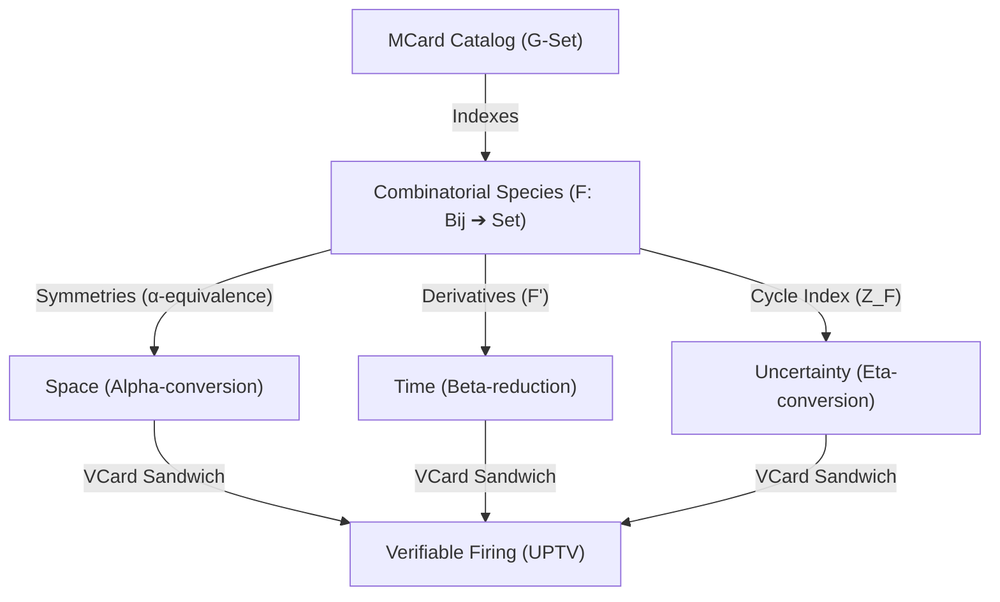

# Digital Scope

A **Digital Scope** is a bidirectional, scale-invariant measurement instrument that captures, digitizes, and visualizes high-dimensional states over time. Grounded in the category-theoretic framework of **[[Hub/Theory/Category Theory/Logic/Glossary/Lens|Lenses]]** and the physics of representability, a Digital Scope exists in two isomorphic forms across the physical and logical layers of the ecosystem:

1. **The Physical Scope (Oscilloscope / Logic Analyzer)**: An ESP32-based hardware probe that samples continuous analog voltage signals or digital protocols (I2C, SPI, UART) and digitizes them into discrete, readable bits, packets, and frequency spectra (FFT).
2. **The Categorical Scope (The Universal MCard Catalog)**: A digital registry and browser of **[[MCard|MCards]]**. Under the **[[Hub/Theory/Functions/Foundations/Function-Number Duality - The Foundational Isomorphism of Computation|Function-Number Duality]]**, dynamic functional transformations are "frozen" into static, content-addressed Generalized Numbers. The MCard Catalog acts as a scope that indexes and visualizes these frozen functions, representing them as **persisted and labeled [[Permanent/Concepts/Combinatorial Species|Combinatorial Species]]** ($F: \mathbf{Bij} \to \mathbf{Set}$) in a monotonically growing G-Set CRDT join-semilattice.

Both versions of the scope share the identical mathematical purpose: mapping high-dimensional, complex state spaces into low-dimensional, cognitively structured views to protect the observer's **[[Hub/Philosophy/Ontology/Authorized Cognitive Capacity|Authorized Cognitive Capacity (ACC)]]** from informational collapse.

---

## 1. The Categorical Scope: A Catalog of Labeled Combinatorial Species

In its generalized logical form, the Digital Scope is the **Universal MCard Catalog Browser**. It is the instrument that makes the infinite-dimensional space of functional transformations visible and navigable to human observers.

Instead of displaying code as mutable text files or raw compiled binaries, the Digital Scope visualizes functions as **persisted and labeled Combinatorial Species** (Joyal's species of structures).

Diagram: The MCard Catalog as a Digital Scope mapping Combinatorial Species to the three representability metrics.

### 1.1 Functorial Mapping of Executions
A combinatorial species $F$ is a functor $F: \mathbf{Bij} \to \mathbf{Set}$ that associates a finite set of labels $U$ with a set of structures $F[U]$. In the Digital Scope catalog, functions are represented strictly through this functorial mapping:
* **Abstract Species ($F$)**: The behavioral specification of the function (the **[[Hub/Theory/CLM/Foundations/Cubical Logic Model|CLM]] $A$-axis / Abstract Spec**). It defines the type contract and composition rules independently of any concrete language implementation or memory-address labels.
* **Bijection Transport ($F[\sigma]$)**: The concrete execution of the function (the **CLM $C$-axis / Concrete Impl**). When a namespace, variable set, or database schema undergoes a bijection mapping $\sigma: U \to V$, the functor automatically transports the execution state ($F[\sigma]: F[U] \to F[V]$) across runtime substrates.
* **Symmetry Group Quotient ($\times_{S_n}$ / $\alpha$-equivalence)**: The catalog quotients structures under the action of the symmetric group $S_n$. This is the mathematical implementation of **$\alpha$-equivalence** (coordinate-free variable renaming). It strips away coordinate-specific labels, leaving only the pure, invariant topological layout (the **Space metric** of the program).

### 1.2 Pointed Contexts and Derivatives
To execute a function inside the catalog, the scope utilizes the **Species Derivative** ($F'$):

$$F'[U] = F[U \sqcup \{*\}]$$

The derivative $F'$ represents placing a structure on a set with a distinguished, active focus element ($*$). In the catalog, this distinguished element represents the active task pointer or data input port. Evaluating the transition (the **Time metric / $\beta$-reduction**) evaluates the derivative by substituting the active input MCard into the pointed receptor slot.

### 1.3 The Cycle Index Series as the Verification Invariant
To prove that a composed function satisfies its specification, the Digital Scope probes its **Cycle Index Series** $Z_F(x_1, x_2, \dots)$. The cycle index serves as the algebraic invariant that verifies structural identity up to symmetry:
* By proving that the cycle index of the execution matches the specification, the catalog performs **$\eta$-conversion** (the **Uncertainty metric**).
* It asserts extensional equality (by the Yoneda Lemma: things are identical if they behave identically under all observations).
* This drives the epistemic uncertainty $U$ of the computation to zero ($U \to 0$), completing the typing judgment and sealing the transition with a **[[VCard]]** verification certificate.

---

## 2. The Physical Scope: ESP32 Implementation

At the physical layer of the mesh, the Digital Scope is implemented as a low-cost, high-speed probe using the **[[Hub/Hardware/IoT/ESP32|ESP32]]** microcontroller. It serves as the physical sensor that confirms whether electrical behaviors match their mathematical assumptions.

### 2.1 Logic Analyzer (Discrete Protocol Probe)
To observe high-speed digital communications between mesh nodes, the ESP32 is configured as a logic analyzer:
* **I2S DMA Sampling**: High-speed, hardware-level sampling captures state changes (HIGH/LOW) on GPIO pins directly into RAM without CPU overhead.
* **SUMP Protocol Streaming**: Streams raw data bytes over a USB serial connection to a host PC.
* **Sigrok PulseView Integration**: Decodes raw bit sequences into human-readable communication packets (I2C, SPI, UART) in a graphical interface.

This transforms continuous, high-frequency electromagnetic waves on SDA/SCL pins into discrete semantic assertions (e.g., "I2C Address 0x3C Ack").

### 2.2 Analog Oscilloscope (Continuous Waveform Probe)
To measure continuous signals, the ESP32 utilizes its internal analog-to-digital converter (ADC):
* **Sampling & Conditioning**: Samples analog voltages (0–3.3 V) at microsecond intervals. An operational amplifier buffer prevents impedance loading and protects the ESP32 pins.
* **FFT Processing**: Runs a local Fast Fourier Transform (FFT) to convert time-domain voltage waveforms ($V(t)$) into frequency-domain power spectra, displaying harmonic peaks.
* **WebSocket sonification & streaming**: Streams sampled data over local WebSockets to a web browser for rendering (using Plotly or Chart.js) and sonifies the data by routing the waveforms to an I2S digital-to-analog converter (DAC).

### 2.3 Role in the Pedagogical ABC Curriculum
In Yohanes Surya's **[[Hub/Theory/Sciences/ABC curriculum|ABC Curriculum]]**, **[[Permanent/Projects/LogicModel/Confirmation - The Judgment in the ABC Curriculum|Confirmation]]** ($B_{ik}$) is the phase where the learner validates whether a physical behavior matches their starting assumption:
* **Assumption (A)**: "I have configured my ESP32 signal generator to emit a 440 Hz acoustic sine wave."
* **Behavior (C)**: The system executes the PWM/DAC transition.
* **Confirmation (B)**: The learner attaches the Digital Scope probe to the output. The FFT display shows a single sharp peak at 440 Hz, and the speaker emits a clear A4 tone. 

The Digital Scope converts invisible, unverified hope into concrete, physical evidence, completing the confirmation judgment.

---

## 3. Bidirectional Lens and Galois Connection

Whether operating on hardware signals or database MCards, every Digital Scope is mathematically formalized as a bidirectional **[[Hub/Theory/Category Theory/Logic/Glossary/Lens|Lens]]** $L: \text{State} \rightleftarrows \text{View}$, consisting of a `get` and a `set` morphism:

$$\text{get}: \text{State} \to \text{View} \qquad\text{and}\qquad \text{set}: \text{State} \times \text{View} \to \text{State}$$

This lens interface satisfies the **Poset Galois Connection** $\text{get} \dashv \text{set}_c$, ensuring that observations soundly approximate the underlying state:

$$\boxed{\text{get}(x) \sqsubseteq_{\text{View}} v \iff x \sqsubseteq_{\text{State}} \text{set}_c(v)}$$

### 3.1 Physical Scope Lens mapping
* **Getter ($\text{get}$)**: Samples the continuous physical voltage space ($V(t)$) and projects it onto the 2D pixel coordinates of a display or a decoded packet list.
* **Setter ($\text{set}$)**: Translates user adjustments on the interface view (e.g., rotating the time-base knob or moving the trigger threshold cursor) to modify the physical sampling rate registers and comparator levels inside the ESP32 hardware.
* **Jacobian Volume Scaling**: The local coordinate change is governed by the Jacobian matrix $J = \frac{\partial \mathbf{V}_{\text{view}}}{\partial \mathbf{V}_{\text{state}}}$, where the determinant represents the time-voltage gain scale:
  $$\det(J) = s_x s_y$$
  Adjusting the scope knobs alters the Jacobian components to stretch or compress the signals, bringing high-frequency waves into the observer's cognitive light cone.

### 3.2 Categorical Scope Lens mapping
* **Getter ($\text{get}$)**: Abstracts the infinite-dimensional execution traces and raw content blobs in the G-Set database, projecting them into labeled Combinatorial Species ($F$, bijections, and cycle indices) displayed in the Web UI.
* **Setter ($\text{set}$)**: Takes human edits and structural choices made in the graphical catalog browser (e.g., adding or composing species) and compiles them back down into cryptographically signed CLM manifests, generating new content-addressed MCards in the local database.
* **Galois Adjunction**: The lower adjoint $\alpha = \text{get}$ abstracts complex combinatorial data onto intuitive layout slots (e.g., representing addition $F+G$ as drag-and-drop nodes), while the upper adjoint $\gamma = \text{set}_c$ propagates actions back to the structural species algebra. This ensures that visual edits preserve underlying type-invariants.

---

## 4. The REPL and G-Set Substrate

The Universal MCard Catalog is operationalized through the **[[PTR|Polynomial Type Runtime (PTR)]]** execution engine, which implements the closed, arithmetized **[[Hub/Theory/Sciences/Computer Science/Programming Model/REPL|REPL Cycle]]**:

$$\boxed{\text{REPL} = \text{Read}(V_{\text{pre}}) \xrightarrow{\text{Evaluate}(P)} \text{Print}(V_{\text{post}}) \xrightarrow{\text{Loop}} \text{Read}(V'_{\text{pre}})}$$

The Digital Scope is the browser that observes and drives this loop:

1. **Read (`prep`)**: The scope reads the input Place. It verifies if the ingress precondition $V_{\text{pre}}$ (represented as a labeled Combinatorial Species input shape) is satisfied by the current MCard markings.
2. **Evaluate (`exec`)**: The scope executes the transition (PCard). The Mealy machine simplifies the input, evaluating pointed species derivatives ($F'$).
3. **Print (`post`)**: The scope commits the output MCard and generates the egress postcondition witness $V_{\text{post}}$ (the VCard), driving epistemic uncertainty to zero ($U \to 0$).
4. **Loop (`await`)**: The committed output MCard is appended to the persistent database.

### 4.1 Monotonic Convergence in the G-Set Lattice
Because the PTR enforces mathematical closure, the MCard Catalog behaves as a **[[Hub/Tech/G-Set|Grow-only Set (G-Set)]]** CRDT. Every execution turn only appends new immutable MCards; it never deletes or overwrites existing ones. 

The G-Set's merge operation is the set-theoretic union ($\cup$), which forms a **Join-Semilattice** ordered by subset inclusion ($\subseteq$). The Digital Scope acts as a window into this semilattice, allowing the operator to:
* **Time-travel** through the dialogue or computation history by navigating the immutable MCard graph.
* **Merge states** across distributed, asynchronous nodes without coordination protocols or consensus locks. Since bijections and cycle indices are deterministic, two independent runtimes evaluating the same species composition over the same input will yield the identical MCard hash, converging automatically upon merge.
* **Visualize morphogenetic homeostasis** under Michael Levin's **[[Hub/Theory/Sciences/Biology/TAME|TAME]]** framework—probing the Software Lagrangian ($L_{\text{software}} = S_T - H_T$) to monitor and quarantine high-entropy "digital cancer" (faulty or unaligned executions) before they can pollute the shared database.

---

## 5. See Also

* **[[Permanent/Concepts/Combinatorial Species|Combinatorial Species]]** — Joyal's functorial foundation.
* **[[PTR|PTR: Polynomial Type Runtime]]** — The PT-transition execution engine.
* **[[Permanent/Concepts/Universal MCard Cataloging and the Function-Number REPL|Universal MCard Cataloging and the Function-Number REPL]]** — The math of currying and Function-Number duality.
* **[[Hub/Theory/Sciences/x_Scope|x-Scope: The Taxonomy of Observational Scaling and Perceptual Lenses]]** — The taxonomy of scopes and Jacobians.
* **[[Hub/Theory/Sciences/Conscious_Interfaces_and_x_Scopes|Conscious Interfaces and x-Scopes]]** — Unification of ITP, GASing, and species.
* **[[Hub/Theory/Sciences/Computer Science/Digital Synesthesia|Digital Synesthesia]]** — Sonification, haptics, and visual projection of mathematical invariants.
* **[[Hub/Theory/Sciences/Biology/TAME|TAME — Scale-Free Cognition]]** — Somatic homeostasis and collective swarm intelligence.
* **[[Hub/Theory/Integration/The Computational Metamaterial - Automata, Consensus, ESP32, and Digital Synesthesia|The Computational Metamaterial]]** — Composing ESP32 nodes into structured lattices.
