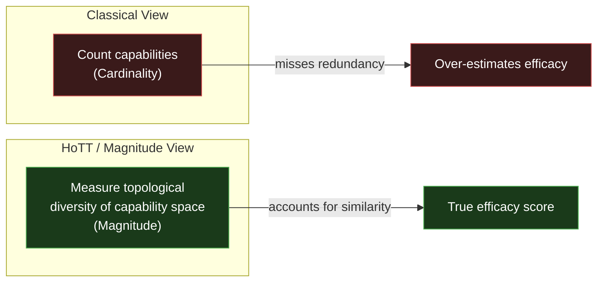

# Efficacy

**Efficacy** is the first dimension of the **[[3E Framework]]**. It answers the foundational question:

> **"Can we do it?"** — More precisely: "Does the system have sufficient *structural richness* to span the required solution space?"

Efficacy is not merely a binary yes/no on capability. It is a *graded* measurement of **how well-structured** a system's capabilities are, based on the **[[Magnitude]]** of its configuration space.

 In Chinese, it could be translated into 效能、效力、or 有效性。

---

## Definition

**Efficacy** = the **effective structural diversity** of a system's capability space.

This is formally measured by **Leinster's Category Magnitude**:

$$
\text{Efficacy} = |\mathcal{C}| = \mathbf{1}^T Z^{-1} \mathbf{1}
$$

where the **Similarity Matrix** $Z$ is defined as:

$$
Z_{ij} = e^{-d(c_i,\, c_j)}
$$

and $d(c_i, c_j)$ is the structural or semantic distance between capabilities $c_i$ and $c_j$.

---

## Why Magnitude, Not Cardinality?

The naive approach to measuring capability is to simply **count** capabilities (Cardinality). But this is insufficient because:

| Scenario                                         | Cardinality | Magnitude | Assessment                        |
| :----------------------------------------------- | :---------- | :-------- | :-------------------------------- |
| 10 completely distinct capabilities              | 10          | ~10       | ✅ High efficacy                  |
| 10 nearly-identical capabilities                 | 10          | ~1–2     | ❌ Low efficacy — redundant      |
| 5 well-spread capabilities                       | 5           | ~5        | ✅ Acceptable efficacy            |
| 100 capabilities, all slight variants of 3 types | 100         | ~3        | ❌ Bloated, low actual capability |

**Magnitude accounts for similarity.** Two capabilities that are structurally identical contribute only ~1 to $|\mathcal{C}|$, not 2. This enforces the **[[Hub/Theory/Category Theory/Logic/Type Theory/univalence axiom|Univalence Principle]]**: *isomorphic capabilities are the same capability.*

---

## Connection to Homotopy Type Theory

In **[[Homotopy Type Theory]] (HoTT)**, the **Univalence Axiom** states that *isomorphism is equality*. A capability that is behaviorally identical to another — that maps inputs to outputs in the same way — is *the same capability*, regardless of its surface representation.

This means:

- A capability "space" is really a **topological type**, not a flat list.
- "Efficacy" is the **topological size** of that type — how many contractible regions it spans.
- Magnitude is the categorical measure of that topological size.

---

## Efficacy Diagnostic Table

| $|\mathcal{C}|$ vs Cardinality | Diagnosis | Action |
| :--- | :--- | :--- |
| $|\mathcal{C}| \approx$ Cardinality | Capabilities are structurally diverse | ✅ Proceed to [[Efficiency]] optimization |
| $|\mathcal{C}| \ll$ Cardinality | Capabilities are semantically clustered | 🔁 Prune redundant capabilities, merge similar roles |
| $|\mathcal{C}|$ grows slowly with new additions | Capability space is saturating | ⚠️ New capabilities add diminishing structural value |
| $|\mathcal{C}| < |\mathcal{C}_{\text{goal}}|$ | Fundamental capability deficit | ❌ Insufficient efficacy to cover the goal space |

---

## Curry-Howard-Lambek Perspective

Under the **[[Curry-Howard-Lambek correspondence]]**, Efficacy maps to the **Logic** pillar:

| CHL Pillar                                      | 3E Metric          | Formal Object                                                                |
| :---------------------------------------------- | :----------------- | :--------------------------------------------------------------------------- |
| **Logic** (Propositions & Proofs)         | **Efficacy** | A*proof* that the system's type covers the required input/output signature |
| **Computation** (Types & Programs)        | *Efficiency*     | A*program* that executes within resource bounds                            |
| **Category Theory** (Objects & Morphisms) | *Effectiveness*  | A*functor* from capability objects to goal objects                         |

Efficacy is the **proof of capability** — a constructive witness that the system can, in principle, produce the required output. Without this logical proof, both Efficiency and Effectiveness are meaningless.

> **Formal Definition**: A system $S$ is *efficacious* for goal $G$ if and only if there exists a morphism $f: S \to G$ in the relevant category. The **magnitude** of the efficacy is then $|\mathcal{C}_S|$, the effective size of $S$'s capability space.

---

## Efficacy vs. Correctness

**Efficacy** and **Correctness** are related but distinct:

| Property               | "Logical Correctness"               | "Efficacy"                                  |
| :--------------------- | :---------------------------------- | :------------------------------------------ |
| **Asks**         | "Is the specification right?"       | "Can the system execute it?"                |
| **Addresses**    | Soundness of the*plan*            | Reachability of the*result*               |
| **Failure Mode** | Wrong output even when run          | Correct spec but system loops/crashes       |
| **Proven by**    | Type checking / formal verification | Magnitude of capability + termination proof |

A correct program that is not efficacious (e.g., it loops forever) is useless. An efficacious program that is not correct is unsafe. **Both are required**, with Efficacy serving as the operational complement to logical correctness.

---

## Connection to Lebesgue Number and Coverage

In topological terms, Efficacy is related to the **[[Lebesgue Number]]** ($\delta$) of a covering:

> A system has sufficient Efficacy if and only if its capability covering has a Lebesgue Number $\delta > 0$ — meaning every point in the goal space is "reachable" by at least one open ball of radius $\delta$ centered on a capability.

The **Lebesgue Number** is the topological guarantee of Efficacy. Magnitude quantifies *how much* efficacy; the Lebesgue Number proves *that* efficacy exists (no gaps).

---

## Epiplexity Limit on Efficacy

Even a theoretically high $|\mathcal{C}|$ is bounded in practice by the **[[Hub/Tech/Epiplexity|Epiplexity]]** ($S_T$) of the system's designer:

$$
\text{Achievable Efficacy} = \min\bigl(|\mathcal{C}|,\ S_T\bigr)
$$

A designer with compute budget $T$ can only *encode* the portion of the capability space they can learn within $T$. The remainder becomes **residual uncertainty** — an unaddressed structural gap.

---

## See Also

- **[[3E Framework]]** — The parent framework: Efficacy → Efficiency → Effectiveness
- **[[Efficiency]]** — The next step: minimizing resource cost of executing efficacious capabilities
- **[[Effectiveness]]** — The final step: verifying impact on the goal space
- **[[Magnitude]]** — Full mathematical treatment (Leinster, HoTT, Shape Dynamics)
- **[[Hub/Theory/Category Theory/Categorical Machine|Categorical Machine]]** — How Entropy connects to Magnitude
- **[[Safety Terminability Correctness and 3E Framework|Safety, Liveness, and Correctness]]** — Necessary preconditions for Efficacy
- **[[Hub/Theory/Sciences/Computer Science/NSM/Lebesgue Number|Lebesgue Number]]** — Topological proof of coverage
- **[[Hub/Tech/Epiplexity|Epiplexity]]** — Bounded-observer limit on learnable capability
