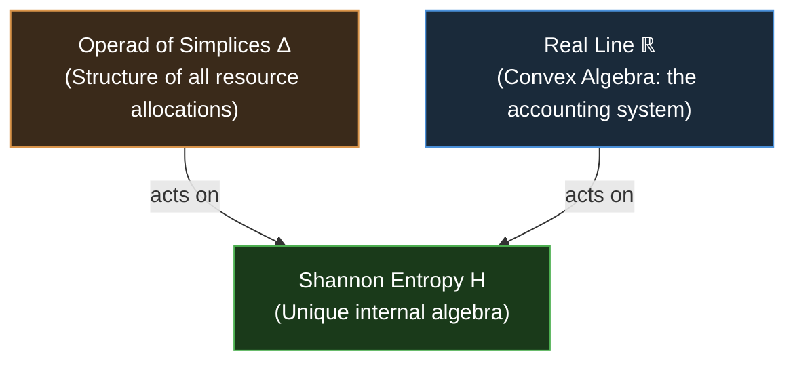
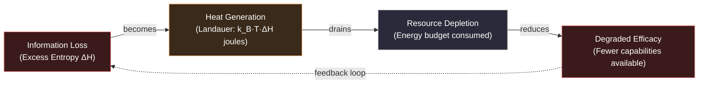

---
created: 2026-03-04T12:21:21+08:00
modified: 2026-03-04T12:21:21+08:00
title: "Efficiency: Entropy Minimization as the Cost of Action"
subject: Efficiency, Entropy, Information Compression, Categorical Machine, Linear Logic, SNR, Signal-to-Noise Ratio, Resource, Density of Activities, 3E Framework, Thermodynamics, Landauer
authors: Ben Koo, Antigravity
aliases:
  - Efficient
  - Resource Optimization
  - Can We Do It Within Budget
---
# Efficiency

**Efficiency** is the second dimension of the **[[3E Framework]]**. It answers the resource question:

> **"Can we do it within the budget?"** — More precisely: "What is the minimum information loss when transforming capability into output?"

Efficiency is not merely about speed or cost-cutting. It is the minimization of **[[Entropy]]** — the irreducible measure of information loss in any transformation — as formally derived by the **[[Hub/Theory/Category Theory/Categorical Machine|Categorical Machine]]**.

---

## Definition

**Efficiency** = the degree to which a system minimizes **entropy production** (information loss) while transforming its capabilities into outputs.

Formally, the Shannon Entropy that must be minimized is related to the **Magnitude Function** by:

$$
H(\mathcal{C}) = -\frac{d}{dt} \log |\mathcal{C}_t| \Big|_{t=1}
$$

where $|\mathcal{C}_t|$ is the Magnitude of the capability space at scale $t$ (inverse temperature). **High efficiency = low entropy production = minimal information loss per unit of output.**

---

## Why Entropy, Not Just Speed?

Speed and cost are proxies for the real underlying quantity: **information loss per unit of work done**. The **[[Hub/Theory/Category Theory/Categorical Machine|Categorical Machine]]** (Leinster) proves that entropy is the *unique* invariant of any resource-accounting process:

> **The Categorical Machine Insight**: Entropy is not a *choice* of measure — it is the **only** valid output of a process that allocates resources across multiple possibilities (probability distributions) and accounts for them additively. Any other measure is either reducible to entropy or violates the compositionality axioms.

---

## Efficiency and Linear Logic

Efficiency maps to **[[Linear Logic]]** in the Curry-Howard-Lambek correspondence:

| CHL Pillar                               | 3E Metric            | Formal Object                                                |
| :--------------------------------------- | :------------------- | :----------------------------------------------------------- |
| Logic (Propositions & Proofs)            | *Efficacy*         | Proof of capability                                          |
| **Computation (Types & Programs)** | **Efficiency** | **Linear type that tracks exact resource consumption** |
| Category Theory (Objects & Morphisms)    | *Effectiveness*    | Functor from capability to goal space                        |

In **Linear Logic**, every resource is *consumed exactly once*. This perfectly captures the spirit of efficiency:

- **Over-use** (using a resource twice when once suffices) = waste = inefficiency
- **Under-use** (allocating a resource but never consuming it) = dead weight = inefficiency
- **Exact use** (each resource consumed precisely when needed) = Linear Logic = maximum efficiency

---

## The Signal-to-Noise Ratio (SNR) View

Efficiency can also be understood as maximizing the **Signal-to-Noise Ratio (SNR)** of the transformation:

$$
\text{SNR} = \frac{\text{Information Delivered to Goal}}{\text{Total Information Consumed}}
$$

| SNR Level   | Entropy State      | System Behavior                                 | Assessment            |
| :---------- | :----------------- | :---------------------------------------------- | :-------------------- |
| SNR → 1    | $H \to 0$        | Every bit consumed produces a useful output bit | ✅ Maximum efficiency |
| SNR → 0    | $H \to H_{\max}$ | Resources consumed produce maximum noise        | ❌ Minimum efficiency |
| 0 < SNR < 1 | Intermediate       | Partial loss — typical real-world systems      | 🔁 Optimize           |

The **[[Hub/Theory/Sciences/Why ABC|Why ABC]]** and **[[Hub/Theory/Category Theory/Logic/Why Three|Why Three]]** principles are applications of SNR maximization: by using the minimum required set of representational types (3), we minimize the overhead of encoding, maximizing the proportion of resources that contribute to actual output.

---

## Thermodynamic Grounding: Landauer's Principle

Efficiency has a physical lower bound given by **[[Hub/Theory/Sciences/Landauer's Principle|Landauer's Principle]]**:

> Every irreversible bit erasure (information loss) generates at least $k_B T \ln 2$ joules of heat.

This means that entropy production in a computation has a **direct thermodynamic cost**. Minimizing entropy is not just logically optimal — it is physically necessary for sustainable operation:

$$
\text{Energy Cost of Inefficiency} \geq k_B T \cdot \Delta H
$$

where $\Delta H$ is the excess entropy produced beyond the theoretical minimum.

This shows why **chronic inefficiency eventually destroys Efficacy**: the heat generated by information loss drains the energy budget that sustains the capability space.

---

## Efficiency Diagnostic Table

| Metric                          | Low Efficiency                         | High Efficiency                |
| :------------------------------ | :------------------------------------- | :----------------------------- |
| **Entropy $H$**         | High (≈$\log n$)                    | Low (≈ 0)                     |
| **SNR**                   | Near 0                                 | Near 1                         |
| **Resource utilization**  | Many resources, little output          | Minimal resources, full output |
| **Representational cost** | Large vocabulary, many redundant types | Minimal types ([[Why Three]])               |
| **Thermodynamic cost**    | High heat generation (Landauer)        | Minimal heat generation        |
| **Sustainability**        | Efficacy degrades over time            | Efficacy is preserved          |

---

## Connection to Density of Activities

**[[Hub/Theory/Sciences/Energy as Density of Activities|Energy as Density of Activities]]** formalizes Efficiency in physical terms:

> **Energy = Density of Activities per unit spacetime volume**

Efficiency is then: *maximize the density of productive activities while minimizing thermodynamic waste per unit volume*.

This aligns with **[[Hub/Theory/Sciences/Maxwell's Demon|Maxwell's Demon]]**: an ideally efficient system is one that correctly sorts information (low entropy) without paying a net thermodynamic fee — which Landauer's Principle proves is impossible, but whose *limit* defines the theoretical efficiency ceiling.

---

## Epiplexity and Bounded Efficiency

A designer with compute budget $T$ cannot learn efficiency improvements beyond what their Epiplexity ($S_T$) allows:

$$
\text{Achievable Efficiency} \propto S_T(\text{System Design})
$$

**Over-naming** (too many distinct representations for a bounded observer) wastes Landauer energy on unused distinctions. **Under-naming** (too few) leaves structural patterns uncompressed. Optimal efficiency requires naming boundaries that align with the domain's natural topological joints — exactly what Epiplexity measures.

---

## See Also

- **[[3E Framework]]** — The parent framework
- **[[Efficacy]]** — The prerequisite: structural richness of the capability space
- **[[Effectiveness]]** — The next step: verifying impact in reality
- **[[Entropy]]** — The core information-theoretic measure of inefficiency
- **[[Hub/Theory/Category Theory/Categorical Machine|Categorical Machine]]** — Formal derivation of Entropy from the Operad of Simplices
- **[[Hub/Theory/Sciences/Landauer's Principle|Landauer's Principle]]** — The thermodynamic cost of information loss
- **[[Hub/Theory/Sciences/Energy as Density of Activities|Energy as Density of Activities]]** — Physical grounding of Efficiency
- **[[Hub/Theory/Category Theory/Logic/Why Three|Why Three]]** — Minimizing representational overhead
- **[[Hub/Tech/Epiplexity|Epiplexity]]** — Bounded-observer limit on achievable efficiency
