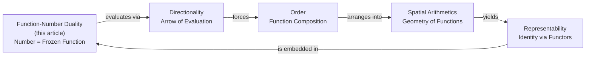

created: 2025-12-17T13:53:00+08:00
modified: 2026-06-18T11:45:00+08:00
title: "Function-Number Duality: The Foundational Isomorphism of Computation"
subject: Function, Number, Duality, Generalized Number, Static vs Dynamic, Polynomial Functor, Representable Functor, Monadic Duality, Directionality, Order, Spatial Arithmetic, Representability, All Things Are Functions, Behavioral Specification, Robert Harper, Head Expansion
authors: Ben Koo, Antigravity
aliases:
  - Function-Number Duality
  - Function as Number
  - Number as Function
  - Operator-Operand Duality
  - All things are functions
tags:
  - synthesis
  - foundation
  - duality
  - category-theory
  - pythagoreanism
  - smc
---

# [[Function-Number Duality]]: The Foundational Isomorphism of Computation

> **Core Thesis**: **Functions and Numbers are duals**—two perspectives on the same underlying mathematical structure. Numbers are **static representations** (what IS), while Functions are **dynamic operators** (what DOES). Together they form the complete computational universe, unified through **Generalized Numbers** where every datum is simultaneously a number (magnitude) and a function (operator). Under **[[Literature/People/Robert Harper|Robert Harper]]**'s **[[Hub/Theory/Category Theory/Type Theory/Types are Behavioral Specifications|behavioral view]]**, this duality is not a syntactic distinction but a specification of **execution behavior**: Numbers behave as identity transformations; Functions behave as state transitions.

See [[@YonedaEmbeddingExpresses2023]]

---

## Executive Summary

$$\boxed{\text{Function} \cong \text{Number}^\dagger \quad \text{(Duality)}}$$

| Aspect | Number (Static) | Function (Dynamic) | Unification |
|--------|----------------|-------------------|-------------|
| **Nature** | What IS | What DOES | Both perspectives on same entity |
| **Role** | Operand (data) | Operator (transformation) | Data = Identity/Zero-arity function |
| **Category** | Object | Morphism | Yoneda isomorphism |
| **Functor** | Representable | Polynomial | Adjunction |
| **Lambda** | η-conversion (extensional) | β-reduction (computational) | Confluence |
| **Complex** | Magnitude $\|z\|$ | Phase operator $e^{i\theta}$ | $z = \|z\| \cdot e^{i\theta}$ |
| **MVP** | MCard (content) | PCard (logic) | Complete triad |
| **Behavioral** | Head Expansion (typing backward) | Small-Step evaluation (typing forward) | Canonicity |

---

## 1. "All Things Are Functions!": The Universal Function Web

If we accept the categorical view (where an element is a morphism from the terminal object, $1 \xrightarrow{x} X$) and the Lambda Calculus view (where numbers are Church numerals, e.g., $2 = \lambda f. \lambda x. f(f(x))$), we reach a startling, absolute conclusion:

> **All things are functions.**

A "Number" is simply a function that has been frozen in evaluation—a **Generalized Number**. It is a zero-arity function, an identity morphism, or a steady-state attractor in a dynamic system. Because all things are functions, this fundamentally anchors the physics of computation:



### 1.1 The Anatomy of the Universal Function

| Concept | Epistemic Role | "All Things Are Functions" View |
|---------|----------------|---------------------------------|
| **Function-Number Duality** | The Core Isomorphism | "Data" is just a zero-arity or fully-applied function. |
| **[[Hub/Theory/Category Theory/Directionality\|Directionality]]** | Execution Flow | A function inherently possesses an arrow: $A \to B$. |
| **[[Order\|Order]]** | Dependency | Functions compose ($f \circ g$). $g$ must compute before $f$. |
| **[[Hub/Theory/Sciences/Computer Science/Directed Relational Arithmetics - Topologies of Place Value Systems\|Spatial Arithmetics]]** | Hardware/Geometry | A spatial layout of ALUs is just a topology of wired functions. |
| **[[Hub/Theory/Sciences/Representability\|Representability]]** | Identity | Yoneda proves an object is defined purely by the functions pointing into it. |

---

## Part I: Philosophical Foundations

## 2. The Pythagorean Foundation

### 2.1 Function-Number Duality IS Real-Lateral Duality

From **[[The Pythagorean-Monadic Synthesis - From Void-Unit to Numbers-Functions|Pythagorean-Monadic Synthesis]]**:

[[Literature/People/Pythagoras|Pythagoras]] intuited a fundamental duality in reality—but named it **Real vs Lateral** (imaginary). This IS the Function-Number Duality:

| Pythagorean | Category Theory | Computation | MVP Cards |
|-------------|-----------------|-------------|-----------|
| **Real axis** | Unit (Terminal, 1) | Number (static) | MCard |
| **Lateral axis** | Void (Initial, 0) | Function (dynamic) | PCard |
| **Complex $z = a + bi$** | Unit × Void | Number × Function | VCard |
| **Modulus $\vert z\vert = \sqrt{a^2+b^2}$** | Norm | Hash | Content identity |

### 2.2 Orthogonality: The Physical Meaning

From **[[Hub/Theory/Integration/Orthogonality and the Imaginary Unit - Why i Represents the Hidden Dimension|Orthogonality and the Imaginary Unit]]**:

The **inner product** defines observability and [[Hub/Theory/Category Theory/Machine Learning/MLOps/alignment|semantic alignment]] through [[Hub/Theory/Category Theory/Cosine Similarity|Cosine Similarity]]:

$$\cos(\theta) = \frac{\langle \vec{a}, \vec{b} \rangle}{\|\vec{a}\| \|\vec{b}\|}$$

| Angle | $\cos(\theta)$ | Interpretation | Duality |
|-------|----------------|----------------|---------|
| $0°$ (aligned) | $1$ | **Full alignment** | Number (visible projection) |
| $90°$ (orthogonal) | $0$ | **Empty projection** | Function (hidden transformation) |

$$\boxed{\text{Numbers are VISIBLE (projection = 1)} \quad \longleftrightarrow \quad \text{Functions are HIDDEN (projection = 0)}}$$

Under this geometric reading, the complex phase operator $e^{i\theta}$ acts as the dynamic rotator in Hilbert space. Computing a function is the process of rotating the system state vector to maximize its alignment ($\cos(\theta) \to 1$) with the target specification (the Number).

### 2.3 The Pythagorean Theorem as Duality Statement

$$c^2 = a^2 + b^2$$

This is the statement that **Number and Function contributions are independent**:
- **Real² (Number)** + **Lateral² (Function)** = **Total magnitude²**
- The cross-term vanishes because they are orthogonal

### 2.4 Being vs Becoming

From **[[Literature/People/Martin Heidegger|Heidegger]]** and **[[G.W.F. Hegel]]**:

| Philosophical | Number | Function |
|---------------|--------|----------|
| **Being (Sein)** | What IS | — |
| **Becoming (Werden)** | — | What DOES |
| **Dasein** | — | Being-in-the-world (functional engagement) |

The **Hegelian dialectic** maps directly:

| Dialectic | Interpretation | Duality |
|-----------|----------------|---------|
| **Thesis** | Number (static assertion) | — |
| **Antithesis** | Function (dynamic counter) | — |
| **Synthesis** | Generalized Number | **Resolution** |

### 2.5 Leibniz's Monad

From **[[Monadology]]**:

> "The Monad is simple (without parts) yet contains the whole universe."

**Resolution**: The Monad is a **Number** (atomic, simple) that **functions** (perceives, mirrors the universe).

$$\text{Monad} = \text{Number} \times \text{Function}$$

---

## Part II: Algebraic Structure

## 3. The Fundamental Duality

### 3.1 Statement of the Duality

From **[[Function]]** and **[[Hub/Theory/Sciences/Computer Science/Programming Model/Number|Number]]**:

$$\boxed{\text{Number} : \text{Function} :: \text{Noun} : \text{Verb} :: \text{Being} : \text{Becoming}}$$

| Number | Function |
|--------|----------|
| Static identity | Dynamic transformation |
| Extensional (what it IS) | Intensional (how it COMPUTES) |
| Magnitude $\|z\|$ | Operator $e^{i\theta}$ |
| Representable Functor | Polynomial Functor |
| Comonad (context) | Monad (effect) |
| Terminal Object (sink) | Initial Object (source) |

### 3.2 Why They Are Duals (Not Opposites)

From **[[Hub/Theory/Sciences/Computer Science/Programming Model/Functional Programming/Monadic Duality Paradox|Monadic Duality Paradox]]**:

> "Zero and One are duals, not opposites. They are the two boundary conditions of Directionality."

**The same holds for Function and Number**:
- **Numbers without Functions**: Cannot express transformation (static universe)
- **Functions without Numbers**: Cannot express identity (pure flux)
- **Together**: Complete computational expressiveness

This is the **[[Hub/Theory/Category Theory/Adjunction\|Adjunction]]** pattern:

$$\text{Number} \dashv \text{Function}$$

### 3.3 Complex Numbers as Paradigm

From **[[Hub/Theory/Integration/Static File Content as a Generalized Number System|Static File Content as Generalized Number System]]**:

$$z = |z| \cdot e^{i\theta}$$

| Component | Nature | Interpretation |
|-----------|--------|----------------|
| **Magnitude $\|z\|$** | Static (Number) | What the datum IS |
| **Phase operator $e^{i\theta}$** | Dynamic (Function) | How the datum transforms |
| **Complete $z$** | Unified | Number-Function synthesis |

**The Duality Resolved**:

$$\boxed{z = \text{Number} \times \text{Function} = |z| \times e^{i\theta}}$$

### 3.4 The Number Hierarchy as Function Hierarchy

| Number Type | Function Analog | Capability |
|------------|-----------------|------------|
| $\mathbb{N}$ | Identity functions | Counting |
| $\mathbb{Z}$ | + Inverse functions | Subtraction |
| $\mathbb{Q}$ | + Fractional functions | Division |
| $\mathbb{R}$ | + Limit functions | Continuity |
| $\mathbb{C}$ | + Rotation operators | **Algebraic closure** |

**Each number type** gains expressiveness by adding **corresponding function types**:
- $\mathbb{Z}$ adds subtraction **function**
- $\mathbb{Q}$ adds division **function**
- $\mathbb{C}$ adds rotation **function** ($e^{i\theta}$)

### 3.5 The Compressibility Duality (Freedman)

Based on Michael Freedman's 2026 paper *"Compression is all you need: Modeling Mathematics"*, this duality physically defines the boundaries of computational reasoning (AI and Human):

| Dimension | "Compression is all you need" Terminology | Operational Characteristic |
| --- | --- | --- |
| **Number** | "Human Mathematics" ($S_T$) | The **Compressed Macro / Name**. An immortal, navigable, static coordinate. It avoids combinatorial explosion by acting as a rigid geometric boundary. |
| **Function** | "Formal Mathematics" ($H_T$) | The **Unspooled Logical Trace**. A massive, chaotic, dynamically compounding execution tree. It is fundamentally unnavigable ("alien logic") unless mathematically bounded by Numbers via an Adjunction. |

The execution of intelligence is the act of temporarily unspooling a compressed Number (turning it into a Function) to perform work, and immediately re-compressing the output back into a static Number (a Hash). Without the Function, there is no work. Without the Number, there is combinatorial collapse.

### 3.6 Symmetric Monoidal Categories: The Algebraic Container

From **[[Hub/Theory/Integration/Pythagoreanism and Symmetric Monoidal Categories - Harmony as Categorical Structure|SMC and Pythagoreanism]]**:

A **[[Hub/Theory/Category Theory/Symmetric Monoidal Categories - The Algebraic Foundation of PTR and Petri Nets|Symmetric Monoidal Category]]** provides the algebraic structure for Function-Number Duality:

| SMC Structure | Function-Number | Interpretation |
|---------------|-----------------|----------------|
| **Object $A$** | Number (static type) | Data representation |
| **Morphism $f: A \to B$** | Function (dynamic transformation) | Process |
| **Tensor $A \otimes B$** | Number × Function together | Complete state |
| **Symmetry $\sigma$** | Commutativity | Order-independence |
| **Unit $I$** | Identity element | Null operation |

The two composition modes correspond to the two sides of the duality:

| Composition | SMC | Duality Side | PTR Implementation |
|-------------|-----|--------------|-------------------|
| **Sequential $f \circ g$** | Morphism composition | Function (ordered process) | `.then()` |
| **Parallel $f \otimes g$** | Tensor product | Number (simultaneous data) | `Promise.all()` |

The **symmetry** $\sigma_{A,B}: A \otimes B \cong B \otimes A$ expresses that:
- **Numbers (data)** can be reordered freely
- **Functions (processes)** may NOT be reorderable (non-commutativity)

This is the **boundary** where Pythagorean harmony (commutativity) meets non-commutative reality (process order matters).

---

## Part III: Computational Substance

## 4. The Behavioral View: Types as Specifications of Execution

The deepest reading of Function-Number Duality comes from **[[Literature/People/Robert Harper|Robert Harper]]**'s **[[Hub/Theory/Category Theory/Type Theory/Types are Behavioral Specifications|behavioral view of types]]** ([[@ComputationalTypeTheory1_2018|OPLSS 2018, Lecture 1]]). The duality is not a syntactic accident — it is a specification of **execution behavior**:

> A program $M$ "has type $A$" not because of a syntactic label, but because the **execution behavior** of $M$ satisfies the **specification** $A$.

### 4.1 The Behavioral Reading of β-Reduction and η-Conversion

The two sides of the duality correspond to the two fundamental operations of computation. Under the behavioral view, each is a statement about **execution**:

| Conversion | Lambda | Behavioral Specification |
|------------|--------|-------------------------|
| **β-reduction** | $(\lambda x. M) N \to M[N/x]$ | The *dynamic* behavioral specification: the program **executes** by substituting the argument into the body. Typing propagates *forward* along this step. |
| **η-conversion** | $\lambda x. (f x) \leftrightarrow f$ | The *static* behavioral specification: two functions are "the same type" iff they behave identically on all inputs. This is **extensional equality** verified by execution. |

The **[[Hub/Theory/Category Theory/Logic/Lambda Calculus/Church-Rosser Theorem|Church-Rosser Theorem]]** guarantees that both behavioral specifications converge:

$$\boxed{\text{β (Dynamic behavior)} \xleftrightarrow{\text{Confluence}} \text{η (Static behavior)}}$$

This is **proof** that the dynamic and static views are consistent specifications of the same underlying computational reality. Confluence is not a syntactic accident — it is the formal statement that the Function-view and Number-view of any program are eventually reconciled by execution.

### 4.2 The Head Expansion Lemma as Duality Bridge

The **Head Expansion Lemma** is the central proof technique connecting the two sides ([[@ComputationalTypeTheory1_2018|Lecture 1]]):

> **Typing is closed under reverse execution (head expansion):** If $M \mapsto M'$ and $M'$ has type $A$, then $M$ has type $A$.

In the language of the duality:
- **Function (dynamic side)**: the execution step $M \mapsto M'$ is one tick of Function-behavior.
- **Number (static side)**: the type $A$ is the static specification, the Generalized Number.
- **Head Expansion** says: one tick of Function-behavior does not change the Number-identity. The type (static magnitude) is an **invariant** of execution (dynamic transformation).

This is the formal proof that the duality holds: Functions transform, but the Number-identity (type) is preserved across transformation.

### 4.3 Canonicity: Where Function Becomes Number

Harper's **Canonicity Theorem** ([[@ComputationalTypeTheory3_2018|Lecture 3]]) states that every closed program of type `Nat` evaluates to a numeral. In the language of this duality:

> **Every closed Function of numeric type eventually becomes a Number.**

This is the formal proof that Dynamic (Function) can always be reduced to Static (Number) for closed programs. The duality is not merely structural — it is **computationally realizable**.

### 4.4 Cubical Type Theory: The Kan Condition as the Duality Compiler

When the duality is extended to *equivalences between types themselves* ([[Hub/Theory/Category Theory/Type Theory/Homotopy & Cubical/Cubical Type Theory|CTT]]), we face a problem. If two types (two Numbers) are stated to be equal, how do we physically move data between them? 

In Robert Harper's Cartesian formulation, the **[[Hub/Theory/Category Theory/Type Theory/Homotopy & Cubical/Kan Condition|Kan Condition]]** is not a static topological axiom; it is the **literal executable program** that computes the duality.

| CTT Concept | Function-Number Duality | PKC Execution |
|-------------|------------------------|-----|
| **Path** $p : I \to A$ | The continuous unspooling of a static Number into a dynamic Function over time $i$ | PCard execution trace |
| **Coercion (`coe`)** | The Kan program transporting a static Number along a dynamic path | Content migration between MCard states |
| **Kan Composition (`hfill`)** | The Kan program that computes the missing geometric volume to close an open box | PTR mathematically generating the Witness VCard |
| **Glue Type** | Behavioral interchangeability between two Number-types | MCard equivalence verified by Kan execution |

The Glue type is the ultimate expression of the duality: it makes the **behavioral interchangeability** of two Number-types executable. The Kan program provides the explicit algorithm that allows dynamic Functions to transport data securely between static Numbers.

---

## 5. Lambda Calculus: The Computational Mechanics

### 5.1 The Two Computational Modes

From **[[Lambda Calculus]]**:

| Conversion | Description | Nature | Duality Side |
|------------|-------------|--------|--------------|
| **β-reduction** | $(\lambda x. M) N \to M[N/x]$ | **Computation** | Function (dynamic) |
| **η-conversion** | $\lambda x. (f x) \leftrightarrow f$ | **Extensionality** | Number (static) |

**β-reduction** is the act of computing—applying a function to an argument.

**η-conversion** is the principle that two functions with the same input-output behavior ARE the same—treating functions as static data. In the **[[Hub/Theory/Category Theory/Type Theory/Types are Behavioral Specifications|behavioral view]]**, this is not a syntactic rule but a claim about execution behavior: if $f$ and $\lambda x. (f x)$ produce the same result on every input, they satisfy the same behavioral specification.

### 5.2 Kan Extension Interpretation

From **[[Hub/Theory/Category Theory/Kan extensions|Kan Extensions]]**:

| Kan Extension | Lambda Analog | Duality |
|--------------|---------------|---------|
| **Left Kan (Lan)** | β-reduction | Dynamic (generalize from examples) |
| **Right Kan (Ran)** | η-conversion | Static (restrict from universal) |

### 5.3 The Kan Program as the Phase Operator

In Section 3.3, we defined the generalized number duality as $z = |z| \cdot e^{i\theta}$, where the complex phase $e^{i\theta}$ acts as the dynamic Function rotating the static magnitude $|z|$ (the Number). 

In the language of executable Type Theory, **the Kan program is the phase operator**. 
When an MCard (static magnitude) is dynamically operated on by a PCard, it is executing the Kan `coe` (coercion) program. The Kan dimensional interval variable $i$ (tracing from 0 to 1) acts identically to the phase angle $\theta$. The Kan program computes the safe geometric trajectory to cleanly rotate the data from its input magnitude orientation to its output orientation without suffering topological tears.

---

## Part IV: Category-Theoretic Universals

## 6. Category-Theoretic Foundation

### 6.1 Objects and Morphisms

In **[[Category Theory]]**, the duality is structural:

| Category | Number Analog | Function Analog |
|----------|--------------|-----------------| 
| **Object** | Number type | — |
| **Morphism** | — | Function $f: A \to B$ |
| **Identity morphism** | Number as identity | $\text{id}: A \to A$ |
| **Composition** | — | $g \circ f$ |

**Key Insight**: Every object (number) has an identity morphism (function). This means:

$$\boxed{\text{Every Number IS a Function} \quad (\text{id}_n: n \to n)}$$

In the **[[Hub/Theory/Category Theory/Type Theory/Types are Behavioral Specifications|behavioral view]]**, this identity morphism is the behavioral specification of a Number: a Number "has type $A$" because its execution behavior is the identity — it evaluates to itself. This is η-conversion read operationally.

### 6.2 The Yoneda Isomorphism

From **[[Yoneda Lemma]]**:

$$A \cong \text{Nat}(\text{Hom}(-, A), -)$$

**Translation**: An object (number) IS characterized by all morphisms (functions) TO it.

$$\boxed{\text{Number} \cong \text{All Functions into Number}}$$

This is the **precise sense** in which Numbers and Functions are dual:
- **Number** = The object viewed as a point
- **Function** = The object viewed through its relationships

In the behavioral reading: a Number's identity is *completely specified* by the totality of behavioral interactions (functions) that target it. This is the **Yoneda Embedding** as behavioral exhaustiveness.

### 6.3 Representable vs Polynomial Functors

From **[[Hub/Theory/Sciences/Computer Science/Programming Model/Functional Programming/Monadic Duality Paradox|Monadic Duality Paradox]]**:

| Functor Type | Structure | Nature | Role |
|--------------|-----------|--------|------|
| **Representable** $F(X) \cong \text{Hom}(R, X)$ | Observation | **Static** (Number-like) | Storage, retrieval |
| **Polynomial** $P(Y) = \sum_{s \in S} Y^{D_s}$ | Generation | **Dynamic** (Function-like) | Interfaces, transitions |

**The Adjunction**:
$$\text{Representable (Number)} \dashv \text{Polynomial (Function)}$$

### 6.4 The Polynomial Formulation of Total Information

The ultimate information-theoretic synthesis of the duality is achieved by formulating **Total Information** as a generalized **[[Hub/Theory/Category Theory/Polynomial functor|Polynomial Functor]]** $I(Y)$ under **[[Function-Number Duality]]**:

$$I(Y) = \sum_{i \in I} S_T(i) \times Y^{H_T(i)}$$

* **Coefficients ($S_T$) $\to$ Positions $\to$ Numbers (Static)**: Map to **Epiplexity** ($S_T$ / MCards), representing the resolved, discrete structure of what the system **IS**.
* **Exponents ($H_T$) $\to$ Directions $\to$ Functions (Dynamic)**: Map to **Time-Bounded Entropy** ($H_T$ / PCards), representing active fibers, unresolved options, and state transitions of what the system **DOES**.

This represents a discrete **Laplace Transform** for complexity, where evaluation at $Y \to 1$ collapses the dynamic options and recovers the pure static structural Epiplexity $\sum S_T(i)$.

For the full conceptual synthesis, see **[[Hub/Theory/Integration/The Polynomial Formulation of Total Information - Function-Number Duality, Epiplexity, and Entropy|The Polynomial Formulation of Total Information: Function-Number Duality, Epiplexity, and Entropy]]**.

### 6.5 Kan Extensions AS Function-Number Duality

From **[[Hub/Theory/Category Theory/Kan extensions|Kan Extensions]]**:

Kan Extensions provide the **universal** formulation of Function-Number Duality:

| Kan Extension | Formula | Duality Side | Interpretation |
|--------------|---------|--------------|----------------|
| **Left Kan (Lan)** | $\text{Lan}_K F(B) = \int^{A} \text{Hom}(KA, B) \otimes FA$ | **Function** (dynamic) | Generalize from examples |
| **Right Kan (Ran)** | $\text{Ran}_K F(B) = \int_A FA^{\text{Hom}(B, KA)}$ | **Number** (static) | Restrict from universal |

The **Adjunction**:

$$\text{Lan}_K \dashv K^* \dashv \text{Ran}_K$$

| Adjunction | Direction | Duality |
|------------|-----------|---------|
| $\text{Lan}_K$ | From specific to general | Function → Number (generalize) |
| $\text{Ran}_K$ | From general to specific | Number → Function (specialize) |

### 6.6 Content as Kan Extension

From **[[Content expressed through Kan Extension - Source-Sink Petri Nets, Lateral Numbers, and Cubical Type Theory|Content as Kan Extension]]**:

> **All representable content IS a Kan Extension from Source to Sink.**

| Kan Extension | Content Interpretation | MVP Cards |
|--------------|------------------------|-----------| 
| Source Place $p^-$ | Origin of data | Input MCard |
| Sink Place $p^+$ | Destination of data | Output MCard |
| Transition $t$ | Transformation | PCard |
| Kan Extension | Complete flow | VCard witnessed |

---

## Part V: Computational Bridges

## 7. Dana Scott's Foundation

### 7.1 All Data Types Are Lattices

From **[[Literature/People/Dana Scott|Dana Scott]]** and his **[[Domain Theory]]**:

> "All data types are lattices."

**Translation**: Every **Number type** has a lattice structure (partial order of information).

**Continuous Functions** on these lattices preserve the structure:

$$f\left(\bigvee_i d_i\right) = \bigvee_i f(d_i)$$

**The Duality**:
- **Numbers** = Elements of the lattice (static positions)
- **Functions** = Scott-continuous maps (dynamic transformations)

### 7.2 Fixed Points as Duality Resolution

The **[[Hub/Theory/Sciences/Computer Science/Programming Model/Functional Programming/Kleene Fixed-Point Theorem|Kleene Fixed-Point Theorem]]**:

$$\text{fix}(f) = \bigvee_{n=0}^{\infty} f^n(\bot)$$

**Interpretation**: Applying a function (dynamic) repeatedly produces a **fixed point** (static)—the dynamic converges to static. In the behavioral view, this is the canonical example of a Function *becoming* a Number: the behavioral specification of the fixed-point combinator is "iterate until the specification is satisfied."

$$\boxed{\text{Function}^\infty \to \text{Number (fixed point)}}$$

## 8. Abstract Interpretation: Bridging the Duality

From **[[Hub/Theory/Sciences/Computer Science/Abstract Interpretation|Abstract Interpretation]]**:

### 8.1 Galois Connection as Duality Bridge

| Operation | Direction | Duality |
|-----------|-----------|---------| 
| **Abstraction $\alpha$** | Concrete → Abstract | Function → Number (forget detail) |
| **Concretization $\gamma$** | Abstract → Concrete | Number → Function (add detail) |

$$\alpha \dashv \gamma$$

### 8.2 Widening and Narrowing

| Operation | Effect | Duality |
|-----------|--------|---------|
| **Widening ∇** | Over-approximate (lossy) | To Number (static bound) |
| **Narrowing ∆** | Refine (recover) | To Function (dynamic process) |

## 9. Data Structures ↔ Algorithms: The Design Duality

### 9.1 The Fundamental Co-Design Principle

> **Data Structures are designed FOR Algorithms. Algorithms can only operate on MATCHING Data Structures.**

This is Function-Number Duality in software engineering:

| Data Structure | Algorithm | Relationship |
|----------------|-----------|--------------|
| **Array** | Binary search, QuickSort | Random access required |
| **Linked List** | Sequential scan, Merge sort | Pointer traversal |
| **Hash Table** | O(1) lookup | Key-value mapping |
| **Tree (BST)** | In-order traversal, Search | Hierarchical ordering |
| **Graph** | BFS, DFS, Dijkstra | Edge-vertex structure |
| **Heap** | Priority queue operations | Parent-child ordering |

### 9.2 The Duality Table

| Aspect | Data Structure (Form) | Algorithm (Function) |
|--------|----------------------|---------------------|
| **Nature** | Static representation | Dynamic operation |
| **Role** | What the data IS | What you DO with data |
| **Design** | Shape for function | Process for shape |
| **Constraint** | Structure enables operations | Operations require structure |
| **Categorical** | Object (Number) | Morphism (Function) |
| **MVP Cards** | MCard (content) | PCard (logic) |
| **Behavioral** | The spec the data satisfies | The spec the algorithm satisfies |

**The matching is an ADJUNCTION**:

$$\text{DataStructure} \dashv \text{Algorithm}$$

- **Left adjoint** (Algorithm): Given a structure, find compatible operations
- **Right adjoint** (DataStructure): Given an algorithm, find required structure

### 9.3 The Curry-Howard-Lambek Correspondence

This duality is a manifestation of **[[Curry-Howard isomorphism|Curry-Howard-Lambek]]**:

| Logic | Type Theory | Category | Duality |
|-------|-------------|----------|---------|
| **Proposition** | Type (Data Structure) | Object | Number (Form) |
| **Proof** | Term (Algorithm) | Morphism | Function (Operation) |
| **Implication** | Function type | Exponential | Adjunction |

Under the **[[Hub/Theory/Category Theory/Type Theory/Types are Behavioral Specifications|behavioral view]]**, the Curry-Howard correspondence is not a syntactic accident: a Proposition is a **behavioral specification**, and a Proof is an **executable program** that satisfies that specification. The isomorphism is between *behavioral* specifications and *executable* witnesses.

### 9.4 The Niklaus Wirth Insight

From **[[Literature/People/Niklaus Wirth|Niklaus Wirth]]**:

> **"Algorithms + Data Structures = Programs"**

This is the Function-Number Duality at the programming level:

$$\boxed{\text{Program} = \text{Data Structure (Number)} \times \text{Algorithm (Function)}}$$

Just as $z = |z| \cdot e^{i\theta}$, a complete program requires BOTH structure (what) AND algorithm (how).

### 9.5 GADTs as Generalized Numbers

From **[[Generalized Algebraic Data Types]]** (GADTs):

> "GADTs allow constructors to have specific and refined types."

**GADTs ARE Generalized Numbers**: the type index refines the behavioral specification of the constructor. A GADT constructor "has type $A \to T(i)$" not because of a syntactic annotation but because its execution behavior, when pattern-matched, produces a value whose further behavior is constrained by index $i$.

| GADT Feature | Number Analog | Function Analog |
|--------------|--------------|-----------------| 
| **Type index** | Magnitude refinement | Domain restriction |
| **Constructor** | Number value | Function definition |
| **Pattern match** | Value inspection | Function invocation |

### 9.6 Gödel Numbering: The Original Arithmetization of Syntax

Before modern type theories or category-theoretic formulations of computer science, **Kurt Gödel** constructed the first rigorous mathematical bridge of the duality. **[[Hub/Theory/Sciences/Computer Science/Programming Model/Gödel numbering|Gödel numbering]]** is the historical archetype of **arithmetization**: the mapping of dynamic execution structures to static numbers.

* **Staticization (Function $\to$ Number)**: It takes dynamic formal proofs, logical rules, and algorithms (Functions) and encodes them as a unique, static product of prime powers:
  $G=2^{s_1}\cdot3^{s_2}\cdots p_n^{s_n}$
  This integer is the static representation (what the program *is*).
* **Dynamicization (Number $\to$ Function)**: By prime factoring this integer, the compiler (or decoder) can unspool the exact original symbolic instruction stream, restoring its dynamic execution behavior (what the program *does*).
* **Self-Reference & Meta-Circular Evaluation**: Mapping functions to numbers allows a system to contain and evaluate its own description. This is the mathematical root of both the incompleteness theorem and the **Meta-Circular Evaluator** (the `MCard_TDD` execution engine). When code is represented as data, the runtime can operate upon its own description within the boundary of Mathematical Closure.

### 9.7 The Turnstile: The Verification Interface of the Duality

The logical **[[Hub/Theory/Sciences/Computer Science/Logic/Turnstile - Syntactic Consequence|Turnstile (\vdash)]]** represents the foundational interface of verification that reconciles the Function-Number duality in formal type systems:

$$\Gamma \vdash e : T$$

Under Curry-Howard, the Turnstile is the assertion that the dynamic **Function** (represented by the executable term $e$) satisfies the static **Number** (represented by the type specification $T$) under the environment $\Gamma$.

- **Static (Number)**: The type $T$ operates as a static specification, defining the target invariants, domain boundaries, and topological lattices ($\sqsubseteq$) that must hold.
- **Dynamic (Function)**: The term $e$ operates as the executable transition, performing evaluation steps ($\beta$-reductions) to construct a path.
- **The Turnstile ($\vdash$)**: Acts as the dynamic verification check. It guarantees that the dynamic function executes soundly within the bounds defined by the static number.

In the bitemporal `MCard_TDD` execution engine, the Turnstile physically validates that a dynamic logic transition (the PCard function) maps input databases to output databases (the MCard numbers) while preserving the structural constraints of the bitemporal ledger. It verifies that every dynamic step computes a valid, typed path onto the static information lattice.

* For the formal typing and logic aspects, see **[[Hub/Theory/Sciences/Computer Science/Logic/Turnstile - Syntactic Consequence|The Turnstile (\vdash): Syntactic Consequence and Provability]]**.
* For the dynamical, control-theoretic application in communication networks, see **[[Hub/Theory/Integration/The Cybernetic Turnstile - Judgment, Governance, and Control in Communication Infrastructures|The Cybernetic Turnstile]]**.

---

## Part VI: Architectural Implementation

## 10. The Monadic Duality Synthesis

### 10.1 Monad/Comonad as Function/Number

From **[[Hub/Theory/Sciences/Computer Science/Programming Model/Functional Programming/Monadic Duality Paradox|Monadic Duality Paradox]]**:

| Structure | Role | Duality |
|-----------|------|---------|
| **Monad** | Computational effects | Function (dynamic) |
| **Comonad** | Computational context | Number (static) |
| **Adjunction** | Bridge | Function ⟷ Number |

### 10.2 The MCard Schema Manifestation

| MCard Component | Monadic Role | Duality |
|-----------------|--------------|---------| 
| `handle` | Reader (Comonad) | Number (static reference) |
| `card` | State (snapshot) | Number (static content) |
| `version` | Writer (Monad) | Function (dynamic history) |

### 10.3 The Zero/One Foundation

| Concept | Zero (Initial) | One (Terminal) |
|---------|---------------|----------------|
| **Nature** | Pure Potential | Pure Actuality |
| **Duality** | Function (all outputs) | Number (all inputs converge) |
| **Polynomial** | $P(X) = 0$ | $P(X) = 1$ |
| **Representable** | — | $F(X) \cong \text{Hom}(1, X) \cong X$ |

## 11. MVP Cards: The Practical Implementation

### 11.1 The Triad as Duality Resolution

From **[[PCard]]** and **[[Hub/Theory/Integration/Static File Content as a Generalized Number System|Generalized Numbers]]**:

| MVP Card | Role | Number/Function | Kan Program Equivalent | Complex Analog | Behavioral Spec |
|----------|------|-----------------|------------------------|----------------|----------------|
| **MCard** | Content (data) | **Number** (magnitude) | The static geometric constraints (Endpoints $0$ and $1$) | $\|z\|$ | Hash is verified by *executing* the hash function |
| **PCard** | Transformation (logic) | **Function** (operator) | The Execution Path / Coercion (`coe`) program | $e^{i\theta}$ | Type is what the PCard *does* when run by PTR |
| **VCard** | Context (authorization) | **Witness** (synthesis) | The calculated Kan Filler (`hfill`) | Phase $\theta$ | Proof is an executable program *witnessing* behavior |

$$\boxed{\text{MCard} \times \text{PCard} \times \text{VCard} \cong \text{Algorithm}(A, C, \text{filler}) \cong \mathbb{C}}$$

### 11.2 Why Three (Not Two)?

From **[[Hub/Theory/Integration/The Triadic Completion - Why Dualities Require a Third Element|Triadic Completion]]**:

> Binary dualities require a **third element** to witness their correspondence. But how is the witness created? **It is computed by the Kan algorithm.**

| Duality | Element 1 | Element 2 | Witness (Computed by the Kan Filler) |
|---------|-----------|-----------|-----------------| 
| Function/Number | [[PCard]] | [[MCard]] | **[[VCard]]** |
| Dynamic/Static | [[Monad]] | [[Comonad]] | **[[Hub/Theory/Category Theory/Adjunction\|Adjunction]]** |
| β/η | [[Hub/Theory/Category Theory/Logic/Lambda Calculus/Reduction\|β-Reduction]] | [[Hub/Theory/Category Theory/Logic/Lambda Calculus/Conversion\|η-Conversion]] | **[[Hub/Theory/Category Theory/Logic/Lambda Calculus/Confluence\|Confluence]]** |

In the behavioral view, the **VCard as witness** is not merely a record—it is the geometric 3D volume (`hfill`) outputted by the **[[Hub/Theory/Category Theory/Type Theory/Homotopy & Cubical/Kan Condition|Kan Condition program]]** proving the behavioral specification has been gracefully satisfied without geometric tearing. This formalizes [[Hub/Tech/Computational Trinitarianism|Computational Trinitarianism]] where the proof algorithm physically bridges type and term.

---

## 12. The Yoneda 4-W Synthesis: Whether, What, How, Why

Drawing from **[[Andrius Kulikauskas]]**'s mapping of the **[[Yoneda Embedding]]**, the Function-Number Duality aligns perfectly with the four core cognitive questions (the 4 Ws):

| 4-W Question | Scope | Functorial Role | Function-Number Duality | PKC |
| :--- | :--- | :--- | :--- | :--- |
| **Why** | Everything | Context (Natural Transformation) | The **Rules** (Type Theory / Constraints) | VCard |
| **How** | Anything | Morphism ($A \to B$) | The **Function** (Dynamic Operator) | PCard |
| **What** | Something | Object ($A$) | The **Number** (Static Magnitude) | MCard |
| **Whether** | Nothing | Identity / Void | The **Root** (Existence / Representability) | Base |

1. **What (The Number)**: The *Something*. A specific, content-addressed **[[Hub/Theory/Sciences/Computer Science/Programming Model/Gödel numbering|Gödel number]]**. It is the static Object.
2. **How (The Function)**: The *Anything*. The dynamic wildcard, the operator possessing the expressive power to map the *What* to any other state.
3. **Why (The Adjunction)**: The *Everything*. The universal context bounding why these functions map these numbers.
4. **Whether (The Identity)**: The *Nothing*. The identity function $\text{id}$, the zero-state that anchors the entire duality.

---

## 13. The Master Synthesis

### 13.1 The Isomorphism Diagram

```
         STATIC (Number)                    DYNAMIC (Function)
              ↓                                   ↓
         Magnitude |z|        ←——Duality——→    Operator e^{iθ}
              ↓                                   ↓
         Representable        ←——Adjunction——→   Polynomial
              ↓                                   ↓
         η-conversion         ←——Confluence——→   β-reduction
              ↓                                   ↓
    Head Expansion (backward) ←——Behavioral——→  Small-Step (forward)
              ↓                                   ↓
         Comonad (Reader)     ←——Adjunction——→   Monad (Writer)
              ↓                                   ↓
         MCard (content)      ←——VCard witness——→ PCard (logic)
              ↓                                   ↓
         Terminal Object (1)  ←——0 ⊣ 1——→        Initial Object (0)
```

### 13.2 The Core Formula

$$\boxed{\text{Computation} = \text{Number} \times \text{Function} = |z| \cdot e^{i\theta} = \text{Static} \times \text{Dynamic}}$$

### 13.3 Why This Matters

1. **Theoretical Unification**: Functions and Numbers are not different kinds of things—they are dual perspectives on the same behavioral specification.
2. **Practical Architecture**: MVP Cards implement this duality (MCard/PCard), with VCard as the executable behavioral witness.
3. **Behavioral Grounding**: Under Harper's view, the duality is not a metaphor — it is a formal property of execution behavior, guaranteed by Head Expansion and Canonicity.
4. **Scale-Free**: The duality holds at all scales (bit to universe).
5. **Completeness**: $\mathbb{C}$ (and Generalized Numbers) are complete BECAUSE they contain both.

---

## 14. Physical Instantiation: MCard_TDD, Go, and the Rubik's Cube

The duality between Functions and Numbers is not merely an abstract category-theoretic property; it is the exact physical mechanism engineered into the **[[Hub/Theory/MVP/MCard/MCard_TDD|MCard_TDD]]** architecture.

When analyzing physical combinatoric spaces like the **[[Hub/Theory/Sciences/Computer Science/Programming Model/Game of Go|Game of Go]]** (a $19 \times 19$ Ising lattice) or the **[[Hub/Theory/Category Theory/Operator Theory/Rubik Cube|Rubik's Cube]]** (a surface graph of interlocking facelets), the duality becomes tangible:

*   **The Number (Spatial/Geometric Boundary)**: The physical wooden Go board, or the interlocking plastic structure of the Rubik's Cube. These structures *do not perform computation*. They simply bind space and enforce a topological limit (a grid, or a rotation axis). In `MCard_TDD`, this is the **persistent file service of the underlying OS** (the SQLite `MCard` database, functioning via the [[Hub/Theory/Integration/The Empty Schema Principle|Empty Schema]]). It is a pure static spatial constraint, analogous to a Number.
*   **The Function (Relational Navigation)**: The allowable moves in Go, or the quarter-turns of the Rubik's surface. These are the operations that mutate the state space. They map precisely to **Baldwin Operators** (Splitting, Substituting, Porting) traversing the lattice. In `MCard_TDD`, this is the **PCard and VCard** manipulating mechanisms executed by the PTR. They define the relational mappings bounded by the board's rules.

By formally enforcing this duality, `MCard_TDD` ensures that its dynamic functions (PCards) are rigorously bounded by the thermodynamic geometry of its persistent file system (MCards), exactly as the $3^{361}$ state explosion of Go is safely bounded by the finite wooden edges of the $19 \times 19$ board. 

> **See Diagram:** **[[Hub/Theory/MVP/MCard/MCard_TDD Architecture - Function-Number Duality Diagram|MCard_TDD Architecture - Function-Number Duality Diagram]]**

## 15. The Meta-Circular Evaluator: MCard_TDD, Polynomials, and CRDTs

The ultimate operationalization of the Function-Number Duality occurs when the execution engine itself is formally written in the vocabulary it executes. In classical computer science (e.g., SICP), this is termed a **Meta-Circular Evaluator**. `MCard_TDD` mathematically achieves this meta-circularity by synthesizing **[[PTR|PTR]]**, **[[Hub/Theory/Category Theory/Polynomial functor|Polynomial Functors]]**, and **[[Hub/Tech/CRDT|CRDTs]]**.

### 15.1 PTR as the Meta-Circular Evaluator

The **PTR** (Polynomial Type Runtime) functions as the core Meta-Circular Evaluator of the PKC ecosystem. It reads execution rules governed by the Function-Number Duality to dynamically transform structure without breaking the boundary of that structure:
1. **Numbers (Files) as the Source Code**: PTR treats static, content-addressed files (MCards stored in the OS geometry) as the irreducible "Lisp syntax" tokens.
2. **Functions (PCards) as the Evaluation Logic**: PTR extracts the relationally mapped execution bounds (the Baldwin Operators) from within these Number geometries.
3. **The `prep → exec → post` Loop**: By applying evaluated Functions against other Numbers, PTR computationally unspools dynamic execution traces and generates newly sealed structural Numbers (equipped with a VCard witness), effectively parsing and advancing the system state using the system's exact same algebraic structure.

### 15.2 The Polynomial Functor Grammar

This meta-circular evaluation operates strictly using the mathematical grammar of a **Polynomial Functor**:

$$P(X) = \sum_i A_i \times X^{C_i}$$

In this evaluation loop:
*   **$A_i$ (Positions)**: These are the exact representations of the physical OS Files / the concrete structural Data. They are the fixed static constants—the **Numbers**.
*   **$X^{C_i}$ (Directions)**: This forms the exponent topological mapping representing the Relational Execution dependencies—the **Functions** defining what data spaces are safely traversable.
*   **The Result**: The polynomial evaluates the inputs by perfectly partitioning what is structurally physical (Number) from what is relationally actionable (Function), forcing continuous, unruly Mealy computational transitions to collapse back into pure, typed Moore machine constants.

### 15.3 Mathematical Closure and the Bitemporal CRDT

Because geometric Numbers (MCards) are immutable cryptographic hashes by definition, the Meta-Circular Evaluator adheres strictly to the law of **[[Hub/Theory/Sciences/Computer Science/Programming Model/Closure|Mathematical Closure]]**. Zero-nullity is architecturally enforced: operations on facts produce new facts without deleting the old. This is identical to the philosophical architecture of the **[[Hub/Tech/Clojure (Programming Language)|Clojure]]** programming language, where immutable data structures treat "State" simply as the observation of an Identity over an epochal sequence of Time.

When PTR recursively evaluates these relational polynomial actions across the network, this epochal mathematical closure forces the structural physics to behave uniquely: 

It forms a **Conflict-free Replicated Data Type (CRDT)** behaving as a **[[Hub/Tech/Bitemporal Data Model|Bitemporal Ledger]]**.

Specifically, the `MCard_TDD` execution logic formally projects the storage universe as a **Join-Semilattice (G-Set CRDT)**. As relationally mapped entities (Functions) are executed by PTR against the file substrate (Numbers), the subsequent evaluative outputs are monotonically accumulated into a bitemporal history (`merge(A, B) = A ∪ B`). By treating physical file history exclusively as an Append-Only structure, `MCard_TDD` leverages this commutative and associative geometric accretion to guarantee that distributed agent actions remain eternally collision-resistant. This preserves absolute global mathematical consensus without reverting to centralized coordination. 

The Function-Number Duality, evaluated meta-circularly via PTR under strict Mathematical Closure, structurally prevents logic conflict and data loss by ensuring all computation logically unspools as Epochal Time—endlessly expanding the CRDT container space matrix.

### 15.4 Baldwin Operators as the Elementary Polynomial Arithmetic

The **[[Hub/Theory/Sciences/Computer Science/Programming Model/Baldwin Modularity Operators|Baldwin Modularity Operators]]** — the six operations of modular system evolution — are the **elementary arithmetic operations** on the polynomial $P(X) = \sum A_i \cdot X^{C_i}$. This is why Baldwin found exactly six and no more: they exhaust the structurally distinct ways to modify a polynomial while preserving its geometric meaning.

| Operator | Polynomial Arithmetic | Namespace Operation |
|----------|---------------------|---------------------|
| [[Hub/Theory/Sciences/Computer Science/Programming Model/Splitting\|Split]] | **Factoring** ($\div$) — Decompose $\Sigma$-type into summands | Factor `clm:` into `facet:a:`, `facet:c:`, `facet:b:` |
| [[Hub/Theory/Sciences/Computer Science/Programming Model/Excluding\|Exclude]] | **Subtraction** ($-$) — Remove a term from the sum | Remove keys while maintaining structural integrity |
| [[Hub/Theory/Sciences/Computer Science/Programming Model/Substituting\|Substitute]] | **Substitution** ($=$) — Replace exponent $C_i$ in $X^{C_i}$ | Swap `concrete_impl:` preserving other sections |
| [[Hub/Theory/Sciences/Computer Science/Programming Model/Augmenting\|Augment]] | **Addition** ($+$) — Add term $A_{n+1} \cdot X^{C_{n+1}}$ | Add keys to `pending_cases:` or `success_criteria:` |
| [[Hub/Theory/Sciences/Computer Science/Programming Model/Inverting\|Invert]] | **Inversion** ($^{-1}$) — Extract constraint from $C$ to $A$ | Promote nested value to `abstract_spec:` |
| [[Hub/Theory/Sciences/Computer Science/Programming Model/Porting\|Port]] | **Translation** ($\rightarrow$) — Re-interpret $X$ in new domain | Change `runtime:` binding preserving the rest |

The critical insight is that **these are not analogies** — they are the same morphism viewed in two categories. In **Set**, operators transform YAML dictionaries (namespaces). In **Poly**, operators perform arithmetic on $P(X)$. The [[Yoneda Lemma]] guarantees natural isomorphism between the two representations.

Furthermore, when mapped through the [[Hub/Theory/CLM/Foundations/Cubical Logic Model|CLM]]'s $A \times C \times B$ structure, the same six operators become the **learning moves** of the [[Hub/Theory/Sciences/Reverse Trivium|Reverse Trivium]]: Rhetoric-pair (Invert, Port), Logic-pair (Substitute, Augment), Grammar-pair (Split, Exclude). This reveals a third, epistemic layer: the operators don't just manipulate data or compute polynomials — they manipulate *evidence*.

See: **[[Hub/Theory/Integration/Baldwin Operators as Namespace Manipulators and Function Space Arithmetics|Baldwin Operators as Namespace Manipulators and Function Space Arithmetics]]** for the complete three-layer synthesis.

---

## See Also

### The Meta-Circular Evaluator
- **[[PTR|PTR: Polynomial Type Runtime]]** — The meta-circular loop engine managing execution bounds.
- **[[Hub/Theory/Category Theory/Polynomial functor|Polynomial functor]]** — The $P(X)$ algebraic dependency and interface grammar evaluated natively over geometric nodes.
- **[[Hub/Tech/CRDT|Conflict-free Replicated Data Types]]** — The geometric join-semilattice structurally enabling monotonic consensus tracking.
- **[[Hub/Theory/Sciences/Computer Science/Programming Model/Closure|Mathematical Closure]]** — The property of zero-nullity enforcing epochal state addition over destructive mutation.
- **[[Hub/Tech/Bitemporal Data Model|Bitemporal Data Models]]** — The time-axis resulting from closed accumulation of immutable state.


### Core Articles
- **[[Hub/Theory/Category Theory/Operator Theory/Function|Function]]** — Function as Generalized Number
- **[[Hub/Theory/Sciences/Computer Science/Programming Model/Number|Number]]** — Number types and type theory
- **[[Hub/Theory/Integration/Static File Content as a Generalized Number System|Generalized Number System]]** — Files as numbers
- **[[Hub/Theory/Category Theory/Type Theory/Types are Behavioral Specifications]]** — The foundational premise: types are specifications of execution behavior

### Monadic Duality
- **[[Hub/Theory/Sciences/Computer Science/Programming Model/Functional Programming/Monadic Duality Paradox|Monadic Duality Paradox]]** — Zero/One, Monad/Comonad
- **[[Polynomial functor]]** — Dynamic/generative functors
- **[[Representable Functors]]** — Static/observational functors

### Type Theory
- **[[Hub/Theory/Sciences/Computer Science/Logic/Turnstile - Syntactic Consequence|Turnstile (\vdash)]]** — The verification operator reconciling dynamic Functions (terms) and static Numbers (types).
- **[[Hub/Theory/Integration/The Cybernetic Turnstile - Judgment, Governance, and Control in Communication Infrastructures|The Cybernetic Turnstile]]** — The cybernetic verifier regulating the boundary transitions of the duality.
- **[[Hub/Theory/Category Theory/Type Theory/Homotopy & Cubical/Kan Condition|Kan Condition]]** — The executable program algorithm mapping Numbers to Functions
- **[[Literature/Reading notes/Generalized Algebraic Data Types|GADTs]]** — Generalized algebraic data types
- **[[Hub/Theory/Category Theory/Logic/Type Theory/Cubical Type Theory|Cubical Type Theory]]** — Computational univalence

### Lambda Calculus
- **[[Hub/Theory/Integration/The Lambda Calculus Triad - Reduction, Conversion, and Confluence|Lambda Calculus Triad]]** — Why three elements are required
- **[[Hub/Theory/Category Theory/Logic/Lambda Calculus/Church-Rosser Theorem|Church-Rosser Theorem]]** — Proof that β and η converge
- **[[Hub/Theory/Category Theory/Logic/Lambda Calculus/Reduction|β-Reduction]]** — Dynamic computation
- **[[Hub/Theory/Category Theory/Logic/Lambda Calculus/Conversion|η-Conversion]]** — Static extensionality
- **[[Hub/Theory/Category Theory/Logic/Lambda Calculus/Confluence|Confluence]]** — Witness of consistency

### Domain Theory
- **[[Hub/Theory/Category Theory/Logic/domain theory|Domain Theory]]** — Scott's lattice foundation
- **[[Literature/People/Dana Scott|Dana Scott]]** — The visionary
- **[[Denotational Semantics]]** — Meaning via functions

### Category Theory
- **[[Hub/Theory/Category Theory/Yoneda Lemma|Yoneda Lemma]]** — Object = incoming morphisms
- **[[Hub/Theory/Category Theory/Kan extensions|Kan Extensions]]** — Left/Right as β/η
- **[[Hub/Theory/Category Theory/Adjunction|Adjunction]]** — The duality formalization

### Pythagorean and SMC
- **[[Hub/Theory/Integration/The Pythagorean-Monadic Synthesis - From Void-Unit to Numbers-Functions|Pythagorean-Monadic Synthesis]]** — Master synthesis
- **[[Hub/Theory/Integration/Orthogonality and the Imaginary Unit - Why i Represents the Hidden Dimension|Orthogonality and i = √-1]]** — Why "imaginary" means orthogonal
- **[[Hub/Theory/Integration/Pythagoreanism and Symmetric Monoidal Categories - Harmony as Categorical Structure|SMC and Pythagoreanism]]** — Harmony as categorical structure
- **[[Spacetime as Number-Function Bundle - Representability and the Pythagorean Vision|Spacetime as Bundle]]** — Base=Number, Fiber=Function
- **[[Literature/People/Pythagoras|Pythagoras]]** — The harmonic worldview

### MVP Cards
- **[[MCard]]** — Number (content)
- **[[PCard]]** — Function (logic)
- **[[VCard]]** — Witness (context)

### Physical Manifestation
- **[[Metamaterials as Physical Functions|Metamaterials as Physical Functions]]** — Structure as Generalized Number in Spacetime
- **[[Hub/Tech/Metamaterial|Metamaterial]]** — Engineered materials where structure performs function
- **[[Literature/People/John Pendry|John Pendry]]** — "Function through structure, not chemistry"
- **[[Hub/Theory/Sciences/Computer Science/Directed Relational Arithmetics - Topologies of Place Value Systems|Spatial Arithmetics]]** — Topologies of function evaluation
- **[[Literature/Reading notes/@BrainTruffle_Fluid_Dynamics_Quantum_Mechanics|Fluid Dynamics and Quantum Mechanics]]** — The physical scale-cascade as a projection mapping continuous quantum dynamics (dynamic Function) to discrete observables (static Numbers).

### The Universal Function Web
- **[[Hub/Theory/Category Theory/Directionality\|Directionality]]** — The flow of function evaluation
- **[[Hub/Theory/Category Theory/Logic/Order\|Order]]** — The composition dependency of functions
- **[[Hub/Theory/Sciences/Representability\|Representability]]** — Identity as defined by incoming functions

### The Compressibility Framework
- **[[@CompressionIsAllYouNeed2026]]** — The mathematical proof that Names/Macros isolate us from formal chaos.
- **[[@Video-MichaelFreedman-CompressionIsAllYouNeed]]** — How finding "Names" in continuous geometry acts as the ultimate Function-Number bridge.

### Robert Harper / Behavioral Specifications
- **[[Hub/Theory/Category Theory/Type Theory/Types are Behavioral Specifications]]** — Types as specifications of execution behavior
- **[[Literature/Reading notes/@ComputationalTypeTheoryOPLSS2018|Computational Type Theory — OPLSS 2018 (Full Series)]]** — Harper's five-lecture arc
- **[[Hub/Tech/Computational Trinitarianism]]** — Type / Term / Proof inseparability

### Operational Synthesis
- **[[Hub/Theory/Integration/The Polynomial Formulation of Total Information - Function-Number Duality, Epiplexity, and Entropy|The Polynomial Formulation of Total Information]]** — Unifies Epiplexity (structure) and Entropy (noise) under the category-theoretic framework of polynomial functors.
- **[[Hub/Theory/Integration/The Arithmetization of Intelligence - Function-Number Duality and the Universal Token Convolution|The Arithmetization of Intelligence]]** — How Function-Number Duality proves all intelligence is Token Convolution
- **[[Hub/Theory/Integration/ACC as Token Valuation - Vocabulary Selection in the Meta-Circular Evaluator|ACC as Token Valuation]]** — ACC measures cognitive efficiency of Generalized Numbers
- **[[Hub/Theory/Integration/What Is a Meta-Circular Evaluator - A Concrete Walkthrough|What Is a Meta-Circular Evaluator?]]** — Step-by-step proof: "Who is the first president of Indonesia?" is pure arithmetic on Generalized Numbers
- **[[Hub/Theory/Integration/Baldwin Operators as Namespace Manipulators and Function Space Arithmetics|Baldwin Operators: Three-Layer Interpretation]]** — Namespace manipulation ≡ Polynomial arithmetic ≡ Reverse Trivium learning moves
- **[[Hub/Theory/Sciences/Computer Science/Programming Model/Baldwin Modularity Operators|Baldwin Modularity Operators]]** — The six elementary arithmetic operations on $P(X) = \sum A_i X^{C_i}$
- **[[Hub/Theory/Sciences/Computer Science/Programming Model/generative grammar|Generative Grammar]]** — Chomsky's transformational rules as Baldwin operators; CLM as generative grammar for computation
- **[[Permanent/Concepts/Universal MCard Cataloging and the Function-Number REPL|Universal MCard Cataloging and the Function-Number REPL]]** — Synthesis of the REPL and Function-Number Duality for dynamic, layman-navigable catalogs.
- **[[Permanent/Concepts/Information Geometry|Information Geometry]]** — Statistical manifold representation of parameterized functions and natural gradients.
- **[[Hub/Theory/Sciences/Biology/Hoffman's Spacetime Desktop|Hoffman's Spacetime Desktop]]** — Formulates Hoffman's Interface Theory of Perception as a conscious agent Markovian loop ($P, D, A$ functions) projecting onto a spacetime headset of qualitative icons (numbers), unified by the FBT theorem.


---

## References

```dataview
Table title as Title, authors as Authors
where contains(subject, "Function") or contains(subject, "Number") or contains(subject, "Duality") or contains(subject, "Polynomial Functor") or contains(subject, "Generalized Number")
sort modified desc
```
