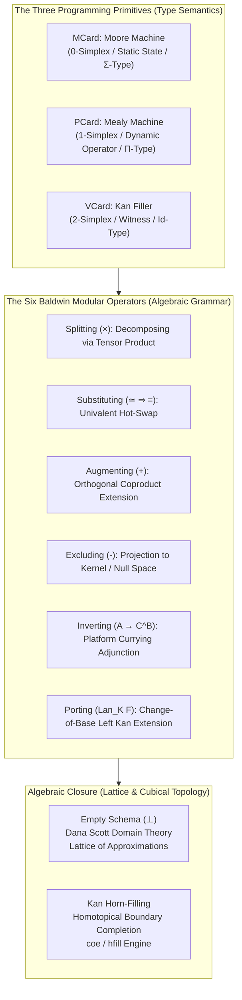

# A Generalized Algebraic Theory of Programming: Homotopical Modularity under the Cubical Logic Model

> **"Computation is not a sequence of mechanical instructions; computation is a geometry. The Generalized Algebraic Theory of Programming formalizes modularity not as an ad-hoc software pattern, but as an algebraic calculus of homotopical transformations where types are spaces, programs are paths, and modular refactorings are univalent equivalences."**

---

## 1. The Programming Primitives: MVP Cards as Type Semantics

Under the **Generalized Algebraic Theory of Programming (GAT-P)** within the **Cubical Logic Model (CLM)**, programming constructs are grounded in algebraic automata and homotopy type theory:

### 1.1 MCard: The Moore Machine (Static Type / Number)
An `MCard` models pure, situated state:
$$M = \langle S, s_0, O, \lambda \rangle$$
Where output depends strictly on the current state $\lambda: S \to O$, with zero dependency on dynamic input transitions. In type-theoretic terms, an `MCard` is a **$\Sigma$-type (dependent pair)** representing a static location, mass distribution, memory allocation, or content-addressed cryptographic leaf. It forms the **0-simplex** of the representation engine.

### 1.2 PCard: The Mealy Machine (Dynamic Operator / Function)
A `PCard` models state transitions driven by external stimulus:
$$P = \langle S, I, O, \delta, \lambda \rangle$$
Where transitions $\delta: S \times I \to S$ and outputs $\lambda: S \times I \to O$ depend on the incoming input $I$. In type theory, a `PCard` is a **$\Pi$-type (dependent function / polynomial functor)** representing computation, causal progress ($\beta$-reduction), and temporal composition. It forms the **1-simplex (morphism / handle)**.

### 1.3 VCard: The Kan Filler (Witness / Identity Type)
A `VCard` models the homotopical boundary filler and semantic referee:
$$V = \langle \text{Pre}, \text{Post}, \text{Witness}, \text{Proof} \rangle$$
In Homotopy Type Theory, an identity between two paths is not a boolean check; it is a higher-dimensional cell. A `VCard` provides the **Kan filler** (`hfill`) and coercion (`coe`) proving that executing a concrete `PCard` against an `MCard` strictly satisfies the abstract specification `Spec`. It forms the **2-simplex (triangle / history / boundary)**.

---

## 2. The Programming Grammar: Baldwin Operators as Algebraic Primitives

In classical software engineering, refactoring is treated informally as "craft." GAT-P elevates **Prof. Carliss Baldwin's six modular operations** (*Design Rules: The Power of Modularity*) into formal algebraic operators over polynomial functors:

| Baldwin Operator | Algebraic Form | Computational & Category-Theoretic Action |
| :--- | :--- | :--- |
| **1. Splitting** | $S \xrightarrow{\times} S_1 \otimes S_2$ | **Tensor Decomposition**: Splits a monolithic module into independent parallel modules across a thin crossing point, governed by the Double-Category **Interchange Law**: $(f_1 \otimes f_2) \circ (g_1 \otimes g_2) = (f_1 \circ g_1) \otimes (f_2 \circ g_2)$. |
| **2. Substituting** | $C_j \xrightarrow{\simeq \implies =} C_j'$ | **Univalent Hot-Swap**: Replaces implementation $C_j$ with $C_j'$ under invariant spec $A_i$. The runtime executes Kan filler (`hfill`) to certify behavioral equivalence; by the **Voevodsky Univalence Axiom** ($\text{Equiv}(A, B) \simeq (A = B)$), equivalence licenses safe, zero-downtime hot-reloading. |
| **3. Augmenting** | $P(y) \xrightarrow{+} P(y) + B \cdot y^k$ | **Coproduct Extension**: Adds a new, independent capability to the system polynomial. Verified via **Monadic Duality**: the pullback meet between existing space and the new term must evaluate to $\emptyset$, ensuring orthogonality without collision. |
| **4. Excluding** | $P(y) \xrightarrow{-} P(y) \setminus \{K\}$ | **Kernel Pruning**: Removes deprecated or compromised branches. If verification fails ($B_{ik} = 0$), the summand's coefficient is projected into the **Null Space (Kernel)**, structurally pruning the path from the active interface without erasing historical records. |
| **5. Inverting** | $\text{Hom}(A \times B, C) \cong \text{Hom}(A, C^B)$ | **Platform Currying Adjunction**: Promotes internal state into a public platform interface or prompt API. Exponentiates the capability so external programs and agents can bind to it as a reusable substrate. |
| **6. Porting** | $\operatorname{Lan}_K F(e) = \int^c \mathcal{E}(Kc, e) \cdot F(c)$ | **Change-of-Base (Left Kan Extension)**: Transports firmware, UI, or workflows to a new execution substrate along inclusion functor $K$. Certified correct if unit $\eta: F \to \operatorname{Lan}_K F \circ K$ preserves universal properties up to natural equivalence. |

---

## 3. Algebraic Closure: The Empty Schema and Scott's Lattice Domain

A formal programming theory requires **algebraic closure**: every valid operation must evaluate to a well-formed term within the computational universe, never escaping into undefined crashes ($\top$).

1. **The Lattice of Approximations (Dana Scott Domain Theory)**:
   - Computation begins at **bottom ($\bot$)**—the state of zero assumptions, formally defined as the **Empty Schema Principle** ($\text{Universal} = \emptyset + \text{Refinement}$).
   - Every sprint, MCard definition, or Baldwin operator is a Scott-continuous information map traversing upward:
     $$\bot \;\sqsubseteq\; \text{MCard} \;\sqsubseteq\; \text{PCard} \;\sqsubseteq\; \text{VCard} \;\sqsubseteq\; \text{Settled System}$$
   - Information accumulates monotonically without mutating or destroying immutable historical nodes.
2. **Homotopical Closure via the Kan Condition**:
   - Computations form $n$-dimensional open horns in a cubical set. The Kan condition guarantees that every open horn can be filled, generating a verified lid that seals the state transition.
3. **Relational Algebra Substrate**:
   - Operations compose as relational equijoins ($R_{g \circ f} = R_f \bowtie R_g$). In content-addressed storage (SQLite / Merkle trees), joins eliminate redundant recalculation, driving Landauer dissipation to zero in Transaction-Free Zones.

---

## 4. Connections to Other Wiki Nodes

- [[docs/concepts/Algebra_of_Systems_and_Mental_Model_Mapping|Algebra of Systems and Mental Model Mapping]] — the tripartite grounding of GAT-P in Space, Time, and Energy.
- [[docs/principles/Cordis_Spatiotemporal_Composability|Cordis: Spatiotemporal Composability]] — the reactive TypeScript microkernel implementing GAT-P fibers.
- [[docs/concepts/Perspective_and_Referential_Coordinates_in_Spacetime_Compositionality|Perspective and Referential Coordinates in Spacetime Compositionality]] — covariance across observer reference frames.
- [[docs/concepts/Vibration_Perturbation_and_the_Energy_Cost_of_Coherence|Vibration, Perturbation, and the Energy Cost of Coherence]] — the energetic cost of order-preserving Kan closure.
