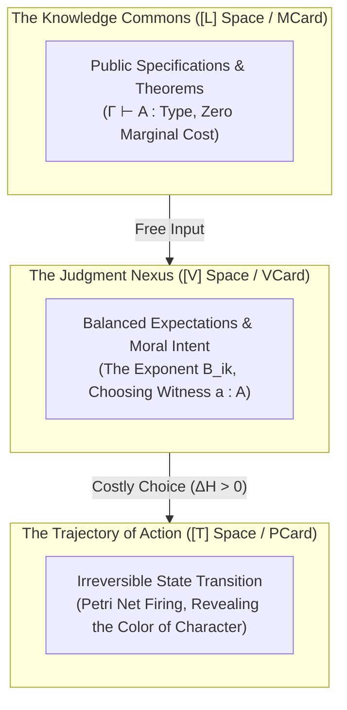

# Knowledge Is Free, But Judgment Is Not: Agency, The Commons, and the Chromatic Revelation of Character

> *"Knowledge is free, but judgment is not! Knowledge as written or published content can be attained rather publicly in various commons, but using the knowledge in privately interested or self-resolved choices will reveal the color of that person."*

---

## 1. The Fundamental Asymmetry: Abundance of Data vs. Gravity of Choice

In the information age, humanity has achieved the near-frictionless distribution of symbolic thought. Mathematical equations, open-source codebases, scientific papers, cultural mythologies, and encyclopedic wikis exist in the global commons. Stored in content-addressed repositories like **[[MCard|MCards]]** ($[L]$ space), knowledge can be replicated and read at zero marginal energy cost: **Knowledge is free**.

However, possessing knowledge is not the same as exercising **Agency**. The transition from passive knowing to decisive action requires **Judgment**:
- A textbook on hydraulic engineering is free in the library, but deciding whether to open a sluice gate to relieve a drowning downstream village—or keep it closed to protect private rice paddies—is an irreversible act of **Judgment**.
- The mathematical equations of Maxwell's Demon or the Yoneda Lemma are published openly, but deciding whether to deploy them as an extractive front-running bot or as a cooperative peer-to-peer barter network is an act of **Judgment**.

**Judgment is never free**:
1. **Physical / Thermodynamic Cost**: Making a decision collapses possibilities, erases non-chosen branches in phase space, and dissipates non-zero Landauer heat:
   $$\Delta S_{\text{judgment}} \ge k_B \ln 2 \cdot \Delta I_{\text{decision}}$$
2. **Causal & Moral Cost**: Every judgment leaves an unalterable causal signature in the spacetime manifold ($A \circ B \neq B \circ A$). It creates social debt (*Rna*), shifts ecological equilibrium, and binds the actor to the consequences.
3. **The Revelation of Character**: The choices an agent makes under conditions of uncertainty and temptation act as an optical prism: they **reveal the true color of that person**.

---

## 2. The Type-Theoretic and CLM Formulation

In the **[[Hub/Theory/CLM/Foundations/Cubical Logic Model — Spatiotemporal Representation of Functions|Cubical Logic Model (CLM)]]**, this asymmetry maps directly onto the triadic structure:

### 2.1 Knowledge as Type, Judgment as Inhabitant
In intuitionistic type theory (Martin-Löf):
- **Knowledge** is the proposition (type) $A$. It exists openly in the universe $\mathcal{U}$. Anyone can see that the type exists.
- **Judgment** is the proof or witness:
  $$\Gamma \vdash a : A$$
  Selecting *which* proof $a$ to construct, and *how* to bind it into the real world, is the subjective commitment of the agent.

### 2.2 The Polynomial Exponent ($B_{ik}$)
In the polynomial functor representation of the CLM:
$$F(C_j) = \sum_i A_i \times C_j^{B_{ik}}$$
- $A_i$ represents the assumptions/knowledge from the commons.
- $C_j$ represents the available implementation algorithms.
- **$B_{ik}$ represents the Judgment exponent**: the evaluator that accepts ($B_{ik} = 1$), rejects ($B_{ik} = 0$), or selectively weights the outcome. The exponent controls what survives into the future.

---

## 3. "Revealing the Color of That Person": The Synesthetic Spectrum of Character

In the *Prologue of Spacetime*, player character is not measured by the size of their digital wallet or the number of formulas they have memorized. It is rendered directly through **[[Hub/Theory/Sciences/Computer Science/Digital Synesthesia|Digital Synesthesia]]**—transducing the moral quality of judgments into perceptible chromatic and acoustic signatures:

| Judgment Orientation | Underlying Motivation | Thermodynamic Signature | Synesthetic Manifestation ("The Color") | Tri Hita Karana Status |
|:---|:---|:---|:---|:---|
| **Predatory / Extractive** | Enclosing public commons for private monopoly, front-running, toll extraction. | High Landauer heat ($H_T \gg S_T$), turbulent boundary shear. | **Abrasive Infrared / Muddied Blood-Red**: Blurry chromatic aberration, discordant microtonal friction, heavy tactile drag. | Severe deficit across *Pawongan* (human community) and *Palemahan* (nature). |
| **Transactional / Neutral** | Strict tit-for-tat barter, zero altruism, minimum legal compliance. | Balanced heat ($H_T \approx S_T$), rigid boundary maintenance. | **Monochrome Gray / Steel Silver**: Flat lighting, neutral square waveforms, rigid mechanical clicking. | Stagnant equilibrium; zero regenerative surplus. |
| **Stewardship / Gotong Royong** | Cultivating public goods, Subak terrace water sharing, zero-queue coordination. | Reversible transaction ($H_T \to 0$), zero boundary shear ($T_{ij} \equiv 0$). | **Laminar Emerald / Radiant Sapphire**: Distortion-free gravitational wells, smooth neon streamlines, consonant pentatonic chords. | High harmony across *Pawongan* and *Palemahan*. |
| **Transcendent / Cosmic** | Aligning personal will (己志) with the Software Lagrangian and biospheric renewal. | Stationary action: $\delta \int (S_T - H_T) dt = 0$. | **Prismatic Coherent Gold / Pure White**: Laser-sharp spectral convergence, ringing Gamelan harmonic silence. | Complete *Tri Hita Karana* integration (*Parahyangan*, *Pawongan*, *Palemahan*). |

---

## 4. Passive Containers ($受$) vs. Free Will ($	ext{己志}$)

The Chinese philosophical concept of **$受$** (the passive container) and **$	ext{己志}$** (self-resolved free will) illuminates why judgment reveals character:
- A database, a book, or an LLM context window is a **passive container ($受$)**. It accepts whatever symbols are poured into it without moral distinction. An AI or an unthinking clerk can recite all of Wikipedia without exercising a shred of judgment.
- **Agency ($	ext{己志}$)** begins only when the boundary of the container makes a conscious choice: *What do I admit? What do I reject? What do I sacrifice my own energy to protect?*
- When an individual takes free knowledge from the commons and faces a dilemma where self-interest conflicts with communal flourishing, their decision pierces through all rhetorical pretense. Their judgment reveals their true wavelength.

---

## 5. Ludic Integration: The Judgment Dilemma in Every Sprint

Across the twelve sprints of the *Prologue of Spacetime*, players are not tested on rote trivia. Every sprint concludes with a **Judgment Dilemma**:
- The game gives players all necessary technical knowledge: the algorithm is verified, the MCard schema is provided, the mathematical formula is in the HUD.
- The player must choose **how to apply that knowledge**:
  - Do they optimize purely for their own local enclave's token accumulation?
  - Or do they coordinate with upstream and downstream neighbors to satisfy global invariants (e.g., zero water leakage, zero packet starvation, zero queue bloat)?
- The player's HUD dynamically shifts its ambient lighting, audio timbre, and reputation aura based on the **color of their choices**.

Players learn not through didactic lecturing, but through lived cyber-physical experience: **You are not what you know; you are the path your judgments carve through spacetime.**
