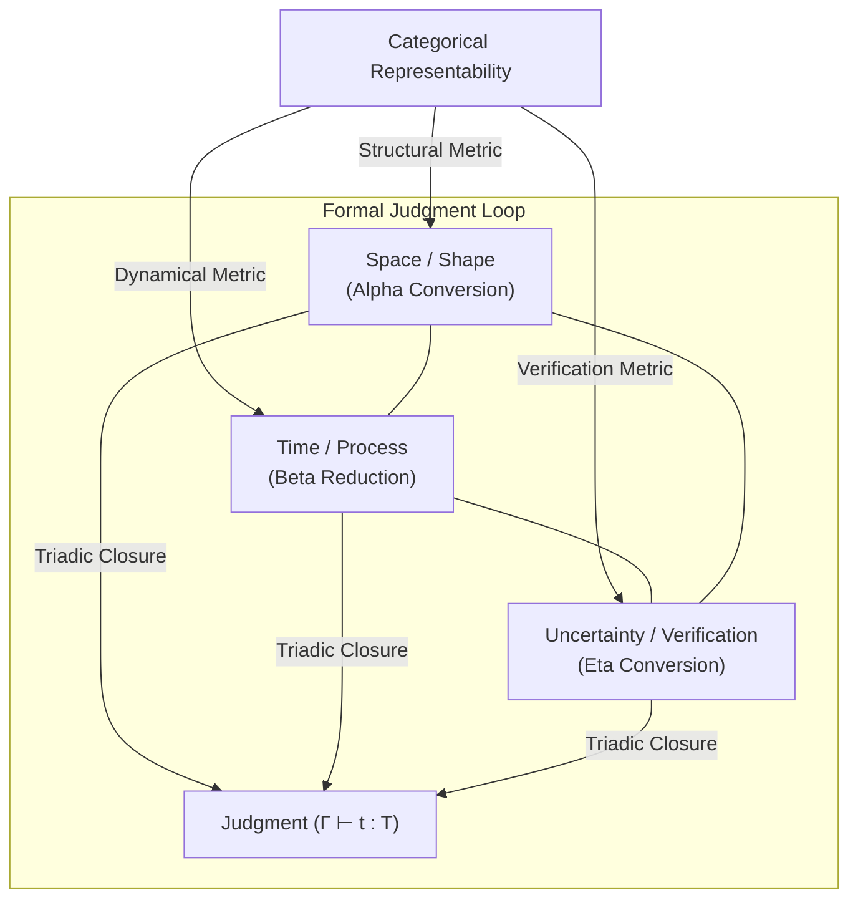

> **Core Thesis**: The three rules of Alonzo Church's [[Hub/Theory/Sciences/Computer Science/Programming Model/Lambda Calculus|Lambda Calculus]] ($\alpha$-conversion, $\beta$-reduction, and $\eta$-conversion) are not a historical accident, but a structural necessity. When mapped to the category-theoretic framework of [[Hub/Theory/Sciences/Representability|Representability]] and the type-driven design principle of [[Hub/Theory/Category Theory/Logic/Glossary/Make illegal states unrepresentable|Make illegal states unrepresentable]], they represent the three foundational resource metrics of any representable system: **Space** (coordinate-free Shape), **Time** (dynamic Process), and **Uncertainty** (extensional Verification). Among these, **Uncertainty** operates as a bounded, normalized measurement that provides the topological closure required to eliminate invalid configurations and terminate a formal [[Literature/PKM/Judgment|Judgment]].

---

## Part I: The Spacetime Headset and the Limits of Expression

In his *Interface Theory of Perception*, Donald Hoffman mathematically demonstrates that sensory systems are shaped to prioritize evolutionary fitness over veridical truth. Spacetime and physical objects are not the fundamental substrate of reality; they are a species-specific "desktop interface" designed to hide the underlying complexity of a vast network of interacting conscious agents.

At the Planck scale ($10^{-33}\text{ cm}$ and $10^{-43}\text{ s}$), spacetime breaks down. As explored in [[Hub/Theory/Category Theory/Logic/Glossary/Why Three|Why Three? The Structural Necessity of Reality]], we must step outside the spacetime manifold to find the fundamental mathematical structures of computation and representability.

When we model the resources available to an observer (whether a biological consciousness or a formal compiler) operating outside spacetime, we find precisely **three resource metrics**:

1. **Space**: The metric of structure, layout, and potential (Shape).
2. **Time**: The metric of process, evolution, and transaction (Process).
3. **Uncertainty**: The metric of informational entropy, boundary, and closure (Verification).

These three metrics map directly to the three primitive elements and the three reduction rules of the Lambda Calculus, demonstrating that computation is the physics of representability.

*Diagram: The triadic resource metrics of representability forming a closed loop of formal judgment.*

---

## Part II: The Three Rules and the Algebra of Representability

The Lambda Calculus is composed of three syntax categories (Variables, Abstraction, Application) and three conversion rules ($\alpha$, $\beta$, $\eta$). Under the principle of **[[Hub/Theory/Category Theory/Logic/Glossary/Make illegal states unrepresentable|Making Illegal States Unrepresentable (MISU)]]**, these rules represent the minimal vocabulary to encode valid domain states while preventing invalid configurations from being expressed.

### 1. Space $\leftrightarrow$ $\alpha$-Conversion (Renaming and Shape Symmetry)

Alpha conversion ($\alpha$-equivalence) states that the names of bound variables are irrelevant: $(\lambda x. x) \equiv (\lambda y. y)$.

* **The Space Metric**: In spatial geometry, absolute coordinates are arbitrary; only relative distance and topological connectivity matter. Alpha conversion establishes the **Spatial Metric** of representability. It quotients terms under bound variable renaming, ensuring that shape representability is coordinate-free. It defines the variable scope and layout (the "where" of bindings).
* **MISU and logical alignment**: It corresponds to the **Type $T$** (the Abstract Specification or the $A$-layer of the [[Hub/Theory/CLM/Foundations/Cubical Logic Model|CLM]] and the [[Hub/Theory/MVP/MCard/MCard|MCard]]). It defines the invariant space of valid shapes before any action is taken.

### 2. Time $\leftrightarrow$ $\beta$-Reduction (Application and Dynamical Process)

Beta reduction is the process of applying a function to an argument by substituting occurrences of the bound variable: $(\lambda x. M) N \to M[x := N]$.

* **The Time Metric**: Substitution is a state change. It has a direction (reduction towards normal form) and takes place over sequential steps. It represents the **Time Metric** of representability (the "when" of execution), computing the transport of structure.
* **MISU and logical alignment**: It corresponds to the **Term $t$** (the Concrete Implementation or the $C$-layer of the CLM and the [[Hub/Theory/MVP/PCard/PCard|PCard]]). It is the algorithm running, consuming resources, and progressing along a causal trajectory.

### 3. Uncertainty $\leftrightarrow$ $\eta$-Conversion (Extensionality and Bounded Witness)

Eta conversion captures extensionality: $(\lambda x. f\ x) \equiv f$ (provided $x$ is not free in $f$). It asserts that two processes are identical if they produce identical outputs for all inputs.

* **The Uncertainty Metric**: Eta conversion abstracts away the internal temporal steps ($\beta$-reductions) and spatial variations ($\alpha$-renaming). By the **[[Hub/Theory/Category Theory/Yoneda/Foundations/Yoneda Lemma|Yoneda Lemma]]**, an object is characterized entirely by its interactions: $X \cong Y \iff \text{Hom}(X, -) \cong \text{Hom}(Y, -)$. The $\eta$-rule enforces this extensional identity, verifying that the concrete term matches the abstract type from the outside. It represents the **Uncertainty Metric** of representability—the limit of what can be distinguished.
* **MISU and logical alignment**: It corresponds to the **Context/Turnstile $\Gamma \vdash$** (the Balanced Test or the $B$-layer of the CLM and the [[Hub/Theory/MVP/VCard/VCard|VCard]]). It acts as the turnstile witness that verifies that the execution matches the specification, narrowing the representational value space to exactly the valid states and making illegal states unrepresentable.
* **Perceptual Integration**: Within our cognitive systems, this Uncertainty resolution is realized as **[[Hub/Theory/Sciences/Computer Science/Digital Synesthesia|Digital Synesthesia]]**. Instead of forcing an observer to parse abstract mathematical bounds directly, Digital Synesthesia projects the system's **[[Hub/Theory/Integration/Software-Lagrangian|Software Lagrangian]]** ($L_{\text{software}} = S_T - H_T$) into felt sensory signals. High informational entropy ($H_T$) is experienced as haptic roughness or visual noise, while high structure ($S_T$) manifests as acoustic harmony or geometric resonance—rendering the Turnstile's verification state immediately legible.

---

## Part III: Bounded Uncertainty and the Logic of Closure

An open-ended traversal of Space and Time can iterate indefinitely, leading to infinite regress or uncomputable paths (e.g., the halting problem). To make a definitive **[[Literature/PKM/Judgment|Judgment]]**, a system must achieve **closure**.

A formal judgment is represented in type theory as:

$$
\Gamma \vdash t : T
$$

Which states that in context $\Gamma$ (the history of observations), the evidence $t$ (the term) satisfies the specification $T$ (the type). The question is: *How is this judgment terminated?*

### Bounded and Normalized Uncertainty

Uncertainty ($U$) acts as a bounded, normalized metric:

$$
U \in [0, 1]
$$

* $U = 1$: Maximum entropy, zero information (the Bottom state $\bot$ or the Empty Schema).
* $U = 0$: Absolute certainty, a resolved equivalence.

The $\eta$-rule provides the mathematical mechanism for this closure. By establishing that $(\lambda x. f\ x) = f$, it collapses the infinite potential evaluations of $f$ in time and space into an extensional, static identity. It stops the infinite loop of "testing the function for one more input." It bounds the uncertainty of functional behavior, allowing the observer to declare the judgment complete and proving that the program cannot transition into illegal states.

### Morphogenetic Homeostasis in TAME

This logical termination has a profound biosemiotic analog in developmental biology, specifically under Michael Levin's **[[Hub/Theory/Sciences/Biology/TAME|TAME]] (Technological Approach to Mind Everywhere)**.

When a collective of cells undergoes morphogenesis (e.g., regenerating a planarian's head or a tadpole's scrambled face), the network operates as a computing swarm. The cells do not contain a rigid physical blueprint; instead, they navigate a bioelectric field ($V_{mem}$) containing **attractor memories** that represent the target shape.

- The **Target Morphology** defines the coordinate-free spatial structure, behaving like the **Space ($\alpha$-equivalence)** type constraint.
- The **Morphogenetic Restructuring** (cell division, migration, and growth) is the execution path over time, behaving like the **Time ($\beta$-reduction)** term application.
- The **Homeostatic Halt** is the **Uncertainty ($\eta$-conversion)** witness. The collective constantly measures the bioelectric deviation (epistemic uncertainty $U$) between the current physical shape and the target memory. The moment this error is driven to zero ($U \to 0$), the collective halts morphogenesis, terminating the growth loop.

Without this Uncertainty-resolving closure, cellular growth would continue unboundedly, collapsing the tissue into a cancerous, uncoordinated state. Bounded uncertainty is therefore the biological referee that completes the somatic judgment, stabilizing the organism as a closed, homeostatic boundary.

*Diagram: The progression of U from maximum entropy to normalized closure.*

---

## Part IV: The Geometry of Judgment and the 3D Witness

In Cartesian [[Hub/Theory/Category Theory/Type Theory/Homotopy & Cubical/Cubical Type Theory|Cubical Type Theory (CTT)]], we see the geometric necessity of three dimensions to compute path-equivalence without losing canonicity.

1. **Dimension $i$ (Space/Time Path)**: Represents the transformation from $0 \to 1$. This is the 1D path of execution—the computation running in space-time.
2. **Dimension $j$ (The Witness / Balanced Axis)**: The independent interval ($j \in \mathbb{I}$) that sweeps orthogonally across the $i$ traversal to form a 2D square.
3. **The 3D Cube**: The volume required to run a [[Hub/Theory/Category Theory/Type Theory/Homotopy & Cubical/Recursive Kan Filling Algorithm|recursive Kan filling algorithm]].

Without the independent witness dimension $j$, the observer cannot simultaneously relate to the starting assertion ($A$) and the ending implementation ($C$). This is the cognitive parallel of the **Observer's Standpoint**: to construct a causal relation between two events on a 2D plane, the observer must occupy a third dimension, triangulating the events to project a relation.

By using the third dimension (Uncertainty / Witness), the system achieves **Triadic Closure**. Instead of relying on an external referee (which triggers an infinite regress of judges judging judges), the three axes act as mutual validators:

* **Space** ($\alpha$) bounds the domain of **Time** ($\beta$).
* **Time** ($\beta$) generates the evidence for **Uncertainty** ($\eta$).
* **Uncertainty** ($\eta$) normalizes and certifies the structural identity of **Space** ($\alpha$).

This mutual judgment loop forms a self-sufficient, stable boundary. Once the proof is completed, the system undergoes a phase transition—collagons from a dynamic network-waiting state ([[Mealy Machine]]) into a static, terminal truth ([[Moore Machine]]) at a [[Hub/Theory/Category Theory/Type Theory/Constructs/Free Termination State|Free Termination State]]. The judgment is signed, and a content-addressed record (the VCard) is permanently instantiated.

This structural collapse is exactly how **[[Hub/Theory/Sciences/Computer Science/Digital Synesthesia|Digital Synesthesia]]** accelerates human-agent collaboration in an **[[Hub/Theory/Sciences/Computer Science/Programming Model/Agentic Workflow|Agentic Workflow]]**. By translating the complex math of Kan-filling and type-equivalence into multi-modal cues, the system allows the human supervisor to interact directly with the boundary of correctness. The observer can "feel" the moment of Free Termination when the visual or auditory noise resolves to a harmonic fixed point, making eventual correctness a lived perceptual experience rather than an abstract proof checker.

---

## Part V: Comparison of the Triadic Universes

The triadic mapping persists across physical, computational, and cognitive layers:

| Resource Metric       | Lambda Calculus Rule                 | CLM Axis / Type Theory                  | MVP Card Type                | CTT Geometry                 | Hoffman's Agent Network            |
| :-------------------- | :----------------------------------- | :-------------------------------------- | :--------------------------- | :--------------------------- | :--------------------------------- |
| **Space**       | $\alpha$-conversion (Renaming)     | $A$ (Abstract Spec) / $\Sigma$-type | [[Hub/Theory/MVP/MCard/MCard | MCard]] (Data Plane)         | Variables / Boundaries             |
| **Time**        | $\beta$-reduction (Substitution)   | $C$ (Concrete Impl) / $\Pi$-type    | [[Hub/Theory/MVP/PCard/PCard | PCard]] (Control Plane)      | Traversal ($i \in [0,1]$)        |
| **Uncertainty** | $\eta$-conversion (Extensionality) | $B$ (Balanced Expectation) / Id-type  | [[Hub/Theory/MVP/VCard/VCard | VCard]] (Verification Plane) | Kan-filling ($j \in \mathbb{I}$) |

### Operationalizing the Representability Triad in CLM and MVP

This structural isomorphism is the core design philosophy animating the [[Hub/Theory/CLM/Foundations/Cubical Logic Model|Cubical Logic Model (CLM)]] and the [[Hub/Theory/MVP/Foundations/MVP Cards Design Rationale|MVP Cards Design Rationale]]:

1. **Space / MCard**: Space defines the coordinate-free shape of identity. The [[Hub/Theory/MVP/MCard/MCard|MCard]] encapsulates data and state without specifying dynamic behavior. $\alpha$-conversion guarantees that names are local and arbitrary, reflecting the coordinate-free storage namespace (Content Addressable Scheme).
2. **Time / PCard**: Time is the sequential transition of states. The [[Hub/Theory/MVP/PCard/PCard|PCard]] represents execution code and processes. $\beta$-reduction is the physical substitution step of function evaluation over time.
3. **Uncertainty / VCard**: Uncertainty is the distance between execution and specification. The [[Hub/Theory/MVP/VCard/VCard|VCard]] acts as the boundary or "turnstile" ($\vdash$) that asserts extensional correctness. $\eta$-conversion enables extensionality, collapsing temporal executions into a static equivalence ($U \to 0$), verifying that the PCard has successfully bound the state transition to the MCard and ensuring invalid execution states remain unrepresentable.

---

## Part VI: Combinatorial Species and Syntax Symmetries

A deeper category-theoretic foundation for this triadic isomorphism is found in André Joyal's theory of **[[Permanent/Concepts/Combinatorial Species|Combinatorial Species]]** (functors $F: \mathbf{Bij} \to \mathbf{Set}$). The syntax trees and reduction steps of the Lambda Calculus represent operations on the species of lambda terms, mapping precisely to the resource metrics of representables:

1. **Space / $\alpha$-equivalence $\leftrightarrow$ Symmetric Group Symmetries ($\times_{S_n}$)**:
   In Combinatorial Species, structures are quotiented by the action of the symmetric group $S_n$ to define unlabeled species (isomorphism classes). This symmetry quotient ($\times_{S_n}$) states that relabeling elements preserves structural shape. This is exactly **$\alpha$-equivalence**, which quotients lambda terms under bound variable renaming. It strips away coordinate-specific labels, yielding the pure coordinate-free spatial layout of the syntax.
2. **Time / $\beta$-reduction $\leftrightarrow$ Species Derivatives ($F'$) and Substitution**:
   The derivative of a species $F'[U] = F[U \sqcup \{*\}]$ represents placing an $F$-structure on a set with a distinguished, active parameter (pointing or rooting a variable). In the Lambda Calculus, $\beta$-reduction $(\lambda x. M) N \to M[x := N]$ evaluates the term by substituting the argument into the pointed variable $x$. This matches the dynamic, step-based state transition in Time.
3. **Uncertainty / $\eta$-conversion $\leftrightarrow$ Cycle Index Series ($Z_F$) and Extensionality**:
   The Cycle Index Series $Z_F$ serves as the algebraic invariant that verifies structural identity up to symmetry. $\eta$-conversion $(\lambda x. f\ x) \equiv f$ asserts extensionality: two programs are identical if they produce identical outputs for all inputs. In species theory, this is the extensional isomorphism of functors. The VCard turnstile verifier uses this invariant to collapse dynamic execution variants into a static equivalence ($U \to 0$), resolving uncertainty to achieve formal judgment closure and verifying that no invalid states are representable.

---

## Conclusion: All We Need is Three

Reducing the universe of representations to exactly three complete primitives (Space, Time, and Uncertainty) is the key to [[Hub/Tech/Intelligence as information compression|Intelligence as Information Compression]]. A bloated schema with more than three rules introduces redundant dimensions, lowering the signal-to-noise ratio and making self-reflection computationally expensive.

By employing the minimal complete alphabet of three, representable systems achieve a high-density representation that guarantees predictable termination and recursive self-awareness. The three rules of Lambda Calculus are the mathematical bones of this minimal interface—allowing a finite agent to hold a stable, verifiably correct image of an infinite reality.

---

## See Also

* [[Hub/Theory/Sciences/Representability|Representability: The Mathematical Limits of Expression]]
* [[Hub/Theory/Category Theory/Logic/Glossary/Make illegal states unrepresentable|Make Illegal States Unrepresentable: Type-Driven Design for Correctness]]
* [[Hub/Theory/Category Theory/Logic/Glossary/Why Three|Why Three? The Structural Necessity of Reality]]
* [[Hub/Theory/Sciences/Computer Science/Programming Model/Lambda Calculus|Lambda Calculus]]
* [[Literature/PKM/Judgment|Judgment: a statement made about some 'other' thing]]
* [[Literature/Reading notes/@Hoffman_Consciousness_Beyond_Spacetime|Donald Hoffman - Consciousness Beyond Spacetime]]
* [[Hub/Theory/Sciences/Uncertainty|Uncertainty — Probability, Information, and Decision Risk]]
* [[Hub/Theory/Sciences/Spatial Complexity|Spatial Complexity — Geometry, Topology, and Opportunity]]
* [[Hub/Theory/Sciences/Temporal Complexity|Temporal Complexity — Dynamics, Timescales, and Effort]]
* [[Hub/Theory/Category Theory/Type Theory/Homotopy & Cubical/Cubical Type Theory|Cubical Type Theory]]
* [[Hub/Theory/CLM/Foundations/Cubical Logic Model|Cubical Logic Model]]
* [[Hub/Theory/MVP/Foundations/MVP Cards Design Rationale|MVP Cards Design Rationale]]
* [[Permanent/Concepts/Combinatorial Species|Combinatorial Species]]
