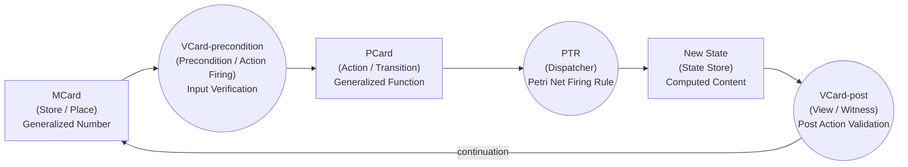

# MVP Cards Design Rationale

> **Core Thesis**: The MVP Cards architecture is a triadic formal system ([[MCard]], [[PCard]], [[VCard]]) designed to operationalize **universal representability**. By treating configuration and policy as content-addressed data arrows rather than rigid database schemas, it enables **sovereign, scale-free knowledge networks** that govern themselves through polynomial functors and cryptography rather than centralized administrative control.

This architecture builds on the foundational Cartesian synthesis of Truth and Computing:

| Concept | Equation / Representation | Epistemological Meaning | Software Equivalent | MVP Cards Component |
| :--- | :--- | :--- | :--- | :--- |
| **Magnitude** | $\|z\|$ | The raw data, the immutable fact (Truth) | Data Structures | **MCard** |
| **Direction** | $e^{i\theta}$ | The logic, the generative process (Computing) | Algorithms | **PCard** |
| **Vector** | $z = \|z\| \cdot e^{i\theta}$ | The structured insight, the verifiable claim | Program | **Trace / History** |

This embodies Niklaus Wirth's famous formulation:
$$ \text{Programs} = \text{Algorithms} + \text{Data Structures} $$
In the MVP Cards ecosystem, this translates to:
$$ \text{Knowledge Container} = \text{PCard (Logic)} + \text{MCard (Data)} $$
with **VCard** acting as the sovereign boundary (the boundary of the "Self").

## Introduction: The "One Object" Mandate for Functional Economics

As computing transitions from passive information retrieval to the generative **AI Factory** paradigm, legacy architecture built on ontological sprawl (Git repos, Dockerfiles, Kubernetes manifests, dispersed Postgres schemas) fails to accurately value or track generated intelligence.

To support this new era of **[[Permanent/Projects/PKC Kernel/Functional Economics|Functional Economics]]**—where computational tokens are no longer static integers but computable **Named Functions**—the MVP Cards framework collapses this complexity by enforcing a **"One Object" Mandate**. Every entity in the semantic assembly line, whether it is the geometric raw data, the executing logic, or the verification boundary, is structurally represented as a variation of a single primitive: the **Card**.

### From HyperCard to the Typed Card Triad

The Card abstraction is directly inspired by Apple's revolutionary **[[HyperCard]]** (1987–2004), which demonstrated that **cards + links = knowledge navigation**. HyperCard proved that a single visual primitive—the "card"—could democratize programming, making it "Easy, Fun, and Interesting" for non-technical users to author interactive knowledge systems.

MVP Cards inherits this insight and extends it with mathematical rigor. Where HyperCard offered a single, untyped card in a stack, we explicitly derive **three typed specializations** corresponding to the three **primitive types** of **[[Hub/Theory/Category Theory/Type Theory/Homotopy & Cubical/Cubical Type Theory|Cubical Type Theory]]**. Because every logical assertion must be associated with a Type, the number of primitive types directly establishes the initial vocabulary of the system. These three primitives — and only these three — cover the complete computational lifecycle:

1.  **[[MCard|MCard (Monadic Card)]]** — the **root type / $\Sigma$-type (Dependent Sum)**. Named after [[Hub/Theory/Philosophy/Monadology/Monadology|Leibniz's Monad]] and formalized via [[Literature/People/Philip Wadler|Wadler]]'s functional monads, MCard is the irreducible, content-addressed, windowless unit of data acting as an existential witness within Dependent Nominal Type Theory ($\lambda\Pi_N$). Every other card is ultimately stored *as* an MCard (the [[Hub/Theory/Architecture/The Kenosis Principle|Empty Schema Principle]]).
2.  **[[PCard|PCard (Polynomial Functor Card)]]** — the **computation type / $\Pi$-type (Dependent Product)**. PCard encodes transformations as [[Polynomial functor|polynomial functors]] over MCard references. Crucially, PCards function as the **Monadic Executor**: they handle dynamic control flow and dependent sequencing by explicitly implementing Reader, State, and Writer monadic patterns. This structures knowledge processing and state transitions into composable, purely functional Kleisli arrows without mutating underlying data.
3.  **[[VCard|VCard (Verification/Validation Card)]]** — the **pre/post boundary type / Id-type (Identity Type)**. VCard operates as the paired mathematical path or proof object ($V_{pre} \xrightarrow{PCard} V_{post}$) that gates every state transition. It validates preconditions *before* execution and verifies postconditions *after*, sealing each transition with a cryptographic execution trace (BHK interpretation). VCard is the sovereign boundary—the I/O gatekeeper that separates the exposed world from the protected world.

This typed triad transforms HyperCard's democratic accessibility into a formally verifiable, cryptographically sovereign knowledge network that scales from personal notebooks to national infrastructure.

### Three-Property Intersection

This unified primitive achieves the intersection of three typically distinct concerns, each realized by a concrete architectural component:

1.  **(P) Personal / Project / Public — [[PTR|Polynomial Type Runtime]]**: The "P" dimension simultaneously names the *scope of governance*—whether the knowledge container serves a single **P**erson, a bounded **P**roject team, or an open **P**ublic commons—and its *execution engine*, the **[[PTR|PTR (Polynomial Type Runtime)]]**. PTR evaluates PCard polynomial functors over MCard references, gated by VCard authorization, turning CLM declarations into observable state transitions at every governance scale. Crucially, in a Functional Economy, execution at this layer is rigidly and constantly metered by **[[Hub/Philosophy/Ontology/Authorized Cognitive Capacity|Authorized Cognitive Capacity (ACC)]]**, which acts as the physical thermodynamic governor immediately cutting off infinitely looping epistemic hallucinations.
2.  **(K) Kenotic Meta-Language — [[Cubical Logic Model|Cubical Logic Model (CLM)]]**: The "K" dimension is **Knowledge** expressed through a **Kenotic** meta-language. The [[Cubical Logic Model]] empties itself of all domain-specific assumptions ([[Hub/Theory/Architecture/The Kenosis Principle|Kenosis]]) to become a universal specification surface, encoding Abstract Specifications ($A$), Concrete Implementations ($C$), and Balanced Expectations ($B$) as a single YAML-addressable structure. By being domain-neutral, CLM can represent *any* knowledge domain without schema drift.
3.  **(C) Containment — [[MCard|Monadic Card Collection]]**: The "C" dimension is **Containment**: all content is placed into a **[[MCard|Monadic Card (MCard) Collection]]**—an immutable, hash-indexed Merkle-DAG that can be deployed as the **contextually grounded Single Source of Truth**. By decomposing raw domains into predictable topologies, it serves as the permanent historical archive of extracted **[[Hub/Tech/Epiplexity|Epiplexity]]** ($S_T$). Each MCard is the irreducible, windowless Monad of sovereign truth ([[Hub/Theory/Philosophy/Monadology/Monadology|Monadology]]); the Collection forms the cryptographic boundary wall that makes data sovereignty possible.

By unifying PTR (execution at Personal/Project/Public scale), CLM (Kenotic specification), and MCard Collection (contained persistence) under a single mathematical structure (the [[MVP Cards — Mathematical Foundations|SMC of Cards]]), we eliminate the impedance mismatch between "what the system knows," "what the system specifies," and "how the system runs."

### Single-Command Deployment

Because logic (PCards) and state (MCards) are structurally identical and composable via tensor products, deployment reduces to a simple mathematical operation: applying an evaluation functor.

From [[Permanent/Projects/PKC Kernel/PKC Kernel|PKC Kernel]]:
```bash
# Evaluate the whole cluster locally by simply evaluating the composition of the cards
clmEval <cubical_logic_model_file_name>.yaml
```

### Reading the Cluster

Just as Deployment is evaluation, **monitoring** is simply reading the state of the Category. You do not need specialized metrics dashboards or distributed tracing tools to understand the cluster; you just read the cards.

From [[Permanent/Projects/PKC Kernel/PKC Kernel|PKC Kernel]]:
```bash
# Read the current layout of the cluster
tree
```
Because the system is "fractal," running `tree` on a developer's laptop looks structurally identical to running `tree` on a global mesh network.

## Continuation on the Meta-Level

The deepest conceptual driver of the MVP Cards architecture is the desire to capture and formalize **how systems evolve**. In any interactive system—whether it’s a user talking to an LLM, a CI/CD pipeline building code, or an individual writing notes—there is always a "Before" state and an "After" state. 

The transition between these states is the **Continuation** (i.e., "what happens next"). In standard computing, continuations are ephemera—they happen inside the CPU and are lost. MVP Cards captures them as first-class, permanent residents of the knowledge base.

To understand this, see the core operation pattern defined in [[Operationalizing Type Theory - The VCard Sandwich as Thermodynamic Construction]]:

### The Triad of State Transitions

1. **Origin (Before)**: The system exists in State A.
2. **Arrow (The Guess/Continuation)**: An agent (human or AI) applies a heuristic or transformation (`f: A -> B`).
3. **Meta (After)**: The system lands in State B AND captures the `(A, f, B)` relationship.

Because MVP Cards operationalizes the **[[Double Operadic Theory of Systems]] (DOTS)** and the **[[Cubical Logic Model]] (CLM)**, it forces this "Origin -> Arrow -> Meta" transition to be explicitly recorded.

If we do not capture the Continuation, we have amnesia. We have the result, but we don't know *why* or *how* we arrived there. By making PCards (the logic arrows) run over MCards (the data origins) and sealing the result via VCards (the verification), we achieve **Causal Provenance**.

## Decomposed Architecture and Domain Deep Dives

To manage the complexity of the MVP Cards ecosystem, the detailed rationale has been decomposed into specific domain areas. Please consult the following satellite documents for deep dives:

*   **[[MVP Cards — Mathematical Foundations]]**: Details the Symmetric Monoidal Categories (SMC), Symmetry Keeping/Breaking, and Arrow-Grounded composition that guarantees scale-free interoperability.
*   **[[MVP Cards — Monadic Architecture and Wadler]]**: Explores the functional programming roots, categorical hierarchy (Monad/Functor/Applicative), Wadler's interpreter patterns, and the "Unifying God" structure of Pre-established Harmony.
*   **[[MVP Cards — Sovereignty and Zero Trust]]**: Defines the VCard Duality, the PEP/PDP ZTA alignment, Hash Namespaces, and how VCard acts as the absolute sovereign I/O gatekeeper.
*   **[[MVP Cards — Operational Deployment and EOS]]**: Covers the Protocol as SSOT, Experimental-Operational Symmetry (EOS), archipelagic architectures, IT Del's validation, and competitive positioning.
*   **[[MVP Cards — AGI Safety and Harness Engineering]]**: Discusses Sovereign Serverless design, AGI output bounds ("Ghosts and Aliens"), Harness Engineering, and BMAD orchestration.
*   **[[MVP Cards — Actionability and Biological Foundations]]**: Contextualizes the architecture within Michael Levin's Actionability Framework, Federico Faggin's Spacetime Memory, and Digital Synesthesia.
*   **[[Hub/Theory/Integration/CLM and MVP Cards as Kernel Operator - Engineering the Demon|CLM and MVP Cards as Kernel Operator: Engineering the Demon]]**: Demonstrates how the Card triad realizes the Demon-Kernel isomorphism — MCard as input state, PCard as classification operator, VCard as verified rank — with Baldwin Operators.

## Summary

The MVP Cards architecture introduces a formal system grounded in **[[Hub/Theory/Category Theory/Type Theory/Homotopy & Cubical/Cubical Type Theory|Cubical Type Theory]]**, where **every logical assertion is associated with a Type**. The three card types instantiate exactly the three CTT primitive types ($\Sigma$, $\Pi$, Id), establishing the **initial vocabulary** of the computational ecosystem. This is the minimal yet complete set: fewer types lose expressiveness; more types introduce redundancy. The triadic framework implements mathematical structures based on polynomial functors, content-addressable storage, and monadic design principles.

This card triad represents the operational implementation of the three foundational metrics of representables (Space, Time, and Uncertainty) and the three conversion rules of Alonzo Church's Lambda Calculus ($\alpha$-equivalence, $\beta$-reduction, and $\eta$-conversion) as analyzed in [[Hub/Theory/Sciences/Computer Science/Programming Model/Lambda Calculus and the Three Foundational Metrics of Representables|Lambda Calculus and the Three Foundational Metrics of Representables]]:

- **MCard (Space / $\alpha$-conversion)**: Encapsulates static, coordinate-free structures (Noun Phrases) and identity.
- **PCard (Time / $\beta$-reduction)**: Executes dynamic computational state transitions (Verb Phrases) over sequential execution steps.
- **VCard (Uncertainty / $\eta$-conversion)**: Bounds computational variance (Sentences), driving epistemic uncertainty to zero ($U \to 0$) to establish extensional correctness and complete a formal Judgment.

### Categorical Hierarchy & MLTT Isomorphism

$$\boxed{\text{MCard}:\text{Exact State } (+) \quad \text{PCard}:\text{Mealy Command } (\times) \quad \text{VCard}:\text{Moore Assessment } (=)}$$

| Card | Type Theory (MLTT) | Representability Isomorphism | Execution Role & Synthesis Mapping | DOTS Module Packaging |
|------|--------------------|------------------------------|------------------------------------|-----------------------|
| **[[MCard]] (Data Plane)** | **$\Sigma$-type** (Dependent Sum) | **Space** ($\alpha$-conversion) | **Carrier / Exact Truth**. Wraps pure existential data. In system arithmetic, operates as **Addition** ($+$). Functionally the root data state. | **[[Hub/Theory/Sciences/Computer Science/Moore Machine\|Moore Machine]]** (Static Module / Number). Output depends on state only: $O = \lambda(s)$. Composes via **lens** ([[Tight]]). |
| **[[PCard]] (Control Plane)** | **$\Pi$-type** (Dependent Product) | **Time** ($\beta$-reduction) | **Loose Morphism / Mealy Behavior**. Acts as the dynamic **Hoare Command ($C$)** driving execution across state. In system arithmetic, it is **Multiplication** ($\times$), evaluating polynomial variants and **Widening** heuristic bounds. | **[[Hub/Theory/Sciences/Computer Science/Mealy Machine\|Mealy Machine]]** (Dynamic Module / Function). Output depends on state AND input: $O = \lambda(s, i)$. Composes via **chart** ([[Loose]]). |
| **[[VCard]] (App Plane)** | **Id-type** (Identity Type) | **Uncertainty** ($\eta$-conversion) | **Tight Morphism / Moore Interface**. Operates as the **Hoare Pre/Post Correctness Assessment ($\{P\}, \{Q\}$)**. Seals the execution via **Equality** ($=$), **Narrowing** the variant process back to invariant exact state. | **Square** (2-cell). Certifies that Mealy execution $\text{PCard}(\text{MCard})$ produced Moore result $\text{MCard}'$. |

### The Linguistic Typology: Cards as Typed Complementary Pairs

The Card triad maps precisely onto the [[Hub/Theory/Category Theory/Unit and Counit|Unit/Counit]] duality that governs all compositional systems — including [[Hub/Theory/Sciences/Computer Science/Programming Model/Conversational programming|Conversational Programming]] and [[Hub/Theory/Sciences/Computer Science/Petri Net|Petri Net]] execution:

| Card | Linguistic Role | Automaton | [[Unit and Counit]] ($\eta$/$\varepsilon$)| DOTS Direction | PTR Phase |
| :--- | :--- | :--- | :--- | :--- | :--- |
| **MCard** | **Noun Phrase** — self-contained, static description | **Moore** — output from state alone | **Unit ($\eta$)** — embed entity into representation | **Tight** | `prep` / `get` |
| **PCard** | **Verb Phrase** — dynamic action requiring input | **Mealy** — output from state + input | **Counit ($\varepsilon$)** — evaluate action on entity | **Loose** | `exec` / `put` |
| **VCard** | **Sentence** (NP + VP) — complete verified assertion | **[[Hub/Operations/TempExposure/Journal Format/Lens-like Automata\|Lens]]** (`get` + `put`) | **Triangle identity** — $\varepsilon \circ L(\eta) = \text{id}$ | **Action** | `post` (PutGet law) |
| **PCard stored as MCard** | **Gerund** — verb frozen into noun | **Curried function** $B^A$ | $\eta$ applied to a $\varepsilon$ | **Tight** view of Lens | PCard spec awaiting input |

The **PCard stored as MCard** row captures the [[Hub/Theory/Architecture/The Kenosis Principle|Empty Schema Principle]]: a PCard (Verb Phrase / $\varepsilon$) is *stored* as an MCard (Noun Phrase / $\eta$), making it a **gerund** — a process named and deployed as data. The Petri Net precondition function $\text{pre}' : E \to \mathbb{N}[P]$ is exactly this currying: an action specification frozen into a [[Hub/Theory/MVP/Foundations/Generalized Numbers|Generalized Number]].

This typed distinction is **architecturally mandatory**: without separating $\eta$ (reading/describing state) from $\varepsilon$ (modifying/executing on state), the system cannot verify the [[Hub/Theory/Functions/Concepts/The Currying Adjunction - Values as Degenerate Moore, Functions as Degenerate Mealy|triangle identities]] — and the `prep → exec → post` lifecycle loses its coherence guarantee.

### Conversational Programming: The Card Triad in Action

In [[Hub/Theory/Sciences/Computer Science/Programming Model/Conversational programming|Conversational Programming]], every conversational turn is a **[[Hub/Theory/Sciences/Computer Science/Petri Net|Petri Net]] transition firing** that instantiates the Card triad:

1. **User poses a question** → the context is loaded as **MCards** (Noun Phrases / $\eta$ / `prep`)
2. **Agent generates a response** → the **PCard** fires as a Mealy transition (Verb Phrase / $\varepsilon$ / `exec`)
3. **System verifies and commits** → the **VCard** witnesses the triangle identity (Sentence / `post`)
4. **Result re-enters the Carrier** → the output becomes a new **MCard** ($\eta$ — new Noun Phrase)

The conversation converges to a [[Hub/Theory/CLM/PTR/PTR as Fixed Point Engine|fixed point]] when further turns produce no state change ($F(M) = M$) — this is [[Hub/Operations/結算|結算 (Settlement)]].

The [[Hub/Theory/Integration/DOTS Vocabulary as Efficient Representation for ABC Curriculum|9-layer DOTS vocabulary]] structures this exchange, with each layer providing one type dependency in the complementary-pair hierarchy. This makes the MVP Cards architecture not just a data model but the **operational substrate for all agentic interaction**.

### MCard-Based Tokenization and Token Computation in PTR

Under this conversational paradigm, treating all tokens strictly as **[[../MCard/MCard|MCards]]** (immutable, content-addressed Generalized Numbers) rather than transient payloads forms the bedrock of the **[[../../CLM/PTR/PTR|Polynomial Type Runtime (PTR)]]**. This token-level MCardization delivers critical formal guarantees to the runtime environment:

1. **Mathematical Closure under Composition**:
   Since Petri Net markings and firing inputs are MCards, and Mealy PCard evaluations output new MCards, the runtime is algebraically closed. This guarantees that all token computations preserve referential transparency. Because the state space accumulates monotonically as a bitemporal G-Set CRDT, the entire execution history is represented as a Merkle-DAG. This enables conflict-free replication across distributed nodes and guarantees deterministic re-runnability for debugging and validation.
2. **Interactive Time-Travel and Branching**:
   By exposing the token-state directly as a sequence of immutable MCards, human operators can inspect the precise algebraic markings at any past step. If a generated approximation diverges, the operator can safely "time-travel" to a previous step, fork the Petri Net transition, and try a different path of abstract domains (e.g. by applying a different widening or narrowing policy) without polluting the main state or side-effecting other processes.
3. **VCard-Sandwiched Metric Enforcement**:
   Every token computation is wrapped in a **VCard Sandwich** ($V_{\text{pre}} \xrightarrow{PCard} V_{\text{post}}$). The VCard acts as the type witness of the state transition, measuring the thermodynamic approximation bounds. If the error exceeds the PAC bounds $(\epsilon, \delta)$ or if the Software Lagrangian ($L_{\text{software}} = S_T - H_T$) indicates divergence, the PTR halts transition firing. This immediately alerts the human operator, providing precise, localized algebraic feedback and enforcing that bad states are structurally unrepresentable in the token namespace.

### Function-Number Duality, Bidirectional Lenses, and the Operadic Calculus

The structural equivalence between **PCards stored as MCards** invokes a profound mathematical identity: the **[[Hub/Theory/Functions/Foundations/Function-Number Duality - The Foundational Isomorphism of Computation|Function-Number Duality]]**.

In combinatorial state spaces like the **[[Hub/Theory/Sciences/Computer Science/Programming Model/Game of Go|Game of Go]]** or the **[[Hub/Theory/Category Theory/Operator Theory/Rubik Cube|Rubik's Cube]]**, this duality relies on physical tangibility. The static spatial boundary (the $19 \times 19$ board, or the interlocking plastic axes) acts rigidly as the **Number**—bound by space and devoid of computation. The **Functions** are the mathematical operators—the allowable moves and quarter-turns that restructure the board via Baldwin's mechanics. `MCard_TDD` physically constructs this exact duality: the persistent OS and SQLite database form the structural "board" (Number), and the PCards executed by the PTR form the "moves" (Functions) safely navigating that geometry (See: **[[Hub/Theory/MVP/MCard/MCard_TDD Architecture - Function-Number Duality Diagram|MCard_TDD Architecture - Function-Number Duality Diagram]]**).

Because of the **[[The Currying Adjunction - Values as Degenerate Moore, Functions as Degenerate Mealy|Currying Adjunction]]**, all **functions** (dynamic PCards / Mealy logic) can be fully curried and frozen into static, irreducible **Numbers** (immutable MCards / digital files). Conversely, any digital file or **Number** can be interpreted backwards as the evaluated closure of a specific function:

$$\text{Hom}(S \times A, B) \cong \text{Hom}(S, B^A)$$

This isomorphism is not merely algebraic convenience — it is a formal **Bidirectional Transformation Lens** (Johnson & Rosebrugh, 2016; Diskin, Xiong & Czarnecki, 2011). The two directions of the lens are:
- **Forward / "Get"** (uncurrying): A dormant MCard (Generalized Number, Moore machine) is unrolled into an active PCard execution trace (Mealy machine). Static data becomes dynamic logic.
- **Reverse / "Put"** (currying): An active PCard computation is frozen back into a hibernating MCard representation. Dynamic logic becomes static data.

This bidirectional lens simultaneously acts as a **Galois Connection** ($\alpha \dashv \gamma$) in the sense of Cousot's **[[Hub/Theory/Sciences/Computer Science/Abstract Interpretation|Calculational Design of Abstract Interpretation]]**. The concretization $\gamma$ unrolls the abstract representation into a richer concrete execution domain, while the abstraction $\alpha$ compresses it back. The methodology is *calculational*: we do not guess these translations — we derive them from the lattice structure of the type system.

Because both functions and files are **topologically identical tokens** (0-simplices / Generalized Numbers), they flow uniformly into **[[Hub/Theory/Integration/The Operadic Calculus of Thought|David Spivak's Operadic Calculus]]** via 1-simplex Hyperlinks. The Operadic Calculus wires them into composable OODA loops, refining their content through two categorical formalisms:

1. **Head Expansion (Reverse Execution):** From Robert Harper's Computational Type Theory (Harper, OPLSS 2018; *How to (Re)Invent Girard's Method*, 2021), the **Head Expansion Lemma** states: if $M' \mapsto M$ and $M : A$, then $M' : A$. This *closure under reverse execution* means that the typing identity flows backward against the arrow of computation. Categorically, Head Expansion maps to the **Right Kan Extension** ($\text{Ran}$) — pulling the behavioral specification tightly backward across the entire execution trace.
2. **Kan Extensions as Bidirectional Engine:** As tokens move across operadic transitions, they undergo calculational refinement via the adjunction $\text{Lan}_K \dashv K^* \dashv \text{Ran}_K$ (Mac Lane, *Categories for the Working Mathematician*, 1971, Ch. X §7: "All concepts are Kan extensions").

| Kan Extension | Fixed Point | Cousot | Harper CTT | Freedman Compression |
|:---|:---|:---|:---|:---|
| **Left Kan** ($\text{Lan}$) | Least ($\mu$) | Widening ($<br/>abla$) | Forward Execution ($\beta$-reduction) | **Expansion**: unspooling $H_T$ |
| **Right Kan** ($\text{Ran}$) | Greatest ($<br/>u$) | Narrowing ($\Delta$) | Head Expansion (reverse execution) | **Compression**: bounding $S_T$ |
| **Adjunction** ($\text{Lan} \dashv \text{Ran}$) | Confluence ($\mu = <br/>u$) | Sound convergence | Canonicity Theorem | **Intelligence boundary** |

The convergence is **calculational** in Cousot's precise sense: the system iterates the $<br/>abla / \Delta$ operators over the lattice of Atomic Thoughts until the fixed-point invariant is reached. The Galois Connection ($\alpha \dashv \gamma$) guarantees **soundness by construction**.

### The Flux Pattern: Universal Execution via Generalized Numbers

Because the Function-Number Duality makes PCards and MCards topologically identical tokens, a **single unidirectional dispatch pipeline** can handle all computation. This is exactly the **[[Hub/Tech/Flux, Least Action, and SSOT - A Unified Theory|Flux Pattern]]** — elevated from a frontend UI convention into a universal **Petri Net execution model**.


Diagram: The Flux-as-Petri-Net cycle. Every component is a Generalized Number flowing through the same unidirectional pipeline.

| Flux Component | MVP Cards | Petri Net | Why It Works |
|:---|:---|:---|:---|
| **Action** | PCard (Mealy machine) | Transition firing | A function frozen as a Generalized Number |
| **Dispatcher** | PTR (Polynomial Type Runtime) | Firing rule evaluation | Evaluates polynomial functors over MCard references |
| **Store** | MCard Collection (Merkle-DAG) | Place marking | Content-addressed SSOT |
| **View / Witness** | VCard | Post-condition check | Seals the transition with cryptographic proof |

**Continuation-Passing Style (CPS)**: Each Flux dispatch is a **continuation** — "what happens next." The PTR implements CPS by passing the result of each PCard evaluation as the input MCard for the next transition. The [[Hub/Theory/Functions/Concepts/Continuation Function and Domain Theory - The Unified Framework|Continuation Function]] chains these dispatches into the OODA loop. Each full cycle is a single step in the **[[Hub/Theory/CLM/PTR/PTR as Fixed Point Engine|Kleene iteration]]** that climbs the CLM's lattice of verification states from $\bot$ (unverified PCard) toward $\text{lfp}(F)$ (sealed VCard). The cycle terminates when $F^n(\bot) = F^{n+1}(\bot)$ — the fixed point where further computation produces no state change.

**Recursive VCard Boundaries**: Because a VCard's pre-condition check is *itself* a computation, and because all computations are PCards, and because all PCards are stored as MCards (gerunds), the VCard's boundary-checking programs are **themselves Flux-dispatched tokens**. The VCard pre/post conditions recursively adopt the Flux pattern:

$$\text{VCard}_{\text{pre}} = \mathcal{O}(\text{MCard}_{\text{context}}, \text{PCard}_{\text{check}}; \text{VCard}_{\text{pre-witness}})$$

The architecture is **fractal**: the same unidirectional pattern ($\text{MCard} \to \text{PCard} \to \text{PTR} \to \text{MCard}' \to \text{VCard}$) applies at every level of recursion — from a single assertion check up to a civilizational knowledge infrastructure.

#### Loop Engineering: Formalizing the Metacognitive Loop

This fractal execution pattern is the formal mathematical representation of **[[../../Sciences/Computer Science/Loop Engineering|Loop Engineering]]**—the design paradigm that replaces one-shot feed-forward prompt engineering with closed-loop, self-verifying agent systems. Under the CLM/PTR framework, an agentic loop is not an ad-hoc script wrapped around an LLM API; it is a structured, type-safe execution sequence.

The five core components of a loop engineering system map directly to the MVP Cards primitives:

1.  **State Management**: Handled by the **MCard Collection** (acting as a bitemporal G-Set CRDT), preserving state and causal history across turns while pruning transient, noisy conversational logs to prevent context window bloat.
2.  **Execution Runtime**: Deployed via the **PTR** acting as an "always-on" daemon, executing Mealy transition PCards inside isolated sandboxes.
3.  **Feedback Quality**: Returned as high-fidelity algebraic metrics (PAC bounds, Software Lagrangian, KL divergence) in the resulting VCard.
4.  **Verification Gates**: Formalized by the **VCard Sandwich** ($V_{\text{pre}} \xrightarrow{PCard} V_{\text{post}}$), which functions as a type-witness checking correctness.
5.  **Termination Conditions**: Determined by the **Kleene iteration** least fixed-point convergence ($\text{lfp}(F)$) or immediate thermodynamic bounds (ACC turn budget limits).

Depending on the verification bounds, Loop Engineering inside PTR unspools under two primary topologies:

*   **Deterministic Loops**: Used for objective validation tasks (e.g., bug-fixing via test runs, compiler targets). The loop behaves as **[[../../Sciences/Computer Science/Large Step Semantics|Large-Step Semantics]]** where the PTR continues firing transitions (unspooling small-step execution) until the tests pass (exit code `0`) and the system settles into a stable **Normal Form**.
*   **Non-Deterministic (Adversarial) Loops**: Used for subjective optimization tasks (e.g., UI design, slop detection). This topology runs as a builder-critic game. A builder model (PCard transition) generates an output MCard, and a separate critic model (VCard verifier) checks it against specific stylistic/quality constraints. The agents iterate, refining the output and updating their self-evolving skills until the verifier's score passes the threshold.

This operationalizes the **Metacognitive Loop** of the Cubical Logic Model: if the concrete output does not conform to the abstract invariant ($V_{\text{post}} \not\sqsupseteq \alpha(M')$), the PTR feeds the contradiction back into the environment as a type violation, triggering the next PCard iteration. Execution recursively refines the terms until the Curry-Howard isomorphism holds and a valid witness is generated.

### The Meta-Circular Evaluator: PTR as the Eval/Apply Closure

The Flux pipeline described above is not a novel invention — it is the rigorous, category-theoretic realization of the **[[Hub/Theory/Sciences/Computer Science/Programming Model/Metalinguistic Abstraction and the Meta-Evaluator|Meta-Circular Evaluator]]** from Abelson & Sussman's *[[Literature/Reading notes/@StructureInterpretationComputer1985|Structure and Interpretation of Computer Programs]]* (SICP, Chapter 4). In SICP, the entire semantics of Lisp is defined by a single mutually recursive cycle:

- **`eval`** classifies an expression and dispatches it to the correct handler.
- **`apply`** takes a procedure and its arguments, extends the environment, and evaluates the body — which calls `eval` again.

This `eval`/`apply` cycle is *exactly* the Flux Dispatcher:

| SICP Meta-Circular Evaluator | MVP Cards / Flux | Mathematical Identity |
|:---|:---|:---|
| **`eval(exp, env)`** | PTR reads MCard (expression) in the current Store (environment) | $\text{Dispatcher} : \text{MCard} \times \text{Env} \to \text{Classified Action}$ |
| **`apply(proc, args)`** | PTR evaluates PCard ($B^A$) over MCard input ($A$) | Categorical Eval Map: $B^A \otimes A \to B$ |
| **Driver Loop (REPL)** | Flux cycle: MCard → PCard → PTR → MCard' → VCard → MCard | Petri Net firing + continuation |
| **Closure / `make-procedure`** | PCard stored as MCard (gerund) | Function-Number Duality: $\text{Hom}(S \times A, B) \cong \text{Hom}(S, B^A)$ |

**The Closure Property** is the critical invariant that makes this work as pure functional programming, and it is the structural mechanism that guarantees the system maintains **[[Hub/Theory/Integration/Closure - The Epistemic Boundary of Flow and Arithmetized Knowledge|Epistemic Closure]]** (a Single Source of Truth required for Flow State). In SICP, when `lambda` is evaluated, a **closure** is created — a data structure packaging the procedure body with its defining environment. This ensures **lexical scoping**: the function carries its own context, requiring no mutable global state.

In the MVP Cards architecture, the closure property is enforced by the **Function-Number Duality** itself:

1. A PCard computation is **curried** (frozen) into an MCard — packaging the function body (the Continuation) with its captured environment as a single content-addressed hash. This *is* the closure.
2. When the PTR **applies** this PCard-as-MCard (the gerund) to new input MCards, it uncurries the closure, extends the environment with the new bindings, and evaluates — producing a *new* MCard as output, never mutating the original.
3. The result MCard is itself a valid closure (it can be curried again), so the cycle is **algebraically closed**: PCard evaluation always produces an MCard, and MCards are always valid inputs to PCard evaluation. The type is closed under its own operations. This guarantees the system operates conflict-free as a CRDT across a distributed mesh.

$$\text{eval} : \underbrace{\text{MCard}}_{\text{expression}} \times \underbrace{\text{Store}}_{\text{environment}} \to \underbrace{\text{MCard}'}_{\text{result}}$$

$$\text{apply} : \underbrace{\text{PCard}}_{B^A} \times \underbrace{\text{MCard}}_{A} \to \underbrace{\text{MCard}'}_{B}$$

This is **meta-circular** because the PTR — itself a PCard stored as an MCard — evaluates other PCards stored as MCards. The evaluator evaluates itself, establishing the **computational fixed point** ($F(M) = M$) identified by Dana Scott and exploited by John McCarthy in the original Lisp self-interpreter. The meta-circularity guarantee means the architecture is **invariant under self-application**: no matter how deeply nested the recursion, the same Flux cycle governs every level.

The term "meta-circular" was coined by [[John C. Reynolds]] (1972). The concept originates in McCarthy's 1960 *Recursive Functions of Symbolic Expressions*, which first demonstrated that a universal function for Lisp could be written in Lisp itself — proving that the language is closed under its own evaluation. SICP elevated this insight into a pedagogical instrument, showing that any language feature (lazy evaluation, non-deterministic search, logic programming) can be implemented by modifying the `eval`/`apply` cycle. The MVP Cards architecture inherits this power: by modifying the PCard specification (the CLM triple $A \times C \times B$), one changes the "language" of the system without modifying the PTR Dispatcher pattern itself.

Because this `eval`/`apply` sequence relies strictly on mathematical abstractions rather than native binaries, the PTR acts dynamically as a **unified evaluator pattern** rather than a single monolithic compiled application. This polyglot architecture dictates that a local PTR instance can physically execute as an **LLM inference engine**, a **Python** interpreter, a **JavaScript** runtime, or a rigidly compiled binary in **Rust**, **Go**, **Java**, or even a **LEAN** theorem prover. Because they all adhere to the same structural cycle (evaluating PCards over MCards and collapsing to MCards), they natively preserve mathematical closure across vastly heterogeneous runtimes.

> **Insight**: The [[Flux]] pipeline, the [[REPL]], and the [[Meta-Circular Evaluator - The Purely Functional Kernel|Meta-Circular Evaluator]] are three views of the same algebraic closure. Flux enforces unidirectional flow. REPL enforces temporal cyclicity (Read → Eval → Print → Loop). The Meta-Circular Evaluator enforces self-representability (the evaluator can evaluate itself). Together, they guarantee that the MVP Cards architecture is a **closed, self-similar, pure-functional execution engine** operating on content-addressed Generalized Numbers. For the full lattice-theoretic treatment of how the PTR converges through Kleene iteration to a sealed VCard, see **[[Hub/Theory/CLM/PTR/PTR as Fixed Point Engine|PTR as Fixed Point Engine]]**.

### The Algebraic Closure Triad: How to make MVP Cards to be Purely Functional

The preceding sections have introduced three seemingly distinct concepts — **Recursion**, **Fixed Points**, and **Adjunctions**. They are not merely related; they are three faces of a single structural invariant: **Algebraic Closure**. Understanding their convergence is the key to seeing why the MVP Cards architecture is, at its deepest level, a **purely functional** system.

**1. Recursion (the Meta-Circular Evaluator)** establishes that the system is **closed under self-application**. The PTR — itself a PCard stored as an MCard — evaluates other PCards stored as MCards. The evaluator evaluates itself. This self-referential loop, originating in McCarthy's 1960 proof that Lisp can interpret Lisp, guarantees that no external evaluator is ever needed. The system's computational vocabulary is sufficient to describe its own execution.

**2. Fixed Points (Kleene Iteration / Dana Scott's Domain Theory)** establish that this recursive self-application **converges**. The `prep → exec → post` lifecycle is a monotone function $F$ on the complete lattice of verification states. By the [[Hub/Theory/Sciences/Computer Science/Fixed Point Semantics|Knaster-Tarski theorem]], every monotone function on a complete lattice has a least fixed point $\text{lfp}(F)$. The VCard is the constructive proof that this fixed point has been reached: $F(\text{state}) = \text{state}$. Without fixed-point convergence, the recursion would be unbounded — the system would never settle.

**3. Adjunctions (Currying / Kan Extensions / Galois Connections)** establish that this convergence is **bidirectional and sound**. The Currying Adjunction ($\text{Hom}(S \times A, B) \cong \text{Hom}(S, B^A)$) guarantees that every PCard evaluation can be reversed into an MCard closure and vice versa — the fundamental **get/put** lens. The Kan Extension adjunction ($\text{Lan} \dashv K^* \dashv \text{Ran}$) generalizes this to forward exploration and backward verification across operadic compositions. The Galois Connection ($\alpha \dashv \gamma$) guarantees that abstract approximations are sound — no real violation is ever missed.

These three properties compose into the **Algebraic Closure Invariant**:

$$\boxed{\text{Recursion} \;(\text{self-application}) \;+\; \text{Fixed Point} \;(\text{convergence}) \;+\; \text{Adjunction} \;(\text{bidirectional soundness}) \;=\; \text{Algebraic Closure}}$$

A system is **algebraically closed** when its type is closed under all of its own operations: every evaluation produces a value of the same type, every composition yields a composable structure, and every self-reference terminates. The MVP Cards architecture satisfies all three:

- PCard evaluation on MCards always produces MCards (type closure).
- The VCard seals each cycle as a fixed point, preventing unbounded recursion (convergence).
- The Currying Adjunction guarantees that the forward (evaluation) and reverse (closure creation) directions are mathematically inverse (soundness).

This is why the architecture is **purely functional** in the precise sense of Haskell and the $\lambda$-calculus: there is no mutable global state, no side-effect that escapes the VCard sandwich, and no evaluation that cannot be replayed deterministically from its content-addressed inputs. The Flux pipeline is the operational manifestation of referential transparency: the same MCard input to the same PCard always produces the same MCard' output, regardless of where or when the computation is performed.

Crucially, because MCards are content-addressed and PCards are referentially transparent, the boundary between local computation and distributed execution vanishes. **Networking and interprocess communications (IPC) are fully subsumed into this purely functional programming approach**. Independent of whether the underlying network APIs use RPC, gRPC, REST, or other specific transport protocols, the MVP Card abstraction completely hides these implementation details. Passing an MCard to a local PTR or across a mesh network to a remote PTR is mathematically identical at the architectural level—both are strictly handled as pure function applications.

#### Software-Defined Networking (SDN) reified as a Sigma Net
To implement this transport isomorphism physically without sacrificing the core's functional purity, we reify **Software-Defined Networking (SDN)** as a category-theoretic **[[Hub/Theory/Sciences/Computer Science/Programming Model/Sigma Net|Sigma Net ($\Sigma$-Net)]]**. In the archipelagic scaling of **[[Hub/Theory/Economics/Brain Factory|The Brain Factory]]** (such as the zero-trust overlay mesh deployed at IT Del), **Sigma Net** is the central transport vehicle that delivers the vision:

*   **The Data Plane (MCard)**: Packet-flow and resource files are treated as content-addressed **MCards** (the static lattices representing exact, monotonic states).
*   **The Control Plane (PCard)**: Routing rules, load-balancing heuristics, and security gates are programmed dynamically as composable **PCards** (Mealy transitions) executed by the SD-WAN controller.
*   **Permutation Symmetries ($\Sigma_n$)**: Symmetries are dynamically controlled via permutation groups attached to transitions in the $\Sigma$-Net. This allows standard data flows to behave commutatively (load-balanced Petri Nets) while forcing cryptographic security flows to behave causally and non-fungibly (strictly ordered Pre-Nets).
*   **The VCard Sandwich**: The SDN edge switches enforce the **VCard Sandwich** ($V_{pre} \xrightarrow{PCard} V_{post}$), ensuring that no packet is released or routed without immediate, local zero-trust validation.

This resolves the historic network routing abstraction failure. Instead of treating networking as an out-of-band "escape hatch" (the network equivalent of `ioctl`), routing is fully reified as an in-band, category-theoretically verified, purely functional term composition.

**Storage Pragmatism and MCard Evolution**
Furthermore, because the MCard architecture guarantees mathematical closure (zero-nullity), the entire system is mechanically forced to grow monotonically as a **Bitemporal G-Set CRDT**. It only ever "grows" by structurally accumulating the historical evolutionary experience of the network. Left unchecked, an infinitely growing dataset poses an existential limit to any local operating system.

However, by establishing all MCard state as entirely location-independent through cryptographic hashes, the unified evaluator pattern provides a profound physical pressure relief. It allows massive, historical MCard graphs to be aggressively moved to different collections of distributed repositories (off-loaded to target databases, IPFS topologies, or cloud object stores) without overwhelming the local machine's disk or CPU bounds. Pragmatic computing resources are safely preserved to do the immediate thermodynamic work locally, while the vast bulk of historical experience is delegated across the mesh. Because the G-Set topology mathematically secures the fixed-point truth across the entire network, delegating data to external repositories does not compromise the functional purity or integrity of the core computational loop.

**MCard Collection as the Unifying Namespace for All Content Knowledge**

The MCard Collection is therefore not merely a storage layer—it is the **unifying namespace for all content knowledge**. Because PCards (programs) and VCards (verifications) are themselves stored *as* MCards (the [[Hub/Theory/Architecture/The Kenosis Principle|Empty Schema Principle]]), every artifact in the system—data, logic, and proof—occupies the same hash-indexed address space. This collapse of traditionally separate namespaces (code repositories, configuration stores, audit logs, learning records) into a single content-addressed collection has a critical consequence for **accountability**: no content can be silently altered, deleted, or backdated without producing a different hash, which would be immediately detectable by any node. 

More profoundly, the monotonically growing G-Set of unique MCard hashes constitutes **cryptographically consistent evidence of learnability over time**. Every observation, annotation, transformation, and judgment ever made by a human or agent is permanently sealed into the hash chain. By examining the temporal sequence of VCard-sealed execution traces, one can reconstruct exactly what was known, when it was known, and how it was verified—providing a formally auditable proof of cognitive evolution that transcends any single institution's record-keeping authority.

### MCards as Lattice-Theoretic Calculational Primitives

In Patrick Cousot's **[[Hub/Theory/Sciences/Computer Science/Abstract Interpretation|Calculational Design of Abstract Interpretation]]** (Cousot, 1999), the state space of computation is structured as a **complete lattice** $\langle L, \sqsubseteq, \sqcup, \sqcap, \bot, \top \rangle$. MCards are the **irreducible elements** of this lattice — the calculational primitives from which all higher reasoning is composed.

An MCard is simultaneously:
1. A **0-simplex** in the simplicial complex $\mathcal{K}$ (Algebraic Topology),
2. A **degenerate Moore coalgebra** ($\mathbf{1} \to B$) — a machine with trivial state and trivial input that outputs a constant hash (Coalgebra),
3. An **irreducible lattice element** in Cousot's Space of Decidability (Lattice Theory).

These three characterizations — topological, coalgebraic, and lattice-theoretic — coincide exactly at the MCard. The **[[Hub/Theory/Integration/The Empty Schema Principle|Empty Schema]]** ($\bot$) is literally the lattice bottom from which the Calculational Design iterates upward via monotonic Widening ($<br/>abla$) and Narrowing ($\Delta$) operators. Without strict atomicity (one irreducible concept per MCard), these operators cannot converge to a sound fixed point.

### Scale-Free Universality: Why MVP Cards Apply to All Domains

The MVP Cards architecture claims **scale-free** operation in its Core Thesis. This is not rhetoric — it is a mathematical consequence of three interlocking structural properties:

**1. Adjunctions are domain-neutral.** Every bidirectional pattern — the Currying Adjunction, the Galois Connection ($\alpha \dashv \gamma$), the Kan Extension adjunction ($\text{Lan} \dashv K^* \dashv \text{Ran}$) — is defined purely by **universal properties** of category theory. Universal properties define relationships through morphisms (external behavior), not through elements (internal content). The same Card triad that routes software deployments can equally route legal propositions, medical observations, musical phrases, or physical measurements.

**2. Calculational Design eliminates domain bias.** Starting from $\bot$ (the Empty Schema) and proceeding by monotonic operators on a complete lattice, **no domain-specific knowledge is hardcoded** into the architecture. Domain enters only through the choice of MCard content and Hyperlink topology. The architecture operates identically regardless of what those atoms represent.

**3. Atomic Thoughts are universal connectives.** Because every knowledge domain can be decomposed into irreducible conceptual primitives linked by typed relationships, the simplicial complex $\mathcal{K}$ is a universal representation substrate.

| Scale | Card Primitive | Hyperlink (1-Simplex) | Flux Dispatch Application |
|:---|:---|:---|:---|
| **Individual** | A single observation or intuition | Causal or associative link | Personal knowledge management |
| **Disciplinary** | A theorem, law, or empirical finding | Citation, derivation, or dependency | Scientific publication pipeline |
| **Organizational** | A policy, process, or decision | Workflow, approval chain, or data flow | Enterprise governance |
| **Civilizational** | A universal principle or axiom | Cross-cultural transmission | Global knowledge infrastructure |

At every scale, the pattern is identical: irreducible MCard atoms, typed Hyperlink connections, bidirectional Kan transformations dispatched through the Flux pipeline, and calculational convergence to a sound fixed point. **MVP Cards is therefore not a software framework — it is a universal computational substrate, as domain-independent as arithmetic and as rigorous as formal proof.**

### The Proof-Theoretic Engine: The Hauptsatz (Cut Elimination) Isomorphism

At its mathematical core, the operational execution of the Card triad ($M, P, V$) is isomorphic to Gerhard Gentzen's **[[Hub/Theory/Category Theory/Logic/Proof Theory & Semantics/Hauptsatz|Hauptsatz (Cut Elimination Theorem)]]**. The Hauptsatz asserts that any proof in the sequent calculus containing the Cut Rule—representing composed intermediate lemmas or unresolved computational thunks—can be constructively normalized into an equivalent cut-free proof.

Under **[[Hub/Tech/Computational Trinitarianism|Computational Trinitarianism]]**, this proof-theoretic theorem is reified as our runtime execution and zero-trust verification engine:

1. **Cut Elimination as PTR Beta-Reduction**: 
   The Cut Rule represents the composition of two proofs: one proof of $\Gamma \vdash A$ and another of $A \vdash \Delta$, where $A$ is the bridging formula. In the Card triad, evaluating a dynamic **[[PCard]]** ($B^A$ / $\Pi$-type) over an **[[MCard]]** ($A$ / $\Sigma$-type) is the semantic equivalent of a Cut. The **[[PTR|Polynomial Type Runtime (PTR)]]** acts as a physical cut-elimination engine, executing these thunks and systematically collapsing intermediate dependencies.
   
2. **The VCard as a Cut-Free Proof Trace**: 
   A cut-free proof possesses the **Subformula Property**: it contains only the subformulas of the final theorem ($\Gamma \vdash \Delta$), completely eliminating intermediate helper steps. A completed transaction in the Cubical Logic Model yields a **[[VCard]]** (Identity Type / $V_{pre} \xrightarrow{PCard} V_{post}$), which represents a **cut-free proof trace**. Because a VCard is completely free of intermediate dependencies (cuts) and contains only canonical cryptographic hashes, a third-party validator can verify the correctness of the state transition in **$O(1)$ time** without re-executing the recursive computation history.
   
3. **Function-Number Duality and the Identity Axiom**: 
   The leaves of a cut-free proof tree are Identity Axioms ($A \vdash A$). In the MVP architecture, this corresponds to:
   - **The [[Hub/Theory/Integration/The Empty Schema Principle|Empty Schema Principle ($\bot$)]]**: The minimal database structure representing zero assumptions.
   - **The [[Hub/Theory/Functions/Foundations/Function-Number Duality - The Foundational Isomorphism of Computation|Function-Number Duality]]**: By the Currying Adjunction ($\text{Hom}(S \times A, B) \cong \text{Hom}(S, B^A)$), a dynamic Mealy PCard is curried and stored as a static Moore MCard, mirroring the proof-theoretic capability to reify a derivation into an object-level formula.
   
4. **Delimited Continuations and Petri Net Firing**: 
   The **VCard Sandwich** ($\{V_{pre}\} \text{PCard} \{V_{post}\}$) functions as a Delimited Continuation. In the **[[Hub/Theory/Sciences/Computer Science/Petri Net|Petri Net]]** Place-Transition workflow, places reify the Antecedent ($\Gamma$ / $V_{pre}$) and Succedent ($\Delta$ / $V_{post}$), while the firing of the Mealy transition (PCard) eliminates the intermediate cut to yield a flat, validated state change.

### Key Design Principles

- Prefer **composition over inheritance**.
- [[PCard]] and [[VCard]] reference [[MCard]]s by hash; they do not embed payloads or reuse storage APIs.
- **Empty Schema Principle**: PCard and VCard are stored AS MCards — their "type" is determined by content structure, not schema extension.
- Cryptographic functions reside in VCard libraries; storage is MCard; composition/control is PCard.
### The Layered Architecture as Dependent Type

The MCard → PCard → VCard ordering is the canonical instance of a principle that pervades every PKC architecture: **layered architecture reflects linear dependency**, formalized by [[Hub/Theory/Category Theory/Logic/Type Theory/Dependent type theory|Dependent Type Theory (DTT)]].

#### Layers Are $\Pi$-Types

In DTT, the typing judgment $\Gamma \vdash x : A$ mandates that the context $\Gamma$ (the causal dependencies) must be constructed *before* the term $x$ can be inhabited. A layered architecture is the direct engineering embodiment of this judgment. Each layer $L_n$ is a [[Hub/Theory/Functions/Types/Dependent Type and Function|dependent function ($\Pi$-type)]] whose vocabulary depends on the values provided by layers $L_1, \ldots, L_{n-1}$:

$$L_n : \Pi_{(l_1 : L_1)} \Pi_{(l_2 : L_2(l_1))} \cdots \Pi_{(l_{n-1} : L_{n-1}(l_1, \ldots, l_{n-2}))} \; \text{Result}(l_1, \ldots, l_{n-1})$$

Concretely in the Card triad:

| Card | DTT Context Required ($\Gamma$) | Vocabulary Introduced | Role |
| :--- | :--- | :--- | :--- |
| **MCard** | $\emptyset$ (— the [[Hub/Theory/Integration/The Empty Schema Principle\|Empty Schema]] $\bot$) | Content-addressed hash, `g_time`, immutable storage | Initial term: $\Sigma$-type |
| **PCard** | $\Gamma = \{\text{MCard}\}$ | CLM specification ($A \times C \times B$), polynomial functor | Dependent product: $\Pi$-type |
| **VCard** | $\Gamma = \{\text{MCard}, \text{PCard}\}$ | Pre/post verification, cryptographic witness, DID identity | Identity proof: Id-type |

You **cannot** construct a PCard without first having MCard (a PCard is a polynomial functor *over MCard references*). You **cannot** construct a VCard without first having both MCard and PCard (a VCard witnesses the execution of a PCard on an MCard). The dependency is **linear** — it forms a chain, not a web — exactly a **[[Hub/Theory/Sciences/Computer Science/Programming Model/Functional Programming/Make|Make]]-style DAG** of type-level dependencies.

#### The Empty Schema as $\bot$: Starting Context

The [[Hub/Theory/Integration/The Empty Schema Principle|Empty Schema Principle]] is the type-theoretic statement that **the initial context is empty**: $\Gamma_0 = \emptyset$. This is Dana Scott's $\bot$ in Domain Theory — the state of zero assumptions. The 3-table schema (`card`, `handle_registry`, `handle_history`) is the **minimal non-trivial** context introduced from $\bot$: just enough vocabulary to represent any content-addressed artifact, and nothing more.

From $\bot$, each subsequent layer introduces vocabulary via [[Hub/Theory/Sciences/Computer Science/Programming Model/Dependency Injection|Dependency Injection]]: the layer receives its dependencies from below, never creating them internally. This is not conventional DI (Spring/Angular IoC containers) — it is **type-level DI**, where the injected dependency is a *type* ($L_{n-1}$) that determines what *types* the current layer ($L_n$) can express.

> **Insight:** [[Hub/Theory/Sciences/Computer Science/Programming Model/Dependency Injection|Dependency Injection]] is the engineering manifestation of the DTT judgment $\Gamma \vdash x : A$. The “injection” is the construction of the context $\Gamma$; the “dependent type” $A$ is the vocabulary the current layer can express given that context.

#### Baldwin Operators as Vocabulary Arithmetic

Once the initial vocabulary is in place ($\Sigma/\Pi/\text{Id}$ → MCard/PCard/VCard), further system evolution uses [[Hub/Theory/Integration/The Arithmetization of Modularity - Real Options, Metamaterials, and the Composition of Digital Functions|Baldwin's modular operators]] as **arithmetic on the vocabulary lattice**:

- **Augmenting** ($+$, $\Sigma$-type): Adds a new type to the vocabulary — e.g., adding `did:key` to the identity layer.
- **Splitting** ($\times$, $\Pi$-type): Factors a monolithic type into independent sub-types — e.g., decomposing a single Card table into MCard + PCard + VCard.
- **Substituting** ($\cong$, Quotient Type): Replaces one implementation with an equivalent — e.g., swapping SHA-256 for BLAKE3.
- **Excluding** ($-$, Projection): Removes a deprecated vocabulary term from the system.
- **Inverting** (Universe Polymorphism): Promotes an internal term to a public vocabulary entry — creating a platform ecosystem.
- **Porting** (Transport Lemma): Migrates vocabulary from one context (SQLite) to another (IPFS).

This reveals the deep architectural invariant: **the DTT judgment $\Gamma \vdash x : A$, the Baldwin operators, and the Dependency Injection pattern are three views of the same mathematical structure** — the incremental, monotonic, type-safe introduction of vocabulary from the Empty Schema ($\bot$) toward a fully expressive system ($\top$).

### The Currying Pattern in PTR

$$\underbrace{\text{VCard}}_{\text{Applicative}} \langle * \rangle \underbrace{\text{PCard}}_{\text{Functor}} \langle \$ \rangle \underbrace{\text{MCard}}_{\text{Monad}} \to \underbrace{\text{MCard}'}_{\text{Result}}$$

For detailed plane responsibilities and implementation patterns, see **[[MVP Cards for PKC]]**.
For the Empty Schema and Kenosis connection, see **[[Kenosis and the Empty Schema Principle - Operationalizing the Theology of Emptiness|Kenosis and Empty Schema]]**.

### Bitemporal Event Ledgers and XTDB Evolution

The algebraic closure mapping directly solves the temporal overwriting issue endemic to traditional relational architectures. By replacing mutating database logic with content-addressable `g_time` metrics, the MCard platform naturally performs as an immutable ledger analogous to the **XTDB Native Bitemporal architecture**, expanding beyond the limitations of Unitemporal databases like **Datomic**.

| Database Approach | Temporal Axes Traced | Modification Method | Vault Analog |
|:---|:---|:---|:---|
| **Standard RDBMS** | Current State (`UPDATE/DELETE`) | Ego-driven Destructive Overwrite | High Rank, Zero Nullity |
| **Datomic** | Transaction Time (TT) Only | Immutable Datom Log | Unitemporal |
| **XTDB** | Valid Time (VT) + Transaction Time (TT) | Kafka-backed Time Appends | Native Bitemporal |
| **MVP Cards** | Universal (Bounded by `g_time`) | Content-Addressed Hash Pointer Adjustments | Operadic Bitemporal Schema |

While XTDB uses complex native backend logs to separate Valid Time (when a fact became true) from Transaction Time (when the fact was saved), MVP Cards achieves optimal Bitemporal separation simply by partitioning execution: `Transaction Time` spans standard `handle_history` pointer commits, and `Valid Time` is fully encapsulated structurally inside the immutable MCard JSON payload body.

## Bidirectional Links & Related Integration

- **The Co-Turnstile**: [[Hub/Theory/Category Theory/The Co-Turnstile|The Co-Turnstile: Algebraic Adjunctions and Logical Galois Connections]] — The definitive analysis of the co-turnstile ($\dashv$) in functorial adjunctions, Galois connections, and proof theory, reified inside the PKC Kernel as the currying/uncurrying transition lens.
- **Category-Theoretic Concurrency Bridge**: [[Hub/Theory/Integration/The Category-Theoretic Concurrency Bridge - CRDTs, Petri Nets, and MVP Cards|The Category-Theoretic Concurrency Bridge: CRDTs, Petri Nets, and MVP Cards]] — The definitive synthesis mapping CmRDT/CvRDT consistency duals and Petri Net execution flow to the monoidal semantics of SMCs, fully grounded in the MCard/PCard/VCard triad.
- **Progressive explanation**: [[Hub/Theory/MVP/Foundations/How MCard and PTR Work|How MCard and PTR Work]] — Builds understanding from CRUD → CQRS → Temporal DBs → MCard → Flux → PTR → Algebraic Closure
- **Philosophical and mathematical synthesis**: [[Ted Nelson's Water Metaphor, Sheaf Theory, and MVP Cards - The Architecture of Interconnection]] - Comprehensive analysis showing how MVP Cards operationally realizes both Ted Nelson's intuitive vision (water metaphor) and Sheaf Theory's mathematical formalism.
- **Comparative analysis**: [[Hub/Theory/Comparative Analysis - Semantic Networks and PKC Architecture]] - Strategic comparison showing how MVP Cards provide mathematical formalization (SMC) of semantic network principles.
- **Related Protocols**: [[Convergent Truth Verification Protocol]], [[MVP Cards as Comonadic Declarative UI Infrastructure]], [[Hub/Tech/Action as the Behavior of Excitable Media|Action as the Behavior of Excitable Media]]
- **Ontological framing**: [[Hub/Philosophy/Ontology/God Ghosts and Alien Creatures|God, Ghosts, and Alien Creatures]] — AI as Ghost/Alien, PKC as Harness, Unifying God as Protocol SSOT
- **Phenomenological structure**: [[Hub/Theory/Sciences/EEAO|EEAO: Everything, Everywhere, All at Once]] — The Five-Layer Stack from EEAO → PKC Harness
- **Cognitive model**: [[Hub/Theory/Sciences/Biology/TAME|TAME]] and [[Literature/PKM/Tools/Internet of Things|IoT / IoE]] — Scale-free cognition on embedded AI substrate
- **Mesh realization**: [[Hub/Tech/PKC as an Autonomous Mesh Network|PKC as Autonomous Mesh Network]]
- Architectural overview: [[MVP Cards for PKC]]
- Polynomial functors and CLM context: [[PCard]], [[Cubical Logic Model]], [[Polynomial functor]]
- Process and flow models: [[BMAD-Method|BMAD-METHOD — Universal AI Agent Framework]], [[PocketFlow]]
- **Linear dependency thesis**: [[Hub/Theory/Category Theory/Logic/Type Theory/Dependent type theory|Dependent Type Theory]], [[Hub/Theory/Functions/Types/Dependent Type and Function|Dependent Type and Function]], [[Hub/Theory/Sciences/Computer Science/Programming Model/Dependency Injection|Dependency Injection]], [[Hub/Theory/Integration/The Empty Schema Principle|The Empty Schema Principle]], [[Hub/Theory/Integration/The Arithmetization of Modularity - Real Options, Metamaterials, and the Composition of Digital Functions|The Arithmetization of Modularity]]
- **DID identity integration**: [[Hub/Tech/DID as PKC Agent Identity|DID as PKC Agent Identity]]
- **DOTS module packaging**: [[Hub/Theory/Category Theory/Double Operadic Theory of Systems|DOTS]], [[Hub/Theory/Double Operadic Theory for Declarative UI|DOTS for Declarative UI]]
- **Typed complementary pairs**: [[Hub/Theory/Category Theory/Unit and Counit|Unit and Counit]] — MCard=$\eta$, PCard=$\varepsilon$, VCard=triangle identity
- **Conversational substrate**: [[Hub/Theory/Sciences/Computer Science/Programming Model/Conversational programming|Conversational Programming]] — The Card triad as Petri Net token exchange
- **Petri Net foundation**: [[Hub/Theory/Sciences/Computer Science/Petri Net|Petri Net]] — Currying adjunction in the definition; token games as conversational turns
- **Variational Epistemology**: [[../../Integration/Universal Context, Boundaries, and Tokenization|Universal Context, Boundaries, and Tokenization]] — Synthesizes Universal Context, topological boundaries (Galois connections, Lambda Cube), and discrete MCard tokenization.
- **Operadic Calculus**: [[Hub/Theory/Integration/The Operadic Calculus of Thought|The Operadic Calculus of Thought]] — The master synthesis for scale-free operadic cognition
- **Abstract Interpretation**: [[Hub/Theory/Sciences/Computer Science/Abstract Interpretation|Abstract Interpretation]] — Cousot's Calculational Design and Galois Connections
- **Lattice Theory**: [[Hub/Theory/Category Theory/Lattice Theory|Lattice Theory]] — The Space of Decidability navigated by the MVP architecture
- **Bidirectional Transformations**: [[Hub/Theory/Sciences/Computer Science/Programming Model/Bidirectional transformations|Bidirectional Transformations]] — Lenses, delta lenses, and categorical Bx theory
- **Flux Pattern**: [[Hub/Tech/Flux, Least Action, and SSOT - A Unified Theory|Flux, Least Action, and SSOT]] — Flux as the Path of Least Action through PT-constrained workflows
- **Meta-Circular Evaluator**: [[Hub/Theory/Sciences/Computer Science/Programming Model/Metalinguistic Abstraction and the Meta-Evaluator|Metalinguistic Abstraction and the Meta-Evaluator]] — SICP's eval/apply as the prototype for the PTR Dispatcher
- **Fixed Point Engine**: [[Hub/Theory/CLM/PTR/PTR as Fixed Point Engine|PTR as Fixed Point Engine]] — Kleene iteration, VCard as constructive proof, Gatekeeper pattern
- **Zero Trust Invariant**: [[Hub/Theory/Integration/Always Check Never Trust - The Algebraic Invariant of Zero Trust Execution|Always Check, Never Trust]] — The motto as the algebraic invariant of the VCard Sandwich and recursive VCard boundaries
- **Arithmetized Type Manipulation**: [[Hub/Theory/Integration/MVP Cards as the Operational Substrate for Arithmetized Type Manipulation|MVP Cards as Operational Substrate for Arithmetized Type Manipulation]] — How the Card triad concretely realizes Baldwin operators, Linear Logic resource discipline, information density optimality, and context window governance
- **Arithmetization Framework**: [[Hub/Theory/Integration/The Arithmetization of Type Manipulation - Algebraic Closure, Linear Logic, and LLM-Assisted Reasoning|The Arithmetization of Type Manipulation]] — The formal algebra of six Baldwin operators on polynomial functors that the Card triad operationalizes

## References
```dataview 
Table title as Title, authors as Authors
where contains(subject, "MVP Card") or contains(subject, "Truth Verification") or contains(subject, "Convergent Protocol")
sort title, authors, modified
```
