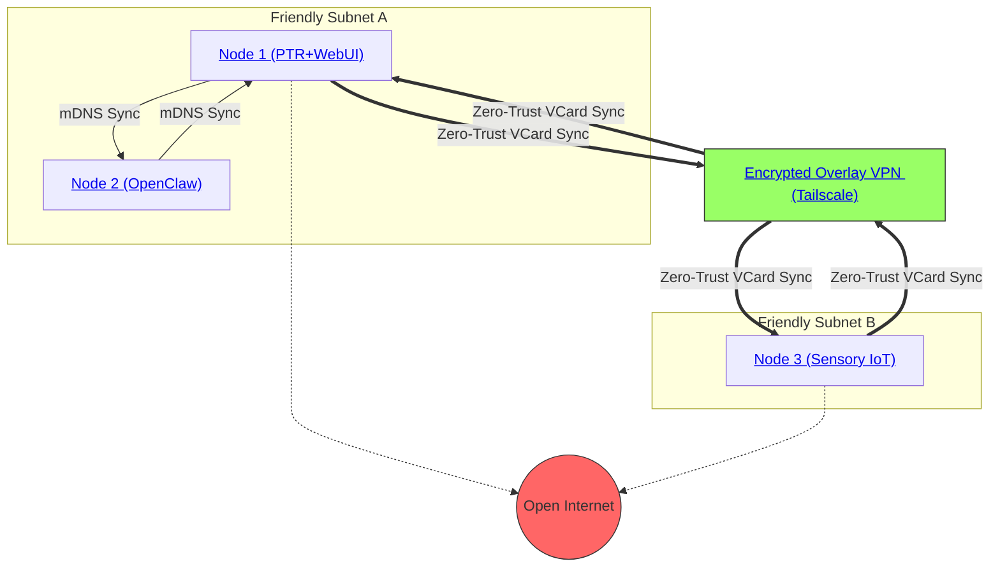

# PKC as an Autonomous Mesh Network

The **Personal Knowledge Container (PKC)** transcends traditional client-server mechanics. Instead of deploying software microservices onto a network, the PKC paradigm asserts that **the network itself is the operating system**. By blending direct peer-to-peer interoperability with swarm intelligence, the PKC serves as the foundational compute and storage infrastructure for both autonomous machine fleets (IoT) and human digital sovereignty.

## 1. Network Primitives: The MVP Cards Foundation

To understand how a PKC instantiates an autonomous mesh, we must ground it in the **[[Hub/Theory/MVP/Foundations/MVP Cards Design Rationale|MVP Cards Design Rationale]]**. The entire network structure operates on a strictly functional triad:

*   **MCard (The Sensory State)**: The immutable, content-addressed memory of a node. Whether storing human research or drone LIDAR data, MCards represent the node's verifiable history. In [[Double Operadic Theory of Systems]], MCard is a **[[Moore Machine]]** (Static Module / Number) — output depends on state only, composing via **lens** (Tight).
*   **PCard (The Actuating Logic)**: Pure functional reducers. The network does not rely on opaque scripts; instead, agents execute specifications via PCards derived from the Cubical Logic Model (CLM). In DOTS, PCard is a **[[Mealy Machine]]** (Dynamic Module / Function) — output depends on both state and input, composing via **chart** (Loose).
*   **VCard (The Cryptographic Witness)**: The zero-trust consensus token. When an agent processes an MCard through a PCard, the resulting trace is sealed by a VCard. In DOTS, VCard is the **square** (2-cell) certifying the Moore-Mealy transition.

Because the system is built entirely on these three mathematically coherent primitives, it scales automatically from an isolated local container to a globally interconnected swarm without changing a single line of operational logic.

### 1.1 Linear Dependency: The Layered Architecture as Dependent Type

The MCard → PCard → VCard ordering is not merely a design convention — it reflects a strict **linear dependency** formalized by [[Hub/Theory/Category Theory/Logic/Type Theory/Dependent type theory|Dependent Type Theory (DTT)]]. Each card type is a [[Hub/Theory/Functions/Types/Dependent Type and Function|$\Pi$-type (dependent function)]] whose vocabulary depends on the types below it:

- **MCard** requires no prior vocabulary — it is the initial term introduced from the [[Hub/Theory/Integration/The Empty Schema Principle|Empty Schema]] ($\bot$).
- **PCard** depends on MCard: a PCard is a polynomial functor *over MCard references*. Without MCard, PCard is untypable.
- **VCard** depends on both MCard and PCard: a VCard witnesses the execution of a PCard on an MCard. Without both predecessors, VCard is undefined.

This chain is precisely the DTT typing judgment: $\Gamma_{\text{MCard}} \vdash \text{PCard} : \text{CLM}$ and $\Gamma_{\text{MCard}, \text{PCard}} \vdash \text{VCard} : (V_{pre} \to V_{post})$. Each layer receives its dependencies from below via [[Hub/Theory/Sciences/Computer Science/Programming Model/Dependency Injection|Dependency Injection]] — the engineering manifestation of context construction.

When the mesh needs to evolve (e.g., adding DID identity, vector similarity, or new PCard capabilities), [[Hub/Theory/Integration/The Arithmetization of Modularity - Real Options, Metamaterials, and the Composition of Digital Functions|Baldwin's modular operators]] provide the arithmetic: **Augmenting** ($+$, $\Sigma$-type) adds new vocabulary; **Substituting** ($\cong$, Quotient) swaps implementations; **Porting** (Kan Extension) migrates vocabulary across network categories. This ensures all mesh evolution is **type-safe** — new capabilities are introduced incrementally from $\bot$ without breaking the frozen schema contract.

## 2. Topologies of Autonomy: Implementation Strategies

To guarantee universal adoption and ease of deployment, the PKC is designed to be entirely self-contained. It abandons complex Kubernetes orchestration in favor of **Zero-Configuration Swarms**.

### 2.1 One-Command Operational Sovereignty
Any operator—whether a student establishing a sovereign knowledge base or an engineer configuring a server—can initialize a complete node instantly:

```bash
# Conceptual single-line deployment
npx launch-pkc-node --friendly-network
```

Executing this single command locally performs three critical operations:
1. **Bootstraps the Kernel**: Initializes the local MCard schema (SQLite `content_memory.db`) and the PTR (Polynomial Type Runtime) execution engine.
2. **Generates the Interface**: Automatically provisions and exposes a **web-based front end** accessible via `localhost`, avoiding esoteric command-line hurdle.
3. **Initiates the Sniffer**: Activates the **[[Hub/Tech/mDNS|mDNS/DNS-SD]]** discovery module to announce itself as `_pkc._tcp.local.` and hunt for peers on the local network (or across the [[Hub/Tech/Overlay VPN as Sovereign Network|Overlay VPN]] for remote peers).

### 2.3 The Secured Network Identity Stack

The zero-configuration bootstrap described above achieves **zero-trust networking** through a three-layer stack:

| Layer | Protocol | What It Does | Empty Schema Analog |
| :--- | :--- | :--- | :--- |
| **1. Discovery** | [[Hub/Tech/mDNS\|mDNS/DNS-SD]] (RFC 6762) | Peers self-announce on UDP 5353 — no DNS server, no manual IP config | Initial term introduced from $\bot$ |
| **2. Transport** | [[Literature/PKM/Tools/Open Source/Overlay Virtual Private Network\|Overlay VPN]] (WireGuard) | Encrypted tunnel extends the L2 domain globally | Context $\Gamma$ for secure communication |
| **3. Identity** | [[Literature/PKM/Tools/DataSecurity/DID\|DID]] (`did:key` + Ed25519) | $O(1)$ cryptographic proof of identity | Typing judgment $\Gamma \vdash \text{agent} : \text{Sovereign}$ |

This stack is **linearly dependent** in the [[Hub/Theory/Category Theory/Logic/Type Theory/Dependent type theory|DTT]] sense: VPN depends on mDNS (for peer discovery within the VPN subnet); DID depends on VPN (for an encrypted challenge-response channel). The [[PTR|PTR]] engine's `prep` phase validates all three layers before permitting any PCard transition to fire.

> See **[[Hub/Tech/mDNS#6.4 The Secured Network Identity Stack|mDNS §6.4]]** for the full formalization.

### 2.2 The Sovereign Overlay Topology


*Diagram: How local PKC subnets bridge across the dangerous Open Internet strictly via mathematically verified Overlay VPNs, establishing a Sovereign Swarm.*

By tunneling strictly through **[[Hub/Tech/Overlay VPN as Sovereign Network|Overlay VPNs]]** (e.g., Zerotier, Netbird, Tailscale, etc...), the mesh explicitly bypasses DNS hijacking, IP routing attacks, and centralized AWS infrastructure.

## 3. Swarm Physics: Kenotic Interoperability in a Flooded Internet

As high-quality self-hosted LLM services and autonomous agents begin flooding the public internet, traditional "Command and Control" infrastructure breaks down. The sheer volume and speed of computational agencies navigating the web requires a definitively new topological approach.

While the PTR provides the underlying math and logic execution, the physical "Agency" within the network is granted by **[[Hub/Tech/OpenClaw|OpenClaw]]**. Operating as the local-first execution layer natively tied to lightweight open-source models like **Llama.cpp**, OpenClaw provides the ability for nodes to act upon the network autonomously and **free of charge**.

Because the network is flooded with these autonomous actors, explicit coordination relies on **[[Hub/Philosophy/Ontology/Authorized Cognitive Capacity|Authorized Cognitive Capacity (ACC)]]** acting as a dynamically negotiable, contextually sensitive governance system. Agents do not blindly follow scripts; they negotiate their parameters in real-time based on local context, generating emergent, cooperative Swarm Intelligence without relying on central APIs or static rate-limits.

### 3.1 Resolving the Empty Schema

Because the initial state of the PKC is completely empty—relying on the theological physics of **[[Hub/Theory/Architecture/The Kenosis Principle|Kenosis]]** (self-emptying)—the node assumes no domain preconditions. 

1. A new Node boots up with zero domain knowledge (Kenosis). Its only identity is a self-generated **[[Hub/Tech/DID as PKC Agent Identity|DID]]** (`did:key:z6Mk...`) derived from a locally generated Ed25519 keypair.
2. Via WebRTC, it discovers peers on the `Overlay VPN`. Authentication is $O(1)$ DID signature verification — no round-trip to any identity provider.
3. It requests sync. The existing peers transmit their cryptographic `VCards` proving the validity of their internal state, signed by their sovereign DIDs.
4. The new node evaluates the mathematical invariants. Upon success, it imports the `MCards` and is instantly aligned with the swarm's consciousness.

> **Identity Detail:** The DID-based swarm handshake — including EOA/CA duality, `g_time` anchoring, and the identity lattice's convergence to a fixed point — is formalized in **[[Hub/Tech/DID as PKC Agent Identity|DID as PKC Agent Identity]]**.

### 3.2 Contrasting Implementations

To fully understand the shift to Topological Physics, compare standard industry deployments against the PKC Mesh architecture:

| Component | Traditional IoT & Cloud Agents | PKC Autonomous Mesh (Topological) |
| :--- | :--- | :--- |
| **Routing Protocol** | Relies on central MQTT brokers or Cloud API Gateways. Single point of failure. | **Semantic DHT Routing**. Peer-to-peer WebRTC gossip. State is routed topologically via MCard hashes. |
| **Logic Updates** | Flashing entire firmware images over-the-air (OTA) from a centralized master server. | **PCard Synchronization**. Swarm nodes simply sync lightweight mathematical polynomial functors. |
| **LLM Intelligence** | Every drone/node must stream latency-heavy API calls to an OpenAI server, leaking data. | **OpenClaw+Llama.cpp**. Nodes run quantized inference internally. Highly sensitive data never leaves the edge node. |
| **Network Security** | IP Whitelists, fragile JWT tokens, and perimeter firewalls. | **VCard Identity Types**. Every data mutation requires an algebraic proof that compresses logic (Zero Trust Governance). |

*Active Swarm Intelligence*: Even if a swarm drone is disconnected geographically, its local Web UI remains active, its logic (PCard) continues unaffected, and it retains full autonomy due to local OpenClaw/Llama.cpp inference. The moment it flies back into range of the Friendly Subnet or Overlay VPN, its PTR agent detects its peers, initiates a WebRTC differential sync, and the network mathematically "heals" itself.

### 3.3 Why Every Agent Must Have a DID: The Multi-Agent Interaction Argument

In a sovereign mesh, every node interacts with many other nodes — synchronizing MCards, executing PCards on behalf of peers, issuing and verifying VCards. These interactions are **conversations**: structured exchanges of tokens (content-addressed data) through typed channels (PCard interfaces), mediated by cryptographic witnesses (VCards). For these conversations to be meaningful at scale, every participant must be **systematically distinguishable across space and time**.

The requirement has three dimensions:

**Space** (distributed nodes). Two PKC nodes may never directly communicate; they may only ever exchange data through two or three intermediate peers. Without a globally unique, self-certifying identity, there is no way to determine whether a particular MCard in node $C$ originated from node $A$ or from an adversary impersonating node $A$. The [[Literature/PKM/Tools/DataSecurity/DID|DID]] (`did:key:z6Mk...`) is globally unique by construction (cryptographic key entropy) and self-certifying (the public key is embedded in the identifier) — no central registry, no round-trip, no DNS.

**Time** (persistent identity across sessions). A mesh node may restart many times, upgrade its software, change hardware, or lose and regenerate its session context. Without a persistent, session-independent identity, VCards minted in one session become unverifiable in the next. The DID persists as long as the private key is retained — it is the **fixed point** of the identity lattice, converging from the keypair generation ($\bot$) to a stable, self-consistent identity state ([[Hub/Operations/結算|結算]]).

**Scale** (from a single laptop to planetary governance). The number of agents in the mesh may grow from 2 to 2 billion. Traditional identity systems (OAuth, LDAP, X.509 PKI) introduce central points of failure that prevent scaling. DID resolution scales as $O(\log n)$ via DHT routing — adding more nodes does not increase per-node authentication cost.

This three-dimensional requirement (global uniqueness, session independence, $O(\log n)$ resolution) is exactly what the [[Literature/PKM/Tools/DataSecurity/DID#DIDs in Scale-Free Logical Processing Kernel Architecture|9-layer DOTS governance architecture]] was designed to satisfy. The DID occupies Layer 8 (Action) in the stack: it is the module that makes Loose (behavioral flexibility of peer interactions) act on Carrier (the shared MCard store) in a cryptographically attributed way. Without Layer 8, the 7 lower layers produce an anonymous, non-attributable system; without the 2 higher layers (Action + Unit), the system has no self-sovereign starting point for agent bootstrap.

> **Architectural invariant**: In any PKC mesh interaction, the following sequence is mandatory and non-skippable:
> 1. **DID exchange** (Layer 8): Each peer presents its `did:key` — the cryptographic proof of identity.
> 2. **Challenge-response** (Layer 6, Tight): The PTR's `prep` phase verifies the DID signature before permitting any PCard to fire.
> 3. **VCard issuance** (Layer 2, Lens): The verified execution is sealed as a DID-signed VCard — the content-addressed proof of the interaction.
>
> This sequence cannot be reordered. It cannot be truncated. It is the operational form of the 9-layer dependent type chain.

### 3.4 Mesh Learning as Distributed Lagrangian Optimization

The autonomous mesh network functions as a distributed computer that maximizes learning efficacy while minimizing thermodynamic dissipation. This is governed by the variational principles of **[[Hub/Theory/Sciences/LAP and Opportunities|Least Action Principle and Awareness of Opportunities]]**, which we reframe as the computational equivalent of Michael Levin's developmental **[[Hub/Theory/Sciences/Biology/TAME|Scale-Free Cognition (TAME)]]**:
* **The Cellular Swarm**: The PKC Mesh acts as a multicellular tissue. Individual sovereign nodes behave as biological cells that contain their own metabolic machinery (local SQLite databases) and local reasoning sensors (**[[Hub/Tech/OpenClaw|OpenClaw]]**). Secure peer-to-peer WebRTC gossip connections act as digital **gap junctions** that merge isolated local cognitive light cones into a larger collective intelligence.
* **The Opportunity Space ($H_T$)**: Each node exposes its local content memory as a repository of latent patterns. Swarm agents use multicast discovery to identify newly available MCards, expanding their local awareness of opportunities (broadening their cognitive light cone).
* **The Geodesic Path ($L_{\text{software}} = S_T - H_T$)**: The network minimizes transmission and computation costs by selecting paths that maximize the **[[Hub/Theory/Integration/Software-Lagrangian|Software Lagrangian]]** (which represents the free energy minimization of biological tissues). Instead of streaming massive raw data streams to a central server, nodes run local inference via OpenClaw and Llama.cpp, extracting structural meaning ($S_T$, Epiplexity) directly at the edge to conserve thermodynamic resources.
* **The Kernel Operator ($T : V_{\text{pre}} \to V_{\text{post}}$)**: The execution of this local learning is certified by the **[[Hub/Theory/Integration/CLM and MVP Cards as Kernel Operator - Engineering the Demon|MVP Cards acting as Kernel Operators (Maxwell's Demons)]]**. The transition consumes raw input memory (MCard) and compresses it into a cryptographically signed witness (VCard), discarding computational noise (Nullity) under the type-theoretic grammar of the **[[Hub/Theory/CLM/Foundations/Cubical Logic Model|Cubical Logic Model (CLM)]]** to establish biological-like homeostasis.

### 3.5 Somatic Homeostasis and Shape Dynamics

In biological morphogenesis, the somatic boundary maintains its target shape (the attractor) even when individual cells are scrambled or undergoing material turnover. The PKC Mesh achieves this **Somatic Homeostasis** by incorporating Julian Barbour's **[[Hub/Theory/Sciences/Shape Dynamics|Shape Dynamics]]** and Leinster Magnitude into its synchronization and routing layers, as formalized in **[[Hub/Theory/Integration/Sovereign Truth and Sustainable Swarms - The PKC Mesh as a Living Agentic OS|Sovereign Truth and Sustainable Swarms]]**:

1. **Elimination of Absolute Coordinates**: The PKC Mesh abandons absolute synchronization metrics (e.g., centralized NTP servers or linear blockchain timelines). It relies on relational angles and topological connectivity between Content-Addressable Scheme (CAS) states.
2. **Relational Best Matching**: When two nodes sync, they align their local MCard histories via **Best Matching**—checking structural similarity and the overlap of content-addressed hashes. Eventual consistency is maintained via G-Set CRDT timeline merges, guaranteeing that the network "heals" its state boundaries automatically when partitioned nodes reconnect.
3. **Requisite Perceptual Variety**: The diversity of the mesh is preserved by maximizing the **Leinster Magnitude** ($M(X)$) of its active states. This prevents the centralization and homogenization of the swarm, ensuring that the collective intelligence retains sufficient representational variety to handle complex, shifting environmental opportunities.

*   **[[Hub/Tech/DID as PKC Agent Identity|DID as PKC Agent Identity]]** — How W3C DIDs anchor sovereign agent identities in the mesh, including EOA/CA duality and the identity fixed point.
*   [[Literature/PKM/Tools/DataSecurity/DID|Decentralized Identifiers (DIDs)]] — The W3C standard underpinning all mesh identity.
*   [[Comparative Analysis - Secure Decentralized AI and the PKC]] — A comparative study of Vitalik's secure LLM models, OpenClaw, and the sovereign structural guarantees of the PKC mesh.
*   [[Hub/Theory/Sciences/Biology/TAME|TAME — Scale-Free Cognition]] — The biological theory of distributed agency that grounds the PKC mesh in cognitive science.
*   [[Literature/PKM/Tools/Internet of Things|Internet of Things]] — How IoT's physical substrate is transformed by embedded AI and the PKC Cognitive OS into a TAME-enabled mesh.
*   [[Hub/Theory/MVP/Foundations/MVP Cards — Mathematical Foundations|MVP Cards — Mathematical Foundations]] — The Symmetric Monoidal Category (SMC) laws guaranteeing compositional coherence across the autonomous mesh.
*   [[Hub/Theory/MVP/Foundations/MVP Cards Design Rationale|MVP Cards Design Rationale]] — The architectural spine governing the MCard/PCard/VCard triad.
*   [[Hub/Tech/mDNS|mDNS]] — Zero-configuration peer discovery via multicast DNS (Layer 1 of the Secured Network Identity Stack).
*   [[Literature/PKM/Tools/Open Source/Overlay Virtual Private Network|Overlay VPN]] — Encrypted transport extending L2 broadcast globally (Layer 2).
*   [[PTR|PTR: Polynomial Type Runtime]] — The execution engine whose `prep` phase validates the Secured Network Identity.

