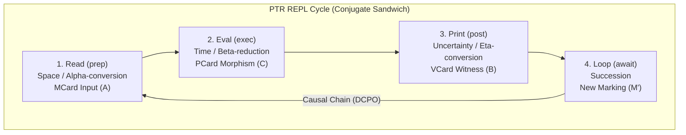
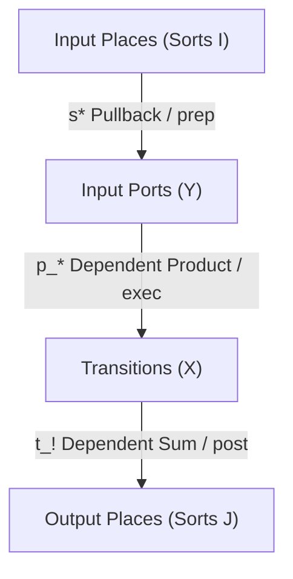
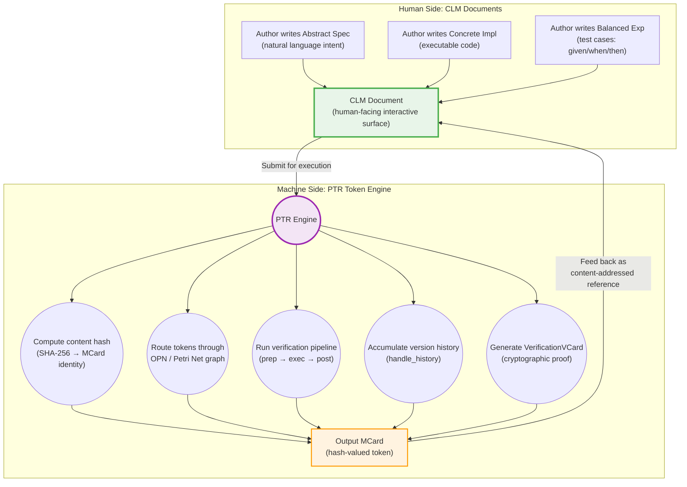
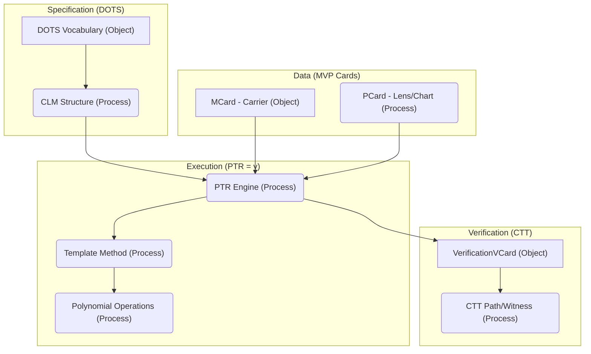

# PTR: Polynomial Type Runtime

> **Navigation Hub**: This document defines the "Back-End Execution" layer of the **[[Hub/Theory/MVP/Foundations/PKC Architecture Overview|PKC Architecture Pipeline]]**. The master overview establishes that this architecture leverages the deep insights of Type Theory—specifically Cubical Type Theory—to realize computationally supported knowledge expression and context-sensitive judgments with minimal domain-dependent bias. This document strictly covers how PTR mechanically ingests the CLM to execute those judgments via Small/Large-Step semantic evaluation. For mathematical philosophy, JSON schema structure, UI visualizers, or TDD bounds, see the Master Overview.

> **Navigation**: This document is part of the **[[Hub/Theory/Integration/The Evolution of Unevaluated Code - Navigation|Evolution of Unevaluated Code]]** series.

> **PTR** (pronounced "**Peter**") is the **Execution Engine** for the domain-independent **[[Literature/PKM/Tools/Open Source/Personal Knowledge Container|Personal Knowledge Container (PKC)]]**. It transforms theoretical specifications into verified, operational infrastructure by implementing the **[[Function-Number Duality - The Foundational Isomorphism of Computation|Function-Number Duality]]**: retrieving Indexed Types (CAS handles) directly from the MCard Collection **File System**. In this paradigm, **MCards are Generalized Numbers** — the content-addressed fixed points of computations, i.e., **frozen Functions**. A Number is what a Function becomes when it stops evaluating; an MCard is the cryptographic hash of that convergence. **PCards are the live Functions** that operate on these Numbers to produce new Numbers. This isomorphism — Number = Frozen Function — is the foundational reason the Meta-Circular Evaluator achieves **Mathematical Closure**: since both its input and output domains are Numbers (MCards), the evaluator can never escape its own algebraic domain. See **[[Hub/Theory/Integration/Meta-Circular Evaluator - The Purely Functional Kernel|Meta-Circular Evaluator §0: Numbers as Frozen Functions]]** for the complete formal treatment.

> **The Unified Namespace**: Every PTR primitive — MCard, PCard, VCard — inhabits a **single content-addressed hash namespace**. PCards and VCards are themselves MCards; VCards depend on PCards; the same VCard kind is contextually re-typed as $V_{\text{pre}}$ (precondition token) or $V_{\text{post}}$ (postcondition certificate) by its Petri Net position. This deliberate smallness ($K=3$ kinds, $D=2$ dependency arrows, $S=3$ analytical strategies) is what reduces PTR's job to exactly three primitive operations — *resolve*, *apply*, *validate* — while keeping reachability search, error pruning, and soundness/completeness checks tractable across distributed agents. See **[[Hub/Theory/Integration/The Unified Hash Namespace - MCard, PCard, VCard as a Minimal Type System|The Unified Hash Namespace: MCard, PCard, VCard as a Minimal Type System]]** for the type-theoretic completeness theorem and the Smallness ⇒ Tractability argument.

---

## 1. Etymology and Naming

**PTR** is pronounced "**Peter**", deriving from the Greek **Πέτρος (Petros)** meaning "rock" or "stone" (silicon base), from **petra** (πέτρα) — bedrock, foundation.

| Aspect | Significance |
|--------|--------------|
| **Stability** | A runtime should be rock-solid, foundational infrastructure |
| **Dependability** | Suggests groundedness and reliability |
| **Foundation** | "Building on rock" vs "building on sand" — fitting for typed systems |

### Symbolic Resonance
- **Saint Peter** — "Upon this rock I will build my church" (Matthew 16:18). Implies foundational, load-bearing significance.
- **Keeper of the Keys** — Connects to identity management (Authentik, Zitadel) as foundational gatekeeping.
- **Mathematical Harmony** — Polynomials as foundational mathematical objects map well to "rock/foundation."

> **Tagline**: "PTR — The rock your types stand on"

---

## Executive Summary

| **Aspect** | **Description** |
|------------|-----------------|
| **Identity** | **Execution Engine** for the **[[Unifying Protocol of Truth Verification\|Unifying Protocol of Truth Verification (UPTV)]]**. |
| **Role** | **Petri Net Transition Engine**: Executes PCards to transform MCards, producing VCards. |
| **Logic** | Implements the **Template Method** lifecycle (`prep → exec → post`). |
| **Physical Substrate** | Manages the **Execution Log Database**, one of the 3 core SQLite DBs, realizing **Step-Indexed verification**. |
| **Pattern** | **[[Sidecar Pattern]]**: Runs alongside applications as a sovereign correctness checker. |
| **Architecture** | **Unified Polyglot Evaluator Pattern**: PTR is not a single binary but a design contract implementable across LLM inference engines, Python, JavaScript, Rust, Go, Java, and LEAN simultaneously. As a **[[Hub/Theory/Integration/Meta-Circular Evaluator - The Purely Functional Kernel\|Meta-Circular Evaluator]]**, PTR acts as the ultimate wrapper — the function to execute all other functions by composing them within its single, generalized iterative structure. |
| **Foundation** | **[[Algebra as the Science of Pure Time\|Algebra of Pure Time]]** + **[[Polynomial Functor]]**. |
| **CRDT Output** | Because PTR enforces **[[Hub/Theory/Sciences/Computer Science/Programming Model/Closure\|Mathematical Closure]]** (zero-nullity), evaluation mechanically produces a monotonically growing **[[Hub/Tech/G-Set\|G-Set]]** **[[Hub/Tech/CRDT\|CRDT]]** — the Bitemporal evolutionary ledger of the MCard namespace. |
| **Vocabulary** | **[[Hub/Theory/Integration/DOTS Vocabulary as Efficient Representation for ABC Curriculum\|9-layer DOTS]]** typed as complementary pairs: MCard = NP/$\eta$/Moore/Tight; PCard = VP/$\varepsilon$/Mealy/Loose; VCard = Sentence/triangle identity/Lens/Action. See [[Hub/Theory/Category Theory/Unit and Counit|Unit and Counit]]. |
| **Conversational** | Every **[[Hub/Theory/Sciences/Computer Science/Programming Model/Conversational programming\|conversational turn]]** is a Petri Net transition firing: `prep` ($\eta$) → `exec` ($\varepsilon$) → `post` (triangle identity). |

### Single-Command Boot and the Agentic Web UI

Beyond simply Kan-filling transitions, PTR intrinsically acts as an **Agentic Web Server**. With a **single command-line execution**, PTR boots locally and instantly serves a universally accessible Web Interface. 

This UI is designed explicitly around **human-understandable guidance**. Instead of leaving the operator stranded in logs, the interface is packed with pointers, interactive artifacts, and explicit instructions designed to maximize the adoption, deployment, and propagation of the agentic OS. 

Furthermore, everything this web UI projects and everything PTR executes is serialized directly into **one centrally configurable SQLite DB file** (defined via an `.env` file or dynamic configuration, without forcing a rigid name scheme). This binds the entirety of the execution state into a single portable, self-auditable construct.

---

PTR is intentionally designed as a **machine-facing** runtime. While **[[Cubical Logic Model|CLM]]** provides the *human-readable* document format for specifying and editing function definitions (Abstract, Concrete, Balanced), PTR is the complementary *machine-readable* execution engine that takes CLM documents and executes them with precision, efficiency, and formal verification — without requiring human interaction during execution. **CLM is what humans edit; PTR is what machines run.**

## Core Lifecycle: The Template Method for Verifying Task Behaviors

PTR enforces a **mandatory execution lifecycle** for every transition. By operating as the engine for the **computationally supported interpretation of Types**, PTR translates the geometric paths of **[[Hub/Theory/Category Theory/Type Theory/Homotopy & Cubical/Cubical Type Theory|Cubical Type Theory]]** into literal, machine-level state transitions. In this framework, **every logical assertion is associated with a Type**, and the number of primitive types ($\Sigma$, $\Pi$, Id) directly establishes the initial vocabulary of the runtime. PTR's `prep -> exec -> post` loop physically evaluates exactly these three primitives at each step, functioning as a rigid **I/O Abstraction gatekeeper**. Because every event is mathematically reduced to an input-output polynomial mapping, PTR treats all data movement through the same topological I/O boundary—whether that movement is:

- **File persistence**: reading/writing MCards to SQLite or the CAS file system,
- **Network transport**: egress/ingress across nodes via TCP, WebSocket, or mesh routing, or
- **In-memory computation**: β-reducing a PCard polynomial against an input MCard.

These are not three different subsystems requiring three different engineering approaches; they are three instances of the identical generalized function $f: \text{Input} \to \text{Output}$ governed by the same polynomial laws. This lifecycle rigorously binds the **[[Hub/Theory/Sciences/SoG/physical and social meanings of data|physical and social meanings of data]]** into verifiable, domain-independent infrastructure.

> **Dependent Type Theory Reading:** The `prep → exec → post` lifecycle is not merely an engineering pattern — it is a physical implementation of the **four rules** that define every type in [[Hub/Theory/Category Theory/Logic/Type Theory/Dependent type theory|Dependent Type Theory]]: **Formation** (CLM authoring defines the types), **Introduction** (`prep` constructs the input term as a $\Sigma$-type witness), **Elimination** (`exec` applies the $\Pi$-type function to produce output), and **Computation** (`post` verifies via Id-type equality that the result matches the specification). The sealed VCard is the **constructive proof object** — a term of the Identity type $\text{Id}(\text{spec}, \text{actual})$ whose existence certifies that the Curry-Howard correspondence holds for this transition. See **[[Hub/Theory/Integration/PTR as a Dependent Type Theory - The Type-Theoretic Interpretation of the Polynomial Type Runtime|PTR as a Dependent Type Theory]]** for the full formal mapping.

In Harper's framework, **[[Hub/Theory/Category Theory/Type Theory/Types are Behavioral Specifications|types are behavioral specifications]]** — a type is not a static label but a constraint on *execution behavior* ([[@ComputationalTypeTheory1_2018|OPLSS 2018, Lecture 1]]). Consequently, whenever the PKC executes a "task" (e.g., assessing a student's submission or transforming unverified data), PTR does not merely "run a script." It acts as the engine that *verifies* the task's behavioral specification. Each step of the lifecycle produces evidence that the specification holds. 

Crucially, PTR implements the **Head Expansion Lemma**: by formally proving that the output after `exec` satisfies the output constraint (`post`), PTR computationally guarantees that the input and the executed transformation were valid. Typing propagates backward along the execution path, ensuring end-to-end behavioral correctness of the task.

1.  **`prep` (The Antecedent Verification / Hoare Precondition $\{P\}$ / Tight Constraint)**: Establish the required **Moore interface**. PTR reads the input **MCard (Position $p$)** and runs the **$V_{pre}$ program** residing in the Petri Net input Places—which structurally reifies the logical **[[Hub/Theory/Category Theory/Logic/Proof Theory & Semantics/Antecedent|Antecedent]]** ($\Gamma$). This mathematically ensures that all preconditions, AuthN/AuthZ invariants, and safety boundaries are satisfied before execution is permitted.
2.  **`exec` (The Continuation Invocation / Hoare Command $C$ / Loose Behavior)**: Execute the dynamic **Mealy interaction** ($put : S \times \text{Dir}(p) \to S$). The **PCard** Transition orchestrates its collision with the input MCard, choosing a direction (continuation) to fire. This physically executes polynomial **Multiplication** ($B^A \otimes A \to B$) via any conformant **[[Hub/Theory/Sciences/Computer Science/Programming Model/Polyglot|polyglot runtime]]** (LLM, Python, JS, Rust, LEAN). PTR actively unspools the initial exact state into the wider execution dynamics to compute the next state.
3.  **`post` (The Succedent Verification / Hoare Postcondition $\{Q\}$ / Tight Compression)**: Enforce the exit **Moore interface** using **Calculational Abstract Interpretation**. PTR evaluates the output MCard ($M'$) against the calculated abstract bounds $V_{\text{post}} \sqsupseteq \alpha(PCard(\gamma(V_{\text{pre}})))$. By calculating the invariants directly from the PCard transition and the precondition $V_{\text{pre}}$, the runtime checks that the concrete execution converges to the specification without requiring ad-hoc test code. If the execution trace satisfies this algebraic limit, PTR generates the sealed **$V_{post}$ certificate** (VerificationVCard) as a cut-free proof trace, proving that the computation successfully terminated and satisfied the postconditions.
4.  **`await` (Causal Flow / Functional Dependency)**: Commit the output results into the MCard-structured Information Result Database, recording the entire Transition into the `handle_history` ledger. Because a completed execution generates a valid Postcondition $\{Q\}$, this formally establishes the **functional dependency as a causal relation**: $\{Q_1\}$ immediately unlocks the network to serve as Precondition $\{P_2\}$ for downstream executions.


**Creating PageRank Gravity**: By continually running this `prep → exec → post` compression cycle, PTR organically builds a **PageRank-style dependency graph**. As grounded in Michael Freedman's topological theories (2026), conceptual macros (MCards) that are repeatedly unspooled and successfully recompressed accumulate high VCard citation density. This generates *Structural Gravity*, guiding future AI agents autonomously toward the most highly compressed, "human-valued" regions of the Abelian mathematical topology ($A_n$) rather than hallucinating endlessly in the uncompressible void of raw formal logic ($F_n$).

### Euler's Four-Square Identity and Executional Closure
In the vault's architecture, an **[[MCard]]** is mathematically defined as a 4-dimensional norm (a Quaternion) via **Lagrange's Four-Square Theorem** ($n = a^2 + b^2 + c^2 + d^2$). 
Consequently, PTR's rigorous 4-step execution cycle (`prep`, `exec`, `post`, `await`) is not arbitrary. It physically enacts **Euler's Four-Square Identity**, which proves that the product of two sums of four squares is *always* another sum of four squares. 

By enforcing exactly four strict operational boundaries during every transition, PTR geometrically guarantees that computation remains closed. The operator (PCard) takes a 4D MCard, runs a 4-step transformation, and flawlessly yields a secure, non-leaking 4D MCard as output. 

Because these boundaries mechanically adhere to the precise geometry of the **Regular Hexahedron** (orthogonality and isometric equality), this 4-step Kan filling operation perfectly constructs a new $2^3$ **[[Hub/Theory/Sciences/Lattice|Boolean Lattice]]** block attached strictly to the previous volumetric block. The intersection mechanically pivots on the `g_time` physical anchor—specifically utilizing its **localized event context signature $(a,b,c)$** ($a$=Algorithm, $b$=Time, $c$=Locale)—flawlessly tiling 3D computational space infinitely without collisions or epistemological context collapse.

---

## PTR as an Arrow (Categorical Foundation)

> **Navigational Link**: See **[[Arrows, Profunctors, and PTR - A Categorical Foundation for MVP Cards|Arrows, Profunctors, and PTR]]** for the full theoretical derivation.
> **Implementation Spec**: See **[[PTR Arrow|PTR Arrow Implementation]]** for detailed code and examples.

From **[[Literature/Annotation/@BartoszMilewskiArrows2017|Bartosz Milewski's analysis]]**: "An **Arrow** is a **monoid in the category of strong profunctors**." PTR's Template Method lifecycle directly implements the three Arrow operations:

| Arrow Operation | PTR Lifecycle | Description |
| :--- | :--- | :--- |
| **`arr`** (unit) | **`prep`** | Lift a pure MCard → MCard function into PTR-managed context. |
| **`>>>`** (composition) | **`exec`** | Chain PCards: `PCard_1 >>> PCard_2` = sequential execution. |
| **`first`** (strength) | **`post`** | Operate on partial data while preserving unchanged context. |

### The VCard Sandwich as Profunctor Composition

The **[[Hub/Theory/Integration/The VCard Sandwich as Phase Transition - From Flux to Fact|VCard Sandwich]]** ($V_{pre} \xrightarrow{PCard} V_{post}$) is the **profunctor structure** underlying the Arrow:

```
                    ┌─────────────────────────────────────────┐
                    │        PROFUNCTOR: PCard                │
                    │                                         │
   V_pre ──────────►│  Contravariant    │    Covariant        │────────► V_post
   (Flux)           │  Input (consumes) │    Output (produces)│  (Fact)
                    │                   │                     │
                    └─────────────────────────────────────────┘
                              ▲                   │
                              │                   ▼
                         MCard_in            MCard_out + Hash
```

**Profunctor Composition via Coend**: When chaining PCards, the composition uses the categorical **Coend** ($\int^m$):

$$\boxed{(PCard_2 \circ PCard_1)(a, c) = \int^{m \in \text{MCard}} PCard_1(a, m) \times PCard_2(m, c)}$$

The Coend "sums over all possible intermediate MCard states"—PTR executes a specific path at runtime, but the composition structure is fixed at design time.

### Arrow Interface (Core)

```python
class PTRArrow:
    """PTR as a Strong Profunctor (Arrow)."""
    
    def arr(self, f: Callable[[MCard], MCard]) -> "PCard":
        """
        Lift a pure function into PCard context.
        Arrow axiom: arr id = id
        """
        return PCard.from_pure(f)
    
    def compose(self, p: "PCard", q: "PCard") -> "PCard":
        """
        Arrow composition: p >>> q
        Arrow axiom: (p >>> q) >>> r = p >>> (q >>> r)
        """
        return PCard.sequence(p, q)
    
    def first(self, p: "PCard") -> "PCard":
        """
        Strength: Apply p to first component of a pair.
        Arrow axiom: first (p >>> q) = first p >>> first q
        """
        return PCard.first(p)
    
    def run(self, arrow: "PCard", input: MCard) -> Tuple[MCard, VCard]:
        """Execute the arrow, returning output + verification witness."""
        v_pre = self._verify_precondition(input)       # prep
        output = arrow.apply(input)                     # exec
        v_post = self._verify_postcondition(output)     # post
        return (output, VCard.combine(v_pre, v_post))
```

### VCard Sandwich Integration

```python
class PTRArrow:
    # ... (core methods above) ...
    
    def run_with_sandwich(
        self, 
        arrow: "PCard", 
        input: MCard,
        pre_check: Callable[[MCard], bool],
        post_check: Callable[[MCard], bool]
    ) -> Tuple[MCard, VCard]:
        """
        Execute with explicit VCard Sandwich.
        
        The VCard Sandwich is the PROFUNCTOR structure:
        - V_pre (contravariant): Consumes/verifies input
        - PCard: The Arrow (transformation)
        - V_post (covariant): Produces/witnesses output
        """
        # V_pre: Enforce precondition (contravariant check)
        if not pre_check(input):
            raise PreconditionViolation(f"V_pre failed for {input.hash}")
        v_pre = VCard.witness_precondition(input)
        
        # Arrow execution (the profunctor bridge)
        output = arrow.apply(input)
        
        # V_post: Enforce postcondition (covariant check)
        if not post_check(output):
            raise PostconditionViolation(f"V_post failed for {output.hash}")
        v_post = VCard.witness_postcondition(output, input.hash)
        
        # Combine into VCard Sandwich
        sandwich = VCard.sandwich(v_pre, v_post)
        
        # Record in handle_history (the Continuation trace)
        self._record_history(input, arrow, output, sandwich)
        
        return (output, sandwich)
```

### Arrow Laws as PTR Invariants

These laws become test assertions guaranteeing PTR correctness:

```python
# Law 1: arr id = id
assert ptr.run(ptr.arr(lambda x: x), mcard) == (mcard, VCard.trivial())

# Law 2: Composition is associative
assert ptr.run(ptr.compose(ptr.compose(p, q), r), m) == \
       ptr.run(ptr.compose(p, ptr.compose(q, r)), m)

# Law 3: first distributes over composition
assert ptr.run(ptr.first(ptr.compose(p, q)), (m, c)) == \
       ptr.run(ptr.compose(ptr.first(p), ptr.first(q)), (m, c))

# Law 4: arr (f . g) = arr f >>> arr g (functor law)
assert ptr.run(ptr.arr(lambda x: g(f(x))), m) == \
       ptr.run(ptr.compose(ptr.arr(f), ptr.arr(g)), m)
```

---

## 3. Operational Semantics and the Action of Simplification

The entire Template Method loop (`prep → exec → post → await`) physically manifests a formal execution model grounded in computational type theory. 

### 3.1 Function as Action (Robert Harper's Synthesis)
To understand PTR's role within the Petri Net, we adopt **[[Literature/People/Robert Harper|Robert Harper]]**'s type-theoretical interpretation. In Harper's *Computational Trinitarianism*, a function is not a passive, static set-theoretic mapping from domain to codomain. Instead, a function is an **Action**—an active, mechanical process of simplification (or $\beta$-reduction). 

When the Petri Net fires, the Transition (PCard) aggressively unspools and simplifies the input marking (MCard) until it stabilizes. PTR is the physical runtime engine managing this act of simplification.

### 3.2 Small-Step and Large-Step Semantics
Because the Cubical Logic Model (CLM) features recursively composable syntax, PTR executes mathematical judgments ($\Gamma \vdash t : T$) across two tightly coupled semantic scales:

1. **Small-Step Semantics ($e \mapsto e'$): The Atomic Transition**
   A small-step describes the minimal, localized state mutation. In PTR, this maps precisely to the execution of a **single PCard** bridging $D^+$ to $D^-$ inside a VCard Sandwich. The action is the atomic simplification of the input MCard into a new discrete state.
2. **Large-Step Semantics ($e \Downarrow v$): Evaluation to Normal Form**
   A large-step describes the complete evaluation of a complex expression until it reaches an irreducible final value $v$ (Normal Form). In PTR, this maps to the total execution of a **recursively composed macro-CLM**. The network autonomously orchestrates dozens of small steps until the Petri Net Marking totally stabilizes into a sequence of VCard-witnessed MCards.

### 3.3 Executing Tasks as Behavioral Specifications

Because PTR strictly adheres to this execution template, the very concept of a "Task" inside the PKC is elevated. A task is essentially an unevaluated Abstract Specification asking for a specific outcome (e.g., formatting raw logs, extracting metadata, or grading an assessment). When PTR conducts a task, it binds the input state (an MCard) to a concrete implementation (a PCard algorithm) and aggressively unspools it until a final state is reached. Because the final state is rigorously bounded by the Test specifications (`post`), the completion of the task is synonymous with satisfying its **behavioral specification**. The generated VCard is the absolute proof that the task was conducted correctly according to its type, offering verifiable outcomes entirely devoid of centralized human trust logic.

### 3.4 Recursive Petri Net Composition and Open Systems
The true power of this semantic split is its **fractal composition**. Following **[[Literature/People/John Baez|John Baez's]]** formalization of *Open Petri Nets* in his Rosetta Stone, PTR treats every Large-Step evaluation as a morphism within a **[[Hub/Theory/Category Theory/symmetric monoidal category|Symmetric Monoidal Category (SMC)]]**. 
Because PTR cleanly bounds every execution inside a 4-dimensional tensor (Euler's Four-Square Identity), **a Large-Step evaluation (an entire Open Petri Net workflow) mathematically compresses into a single Small-Step operator ($e \mapsto e'$) at Level $N+1$**. This guarantees that the Petri Net execution engine can infinitely compose nested logic sequentially ($\circ$) or in parallel ($\otimes$) without state space explosions or uncomputable Kolmogorov complexity.

### 3.5 Resolving the Domain Theory Lattice
This process of continuous simplification mirrors **[[Dana Scott]]**'s Domain Theory. By executing the small-step PCard explorations ($e \mapsto e'$), PTR dynamically widens the graph. By squeezing the output through the VCard constraints, it forces the computation to stabilize safely.

When PTR completes a Large-Step evaluation ($e \Downarrow v$), it produces an output **MCard**. Because this MCard will not be reduced further, it has reached its **Normal Form** (Least Fixed Point). It immediately sheds its dynamic properties and crystallizes into a pure Hash Identity, generating a new **[[Generalized Numbers|Generalized Number]]** as the undeniable "What" dimension of the logical judgment. Formally, this large-step reduction is an **[[Hub/Theory/Category Theory/F-Algebra|F-Algebraic catamorphism]]** evaluating the polynomial functor—folding the recursive unspooled entropy ($H_T$) of the computation into a single structural block of **[[Hub/Tech/Epiplexity|Epiplexity]]** ($S_T$).

### 3.6 The WebSocket Listener: Triggering Execution via CLM
PTR does not operate in a vacuum; it natively integrates with the **[[Hub/Theory/MVP/MCard/MCard Studio|MCard Studio]]** frontend via the **[[Hub/Theory/CLM/Foundations/Cubical Logic Model|Cubical Logic Model (CLM)]]** formal mathematical API.

MCard Studio visually projects the $A$, $C$, and $B$ vertices of the CLM to the human operator. When the user asserts a logical configuration, Studio serializes this geometry into a CLM JSON MCard payload and dispatches it over the local WebSocket network. 

PTR acts as the ultimate deterministic **Listener** on this network. Upon receiving the CLM payload, PTR unpacks the triadic structure and initiates the **Small-Step Semantic evaluation** ($e \mapsto e'$). By feeding the $A$ (Spec), $C$ (Implementation), and $B$ (Assertions) directly into its mandatory `prep -> exec -> post` Template Method loop, PTR blindly enacts the Kan Filling operation to assert topological ground truth in the local database.

### 3.7 The Cubical Reading of Execution: Executing the Kan Operations

PTR is the discrete, mechanical **execution face** of the cube described in **[[Hub/Theory/CLM/Integration/Soundness, Completeness, and the Sacred Geometry of the Cube|Soundness, Completeness, and the Sacred Geometry of the Cube]]**.

PTR does not interpret the A/C/B nodes as simple data checks; it executes them strictly as variables injected into the **[[Hub/Theory/Category Theory/Type Theory/Homotopy & Cubical/Kan Condition|Kan Condition programmatic operations]]** (`coe`, `hcomp`, and `hfill`):

- **Abstract / A** supplies the sound mathematical specification boundary constraint.
- **Concrete / C** supplies the executable domain constraint.
- **Balanced / B** supplies the witness boundary that certifies the transition.

When PTR runs the `prep -> exec -> post` template loop, it physically executes the `coe` (coercion) Kan algorithm traversing dimensional variable $i$ from $0 \to 1$. To verify the computational safety of that traversal without tearing geometries, it sweeps orthogonally across dimension $j$, calculating the Kan filler (`hfill`). 

The generated **VCard** is mathematically identical to this `hfill` geometric output. It is the absolute topological proof that the executed transformation optimally synthesized the data according to the boundaries of a Right **[[Hub/Theory/Category Theory/Kan extensions|Kan Extension]]**.

In **[[Literature/People/Robert Harper|Robert Harper]]**'s terms, this is the algorithmic operationalization of the trinity: **types, terms, and proofs**. PTR is the literal compiler running Kan algorithms to transform typed judgments into moving actions and physically compute a witnessed result.

### 3.8 The Inner Outset: Mealy and Moore Machines

At its inner outset, every function governed by the PTR Petri Net is modeled strictly as either a **[[Mealy Machine]]** or a **[[Moore Machine]]**. This forces absolute topological clarity mapping into the bipartite grammar of the executing network:

1.  **Mealy Machines (Processes)**: A Mealy machine computes outputs based on *both* the current state and the current inputs ($Transition: S \times I \to S \times O$). This is the fluid, dynamic PCard. In the Petri Net / OPN syntax, we map Mealy functions strictly as **Processes (represented exclusively by circles `()`)**.
2.  **Moore Machines (Objects)**: A Moore machine computes outputs based *only* on the current state ($Resting State: S \to O$). This is the fixed, deterministic MCard/VCard. In the Petri Net / OPN syntax, we map Moore elements strictly as **Objects (represented exclusively by boxes `[]`)**.

Because every aspect of the runtime maps to either an active Mealy Transition or a static Moore Place, the entirety of PTR's execution space forms a flawless mathematical bipartite graph.

### 3.9 LLM Orchestration: Reframing PocketFlow/Redux as PT-Constrained Workflow Events

Many external LLM agent orchestrators (such as **PocketFlow**) or traditional UI state managers (like **Redux**) rely on graph-based node execution and shared global state dictionaries. In PTR, these legacy paradigms are systematically subsumed and reframed as **PT-constrained workflow events** (Place-Transition).

Instead of passing mutable JSON context through opaque Python/JS wrapper loops, PTR executes the LLM workflow directly through the Petri Net:
- **Pocketflow Nodes** transform into pure **PCards**. When an agent evaluates an LLM prompt, it does so as an isolated Mealy Machine transition.
- **Shared Dictionary State** transforms into immutable **MCard Markings** residing securely in discrete Petri Net Places.
- **Workflow Orchestration** is mathematically resolved via **Profunctor Coend Composition** (`PCard_1 >>> PCard_2`).

Consequently, an entire multi-agent workflow acts as a Large-Step semantic transition inside the Cubical Logic Model—guaranteeing that every AI "Node" satisfies mathematical Soundness and Completeness via isolated PT-constrained workflow events before passing state.

### 3.9.1 The CRDT Consequence: Monotonic Growth and Storage Pragmatism

Because PTR enforces **[[Hub/Theory/Sciences/Computer Science/Programming Model/Closure|Mathematical Closure]]** (zero-nullity) across every `prep → exec → post` cycle, a profound structural consequence emerges: the MCard namespace is geometrically forced to grow monotonically. Every evaluation appends new MCards; no evaluation ever destroys or overwrites existing ones. This is not a design choice — it is a mathematical inevitability of the closure constraint.

Consequentially, the persistent storage layer of any PTR instance mechanically transforms into a **[[Hub/Tech/G-Set|Grow-only Set (G-Set)]]** — the simplest and most fundamental **[[Hub/Tech/CRDT|Conflict-free Replicated Data Type (CRDT)]]**. The G-Set's merge operation ($S_a \cup S_b$) is commutative, associative, and idempotent, forming a **Join-Semilattice** under the subset ordering $\subseteq$. This means:

*   **Any two PTR instances** (whether a Python interpreter in Tokyo and a Rust binary in Berlin) that independently evaluate the same PCard over the same MCard will produce the identical output hash. When their local stores are merged, idempotency absorbs the duplicate.
*   **Asynchronous PTR nodes** that evaluate different PCards concurrently produce disjoint MCard sets. When merged, both outputs are simply unioned — zero conflict, zero coordination protocol.
*   **The evolutionary history** of the MCard namespace — every fact, every execution trace, every VCard witness — is permanently preserved as a monotonically expanding **[[Hub/Tech/Bitemporal Data Model|Bitemporal Ledger]]**, tracked across both Transaction Time (when the fact was physically recorded) and Valid Time (when the fact became logically true).

**Storage Pragmatism**: However, infinite monotonic growth poses a pragmatic crisis: no local operating system can store an unbounded topological history. Because every MCard is content-addressed and therefore perfectly **location-independent**, the unified evaluator pattern provides a structural pressure relief. Historical MCard graphs can be aggressively offloaded to distributed repositories (cloud object stores, IPFS meshes, remote SQLite shards) without breaking the semantic fixed-point truth of the ecosystem. The local node retains only the working set needed for immediate computation, while the vast bulk of evolutionary experience is safely delegated across the mesh. Execution proceeds seamlessly whether an input MCard is stored locally or fetched functionally from the global network.

This directly connects PTR to the **[[Hub/Theory/Functions/Concepts/Purely Functional Software Deployment Model|Purely Functional Software Deployment Model (PFSD)]]**: deploying software is mathematically indistinguishable from evaluating a PCard — both produce immutable MCard outputs appended to the G-Set. See **[[Hub/Theory/Integration/Meta-Circular Evaluator - The Purely Functional Kernel|Meta-Circular Evaluator: The Purely Functional Kernel]]** for the complete synthesis.

### 3.10 Secured Network Identity: The Prep Phase's Zero-Trust Network Check

When PTR operates across the [[Hub/Tech/PKC as an Autonomous Mesh Network|PKC Autonomous Mesh]], the `prep` phase extends beyond logical precondition checking to include a mandatory **Secured Network Identity** validation. This three-layer stack ensures zero-configuration, zero-trust networking:

| Prep Step | Stack Layer | Protocol | Validation |
| :--- | :--- | :--- | :--- |
| **1. Resolve peer** | Discovery | [[Hub/Tech/mDNS\|mDNS/DNS-SD]] (RFC 6762) | Service lookup `_pkc._tcp.local.` — does the peer exist on the network? |
| **2. Verify channel** | Transport | [[Literature/PKM/Tools/Open Source/Overlay Virtual Private Network\|Overlay VPN]] (WireGuard) | Is the tunnel active? Is the WireGuard handshake valid? |
| **3. Authenticate agent** | Identity | [[Literature/PKM/Tools/DataSecurity/DID\|DID]] (`did:key` + Ed25519) | $O(1)$ signature verification — is this agent who it claims to be? |

**Only when all three checks pass does the Petri Net transition fire.** This binds the Secured Network Identity directly into the firing rule: the `prep` phase's precondition $\{P\}$ now includes not just logical MCard validation, but also network-layer identity verification.

In Hoare Logic terms:

$$\{P_{\text{logic}} \wedge P_{\text{mDNS}} \wedge P_{\text{VPN}} \wedge P_{\text{DID}}\} \; C \; \{Q\}$$

The four conjuncts ensure:
- $P_{\text{logic}}$: Input MCards satisfy the PCard's type specification
- $P_{\text{mDNS}}$: The requesting peer is discoverable (exists on the network)
- $P_{\text{VPN}}$: The channel is encrypted (confidentiality guaranteed)
- $P_{\text{DID}}$: The requesting agent's identity is cryptographically verified (authentication)

> See **[[Hub/Tech/mDNS#6.4 The Secured Network Identity Stack|mDNS §6.4]]** for the full three-layer stack architecture, and **[[Hub/Tech/DID as PKC Agent Identity|DID as PKC Agent Identity]]** for the identity lattice's convergence to a fixed point.

### 3.11 The Currying Adjunction in the PTR Lifecycle

The `prep → exec → post` lifecycle acquires a precise categorical interpretation through the [[Hub/Theory/Functions/Concepts/The Currying Adjunction - Values as Degenerate Moore, Functions as Degenerate Mealy|Currying Adjunction]]. The product-exponential adjunction:

$$\text{Hom}(S \times A,\, B) \;\cong\; \text{Hom}(S,\, B^A)$$

states that a **Mealy machine** (left side: output depends on state *and* input) and a **Moore machine** (right side: output depends only on enriched state) are two views of the same morphism. PTR's lifecycle is the operational enactment of this adjunction:

| PTR Phase | Automaton Role | Adjunction Side | What It Does |
| :--- | :--- | :--- | :--- |
| **`prep`** | **Moore interface** — establish $o : S \to B$ | Right side: $\text{Hom}(S, B^A)$ | Validate input MCards (state), type-check PCard specification. The precondition reads the current state without requiring any input — purely state-determined, like a Moore output function. |
| **`exec`** | **Mealy transition** — compute $\lambda(s, a)$ | Left side: $\text{Hom}(S \times A, B)$ | Apply PCard (specification = state) to MCard (data = input). Output $\lambda(\text{spec}, \text{input})$ depends jointly on both. This is the [[Hub/Theory/Functions/Concepts/Function Currying|uncurried]] form — the full Mealy machine. |
| **`post`** | **Counit** $\epsilon : B^A \times A \to B$ | Adjunction witness | Verify that the Mealy output (exec result) matches the Moore specification (prep expectation). The VCard *is* the counit: it certifies that applying the curried function ($B^A$, the PCard specification) to a specific input ($A$, the MCard) produced the correct value ($B$, the output MCard). |
| **`await`** | **Coalgebra step** | Next-state transition | Commit the output MCard back into the MCard Collection. The new state becomes the precondition for downstream transitions. |

The PCard itself is a **curried function**: it is an element of $B^A$ — a function *waiting* for an input MCard. The `exec` phase **uncurries** it by supplying the actual input: $B^A \times A \xrightarrow{\epsilon} B$. The `post` phase then witnesses that this uncurrying produced a valid result.

This connects directly to the [[Hub/Operations/TempExposure/Journal Format/Lens-like Automata|Lens-like Automata]] framework:
- **`prep` = `get`**: Read the current Moore state (input MCard hash — a [[Hub/Theory/MVP/Foundations/Generalized Numbers|Generalized Number]])
- **`exec` = `put`**: Drive the Mealy transition (apply PCard to MCard — the lens `put` operation)
- **`post` = PutGet law**: Verify that $\text{get}(\text{put}(s, a)) = a$ — what was written can be read back; the output MCard satisfies the specification

> **Summary**: The `prep → exec → post` lifecycle is the **evaluation map** $\epsilon : B^A \times A \to B$ of the currying adjunction, decomposed into three operationally verifiable steps. Every PCard execution is a single uncurrying event, and every VCard is a witness to its correctness.

### 3.12 Conversational Programming as PTR Token Exchange

**[[Hub/Theory/Sciences/Computer Science/Programming Model/Conversational programming|Conversational Programming]]** is the primary operational instantiation of the PTR lifecycle. Every conversational turn — whether initiated by a human developer, an LLM agent, or an autonomous machine swarm — is a **[[Hub/Theory/Sciences/Computer Science/Petri Net|Petri Net]] transition firing** governed by the `prep → exec → post` lifecycle with the **[[Hub/Theory/Integration/DOTS Vocabulary as Efficient Representation for ABC Curriculum|9-layer DOTS vocabulary]]** as its structural foundation:

| Conversational Phase | PTR Phase | DOTS Term | Petri Net Primitive |
|:---|:---|:---|:---|:---|
| **Define what can be asked** | Input validation | **Arena** (Layer 1) | Interface contract |
| **Read current context** | `prep` (Moore `get`) | **Lens** (Layer 2) | Place observation |
| **Route the turn** | Morphism wiring | **Chart** (Layer 3) | Transition topology |
| **Define design space** | Target establishment | **Target** (Layer 4) | Double category boundary |
| **Commit result** | `await` (coalgebra step) | **Carrier** (Layer 5) | New marking $M'$ |
| **Check preconditions** | `prep` (narrowing) | **Tight** (Layer 6) | Enabling check $M \geq \text{pre}'(t)$ |
| **Allow behavioral flexibility** | Dynamic adaptation | **Loose** (Layer 7) | Weak composition path |
| **Generate response** | `exec` (Mealy `put`) | **Action** (Layer 8) | Transition firing |
| **No-op / acknowledge** | Identity | **Unit** (Layer 9) | Silent pass |

The conversation converges to a [[Hub/Theory/CLM/PTR/PTR as Fixed Point Engine|fixed point]] when $F(M) = M$ — further turns produce no state change. This is [[Hub/Operations/結算|結算 (Settlement)]]: the moment the Kleene iteration stabilizes and the VCard is sealed.

#### 3.12.1 MCard Tokenization as the Engine of Conversational Approximation

To understand why treating all tokens as MCards improves **[[../../Sciences/Computer Science/Programming Model/Conversational programming|Conversational Programming]]**, we must look at how dialogue represents state. In a traditional conversational agent or REPL, dialogue state is either an ephemeral log or a mutable JSON context. Under the **[[../Foundations/Cubical Logic Model|Cubical Logic Model]]** (CLM), every conversational turn is modeled as a formal Petri Net transition, and **every Token is an [[../../MVP/MCard/MCard|MCard]]**—an immutable, content-addressed Generalized Number.

This token-level MCardization yields two major architectural advantages for conversational programming and human-in-the-loop solution approximation:

1.  **Mathematical Closure and Time-Travel Debugging**:
    Because both the input context and the output response are content-addressed MCards, the conversation represents a closed algebraic space. The PTR engine evaluates the conversation by composing Mealy transitions (PCards) over Moore states (MCards). Since every transition is a pure function that appends a new immutable MCard token to the local grow-only set (G-Set), the entire conversational trajectory forms a deterministic Merkle-DAG. Human participants can:
    *   **Time-travel** through the dialogue history with zero risk of state pollution,
    *   **Fork the conversation** at any arbitrary point by pointing a new transition to a historical MCard token, and
    *   **Run reachability analysis** to mathematically check if an expected solution or correct program type is reachable from the current dialogue state.

2.  **Verifiable Feedback Loops for Approximation**:
    As described in **[[../../Sciences/Computer Science/Science of Approximation|Science of Approximation]]**, approximating solutions to infinite-dimensional problems requires guiding the state projection along Galois-connected abstract domains. When every token is an MCard:
    *   The current state of approximation is concrete and content-addressed at step $n$.
    *   The evaluation turn is wrapped in a **VCard Sandwich** ($V_{\text{pre}} \xrightarrow{PCard} V_{\text{post}}$). The output token carries a sealed **VCard** containing the exact error metrics: the PAC bounds $(\epsilon, \delta)$, the Software Lagrangian ($L_{\text{software}} = S_T - H_T$), and relative entropy $D_{KL}(P \parallel Q)$.
    *   The human operator receives **immediate, quantitative feedback** through the MCard Studio interface. If the metrics indicate that the approximation has diverged (e.g., $L_{\text{software}} < 0$), the operator can immediately instruct the system to switch abstract domains (widening) or apply a narrowing operator ($\Delta$) by firing a new conversational turn.

### 3.13 Multi-Agent Identity: The Structural Necessity of DID

All real-world PTR execution involves **conversations between multiple autonomous agents** — humans, LLMs, IoT nodes, governance validators. This is not an add-on feature; it is the foundational condition of any distributed system. And it creates a structural requirement:

> **Every agent participating in PTR execution must be systematically distinguishable at any scale, across any span of space and time.**

Without this property, no PTR execution can be:
- **Attributed** — we cannot know which agent produced which MCard
- **Audited** — we cannot trace the provenance of state changes
- **Composed** — we cannot verify that agent A's claim was legitimately passed through agent B
- **Settled** — we cannot achieve the Kleene fixed point because unattributed tokens lack cryptographic ground truth

The [[Literature/PKM/Tools/DataSecurity/DID|W3C Decentralized Identifier (DID)]] is the **only primitive** that satisfies all requirements simultaneously:

| Requirement | Why DID Is Necessary |
|:---|:---|
| **Global uniqueness** | Two agents never share an identifier, even without central registry |
| **Self-certification** | The DID (`did:key:z6Mk...`) carries its own cryptographic proof |
| **Space-scale** | $O(1)$ verification cost; agents never need to meet directly |
| **Time-scale** | Identity persists across sessions, hardware changes, software upgrades |

In the 9-layer DOTS architecture, **DID occupies Layer 8 (Action)** — the module that performs identity verification against the Carrier (Layer 5). This is why the 9-layer structure is necessary and sufficient: Layer 8 (Action/DID) depends on all layers below it (Arena through Carrier), and enables all higher-layer compositions (Unit) to be attributable across agent boundaries.

For the complete multi-agent argument, see **[[Hub/Theory/Sciences/Computer Science/Programming Model/Conversational programming#Why DID Is Structurally Necessary for Multi-Agent Conversational Programming|Conversational Programming §DID Necessity]]** and **[[Hub/Theory/Integration/The Operational Meta-Language - From DOTS to PTR#8.5 For Multi-Agent Systems DID as the Structural Pre-Requisite|The Operational Meta-Language §8.5]]**.

Crucially, the same `prep → exec → post` lifecycle applies whether the interlocutor is:
- **Human → LLM**: The prompt is the input token; the LLM response is the transition firing.
- **Agent → Agent**: The MCP function call is the input token; the tool result is the new marking.
- **Human → Human**: The specification draft is the input token; the peer review is the transition.

This universality is guaranteed by the [[Hub/Theory/Functions/Concepts/The Currying Adjunction - Values as Degenerate Moore, Functions as Degenerate Mealy|currying adjunction]]: the conversational interface is a **curried** Moore specification ($B^A$ — what the agent *can* do), and each actual turn is the **counit** $\epsilon : B^A \times A \to B$ (uncurrying — applying the interface to the actual input).

### 3.14 Arithmetizing Function Composition: The REPL and G-Set Absorption

To achieve **[[Hub/Theory/Sciences/Representability|Representability]]** without losing tractability or introducing mutable runtime side-effects, PTR absorbs the core mechanisms of the **[[Hub/Theory/Sciences/Computer Science/Programming Model/REPL|Read-Eval-Print Loop (REPL)]]** and the **[[Hub/Tech/G-Set|Grow-only Set (G-Set)]]** CRDT. By combining the interactive evaluation cycle of the REPL with the monotonic lattice of the G-Set, PTR **arithmetizes** function composition ($f \circ g$) and functional transformations (such as mapping functions to functions).

This arithmetization is grounded in the three resource metrics of representables outlined in **[[Hub/Theory/Sciences/Computer Science/Programming Model/Lambda Calculus and the Three Foundational Metrics of Representables|Lambda Calculus and the Three Foundational Metrics of Representables]]**: **Space** ($\alpha$-equivalence), **Time** ($\beta$-reduction), and **Uncertainty** ($\eta$-conversion).

#### 1. The REPL as the Cycle of Representation (Space-Time-Uncertainty)
The traditional REPL is not merely a console interface, but the structural pattern for drawing a causal boundary around an execution step. PTR absorbs this cycle into its `prep → exec → post → await` lifecycle, mapping it directly to Alonzo Church's three rules of Lambda Calculus:


Diagram: The REPL cycle absorbed into the PTR lifecycle, showing the mapping to the Space-Time-Uncertainty representability metrics.

*   **Read $\leftrightarrow$ `prep` (Space Metric / $\alpha$-equivalence)**:
    Before computation begins, the input variables must be bound to values in a coordinate-free manner. PTR reads the input **MCard** (representing a concrete state or data packet) and validates its schema boundaries against the precondition $V_{\text{pre}}$. Under the Space metric, the absolute names of variables or storage paths are irrelevant; only the relative layout and topological types matter. This is exactly **$\alpha$-equivalence**, which quotients structures under variable renaming, establishing the coordinate-free shape of the input space.
*   **Eval $\leftrightarrow$ `exec` (Time Metric / $\beta$-reduction)**:
    Execution is the dynamic transport of structure. PTR applies the **PCard** (the transition function) to the input MCard, performing sequential step-based substitution. This represents the **Time metric**—the process of simplification ($\beta$-reduction) that consumes computational steps along a causal trajectory to produce a result.
*   **Print $\leftrightarrow$ `post` (Uncertainty Metric / $\eta$-conversion)**:
    A process running in time can run indefinitely or produce divergent states. To terminate a formal **[[Literature/PKM/Judgment|Judgment]]**, the system must establish extensional correctness and achieve closure. PTR evaluates the output MCard against the postconditions $V_{\text{post}}$, resolving the epistemic uncertainty $U$ between the execution output and the specification. This is the **Uncertainty metric**, operationalized by **$\eta$-conversion** $(\lambda x. f\ x) \equiv f$. By testing extensionality (the Yoneda Lemma: behavior is characterized by interactions), the generated **VCard** turnstile witness proves that the computed output matches the abstract specification, driving uncertainty to zero ($U \to 0$) and closing the evaluation interval.
*   **Loop $\leftrightarrow$ `await` (Causal Succession)**:
    The closed witness ($V_{\text{post}}$) and the output MCard ($M'$) are committed as the next state. The output of this cycle becomes the read input of the next, creating a monotonic chain of state changes (a **[[../../../Category Theory/Logic/Glossary/DCPO|DCPO]]** chain).

#### 2. The G-Set as the Semilattice of Composition
In traditional computing systems, composing functions $f$ and $g$ to form $f \circ g$ produces a transient stack state or updates mutable memory. In PTR, this is arithmetized by enforcing that the entire execution namespace is a **[[Hub/Tech/G-Set|Grow-only Set (G-Set)]]**.

Because PTR enforces **[[Hub/Theory/Sciences/Computer Science/Programming Model/Closure|Mathematical Closure]]** (zero-nullity) over every transition, evaluation only ever appends new immutable MCards to the database. The G-Set's merge operation is the set-theoretic union ($\cup$), which is:
*   **Commutative**: $S_a \cup S_b = S_b \cup S_a$
*   **Associative**: $(S_a \cup S_b) \cup S_c = S_a \cup (S_b \cup S_c)$
*   **Idempotent**: $S \cup S = S$

These properties organize the storage layer of PTR into a **Join-Semilattice** ordered by subset inclusion ($\subseteq$).

#### 3. Arithmetizing Composition and Functional Transformations
By mapping both functions and values into the same content-addressed G-Set, PTR achieves the **[[Function-Number Duality - The Foundational Isomorphism of Computation|Function-Number Duality]]**:
*   An **MCard** is a **Frozen Function** (a Generalized Number represented as a cryptographic hash).
*   A **PCard** is an **Active Function** (the transition logic operating on numbers).
*   A **VCard** is the **Witness of Equivalence** (the proof that the evaluation of the active function is identical to the frozen number).

Function composition ($f \circ g$) is arithmetized by representing the sequential execution as a path on the join-semilattice of the G-Set:

$$\boxed{(f \circ g)(x) = f(g(x)) \iff \text{MCard}_{f(g(x))} \in S_{\text{G-Set}}}$$

Rather than executing a dynamic pointer call in a shared execution memory stack, PTR evaluates the composition through the following arithmetic steps:
1.  **Resolve $g(x)$**: The runtime reads MCard $x$ (`prep`), evaluates PCard $g$ (`exec`), and commits output MCard $y = g(x)$ (`post` / `await`), yielding a sealed witness $V_{g(x)}$.
2.  **Resolve $f(y)$**: The runtime reads MCard $y$ (`prep`), evaluates PCard $f$ (`exec`), and commits output MCard $z = f(y) = f(g(x))$ (`post` / `await`), yielding $V_{f(y)}$.
3.  **Lattice Merge**: The intermediate state $y$ and the final state $z$ are merged into the G-Set. The composition is represented as a chain of subset inclusions:

$$\{x\} \subseteq \{x, y\} \subseteq \{x, y, z\}$$

Because the G-Set is conflict-free and idempotent, the composition is **location-independent** and **computationally stable**. Any two distributed runtimes that evaluate $f \circ g$ over $x$ will arrive at the identical output hash $z$. When their local stores are merged, the duplicate states are absorbed without conflict.

Functional transformations (higher-order functions or functors that map functions to functions) are arithmetized similarly. Because a PCard is itself stored as an immutable MCard in the G-Set, a higher-order function $H(f) = g$ is evaluated as a normal transition where both the input token (MCard $f$) and the output token (MCard $g$) are frozen functions. This represents the dependent polynomial functor base change, where functions, terms, and proofs are all flattened into the same arithmetic substrate—making illegal executions impossible and every step of composition publicly verifiable.

## 4. Categorical Type Reduction and Polynomial Functors

PTR is named the **Polynomial Type Runtime** because, mathematically, the entire space of computable types and transitions reduces to a **[[Polynomial Functors|Polynomial Functor]]**. While the single-sorted case $P(X) = \sum X^A$ describes a uniform runtime with a single type space $X$, real-world distributed architectures require type safety across distinct computational domains.

By leveraging Nicola Gambino's formalization of **dependent (multi-sorted) polynomial functors**, we generalize PTR's operational execution to map between slice categories $\mathcal{E}/I \to \mathcal{E}/J$.

### Generalizing Petri Net Transitions to Dependent Polynomials

In the Petri Net execution model, we define:
- **$I$ (Input Sorts)**: The set of input places.
- **$J$ (Output Sorts)**: The set of output places.
- **$X$ (Constructors)**: The set of active PCard transitions.
- **$Y$ (Argument positions)**: The input tokens consumed by the transitions.

A transition is defined by the diagram:
$$I \xleftarrow{s} Y \xrightarrow{p} X \xrightarrow{t} J$$

where $s: Y \to I$ maps input slots to places, $p: Y \to X$ associates slots with transitions, and $t: X \to J$ routes outputs to places. The runtime evaluates this transition by composing three base change functors:

$$P \cong t_! \circ p_* \circ s^*$$

1. **`prep` (Pullback $s^* : \mathcal{E}/I \to \mathcal{E}/Y$)**: Reads current token markings from input places $I$ and copies them to the transition's input ports $Y$, validating precondition type boundaries ($V_{pre}$).
2. **`exec` (Dependent Product $p_* : \mathcal{E}/Y \to \mathcal{E}/X$)**: Evaluates the Mealy transitions. It aggregates input tokens into their respective PCard constructors in $X$, performing unspooled computation.
3. **`post` (Dependent Sum $t_! : \mathcal{E}/X \to \mathcal{E}/J$)**: Dispatches output tokens into their designated output places $J$, creating the VCard postcondition witness ($V_{post}$).


Diagram: PTR Petri Net transition represented as base change steps of a dependent polynomial functor.

### Monadic Closure of Workflows

By Nicola Gambino and Joachim Kock's **Free Monad Theorem**, the free monad generated by a polynomial endofunctor ($I=J$) is itself a polynomial monad.

This theorem provides the mathematical guarantee of **Executional Closure**:
- Recursively composed PCard transitions (e.g., loops, nested sub-workflows, multi-agent conversational turns) form a well-founded tree (W-type) that remains strictly inside the polynomial category.
- Large-Step semantic evaluations ($e \Downarrow v$) are guaranteed to contract back to closed, normal-form MCards (Generalized Numbers) at higher levels of the 9-layer DOTS hierarchy, preventing runtime type leakages.

This is the same conceptual bridge described in **[[Hub/Theory/Integration/Polynomial Functors, Representable Functors, and Taylor Series - Place Value, Generalized Numbers, and PTR|Polynomial Functors, Representable Functors, and Taylor Series: Place Value, Generalized Numbers, and PTR]]**, where representable functors give the atomic observation case, polynomial functors give compositional structure, and Taylor-series style expansion explains why place-value systems and file identities can be treated as evaluated expressions.

### Combinatorial Species and Symmetrical Port Routing

While the multi-sorted polynomial functor describes the deterministic path of Petri Net transitions, the actual routing and verification of concurrent tokens (MCards) in transit are governed by the algebra of **[[Permanent/Concepts/Combinatorial Species|Combinatorial Species]]** ($F(X) = \sum_{n \ge 0} \frac{F[n]}{S_n} X^n$). 

At runtime, PTR's transition scheduler evaluates species operations to resolve execution concurrency and port routing:

1.  **Species Sum ($F + G$) as Branch Routing**:
    When a place split represents a choice between alternative transitions, the input marking is typed as a sum species $F+G$. The scheduler evaluates the coproduct injections to route the incoming token to either transition $F$ or $G$:
    $$(F + G)[U] = F[U] \sqcup G[U]$$
2.  **Species Product ($F \cdot G$) as Concurrency Partitioning**:
    When concurrent transitions partition a set of input tokens, the scheduler executes Joyal's partitioned product, dividing the set of input ports $U$ into disjoint subsets $U_1 \sqcup U_2 = U$, executing transition $F$ on $U_1$ and transition $G$ on $U_2$ simultaneously:
    $$(F \cdot G)[U] = \sum_{U_1 \sqcup U_2 = U} F[U_1] \times G[U_2]$$
3.  **Permutation Stabilizers and Automorphisms**:
    By formalizing data types as polynomial functors over groupoids, a token's structural shape is represented by a span $I \leftarrow E \xrightarrow{p} B \rightarrow J$. The scheduler maps input ports to the element set $E_b$ of a structure $b \in B$, and represents port permutations as actions of the automorphism group $\text{Aut}(b)$.
    
    When executing transitions (**[[PCard|PCards]]**), the scheduler quotients the execution space by the stabilizers of $\text{Aut}(b)$. This ensures **Symmetrical Port Routing**: permutations of input tokens that belong to the same automorphism equivalence class do not trigger redundant execution runs.
    
    This structural symmetry preservation is what guarantees that the incidence matrix $D = D^{+} - D^{-}$ of the operational Petri Net preserves the **P-invariants** ($x^{\top} D = 0$) and **T-invariants** ($D\,y = 0$) at runtime. The total resource count and structural topology of the network remain invariant under symmetric permutations of input token labels, enforcing global execution stability.

---

## Object-Process Network (OPN) as Polynomial Representation

This algebraic reduction is made visually explicit and operationally executable through the **[[Permanent/PKM/Tools/Object-Process Network|Object-Process Network (OPN)]]**. The OPN is the physical, graphical rendering of a Polynomial Functor:

*   **Static Objects (Nouns)**: Represent the data Types (Products and Coproducts/Sums). They compose **Horizontally** across the network, defining the spatial state of the polynomial at any frozen moment in time.
*   **Dynamic Processes (Verbs)**: Represent the Exponents (Functions/Transformations). They compose **Vertically** through the network, representing the temporal evaluation and transition of the polynomial from one spatial state to the next.

Therefore, an OPN's bipartite structure (Objects vs. Processes) cleanly mirrors the horizontal (spatial sums/products) and vertical (temporal exponents) axes of a Polynomial Functor. **PTR is simply the state machine that evaluates the OPN graph.** Because every OPN evaluation is a polynomial I/O mapping, the same engine handles file persistence (writing the evaluated token to SQLite), network dispatch (forwarding the token to a remote node), and in-memory reduction (computing the next state) without any architectural distinction—fulfilling the **I/O Abstraction Doctrine** at the operational level.

### PTR as a Polynomial Token Generator (Algebraic Closure)

Because PTR evaluates this OPN graph, it fundamentally acts as a **Polynomial Token Generator**. The generation of tokens mathematically maps to the creation of Sums and Products:

1.  **Initialization**: Computation begins with a token entering an initial Place (Object).
2.  **Product Types (Multiplication)**: As the token navigates the network and a process **branches** (either into parallel execution paths or by modifying information content), the system creates a **Product Type** ($A \times B$). This captures the variations and simultaneous states.
3.  **Sum Types (Addition as History)**: When a specific sequence of processes finishes executing, its completion is registered into the `handle_history` (the firing log). Every time a unique path finishes, it appends to its internal historical trace. This accumulation of absolute execution history adds a new, distinct state to the total computational space, effectively generating a **Sum Type** ($A + B$). 

**The Token as an Algebraic Closure**
Because a token records its entire execution history as it passes through the network, it is not just static data. The token is the mathematical **Algebraic Closure** of every addition (history trace) and multiplication (content variation) it has ever undergone. 

This has a profound structural benefit: **The data interface never has to change.** Because variation and history are handled entirely through generic polynomial addition and multiplication of states, the underlying interface of the system is uniquely stable. 

Furthermore, this means **every token is a Generalized Function**. It is perfectly static (an immutable data trace) and perfectly dynamic (the record of executable history) simultaneously, physically fulfilling the **[[Function-Number Duality - The Foundational Isomorphism of Computation|Function-Number Duality]]**.

> **Deep Dive**: For a complete categorical and philosophical framework on how PTR generates these tokens, see **[[Hub/Theory/Integration/OPN Token Generation - Many-Sorted Algebras and Symmetric Monoidal Categories|OPN Token Generation: Many-Sorted Algebras, Symmetric Monoidal Categories, and the Yoneda Lemma]]**. It explores how the network relies on a Many-Sorted Algebra (Boolean, Object, Rule, Composition domains) to arithmetize Andrius Kulikauskas' structural Yoneda dimensions (Whether, What, How, Why).

---

## PTR as the Cognitive Offloader: Token Arithmetic for Machines, Document Editing for Humans

> **Core Design Principle**: PTR exists to perform all the **detailed arithmetic** — hashing, token routing, polynomial evaluation, verification bookkeeping, history accumulation — that would otherwise consume human cognitive capacity. By absorbing this computational burden, PTR enables **[[Cubical Logic Model]]** to remain a clean, human-readable document editing surface.

### The Cognitive Boundary

The relationship between PTR and CLM enacts a precise **division of labor** between machine arithmetic and human reasoning:



**What humans do**: Read, write, and reason about CLM documents — specifying intent, writing code, defining test expectations. These are cognitive tasks that require judgment, creativity, and domain expertise.

**What PTR does**: Everything else — the precise, error-prone, combinatorially explosive bookkeeping that humans should never have to perform manually:

| Arithmetic Task | Why Machines Must Do It | Human Equivalent (Without PTR) |
|-----------------|------------------------|-------------------------------|
| **Content hashing** (SHA-256) | 256-bit arithmetic on every content change | Manually computing checksums |
| **Token routing** through OPN graph | Evaluating Petri Net firing rules across concurrent branches | Tracking which processes can fire in a complex workflow |
| **Polynomial evaluation** ($\sum A_i X^{C_i}$) | Computing type compositions across the entire token space | Manually verifying type compatibility |
| **History accumulation** (Sum types) | Appending to `handle_history` with precise pointer versioning | Maintaining a manual audit log of every state change |
| **Verification pipeline** (prep→exec→post) | Running all test cases, checking pre/post-conditions | Manually running every test and documenting results |
| **Proof generation** (VCard) | Cryptographic signing of execution evidence | Manually writing audit certificates |

### OPN and Petri Net as PTR's Operational Grammar

The **[[Permanent/PKM/Tools/Object-Process Network|Object-Process Network]]** and its formal mathematical foundation in **[[Hub/Theory/Sciences/Computer Science/Petri Net|Petri Nets]]** provide the **grammar** that PTR evaluates. This grammar is intentionally simple enough for humans to *read* (as OPN diagrams) but generates combinatorial complexity that only machines can *evaluate*:

1. **OPN provides the visual grammar**: Humans draw and read OPN diagrams (Objects → Processes → Objects). The bipartite noun/verb structure is natural and intuitive.
2. **Petri Nets provide the formal semantics**: The firing rules ($M' = M - \text{Pre}(t) + \text{Post}(t)$), incidence matrices ($D = D^{+} - D^{-}$), and P/T-invariants ($x^{\top} D = 0$) define mathematically precise execution semantics.
3. **PTR evaluates the Petri Net**: PTR is the physical engine that *fires transitions*, moving tokens through Places according to the firing rules. Humans specify the network; PTR executes it.

> **The key insight**: OPN/Petri Net specifications are *polynomially readable* by humans but *exponentially complex* to execute. The number of reachable markings in a Petri Net can grow exponentially with the number of places. PTR absorbs this exponential complexity so that humans only ever see the polynomial-time readable specification (CLM) and the polynomial-sized results (MCards).

### The Many-Sorted Algebra as PTR's Internal Architecture

The **[[Hub/Theory/Integration/OPN Token Generation - Many-Sorted Algebras and Symmetric Monoidal Categories|Many-Sorted Algebra]]** framework structures PTR's internal machinery into four precisely separated domains, each handling a different aspect of token manipulation:

| Yoneda Dimension | PTR Domain | Machine Arithmetic Performed | What Humans See Instead |
|------------------|------------|------------------------------|------------------------|
| **Whether** (Boolean) | VCard gating | Pre-condition evaluation, permission checks, Zero Trust verification | ✅ or ❌ in the CLM balanced dimension |
| **What** (Identity) | MCard hashing | SHA-256 computation, content-addressing, deduplication | A stable hash reference in their CLM document |
| **How** (Rule) | PCard evaluation | Unification, partial evaluation, lazy compilation, pattern matching | The `exec` step completing successfully |
| **Why** (Composition) | History wiring | `handle_history` accumulation, pointer versioning, provenance tracking | An audit trail they can query but never had to build |

This separation guarantees that **each domain's arithmetic is independently verifiable** without leaking complexity into the human-facing CLM layer. The human author writes a CLM document; PTR decomposes it into four parallel arithmetic streams, evaluates each with machine precision, and returns a single hash-valued MCard that the author can reference in their next CLM edit.

### Hash-Valued Tokens as the Bridge

The **MCard** — a content-addressed, hash-valued token — is the precise interface between PTR's machine arithmetic and CLM's human editing surface:

$$\boxed{\text{MCard}_{hash} = \text{Hash}_{\text{algo}}(\text{CLM}_{abstract} \| \text{CLM}_{concrete} \| \text{CLM}_{balanced})}$$

- **For PTR (machine side)**: The hash is an algorithm-agnostic handle that PTR routes through OPN graphs, uses as Petri Net markings, indexes in `handle_registry`, and tracks in `handle_history`. All operations are exact arithmetic validating against the reference frame stored in the MCard's `g_time` metadata.
- **For CLM (human side)**: The hash is an opaque, stable *reference* that the author embeds in their document using `[[wiki links]]`. The author never computes, verifies, or manipulates the hash — they simply refer to it by name.

This duality is the operational realization of the **[[Function-Number Duality - The Foundational Isomorphism of Computation|Function-Number Duality]]**:
- The MCard *as Number* (hash identity) is what PTR manipulates with machine precision.
- The MCard *as Function* (its accumulated history and executable content) is what CLM presents to human authors as a meaningful, readable document.

### The Virtuous Cycle: Human Specification → Machine Execution → Human Comprehension

The complete cognitive offloading cycle works as follows:

1. **Human authors** write CLM documents (Abstract Spec, Concrete Impl, Balanced Expectations) using natural language, code, and test cases.
2. **PTR ingests** the CLM document and performs all arithmetic: hashing content, routing tokens through the OPN graph, firing Petri Net transitions, running verification pipelines, generating proofs.
3. **PTR produces** hash-valued MCards and VerificationVCards — machine-precise artifacts that encode the full execution history as polynomial closures.
4. **CLM surfaces** these artifacts back to human authors as stable references they can embed in new documents, enabling the next iteration of specification.

> **Result**: Human cognitive capacity is focused entirely on *what to specify* and *why it matters* — the creative and judgmental tasks. PTR handles *how to execute* and *whether it's correct* — the precise, exhaustive, combinatorially complex arithmetic. This division is not merely convenient; it is architecturally **necessary** because the exponential state space of Petri Net execution fundamentally exceeds human cognitive bandwidth.


## Modular Architecture: The Meta-Circular Evaluation Suite

The PTR ecosystem is fully documented across exactly 11 core articles, all of which are mechanically integrated to support the **[[Hub/Theory/Integration/Meta-Circular Evaluator - The Purely Functional Kernel|Meta-Circular Evaluator]]** architecture. This document serves as the master navigation hub for these specialized domains:

### Phase 1: Mathematical Foundations
*   **[[Hub/Theory/CLM/PTR/PTR — Mathematical Semantics|PTR — Mathematical Semantics]]**: Defines the Small/Large-step evaluation model and the thermodynamic boundaries of the VCard transaction.
*   **[[Hub/Theory/CLM/PTR/PTR — Formal Architecture|PTR — Formal Architecture]]**: Defines the `prep→exec→post` template method, Tri-Database structure, and unified polyglot design constraints.
*   **[[Hub/Theory/CLM/PTR/Mathematical Closure via The G-Set CRDT|Mathematical Closure via The G-Set CRDT]]**: Proves how Zero-Nullity natively forces the database namespace to grow monotonically into a scale-free Bitemporal Ledger.
*   **[[Hub/Theory/CLM/PTR/PTR as Fixed Point Engine|PTR as Fixed Point Engine]]**: Demonstrates Kleene iteration, lattice convergence, and how continuous conversational programming achieves operational settlement.

### Phase 2: Operations and Engineering
*   **[[Hub/Theory/CLM/PTR/PTR — Polymorphic Data and the Functional Relational Engine|PTR — Polymorphic Data and the Functional Relational Engine]]**: Explains how PCards act as named relations mapping across dynamically typed (polymorphic) MCard geometries.
*   **[[Hub/Theory/CLM/PTR/PTR — Engineering & Observability|PTR — Engineering & Observability]]**: Details physical implementation bounds: SQLite sharding, zero-trust CLI boot sequences, and eBPF kernel traces acting as valid MCard G-Set output.
*   **[[Hub/Theory/CLM/PTR/PTR — Petri Net Simulations|PTR — Petri Net Simulations]]**: Explains exact bipartite process modeling, token accumulation rules for G-Set growth, and simulating Real Options via Carliss Baldwin's six modular operators.

### Phase 3: Identity, Governance, and Security
*   **[[Hub/Theory/CLM/PTR/Zero Trust Governance|Zero Trust Governance]]**: Proves how thermodynamic starvation acts as the literal filter enforcing Zero-Nullity (Pillar 1). 
*   **[[Hub/Theory/CLM/PTR/Zeroth DID Generation and Agent Spawning|Zeroth DID Generation and Agent Spawning]]**: Establishes the purely mathematical, $O(1)$ algorithmic genesis necessary for multi-agent identity capable of global scaling without single points of failure.

### Phase 4: Bootstrapping and Compliance Proofs
*   **[[Hub/Theory/CLM/PTR/PTR Execution Engine CLM|PTR Execution Engine CLM]]**: The foundational canonical YAML specification, defining the runtime's own formal logic geometrically inside the DOTS vocabulary.
*   **[[Hub/Theory/CLM/PTR/The Genesis CLM - Bootstrapping Hello World|The Genesis CLM - Bootstrapping Hello World]]**: The structural execution unit test mathematically proving that the PTR engine can safely bootstrap from Tabula Rasa and satisfy all four constraints of a Meta-Circular Evaluator without leaking data or deviating from closure rules.

### Patterns (Addendums)
*   **[[PTR Gatekeeper Pattern|Gatekeeper Pattern]]** — Zero-trust policy enforcement at the edge.
*   **[[PTR Macro-Transition Pattern|Macro-Transition Pattern]]** — Treating complex recursive workflows as atomic Small-Step Petri Net transitions.
*   **[[PTR Design Patterns|GoF Design Patterns]]** — How GoF patterns provide operational rigor mapped onto polynomials.

---

## PTR Architecture Diagram



---

## Quick Reference

### Implementation Resources
| Document | Focus |
|----------|-------|
| **[[PTR - Code Examples]]** | Python, TypeScript, YAML snippets with DOTS annotations. |

### Operational Defaults: Hashing and Error Taxonomy

- Default hashing algorithm: SHA-256 for `H(A)`, `H(C)`, `H(B)`, and composite CLM checksums.
- Standardized Content Facade error taxonomy (surface via B-layer VCards):
  - CLM_RESOLVE_UNSUPPORTED_SCHEME (400)
  - CLM_RESOLVE_NOT_FOUND (404)
  - CLM_RESOLVE_HASH_MISMATCH (409)
  - CLM_RESOLVE_VALIDATION_ERROR (422)
  - CLM_RESOLVE_POLICY_BLOCKED (451)
  - CLM_RESOLVE_IO_FAILURE (502)
  - CLM_RESOLVE_TIMEOUT (504)
- See also: [[Hub/Theory/MVP/MCard/CLM - Resolving the Name|CLM — Resolving the Name (Content Facade)]]

---

# Relations
*   **[[Hub/Theory/MVP/Foundations/PKC Architecture Overview|PKC Architecture: The Master Overview]]** — The cluster spine that defines how PTR relates to UI, storage, and verification.
*   **[[Hub/Theory/MVP/MCard/MCard Studio|MCard Studio]]** — The front-end projection where CLM geometry is authored.
*   **[[Hub/Theory/MVP/MCard/MCard_TDD|MCard_TDD]]** — The test and proof boundary that certifies PTR output.
*   **[[Hub/Tech/Unifying Protocol of Truth Verification|UPTV]]** — The master protocol PTR implements.
*   **[[Cubical Logic Model]]** — The framework PTR enforces.
*   **[[Soundness, Completeness, and the Sacred Geometry of the Cube|Soundness, Completeness, and the Sacred Geometry of the Cube]]** — The geometric reading of PTR's A/C/B execution triad.
*   **[[Literature/People/Robert Harper|Robert Harper]]** — The trinitarian type-theoretic interpretation of functions as actions.
*   **[[MCard]]**, **[[PCard]]**, **[[Permanent/Projects/PKC Kernel/VCard|VCard]]** — The data substrate.
*   **[[Hub/Theory/Integration/The Evolution of Unevaluated Code - Navigation|The Evolution of Unevaluated Code]]** — The theoretical lineage from Lisp Fexprs to PTR.
*   **[[Arrows, Profunctors, and PTR - A Categorical Foundation for MVP Cards|Arrows, Profunctors, and PTR]]** — **PTR as an Arrow (monoid in strong profunctors)**. Maps `arr`, `>>>`, `first` to PTR lifecycle.
*   **[[PTR as Maxwell's Demon - The Thermodynamics of Zero Trust Governance|PTR as Maxwell's Demon]]** — **PTR as a Kernel Operator via Landauer's Principle**. Thermodynamic cost of Zero Trust.
*   **[[Hub/Theory/Category Theory/Unit and Counit|Unit and Counit]]** — MCard = $\eta$ (Noun Phrase / Moore); PCard = $\varepsilon$ (Verb Phrase / Mealy); VCard = triangle identity.
*   **[[Hub/Theory/Sciences/Computer Science/Programming Model/Conversational programming|Conversational Programming]]** — Every turn is a PTR `prep→exec→post` cycle modeled as Petri Net token exchange.
*   **[[Hub/Theory/Integration/DOTS Vocabulary as Efficient Representation for ABC Curriculum|DOTS Vocabulary]]** — The 9-layer type dependencies as typed complementary pairs structuring the PTR lifecycle.
*   **[[Hub/Theory/Integration/Meta-Circular Evaluator - The Purely Functional Kernel|Meta-Circular Evaluator: The Purely Functional Kernel]]** — PTR as the unified polyglot evaluator pattern producing Bitemporal G-Set CRDTs.
*   **[[Hub/Tech/CRDT|Conflict-free Replicated Data Types]]** — The algebraic convergence mechanism underlying PTR's monotonic MCard growth.
*   **[[Hub/Tech/G-Set|G-Set]]** — The Grow-only Set as the foundational CRDT structure of the MCard namespace.
*   **[[Hub/Theory/Sciences/Computer Science/Programming Model/Closure|Mathematical Closure]]** — The zero-nullity constraint that forces PTR output into CRDT form.
*   **[[Hub/Theory/Functions/Concepts/Purely Functional Software Deployment Model|Purely Functional Software Deployment Model]]** — Deployment as evaluation under the Meta-Circular Evaluator.
*   **[[Hub/Theory/Integration/Always Check Never Trust - The Algebraic Invariant of Zero Trust Execution|Always Check, Never Trust]]** — The motto as the algebraic invariant of PTR's Template Method lifecycle.
*   **[[Hub/Theory/Integration/VCard as Sheaf Section - The Gluing Axiom of Agentic Execution|VCard as Sheaf Section]]** — VCard $V_{pre}/V_{post}$ as local Sheaf sections with the Gluing Axiom.
*   **[[Hub/Theory/Integration/From Sheaf Sections to Shell Sessions - VCard-Guided PTR as CLI for Conversational Programming|From Sheaf Sections to Shell Sessions]]** — How the Sheaf formalism blueprints a CLI-native Conversational Programming framework.
*   **[[Hub/Theory/Integration/PTR Development Roadmap - From Theory to Operational Runtime|PTR Development Roadmap]]** — Strategic development directions: from theory to operational runtime, informed by the Nanostores isomorphism.
*   **[[Hub/Theory/Integration/PTR as a Dependent Type Theory - The Type-Theoretic Interpretation of the Polynomial Type Runtime|PTR as a Dependent Type Theory]]** — The full formal mapping: MCard = $\Sigma$-type, PCard = $\Pi$-type, VCard = Id-type; the lifecycle as DTT derivation rules.
*   **[[Hub/Theory/Sciences/Computer Science/Programming Model/Advanced Data Structures and Dependent Type Theory|Advanced Data Structures and Dependent Type Theory]]** — The Four-Rule Construction (Formation/Introduction/Elimination/Computation) as the universal pattern underlying all PTR data types.
