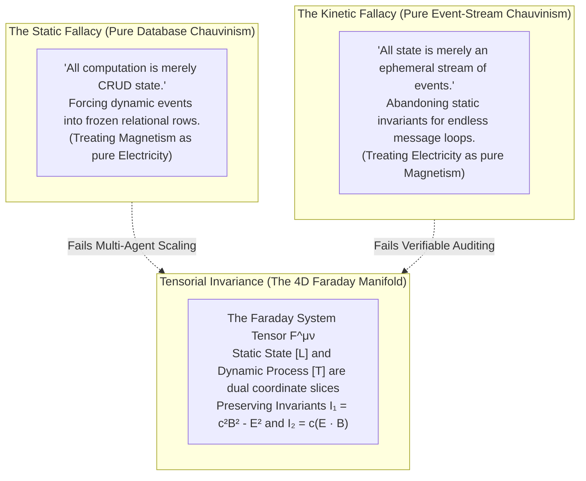

# Perspective and Referential Coordinates in Spacetime Compositionality

> *"What one observer perceives as a static spatial distribution of charge, another moving observer perceives as a dynamic circulating magnetic current. Neither perspective is privileged; true spacetime compositionality is the covariant algebra that glues disparate referential frames over geometric invariants."*

---

## 1. The Core Principle: Compositionality Beyond Frame Chauvinism

Traditional computing frameworks suffer from **Frame Chauvinism**—the unconscious assumption that there exists a single, privileged, global coordinate system (a centralized database, a global system clock, a monolithic orchestrator) against which all operations must be serialized. 

Grounded in **[[docs/sources/Dialect_Relativity_Unification_Electricity_Magnetism|Dialect's relativistic critique]]** and **[[docs/principles/Cordis_Spatiotemporal_Composability|Cordis spatiotemporal composability]]**, the *Prologue of Spacetime* rejects frame chauvinism. We define:

1. **Referential Coordinates**: The choice of local measurement axes, clock signals, and spatial bounds chosen by an agent or service to parameterize its environment.
2. **Perspective ($u^\mu$)**: The specific 4-velocity and state-trajectory of the observing agent, which determines how a 4-dimensional invariant manifold decomposes into a local 3-dimensional spatial slice ($[L]$ space) and an orthogonal 1-dimensional temporal flow ($[T]$ space).
3. **Spacetime Compositionality**: The mathematical guarantee that independently parameterized subsystems can be composed into a coherent global whole without requiring any agent to abandon its local referential frame. This composition is achieved not by forcing coordinate uniformity, but by preserving **tensorial and topological invariants** across coordinate transformations.

---

## 2. The Parable of the Parallelogram in Distributed Systems

In [[docs/sources/Dialect_Relativity_Unification_Electricity_Magnetism|Dialect's analysis]], an observer who transforms an oblique parallelogram into a square by a coordinate shear fallaciously claims that *"parallelograms do not exist; they are merely squares with perspective."* 

In software architecture, developers commit this exact error under two complementary disguises:

### The Crisis of the Multiple Observers
Just as Purcell's 1-charge wire model collapses when a **second test charge** with different velocity is introduced, an agent architecture that optimizes for a single observer fails as soon as concurrent autonomous agents interact:
- An observer at rest relative to an enclave sees a static token balance (pure electric field $\mathbf{E}$).
- An observer streaming through the network sees a rapid transaction flow (pure magnetic circulation $\mathbf{B}$).
- Introducing ten concurrent agents with different velocities means **no single reference frame can eliminate the magnetic or electric components for all agents simultaneously**.
- Therefore, software compositionality must be formulated over the **coordinate-free tensor**, not over local coordinate projections.

---

## 3. The 3+1 Spacetime Decomposition in the Cubical Logic Model (CLM)

The [[Hub/Theory/CLM/Foundations/Cubical Logic Model — Spatiotemporal Representation of Functions|Cubical Logic Model (CLM)]] structures computation along three orthogonal axes:

| CLM Axis | Physical Spacetime Analogue | Electromagnetic Manifestation | MCard Architecture |
|:---|:---|:---|:---|
| **Specification / Space ($[L]$)** | Spatial Hypersurface $\Sigma_\tau$ | Scalar Potential $\phi$ / Electric Field $\mathbf{E} = -\nabla \phi$ | **[[MCard]]** (Memory / Content-Addressed Schema) |
| **Implementation / Time ($[T]$)** | Worldline Parameter $\tau$ / 4-Velocity $u^\mu$ | Vector Potential $\mathbf{A}$ / Magnetic Field $\mathbf{B} = \nabla \times \mathbf{A}$ | **[[PCard]]** (Process / Petri Net Monad Engine) |
| **Expectation / Value ($[V]$)** | Gauge Freedom / Observer Reference Frame | Gauge Parameter $\Lambda(x)$ / Gauge Invariance $A_\mu \to A_\mu + \partial_\mu \Lambda$ | **[[VCard]]** (Value / Precondition & Attestation) |

An agent's **Perspective** is formalized as its timelike 4-velocity vector:
$$u^\mu = \frac{dx^\mu}{d\tau}, \quad u_\mu u^\mu = c^2$$

The observer projects any system tensor $T^{\mu\nu}$ into its local referential frame via projection operators:
- **Temporal Projection Operator**: $P_\parallel = \frac{u^\mu u^\nu}{c^2}$
- **Spatial Projection Operator**: $P_\perp = g^{\mu\nu} - \frac{u^\mu u^\nu}{c^2}$

What appears as "static memory" ($[L]$ space) is simply the projection of the invariant system manifold onto the agent's spatial hypersurface orthogonal to $u^\mu$. What appears as "active computation" ($[T]$ space) is the projection along $u^\mu$.

---

## 4. The Faraday System Tensor: Quantifying Multi-Agent Coupling

We formalize the state of any multi-agent cyber-physical network as a rank-2 antisymmetric **Faraday System Tensor** $F^{\mu\nu}_{\text{sys}}$:

$$F^{\mu\nu}_{\text{sys}} = \begin{pmatrix} 0 & -\nabla_x \Phi_{\text{backlog}} & -\nabla_y \Phi_{\text{backlog}} & -\nabla_z \Phi_{\text{backlog}} \\ \nabla_x \Phi_{\text{backlog}} & 0 & -J_z^{\text{flow}} & J_y^{\text{flow}} \\ \nabla_y \Phi_{\text{backlog}} & J_z^{\text{flow}} & 0 & -J_x^{\text{flow}} \\ \nabla_z \Phi_{\text{backlog}} & -J_y^{\text{flow}} & J_x^{\text{flow}} & 0 \end{pmatrix}$$

where:
- $\mathbf{E}_{\text{sys}} = -\nabla \Phi_{\text{backlog}}$: The "electric" gradient of unmet potential, queue pressure, or demand imbalance.
- $\mathbf{B}_{\text{sys}} = \nabla \times \mathbf{J}^{\text{flow}}$: The "magnetic" vorticity of circulating transaction flows, routing meshes, and ceremonial cadence loops.

### The Gauge-Invariant Systemic Scalars
Regardless of which observer frame, edge device, or cloud coordinator inspects the system, two scalar quantities evaluate to the exact same value:

1. **Systemic Energy Density Invariant**:
   $$I_1 = \frac{1}{2} F_{\mu\nu} F^{\mu\nu} = c^2 \|\mathbf{B}_{\text{sys}}\|^2 - \|\mathbf{E}_{\text{sys}}\|^2$$
   - When $I_1 > 0$, the system is **flow-dominated** (high kinetic throughput, dynamic routing). In no reference frame can transactional flow be halted to pure static tables.
   - When $I_1 < 0$, the system is **backlog-dominated** (high potential tension, unfulfilled intent).
2. **Systemic Coupling Invariant**:
   $$I_2 = \frac{1}{4} F_{\mu\nu} \tilde{F}^{\mu\nu} = c (\mathbf{E}_{\text{sys}} \cdot \mathbf{B}_{\text{sys}})$$
   - Represents the irreversible dissipation rate. When $I_2 = 0$, demand and flow are orthogonal, allowing transaction-free, frictionless coordination.

---

## 5. Spatiotemporal Composition via Cordis Fibers

How do we implement these relativistic insights in concrete software? Through **[[docs/principles/Cordis_Spatiotemporal_Composability|Cordis Spatiotemporal Composability]]**:

1. **Every Agent / Sprint is a Fiber**: A Cordis fiber $|f_i\rangle$ represents an autonomous execution context with its own referential coordinate system.
2. **Context Isolation (`ctx.isolate`)**: Protects the agent's spatial boundary, ensuring internal coordinate choices do not pollute sibling fibers.
3. **Reversible Lifecycle (`DisposableList`)**: Implements the temporal arrow of directionality ($\text{道}$), acquiring resources in sequence and releasing them in strict reverse LIFO order.
4. **Sheaf Gluing on Overlaps**: When two fibers interact, they compose via categorical spans and pushouts over their invariant SHA-256 MCard hashes, guaranteeing zero dangling references.

---

## 6. Significance for the 12 Sprints

Across the twelve sprints of the *Prologue of Spacetime*, players progress through a systematic deepening of referential coordinates:
- In **Sprint 01 (Tidepool)**, the player establishes their first referential origin ($1 \neq 0$).
- In **Sprint 04 (Consensus)**, players correlate disparate observer perspectives to collapse epistemic variance via parallax.
- In **Sprint 06 (Meshway)**, packets navigate dynamic spatial topologies where routing is a relativistic flow vector.
- In **Sprint 10 (Terrace Sheaf)**, local terrace coordinate charts glue into a global manifold with vanishing Čech cohomology ($H^1 = 0$).
- In **Sprint 12 (Impredicative Calendar)**, the three cosmic reference frames (Pawukon human cycle, Saka lunar cycle, Solar monsoon cycle) achieve stationary action under the Software Lagrangian.
