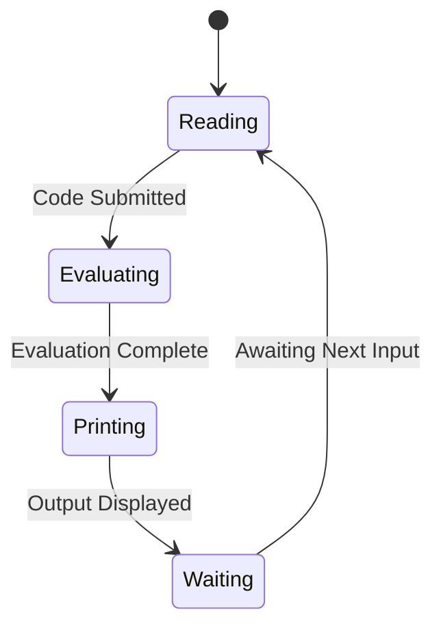

#programming_model#REPL #correctness

REPL stands for Read Evaluate Print Loop. It is an interactive programming environment that allows you to enter code, have it executed, and see the results immediately. One of the most popular applications that shocked the world is effectively a [[REPL]] application, [[ChatGPT]]. It demonstrates that [[Text is All You Need]]. A deeper way to understand [[REPL]] is to look at the work of [[Interaction Trees]] by [[Li-yao Xia]].


## REPL in Mermaid


The three main components of a REPL are:

1. Read: The REPL reads the code or input provided by the user.

2. Evaluate: The input is then evaluated or executed by the REPL. This involves interpreting or compiling the code and executing it.

3. Print: The result of the evaluation is printed or displayed to the user.

4. Loop: After displaying the result, the REPL goes back to step 1 and waits for more input from the user, creating a continuous loop.

REPLs are commonly used in interpreted programming languages like Python, JavaScript, Ruby, and others. They provide a convenient way for developers to test out code snippets, experiment with different ideas, and quickly see the output without having to write and execute a complete program.

In addition to executing code, REPLs often provide additional features such as history navigation (allowing you to access previously entered commands), tab completion (suggesting possible completions as you type), and error handling (displaying error messages if your code contains syntax or logic errors).

## REPL Feature Model

The following feature model illustrates the functional components of a robust REPL system (a diagram from [[@PrincipledApproachREPL]]), distinguishing between mandatory and optional features as well as their grouping logic.
  


## REPL and Software Correctness
The connection between Hoare triples and the [[REPL]] (Read-Eval-Print Loop) software implementation pattern lies in their focus on interactive programming and the verification of program [[Correctness|correctness]].

Hoare triples are a formal specification method introduced by [[Antony Hoare|Tony Hoare]] for reasoning about the correctness of computer programs. A Hoare triple consists of three components: a precondition, a program statement, and a postcondition. The precondition specifies the initial state or conditions that must hold before executing the program, while the postcondition describes the expected state or properties that should hold after the program execution. The Hoare triple asserts that if the precondition is true, and the program terminates, then the postcondition will be true.

Hoare triples provide a formal framework for reasoning about program correctness and verification. They enable programmers to express and verify properties of their code, ensuring that it behaves as intended and meets certain specifications. By systematically applying logical rules and reasoning principles, one can prove the correctness of a program with respect to its Hoare triple.

On the other hand, the REPL pattern is a software implementation pattern commonly used in programming language environments and development tools. REPL provides an interactive programming environment where users can enter code snippets, have them evaluated or executed, and see immediate results. It allows programmers to experiment, test code, and explore its behavior incrementally.

The connection between Hoare triples and the REPL pattern lies in their interactive nature and the iterative process they facilitate. In a REPL environment, developers can enter code fragments and immediately see the results or output. This interactive feedback loop enables rapid prototyping, debugging, and exploration of code behavior.

When it comes to Hoare triples, the interactive nature of the REPL pattern can be leveraged for program verification and testing. Programmers can construct code snippets that correspond to the preconditions, program statements, and postconditions of Hoare triples. By entering these snippets into the REPL, they can observe the output or behavior and check if it aligns with the expected postcondition.

The REPL pattern, with its interactive and iterative nature, allows programmers to incrementally build and verify program correctness based on the principles of Hoare triples. It provides an environment that supports a feedback loop, enabling programmers to refine their code, verify properties, and ensure that the program meets the desired specifications.

In summary, the connection between Hoare triples and the REPL pattern lies in their focus on interactive programming and the verification of program correctness. Hoare triples provide a formal specification method for reasoning about program correctness, while the REPL pattern offers an interactive environment for rapid code evaluation, debugging, and verification. Together, they provide a powerful combination for interactive programming and verification of code behavior.

Overall, REPLs are valuable tools for learning and prototyping as they provide an interactive environment where you can quickly try out code and see immediate results.

## REPL as the Closure Pattern for UPTV and Pure Time

The **[[Hub/Tech/Unifying Protocol of Truth Verification|UPTV]]** and the **[[Hub/Theory/Sciences/Computer Science/Programming Model/Algebra as the Science of Pure Time|Algebra of Pure Time]]** are operationalized through the REPL pattern. REPL is not merely a user interface; it is the **Structural Pattern for Arithmetized Closure of Causation**.

### The REPL-Conjugate Sandwich Correspondence

| REPL Phase | Conjugate Sandwich | Pure Time Role | UPTV Role |
|------------|-------------------|----------------|----------|
| **Read** | $V_{pre}$ (Pre-condition VCard) | Entry into the Closure Frame | Read Prior Belief (Input Token) |
| **Evaluate** | PCard (Transition Logic) | The Algebraic Operation | Fire Transition (Execute CLM) |
| **Print** | $V_{post}$ (Post-condition VCard) | The Closed Witness | Print Posterior Belief (Output Token) |
| **Loop** | $V_{post} \to V'_{pre}$ | The Succession in Time | Continue DCPO Chain |

### REPL as the Arithmetized Closure

From **[[Hub/Theory/Sciences/Computer Science/Programming Model/Algebra as the Science of Pure Time|Algebra as the Science of Pure Time]]**:
> **"Algebra as the Science of Pure Time is about creating a closure framing on causation."**

The **REPL Loop** is the operational manifestation of this closure:
1.  **The Frame**: Each REPL cycle ($R \to E \to P$) draws the boundary of a **Causal Interval**.
2.  **The Closure**: The "Print" phase produces a **VCard Witness**, which is the proof that the interval has been **algebraically closed**.
3.  **The Loop**: The succession $P \to R'$ represents the **Monotonic Chain** in the **[[../../../Category Theory/Logic/Glossary/DCPO|DCPO]]** (detailed in **[[./Formalizing REPL with DCPO|Formalizing the REPL as a DCPO]]**). The output of one cycle becomes the input of the next.

$$\boxed{\text{REPL} = \text{Read}(V_{pre}) \xrightarrow{\text{Evaluate}(P)} \text{Print}(V_{post}) \xrightarrow{\text{Loop}} \text{Read}(V'_{pre})}$$

### REPL as Petri Net Firing

In the **[[Hub/Theory/Sciences/Computer Science/Petri Net|Petri Net]]** model of **UPTV**:
*   **Read**: Check the Input Place; is the enabling token ($V_{pre}$) present?
*   **Evaluate**: If enabled, fire the Transition (PCard).
*   **Print**: Deposit the output token ($V_{post}$) in the Output Place.
*   **Loop**: The system is now in a new Marking, awaiting the next "Read."

### The REPL-PTR Isomorphism

**[[Permanent/Projects/PKC Kernel/PTR|PTR]]** (Polynomial Type Runtime) is the **Engine** that executes the REPL loop for CLMs:

| PTR Phase | REPL Phase | Operation |
|-----------|------------|----------|
| **`prep`** | **Read** | Load input MCards, validate $V_{pre}$ |
| **`exec`** | **Evaluate** | Execute the PCard/CLM logic |
| **`post`** | **Print** | Store output MCard, generate $V_{post}$ (VerificationVCard) |
| **`await`** | **Loop** | Record in `handle_history`, await next invocation |

This makes PTR a **Principled REPL for Verifiable Computation**.

### Implications for Correctness

From **[[Hub/Theory/Category Theory/Logic/Correctness|Correctness]]**:
*   **Soundness**: If the REPL "Prints" a $V_{post}$, the computation was valid. (No false positives.)
*   **Completeness**: If the computation was valid, the REPL will eventually "Print" a $V_{post}$. (No false negatives.)
*   **Safety**: The "Read" phase ensures no transition fires without a valid pre-condition. (Nothing bad happens.)
*   **Liveness**: The "Loop" phase ensures the system continues to accept new inputs. (Something good eventually happens.)

### The Universal Property of the REPL

The REPL cycle is not just a loop; it is a sequence of **Universal Constructions** that transform an initial state into a terminal witness. In the **[[Permanent/Projects/PKC Kernel/PTR|PTR]]** kernel, this is formalized as the **Universal Firing Rule**:

1.  **Read ($\text{id} \circ \iota_\emptyset$)**: Uses the **Initial Object** property. If no input exists, the unique map defines a "Wait" or "Empty" behavior.
2.  **Evaluate ($f$)**: The **Morphism**. The specific logic that preserves identity while transforming data.
3.  **Print ($[g, h]$)**: Uses the **Coproduct (Sum Type)** property. The output is a choice between success and failure, uniquely determined by the execution path.
4.  **Loop ($!$)**: Uses the **Terminal Object** property. The completion of a cycle produces a unique witness ($V_{post}$) that "closes" the frame and points to the next "Read."

This mapping ensures that a REPL implementation is **Structural** rather than merely **Procedural**. By adhering to this universal pattern, the REPL becomes a **Verifiable Interaction Tree** capable of expressing any possible scenario of function execution.

---

### See Also
*   **[[Hub/Theory/Integration/The Universal Interaction Cycle - REPL and Request-Response|The Universal Interaction Cycle]]** — How REPL and Request-Response are two instances of the same universal pattern.
*   **[[Hub/Theory/Sciences/Computer Science/Programming Model/Request and Response Loop|Request and Response Loop]]** — The distributed, networked sibling of REPL.
*   **[[Hub/Theory/Sciences/The Architecture of Continuous Flow|The Architecture of Continuous Flow]]** — How Flux + REPL = Continuous Flow.
*   **[[Permanent/PKM/Tools/Flux|Flux]]** — The Unidirectional Constraint (Path of Least Action).
*   **[[Hub/Tech/Flux, Least Action, and SSOT - A Unified Theory|Flux, Least Action, and SSOT - A Unified Theory]]** — The theoretical synthesis.
*   **[[Hub/Tech/Unifying Protocol of Truth Verification|UPTV]]** — The protocol that REPL operationalizes.
*   **[[Hub/Theory/Sciences/Computer Science/Programming Model/Algebra as the Science of Pure Time|Algebra as the Science of Pure Time]]** — The theory of Closure that REPL implements.
*   **[[Permanent/Projects/PKC Kernel/PTR|PTR]]** — The runtime engine that IS the REPL for CLMs.
*   **[[Hub/Theory/Category Theory/Logic/Correctness|Correctness]]** — The Galois structure verified by the REPL cycle.
*   **[[Permanent/Concepts/Universal MCard Cataloging and the Function-Number REPL|Universal MCard Cataloging and the Function-Number REPL]]** — Synthesis of the REPL and Function-Number Duality for dynamic catalogs.


### REPL and Operating System Kernel

The kernel of an operating system and the notion of REPL ([[Read-Evaluate-Print Loop]]) are two distinct concepts, but they can be related in certain contexts, especially in the context of operating system development and interaction with the operating system.

1. Kernel of Operating Systems:
The kernel is the core component of an operating system. It is responsible for managing the system's resources, providing essential services, and serving as an interface between the hardware and the higher-level software components. The kernel handles tasks such as memory management, process scheduling, device drivers, and system calls, among others. It operates in a privileged mode, allowing it to access hardware and perform critical operations that regular user-level processes cannot.

2. REPL (Read-Eval-Print Loop):
A REPL is an interactive programming environment that allows users to enter commands or expressions, which are then read, evaluated, and printed back to the user. It is commonly used in interpreted programming languages, such as Python, Ruby, and Lisp, to provide an interactive way for developers to test and experiment with code snippets or small programs. In a REPL, each input is read, parsed, executed, and the result is printed, creating a continuous loop of interaction.

Now, let's explore how the kernel and REPL can be related:

1. Command-Line Interfaces (CLI):
Some operating systems provide command-line interfaces where users can interact with the operating system using text-based commands. When users enter commands into the CLI, the kernel is responsible for interpreting those commands and performing the necessary operations. In this context, the kernel acts as an intermediary between the user and the operating system, handling low-level tasks on behalf of the user.

2. User Space and Kernel Space Interaction:
In some situations, a REPL environment might interact with the kernel to perform certain tasks. For example, when you use a programming language's REPL, such as Python or Ruby, you can issue commands that interact with the operating system, such as reading files, creating processes, or accessing hardware. The kernel, as the core of the operating system, handles these system calls and facilitates the interaction between the user space (where the REPL runs) and the kernel space.

3. Kernel Development and Testing:
When developing or debugging the kernel itself, developers often use a specialized form of REPL called a "kernel debugger." This tool allows developers to interactively inspect and modify the kernel's state during runtime, aiding in debugging and understanding the kernel's behavior.

4. Request and Response Loop over the web APIs:
It is well known that web browsers interact with web server through a [[Request and Response Loop]]. This mechanism is very similar to [[REPL]] and should be managed and developed accordingly.

In summary, while the [[Kernel]] of an operating system and the notion of REPL are separate concepts, they can be related in terms of user interaction with the operating system, command-line interfaces, and debugging and development of the kernel itself. The kernel serves as the underlying core of the operating system, managing resources and providing services, while a REPL offers an interactive programming environment for testing and experimenting with code.

# References
```dataview 
Table title as Title, authors as Authors
where contains(subject, "REPL") or contains(subject, "Interaction Tree") or contains(subject, "rewrite")
```
