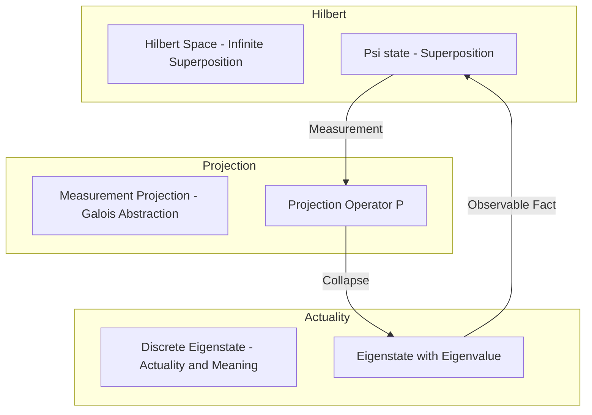
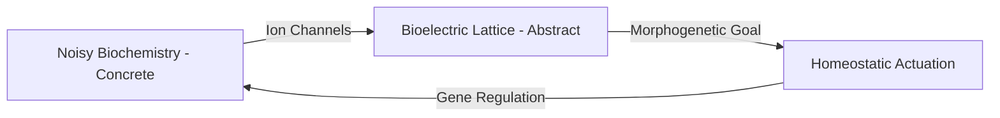
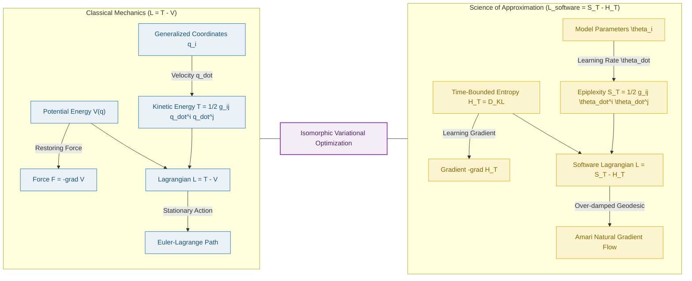
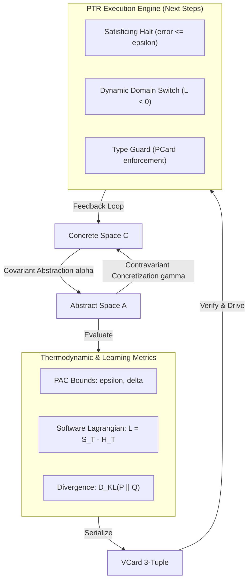

# The Science of Approximation: Sound Semantics from Infinite States

> **"Meaning is obtained through successive sound projections. We do not compute infinite reality; we approximate it to make it navigable."**

---

## 1. Order-Theoretic Foundations (Computer Science)

In denotational semantics and static analysis, the concrete behavior of programs resides in uncomputable, infinite-state spaces. The Science of Approximation addresses this via **[[./Abstract Interpretation | Abstract Interpretation]]**:

$$\boxed{\alpha(c) \sqsubseteq a \iff c \sqsubseteq \gamma(a)}$$

Where:
*   **Concrete Domain ($C$)**: The fully detailed, infinite, or uncomputable representation of states.
*   **Abstract Domain ($A$)**: A simplified poset lattice $\langle A, \sqsubseteq, \sqcup, \sqcap, \top, \bot \rangle$ representing sound over-approximations.
*   **Abstraction Functor ($\alpha : C \to A$)**: Maps concrete states to abstract properties.
*   **Concretization Functor ($\gamma : A \to C$)**: Maps abstract properties back to conservative concrete states.

### Scott Domains and Fixed-Point Iteration
To compute program properties, we analyze monotonic functions over Directed Complete Partial Orders (DCPOs). For infinite-height lattices, Kleene fixed-point iteration may not terminate. We introduce:
*   **Widening ($\nabla$)**: An operator that accelerates convergence to a post-fixed point ($F^\sharp(x) \sqsubseteq x$), guaranteeing termination by over-approximating infinite chains (satisficing halt).
*   **Narrowing ($\Delta$)**: Refines the over-approximation to restore precision without violating soundness.

This order-theoretic projection demonstrates how abstract domains act as a semantic lens, discarding irrelevant details to render program properties decidable.

### Type-Theoretic Safety: Making Illegal States Unrepresentable
In the study of **[[../../Category Theory/Logic/Type Theory/Type Systems - Navigation Index|Type Systems]]** and **[[../../Category Theory/Logic/Glossary/Logic|Logic]]**, type safety is governed by the principle of **[[../../Category Theory/Logic/Glossary/Make illegal states unrepresentable|Making Illegal States Unrepresentable]]** (originally coined by [[../../../../Literature/People/Yaron Minsky|Yaron Minsky]] and popularized in functional programming). From the perspective of the Science of Approximation, a type system is a discrete Galois connection over a program's concrete values:
*   **Compile-Time Types as Abstract States**: Types represent regions in the concrete value space (e.g., the type `Int` abstracts all integer bit-patterns).
*   **Illegal States as Out-of-Bounds Domains**: By designing the abstract lattice such that invalid states (e.g., null dereferences, invalid type mismatches) fall outside the image of the abstraction functor $\alpha$ or map directly to $\top$ (static type errors), the type system makes those states statically unrepresentable.
*   **Logic and Sound Projections**: Under the Curry-Howard isomorphism, type checking is dynamic proof verification. Sound approximation guarantees that if type checking succeeds in the abstract domain, concrete execution is free from the represented class of errors.

By formalizing type safety as a Galois connection, we show that type theory is a specialized branch of approximation logic. Program correctness is achieved not by checking states at runtime, but by compiling safety directly into the algebraic structure of the abstract domain.

### Bottom-Up Emergent Abstraction: The Unix Genesis

In the history of software engineering, the creation of the **Unix operating system** (see [[../../../../Literature/Reading notes/@Thompson_Accidental_Unix|Thompson on how a disk scheduling algorithm accidentally became Unix]]) represents a direct case study of bottom-up emergent abstraction:
* **The Concrete Domain ($C$)**: The highly complex, hardware-specific optimization of physical drum/disk rotation and head seek positions on the PDP-7 computer.
* **The Abstraction Functor ($\alpha$)**: To test his disk scheduling algorithms, Ken Thompson wrote test programs and a simple coordinating multiplexer. Without a top-down plan to build an OS, this coordination layer naturally generalized ($\alpha$) into a universal platform (Unix). 
* **Multics as Over-Specification**: By contrast, the **Multics** project represented a top-down, hyper-specified, bureaucratic approach—an attempt to enforce completeness without prior bottom-up grounding. This resulted in an uncomputably large state space, leading to its cancellation. Unix represents the success of starting from a concrete, localized utility and soundly approximating a general-purpose abstraction.

---

## 2. Quantum Mechanics as Measurement Projection

Historically seen as particle physics, **[[../Quantum Mechanics/Quantum mechanics|Quantum Mechanics]]** is mathematically a data-intensive methodology for processing continuous state spaces under extreme uncertainty. It represents the physical manifestation of the Science of Approximation:

Diagram: The Quantum Measurement Pipeline as Galois-connected approximation.

### Infinite Hilbert Potential vs. Discrete Measurement
1.  **The Superposition ($H$)**: A physical system exists as a wave function $|\psi\rangle$ inside an infinite-dimensional [[../Quantum Mechanics/Hilbert Space|Hilbert Space]]. This represents the uncollapsed concrete potential—infinite, continuous, and unobservable.
2.  **The Projection ($P$)**: A measurement acts as a projection operator $P_i = |\phi_i\rangle\langle\phi_i|$ onto a lower-dimensional subspace. This is a sound over-approximation that collapses the infinite superposition into a discrete, observable eigenstate $|\phi_k\rangle$ with probability $P(k) = |\langle\phi_k|\psi\rangle|^2$.
3.  **The Semantic Assignment**: Measurement does not "discover" a pre-existing classical state. It is a mathematical mapping that assigns **discrete meaning** (eigenvalues) to continuous, phase-entangled probability fields. The continuous quantum flux is Galois-approximated into discrete classical parameters.

---

## 3. Biosemiotic Abstraction: The TAME Framework

In biology, the **[[../Biology/TAME|TAME]]** (Technological Approach to Mind Everywhere) framework proposed by [[../../../../Literature/People/Michael Levin|Michael Levin]] describes how cells self-organize into complex morphology. This morphogenetic control is an evolutionary application of the Science of Approximation.

### Bioelectric Membrane Potentials as Abstract Domains
Biological tissue is a chaotic, noisy biochemical environment. To compute and maintain a target body shape during regeneration and development, cellular collectives cannot rely on micro-managing every molecule. Instead, they abstract the local chemical state space:
*   **The Concrete Domain**: High-dimensional, stochastic biochemical reaction-diffusion pathways within and between cells.
*   **The Abstract Domain**: The developmental bioelectric network. Cells express resting membrane potentials ($V_{mem}$) that form a steady-state voltage lattice across tissues.
*   **The Galois Connection**: The bioelectric voltage pattern is a sound abstraction ($\alpha$) of the underlying molecular state. It stores the "pattern memory" (target morphology). Cells read this voltage lattice and adjust their ion channels and gene expression ($\gamma$) to repair tissues.

Diagram: Bioelectric feedback loop as a Galois connection.

By shifting morphogenesis to a top-down control problem, bioelectric networks function as an **anatomical software compiler**. TAME shows that nature uses Galois-connected approximation to preserve organismal shape invariants despite persistent molecular turnover and environmental trauma.

---

## 4. Epistemological Translation: Latour's Circulating Reference

In the sociology and philosophy of science, **[[../../../../Literature/People/Bruno Latour|Bruno Latour]]**'s concept of **circulating reference** (detailed in *Pandora's Hope*) provides an empirical, epistemological model for how facts are stabilized and verified. Rather than viewing scientific truth as a direct, unmediated copy of reality, Latour shows that reference is maintained through a continuous chain of translations:

Diagram: Latour's circulating reference chain as sequential translations.

*   **The Chain of Translations**: Moving from the concrete forest floor to the final published text involves a series of transitions. At each node, we observe:
    1.  *Reduction (Loss of Matter)*: We abandon the concrete, physical soil in the forest. This is the Abstraction functor ($\alpha$).
    2.  *Amplification (Gain of Form)*: We gain standardized representation, mathematical calculability, and transportability (the soil becomes a code on a lattice). This is the Concretization functor ($\gamma$) mapping to standard classifications.
*   **Unbroken Soundness as Facthood**: The truth of the final statement does not reside in the words alone, but in the **unbroken chain of these translations**. As long as every step is soundly connected and verifiable (analogous to cryptographic VCard seals in a PKC mesh), we can trace the logic backward to the concrete soil or forward to the abstract map. Facthood is a sound approximation maintained by a continuous, verified network.

---

## 5. The Bifurcation of Meaning: Physical and Social Dimensions of Data

The Science of Approximation functions as the underlying engine that assigns semantic boundaries to data. This process bifurcates into two complementary modes of meaning-assignment:

### 5.1 Physical Meaning of Data (Reducibility and Representation)
As detailed in **[[../SoG/Physical Meaning of Data|Physical Meaning of Data]]**, data acquires physical meaning when its computational representation reflects the **reducibility structure** of the underlying physical phenomenon:
*   *Decomposable Data (Classical)*: Whole = sum of parts. Represented as product types and tabular relational DB records.
*   *Holistic Data (Quantum/Irreducible)*: Whole $\neq$ sum of parts. Represented as complex amplitudes and high-dimensional vector embeddings.
*   *Approximation Constraint*: Physical meaning maps continuous physical states into dimensionally typed namespaces (using constants like space-time $c$ or quantum action $\hbar$ as type bridges). It is a Galois connection projecting uncomputable physical states into discrete, intrinsic properties (such as Merkle hashes).

### 5.2 Social Meaning of Data (Consensus and Accountability)
As detailed in **[[../SoG/Social Meaning of Data|Social Meaning of Data]]**, data acquires social meaning when it is bound to socially-liable identities and stabilized under network operations:
*   *The Relational Profile (Yoneda)*: In accordance with the Yoneda Lemma, the social meaning of a dataset is defined by its interactions—how it is queried, combined, and audited across the mesh network.
*   *Approximation Constraint*: Social meaning is the stabilization of infinite, fluid interpretations ("Science in the Making") into a stable, black-boxed consensus ("Ready-Made Science"). This consensus represents a poset fixed-point under repeated social operations, verified by cryptographic credentials (VCards).

---

## 6. The Direction of Approximation: Metrics and State Encoding

To operationalize the Science of Approximation, we must formalize two key concepts: the **direction** of the abstraction arrow, and how the **state of approximation** is quantitatively measured and transmitted to drive downstream computations.

### 6.1 The Categorical Arrow of Approximation
Under the principles of **[[../../Category Theory/Directionality|Directionality]]**, approximation is never symmetric; it is a directed, order-preserving arrow. In a Galois connection, this is represented by adjoint functors:

$$\alpha(c) \sqsubseteq a \iff c \sqsubseteq \gamma(a)$$

*   **Covariant Abstraction ($\alpha : C \to A$)**: The primary causal arrow. It scales *with* the direction of semantic compression. Abstraction maps high-dimensional, concrete inputs to lower-dimensional, discrete invariants, discarding irrelevant details (reducibility).
*   **Contravariant Concretization ($\gamma : A \to C$)**: Reverses the primary flow, injecting constraints *against* the abstraction to map the boundaries of the simplified model back onto concrete reality.

In terms of **[[../../Category Theory/Polynomial functor|Polynomial Functors]]** ($P = \sum_B A_B Y^B$), this division maps onto:
*   **Positions ($P_0$)**: The covariant contexts where the approximation arrives.
*   **Directions ($P'$)**: The contravariant query spaces or output transitions that the system demands to proceed.

Non-commutativity is the indicator that this arrow is real: once a concrete state is projected into an abstract domain, returning via concretization yields a conservative over-approximation ($c \sqsubseteq \gamma(\alpha(c))$), representing information lost to the null space.

### 6.2 Thermodynamic and Statistical Metrics
We establish three categories of metrics to determine our position along the approximation arrow, serving as a compass for the quality of our abstraction:

#### 1. Probably Approximately Correct (PAC) Bounds
Drawing from **[[../../../../Literature/PKM/Workflow/Probably Approximately Correct|Probably Approximately Correct]]** (PAC) learning, we bound the quality of our approximation using two parameters:
*   **Accuracy ($\epsilon$)**: The maximum allowable error margin of our abstract representation.
*   **Confidence ($\delta$)**: The probability that our approximation fails to remain within $\epsilon$.

The convergence of abstract fixed points (using widening $\nabla$ and narrowing $\Delta$) mirrors the sample complexity of PAC learning. The direction of approximation is guided by minimizing $\epsilon$ and $\delta$, guaranteeing that with probability at least $1 - \delta$, the abstract domain soundly bounds concrete reality.

#### 2. The Software Lagrangian (Variational Formulation of L = T - V)
The **[[../../Integration/Software-Lagrangian|Software Lagrangian]]** ($L_{\text{software}}$) operationalizes the **[[../Quantum Mechanics/Least Action Principle|Least Action Principle (LAP)]]** by showing that a system's search for a sound approximation follows a physical geodesic trajectory. In physical mechanics, the Lagrangian is defined as kinetic minus potential energy: $L = T - V$, as detailed in **[[../Physics/Lagrangian Mechanics|Lagrangian Mechanics]]**. We map this structure directly to the metrics of information theory and computational learnability:

$$L_{\text{software}} = S_T - H_T$$

##### I. Generalized Coordinates ($q_i \longleftrightarrow \theta_i$)
In classical mechanics, the state of the system is defined by generalized coordinates $q_i$ inside a configuration manifold. In the Science of Approximation, the coordinates are the **approximation parameters** $\theta_i$ (e.g. hypothesis space weights, active classification boundaries, or tissue membrane resting potentials $V_{mem}$) that locate the current model within the abstract domain.

##### II. Kinetic Energy as Epiplexity ($T \longleftrightarrow S_T$)
In mechanics, kinetic energy $T = \frac{1}{2} g_{ij}(q) \dot{q}^i \dot{q}^j$ measures the rate of motion across coordinates weighted by the spatial metric tensor. In approximation, **[[../../../Tech/Epiplexity|Epiplexity]]** ($S_T$) acts as the **kinetic energy of active learning and adaptation**:
$$T(\theta, \dot{\theta}) = S_T = \frac{1}{2} g_{ij}(\theta) \dot{\theta}^i \dot{\theta}^j$$
where $g_{ij}(\theta)$ is the **Fisher Information Metric (FIM)** (the native informational curvature of the statistical manifold) and $\dot{\theta}^i = \frac{d\theta^i}{dt}$ is the parameter velocity—the rate at which the agent adapts its approximation.

##### III. Potential Energy as Entropy ($V \longleftrightarrow H_T$)
In mechanics, potential energy $V(q)$ represents the restoring forces of the configuration landscape. In approximation, **[[../Entropy|Time-Bounded Entropy]]** ($H_T$) behaves as the **potential energy field of representation mismatch**:
$$V(\theta) = H_T(\theta) = D_{KL}(P \parallel Q_\theta)$$
representing the relative entropy (KL divergence) between the concrete truth distribution $P$ and the abstract model $Q_\theta$.

##### IV. The Action Geodesic and Natural Gradient
By demanding that the computational action $S = \int (S_T - H_T) \, dt$ is stationary ($\delta S = 0$), the Euler-Lagrange equations yield:
$$\ddot{\theta}^k + \Gamma_{ij}^k \dot{\theta}^i \dot{\theta}^j = - g^{kl} \frac{\partial H_T}{\partial \theta^l}$$
In highly constrained, high-friction runtime sandboxes (the **over-damped limit**), the second-order velocity term ($\ddot{\theta}$) is suppressed, causing the system's equations of motion to collapse exactly into **Amari's Natural Gradient Descent**:
$$\dot{\theta}^k = - \eta \, g^{kl}(\theta) \frac{\partial H_T}{\partial \theta^l}$$
This proves that natural gradient optimization is the physical geodesic of least computational action, pulling the approximation parameters along the Fisher Riemannian curvature toward the ground state ($H_T \le \epsilon$).

##### V. The Classical-to-Computational Dictionary

| Variational Component | Classical Mechanics ($L = T - V$) | Science of Approximation ($L_{\text{software}} = S_T - H_T$) |
| :--- | :--- | :--- |
| **Coordinates** | Generalized Coordinates $q_i$ (positions) | Model parameters / voltage targets $\theta_i$ |
| **Velocity** | Coordinate velocity $\dot{q}_i$ | Rate of learning / parameter update $\dot{\theta}_i$ |
| **Kinetic Term ($T$)** | Kinetic Energy: $\frac{1}{2} g_{ij} \dot{q}^i \dot{q}^j$ | Epiplexity ($S_T$): FIM parameter work $\frac{1}{2} g_{ij} \dot{\theta}^i \dot{\theta}^j$ |
| **Potential Term ($V$)** | Field potential $V(q)$ | Time-bounded entropy / representation mismatch $H_T(\theta) = D_{KL}$ |
| **Force** | Mechanical force $F = -\nabla V$ | Learning gradient $-\nabla H_T$ pulling model toward convergence |
| **Geodesic Path** | Euler-Lagrange equations | Amari's Natural Gradient flow |
| **Symmetry** | Spatiotemporal symmetries (Noether) | Operational invariants (idempotency, referential transparency) |
| **Conserved Quantity** | Energy, Momentum, Charge | Sealed VCard proofs (Fixed-point consistency) |

Diagram: Isomorphism between physical Lagrangian mechanics and the Software Lagrangian of approximation.

#### 3. Information Divergence
*   **Relative Entropy ($D_{KL}(P \parallel Q)$)**: Quantifies the pointwise statistical distance between the true concrete distribution $P$ and the abstract model $Q$. The direction of approximation minimizes $D_{KL}$, pulling the model vertically closer to the concrete boundary.
*   **Mutual Entropy ($I(X; Y)$)**: Measures the shared dependency of elements (tokens) flowing through the system's transitions, ensuring the structural connections in the abstract network are statistically robust.

### 6.3 Encoding the Approximation State for Downstream Execution
For the "next steps" (process execution/action) to consume an approximation, its state must be serialized. We encode the state as a 3-tuple:

$$\text{State}_{\text{approx}} = \langle A, \text{metrics}(\epsilon, \delta, L_{\text{software}}, D_{KL}), \text{iter} \rangle$$

Where:
*   $A$ is the active abstract domain identifier.
*   $\text{metrics}$ is the current vector of evaluation scores.
*   $\text{iter}$ is the fixed-point iteration count.

This tuple is packaged into a cryptographically sealed **VCard** (Verification Card). The downstream execution engine (such as the **[[../../CLM/PTR/PTR Execution Engine CLM|PTR Execution Engine]]**) reads the VCard and enforces three control policies:

1.  **Satisficing Halt**: The engine halts further refinement loops (e.g., stopping Kleene iteration) the moment the metrics satisfy the bounds ($D_{KL} \le \text{threshold}$ or error $\le \epsilon$), minimizing total computational action ($S = \int L \, dt$).
2.  **Dynamic Domain Switching**: If $L_{\text{software}}$ drops below zero, the engine rejects the VCard and dynamically switches to a wider abstract domain (increasing precision) or triggers a narrowing operator ($\Delta$).
3.  **Type Safety Guards**: Under Curry-Howard, the VCard functions as a proof witness. Downstream transitions (defined by **PCards**) demand a specific level of approximation. If the VCard's metrics do not satisfy the PCard's prerequisites, the execution is blocked, **making illegal execution states unrepresentable**.

Diagram: The category-theoretic approximation arrow, metric evaluation, and VCard-driven execution loop.

---

## 7. Synthesis: The Approximation Matrix

The Science of Approximation operates across four levels of representability, mapping concrete continuous noise to abstract discrete semantics:

| Domain | Concrete Space ($C$) | Abstraction Mechanism ($\alpha$) | Abstract Space ($A$) | Directional Metric / Constraint | Sound Invariant |
|---|---|---|---|---|---|
| **Computer Science** | Infinite trace semantics | Galois Connection ($\alpha \dashv \gamma$) | Complete Lattice / LHoTT Types | PAC Bounds $(\epsilon, \delta)$ & Type Guards | Type Safety & Program Correctness |
| **Quantum Physics** | Infinite-dimensional Hilbert superposition $\vert \psi\rangle$ | Measurement Projection ($P_i$) | Discrete Eigenstates $\vert \phi_k\rangle$ | Wave-function Projection ($P$) & $D_{KL}$ | Conservation Laws (Unitary Symmetry) |
| **Biology (TAME)** | Stochastic Biochemical gradients | Membrane Voltage Gating ($V_{mem}$) | Bioelectric attractors (Target Shape) | Bioelectric gradients & Attractor Convergence | Anatomical Homeostasis |
| **Sociology of Science** | Infinite empirical reality (soil/matter) | Circulating Reference (Translation) | Inscriptions / Labeled Lattices | Chain of reference stability & VCard Signatures | Unbroken Chain of Reference (Facthood) |

Through this matrix, we establish that **meaning is obtained through successive approximation**. Whether verifying a program, measuring a subatomic state, regenerating a limb, or stabilizing a scientific fact, the system relies on sound projections to make infinite complexity navigable.

---

## See Also
*   [[./Abstract Interpretation | Abstract Interpretation]] — Calculational foundations of Galois connections
*   [[../Quantum Mechanics/Quantum mechanics|Quantum Mechanics]] — Quantum states as probability inference
*   [[../Biology/TAME|TAME]] — Scale-free cognition and bioelectric operating systems
*   [[../../Integration/Science in Action - The Path Integral of Truth|Science in Action]] — The Latourian stabilization of facts
*   [[../../../../Literature/People/Bruno Latour|Bruno Latour]] — Philosopher profile and biography
*   [[../SoG/Physical Meaning of Data|Physical Meaning of Data]] — Reducibility and representation of physical systems
*   [[../SoG/Social Meaning of Data|Social Meaning of Data]] — Consensus and identity verification in data networks
*   [[../../Integration/The Representability Quartet - Physical Meaning Data Math and Structure|The Representability Quartet]] — Core representability framework
*   [[../../../Tech/PKC as an Autonomous Mesh Network|PKC as an Autonomous Mesh Network]] — Decentralized state consensus
*   [[../../Category Theory/Directionality|Directionality]] — The Covariant-Contravariant directional catalog
*   [[../../Integration/Software-Lagrangian|Software Lagrangian]] — Thermodynamic geodesic of computational action
*   [[../../../../Literature/PKM/Workflow/Probably Approximately Correct|Probably Approximately Correct]] — Bounds on learnability and fixed-point accuracy
*   [[../../../Tech/Epiplexity|Epiplexity]] — Observer-dependent learnable structural extraction
*   [[../Entropy|Entropy]] — Expressive freedom and statistical dispersion
*   [[../../Integration/Universal Context, Boundaries, and Tokenization|Universal Context, Boundaries, and Tokenization]] — Synthesizing context boundaries and tokenization
*   [[../../../../Literature/Reading notes/@Soma_Consumer_NLOS_Imaging|Somasundaram et al. (2026) - Consumer NLOS Imaging]] — Real-time non-line-of-sight tracking on consumer LiDAR

