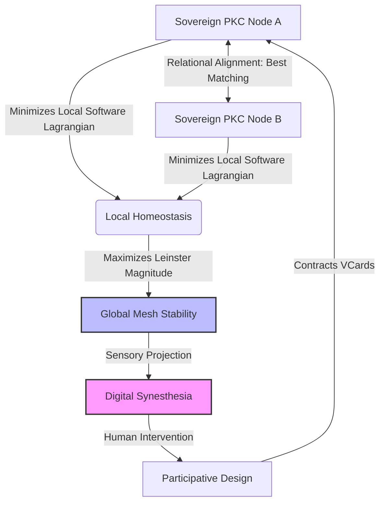

# Sovereign Truth and Sustainable Swarms: The PKC Mesh as a Living Agentic OS

> **Abstract**: Traditional distributed agent systems suffer from thermodynamic and informational decay, collapsing into high-entropy semantic drift and excessive administrative overhead. This article outlines the design of a sustainable, scale-free **Agentic OS** running as a sovereign mesh of **[[Literature/PKM/Tools/Open Source/Personal Knowledge Container|Personal Knowledge Containers (PKCs)]]**. By linking the mathematical coordinates of the **[[Hub/Theory/Integration/Measuring the Size of Truth|Measuring the Size of Truth]]** framework—specifically **[[Hub/Tech/Computational Trinitarianism|Computational Trinitarianism]]**, Spivak's polynomial functors, **[[Permanent/Concepts/Combinatorial Species|Combinatorial Species]]**, and Leinster Magnitude—with **[[Literature/People/Julian Barbour|Julian Barbour]]**'s **[[Hub/Theory/Sciences/Shape Dynamics|Shape Dynamics]]**, we demonstrate how a localized, relational state space avoids central-clock synchronization overhead. We show that this architecture minimizes the **[[Hub/Theory/Integration/Software-Lagrangian|Software Lagrangian]]** to achieve global **[[Hub/Theory/Sciences/SoG/Homeostasis|Homeostasis]]** and provides the necessary variety to operationalize **[[Literature/PKM/Tools/Participative Design|Participative Design]]** and the **[[Hub/Theory/Sciences/SoG/Science of Governance|Science of Governance]]**.

---

## 1. The Thermodynamics of Centralization vs. Sovereign Mesh

Centralized agent operating systems and classical distributed consensus architectures are thermodynamically unsustainable. As the number of active agents $N$ scales, two fundamental limits are breached:

1. **Shannon Entropy Accumulation ($H_T \to \infty$)**: The unconstrained, asynchronous interactions of agents produce an exponential state-space expansion. In the absence of relational boundary constraints, this results in rapid semantic drift, unverifiable execution paths, and cognitive pollution, driving the system toward high-entropy chaos.
2. **Administrative Overhead (Tinbergen Rule Violation)**: A centralized controller attempting to enforce consistency across a swarm must continuously poll, lock, and coordinate states. The communication complexity scales as $\mathcal{O}(N^2)$, meaning the system consumes its entire energetic and computational budget merely executing administrative overhead rather than performing productive work.

The **PKC Mesh** resolves this by operating as a decentralized, scale-free **Agentic OS** composed of sovereign nodes. Each PKC is an independent cell that encapsulates its local database, code files, and identity keys, running as a localized **[[Hub/Theory/Sciences/Computer Science/Ecorithm|Ecorithm]]**. Instead of enforcing a forced, global schema—which violates Scott's legibility constraint and collapses system diversity—the mesh relies on relational invariants to coordinate actions.

This localization maps directly to **[[Literature/People/Michael Levin|Michael Levin]]**'s **[[Hub/Theory/Sciences/Biology/TAME|TAME]]** framework: each PKC node restricts its **[[Hub/Theory/Sciences/Biology/TAME#2. The Cognitive Light Cone|Cognitive Light Cone]]** to its local resource boundary. An agent does not subscribe to the entire global state; instead, it manages its local goals (representing its specific spatial-temporal horizon of care) and communicates with neighbors via message passing, minimizing Landauer heat dissipation and avoiding centralized coordination collapses.

---

## 2. The Mathematical Coordinates of Sovereign Truth

To maintain a sustainable equilibrium without central control, the PKC Mesh relies on four mathematical pillars derived from the **[[Hub/Theory/Integration/Measuring the Size of Truth|Measuring the Size of Truth]]** framework:

### 2.1 Spivak Polynomial Functors: Sovereign Boundaries
Every PKC node defines its input/output capabilities using a David Spivak polynomial functor:
$$p = \sum_{i \in I} y^{E_i}$$
* The set $I$ represents the internal positions (the sovereign states of the PKC, mapped as SQLite schemas and local Markdown files).
* The exponent $E_i$ represents the directional inputs (actions, API calls, or conversational prompts) acceptable in state $i$.

The morphism of polynomials $p \to q$ defines the exact routing of information, ensuring that a node only processes inputs that match its structural interface.

### 2.2 Combinatorial Species: Concurrency and Reconfiguration
The reconfiguration of the mesh is modeled as algebraic operations (addition, multiplication, substitution) on André Joyal's **[[Permanent/Concepts/Combinatorial Species|Combinatorial Species]]**. Each agent group represents a species $F$ acting on a set of resources. The decomposition of these species determines the concurrent invariants of the system, mathematically mapped to Petri Net places and transitions. 

By checking the **P-invariants ($x^{\top} D = 0$)** and **T-invariants ($D\,y = 0$)** of the Petri Net incidence matrix, the mesh verifies that resources (tokens) are conserved and execution sequences are repeatable.

### 2.3 Leinster Magnitude: Systemic Variety
Ashby's Law of Requisite Variety states that a system's regulator must possess at least as much variety as the system itself. The variety of the PKC Mesh is formalized as the **Leinster Magnitude** ($M(X)$) of the metric space of its active states. For a set of states $X = \{x_1, \dots, x_n\}$ with a similarity matrix $Z_{ij} = e^{-d(x_i, x_j)}$, the magnitude is:
$$M(X) = \sum_{i=1}^n v_i, \quad \text{where } Z\,v = 1$$
Leinster Magnitude measures the "maximum effective diversity" of the system. If the mesh is homogenized by a centralized controller, $M(X) \to 1$ (variety collapse). If the mesh drifts into chaos, the similarity matrix degenerates. Sustainability requires maximizing $M(X)$ within the bounds of learnable structure.

### 2.4 The Software Lagrangian: The Optimization Target
Each PKC node acts as an adaptive agent that minimizes its local **[[Hub/Theory/Integration/Software-Lagrangian|Software Lagrangian]]**:
$$L_{\text{software}} = S_T - H_T$$
* $S_T$ is the **Epiplexity** (the volume of structurally verified, learnable information, sealed as VCard assertions).
* $H_T$ is the **Time-Bounded Entropy** (uncompressible semantic noise and side effects).

By maximizing $S_T$ and minimizing $H_T$, nodes locally optimize the signal-to-noise ratio of their knowledge base, leading to global stability.

---

## 3. Relational Coordination via Shape Dynamics

The operational bottleneck of distributed networks is the "global clock" or "absolute coordinates." The PKC Mesh solves this by incorporating Julian Barbour's **[[Hub/Theory/Sciences/Shape Dynamics|Shape Dynamics]]** into its routing logic.


*Diagram: The cybernetic feedback loop of the PKC Mesh showing the interaction between mathematical invariants, synesthetic observation, and participative human adjustment.*

In Shape Dynamics, absolute scale is redundant; only relational angles and proportions represent physical reality. The PKC Mesh implements this via **Best Matching**:
* Instead of synchronizing timestamps across a global network, nodes align their local states (represented by their MCard transaction histories) relationally.
* State transitions are validated by checking structural similarity (the overlap of content-addressed hashes).
* Two nodes achieve consensus when they minimize their relational distance, establishing **[[Hub/Theory/Sciences/Computer Science/Strong Eventual Consistency|Strong Eventual Consistency (SEC)]]** without needing a central coordinator.

This relational geometry makes the Agentic OS resilient to network latency, partition, and adversarial manipulation, as truth is evaluated locally based on relative structural invariants ($x^{\top} D = 0$).

---

## 4. The Sovereign Substrate: PKC as the Agentic OS

The PKC functions as a sovereign node by combining three distinct planes of state into a single, Git-backed SQLite file (the Tri-Database):

1. **The Data Plane (MCards)**: The immutable, content-addressed memory of the node. Because every file is indexed by its cryptographic hash, local state cannot be altered without changing the namespace.
2. **The Control Plane (PCards)**: The functional transformations (morphisms of Spivak polynomials) that compile and execute operations.
3. **The Application Plane (VCards)**: The pre- and post-condition contracts that verify every input and output.

This encapsulation guarantees that each PKC operates as a **Transaction-Free Zone** internally. External transactions are only committed when a VCard validates that the proposed change preserves the node's local invariants.

Because a PKC does not require external execution kernels to verify its local state, it remains functional and sovereign even in offline or partitioned environments. When reconnected, it uses relational Best Matching to merge its G-Set CRDT timeline back into the wider agentic mesh, achieving eventual consistency.

---

## 5. The Observability Loop: Digital Synesthesia and Participative Design

The ultimate regulator of the PKC Mesh is the human participant. However, due to cognitive bandwidth limits, humans cannot parse raw algebraic logs or high-dimensional state vectors.

**[[Hub/Theory/Sciences/Computer Science/Digital Synesthesia|Digital Synesthesia]]** solves this by acting as the *observability substrate* of the Agentic OS:
* It maps mathematical invariants (such as the value of $L_{\text{software}}$ and the Leinster Magnitude $M(X)$) to human-perceptible coordinates:
  
  $$\Phi: \text{Metric State Space } X \to \text{Sensory Coordinate Space } Y$$
  
* If a node's local database drifts ($H_T \uparrow$), the synesthetic REPL translates this as visual turbulence or auditory discord.
* If the mesh's diversity collapses ($M(X) \to 1$), the interface displays a loss of color depth or spatial constriction.

By rendering these mathematical limits tangible, Digital Synesthesia empowers human designers to execute **[[Literature/PKM/Tools/Participative Design|Participative Design]]**. 

This multi-sensory translation is grounded in both Levin's and Leyton's cognitive and biosemiotic theories:
1. **Levin's Morphogenetic Indicator**: Synesthesia visualizes the swarm's bioelectric state, allowing the human to observe if the tissue is developing toward its homeostatic "target shape" or suffering from a "cognitive failure" (such as a node reverting to selfish behaviors).
2. **Leyton's Process-History Decoder**: Following **[[Literature/People/Michael Leyton|Michael Leyton]]**'s thesis ("Shape is Time"), synesthesia prevents the "Prison of the Present" by visually unwinding VCard transaction histories. It renders database changes and git commits as visual rotations, trajectories, and geometric shifts, making the causal process-history of the data immediately legible to the human eye.

For the complete biosemiotic unification, see **[[Hub/Theory/Integration/The Morphogenetic Mind - Unifying TAME, Leyton Symmetry, and Digital Synesthesia|The Morphogenetic Mind: Unifying TAME, Leyton Symmetry, and Digital Synesthesia]]**.

They adjust parameters visually or tactilely via **[[MCard Studio]]** interfaces, writing new CLM contracts to restore **[[Hub/Theory/Sciences/SoG/Homeostasis|Homeostasis]]** at both the personal scale (Q1: Science of Self-Governance) and the collective scale (Q3: Science of Governance).

---

## 6. Synthesis: The Hierarchy of Sustainable Governance

The PKC Mesh connects personal sovereignty directly to collective intelligence through a scale-free hierarchy of truth:

| Scale | Core Substrate | Mathematical Metric | Observability Interface |
| :--- | :--- | :--- | :--- |
| **Personal (Q1)** | Sovereign PKC | Epiplexity Density ($S_T / (S_T + H_T)$) | Personal Oscilloscope & Microscope |
| **Swarm (Q2)** | Local Agent Mesh | Software Lagrangian ($L = S_T - H_T$) | Synesthetic REPL |
| **Societal (Q3)** | Public Policy Registry | Leinster Magnitude ($M(X)$) | Fish-scale Map Registers |

By ensuring that the "size of truth" is continuously evaluated, verified, and rendered legible at every level, the PKC Mesh establishes a sustainable, self-improving foundation for the future of governance.

---

## See Also

* **[[Hub/Theory/Integration/Measuring the Size of Truth|Measuring the Size of Truth]]**
* **[[Hub/Theory/Integration/Self-Validating and Self-Improving Agentic Mesh - A Trinitarian Synthesis|Self-Validating and Self-Improving Agentic Mesh: A Trinitarian Synthesis]]**
* **[[Hub/Theory/Sciences/Computer Science/Digital Synesthesia|Digital Synesthesia]]**
* **[[Hub/Theory/Sciences/SoG/The Science of Self-Governance|The Science of Self-Governance]]**
* **[[Hub/Theory/Sciences/SoG/Science of Governance|Science of Governance]]**
* **[[Hub/Theory/Sciences/SoG/Homeostasis|Homeostasis]]**

# References

```dataview
Table title as Title, subject as Subject
where contains(subject, "Measuring the Size of Truth") or contains(subject, "Personal Knowledge Container") or contains(subject, "Agentic Mesh")
sort title
```
