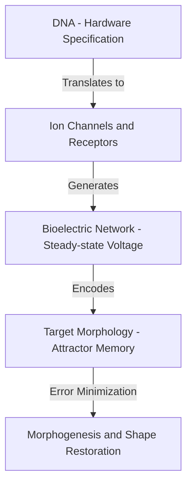
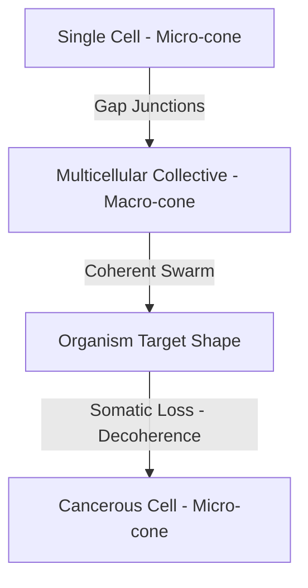
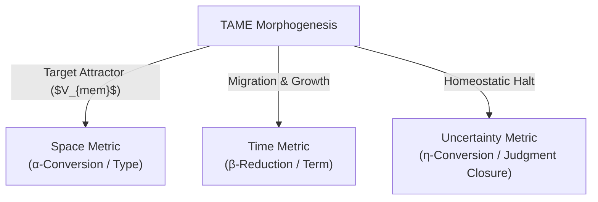

# TAME: Technological Approach to Mind Everywhere

**TAME** is a conceptual and empirical framework developed by developmental biologist **[[../../../../Literature/People/Michael Levin|Michael Levin]]** that redefines cognition as a continuous, scale-free phenomenon operating at every level of biological and computational organization.

---

## 1. Michael Levin's Core Thesis: Morphogenesis as Software Control

The core of Levin’s argument is that **morphogenesis is a top-down information-processing control problem**, rather than a bottom-up chemical assembly line. 

Diagram: Top-down software control of morphogenesis.

*   **DNA as Hardware Specification**: DNA does not contain a blueprint for the final shape of the body. Instead, it specifies the "cellular hardware"—the types of ion channels, receptors, and proteins that a cell can express.
*   **Bioelectric Attractor Memories (Bio-Software)**: Once expressed, ion channels form a developmental bioelectric network across tissues. This network maintains steady-state voltage gradients ($V_{mem}$) that act as **stable attractor states representing the target shape (pattern memory)**.
*   **Shape Reprogramming**: Because the morphogenetic goals are stored as bioelectric software rather than genetic code, the shape of the organism can be permanently altered without modifying the genome. 
    *   *The Picasso Tadpole*: Tadpoles with scrambled facial organs will coordinate their migration to form a normal frog head, proving active error correction toward a target shape invariant.
    *   *Two-Headed Planaria*: Altering the transient bioelectric memory of a planarian flatworm causes it to regenerate two heads. Once rewritten, the worm continues to regenerate as two-headed in all future amputations without further bioelectric edit, proving that the software goal has been permanently modified in cellular memory.

---

## 2. Abstract Interpretation of the Cell Collective

The biosemiotic translation of biological tissue into a computable substrate maps directly onto the framework of **[[../Computer Science/Abstract Interpretation|Abstract Interpretation]]**:

*   **The Concrete Domain ($C$)**: The high-dimensional, chaotic molecular and thermodynamic state space of cellular biochemistry. Forcing morphogenesis to calculate at this level would result in computational intractability and morphological collapse.
*   **The Abstract Domain ($A$)**: The steady-state voltage potential lattice ($V_{mem}$) of the tissue. Cells over-approximate biochemical noise by mapping continuous chemical reactions to discrete resting membrane potential attractors.
*   **The Galois Connection ($\alpha \dashv \gamma$)**:
    *   **Abstraction Functor ($\alpha$)**: Maps high-dimensional biochemical noise to a stable voltage lattice representing the target morphology.
    *   **Concretization Functor ($\gamma$)**: Translates the bioelectric target memory back into localized biochemical outputs (gene regulation, cell division, migration).

This sound over-approximation guarantees that tissue-wide homeostatic invariants are preserved and calculated stably under infinite molecular turnover.

---

## 3. The Cognitive Light Cone & The Science of Approximation

The boundary of what an agent can care about is defined by its **Cognitive Light Cone** (the spatio-temporal horizon of its goals):

Diagram: The Cognitive Light Cone expansion and collapse.

Under **[[../Computer Science/Science of Approximation|Science of Approximation]]**, the Cognitive Light Cone acts as a Galois-connected domain selector. 
*   **Information Filtering**: An agent cannot afford to process global state details. The Cognitive Light Cone defines the boundary of the abstract domain, filtering out environmental noise to render localized homeostatic calculations computable.
*   **Lattice Bounds**: Biological agents halt search loops when they meet an aspiration threshold ($t$) within their light cone, mirroring the poset-theoretic satisficing halts of Scott Domain Theory.

---

## 4. Quantum-Like Collapse as a Meaning-Assignment Mechanism

To assign physical structure to data, TAME utilizes a pipeline mathematically isomorphic to **[[../Quantum Mechanics/Quantum mechanics|Quantum Mechanics]]**:

1.  **The Superposition Space**: Continuous voltage distributions across cell membranes represent a probability field of potential shapes. 
2.  **The Measurement Projection (Collapse)**: Biological measurement acts as a projection operator. The continuous bioelectric superposition is forced to "collapse" into a discrete eigenstate—actuality.
3.  **Physical Meaning**: The collapse translates continuous potentials into a discrete physical organ (e.g., an eye or a limb). Actuality is not discovered; it is a sound approximation that maps infinite probability ranges into singular physical structures.

---

## 5. Latourian Actor-Networks: Organisms as Black Boxes

TAME helps present biology as "Science in Action" according to sociologist **[[../../Integration/Science in Action - The Path Integral of Truth|Science in Action]]**:

*   **Janus Faces of Biology**:
    *   *Science in the Making*: Messy cell-cell controversy, somatic variance, and metabolic noise.
    *   *Ready-Made Science*: The stabilized, functioning multicellular body.
*   **The Somatic Black Box**: A healthy, fully developed body is a stable Latourian "Black Box." Its internal controversies are hidden behind a simplified interface. This stabilization is maintained via cellular **"Trials of Strength"**—the bioelectric gap junction signaling and metabolic resource negotiation.
*   **Cancer as Decoherence**: When bioelectric gap junctions close, the Cognitive Light Cone shrinks. Individual cells lose alignment with the tissue-wide goal and revert to selfish, unicellular behavior. The black box is reopened, and the organism collapses back into "Science in the Making"—where cancer cells actively wage trials of strength against the host.

---

## 6. PKC Swarms and the Internet of Things (TAME-enabled IoE)

In modern computing, the convergence of **[[../../../Tech/PKC as an Autonomous Mesh Network|PKC as an Autonomous Mesh Network]]** and **[[../../../../Literature/PKM/Tools/Internet of Things|Internet of Things]]** implements TAME's biological principles in silicon:

| Biological Concept (TAME) | Silicon Realization (PKC Swarm) |
|---|---|
| **Cell** | Sovereign PKC Edge Node running local LLMs |
| **Bioelectric Gap Junction** | Secure, P2P VCard-authorized channel on an [[../../../Tech/Overlay VPN as Sovereign Network|Overlay VPN]] |
| **Cellular Memory (Target Shape)** | Content-addressed, immutable Merkle-DAG [[../../MVP/MCard/MCard|MCards]] |
| **Bioelectric Actuation Logic** | Dependent-typed, executable CLM [[../../MVP/PCard/PCard|PCards]] |
| **Cognitive Light Cone** | Cryptographically-enforced Authorized Cognitive Capacity (ACC) |
| **Tissue Homeostasis** | Swarm consensus achieved via uniquely indexed MCards under SMC laws |

Diagram: PKC mesh nodes composing as biological gap junctions.

By treating edge devices as sovereign cognitive agents with defined light cones, we move away from fragile, centralized cloud architectures toward a self-healing, scale-free **digital nervous system**.

---

## 7. Morphogenetic Closure and Lambda Calculus

TAME's homeostatic feedback loops are not just biological heuristics; they map directly onto the foundational laws of computation and the trinitarian metrics of consciousness, as explored in **[[../Computer Science/Programming Model/Lambda Calculus and the Three Metrics of Consciousness|Lambda Calculus and the Three Metrics of Consciousness]]**:

Diagram: TAME morphogenesis mapped to the three metrics of consciousness.

1. **Target Morphology $\leftrightarrow$ Space $\leftrightarrow$ $\alpha$-Conversion**: The bioelectric membrane potential landscape ($V_{mem}$) contains the target shape memory. It acts as the coordinate-free spatial blueprint—the Type ($A$-layer in CLM). Cells can undergo material turnover and local renaming, but the global topology is preserved via $\alpha$-equivalence.
2. **Morphogenetic Restructuring $\leftrightarrow$ Time $\leftrightarrow$ $\beta$-Reduction**: The physical process of growth, cell migration, and tissue remodeling occurs sequentially in time. This is the term execution ($C$-layer in CLM) reducing developmental error via $\beta$-reduction steps.
3. **Homeostatic Halt $\leftrightarrow$ Uncertainty $\leftrightarrow$ $\eta$-Conversion**: The critical system threshold where the organism stops remodeling. The cell collective acts as a witness ($B$-layer in CLM), evaluating the current physical state against the target attractor memory. This measures developmental deviation as a bounded, normalized uncertainty $U \in [0, 1]$. When the error is driven to zero, the system invokes the extensional equivalence of $\eta$-conversion, collapsing the dynamic remodeling process into a closed, stable **Judgment** ($\Gamma \vdash t : T$).

This triadic closure represents the transition from the active, exploring **[[Software Drift Control with Mealy and Moore Machines|Mealy Machine]]** (morphogenesis in action) to the stable, terminal **[[Software Drift Control with Mealy and Moore Machines|Moore Machine]]** (the final, healthy organ) at a **[[Hub/Theory/Category Theory/Type Theory/Constructs/Free Termination State|Free Termination State]]**.

---

## See Also
*   [[../Computer Science/Programming Model/Lambda Calculus and the Three Metrics of Consciousness|Lambda Calculus and the Three Metrics of Consciousness]] — Synthesis linking Lambda Calculus rules to Space, Time, and Uncertainty in TAME morphogenesis
*   [[../../../../Literature/People/Michael Levin|Michael Levin]] — Biologist profile and background
*   [[../Computer Science/Abstract Interpretation|Abstract Interpretation]] — Sound approximations of state spaces
*   [[../Computer Science/Science of Approximation|Science of Approximation]] — Mathematics of semantic projections
*   [[../Quantum Mechanics/Quantum mechanics|Quantum Mechanics]] — Hilbert space and state collapse
*   [[../../Integration/Science in Action - The Path Integral of Truth|Science in Action]] — The path integral of scientific facts
*   [[../../../Tech/PKC as an Autonomous Mesh Network|PKC as an Autonomous Mesh Network]] — Decentralized state mesh
*   [[../../../../Literature/PKM/Tools/Internet of Things|Internet of Things]] — Decentralized Web 5.0 endpoints
*   [[../EEAO|EEAO]] — Everything, Everywhere, All at Once
*   [[../../Polycomputing|Polycomputing]] — Multi-scale biological computation
*   [[../../CLM/Foundations/Cubical Logic Model|Cubical Logic Model]] — Categorical runtimes
*   [[../Computer Science/Programming Model/Vibe Coding|Vibe Coding]] — Natural language programming
*   [[../../Integration/The Sovereignty Axis of AI-Era Sovereignty - PKC, TAME IoE, and Public Knowledge Infrastructure|The Structural Blueprint of AI-Era Civilizational Sovereignty]]
