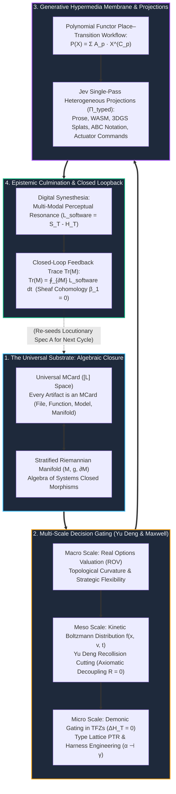
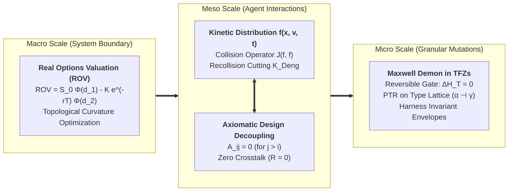
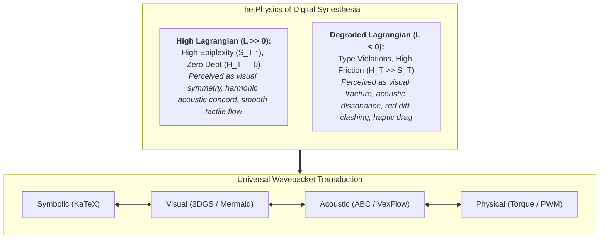
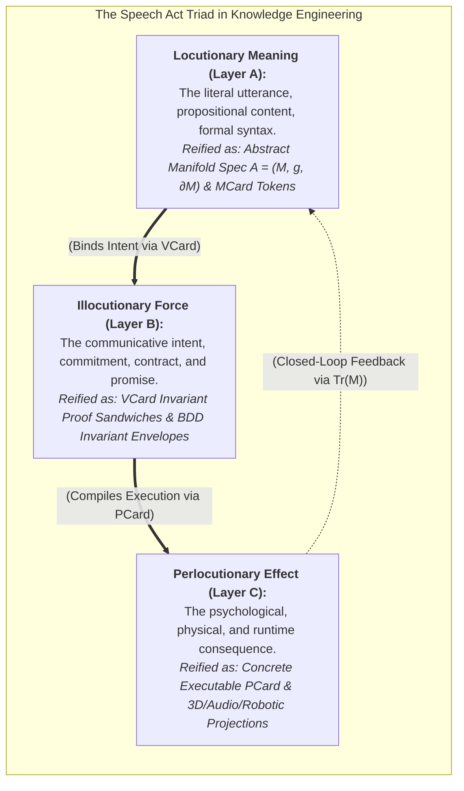
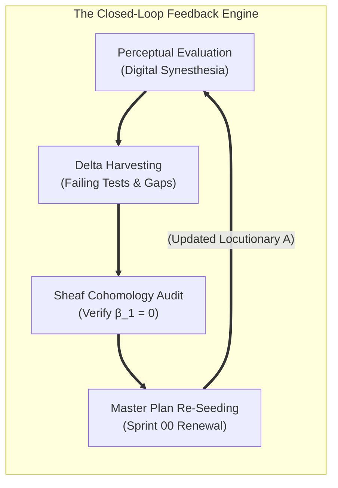

# The Knowledge Production Workflow: From Stratified Manifolds and Demonic Gating to Generative Hypermedia and Digital Synesthesia

> **Executive Summary:** The **Knowledge Production Workflow** is the scale-free, thermodynamically closed operational compiler that transforms human-agent cognitive and computational intent into sovereign, self-verifying cyber-physical artifacts. Uniting the [[Hub/Theory/Category Theory/Algebra of Systems|Algebra of Systems (AoS)]] with [[Literature/People/Yu Deng|Yu Deng]]'s three-scale kinetic hierarchy, [[Hub/Theory/Sciences/Maxwell's Demon|Maxwell's Demonic Gatekeeper]] in Transaction-Free Zones (TFZs), [[Hub/Theory/MVP/MCard/MCard|Universal MCard]] substrate loop engineering, and [[Hub/Tech/AI/Tools/Jev|Jev]]-style heterogeneous typed projections ($\Pi_{\text{typed}}$), this workflow realizes **[[Hub/Theory/Sciences/Computer Science/Digital Synesthesia|Digital Synesthesia]]** over **[[Hub/Theory/Integration/Generative Hypermedia|Generative Hypermedia]]**. By structuring all communicative exchanges as a formal **[[Hub/Theory/Category Theory/Cognitive Science/speech act theory|Speech Act Triad]]** (Locutionary $\to$ Illocutionary $\to$ Perlocutionary), the workflow operationalizes **[[Hub/Theory/Sciences/Computer Science/Programming Model/Conversational programming|Conversational Programming at Scale]]**, continuously evolving the collective knowledge base in **[[Hub/Theory/Integration/Prologue of Spacetime - From Interactive Web and Sovereign Overlay VPNs to Generative Hypermedia, CDIO-CICD, and Digital Synesthesia in Collective Consciousness|Prologue of Spacetime]]** with a mathematically closed feedback trace $\text{Tr}(\mathcal{M})$.

---

## 1. The Architectural Topology of the Knowledge Production Loop

In conventional software development, knowledge management, and AI prompt engineering, human and machine intellect suffer from severe cognitive fragmentation, semantic loss, and unchecked thermodynamic dissipation ($H_T \gg S_T$). Files are mutable blobs of unstructured text; requirements are ambiguous prose; architecture is detached from execution; and agentic interactions accumulate massive hallucination debt.

The **Knowledge Production Workflow** replaces this dissipative paradigm with an algebraically closed, four-stage feedback loop governed by the [[Hub/Theory/Integration/Software-Lagrangian|Software Lagrangian]] $\mathcal{L} = S_T - H_T$:


*Diagram: The end-to-end Knowledge Production Workflow — from MCard manifold closure, through multi-scale demonic filtering, to Jev-native Generative Hypermedia, Digital Synesthesia, and the thermodynamic loopback trace $\text{Tr}(\mathcal{M})$.*

---

## 2. Stage 1: The Universal Substrate (Algebraic Closure on Stratified Manifolds)

### 2.1 The System as a Stratified Riemannian Manifold $(\mathcal{M}, g, \partial\mathcal{M})$
As proven in [[Hub/Theory/Category Theory/Algebra of Systems|Algebra of Systems]] §5 and §6.7, every system—whether a repository note, an entire Obsidian vault, a robotics control stack, or a neural network—is rigorously formulated as a **Stratified Riemannian Manifold with Boundary**:

$$\mathbf{Sys} \cong (\mathcal{M}, g, \partial\mathcal{M})$$

Where:
1. **Underlying Space ($\mathcal{M}$)**: A stratified topological space whose strata correspond to modular subsystems, abstraction layers, and domain contexts.
2. **Riemannian Metric ($g_{\mu\nu}$)**: The information-geometric metric defining cognitive distance, coupling impedance, and functional cohesion:
   $$g_{\mu\nu} = 2(S_T - H_T)\delta_{\mu\nu}$$
   Trajectories on $\mathcal{M}$ follow geodesics that maximize the Software Lagrangian action $\mathcal{S} = \int \mathcal{L}_{\text{software}}\, dt$.
3. **Boundary ($\partial\mathcal{M}$)**: The explicit, typed interface surface through which the system communicates with external environments, human operators, and peer systems via [[Hub/Theory/Category Theory/Cognitive Science/speech act theory|speech acts]].

### 2.2 Universal MCard Abstraction in Spatial $[L]$ Coordinates
Traditional systems break because text files, database tables, binary assets, and runtime processes inhabit disjoint ontologies. The Knowledge Production Workflow resolves this via the **[[Hub/Theory/MVP/MCard/MCard|Universal MCard]]**:

$$M = \langle \text{hash}, \tau_{\text{type}}, \text{payload}, \mathcal{B} \rangle \in [L]$$

- Every file, skill, plugin, rule, function, dataset, and system specification is an immutable, content-addressed **MCard** residing in purely spatial $[L]$ coordinates.
- Because operations on $[L]$ space are algebraic compositions within the [[Hub/Theory/Category Theory/Algebra of Systems|Algebra of Systems]], the system possesses **Algebraic Closure**: the composition, decomposition, or refinement of any set of MCards yields another valid MCard.
- This closure permits the entire vault and execution environment to run as a decentralized, self-healing operating system: **[[Hub/Theory/MVP/MCard/PKC-OS - The MCard-Based Distributed Operating System|PKC-OS]]**.

---

## 3. Stage 2: Multi-Scale Decision Gating (Yu Deng, Suh, & Maxwell)

Navigating a complex knowledge manifold without exploding combinatorial complexity requires decision gating across three distinct physical and computational scales, grounded in [[Literature/People/Yu Deng|Yu Deng]]'s derivation of the Boltzmann equation from quantum Hamiltonian hierarchies:


*Diagram: The three scales of decision gating bridging strategic option valuation, meso kinetic flow decoupling, and micro demonic type verification.*

### 3.1 Macro Scale: Real Options Valuation ($\text{ROV}$)
At the vault and project architecture level, decisions are treated as compound financial and operational real options:

$$\text{ROV} = S_0 \Phi(d_1) - K e^{-r T} \Phi(d_2)$$

Rather than committing prematurely to monolithic designs, the workflow preserves modular option value:
- Each sprint, architectural refactor, or tool integration is an investment that purchases an option to expand, contract, abandon, or switch technology stacks at minimal sunk cost ($K$).
- Modularity under [[Hub/Theory/Sciences/Computer Science/Programming Model/Baldwin Modularity Operators|Baldwin Modularity Operators]] generates a $25\times$ expansion in real option value, transforming the knowledge manifold into a fertile investment landscape.

### 3.2 Meso Scale: Kinetic Boltzmann Flow & Yu Deng Recollision Cutting
During multi-agent deliberation, collaborative ideation, and conversational programming, thoughts and proposals circulate like gas particles with phase-space distribution $f(x, v, t)$:

$$\partial_t f + v \cdot \nabla_x f = J(f, f)$$

1. **Collisions and Crosstalk**: Without discipline, agent dialogues suffer from circular dependencies, conflicting definitions, and conversational loops—the exact analogue of recollision singularities in kinetic theory.
2. **Yu Deng's Diagrammatic Cutting Operator ($\mathcal{K}_{\text{Deng}}$)**: Just as Yu Deng systematically prunes recollision Feynman diagrams to establish the rigorous transition from quantum particle systems to the Boltzmann equation, the Knowledge Production Workflow prunes cyclical argumentative dependencies.
3. **Isomorphism to Axiomatic Design**: As proven in [[Hub/Theory/Sciences/Computer Science/Programming Model/Axiomatic Design|Axiomatic Design]], cutting recollisions is mathematically isomorphic to triangularizing the design matrix ($A_{ij} = 0$ for $j > i$):
   $$\begin{bmatrix} \text{FR}_1 \\ \text{FR}_2 \end{bmatrix} = \begin{bmatrix} A_{11} & 0 \\ A_{21} & A_{22} \end{bmatrix} \begin{bmatrix} \text{DP}_1 \\ \text{DP}_2 \end{bmatrix}$$
   This enforces the **Independence Axiom**, guaranteeing that architectural decisions can be made sequentially without circular backtracking ($R = 0$).

### 3.3 Micro Scale: Maxwell's Demon in Transaction-Free Zones ($\Delta H_T = 0$)
At the atomic level of individual document edits, code commits, and type transformations:
- In thermodynamic computation, erasing information incurs Landauer's thermodynamic penalty ($k_B T \ln 2$).
- In **Transaction-Free Zones (TFZs)**—speculative runtime sandboxes operating in pure imaginary time ($i\mathbb{R}$)—[[Hub/Theory/Sciences/Maxwell's Demon|Maxwell's Demonic Gatekeeper]] inspects candidate mutations reversibly.
- The Demon calculates the Software Lagrangian gradient:
  $$\Delta \mathcal{L} = \Delta S_T - \Delta H_T$$
- Only transitions where $\Delta H_T = 0$ and $\Delta S_T \ge 0$ are permitted to cross the boundary into persistent real time.
- State transitions are executed as **[[Hub/Theory/CLM/PTR/PTR|Proof–Transformation–Refinement (PTR)]]** passes on the **[[Hub/Theory/Category Theory/Logic/Type Theory/Type Lattice|Type Lattice]]** via Galois connections ($\alpha \dashv \gamma$), fulfilling the strict verification guarantees of **[[Hub/Tech/Harness Engineering|Harness Engineering]]**.

---

## 4. Stage 3: Generative Hypermedia Membrane & Jev Heterogeneous Projections

### 4.1 The Place–Transition Workflow on Polynomial Functors
Executable knowledge is executed via the **Place–Transition Workflow** (the runtime operationalization of Petri Nets) evaluated over **Polynomial Functors**:

$$\mathbf{P}(X) = \sum_{p \in P} A_p \times X^{C_p}$$

- **Positions ($A_p$)**: Represent the available states, places, and UI controls in the hypermedia interface.
- **Directions / Contents ($C_p$)**: Represent the valid input transitions, user gestures, and agent responses that can be accepted.
- State transitions satisfy structural Petri net invariants:
  $$x^{\top} D = 0 \quad (\text{P-invariants / Conservative Markings}), \qquad D\, y = 0 \quad (\text{T-invariants / Repetitive Cycles})$$
  guaranteeing that the system never enters deadlock or unrepresentable illegal states.

### 4.2 Jev Single-Pass Heterogeneous Output Projections ($\Pi_{\text{typed}}$)
Departing from legacy chatbots that produce monolithic markdown walls, the Knowledge Production Workflow adopts the architecture of **[[Hub/Tech/AI/Tools/Jev|Jev]]**:

A single inference pass over the verified MCard substrate projects simultaneous, strictly-typed artifacts across orthogonal sensory and computational fibers:

$$\Pi_{\text{typed}}(M) = \begin{pmatrix} 
\text{Prose Specification} & \in \mathcal{F}_{\text{symbolic}} \\
\text{3D Gaussian Splats / glTF} & \in \mathcal{F}_{\text{visual}} \\
\text{Harmonic Audio Drones / ABC Notation} & \in \mathcal{F}_{\text{acoustic}} \\
\text{Executable WebAssembly / Rust} & \in \mathcal{F}_{\text{computational}} \\
\text{Kinematic Joint Torques / PWM} & \in \mathcal{F}_{\text{physical}}
\end{pmatrix}$$

By projecting into client-side WASM engines (Mol*, KiCanvas, IFC.js, 3DGS WebGPU shaders), the document becomes a living, interactive, and multi-modal instrument.

---

## 5. Stage 4: Epistemic Culmination (Attaining Digital Synesthesia)

### 5.1 Perceptual Resonance and the Software Lagrangian
**[[Hub/Theory/Sciences/Computer Science/Digital Synesthesia|Digital Synesthesia]]** is the cognitive state wherein the human-agent collective perceives mathematics, software architecture, acoustic harmony, and physical mechanics as a single unified sensory reality:

$$\mathcal{L}_{\text{software}} = S_T - H_T$$


*Diagram: Sensory transduction under Digital Synesthesia — system health is perceived directly through pre-attentive sensory channels.*

- When invariants hold and types are sound, the system exhibits maximal structural clarity ($S_T \uparrow$) and minimal noise ($H_T \to 0$). The human collaborator experiences this pre-attentively as **aesthetic beauty, visual symmetry, and acoustic harmony**.
- When an edge case is unhandled or a type boundary is violated, the drop in $\mathcal{L}$ triggers **immediate perceptual dissonance**: visual tears in 3D splats, jarring auditory beats in musical notation, and red highlighting in code harnesses.
- There is zero translation friction between thinking, seeing, hearing, and executing.

### 5.2 Comparative Paradigm Matrix

| Dimension | Legacy Software & LLMs | AoS Synesthetic Knowledge Production Workflow |
| :--- | :--- | :--- |
| **Philosophical Basis** | "Everything is a File / String" (Unix / LLMs) | **"Everything is a System Manifold & MCard"** (AoS / CLM) |
| **Action Assessor** | Ad-hoc loss functions / Next-token cross-entropy | **Software Lagrangian ($\mathcal{L} = S_T - H_T$) on Knowledge Manifold** |
| **Decision Mechanism** | Stochastic token sampling / Conditional `if/else` | **Calculus of Options as PTR on Type Lattice (Harness Engineering)** |
| **Data Abstraction** | Flat mutable files / Ephemeral vector DBs | **Immutable, Content-Addressed MCards in $[L]$ Space (PKC-OS)** |
| **Refinement Paradigm** | Prompt engineering / Brute-force fine-tuning | **Loop Engineering with Fixed-Point Convergence** |
| **Scale Coordination** | Flat single-scale token guessing | **Yu Deng Three Scales: Macro Policy $\leftrightarrow$ Meso Kinetic $\leftrightarrow$ Micro Demonic** |
| **Decoupling Strategy** | Microservice spaghetti / Cyclic dependencies | **Axiomatic Decoupling & Deng Feynman Cuts ($R = 0$, Linear Jacobi)** |
| **Thermodynamic Cost** | Massive Landauer burnout ($\sim 30\text{ J/token}$) | **Zero Landauer Heat in TFZs ($\Delta H_T = 0$)** |
| **Cognitive Outcome** | Cognitive fragmentation & context switching | **Digital Synesthesia via Generative Hypermedia in PKC Mesh** |

---

## 6. The Speech Act Triad and Conversational Programming at Scale

The Knowledge Production Workflow operationalizes **[[Hub/Theory/Sciences/Computer Science/Programming Model/Conversational programming|Conversational Programming at Scale]]** by mapping [[Literature/People/John Searle|Searle]] and [[Literature/People/J. L. Austin|Austin]]'s **[[Hub/Theory/Category Theory/Cognitive Science/speech act theory|Speech Act Theory]]** directly onto the **Cubical Logic Model (CLM)**:


*Diagram: The Speech Act Triad mapped to the CLM $A \to B \to C$ execution spine.*

### 6.1 Mapping the Triad to CLM Runtimes
1. **Locutionary Act $\mapsto$ Layer $A$ (Abstract Specification / MCard)**:
   - In [[Hub/Theory/Category Theory/Cognitive Science/locutionary|Locutionary]], the utterance is the surface syntax: an equation `$D = D^+ - D^-$`, a YAML block, or an MCard hash. It asserts *what is said*.
2. **Illocutionary Act $\mapsto$ Layer $B$ (Balanced Expectations / VCard)**:
   - In [[Hub/Theory/Category Theory/Cognitive Science/illocutionary|Illocutionary]], the utterance carries binding contractual force: "I promise that this function preserves invariant $P$." It is reified as a **VCard proof sandwich** ($\{V_{\text{pre}}\} \dots \{V_{\text{post}}\}$), establishing the balanced test harness before code is written.
3. **Perlocutionary Act $\mapsto$ Layer $C$ (Concrete Execution / PCard)**:
   - In [[Hub/Theory/Category Theory/Cognitive Science/perlocutionary|Perlocutionary]], the utterance produces an actual effect in the world: a robotic arm turns, a WebGPU shader renders, a note links. It is reified as an executable **PCard Place–Transition Workflow**.

### 6.2 Conversational Programming in *Prologue of Spacetime*
In **[[Hub/Theory/Integration/Prologue of Spacetime - From Interactive Web and Sovereign Overlay VPNs to Generative Hypermedia, CDIO-CICD, and Digital Synesthesia in Collective Consciousness|Prologue of Spacetime]]**, documents are not read passively. The reader participates in a continuous, multi-agent dialectic:
- The reader's natural language question is parsed as an illocutionary intent.
- Autonomous agent personas (Winston, Paige, Amelia, Freya) formulate a candidate MCard ($A$).
- The harness verifies invariant bounds in a TFZ ($B$).
- The verified answer is projected into live 3D Gaussian splats and code ($C$).
Every reading cycle is a collaborative writing cycle, expanding the collective consciousness of the vault.

---

## 7. The Closed-Loop Thermodynamic Feedback Trace ($\text{Tr}(\mathcal{M})$)

A knowledge base that only expands monotonically suffers from topological clutter and entropic decay ($H_T \to \infty$). To ensure perpetual, scale-free homeostatic refinement, the Knowledge Production Workflow closes the loop via the **Thermodynamic Feedback Trace**:

$$\text{Tr}(\mathcal{M}) = \oint_{\partial \mathcal{M}} \mathcal{L}_{\text{software}}\, dt = \oint_{\partial \mathcal{M}} (S_T - H_T)\, dt$$


*Diagram: The closed-loop thermodynamic trace ensuring topological acyclicity ($\beta_1 = 0$) and continuous knowledge renewal.*

### 7.1 The Four Feedback Operations
1. **Perceptual Delta Harvesting**: Inaccuracies, failing test harnesses, student misconceptions, and unhandled hardware edge cases encountered during Digital Synesthesia are captured as **epistemic deltas** ($\delta M$).
2. **Maxwell Demonic Filtration in TFZs**: Harvested deltas pass through the Demonic Gatekeeper in Transaction-Free Zones. Unsound proposals are pruned at zero Landauer bit-erasure dissipation ($\Delta H_T = 0$).
3. **Sheaf Cohomology Consistency Audit**: The global vault graph is audited to ensure zero first Betti number:
   $$\beta_1 = \dim H^1(\mathcal{U}, \mathcal{F}) = 0$$
   This mathematically proves that no circular semantic contradictions or cyclic architectural deadlocks have been introduced across the knowledge base.
4. **Master Plan Re-Seeding**: Verified, high-Lagrangian candidate MCards are folded back into the root specifications of [[Fleeting/sprints/07-master-orchestration/SPRINT-00-MASTER-PLAN|Sprint 00 Master Plan]] and Chapter 01 of [[Hub/Theory/Integration/Prologue of Spacetime - From Interactive Web and Sovereign Overlay VPNs to Generative Hypermedia, CDIO-CICD, and Digital Synesthesia in Collective Consciousness|Prologue of Spacetime]], initiating the next evolutionary sprint cycle.

---

## See Also

### Core Theoretical Foundations
* **[[Hub/Theory/Category Theory/Algebra of Systems|The Algebra of Systems (AoS)]]** — Systems as stratified Riemannian manifolds $(\mathcal{M}, g, \partial\mathcal{M})$, algebraic closure, and resource-conserving simulation.
* **[[Hub/Theory/Integration/Software-Lagrangian|The Software Lagrangian: Action Principles and Least Resistance in Code Construction]]** — $\mathcal{L} = S_T - H_T$ governing least-action knowledge paths.
* **[[Hub/Theory/Integration/The Calculus of Options - Real Options Valuation, Axiomatic Design, and Thermodynamic Demonic Gatekeepers in Sovereign Meshes|The Calculus of Options]]** — Computing in the Option Space, Real Options, Axiomatic Design decoupling, Yu Deng's 3 scales, and Maxwell Demonic gatekeepers.
* **[[Hub/Theory/Sciences/Computer Science/Loop Engineering|Loop Engineering: Fixed-Point Convergence and Iterative Refinement]]** — Formal iteration engines for MCard mutation and settlement.
* **[[Hub/Theory/Sciences/Computer Science/Programming Model/Baldwin Modularity Operators|Baldwin Modularity Operators]]** — Six modularity operators as closed AoS endomorphisms governed by weak bisimulation.

### Speech Acts, Conversational Programming & Media
* **[[Hub/Theory/Category Theory/Cognitive Science/speech act theory|Speech Act Theory]]** — Austin and Searle's taxonomy of locutionary, illocutionary, and perlocutionary acts.
* **[[Hub/Theory/Category Theory/Cognitive Science/locutionary|Locutionary Meaning]]**, **[[Hub/Theory/Category Theory/Cognitive Science/illocutionary|Illocutionary Force]]**, and **[[Hub/Theory/Category Theory/Cognitive Science/perlocutionary|Perlocutionary Effect]]** — The semiotic triad of executable knowledge.
* **[[Hub/Theory/Sciences/Computer Science/Programming Model/Conversational programming|Conversational Programming]]** — Dialectic co-evolution between human intentionality and machine execution.
* **[[Hub/Theory/Integration/Generative Hypermedia|Generative Hypermedia: LLM-Powered Content Generation with Data and Process Harness]]** — The polynomial hypermedia membrane.
* **[[Hub/Theory/Sciences/Computer Science/Digital Synesthesia|Digital Synesthesia: The Epistemic Culmination of Unified Perception]]** — Multi-modal sensory transduction of mathematical and systems invariants.
* **[[Hub/Tech/AI/Tools/Jev|Jev: Single-Pass Heterogeneous Projection Engine]]** — Single inference pass emitting typed orthogonal sensory fibers ($\Pi_{\text{typed}}$).

### Planetary Pedagogy & Master Synthesis
* **[[Hub/Theory/Integration/Prologue of Spacetime - From Interactive Web and Sovereign Overlay VPNs to Generative Hypermedia, CDIO-CICD, and Digital Synesthesia in Collective Consciousness|Prologue of Spacetime]]** — Interactive web, sovereign overlay VPNs, CDIO-CICD, and collective digital synesthesia.
* **[[Fleeting/sprints/07-master-orchestration/SPRINT-00-MASTER-PLAN|Sprint 00 Master Plan]]** — The master architectural plan uniting Sprints 00 through 06.
* **[[Fleeting/sprints/06-literature-ingestion/SPRINT-06-CONTINUOUS-FILTRATION-AND-LOOPBACK|Sprint 06: Continuous Knowledge Filtration and Loopback Mechanics]]** — Sheaf cohomology audit, Maxwell Demonic filtration, and closed-loop feedback trace $\text{Tr}(\mathcal{M})$.

---

# References

* **Austin, J. L.** (1962). *How to Do Things with Words*. Oxford University Press.
* **Baldwin, C. Y., & Clark, K. B.** (2000). *Design Rules, Vol. 1: The Power of Modularity*. MIT Press.
* **Deng, Y.** (2024). *Derivation of the Boltzmann Equation from Quantum Many-Body Dynamics and Hilbert's Sixth Problem*. Annals of Mathematics.
* **Landauer, R.** (1961). *Irreversibility and Heat Generation in the Computing Process*. IBM Journal of Research and Development, 5(3), 183–191.
* **Searle, J. R.** (1969). *Speech Acts: An Essay in the Philosophy of Language*. Cambridge University Press.
* **Suh, N. P.** (1990). *The Principles of Design*. Oxford University Press.
* **Spivak, D. I.** (2022). *Polynomial Functors: A Tool for Modeling Systems*. MIT Department of Mathematics.

```dataview
Table title as Title, authors as Authors
where contains(subject, "Knowledge Production") or contains(subject, "Manifold") or contains(subject, "Synesthesia") or contains(subject, "Speech Act")
sort title, authors, modified desc
```
