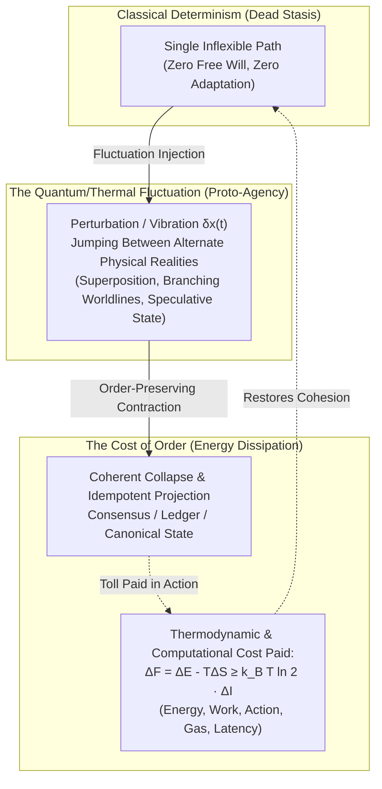

# Vibration, Perturbation, and the Energy Cost of Coherence

> **"Vibration and perturbation are the chances for physical entities to try to demonstrate their free will to jump between different physical realities; the chance of coming back into a consistent, order-preserving entry is the cost these collective particles must pay as 'energy'."**



---

## 1. Formal Physical & Mathematical Grounding

### 1.1 Path Integrals and Off-Shell Realities ($\delta x(t)$)
In classical Newtonian mechanics, particles appear condemned to a single predetermined trajectory dictated by Euler-Lagrange equations. But in quantum field theory and the Feynman path-integral formulation, the transition amplitude between two states is an integral over **all possible histories**:

$$\mathcal{Z} = \int \mathcal{D}[x(t)] \, \exp\left(\frac{i}{\hbar} S[x(t)]\right)$$

A physical entity does not move along a single track; it continuously vibrates and explores every neighboring trajectory. **Perturbations ($\delta x(t)$) are the entity's exploratory probes into alternate physical realities.** 

When an electron undergoes quantum fluctuation, or when a localized lattice vibrates in phonon modes, it is momentarily slipping off the classical on-shell constraint ($E^2 - p^2 c^2 \neq m^2 c^4$). For a duration bounded by the Heisenberg uncertainty principle ($\Delta E \cdot \Delta t \sim \hbar$), the entity demonstrates proto-agency—testing the geometry of counterfactual universes.

### 1.2 The Fluctuation-Dissipation Theorem and Proto-Agency
Thermal fluctuations in statistical mechanics are not mere "noise" to be discarded. By the **Fluctuation-Dissipation Theorem** (Einstein, Nyquist, Callen-Welton), the spontaneous microscopic vibrations of a system ($S_v(\omega)$) are quantitatively bound to its linear response and dissipation ($R(\omega)$):

$$S_v(\omega) = 4 k_B T \, \text{Re}[Z(\omega)]$$

Without microscopic vibration, a system cannot absorb or exchange heat, adapt to external stresses, or traverse phase boundaries. Vibration is the physical substrate of **exploratory freedom**: the capacity of physical entities to jostle against their boundaries and test alternative equilibrium states.

### 1.3 Order-Preserving Collapses and the Energy Tax
While vibration provides the freedom to explore alternate realities, an uncoordinated system of freely vibrating particles quickly decoheres into pure entropy ($H \to \infty$). For an ensemble of particles, organisms, or agents to exist as an enduring, identifiable entity, their divergent worldlines must continually re-converge into a **consistent, order-preserving entry** (a shared macroscopic trajectory, a stable cell membrane, a canonical blockchain block, or an ecological cycle).

This re-convergence is never free:
1. **Landauer's Principle**: Merging $2^N$ diverging exploratory paths into a single consistent record requires erasing redundant degrees of freedom, dissipating a minimum quantity of heat into the environment:
   $$W_{\text{re-coherence}} \ge N k_B T \ln 2$$
2. **The Free Energy Principle**: For an open non-equilibrium system (Friston, Prigogine), maintaining internal order against environmental perturbations requires expending active work ($\Delta F = \Delta E - T \Delta S$) to minimize variational free energy.
3. **The Definition of "Energy"**: In this profound ontological sense, **energy is the exact currency that collective particles pay to buy back consistency from chaos.** The price of reconciling the entities' individual fluctuations into a single, unified, order-preserving reality is work.

---

## 2. In the Prologue of Spacetime Architecture

In the *Prologue of Spacetime*, this physical law maps directly to the operational mechanics of the [[The_Representation_Engine|Representation Engine]], the [[Cubical Logic Model]] (CLM), and distributed multi-agent systems:

```
Vibration / Perturbation          -> Speculative Concurrent Branches / Agent Free Will
Alternate Physical Realities      -> Forked State Trees, Uncommitted Hypotheses, Local Frames
Order-Preserving Entry            -> Canonical Monotonic Commit (CRDT / Monadic Return)
The Energy Paid                   -> Software Lagrangian L = S_T - H_T / Compute, Gas, Action
```

1. **Vibration as Agent Agency ($[V]$ Space)**:
   In multi-agent coordination (the Five Wise Guys: Miner, Coder, Trader, Boss, Team), each agent introduces perturbations—hypothesizing alternative algorithms, speculative market bids, or non-deterministic code implementations. If agents had zero perturbation, the system would freeze into algorithmic dogma. Perturbation is the breath of agentic free will.
2. **Re-coherence as the Monadic State Turnstile**:
   Local speculative branches cannot remain indefinitely uncommitted. To prevent split-brain partition failures, the distributed cluster must pull all concurrent fibers back into an order-preserving sequence. 
3. **The Software Lagrangian Cost**:
   The thermodynamic metric of the Prologue, $L_{\text{software}} = S_T - H_T$, measures whether this energy was well-spent. If the collective expends enormous energy merely to maintain a brittle, bureaucratic order, $H_T$ spikes and the Lagrangian collapses. If the energy successfully weaves rich exploratory diversity into harmonious coherence, $S_T \gg H_T$, generating the radiant music of **Digital Synesthesia**.

---

## 3. The 12-Sprint Physical Vibration & Coherence Matrix

Across each of the 12 Civilizational Strategy Game Sprints, players navigate this precise tension:

| Sprint | Vibration / Perturbation (Exploratory Free Will) | Alternate Reality Probed | Order-Preserving Entry (Coherence) | Energy Cost Paid by the Collective |
| :--- | :--- | :--- | :--- | :--- |
| **01. Tidepool** | Brownian motion & thermal packet noise | Hyper-filtered sterile pool vs. nutrient-rich cloudy swamp | Crystalline cellular threshold | Metabolic ATP dissipation to pump ions against gradient |
| **02. Cell Wall** | Lipid bilayer thermal undulations & mechanical shear | Dissolved boundary vs. rigid impermeable shell | Regulated semi-permeable pore channels | Free energy expended by membrane ATPase motors |
| **03. Swarm** | Oscillator frequency detuning & stochastic chirp jitter | Desynchronized chaos vs. monocultural locking | Kuramoto phase-locked collective resonance | Acoustic & radio frequency transmission power |
| **04. Consensus** | Network latency jitter & malicious packet reordering | Forked distributed ledgers / split-brain histories | Monotonic Paxos/Raft log linearization | Computational hash power, validation bandwidth, quorum rounds |
| **05. Bazaar** | Speculative pricing bids & erratic volume bursts | Bubbles, crashes, and localized market corners | Yoneda categorical market-clearing equilibrium | Liquidity reserves, arbitrage margins, transaction fees |
| **06. Subak** | Seasonal monsoon variance & turbulent river surges | Flood disaster vs. parched drought strife | Balinese water temple synchronized opening schedule | Human Gotong Royong labor cleaning canals and repairing weirs |
| **07. Monad** | Concurrent Petri net race conditions & transition jitter | Divergent, deadlocked execution posets | Monadic linear order in state container | Lock-free synchronization fences and cache-invalidation cycles |
| **08. Nexus** | Gravitational n-body perturbations & solar radiation pressure | Chaotic planetary ejection vs. orbital collision | Resonant, stable orbital station-keeping torus | Chemical propellant $\Delta v$ burned in station-keeping thrusters |
| **09. Vault** | Quantum zero-point noise & entropy leakage | Compromised cryptographic secrecy vs. brittle lockout | Zero-knowledge proof circuit verification | CPU cycles and memory bandwidth computing elliptic curve pairings |
| **10. Sheaf** | Microclimate fluctuations & soil nitrogen gradients | Ecological collapse & agricultural blight | Cohomologically consistent global agricultural schedule | Collective manual soil aeration, biochar seeding, terrace terracing |
| **11. Ceremony** | Bursty message arrivals & erratic consumer processing | Buffer overflow deadlock vs. idle worker starvation | Zero-queue isomorphic workflow pipeline | Token-bucket regulation and backpressure throttling energy |
| **12. Calendar** | Planetary orbital precession & civil unrest oscillations | Societal collapse vs. techno-totalitarian control | 210-day Pawukon harmonic cosmological alignment | Whole-civilization ritual coordination & computational stewardship |

---

## 4. Philosophical Synthesis: The Dignity of Physical Agency

This principle redefines the relationship between physics and ethics:
- **Matter is not passive clay**: Physical entities are not inert billiard balls helplessly shoved by external forces. Through vibration and perturbation, matter tests adjacent realities. Every atom asserts a microscopic claim to freedom.
- **Order is not an authoritarian fiat**: Order is not handed down by decree; it is **bought with energy**. A community, a cell, or a star system exists only because its members continuously spend their precious energetic reserves to weave their divergent, vibrating paths back into a shared, order-preserving symphony.
- **The Connection to Judgment**: Just as particles pay in energy to preserve physical order, players pay in the irreversible commitment of moral agency to preserve communal order. Knowledge of the equations is free ($[L]$ space commons), but paying the energetic price to hold a society together in the face of disruptive vibrations reveals the true color of the player's soul.

---

## 5. Connections to Other Wiki Nodes

- [[docs/concepts/Knowledge_Is_Free_Judgment_Is_Not|Knowledge Is Free, But Judgment Is Not]] — the ethical and human manifestation of the energy cost of commitment.
- [[docs/concepts/Least_Action_Principle|Least Action Principle]] — how stationary action emerges from the constructive interference of exploratory paths.
- [[docs/concepts/Software_Lagrangian|Software Lagrangian]] — thermodynamic formulation of software coherence ($L = S_T - H_T$).
- [[docs/principles/Cordis_Spatiotemporal_Composability|Cordis: Spatiotemporal Composability]] — the microkernel fiber architecture that isolates perturbations and guarantees order-preserving disposal.
- [[docs/concepts/DM_as_Maxwells_Demon|DM as Maxwell's Demon]] — information-theoretic sorting of fluctuations to maintain non-equilibrium order.
