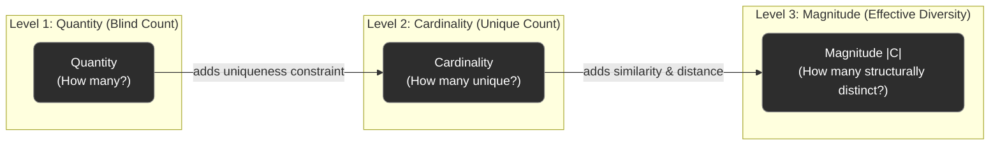
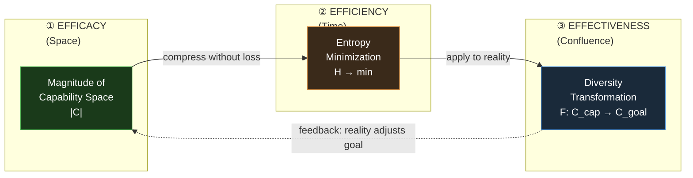
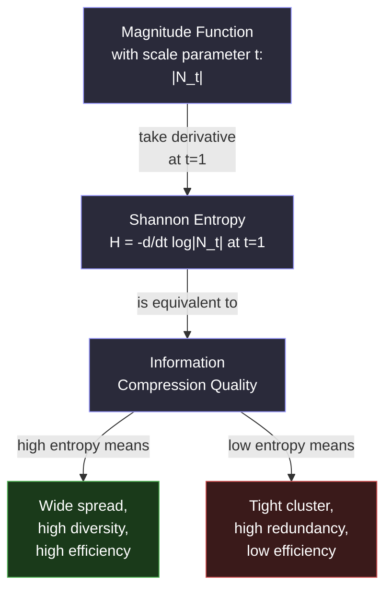
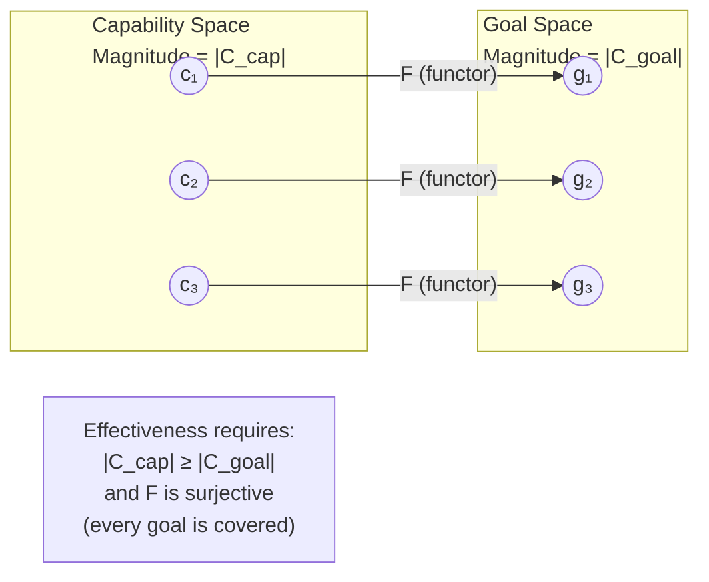
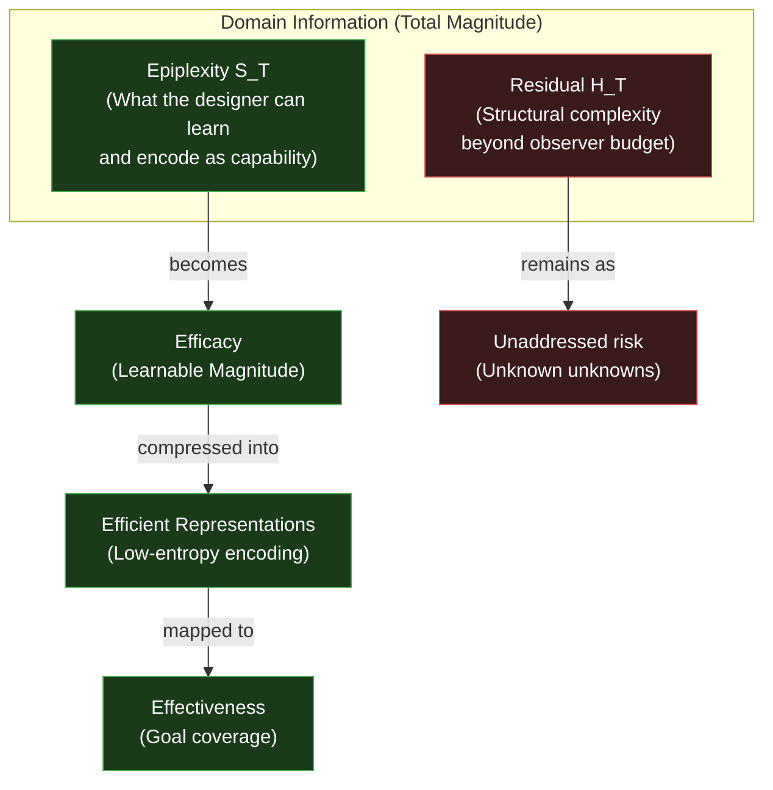
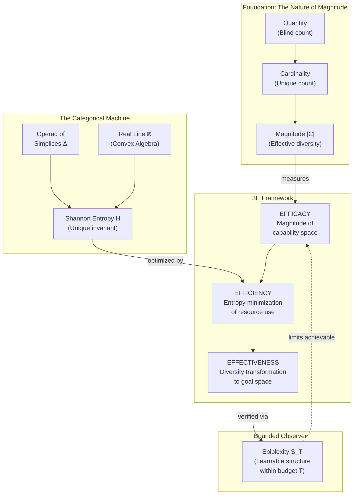

---
created: 2025-12-26T11:08:36+08:00
modified: 2026-03-04T12:25:04+08:00
title: "3E Framework: Efficacy, Efficiency, and Effectiveness"
subject: 3E Framework, Efficacy, Efficiency, Effectiveness, Spacetime-Confluence, Knowledge, Magnitude, Entropy, Diversity, Categorical Machine, Leinster, Epiplexity
aliases:
  - 3E
  - Three Es
  - Efficacy Efficiency Effectiveness
---
# 3E Framework

> **Core Insight**: From "The Spacetime-Confluence Closure": The 3E Framework maps directly to the triadic structure of **Space**, **Time**, and **Confluence**:
>
> | 3E Metric  | Spacetime Element      | What It Measures                                              |
> | :--------- | :--------------------- | :------------------------------------------------------------ |
> | **[[Efficacy]]** | Space (Representable)  | "Can we do it?" — The internal structural richness           |
> | **[[Efficiency]]** | Time (Contextualized)  | "Can we do it within budget?" — The resource constraint      |
> | **[[Effectiveness]]** | Confluence (Shareable) | "Did it achieve the goal in reality?" — The external witness |
>
> **Without Confluence (Effectiveness), the other two are unverified claims.**
> Effectiveness aligns with **[[Magnitude]]** by ensuring the "effective size" of the output matches the diversity of the goal.

See [[The Spacetime-Confluence Closure]]

---

## The Three-Level View of "Size"

A critical foundation for understanding the 3E Framework is recognising that there are three distinct ways to measure "size," each corresponding to a different depth of structural awareness. The 3E Framework maps directly onto this hierarchy.

| Concept                        | Formula                            | 3E Mapping                    | Limitation                                        |
| :----------------------------- | :--------------------------------- | :---------------------------- | :------------------------------------------------ |
| **Quantity**             | $n$ (raw count)                  | Pre-3E (no structure)         | Blind to duplicates and structure                 |
| **Cardinality**          | $\|S\|$ (set size)               | Necessary for[[Efficacy]]                 | Blind to similarity; treats all elements as equal |
| **[[Magnitude]]** $\|\mathcal{C}\|$ | $\mathbf{1}^T Z^{-1} \mathbf{1}$ | **The Efficacy Metric** | Requires similarity/distance function             |

---

## Mapping the Analytical Measurements

The 3E Framework provides the structure for the exact mathematical and architectural measurements used to construct rigorous computational systems, such as **[[Permanent/Projects/GovTech/architecture/OaK Architecture|OaK Architecture]]** and **[[Hub/Theory/Sciences/Consciousness|Consciousness]]**.

| 3E Dimension                                   | The Question               | The Analytical Measurement               | Mathematical Basis                                                                                                              | [[Hub/Theory/Sciences/Computer Science/Abstract Interpretation\|Abstract Interpretation]]                                                                                                                |
| :--------------------------------------------- | :------------------------- | :--------------------------------------- | :------------------------------------------------------------------------------------------------------------------------------ | :-------------------------------------------------------------------------------------------------------------- |
| **Efficacy** (Space / Structure)         | "Can we do it?"            | **Bounded Magnitude / [[Hub/Tech/Epiplexity\|Epiplexity]] ($S_T$)** | The effective structure realistically extractable within computational tracking time$T$.                                      | **Precision (Narrowing $\Delta$)**: Recovering structured magnitude $S_T$.                            |
| **Efficiency** (Time / Resource)         | "Can we do it cheaply?"    | **Time-Bounded [[Entropy\|Entropy]] Minimization**     | Isolating structured$S_T$ away from the unlearnable residual noise $H_T$. High efficiency = minimal thermodynamic waste.    | **Terminability (Widening $\nabla$)**: Enforcing the compute bound $T$ by abandoning $H_T$.         |
| **Effectiveness** (Confluence / Reality) | "Did it achieve the goal?" | **Representability**               | Functorial mapping$F: S_{T(\text{cap})} \to \mathcal{C}_{\text{goal}}$; proven by an external, "shareable" Open Data Witness. | **Soundness (Galois $\alpha \dashv \gamma$)**: Ensuring abstract model safely maps to concrete reality. |

---

## The 3E Pipeline: From Capability to Impact

The three dimensions are not independent — they form a **causal pipeline**. You cannot skip stages without losing grounding.

> **The Argument for Sequence**: You cannot be Effective (hit the target) if you have no Efficacy (cannot throw the ball). You *can* be Effective without Efficiency (hitting the target expensively), but in a constrained universe, inefficiency eventually degrades Efficacy (running out of resources). The sustainable path is **Establish Capability → Optimize Resource → Verify Impact**.

---

## Efficacy: Structural Richness via Bounded Magnitude (Epiplexity)

**Efficacy** is not merely "having capability" — it is having *sufficient structural diversity* that the observer can actually compute. While theoretically tied to [[Nature of Magnitude\|Magnitude]], operational Efficacy must be bounded by **[[Hub/Tech/Epiplexity\|Epiplexity ($S_T$)]]**: how much structure can we extract within budget $T$.

### The Similarity Matrix

The Magnitude $|\mathcal{C}|$ of a capability space is computed from the **Similarity Matrix** $Z$:

$$
Z_{ij} = e^{-d(c_i,\, c_j)}, \qquad |\mathcal{C}| = \mathbf{1}^T Z^{-1} \mathbf{1}
$$

where $d(c_i, c_j)$ is the semantic or structural distance between capabilities $c_i$ and $c_j$.

### Efficacy Diagnostic Table

| $\vert \mathcal{C} \vert$ vs Cardinality                       | What It Signals                                        | Recommended Action                                      |
| :--------------------------------------------------------------- | :----------------------------------------------------- | :------------------------------------------------------ |
| $\vert \mathcal{C}\vert \approx$ Cardinality                   | Capabilities are structurally diverse — good coverage | ✅ Proceed to Efficiency phase                          |
| $\vert \mathcal{C}\vert \ll$ Cardinality                       | Capabilities are redundant — bloated team/toolset     | 🔁 Prune redundant capabilities, merge similar roles    |
| $\vert \mathcal{C}\vert$ grows slowly when adding capabilities | Capability space is saturating                         | ⚠️ New additions yield diminishing structural returns |

### Connection to Homotopy Type Theory

From **[[Homotopy Type Theory]]** and the **[[Hub/Theory/Category Theory/Logic/Type Theory/univalence axiom|Univalence Axiom]]**: *isomorphism is equality*. Two capabilities that are functionally identical (isomorphic) **must** count as one capability in any structurally sound measurement. Magnitude enforces this: two identical capabilities contribute $\approx 1$ to $|\mathcal{C}|$, not 2.

---

## Efficiency: Extraction of $S_T$ vs. Unbounded Residual ($H_T$)

**Efficiency** is the minimization of thermodynamic and informational waste during the transformation from intent to output. Formally, it is the act of efficiently separating useful Epiplexity ($S_T$) from the unlearnable Time-Bounded Entropy ($H_T$), grounded in **[[Categorical Machine\|Leinster's Categorical Machine]]**.

### The Entropy–Magnitude Relationship

| Efficiency Level              | Entropy State      | Structural Meaning                                          | 3E Consequence                             |
| :---------------------------- | :----------------- | :---------------------------------------------------------- | :----------------------------------------- |
| **Maximum Efficiency**  | $H \to H_{\max}$ | Capabilities are maximally spread — no wasted overlap      | Resources map 1:1 to distinct capabilities |
| **Inefficient**         | $H \to 0$        | All resources collapse into the same output                 | High cost, low informational gain          |
| **Thermodynamic Limit** | $H = \log n$     | Uniform distribution — maximum diversity for$n$ elements | Theoretical upper bound on efficiency      |

> **The Categorical Machine Insight**: Entropy is not a choice of measure — it is the **unique** invariant of the Operad of Simplices acting on the Real Line (as a convex algebra). High efficiency means low entropy of the *design*, not the *data*: minimize the ambiguity in the mapping from resources to outputs.

---

## Effectiveness: Goal Achievement as Representability

**Effectiveness** is the hardest to fake and the most important to verify. It requires that the computationally bounded capability ($S_T$) successfully represents the *diversity of the goal* in external reality. This makes Effectiveness synonymous with **Representability**—the formal proof that the internal model faithfully matches the external Open Data Witness.

### Effectiveness Diagnostic Table

| Condition                                                                                    | Interpretation                                                 | Verdict                                     |
| :------------------------------------------------------------------------------------------- | :------------------------------------------------------------- | :------------------------------------------ |
| $\|\mathcal{C}_{\text{cap}}\| \geq \|\mathcal{C}_{\text{goal}}\|$ and $F$ surjective     | Full coverage — every goal dimension is addressed             | ✅**Effective**                       |
| $\|\mathcal{C}_{\text{cap}}\| \geq \|\mathcal{C}_{\text{goal}}\|$ but $F$ not surjective | Capability exists but is**misdirected**                  | ⚠️**Efficacious but not Effective** |
| $\|\mathcal{C}_{\text{cap}}\| < \|\mathcal{C}_{\text{goal}}\|$                             | Fundamental**Efficacy deficit** — cannot cover the goal | ❌**Insufficient Efficacy**           |
| $F$ exists but only at high resource cost                                                  | Effective but**Inefficient**                             | 🔁**Optimize Efficiency**             |

---

## The Role of Epiplexity: Bounded Observer Limits

Even a perfectly Magnitude-optimal capability space is useless if the **designer can't learn its structure** within a bounded compute budget. **[[Hub/Tech/Epiplexity|Epiplexity]]** ($S_T$, Finzi et al.) measures this bounded-observer constraint:

$$
\text{Domain Information} = \underbrace{S_T}_{\text{Learnable (Epiplexity)}} + \underbrace{H_T}_{\text{Unlearnable Residual}}
$$

$$
\text{3E Quality Score} = \frac{S_T(\text{Capability})}{S_T(\text{Capability}) + H_T(\text{Residual})}
$$

---

## Full Integration: Magnitude → Entropy → 3E → Epiplexity

The complete synthesis of [[2026-03-04]]'s insights can be summarized in one unified flow:

---

## See Also

- **[[Efficacy, Efficiency, and Effectiveness]]** — Detailed Curry-Howard-Lambek perspective on each dimension.
- **[[Hub/Theory/Integration/Representability, Observability, and Accountability - The Isomorphism of Code and Governance|The Isomorphism of Code and Governance]]** — How the 3E Framework unifies the Mathematical and Governance triads.
- **[[Hub/Theory/Integration/The Spacetime-Confluence Closure|The Spacetime-Confluence Closure]]** — The triadic structure that the 3E maps to.
- **[[Magnitude]]** — The full mathematical treatment of Magnitude (Leinster, HoTT, Shape Dynamics).
- **[[Hub/Theory/Category Theory/Categorical Machine|Categorical Machine]]** — How Entropy is derived from the Operad of Simplices.
- **[[Hub/Tech/Epiplexity|Epiplexity]]** — Bounded-observer limits on learnable structure.
- **[[Hub/Theory/Sciences/The unreasonable ineffectiveness of academic style of knowledge representation|The Unreasonable Ineffectiveness of Academic Style]]** — How academic style fails all 3Es by lacking Confluence.
- **[[Hub/Theory/Integration/Knowledge|Knowledge]]** — Representable + Contextualized + Shareable.
