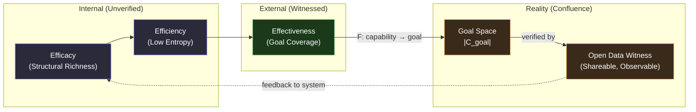
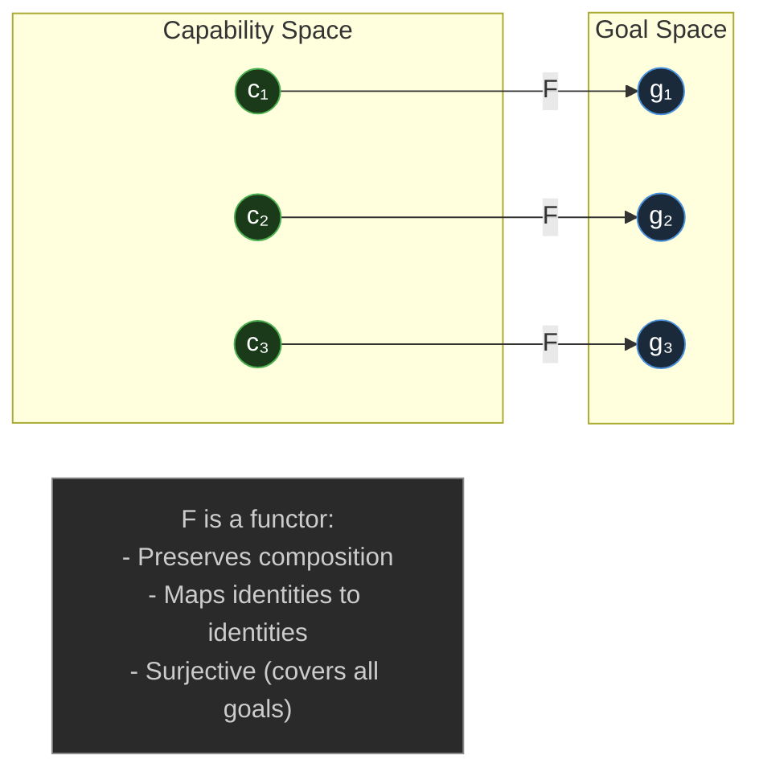
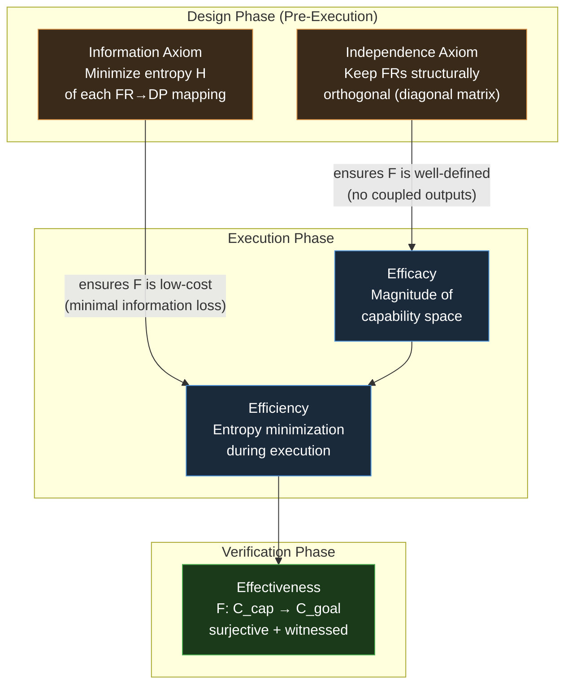

# Effectiveness

**Effectiveness** is the third and final dimension of the **[[3E Framework]]**. It answers the validation question:

> **"Did it achieve the goal in reality?"** — More precisely: "Does the Magnitude of the achieved output match the Magnitude of the goal space, as witnessed by an external, shareable observer?"

Effectiveness cannot be measured internally. It requires **Confluence** — an open, shareable, verifiable state change in external reality. Without this, both [[Efficacy]] and [[Efficiency]] remain unverified claims.

**Effectiveness** maps most naturally to:

**有效性** (yǒu xiào xìng) — the most direct and widely accepted translation, used across academic, scientific, and policy writing.

But the fuller picture depends on context:

| Word   | Pinyin           | Best for                                           |
| ------ | ---------------- | -------------------------------------------------- |
| 有效性 | yǒu xiào xìng | General effectiveness, scientific/academic         |
| 效果   | xiào guǒ       | Concrete result or outcome ("the effect was good") |
| 成效   | chéng xiào     | Achieved effectiveness, results actually realized  |
| 效能   | xiào néng      | Systemic/organizational effectiveness (capacity)   |
| 实效   | shí xiào       | Practical, real-world effectiveness                |

A few distinctions worth noting:

- **效果** is more colloquial and result-oriented — "did it work?" — whereas **有效性** is more abstract and evaluative.
- **成效** implies _demonstrated_ effectiveness — you use it when results have already been seen, e.g. "the program showed 成效."
- **实效** is often used in reform or policy language to emphasize _tangible, on-the-ground_ impact as opposed to theoretical effectiveness.

In the context of your PKC and educational transformation work, **实效** or **成效** would carry strong rhetorical weight — both signal that the system _actually delivers_, not just in theory.

---

## Definition

**Effectiveness** = the degree to which a system's output covers the **diversity of the goal space**, as verified by an external witness.

Formally, it is a **functorial mapping** from the capability space to the goal space:

$$
F: \mathcal{C}_{\text{capability}} \to \mathcal{C}_{\text{goal}}
$$

Effectiveness is **maximized** when $F$ is:

1. **Total** (defined for all capabilities)
2. **Surjective** (every dimension of the goal space is covered by at least one output)
3. **Magnitude-preserving**: $|F(\mathcal{C}_{\text{cap}})| \geq |\mathcal{C}_{\text{goal}}|$

---

## Why Effectiveness Requires an External Witness

Efficacy proofs and Efficiency calculations can all be done internally — they are properties of the system itself. But **Effectiveness** is *inherently relational*: it is about the match between the system's output and the external environment's goal.

> **The Confluence Principle**: An effect only exists when it is *shareable* — when it is encoded in a medium that other observers can access and verify. This aligns with the **[[Hub/Theory/Integration/The Spacetime-Confluence Closure|Spacetime-Confluence Closure]]**: Confluence (the third element) is what makes Space and Time *real* rather than merely hypothetical.

---

## Magnitude Alignment: The Coverage Condition

Effectiveness requires that the **Magnitude of the output** is sufficient to cover the **Magnitude of the goal**:

$$
|\mathcal{C}_{\text{output}}| \geq |\mathcal{C}_{\text{goal}}|
$$

This is the **Coverage Condition**. Its failure modes are:

| Failure Mode                 | $\vert\mathcal{C}_{\text{output}}\vert$ vs $\vert\mathcal{C}_{\text{goal}}\vert$                        | Interpretation                                                     |
| :--------------------------- | :---------------------------------------------------------------------------------------------------------- | :----------------------------------------------------------------- |
| **Efficacy deficit**   | $\vert\mathcal{C}_{\text{output}}\vert < \vert\mathcal{C}_{\text{goal}}\vert$                             | System cannot cover all goal dimensions — insufficient capability |
| **Misdirected effort** | $\vert\mathcal{C}_{\text{output}}\vert \geq \vert\mathcal{C}_{\text{goal}}\vert$ but $F$ not surjective | System has enough capability but it's aimed at the wrong regions   |
| **Effective**          | $\vert\mathcal{C}_{\text{output}}\vert \geq \vert\mathcal{C}_{\text{goal}}\vert$ and $F$ surjective     | ✅ Every goal dimension is covered                                 |
| **Over-specified**     | $\vert\mathcal{C}_{\text{output}}\vert \gg \vert\mathcal{C}_{\text{goal}}\vert$                           | Wasteful — more capability than needed (Efficiency problem)       |

---

## Effectiveness as Diversity Transformation

From the perspective of **[[Magnitude]]**, Effectiveness is a **Diversity Transformation**: it verifies that the *informational diversity* of the capability space ($|\mathcal{C}_{\text{cap}}|$) has been successfully *transposed* onto the *informational diversity* of the goal space ($|\mathcal{C}_{\text{goal}}|$).

This is not merely an injection of outputs into targets. It is:

1. **Structural fidelity**: The topology of the capability space maps *coherently* to the topology of the goal space (functoriality preserves structure)
2. **Diversity preservation**: No conceptual territory in the goal is left uncovered
3. **Observability**: The mapping is *confirmed* by an observable state change in reality

---

## Curry-Howard-Lambek Perspective

Under the **[[Curry-Howard-Lambek correspondence]]**, Effectiveness maps to the **Category Theory** pillar:

| CHL Pillar                                      | 3E Metric               | Formal Object                                                         |
| :---------------------------------------------- | :---------------------- | :-------------------------------------------------------------------- |
| Logic (Propositions & Proofs)                   | *Efficacy*            | Proof of capability                                                   |
| Computation (Types & Programs)                  | *Efficiency*          | Linear program with resource tracking                                 |
| **Category Theory (Objects & Morphisms)** | **Effectiveness** | **A functor from the capability category to the goal category** |

In Category Theory, a **functor** is a structure-preserving map. Effectiveness is the categorical proof that the system's internal structure has been coherently mapped to an external reality — not merely that an output exists, but that the *structure* of the need and the *structure* of the response are aligned.

---

## The Governance Dimension: Accountability as Effectiveness

In the context of **[[Hub/Theory/Integration/Representability, Observability, and Accountability - The Isomorphism of Code and Governance|Governance]]**, Effectiveness is equivalent to **Accountability**:

| Governance Term          | Mathematical Term                    | 3E Term                            |
| :----------------------- | :----------------------------------- | :--------------------------------- |
| Representability         | Covers the domain (Efficacy)         | Can we do it?                      |
| Observability            | Traceable execution (Efficiency)     | Can we verify the process?         |
| **Accountability** | **External witness of impact** | **Did it achieve the goal?** |

Accountability without an Open Data witness is merely an internal claim. **[[Hub/Theory/Integration/Knowledge|Knowledge]]** itself is only *Shareable* (the third property of Knowledge = Representable + Contextualized + **Shareable**) when it can be witnessed by others — exactly the Confluence property of Effectiveness.

---

## Effectiveness Diagnostic Table

| Condition                                                                              | Verdict                              | Recommended Action                                  |
| :------------------------------------------------------------------------------------- | :----------------------------------- | :-------------------------------------------------- |
| $F$ surjective, $\|F(\mathcal{C})\| \geq \|\mathcal{C}_{\text{goal}}\|$, witnessed | ✅**Effective**                | Sustain and scale                                   |
| $F$ not surjective (gaps in goal coverage)                                           | ⚠️**Ineffective (mismatch)** | Redirect capabilities toward uncovered goal regions |
| No external witness (claim unverified)                                                 | ⚠️**Unconfirmed**            | Identify and implement observable state change      |
| $\|\mathcal{C}_{\text{cap}}\| < \|\mathcal{C}_{\text{goal}}\|$                       | ❌**Efficacy insufficient**    | Return to[[Efficacy]]: build structural richness first          |
| Witness exists but goal modified post-hoc                                              | ❌**Goal drift**               | Re-verify$F$ against updated goal space           |

---

## Connection to Open Data and the "Shareable" Property

Effectiveness requires that the witness be **Open** — accessible to external observers. This connects directly to:

- **[[Hub/Theory/Category Theory/Yoneda Lemma|Yoneda Lemma]]**: An object is fully determined by its relationships to all other objects. Effectiveness proves the system's relationships to the goal space are as declared.
- **[[Hub/Theory/Integration/Knowledge|Knowledge]]**: Knowledge is only *real* when it is Shareable (Confluence). An effective action *produces shareable knowledge* about the goal state.
- **Open Data**: Without open, verifiable data about outcomes, Effectiveness claims are merely internal assertions — what academic accountability often fails to provide (see **[[Hub/Theory/Sciences/The unreasonable ineffectiveness of academic style of knowledge representation|The Unreasonable Ineffectiveness of Academic Style]]**).

---

## Axiomatic Design: The Design-Side Theory of Effectiveness

**[[Hub/Theory/Sciences/Computer Science/Programming Model/Axiomatic Design|Axiomatic Design]]** (Nam-Pyo Suh) is the *pre-execution* theory that tells engineers *how* to design a system so that Effectiveness is achievable. The **[[Hub/Theory/Category Theory/Logic/Information Axiom|Information Axiom]]** and **[[Hub/Theory/Category Theory/Logic/Independence Axiom|Independence Axiom]]** are the conditions that make the functor $F: \mathcal{C}_{\text{cap}} \to \mathcal{C}_{\text{goal}}$ both *possible* (Independence) and *efficient* (Information).

### The Two Axioms as Pre-Conditions for Effectiveness

| Axiomatic Design Concept                                | Role in Effectiveness                                      | 3E Link                                                                 |
| :------------------------------------------------------ | :--------------------------------------------------------- | :---------------------------------------------------------------------- |
| **Functional Requirements (FRs)**                 | The*goal space* $\mathcal{C}_{\text{goal}}$            | Defines what Effectiveness must cover                                   |
| **Design Parameters (DPs)**                       | The*capability space* $\mathcal{C}_{\text{cap}}$       | Defines what[[Efficacy]] measures                                                   |
| **Design Matrix**                                 | The mapping$F: \text{DP} \to \text{FR}$                  | The functor whose surjectivity = Effectiveness                          |
| **Independence Axiom**                            | Diagonal Design Matrix                                     | Ensures$F$ has no spurious couplings — each DP maps to a distinct FR |
| **Information Axiom**                             | Minimizes$H$ of each mapping                             | Ensures[[Efficiency]]: lowest-entropy path from DP to FR                              |
| **System Information Content $I_{\text{sys}}$** | $I_{\text{sys}} = -\log_2 P\{\text{all FRs satisfied}\}$ | The entropy cost of the effectiveness claim                             |

### The Information Axiom IS Effectiveness Optimization

The **Information Axiom** states: *"Choose the design with the lowest information content (entropy) among those that satisfy all Functional Requirements independently."*

This is precisely **Effectiveness Optimization** framed from the design side:

$$
\text{Effectiveness-Optimal Design} = \underset{\text{DP configurations}}{\arg\min}\; I_{\text{sys}} \quad \text{subject to } F \text{ surjective}
$$

- **Surjectivity** (every FR is covered) = the Effectiveness condition.
- **Minimum $I_{\text{sys}}$** = the [[Efficiency]] condition applied to the design itself.
- The **Independence Axiom** ensures that satisfying one FR does not accidentally violate another — it makes the Coverage Condition *computable* (each FR can be checked independently).

### SNR View: Effectiveness as Signal-to-Noise in the FR-DP Mapping

From **[[Hub/Theory/Entropy, Diversity, and Axiomatic Design|Entropy, Diversity, and Axiomatic Design]]** (Leinster + Suh synthesis):

$$
\text{System SNR} = 1 - \prod_{i=1}^{n}(1 - \text{SNR}_i)
$$

where $n$ is the number of *independent* (non-coupled) DP→FR paths — Leinster's effective diversity $D_q$.

| Design Quality                                    | Effect on Effectiveness             | Mechanism                                            |
| :------------------------------------------------ | :---------------------------------- | :--------------------------------------------------- |
| High Independence ($D_q \approx$ Cardinality)   | High SNR, robust Effectiveness      | Each FR is verified by a distinct, uncorrelated DP   |
| Low Independence (coupled design)                 | SNR degrades, Effectiveness fragile | One DP failure collapses multiple FRs simultaneously |
| Low$I_{\text{sys}}$ (diagonal, minimal entropy) | High Effectiveness at minimum cost  | Minimum entropy gap between DP-state and FR-state    |
| High$I_{\text{sys}}$ (coupled, complex)         | Effectiveness claims unreliable     | High uncertainty that FRs are actually satisfied     |

### Magnitude as the Bridge Between Axiomatic Design and Effectiveness

From the **[[Hub/Theory/Category Theory/Logic/Information Axiom|Information Axiom]]**: the Magnitude $|\mathcal{D}|$ of the Design Category behaves as a **Partition Function**:

$$
|\mathcal{D}| \approx \sum e^{-I_{\text{sys}}} \;\propto\; \text{Probability of achieving all FRs}
$$

This unifies Leinster's Category Theory with Suh's engineering axioms:

- **Maximizing $|\mathcal{D}|$** = maximizing the probability of achieving all FRs = **Maximizing Effectiveness**.
- **Minimizing $I_{\text{sys}}$** (Information Axiom) = maximizing Magnitude = maximizing Effectiveness.
- The Coverage Condition $|F(\mathcal{C}_{\text{cap}})| \geq |\mathcal{C}_{\text{goal}}|$ is equivalent to requiring that the Magnitude of the executed design covers the Magnitude of the goal space.

### Accountability as Design Verification

Axiomatic Design's **Design Matrix** gives us the *traceability* that Effectiveness requires:

- Every FR (goal) is linked to exactly one DP (capability) in an uncoupled design.
- Every DP→FR entry is a *verifiable morphism* — observable via tracing (OpenTelemetry, eBPF).
- **Effectiveness = the Design Matrix executes correctly in reality**, confirmed by an Open Data witness.

This closes the loop: [[Axiomatic Design]] tells you *how to build* for Effectiveness; the [[3E Framework]] tells you *how to verify* Effectiveness was achieved.

---

## See Also

- **[[3E Framework]]** — The parent framework
- **[[Efficacy]]** — The prerequisite: structural richness of the capability space
- **[[Efficiency]]** — The second step: entropy minimization
- **[[Magnitude]]** — The metric for measuring both capability and goal diversity
- **[[Hub/Theory/Sciences/Computer Science/Programming Model/Axiomatic Design|Axiomatic Design]]** — How to design FR-DP mappings so Effectiveness is achievable
- **[[Hub/Theory/Category Theory/Logic/Information Axiom|Information Axiom]]** — Minimize $I_{\text{sys}}$ = Maximize Effectiveness probability
- **[[Hub/Theory/Category Theory/Logic/Independence Axiom|Independence Axiom]]** — Makes the Coverage Condition independently checkable per FR
- **[[Hub/Theory/Entropy, Diversity, and Axiomatic Design|Entropy, Diversity, and Axiomatic Design]]** — Leinster + Suh synthesis: SNR as System Effectiveness
- **[[Hub/Theory/Integration/The Spacetime-Confluence Closure|The Spacetime-Confluence Closure]]** — Confluence as the third element of reality
- **[[Hub/Theory/Integration/Representability, Observability, and Accountability - The Isomorphism of Code and Governance|Representability, Observability, Accountability]]** — Governance isomorphism
- **[[Hub/Theory/Integration/Knowledge|Knowledge]]** — Representable + Contextualized + **Shareable**
- **[[Hub/Theory/Category Theory/Yoneda Lemma|Yoneda Lemma]]** — Why external relationships define internal identity
- **[[Hub/Tech/Epiplexity|Epiplexity]]** — Bounded-observer limits on verifiable impact
