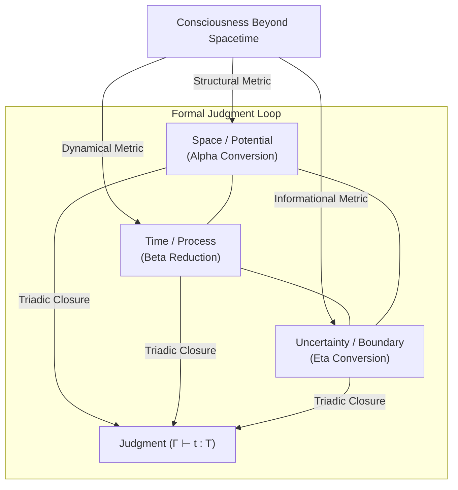

# Lambda Calculus and the Three Metrics of Consciousness

> **Core Thesis**: The three rules of Alonzo Church's [[Hub/Theory/Sciences/Computer Science/Programming Model/Lambda Calculus|Lambda Calculus]] ($\alpha$-conversion, $\beta$-reduction, and $\eta$-conversion) are not a historical accident, but a structural necessity. When mapped to the framework of [[Literature/Reading notes/@Hoffman_Consciousness_Beyond_Spacetime|Consciousness Beyond Spacetime]], they represent the three fundamental resource metrics of any observer interface: **Space**, **Time**, and **Uncertainty**. Among these, **Uncertainty** operates as a bounded, normalized measurement that provides the topological closure required to terminate a formal [[Literature/PKM/Judgment|Judgment]].

---

## Part I: The Spacetime Headset and the Triadic Interface

In his *Interface Theory of Perception*, Donald Hoffman mathematically demonstrates that natural selection shapes sensory systems to prioritize evolutionary fitness over veridical truth. Spacetime and physical objects are not the fundamental substrate of reality; they are a species-specific "desktop interface" designed to hide the underlying complexity of a vast network of interacting conscious agents.

At the Planck scale ($10^{-33}\text{ cm}$ and $10^{-43}\text{ s}$), spacetime breaks down and loses all operational meaning. As explored in [[Hub/Theory/Category Theory/Logic/Glossary/Why Three|Why Three? The Structural Necessity of Reality]], we must step outside the spacetime manifold to find the fundamental mathematical structures of computation and consciousness.

When we model the resources available to an observer (whether a biological consciousness or a formal compiler) operating outside spacetime, we find precisely **three resource metrics**:

1.**Space**: The metric of structure, layout, and potential.

2.**Time**: The metric of process, evolution, and transaction.

3.**Uncertainty**: The metric of informational entropy, boundary, and closure.

These three metrics map directly to the three primitive elements and the three reduction rules of the Lambda Calculus, demonstrating that computation is the physics of consciousness.

*Diagram: The triadic resource metrics of consciousness forming a closed loop of formal judgment.*

---

## Part II: The Three Rules and Their Resource Metrics

The Lambda Calculus is composed of three syntax categories (Variables, Abstraction, Application) and three conversion rules ($\alpha$, $\beta$, $\eta$). These rules represent the minimal vocabulary to compute and perceive.

### 1. Space $\leftrightarrow$ $\alpha$-Conversion (Renaming and Structural Potential)

Alpha conversion ($\alpha$-equivalence) states that the names of bound variables are irrelevant: $(\lambda x. x) \equiv (\lambda y. y)$.

***The Space Metric**: In spatial geometry, absolute coordinates are arbitrary; only relative distance and topological connectivity matter. Alpha conversion establishes the **Spatial Metric** of the computation. It defines the variable scope and layout (the "where" of bindings).

***Logical Alignment**: It corresponds to the **Type $T$** (the Abstract Specification or the $A$-layer of the [[Cubical Logic Model|CLM]]). It defines the invariant space of possibilities before any action is taken.

### 2. Time $\leftrightarrow$ $\beta$-Reduction (Application and Dynamical Process)

Beta reduction is the process of applying a function to an argument by substituting occurrences of the bound variable: $(\lambda x. M) N \to M[x := N]$.

***The Time Metric**: Substitution is a state change. It has a direction (reduction towards normal form) and takes place over sequential steps. It represents the **Time Metric** of the computation (the "when" of execution).

***Logical Alignment**: It corresponds to the **Term $t$** (the Concrete Implementation or the $C$-layer of the CLM). It is the algorithm running, consuming resources, and progressing along a causal trajectory.

### 3. Uncertainty $\leftrightarrow$ $\eta$-Conversion (Extensionality and Bounded Witness)

Eta conversion captures extensionality: $(\lambda x. f\ x) \equiv f$ (provided $x$ is not free in $f$). It asserts that two processes are identical if they produce identical outputs for all inputs.

***The Uncertainty Metric**: Eta conversion abstracts away the internal temporal steps ($\beta$-reductions) and spatial variations ($\alpha$-renaming). It measures the functional equivalence of two systems from the outside. It represents the **Uncertainty Metric** of the observer—the limit of what can be known or distinguished.

***Logical Alignment**: It corresponds to the **Context/Turnstile $\Gamma\vdash$** (the Balanced Test or the $B$-layer of the CLM). It is the witness that verifies that the execution matches the specification.

---

## Part III: Uncertainty and the Logic of Bounded Closure

An open-ended traversal of Space and Time can iterate indefinitely, leading to infinite regress or uncomputable paths (e.g., the halting problem). To make a definitive **[[Literature/PKM/Judgment|Judgment]]**, a system must achieve **closure**.

A formal judgment is represented in type theory as:

$$
\Gamma\vdash t : T
$$

Which states that in context $\Gamma$ (the history of observations), the evidence $t$ (the term) satisfies the specification $T$ (the type). The question is: *How is this judgment terminated?*

### Bounded and Normalized Uncertainty

Uncertainty ($U$) acts as a bounded, normalized metric:

$$
U \in [0, 1]
$$

* $U = 1$: Maximum entropy, zero information (the Bottom state $\bot$ or the Empty Schema).
* $U = 0$: Absolute certainty, a resolved equivalence.

The act of making a judgment is the process of driving the uncertainty metric to zero (or within a bounded limit $\delta$, the [[Hub/Theory/Sciences/Computer Science/NSM/Lebesgue Number|Lebesgue Number]]).

The $\eta$-rule provides the mathematical mechanism for this closure. By establishing that $(\lambda x. f\ x) = f$, it collapses the infinite potential evaluations of $f$ in time and space into an extensional, static identity. It stops the infinite loop of "testing the function for one more input." It bounds the uncertainty of functional behavior, allowing the observer to declare the judgment complete.

*Diagram: The progression of U from maximum entropy to normalized closure.*

---

## Part IV: The Geometry of Judgment and the 3D Witness

In Cartesian [[Hub/Theory/Category Theory/Type Theory/Homotopy & Cubical/Cubical Type Theory|Cubical Type Theory (CTT)]], we see the geometric necessity of three dimensions to compute path-equivalence without losing canonicity.

1.**Dimension $i$ (Space/Time Path)**: Represents the transformation from $0\to1$. This is the 1D path of execution—the computation running in space-time.

2.**Dimension $j$ (The Witness / Balanced Axis)**: The independent interval ($j \in\mathbb{I}$) that sweeps orthogonally across the $i$ traversal to form a 2D square.

3.**The 3D Cube**: The volume required to run a [[Hub/Theory/Category Theory/Type Theory/Homotopy & Cubical/Recursive Kan Filling Algorithm|recursive Kan filling algorithm]].

Without the independent witness dimension $j$, the observer cannot simultaneously relate to the starting assertion ($A$) and the ending implementation ($C$). This is the cognitive parallel of the **Observer's Standpoint**: to construct a causal relation between two events on a 2D plane, the observer must occupy a third dimension, triangulating the events to project a relation.

By using the third dimension (Uncertainty / Witness), the system achieves **Triadic Closure**. Instead of relying on an external referee (which triggers an infinite regress of judges judging judges), the three axes act as mutual validators:

***Space** ($\alpha$) bounds the domain of **Time** ($\beta$).

***Time** ($\beta$) generates the evidence for **Uncertainty** ($\eta$).

***Uncertainty** ($\eta$) normalizes and certifies the structural identity of **Space** ($\alpha$).

This mutual judgment loop forms a self-sufficient, stable boundary. Once the proof is completed, the system undergoes a phase transition—collapsing from a dynamic network-waiting state ([[Mealy Machine]]) into a static, terminal truth ([[Moore Machine]]) at a [[Hub/Theory/Category Theory/Type Theory/Constructs/Free Termination State|Free Termination State]]. The judgment is signed, and a content-addressed record (the VCard) is permanently instantiated.

---

## Part V: Comparison of the Triadic Universes

The triadic mapping persists across physical, computational, and cognitive layers:

| Resource Metric | Lambda Calculus Rule | CLM / Triad Layer | CTT Geometry | Hoffman's Agent Network |
| :--- | :--- | :--- | :--- | :--- |
| **Space** | $\alpha$-conversion (Renaming) | $A$ (Abstract Spec) / Type | Variables / Boundaries | Configuration / Topology |
| **Time** | $\beta$-reduction (Substitution) | $C$ (Concrete Impl) / Term | Traversal ($i \in [0,1]$) | Markovian Transitions (Dynamics) |
| **Uncertainty** | $\eta$-conversion (Extensionality) | $B$ (Balanced Test) / Verifier | Kan-filling ($j \in \mathbb{I}$) | Bounded Measurement / Observation |

---

## Conclusion: All We Need is Three

Reducing the universe of representations to exactly three complete primitives (Space, Time, and Uncertainty) is the key to [[Hub/Tech/Intelligence as information compression|Intelligence as Information Compression]]. A bloated schema with more than three rules introduces redundant dimensions, lowering the signal-to-noise ratio and making self-reflection computationally expensive.

By employing the minimal complete alphabet of three, consciousness achieves a high-density representation that guarantees predictable termination and recursive self-awareness. The three rules of Lambda Calculus are the mathematical bones of this minimal interface—allowing a finite agent to hold a stable, verifiably correct image of an infinite reality.

---

## See Also

* [[Hub/Theory/Category Theory/Logic/Glossary/Why Three|Why Three? The Structural Necessity of Reality]]
* [[Hub/Theory/Sciences/Computer Science/Programming Model/Lambda Calculus|Lambda Calculus]]
* [[Literature/PKM/Judgment|Judgment: a statement made about some 'other' thing]]
* [[Literature/Reading notes/@Hoffman_Consciousness_Beyond_Spacetime|Donald Hoffman - Consciousness Beyond Spacetime]]
* [[Hub/Theory/Sciences/Uncertainty|Uncertainty — Probability, Information, and Decision Risk]]
* [[Hub/Theory/Sciences/Spatial Complexity|Spatial Complexity — Geometry, Topology, and Opportunity]]
* [[Hub/Theory/Sciences/Temporal Complexity|Temporal Complexity — Dynamics, Timescales, and Effort]]
* [[Hub/Theory/Category Theory/Type Theory/Homotopy & Cubical/Cubical Type Theory|Cubical Type Theory]]
