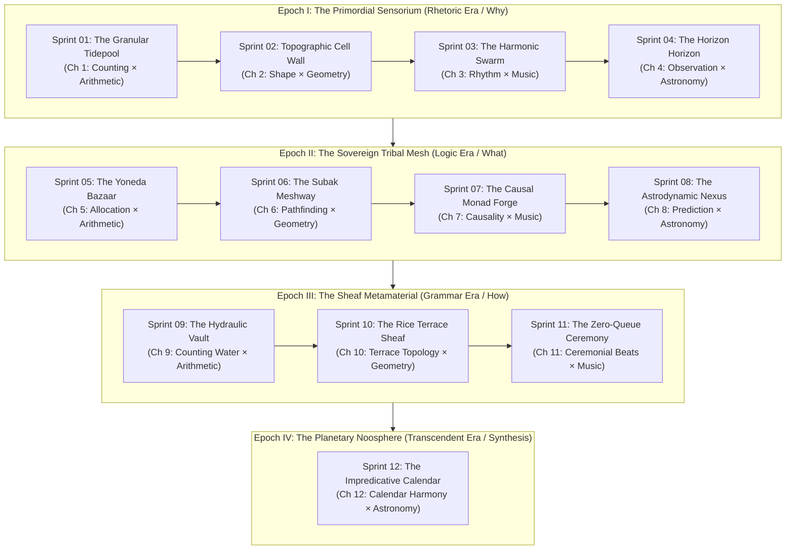
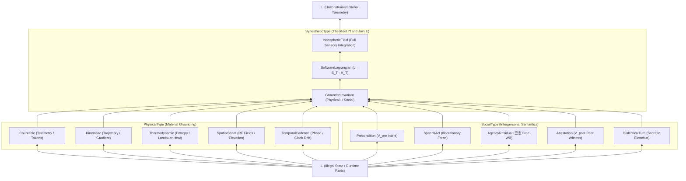

# Prologue of Spacetime: Ludic Architecture, Strategy Game Sprints, and the Synesthetic Type Lattice

This architectural document translates the $3 \times 4$ curriculum matrix of the **[[Hub/Tech/Prologue of Spacetime - Master Navigation|Prologue of Spacetime]]** into a playable grand strategy game of civilizational evolution, analogous to *Spore* and *Age of Empires*. Across twelve development sprints organized into four civilizational epochs, players progress from primordial sensory discovery to a planetary noosphere. 

Player skill trees are formalized within a categorical **[[Hub/Theory/Category Theory/Type Lattice|Type Lattice]]**, decomposing actions into **Physically Meaningful Data Manipulation** (`PhysicalType`) and **Socially Meaningful Data Manipulation** (`SocialType`). Mastery of these dual skills progressively unlocks higher tiers of **[[Hub/Theory/Sciences/Computer Science/Digital Synesthesia|Digital Synesthesia]]**, transducing complex mathematical and systemic invariants directly into human sensory perception.

---

## 1. The Civilizational Epoch Architecture

Diagram: Civilizational progression through the twelve sprints and four epochs of Prologue of Spacetime.

---

## 2. The Dual-Type Skill Lattice

Player competencies operate over the **[[Permanent/Projects/LogicModel/Unifying Linear Algebra Type Theory and Linear Logic via the Type Lattice|Type Lattice]]**, bounded by Top ($\top$, unconstrained continuous data) and Bottom ($\bot$, dimensional collapse / illegal state).

Diagram: The Type Lattice organizing player skills into physical, social, and synesthetic dimensions.

### 2.1 Type Definitions
1. **`PhysicalType`**: Data manipulation preserving conservation laws ($\nabla \cdot \mathbf{J} = 0$), minimizing Landauer bit-erasure dissipation ($\Delta H_T \ge 0$), and navigating physical topography.
2. **`SocialType`**: Data manipulation establishing deontic commitments, speech act perlocution, and sovereign agentic resolution ($\ddot{x}_{\text{actual}} - \ddot{x}_{\text{forced}} = \text{己志}$).
3. **`SynestheticType`**: Higher-order type operations mapping invariant preservation directly into cross-modal sensory affordances (timbre, chromatic phase, haptic tension, holographic geometry).

---

## 3. The Twelve Sprints: Mechanics, Skills, and Synesthesia

### Epoch I: The Primordial Sensorium (Rhetoric Era)

#### Sprint 01 — The Granular Tidepool
- **Chapter**: [[Hub/Tech/Prologue/Chapter 1 - The Value of Counting|Chapter 1: The Value of Counting]] (Arithmetic × Rhetoric).
- **Civilizational Analogue**: *Spore* Tidepool / Primordial Soup.
- **Ludic Mechanics**: Sieve raw stochastic bitstreams. Players manipulate sorting gates to separate thermodynamic white noise ($H \to \infty$) into discrete integer token buckets ($\mathbb{N}$).
- **Skill Types**:
  - `PhysicalType`: `Countable` — discrete sample collection, packet rate filtering.
  - `SocialType`: `Precondition` — setting $V_{\text{pre}}$: defining what constitutes "valuable signal" vs waste.
- **Invariant Victory**: Shannon entropy reduction $\Delta H < -\epsilon$ without dropped tokens.
- **Digital Synesthesia Unlocked**: **Auditory Pulse Train (Level 1)**. Stochastic noise sounds like harsh static; token streams resolve into crisp, rhythmic acoustic clicks.

#### Sprint 02 — The Topographic Cell Wall
- **Chapter**: [[Hub/Tech/Prologue/Chapter 2 - The Meaning of Shape|Chapter 2: The Meaning of Shape]] (Geometry × Rhetoric).
- **Civilizational Analogue**: Cellular Membrane Formation / Nomadic Boundary Marking.
- **Ludic Mechanics**: Geometric place-making. Players erect cellular containers ($受$) to shelter tokens from hostile environmental entropy gradients.
- **Skill Types**:
  - `PhysicalType`: `SpatialSheaf` — perimeter triangulation, area-to-volume ratio optimization.
  - `SocialType`: `AgencyResidual` ($\text{己志}$) — demarcating the boundary between internal sovereign will and external coercive fields.
- **Invariant Victory**: Gauss-Bonnet curvature closure around protected tokens.
- **Digital Synesthesia Unlocked**: **Topological Parallax (Level 2)**. Latency and entropy gradients warp the visual field; safe enclosures appear as calm, optically undistorted wells.

#### Sprint 03 — The Harmonic Swarm
- **Chapter**: [[Hub/Tech/Prologue/Chapter 3 - The Power of Rhythm|Chapter 3: The Power of Rhythm]] (Music × Rhetoric).
- **Civilizational Analogue**: Early Tribal Chants / Coordinated Flocking.
- **Ludic Mechanics**: Rhythmic cadence locking. Players coordinate autonomous agents by tuning execution intervals, counteracting disordered chaotic "Bayhem."
- **Skill Types**:
  - `PhysicalType`: `TemporalCadence` — clock drift correction, frequency modulation.
  - `SocialType`: `SpeechAct` (Illocution) — issuing rhythmic calls that demand synchronized tribal responses.
- **Invariant Victory**: Leinster diversity measure $D(P) > \theta$ maintained under perturbation.
- **Digital Synesthesia Unlocked**: **Harmonic Dissonance Perception (Level 3)**. Desynchronized network nodes emit grating microtonal tritones; synchronization blooms into consonant pentatonic chords.

#### Sprint 04 — The Horizon of Consensus
- **Chapter**: [[Hub/Tech/Prologue/Chapter 4 - The Truth of Observation|Chapter 4: The Truth of Observation]] (Astronomy × Rhetoric).
- **Civilizational Analogue**: Megalithic Skywatching / The Council of Elders.
- **Ludic Mechanics**: Multi-observer parallax triangulation. Players synthesize disparate sensory perspectives across distant nodes to establish a Single Source of Truth without a central authority.
- **Skill Types**:
  - `PhysicalType`: `Kinematic` — angular baseline measurement, light-cone triangulation.
  - `SocialType`: `Attestation` ($V_{\text{post}}$) — cross-signing observations to defeat Sybil illusions.
- **Invariant Victory**: Epistemic variance $\sigma^2_{\text{truth}} \to 0$ across all sovereign observers.
- **Digital Synesthesia Unlocked**: **Spectral Coherence (Level 4)**. Conflicting sensory reports appear as blurred chromatic aberration; consensus collapses into a single, laser-sharp spectral line.

---

### Epoch II: The Sovereign Tribal Mesh (Logic Era)

#### Sprint 05 — The Yoneda Bazaar
- **Chapter**: [[Hub/Tech/Prologue/Chapter 5 - Resource Allocation|Chapter 5: Resource Allocation]] (Arithmetic × Logic).
- **Civilizational Analogue**: Tribal Barter / The Emergence of Currencies.
- **Ludic Mechanics**: Dual-category resource exchange. Players allocate scarce compute, water, and bandwidth by measuring items via their relational test probes ($\text{Hom}(-, A)$).
- **Skill Types**:
  - `PhysicalType`: `Thermodynamic` — measuring Landauer bit-erasure cost of ledger updates.
  - `SocialType`: `Precondition` & `SpeechAct` — negotiating bilateral barter contracts.
- **Invariant Victory**: Dual balance $\sum \text{Inflow} = \sum \text{Outflow}$ with zero deadweight loss.
- **Digital Synesthesia Unlocked**: **Thermal Haptic Feedback (Level 5)**. Inefficient resource allocations generate burning tactile drag on controls; balanced flows feel ice-smooth and frictionless.

#### Sprint 06 — The Subak Meshway
- **Chapter**: [[Hub/Tech/Prologue/Chapter 6 - Network Pathfinding|Chapter 6: Network Pathfinding]] (Geometry × Logic).
- **Civilizational Analogue**: Irrigation Canals / The Silk Road Mesh.
- **Ludic Mechanics**: Ad-hoc mesh routing over [[Reticulum Network|Reticulum]]. Players guide packets through dynamic terrain topologies without central routers, routing around jamming and landlord toll-gates.
- **Skill Types**:
  - `PhysicalType`: `SpatialSheaf` — sub-GHz RF link budget calculation, hop-count minimization.
  - `SocialType`: `AgencyResidual` — selecting paths that preserve cryptographic anonymity and avoid surveillance choke-points.
- **Invariant Victory**: Zero packet starvation across all edge nodes.
- **Digital Synesthesia Unlocked**: **Fluidic Vector Streams (Level 6)**. Packets render as luminous fluid streamlines flowing over elevation contours; congested nodes generate visible turbulent vortices.

#### Sprint 07 — The Causal Monad Forge
- **Chapter**: [[Hub/Tech/Prologue/Chapter 7 - Temporal Causality|Chapter 7: Temporal Causality]] (Music × Logic).
- **Civilizational Analogue**: Bronze Age Metal Casting / The Invention of Written Law.
- **Ludic Mechanics**: Petri Net Place-Transition execution. Players arrange transitions to fire tokens strictly respecting non-commutative causal dependencies ($A \circ B \neq B \circ A$).
- **Skill Types**:
  - `PhysicalType`: `TemporalCadence` — barrier synchronization, race condition elimination.
  - `SocialType`: `DialecticalTurn` — serializing multi-agent debates into linear historical ledgers.
- **Invariant Victory**: Net boundedness and liveness preserved ($[\![ M_0 \rangle M_{\text{final}} ]\!]$ without deadlock).
- **Digital Synesthesia Unlocked**: **Phosphorescent Causal Trails (Level 7)**. Past state transitions leave glowing phosphorescent light-cones in 3D space, showing the irreversible arrow of historical causality.

#### Sprint 08 — The Astrodynamic Nexus
- **Chapter**: [[Hub/Tech/Prologue/Chapter 8 - Orbit Prediction|Chapter 8: Orbit Prediction]] (Astronomy × Logic).
- **Civilizational Analogue**: Classical Navigation / Astrolabe Chronometry.
- **Ludic Mechanics**: Socratic feedback loops. Players feed system performance metrics back into forward-simulation models to forecast ecological and economic collapses before they occur.
- **Skill Types**:
  - `PhysicalType`: `Kinematic` — phase space trajectory integration, Lyapunov exponent estimation.
  - `SocialType`: `DialecticalTurn` (Aporia & Maieutics) — rejecting unsustainable growth plans through Socratic cross-examination.
- **Invariant Victory**: Closed stable limit cycle in system phase portrait ($\text{Tr}(\mathcal{M}) < 2$).
- **Digital Synesthesia Unlocked**: **Attractor Manifold Holography (Level 8)**. System futures hover in the player's peripheral vision as iridescent geometric attractors; looming instability causes the attractor to visibly tear.

---

### Epoch III: The Sheaf Metamaterial (Grammar Era)

#### Sprint 09 — The Hydraulic Vault
- **Chapter**: [[Hub/Tech/Prologue/Chapter 9 - Counting Water|Chapter 9: Counting Water]] (Arithmetic × Grammar).
- **Civilizational Analogue**: Aqueduct Engineering / Double-Entry Bookkeeping.
- **Ludic Mechanics**: Typed micro-measurement. Players design typed container structures (Sum Types $A + B$ and Product Types $A \times B$) to serialize physical water flows into immutable [[MCard|MCards]].
- **Skill Types**:
  - `PhysicalType`: `Countable` — discrete cubic-meter volumetric telemetry.
  - `SocialType`: `Attestation` — multi-party cryptographic sealing of measurement batches.
- **Invariant Victory**: Zero-leakage invariant: $\int Q_{\text{in}} \, dt - \int Q_{\text{out}} \, dt = \Delta V_{\text{storage}}$.
- **Digital Synesthesia Unlocked**: **Crystalline Lattice Sight (Level 9)**. Data schemas crystallize into geometric gemstones; schema mismatches and type errors appear as microscopic structural fractures.

#### Sprint 10 — The Rice Terrace Sheaf
- **Chapter**: [[Hub/Tech/Prologue/Chapter 10 - Rice Terrace Topology|Chapter 10: Rice Terrace Topology]] (Geometry × Grammar).
- **Civilizational Analogue**: Terraced Agriculture / City-State Sheaf Federations.
- **Ludic Mechanics**: Sheaf gluing across terrace boundaries. Players stitch local agricultural water rules together into global valley policies without central coordinators, ensuring cross-terrace tensors vanish ($T_{ij} \equiv 0$).
- **Skill Types**:
  - `PhysicalType`: `SpatialSheaf` — hydraulic elevation drops, open-channel boundary conditions.
  - `SocialType`: `AgencyResidual` & `Attestation` — autonomous Subak water temple pacts.
- **Invariant Victory**: Sheaf cohomology obstruction $H^1(\mathcal{U}, \mathcal{F}) = 0$.
- **Digital Synesthesia Unlocked**: **Zero-Shear Manifold Vision (Level 10)**. Terrace borders glow with zero-friction laminar light; boundary disputes manifest as jagged, shear-stress fault lines.

#### Sprint 11 — The Zero-Queue Ceremony
- **Chapter**: [[Hub/Tech/Prologue/Chapter 11 - Ceremonial Beats|Chapter 11: Ceremonial Beats]] (Music × Grammar).
- **Civilizational Analogue**: Industrial Automation / High-Throughput Fabric.
- **Ludic Mechanics**: Pipeline latency elimination ($W_q \to 0$). Players synchronize distributed compute loops with Balinese Gamelan interlocking rhythms (Kotekan) and Cerebras-style uniform execution cycles.
- **Skill Types**:
  - `PhysicalType`: `TemporalCadence` — clock skew elimination, jitter suppression.
  - `SocialType`: `DialecticalTurn` — ceremonial turn-taking protocols enforcing zero buffer bloat.
- **Invariant Victory**: Little's Law collapse: queue wait time $W_q \equiv 0$ at $100\%$ throughput.
- **Digital Synesthesia Unlocked**: **Acoustic Strobe Resonance (Level 11)**. System execution sounds like a resonant bronze chime array; perfect zero-queue operation produces pure, ringing harmonic silence.

---

### Epoch IV: The Planetary Noosphere (Transcendent Era)

#### Sprint 12 — The Impredicative Calendar
- **Chapter**: [[Hub/Tech/Prologue/Chapter 12 - Calendar Coordination|Chapter 12: Calendar Coordination]] (Astronomy × Grammar).
- **Civilizational Analogue**: Planetary Noosphere / *Spore* Galactic Civilization / Kardashev I.
- **Ludic Mechanics**: The [[Tri Hita Karana]] ecological-cultural-technological equilibrium. Players resolve the self-referential multi-calendar cycle (Pawukon 210-day × Saka Lunar-Solar × Solar Crop Rotation) using decentralized consensus.
- **Skill Types**:
  - `PhysicalType`: `Kinematic` & `SpatialSheaf` — global orbital and planetary biospheric telemetry.
  - `SocialType`: `AgencyResidual` & `Attestation` — collective voluntary moral alignment across millions of sovereign nodes.
- **Invariant Victory**: Stationary action of the **[[Software-Lagrangian|Software Lagrangian]]**:
  $$\delta \int (S_T - H_T) \, dt = 0$$
  where semantic epiplexity ($S_T$) maximally exceeds thermodynamic entropy dissipation ($H_T$).
- **Digital Synesthesia Unlocked**: **Universal Noospheric Synesthesia (Level 12)**. Complete sensory unification. The player perceives the planetary cyber-physical fabric as an interactive symphony of light, timbre, and geometry where physical laws and human intent are co-extensive.

---

## 4. Ludic Mechanics & HUD Matrix

| Stage | Chapter | Ludic Core Puzzle | Antagonistic Friction | Physical Type | Social Type | Synesthetic Perceptual Leap |
|:---|:---|:---|:---|:---|:---|:---|
| **01** | Ch 1 | Bitstream Sieving | White Noise Entropy ($H \to \infty$) | `Countable` | `Precondition` | Auditory Pulse Train |
| **02** | Ch 2 | Cell Membrane Placement | Thermal Shear Field | `SpatialSheaf` | `AgencyResidual` | Topological Parallax |
| **03** | Ch 3 | Swarm Cadence Sync | Chaotic "Bayhem" Drift | `TemporalCadence` | `SpeechAct` | Harmonic Dissonance |
| **04** | Ch 4 | Multi-Angle Triangulation | Sybil Hallucinations | `Kinematic` | `Attestation` | Spectral Coherence |
| **05** | Ch 5 | Yoneda Barter Ledger | Landauer Heat Throttle | `Thermodynamic` | `Precondition` | Thermal Haptic Drag |
| **06** | Ch 6 | Reticulum Mesh Routing | Landlord Toll Choke-points | `SpatialSheaf` | `AgencyResidual` | Fluidic Streamlines |
| **07** | Ch 7 | Petri Place-Transition | Causal Race Deadlocks | `TemporalCadence` | `DialecticalTurn` | Phosphorescent Light-Cones |
| **08** | Ch 8 | Socratic Orbit Forecast | Ecological Phase Collapse | `Kinematic` | `DialecticalTurn` | Attractor Holography |
| **09** | Ch 9 | Typed Hydraulic Sealing | Volumetric Smuggling | `Countable` | `Attestation` | Crystalline Type Gemstones |
| **10** | Ch 10 | Terrace Sheaf Gluing | Inter-Terrace Tension | `SpatialSheaf` | `AgencyResidual` | Zero-Shear Manifolds |
| **11** | Ch 11 | Gamelan Clock Pipeline | Queue Bloat ($W_q > 0$) | `TemporalCadence` | `DialecticalTurn` | Acoustic Strobe Resonance |
| **12** | Ch 12 | Impredicative Calendar | Biospheric Asynchrony | `Kinematic` | `Attestation` | Universal Noospheric Symphony |

---

## See Also
- [[Hub/Tech/Prologue of Spacetime - Master Navigation|Prologue of Spacetime - Master Navigation]]
- [[Hub/Theory/Integration/Cordis Spatiotemporal Composability as the Narrative Engine of the Prologue of Spacetime|Cordis Spatiotemporal Composability]]
- [[Hub/Theory/Sciences/Computer Science/Digital Synesthesia|Digital Synesthesia]]
- [[Hub/Theory/Category Theory/Type Lattice|Type Lattice]]
- [[Software-Lagrangian|Software Lagrangian]]
- [[Hub/Theory/Spiritual/己志 as Free Will - How a Passive Container Delineates Agency|己志 as Free Will]]
- [[Hub/Tech/Prologue of Spacetime|Prologue of Spacetime]]
