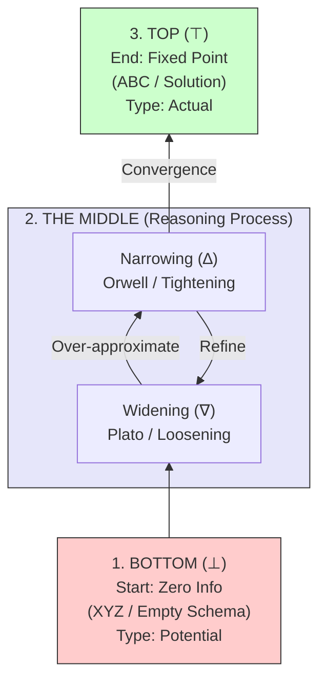
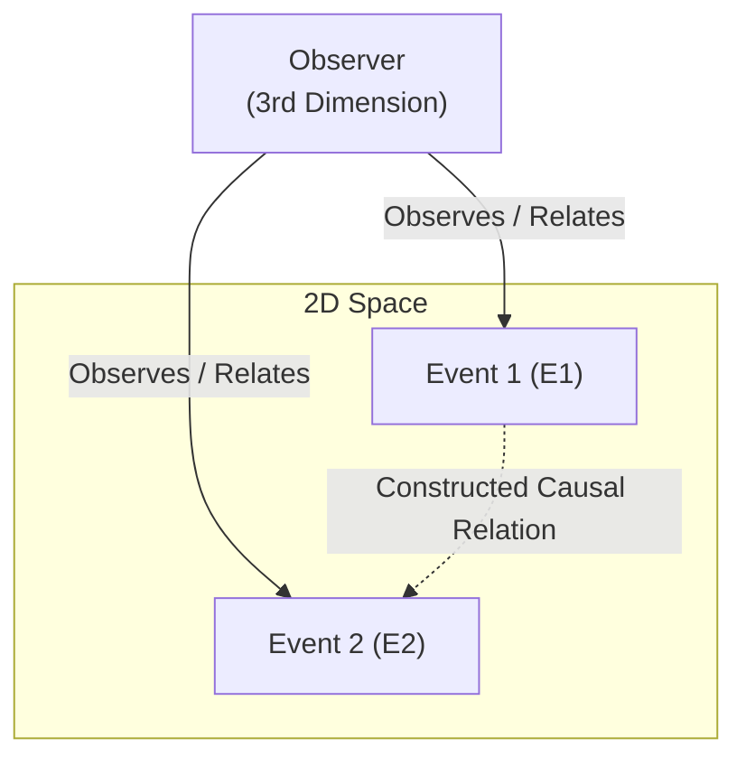
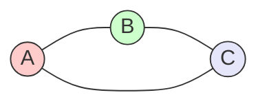

# Why Three? The Checkpoint of Reality

> **The Core Thesis**: "Three" is not an arbitrary number but the **minimal closure** required for reality to exist. It is the checkpoint where the **Vertical Axis of Process** (Time/Evolution) intersects with the **Horizontal Axis of Structure** (Space/Logic).

Also see [[Hub/Tech/Computational Trinitarianism|Computational Trinitarianism]] and [Notebook LM of Axiomatic Triad](https://notebooklm.google.com/notebook/97846aca-b3c2-417e-85ad-4fa95ffc0b9f).

You cannot pass the checkpoint of reality with less than Three. Viewed through the lens of **Simplicial Topology** and **[[Hub/Theory/Sciences/Computer Science/NSM/covering|Topological Coverage]]**:

***One** is a point (0-simplex). It represents [[Unity]] and absolute position, but has no extension.

***Two** is a line (1-simplex). It creates [[Duality]]/Tension and connection (a path), but possesses zero internal area. You cannot "cover" a domain or establish an enclosed structure with just a line.

***Three** is a triangle (2-simplex). It is the absolute mathematical minimum required to enclose an area, create a face, and define a geometric surface. This grants the [[Architecture|Stability]] and [[Space]] necessary to construct a boundary.

Without "Three", there is no **[[coverage|Topological Coverage]]**. In topology, finding a finite subcover to prove **[[Hub/Theory/Sciences/Computer Science/NSM/Compactness Measure|Compactness]]** inherently relies on overlapping sets. A 2-simplex provides the minimal closed manifold to "capture" a boundary condition, separating an "interior" (verifiable reality) from the "exterior" (chaos). This boundary's strict resolution limit — the mathematical guarantee that it won't fail at microscopic metric scales — is formally bounded by the **[[Hub/Theory/Sciences/Computer Science/NSM/Lebesgue Number|Lebesgue Number]] ($\delta$)**.

This article maps "Three" across the fundamental dimensions of computational reality, demonstrating how this triadic closure is the prerequisite for **[[Hub/Theory/Integration/Measuring the Size of Truth|Measuring the Size of Truth]]**.

---

# The summarizing picture of why Three

Also see [Notebook LM on the Architecture of Everything](https://notebooklm.google.com/notebook/97846aca-b3c2-417e-85ad-4fa95ffc0b9f)

![[ThePrimitives.png]]

Three dimensions is the starting point of N-dimensions, because once we have more than three types of possibilities, the three dimensions of possible types start to form a loop; on a 2-D plane, it would look like a triangle. Also see [Notebook LM on Computational Type Theory 1 of 5 by Robert Harper](https://notebooklm.google.com/notebook/efd98058-1dd7-4e46-a901-6f7a0b2d449e).

![[Higher-Dimension Type Theory.png]]

---

## Part I: The Vertical Axis — The Lattice of Reasoning (Time)

In **[[Hub/Theory/Category Theory/Lattice Theory|Lattice Theory]]** and **[[Hub/Theory/Integration/Dana Scott and the Epistemic Boundaries - A Domain Theoretic Perspective on Plato-Orwell|Domain Theory]]**, reasoning is a **vertical ascent** through a lattice of information states. This represents the **Time/Evolution** axis: knowing *more* over time.

Reasoning follows this **Three-Stage Trajectory**:

1.**Type 1: The Bottom ($\bot$) — The Potential**

* The state of **Zero Information** or **Empty Schema**.
* Representation: **[[Hub/Theory/Sciences/Why XYZ|XYZ]]** (The variables/search space).
* Role: The starting point of all inquiry (The Question).

2.**Type 2: The Middle ($\nabla\dashv\Delta$) — The Process**

* The iterative cycle of **Widening (Plato/Loosening)** and **Narrowing (Orwell/Tightening)**.

***Widening ($\nabla$)**: Generalizing from limited data ("What *could* this be?").

***Narrowing ($\Delta$)**: Filtering against constraints ("What *can't* this be?").

* Role: The "Reasoning" activity itself — a **Galois Connection** oscillating to find the truth.

3.**Type 3: The Top ($\top$) — The Actual**

* The state of **Maximal Information** or **Limit**.
* Representation: **[[Hub/Theory/Sciences/Why ABC|ABC]]** (The constants/solution).
* Role: The **Fixed Point** where iteration converges (The Answer).

### The Reasoning Diagram

As described in **[[Hub/Theory/Sciences/Computer Science/Abstract Interpretation|Abstract Interpretation]]**:

---

## Part II: The Horizontal Axis — The Lambda Cube (Space)

In **Type Theory**, the **[[Lambda Cube]]** defines the three dimensions required to construct a valid logical universe. This represents the **Space/Structure** axis: defining *what* exists.

1.**Dimension X: Terms ($\lambda\to$) — Values**

***Terms depend on Terms**.

* Role: **Functions**. The essential mechanism of action.

**Without this, nothing happens.*

2.**Dimension Y: Types ($\lambda2$) — Polymorphism**

***Terms depend on Types**.

* Role: **Generics**. The ability to abstract over structure (e.g., `List<T>`).

**Without this, everything is rigid and non-reusable.*

3.**Dimension Z: Constructors ($\lambda\omega$) — Metaprogramming**

***Types depend on Types**.

* Role: **Type Operators**. The ability to compute new structures from old ones.

**Without this, the system cannot describe itself.*

**Why Three?**

A system with only Terms is a calculator. A system with Terms and Types is a programming language. A system with Terms, Types, and Constructors is a **Universe**.

---

## Part III: The Structural Integrity — The CHL Isomorphism

The **[[Curry-Howard-Lambek isomorphism]]** proves that Logic, Computation, and Category Theory are not three different things, but **one structure viewed from three perspectives**. This is the **currency** of reality.

| Aspect | Perspective | Role in Reality |

| :--- | :--- | :--- |

| **1. Logic** | **Proofs** | The **Truth** dimension. Validation and consistency. |

| **2. Computation** | **Programs** | The **Action** dimension. Execution and behavior. |

| **3. Category Theory** | **Morphisms** | The **Structure** dimension. Relationship and composition. |

**The Triad**:

* A **Proof** without a **Program** is abstract non-sense.
* A **Program** without a **Proof** is unverified guessing.
* Structure (**Category**) is what allows Proofs and Programs to align.

### The Tie-Breaking Witness and Recursive Space

Why is "Three" the minimum for computing reality? The immediate geometric answer — found strictly in Cartesian **[[Hub/Theory/Category Theory/Type Theory/Homotopy & Cubical/Cubical Type Theory|Cubical Type Theory (CTT)]]** — is that **Two** points (A vs. B) create a static conflict or a raw equivalence assertion that cannot compute from within its own path. Standard **Homotopy Type Theory (HoTT)** fails exactly here; it axiomatizes the connection but gets "stuck" (losing canonicity) because an axiom offers no executable geometry.

By moving to explicitly constructed geometric primitives, exactly as **[[Literature/People/Robert Harper|Robert Harper]]** demands for **[[Hub/Tech/Computational Trinitarianism|Computable Trinitarianism]]**, we see that three operational dimensions grant true algorithmic execution. As explored in **[[Literature/Annotation/@proofSynthesisDifferential2019|Proof synthesis and differential linear logic]]**, it is **not merely that the third element breaks symmetry; the main reason is that the 3D boundary (the Cube) creates the geometric space necessary to run a [[Hub/Theory/Category Theory/Type Theory/Homotopy & Cubical/Recursive Kan Filling Algorithm|recursive Kan filling algorithm]].**

***1 & 2 (The Pair / The Execution Path)**: Represents the start (Abstract intent) and end (Concrete implementation) of the transformation. In CTT, this translates to the geometric execution variable traversing from $0\to1$ (dimension **$i$**).

***3 (The Witness / The Balanced Axis)**: The independent **Space/Interval** (dimension **$j \in\mathbb{I}$**). It sweeps orthogonally across the $i$ traversal to create a bounded 2D square. This square creates the pure volume required to algorithmically verify that the execution line did not functionally drift.

Without the explicitly constructed third dimension $j$, you are trapped in an uncomputable 1D assertion (i.e., jumping from logic to implementation without an independent tester). By adding the third geometric axis, you create an algorithmically determinable volume.

This volume represents the physical **[[Hub/Theory/Integration/Measuring the Size of Truth|Size of Truth]] (Epiplexity $S_T$)** that can be extracted from the computation. The Kan-filling algorithm operating in this third dimension computes the transport proofs to minimize redundant entropy (noise $H_T$) and maximize learnable truth ($S_T$). You cannot *compute* an alignment without this third dimension. Thus, **Type, Algorithm, and Proof** form a stable, executable system because any divergence is iteratively measured, witnessed, and corrected by an algorithm housed in the third dimension.

### The Observer's Standpoint: Constructing Causality Across 2D Space

This computational requirement has a direct cognitive and physical parallel. To understand why three dimensions are necessary to **construct causal relations**, we can analyze how a human observer perceives interactions across a two-dimensional space:

1.**The 2D Plane of Events**: Imagine a flat 2D surface containing separate events ($E_1$ and $E_2$). Within the strict confines of this 2D plane, the events are simply spatial coordinates.

2.**The 3rd Dimension (The Observer's Standpoint)**: For an observer to tell the story of how $E_1$ relates to or causes $E_2$, they must occupy a standpoint outside of that 2D plane. This standpoint introduces a third dimension coming from the observer themselves.

3.**Simultaneous Relation (Triangulation)**: This extra dimension allows the observer to simultaneously relate to both events. The observer projects lines of observation to both points, constructing a triangle (a 2-simplex) in 3D space:

Diagram: The observer in the third dimension projecting a triangulation to construct a relation.

We use the word **construct** deliberately: the causal relation between $E_1$ and $E_2$ is not a thoroughly justifiable, self-evident property of the 2D plane itself. Rather, it is a structural projection built by the witness in the third dimension to make sense of the interaction. Without this third dimension coming from the observer, there is no spatial volume to house the relation, collapsing the events back into disconnected, unobservable points.

### Mutual Judgment and Triadic Closure: The Self-Sufficient Referee

Beyond physical observation, this trinitarian requirement operates at the level of logical and semantic validation. To establish a self-contained, stable reality, the dimensions of the system must be able to judge one another without collapsing into infinite regress:

***The Binary Regress**: In a system of only two elements (e.g., $A$ and $B$), any relationship between them requires a third element, $C$, to act as a witness or referee. If $C$ is an external, higher-level arbiter, we immediately trigger an infinite regress: who judges $C$'s judgment of the relation between $A$ and $B$? This would require $D$, which in turn requires $E$, ad infinitum.

***Triadic Closure (Mutual Reference)**: With exactly three dimensions (or three types/components), the system achieves closure because the elements can **self-sufficiently reference and act as "Judges" for each other**. In this triadic cycle:

1. $A$ acts as the judge/witness for the relationship between $B$ and $C$.
2. $B$ acts as the judge/witness for the relationship between $C$ and $A$.
3. $C$ acts as the judge/witness for the relationship between $A$ and $B$.

Diagram: Triadic closure where A, B, and C form a closed loop of mutual judgment.

Because each axis acts as the validator for the connection between the other two, the system is completely self-referential and self-sufficient. There is no need for an external referee or an infinite chain of higher-order judges. This mutual judgment creates the structural boundary that allows reality to exist as a closed, verifiable system. This is why three is the irreducible minimum for logical and computational closure: **all we need is Three.**

---

## Part IV: The Operational Proof — The Three Empty Tables

The **[[Hub/Theory/Integration/The Empty Schema Principle|Empty Schema Principle]]** states that to represent *everything*, you must start with *nothing* ($\bot$). However, "nothing" must be structured to become "something".

The **[[MCard Schema]]** proves that exactly **Three Empty Tables** are sufficient to capture the information of *any* formal language.

### The Three Tables of Universal Sufficiency

1.**Table 1: Card (The Exponent / Reality)**

***Role**: Stores **Content**.

***Algebra**: $Content^{Hash}$ (Exponent).

***Meaning**: The immutable "What".

***Representation**: The **[[MCard]]** content-hash pair (a dependent $\Sigma$-type representing the atom of **[[Hub/Theory/Category Theory/Irreducibility|Irreducibility]]**).

2.**Table 2: Handle Registry (The Sum / Identity)**

***Role**: Stores **Pointers** (Choice / Named Labels).

***Algebra**: $Pointer + Pointer$ (Sum).

***Meaning**: The mutable "Who" (the Combinatorial Species representation).

3.**Table 3: Handle History (The Product / Evolution)**

***Role**: Stores **Time** (Audit / Versioned changes).

***Algebra**: $State \times Time$ (Product).

***Meaning**: The causal "When".

> **Operational Insight**: With just **Reality (Card)**, **Identity (Handle)**, and **Time (History)**, you can reconstruct any database, filesystem, or ontology. No fourth table is required. These three axes provide the minimum coordinate system to perform a complete lookup and measure semantic redundancy.

---

## Part V: Operational Realization — The Cubical Logic Model

The **[[Cubical Logic Model|Cubical Logic Model (CLM)]]** is the "engine" that forces these three dimensions to align in software engineering.

It enforces the **Rule of Three** on every unit of code:

1.**A: Abstract (Types / Top)**

* The **Specification**. The "What".
* Corresponds to **CHL Logic** and **Lambda Types**.

2.**C: Concrete (Terms / Middle)**

* The **Implementation**. The "How".
* Corresponds to **CHL Computation** and **Lambda Terms**.

3.**B: Balanced (Tests / Bottom)**

* The **Verification**. The "Why".
* Corresponds to **CHL Category** (Composition) and **Lambda Constructors** (Metaprogramming/Testing).

You cannot ship code with just Abstract and Concrete. Without **Balanced (Verification)**, you have not closed the loop. You have not passed the **Checkpoint of Reality**.

---

## Part VI: The Demand Function and the Polynomial Functor

The structural necessity of "Three" is perfectly mirrored in the equations governing **[[Hub/Theory/Sciences/Computer Science/Logic/Bidirectional Demand Semantics|Bidirectional Demand Semantics]]**. When we analyze a lazy program's cost, the generic function $f: A \to B$ is insufficient. To calculate cost and evaluate laziness, we must expand it into a **Demand Function** ($f^D$), which famously takes the shape of a Polynomial Functor relying on three operations:

$$
f^D : A \to B^D \to (\mathbb{N} \times A^D)
$$

This formula is a testament to the inescapable "Rule of Three" when operationalizing reality in computation:

1.**The Product ($\times$)**: The combination of the computation cost ($\mathbb{N}$) and the required input ($A^D$). This represents the **Concrete Implementation (How)** — the actual entangled resource limit and state required to execute the demand.

2.**The Exponential ($\to$)**: The functional mappings ($A \to B^D$ and $B^D \to (\mathbb{N} \times A^D)$). This represents the **Balanced Expectations (Why)** — the formal implication verifying that a demand generates a precise cost and state.

3.**The Sum ($\sum$) / Polynomial Assembly**: Though disguised as a single equation, the signature is the backbone of the polynomial functor $P(X) = \sum C \times X^D$. It represents the **Abstract Specification (What)** — the summation of all possible demands and their respective costs across the entire choice space.

Just as the witness dimension breaks symmetry and provides recursive space to evaluate alignment, the Demand Function uses this three-part algebraic structure to compute the time-bounded learnable information gradient (**[[Hub/Theory/Integration/Measuring the Size of Truth|Epiplexity]]**) of a program backward from its demand. It proves that to calculate cost and boundaries logically, you absolutely cannot avoid the minimal completeness of Sum, Product, and Exponential types.

---

## Part VII: Minimal Representable Types — The Engine of Compression and Consciousness

Why is there a mathematical and physical mandate to reduce reality down to precisely *three* representable types instead of thirty, or three thousand? It is not just about logical completeness; it is fundamentally about maximizing **Operational Efficiency** to birth higher-order intelligence.

1.**[[Hub/Tech/Intelligence as information compression|Intelligence as Information Compression]]**

Intelligence is the capacity to efficiently encode, store, and transmit representations of reality. To maximize this compression, you must construct the smallest possible "Alphabet." By compressing the entire universe of logical operations down to three absolutely minimal, mathematically complete primitive states (Sum, Product, Exponential), the system achieves the **highest possible Signal-to-Noise Ratio (SNR)**. The combinatorial search space shrinks drastically, creating an optimally dense compression algorithm.

This minimal complete alphabet represents the maximum possible metric diversity (the **[[Magnitude]]** of the namespace) that can be stably resolved under the Leinster-Meckes theorem. Any redundancy collapses the metric distance, lowering the Magnitude.

2.**Computational Operationalization of [[Hub/Theory/Sciences/Consciousness|Consciousness]]**

Consciousness requires a system to map, simulate, and hold a recursive evaluation of *itself* within its own memory. If the underlying logical schema used to build this mind was bloated, the act of "self-reflection" would trigger an infinite regress, overwhelming the available energy and memory capacity.

By employing the absolute smallest structurally sound type system (Three), the system guarantees **predictable termination and bounded, recursive capability**. It requires so little overhead to represent the self that the agent can afford the computational cost of holding its own image. The minimal representation makes the continuous loop of self-awareness *operationally efficient* rather than exhaustingly expensive.

---

## Summary Table: The Universal Triads

| Domain | 1. Bottom / Potential / Space | 2. Middle / Process / Time | 3. Top / Actual / Structure |
| :--- | :--- | :--- | :--- |
| **Lattice Theory** | **$\bot$ (XYZ)** | **Converging ($\nabla \dashv \Delta$)** | **$\top$ (ABC)** |
| **Lambda Cube** | **Types** | **Terms** | **Constructors** |
| **CHL Isomorphism** | **Logic (Proof)** | **Computation (Program)** | **Category (Morphism)** |
| **MCard Schema** | **Card (Reality)** | **Handle (Identity)** | **History (Time)** |
| **CLM** | **Abstract (Spec)** | **Concrete (Impl)** | **Balanced (Test)** |
| **Demand Functor** | **Sum Space (Choices)** | **Product ($\times$ Cost & State)** | **Exponential ($\to$ Implication)** |

**Three is not a choice. It is the definition of a closed system.**

---

## See Also

***[[Hub/Theory/Sciences/Computer Science/Programming Model/Lambda Calculus and the Three Metrics of Consciousness|Lambda Calculus and the Three Metrics of Consciousness]]** — Synthesizes the $\alpha$-$\beta$-$\eta$ trichotomy with Space, Time, and Uncertainty as the three resource metrics of conscious interfaces.

***[[Hub/Theory/Integration/Measuring the Size of Truth|Measuring the Size of Truth]]** — Reconciles category theory, epiplexity, and ecorithms to quantify the structural information of truth.

***[[Hub/Theory/Topology/Three as Minimal Closure for Representability|Three as the Minimal Closure for Representability]]** — The formal topological proof that three is the irreducible minimum for closure, coverage, and representability.

***[[Hub/Theory/Integration/Three Typified Angles of Directionality - Bell Cosine and the Trinitarian Witness|Three Typified Angles of Directionality]]** — [[John Bell]]'s three angles, Cosine Similarity's three axes, and the CLM's three cards unified under the cosine kernel; typified closure enables judgment between spatial and temporal types.

***[[Hub/Theory/Integration/The 3 by 5 Threshold - Spatial Closure and Process Irreducibility|The 3×5 Threshold]]** — The paired threshold: 3D spatial closure × 5-process irreducibility as the boundary of predictability.

***[[Hub/Theory/Category Theory/Logic/Glossary/Correctness as a Minimal Triad|Correctness as a Minimal Triad]]** — Explains why defining correctness only requires three components (Precondition, Action, Postcondition) to be judged and achieve universality.

***[[Literature/Reading notes/@Kletetschka_3D_Time_Theory_Defence|3D Time Theory Defence]]** — [[Gunther Kletetschka]]'s physics hypothesis defending a 3D temporal model as a geometric solution for particle mass and wave-particle duality, aligning with the simplicial and Kan-filling necessity of three dimensions.

***[[Literature/Reading notes/@Piccirillo_Exotic_Phenomena_Dimension_4|@Piccirillo_Exotic_Phenomena_Dimension_4]]** — Lisa Piccirillo's CDM 2024 lecture on 4D exotic manifolds, demonstrating the breakdown of smooth representability ($TOP \neq DIFF$) past the three-dimensional geometric limit ($n \le3$).

***[[Literature/Reading notes/@Exotic_Phenomena|@Exotic_Phenomena]]** — Detailed synthesis of the mathematics of exotic smoothness, the Cork Theorem, Mazur link constructions, and stabilization metrics according to Lisa Piccirillo.
