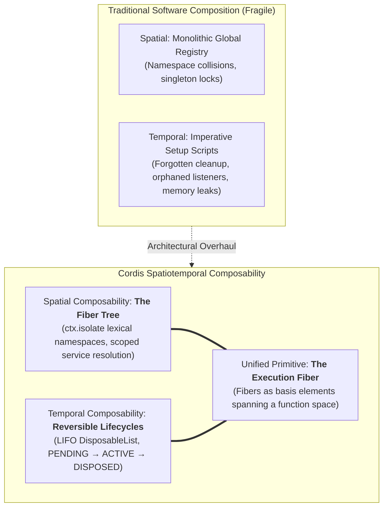

# Cordis: The Meta-Framework for Spatiotemporal Composability

> *"A component cannot truly compose if its lifecycle leaks time or its namespace pollutes space. True composability is spatiotemporal: space must be cleanly isolated through lexical fibers, and time must be strictly reversible through non-commutative disposal."*

---

## 1. Overview & Foundational Challenge

Traditional software composition breaks along two distinct, orthogonal axes:

1. **Spatial Collapse (Namespace Collision & Hidden Coupling)**: Global registries, singleton services, and shared memory leak cross-cutting concerns, making it impossible to run multiple instances of the same service with different configurations without mutual interference.
2. **Temporal Collapse (Orphaned Effects & State Leaks)**: Components acquire side effects (event listeners, timers, database connections, background threads) during startup, but lack a formal, reversible mechanism to unwind those effects upon shutdown. This leads to zombie processes, resource leaks, and the necessity of full-process restarts.

Developed by Yifan Shi (Shigma) as the kernel for **Koishi** and adopted by modern autonomous agent runtimes like **DeepSeek Harness (dsh)**, **Cordis** provides the mathematical and runtime solution to this dilemma through **Spatiotemporal Composability**.

---

## 2. The Five Core Pillars of Cordis

| Pillar | Operational Mechanism | Spatiotemporal Role |
|:---|:---|:---|
| **1. Plugins** | Functions or classes accepted by `ctx.plugin(fn, config)`. | The atomic unit of modular capability. Everything in the system (agents, tools, protocols) is a plugin. |
| **2. Contexts** | Hierarchical lexical scopes (`ctx`) that walk the fiber tree. | **Spatial isolation**. Contexts determine what services a plugin can see or override via `ctx.isolate()`. |
| **3. Service Injection** | Reactive dependency declarations (`inject = ['database', 'network']`). | **Dynamic activation**. Plugins activate automatically when services appear and hibernate when they disappear. |
| **4. Typed Events** | Bidirectional cross-fiber message dispatch (`ctx.emit`, `ctx.on`). | Decoupled coordination across independent agent fibers. |
| **5. Reversible Side Effects** | LIFO effect registration via `ctx.effect(() => () => cleanup())`. | **Temporal reversibility**. Guarantees that every resource acquired is released in reverse order upon plugin disposal. |

---

## 3. The Unifying Principle: Spatiotemporal Synthesis

The core breakthrough of Cordis is demonstrating that **spatial composition and temporal composition share the exact same mechanism: the Fiber**.

### 3.1 Spatial Composability
Spatial composition is about **isolation and lexical namespace management**:
- `ctx.isolate({ key: symbol })`: Creates an unforgeable namespace boundary. Two separate agent fibers can both access `ctx.database` while being transparently routed to completely isolated database instances.
- **The Fiber Tree**: Hierarchical lexical scoping. A child fiber inherits services from its parents, but cannot pollute sibling or parent scopes.
- **Interception (`ctx.intercept`)**: Allows cross-cutting middleware (telemetry, security, logging) to wrap service calls without altering service source code.

### 3.2 Temporal Composability
Temporal composition is about **deterministic lifecycle and effect management**:
- **The Fiber State Machine**: Every fiber transitions deterministically:
  $$\text{PENDING} \xrightarrow{\text{deps satisfied}} \text{ACTIVE} \xrightarrow{\text{dispose/unload}} \text{DISPOSED}$$
- **Hot Module Replacement (HMR) as Effect Migration**: HMR is not a specialized development trick; it is the **general case** of fiber lifecycle:
  $$\text{Fiber}_{\text{old}} \xrightarrow{\text{atomic swap}} \text{Fiber}_{\text{new}}$$
  Old effects are disposed in reverse order *at the exact microsecond* new effects are mounted, enabling zero-downtime hot-reloading of agent algorithms and network topologies.

---

## 4. Directionality (道): The Non-Commutative Arrow of Spatiotemporal Flow

Traditional category theory often treats operations as commutative. However, physical computing requires **Directionality (道)**—a non-commutative arrow of time and hierarchy:

1. **LIFO Disposal Non-Commutativity**:
   $$\text{dispose}(B) \circ \text{dispose}(A) \neq \text{dispose}(A) \circ \text{dispose}(B)$$
   Effects must be unmounted in exact reverse order of acquisition. Reversing this order produces dangling pointers and memory faults.
2. **Directed Lexical Resolution**:
   Service lookup walks strictly *up* the tree ($	ext{child} \to \text{parent}$), never sideways. This directed resolution guarantees deterministic dependency resolution.

---

## 5. Cordis Fibers as Tensors: Linearizing Spatiotemporal Composition

When read through tensor algebra, a Cordis fiber is not merely a scope—it is a **basis element of a function space**:

| Cordis Primitive | Tensor Reading | Mathematical Role |
|:---|:---|:---|
| **Fiber** $|f_i\rangle$ | Basis vector in state space $\mathcal{H}$ | Represents an active execution thread / agent state. |
| **Service** $S_j$ | Covariant / Contravariant index | The typed interface contract exposed by a fiber. |
| **Context** $\langle c|$ | Dual linear functional | Probes and evaluates the capabilities of the fiber. |
| **Plugin Composition** | Tensor product $\otimes$ | Combining independent plugins: $|f_1\rangle \otimes |f_2\rangle$. |
| **Service Resolution** | Contraction $\text{Tr}(A \cdot B)$ | Matching a provider's output with a consumer's injection demand. |

---

## 6. Application to Prologue of Spacetime Sprints

In the *Prologue of Spacetime* active sprint suite:
1. **Every Sprint is a Cordis Fiber**: Sprints are not static documents; they specify the runtime requirements of an execution fiber within the grand strategy engine.
2. **Context Isolation for Enclaves**: Each civilizational enclave operates within an isolated context (`ctx.isolate`), ensuring that internal accounting choices do not create global state corruption.
3. **Reversible Epiplexity**: As systems transition across civilizational epochs (Epoch I $\to$ Epoch II $\to$ Epoch III $\to$ Epoch IV), the transitions execute as **atomic HMR effect migrations**, preserving state continuity without halting the simulation.
4. **DeepSeek Harness Multi-Agent Runtime**: Autonomous agents representing Mr. Wayan, Ms. Dewi, and Santa Claus execute as Cordis plugins, dynamically injecting services and collaborating across the typed event bus.
