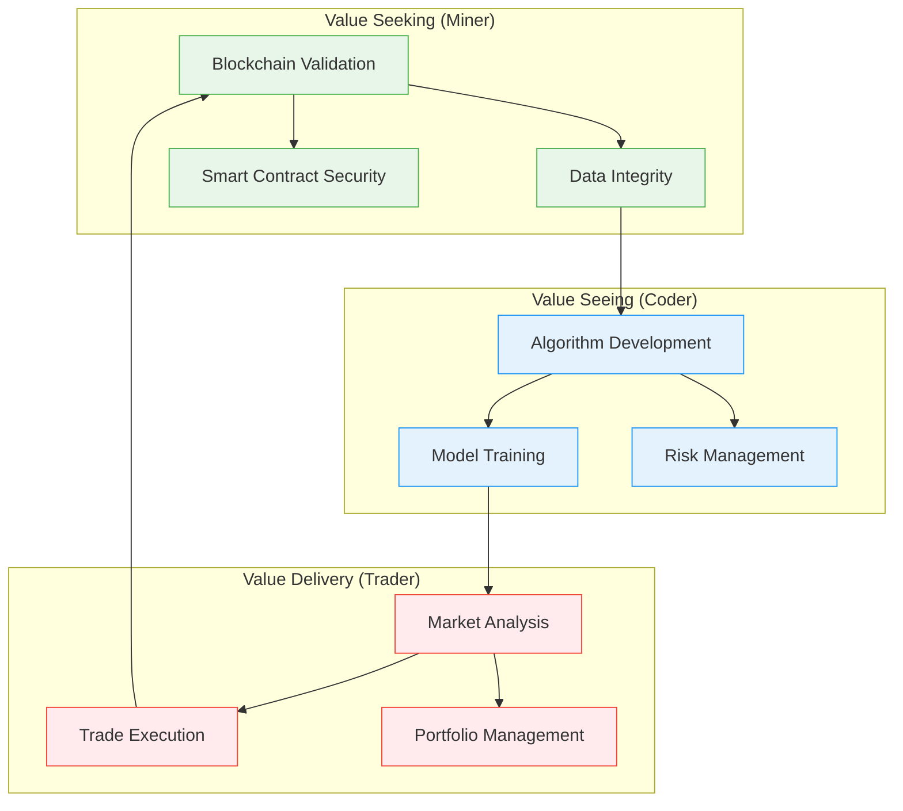
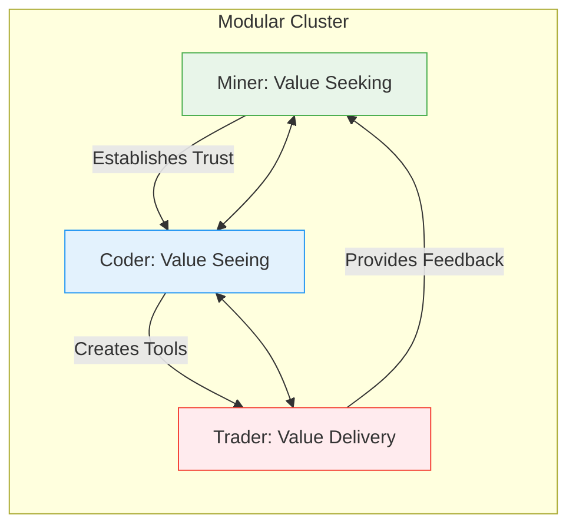
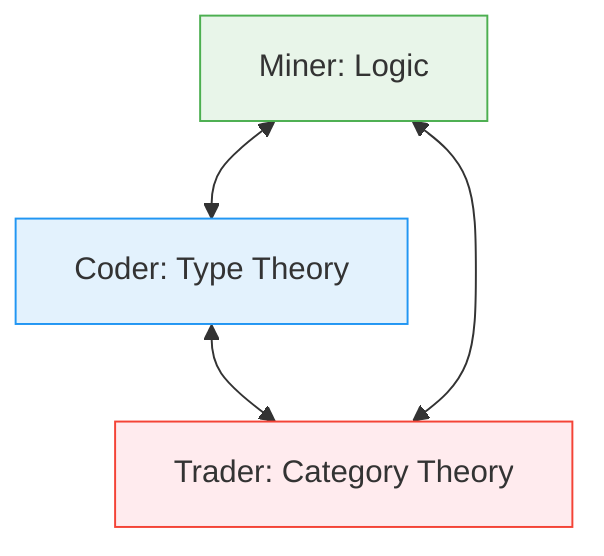

The [[Miner-Trader-Coder Triad]] can be understood as a model of [[Agentic Trinitarianism]] within the digital and data exchange landscape. This model posits three distinct yet interconnected agents, each playing a crucial role in the creation, validation, and exchange of digital/data assets. Grounded first in [[Computational Trinitarianism]] by [[Robert Harper]]—which relates logic, programs, and categories—this framework is further informed by [[Carliss Baldwin|Carliss Baldwin's]] work on [[Modularity|modularity]] and [[Modular Cluster|modular clusters]], offering a powerful lens for how value is created, recognized, and delivered in complex digital ecosystems.

## The Core Trinitarian Roles

### 1. Miner (The Foundation)
Miners, as agents of logic and validation, lay the groundwork for the entire ecosystem. They secure the network, validate transactions, and establish the trust necessary for the exchange of digital assets. This aligns with the concept of Miner in Computational Trinitarianism, representing the foundational logic upon which all other actions are built. Miners are akin to the "provers" in the [[Curry-Howard-Lambek isomorphism]], establishing the truth and validity of transactions through computational effort. Storing raw material in [[MCard]].

**Modularity Perspective**: Miners create and maintain the fundamental modules of the system, ensuring each component adheres to the defined interfaces and protocols. They establish the "design rules" that enable different modules to work together seamlessly.

### 2. Coder (The Creator)
Coders are the architects and builders of the digital world. They write smart contracts, develop decentralized applications (dApps), and create the tools and infrastructure necessary for the functioning of the ecosystem. This corresponds to the Coder in Computational Trinitarianism, responsible for translating logical concepts into functional programs. Coders are the "implementers" in the isomorphism, transforming abstract ideas into tangible digital artifacts. Executing source code in [[PCard]].

**Modularity Perspective**: Coders work within the framework established by Miners to create specialized modules that can be combined in various ways. They focus on creating composable components that can be reused across different contexts, following the principle of "information hiding" where implementation details are encapsulated within modules.

### 3. Trader (The Facilitator)
Traders are the agents of exchange, connecting the Miner and Coder within the marketplace. They identify and evaluate digital/data assets, creating liquidity and facilitating transactions. This aligns with the Trader in Computational Trinitarianism, who focuses on the exchange of information and value. Traders act as the "users" in the isomorphism, utilizing the digital artifacts created by Coders within the framework established by Miners.

**Modularity Perspective**: Traders operate at the boundaries between modules, identifying valuable combinations and creating new value through innovative connections. They help form "modular clusters"—groups of related modules that work together to create complex functionality. Exchanging assets in [[VCard]].
    

## Value Creation Through Modular Interaction

Drawing from [[Carliss Baldwin|Carliss Baldwin's]] work on [[Modularity|modularity]] and [[Modular Cluster|modular clusters]], we can understand how the three roles collaborate in value creation through three key processes:

### 1. Value Seeking (Miner-Centric)
- **Miner's Role**: Establishes the foundational rules and validation mechanisms
- **Process**: Identifying potential value sources and defining the boundaries of valid interactions
- **Outcome**: Creation of trust frameworks and validation rules that enable secure value exchange

### 2. Value Seeing (Coder-Centric)
- **Coder's Role**: Transforms abstract value propositions into concrete implementations
- **Process**: Developing modular components that can be combined in novel ways
- **Outcome**: Creation of flexible, reusable components that can capture and deliver value

### 3. Value Delivery (Trader-Centric)
- **Trader's Role**: Connects value creators with value consumers
- **Process**: Identifying valuable combinations of modules and facilitating exchanges
- **Outcome**: Realization of value through effective matching of needs and solutions

This [[Agentic Trinitarianism]] model highlights the interdependence of these three roles. [[Miner|Miners]] provide the foundation of trust, [[Coder|Coders]] create the tools and applications, and [[Trader|Traders]] facilitate the exchange of value. The emergence of new data assets like LLMs, customized AI services, and localized data collection further emphasizes the importance of each agent in this evolving landscape.

## Modular Clusters in Action: AI-Powered Trading Ecosystem

### Example: Development of an AI-Powered Trading Bot



- **Miner's Role**: 
  - Ensures the integrity of the underlying blockchain
  - Validates transactions and smart contracts
  - Establishes trust mechanisms for data sources
  - **Modular Focus**: Creates the foundational modules for data validation and security

- **Coder's Role**:
  - Develops the trading algorithms and AI models
  - Implements risk management strategies
  - Creates modular components for different trading strategies
  - **Modular Focus**: Builds specialized, reusable components that can be combined in various ways

- **Trader's Role**:
  - Analyzes market conditions and identifies opportunities
  - Executes trades based on algorithmic signals
  - Manages portfolio allocation and risk exposure
  - **Modular Focus**: Identifies valuable combinations of modules and creates new value through their interaction

This model also sheds light on the democratization of data trading through tools like [[Github]], [[VS Code]], and [[Obsidian]]-like software. These tools empower individuals to become "Coders" and "Traders" in their own right, blurring the lines between these traditionally distinct roles. This democratization further reinforces the interconnectedness of the Miner-Coder-Trader triad, highlighting the potential for a more inclusive and decentralized digital economy.

## The Modular Ecosystem

Drawing from [[Carliss Baldwin|Carliss Baldwin's]] concept of [[Modular Cluster|modular clusters]], we can see how the three roles form an interdependent ecosystem:

1. **Module Design (Miner)**: Establishing clear interfaces and standards
2. **Module Implementation (Coder)**: Creating specialized, reusable components
3. **Module Integration (Trader)**: Combining modules in innovative ways to create value

This creates a dynamic, self-reinforcing system where each role both supports and is supported by the others, leading to continuous innovation and value creation.

## Comparative Framework: Trinitarian Models in Computation and Value Creation

| Concept | [[Miner]] | [[Coder]] | [[Trader]] | Description |
|---------|-----------|-----------|------------|-------------|
| **Computational Trinitarianism** | Foundational Logic | Algorithms and Software | High-Level Organization | Emphasizes the intertwined roles of logic, programming, and mathematics in computation. |
| **Curry-Howard-Lambek Isomorphism** | Propositions as Types | Proofs as Programs | Categories as Logics | Establishes connections between logic, type theory, and category theory. |
| **Agentic Trinitarianism** | Logical Framework | Algorithms and Implementation | Communication Protocols | A framework for digital ecosystems, highlighting the roles of validation, creation, and exchange. |
| **Value Creation Process** | Value Seeking | Value Seeing | Value Delivery | The cycle of identifying, developing, and realizing value in digital systems. |
| **Modular Architecture** | Module Design | Module Implementation | Module Integration | The process of creating, implementing, and combining modular components. |
| **Knowledge Work** | Data Validation | Knowledge Creation | Knowledge Exchange | The flow of information and value through validation, creation, and exchange processes. |

## The Modular Value Creation Cycle



This diagram illustrates how the three roles form a self-reinforcing cycle of value creation, with each role both supporting and being supported by the others within a modular cluster.


## Theoretical Foundations: From Computation to Value Creation

[[Robert Harper]]'s idea of [[Computational Trinitarianism]] aligns with the [[Curry-Howard-Lambek isomorphism]], providing a theoretical foundation for understanding how the three roles interact in digital ecosystems. This trinity can be characterized as follows:

### The Trinitarian Framework



#### 1. Miner (Logic)
- **Theoretical Basis**: Propositions as Types
- **Role**: Establishes the foundational rules and validation mechanisms
- **In Practice**:
  - Defines the "rules of the game" for digital interactions
  - Ensures data integrity and system security
  - Creates the framework within which value can be created and exchanged
- **Modularity Aspect**: Designs the interfaces and protocols that enable modular components to work together

#### 2. Coder (Type Theory)
- **Theoretical Basis**: Proofs as Programs
- **Role**: Translates abstract concepts into concrete implementations
- **In Practice**:
  - Develops the algorithms and smart contracts that power the ecosystem
  - Implements the logic defined by Miners in executable form
  - Creates the building blocks that Traders can combine in innovative ways
- **Modularity Aspect**: Implements the modules according to the defined interfaces, ensuring they can be combined and recombined

#### 3. Trader (Category Theory)
- **Theoretical Basis**: Categories as Logics
- **Role**: Facilitates the exchange of value across the network
- **In Practice**:
  - Identifies valuable combinations of digital assets
  - Creates liquidity and facilitates transactions
  - Bridges different systems and protocols
- **Modularity Aspect**: Discovers and exploits the combinatorial possibilities of existing modules, identifying new value-creating combinations

## The Dynamic Interplay of Roles

This model underscores a dynamic interplay between these three roles, creating a continuous feedback loop that drives innovation and value creation. The AI-powered Internet of Things (IoT) serves as a prime example of this dynamic interplay:

1. **Foundation (Miner)**: The underlying logical framework provides the foundation for secure, reliable data exchange
2. **Implementation (Coder)**: Software algorithms enable intelligent behavior and decision-making
3. **Exchange (Trader)**: High-level protocols ensure seamless interaction between devices and systems

This creates a virtuous cycle where:
- The logical framework enables the creation of more sophisticated algorithms
- These algorithms, in turn, generate more data and insights
- The increased data flow leads to the development of better protocols and interfaces
- Improved protocols enable even more sophisticated applications, and so on

## Conclusion: Towards a More Modular Digital Future

By understanding and embracing the principles of [[Agentic Trinitarianism]] and [[Modularity|modular design]], we can create digital ecosystems that are more flexible, scalable, and capable of continuous innovation. The Miner-Coder-Trader triad provides a powerful framework for understanding how value is created and exchanged in these complex systems, while Baldwin's work on modular clusters shows how these roles can work together to create systems that are greater than the sum of their parts.

As we move towards an increasingly digital future, the ability to effectively combine these three roles—each with its own unique perspective and expertise—will be crucial for creating systems that are not only technically sound but also economically viable and socially beneficial.
# References

## Core References
- [[Agentic Trinitarianism]]
- [[Computational Trinitarianism]] by Robert Harper
- [[Curry-Howard-Lambek Isomorphism]]
- [[Modularity]] and [[Modular Cluster]] by Carliss Baldwin
- [[Permanent/Projects/PKC Kernel/Token Economy|Token Economy]]

## Related Works
```dataview 
Table title as Title, authors as Authors
where contains(subject, "Agentic Trinitarianism") or 
      contains(subject, "Coder") or 
      contains(subject, "Miner") or 
      contains(subject, "Trader") or 
      contains(subject, "Modularity") or
      contains(subject, "Value Creation") or
      contains(subject, "Actor-Network Theory")
sort title, authors, modified, desc 
```

## Further Reading
- Baldwin, C. Y., & Clark, K. B. (2000). *Design Rules: The Power of Modularity*. MIT Press.
- Harper, R. (2016). *Practical Foundations for Programming Languages*. Cambridge University Press.
- Mac Lane, S. (1998). *Categories for the Working Mathematician*. Springer.
- Simon, H. A. (1962). "The Architecture of Complexity." *Proceedings of the American Philosophical Society*, 106(6), 467-482.