# Cubical Logic Model: A Three-Dimensional Foundation for Function Representation

> **Navigation**: This document is part of the **[[Hub/Theory/Integration/The Evolution of Unevaluated Code - Navigation|Evolution of Unevaluated Code]]** series.

> **Function-Number Duality**: CLM implements the **[[Hub/Theory/Integration/Function-Number Duality - The Foundational Isomorphism of Computation|Function-Number Duality]]** principle. The three dimensions map to the **[[Hub/Theory/Integration/The Lambda Calculus Triad - Reduction, Conversion, and Confluence|Lambda Calculus Triad]]**: **Abstract** (η/Number), **Concrete** (β/Function), **Balanced** (Confluence/Witness).

For a simple visual representation of [[Logic Model]], see the following diagram:
![[LogicModel_SampleForm.png]]


![[CubicalLogicModel.png||center|1200]]

---

## 📚 **Documentation Navigation**

> **⚡ This document serves as the navigation hub to CLM's modular documentation. All detailed content, examples, and implementations are in the specialized documents below.**

> **🔗 Theoretical Foundation**: CLM is the **central verification framework** for **[[Literature/PKM/Tools/Open Source/Personal Knowledge Container|PKC]]**. See **[[Hub/Theory/Integration/Timely Verification - The Continuation of Truth|Timely Verification: The Continuation of Truth]]** for how CLM enables **timely, continuous truth-seeking** by implementing the **[[Hub/Theory/Integration/The Yoneda-Path Integral-Monkey Synthesis|Sum-Over-All Principle]]** with **[[VCard]]** and **[[PTR]]**.

> **🛡️ Evaluative Backbone**: CLM serves as the measurement engine for the **RTC Framework (Relevance, Timeliness, Coherence)**. See **[[Hub/Theory/Sciences/ABC curriculum|ABC Curriculum]]** for how RTC properties are mapped to the Abstract, Concrete, and Balanced dimensions of CLM for systematic evaluation.

> **📐 Logical Foundations**: CLM is a **Sound and Complete** logical language that follows the **[[Hub/Theory/Integration/The Empty Schema Principle - Domain-Independent Knowledge Through Zero Assumptions|Empty Schema Principle]]** (domain-independent) while adopting the **[[Literature/PKM/Tools/DataSecurity/Proof|Proof Vocabulary]]** ([[Hub/Theory/Category Theory/Logic/Axiom|Axiom]], [[Hub/Theory/Category Theory/Logic/Proposition|Proposition]], [[Hub/Theory/Category Theory/Logic/Lemma|Lemma]], [[Hub/Theory/Category Theory/Logic/Theorem|Theorem]], [[Hub/Theory/Category Theory/Logic/Corollary|Corollary]]) as its basic types. See **[[Hub/Tech/CLM and the Empty Schema - How Proof Vocabulary Enables Soundness and Completeness|CLM and the Empty Schema: Soundness and Completeness]]**.

### CLM as the Antidote to Social Gatekeeping

The Cubical Logic Model is the primary tool for dismantling the **[[The unreasonable ineffectiveness of academic style of knowledge representation|academic caste system]]**. It replaces **Social Validation** with **Computational Verification**.

- **Verification-Based Access**: In the academic style, knowledge is gated by membership in a "caste" (professor, researcher, university student). In the CLM paradigm, knowledge is gated by **Logical Alignment**. Access is granted to any user who can provide a **[[VCard]]** witness of a successful CLM execution.
- **Objective Peer Review**: CLM's **Balanced Expectations** dimension act as the automated replacement for subjective "Peer Review." Instead of a social tribunal checking for conformancy, the system uses **[[Hub/Tech/bridgelet|Bridgelet]]**-driven testing to check for truth.
- **The Wordless Book**: As an **[[Hub/Theory/Integration/The Empty Schema Principle - Domain-Independent Knowledge Through Zero Assumptions|Empty Schema]]**, CLM is a "Wordless Book" that allows any domain logic to be verified. It removes the social friction of academic "style," making knowledge a **Sovereign Asset** that flows to wherever it is needed.


**The modular documentation provides comprehensive coverage:**


### 📑 Modular Documentation Set

| # | Document | Focus | Lines | Best For |
|---|----------|-------|-------|----------|
| **1** | **[[Cubical Logic Model — Overview]]** ⭐ | Concepts & Introduction<br/>**NEW: §1.4 Philosophical Trinity** | 700+ | **First-time learners**<br/>Consciousness researchers |
| **2** | **[[Cubical Logic Model — Categorical Foundations]]** 🎓 | Mathematical rigor | 450 | Researchers, theorists |
| **3** | **[[Cubical Logic Model — Vector-Based Abstractions]]** 💻 | Computational methods | 500 | ML/AI engineers |
| **4** | **[[Cubical Logic Model — Practical Code Examples]]** 🛠️ | Python implementation | 300 | Developers, implementers |
| **5** | **[[Cubical Logic Model — AI Development Frameworks]]** 🤖 | Tool integration | 250 | AI tool users |
| **6** | **[[Cubical Logic Model — Monadic Patterns and Consensus]]** 🔗 | Distributed systems | 300 | System architects |
| **7** | **[[Cubical Logic Model — Historical Context and Evolution]]** 📜 | History & future | 150 | Context seekers |
| **8** | **[[Hub/Tech/CLM and the Empty Schema - How Proof Vocabulary Enables Soundness and Completeness\|CLM and the Empty Schema]]** 📐 | **NEW:** Soundness & Completeness<br/>Proof vocabulary as types | 350 | Logicians, formal methods |

---


## 🚀 NEW: Bridgelet Integration - Universal CLM Execution

**Bridgelet as the Universal Vehicle**: CLM now integrates with **[[Hub/Tech/bridgelet.md|Bridgelet]]** to provide **universal execution across all programming languages** while maintaining mathematical rigor.

### The Complete CLM-Bridgelet Integration Stack

```
┌───────────────────────────────────────────────────────────┐
│ CLM: Three-Dimensional Function Foundation                │
│   Abstract Specification + Concrete Implementation +      │
│   Balanced Expectations = Complete Function Model         │
└────────────────────────────┬──────────────────────────────┘
                             │ Bridgelet Universal Vehicle
┌────────────────────────────┴──────────────────────────────┐
│ Bridgelet: Lens-Based Transformations + Polynomial        │
│   Functors + Matrix Operations + Content Addressability   │
└────────────────────────────┬──────────────────────────────┘
                             │ Universal Language Interface
┌────────────────────────────┴──────────────────────────────┐
│ Programming Languages: Python, Rust, JavaScript, etc.     │
│   Identical CLM API across all languages                  │
└────────────────────────────┬──────────────────────────────┘
                             │ eBPF Kernel Foundation
┌────────────────────────────┴──────────────────────────────┐
│ eBPF: Universal Observability + Policy Enforcement        │
│   Cross-language morphism collection + O(1) overhead      │
└────────────────────────────┬──────────────────────────────┘
                             │ Verification & Knowledge
┌────────────────────────────┴──────────────────────────────┐
│ Lean + LLMs: Mathematical Proofs + Natural Language       │
│   AlphaProof automation + Knowledge assistance            │
└───────────────────────────────────────────────────────────┘
```

### Why Bridgelet Makes CLM Universally Executable

**1. Mathematical Mapping**: CLM's three dimensions map perfectly to Bridgelet's **polynomial functor lenses**:
- **Abstract Specification** → Specification Lens $L_A(X) = A \times X^S$
- **Concrete Implementation** → Implementation Lens $L_C(X) = C \times X^S$  
- **Balanced Expectations** → Expectation Lens $L_B(X) = B \times X^{A \times C}$

**2. Language Agnosticism**: Bridgelet's **bicategorical structure** provides identical APIs in Python, Rust, JavaScript, Go, Java, C++, etc.

**3. Kernel-Level Observability**: eBPF provides **universal monitoring** that works identically across all language runtimes.

**4. Automated Verification**: Lean + AlphaProof automatically verify CLM properties for any language implementation.

**5. Natural Language Interface**: LLMs translate everyday language to CLM structures and back.

### Real-World Impact: CLM Becomes Practical

**Before Bridgelet**: CLM was theoretically powerful but practically limited to academic implementations.

**After Bridgelet**: CLM becomes a **universal foundation for software development** that:
- Works in any programming language
- Provides mathematical guarantees
- Offers kernel-level observability  
- Enables natural language interaction
- Scales to millions of functions

### Example: Cross-Language CLM Function

```typescript
// Same CLM function works in ALL languages
const secureAuthCLM = {
  abstract_spec: "Verify user credentials and issue JWT tokens",
  concrete_impl: "bcrypt_verify + jwt_sign + database_lookup", 
  balanced_exp: "security_tests + performance_monitoring + error_handling"
};

// Python implementation
class SecureAuthPython extends BridgeletCLM(secureAuthCLM) { ... }

// Rust implementation  
struct SecureAuthRust extends BridgeletCLM(secureAuthCLM) { ... }

// JavaScript implementation
class SecureAuthJS extends BridgeletCLM(secureAuthCLM) { ... }

// All automatically get:
// - eBPF observability
// - Lean verification
// - LLM assistance
// - Mathematical guarantees
```

### Integration Benefits

| Capability | Before Bridgelet | After Bridgelet |
|------------|------------------|------------------|
| **Language Support** | Single language only | Universal (Python, Rust, JS, etc.) |
| **Observability** | Language-specific tools | Universal eBPF monitoring |
| **Verification** | Manual formal proofs | Automated Lean + AlphaProof |
| **Accessibility** | Experts only | Natural language interface |
| **Scalability** | Limited implementations | Millions of functions |
| **Mathematical Rigor** | Theoretical only | Provable guarantees |

**⭐ Key Addition**: The Overview now includes §1.4 **Philosophical-Formal-Operational Trinity**, integrating:
- **[[Function as the Root Type]]** - Functions as meta-type, consciousness through function management
- **[[Literate programming]]** - Knuth's vision (1984) of code as human-readable literature
- **CLM** - Formal three-dimensional structure making literate programming mathematically rigorous
- **[[PTR - The Execution Sidecar|PTR]]** - Runtime enforcement making verification mandatory

### 🔗 Key Integrations in Modular Docs

**New content not in original document:**

- **[[Hub/Tech/bridgelet.md|Bridgelet Universal Vehicle]]** integration:
  - Cross-language CLM execution (Python, Rust, JavaScript, etc.)
  - eBPF kernel-level observability across all runtimes
  - Lean + AlphaProof automated mathematical verification
  - LLM natural language interface for CLM creation and explanation

- **[[CLM and Observability - Completing the CI-CT-CD Loop]]** integration:
  - First-class telemetry with Prometheus (metrics), Loki (logs), and Grafana (visualization)
  - Continuous Training through self-sovereign learning data pipelines
  - Flux-enabled observability making every state change inherently observable
  - Auditable by design with content-addressable telemetry

- **[[Flux, Least Action, and SSOT - A Unified Theory]]** integration:
  - Theoretical convergence of Flux pattern, Least Action Principle, and Single Source of Truth
  - Mathematical foundation for CLM's unidirectional data flow
  - Formal properties ensuring soundness, completeness, and efficient representation

- **[[GASing Triangles]]** integration:
  - Vector rotation as computational model (Doc #3)
  - Trigonometric decomposition for alignment (Doc #3)
  - Place-value arithmetic parallel to hash-based composition (Doc #2)

- **[[Monadology and Consensus — Pre-Established Harmony in Distributed Systems]]** integration:
  - Pre-established harmony through vector alignment (Doc #6)
  - Monadic isolation for parallel computation (Doc #6)
  - Cryptographic consensus mechanisms (Doc #6)

- **Computational resource optimization**:
  - O(log n) similarity search with FAISS (Doc #3, #4)
  - Parallel GPU embedding (Doc #3, #6)
  - Content-addressable caching (Doc #6)

- **Real-world instrumentation**:
  - Complete end-to-end CLM deployment examples
  - Production monitoring with eBPF + OpenTelemetry
  - Cross-language unified dashboards and analytics

### 📖 How to Navigate

| Your Goal | Start Here |
|-----------|------------|
| **Understanding CLM** | [[Cubical Logic Model — Overview]] §1.4 (Philosophical Trinity) |
| **Building systems** | [[Cubical Logic Model — Practical Code Examples]] |
| **Mathematical foundations** | [[Cubical Logic Model — Categorical Foundations]] |
| **Universal CLM execution** | **[[Bridgelet]]** - Cross-language implementation |
| **Consciousness research** | [[Cubical Logic Model — Overview]] + [[Function as the Root Type]] |
| **Complete learning path** | [[Cubical Logic Model — Documentation Index]] |

### 🚀 Quick Start Paths

**Path 1 - Understanding Foundations** (1 hour): ⭐ NEW
```
Overview §1.4 (Philosophical Trinity) → Overview §1.5 (Three Properties) → Overview §2 (Three Dimensions)
```
**Best for**: Understanding *why* CLM exists and what problem it solves

**Path 2 - Developer** (2 hours):
```
Overview §§1-3 → Practical Code §§1-2 → Vector-Based §5
```
**Best for**: Building systems with CLM

**Path 3 - Universal CLM Implementation** (3 hours): ⭐ NEW
```
Overview §§1-3 → **[[Hub/Tech/bridgelet.md|Bridgelet]]** → Bridgelet eBPF Integration → Bridgelet Lean Verification
```
**Best for**: Making CLM work in ANY programming language with full observability and verification

**Path 4 - Production Deployment** (4 hours): ⭐ NEW
```
Bridgelet Implementation → eBPF Monitoring → Lean Verification → LLM Integration → Production Examples
```
**Best for**: Deploying CLM at scale with mathematical guarantees

**Path 5 - Consciousness Researcher** (3 hours):
```
Overview §1.4 → Function as Root Type → Consciousness → PTR §Philosophical Trinity
```
**Best for**: Understanding computational consciousness through function management

**Path 6 - Researcher** (1 day):
```
Overview → Categorical Foundations → Vector-Based Abstractions
```
**Best for**: Mathematical rigor and formal proofs

**Path 7 - Logician / Formal Methods** (2 hours): ⭐ NEW

[[CLM and the Empty Schema - How Proof Vocabulary Enables Soundness and Completeness]] → [[Proof]] → [[Axiom]] → [[Theorem]] → [[Proof Assistance and the Automation of Representability]]

**Best for**: Understanding CLM as a sound and complete logical language with proof vocabulary as types

**Path 8 - Complete Mastery** (1 week):
```
All 8 modular documents + **[[Hub/Tech/bridgelet.md|Bridgelet]]** + this comprehensive document for reference
```
**Best for**: Complete understanding from philosophy to universal implementation


**📘 Full navigation guide**: [[Cubical Logic Model — Documentation Index]]

---

## 📖 What is CLM?

The **Cubical Logic Model (CLM)** is a three-dimensional framework for representing computational functions as **Polynomial Functors** of the form $F(X) = \sum A_i X^{B_i}$. Each cell encodes:

1.  **[[Abstract Specification]] (`abstract_spec`)** - Represents the **Position ($A_i$)** or **Structural Integrity** (the Future). Corresponds to [[Alpha Conversion|alpha-Equivalence]] (Pure Type). Required keys: `context`, `goal`, `success_criteria`.
2.  **[[Concrete Implementation]] (`concrete_impl`)** - Represents the **Direction ($B_i$)** or **Procedural Efficiency** (the Present). Corresponds to [[Beta Reduction|beta-Reduction]] (Actual Process). Required keys: `inputs`, `process`, `outputs`.
3.  **[[Balanced Expectations]] (`balanced_exp`)** - Represents the **Accountability** or **Historical Evidence** (the Past). Corresponds to [[Eta Conversion|eta-Conversion]] (Verified Fact). Required keys: `test_cases` (containing a list of `given`, `when`, `then` pairs).

### Conjugation: Grounding the Balanced Dimension
In the CLM, the **Balanced Expectations ($B$)** dimension acts as the **Conjugation Mirror**. Just as conjugation $z \cdot \bar{z}$ extracts a real-valued **Norm** from complex lateral numbers, the Balanced dimension extracts a real-valued **Verification Result** from the interaction of Abstract ($A$) and Concrete ($C$):

*   **Extraction of the Norm**: Verification is the operation $A \circ \bar{C}$. It "conjugates" the implementation against the specification to reveal the **invariant truth** (the "Pass/Fail" norm).
*   **Polynomial Identity**: A CLM is identified not by its hash alone, but by its **Algebraic Position** in the functional manifold. The polynomial $P(X)$ defines a unique "coordinate" where the identity of the function is determined by its relationships.
*   **Observability**: Real-world execution is monitored via **Hermitian Observables** (eBPF/OpenTelemetry). These ensure that only **Real** (verifiable) eigenvalues are recorded in the execution history, pruning out "imaginary noise" or unauthorized states.

### The Triadic Structure (Visual)

```
           Thesis (Invariance/Static/Symmetry)
                        ↑
                        │ Witness/Proof/Adjunction
                        ↓
  Synthesis ←───────────┬───────────→ Antithesis (Variance/Dynamic/Breaking)
  (Third Element)       │
                        │
         ┌──────────────┴──────────────┐
         │    CLM: Balanced ($B$)      │
         │    MVP: VCard               │
         │    CT: Adjunction           │
         │    Hegel: Synthesis         │
         └─────────────────────────────┘
```

**Mapping to CLM**:

| Triadic Position | CLM Dimension | Function |
|------------------|---------------|----------|
| **Thesis** | **Abstract Specification** | The Invariant Intent (What we WANT) |
| **Antithesis** | **Concrete Implementation** | The Variant Mechanism (How we DO it) |
| **Synthesis** | **Balanced Expectations** | The Witness/Proof (Why it's CORRECT) |

### Philosophical-Formal-Operational Trinity

CLM sits at the intersection of three foundational concepts:


**Key Concepts**:
- **[[Hub/Theory/Category Theory/Function as the Root Type]]** - Functions are the meta-type; consciousness requires managing functions as queryable assets
- **[[Literature/PKM/Tools/Literate programming]]** - Knuth's 1984 vision: programs should explain to humans what computers will do
- **[[PTR - The Execution Sidecar|PTR]]** - Runtime engine making CLM's three-dimensional structure mandatory through verification

**For complete explanation**, see **[[Cubical Logic Model — Overview#1.4 Philosophical-Formal-Operational Trinity]]**.

### 1.4.1 Operationalizing Universality via Taylor Expansion

To truly "close the loop" on **[[Fleeting/Diary/2026-01-21|Universality (EEAO)]]** and remove the barriers of academic logic, CLM relies on **[[Hub/Theory/Integration/Polynomial Type Runtime|PTR]]**.

*   **Logic as Polynomials**: As proved by **[[Hub/Theory/Mathematics/Taylor Series|Taylor Series]]** and **[[Hub/Theory/Category Theory/Logic/Differential Linear Logic|DiLL]]**, all complex functions can be decomposed into polynomial sums of linear resources.
*   **The Engine**: PTR is the **Universal Polynomial Engine** that executes this complexity.
*   **The Result**: CLM + PTR turns abstract logic into "Arithmetic"—a universal, compact syntax that anyone can verify, breaking the "exclusionary linguistic boundary" of traditional Formal Methods.

### CLM Requires PTR for Operational Enforcement

> **Critical Insight**: CLM defines the **structure** of correct functions;  
> PTR provides the **enforcement** that ensures functions actually conform.

**The Relationship**:

```mermaid
graph LR
    CLM[CLM Framework<br/>Defines Structure] -->|requires| PTR[PTR Runtime<br/>Enforces Verification]
    PTR -->|validates| CLM
    
    CLM -.->|A×B×C structure| F[Function Definition]
    PTR -.->|prep→exec→post| E[Verified Execution]
    
    style CLM fill:#e8f5e9,stroke:#4caf50,stroke-width:2px
    style PTR fill:#f3e5f5,stroke:#9c27b0,stroke-width:2px
```



| Without PTR | With PTR |
|-------------|----------|
| CLM is documentation | CLM is enforced architecture |
| Verification optional | Verification mandatory |
| Developers might check A↔B↔C consistency | PTR guarantees A↔B↔C consistency |
| Testing is separate harness | Testing integrated (Balanced dimension) |
| No audit trail | Automatic VerificationVCard generation |

**Why This Matters**:
- **CLM alone** provides a rigorous logical framework but cannot guarantee developers follow it
- **PTR** acts as the **mandatory gateway** that blocks execution unless CLM structure is valid
- **Together** they create **provably correct infrastructure** with mathematical guarantees

**The Template Method Connection**: PTR's `prep→exec→post` lifecycle is the **operational realization** of CLM's three dimensions:
1. **prep**: Validates Abstract ↔ Concrete consistency  
2. **exec**: Executes Concrete implementation safely
3. **post**: Verifies Balanced expectations hold

**See comprehensive explanation**: [[PTR as CLM Runtime - The Operational Substrate of PCard]]


### Three Core Properties

1. **[[Scale-free]]** - Same structure works from 10 concepts to 10 million (invariant-based)
2. **Context-Sensitive** - Monadic composition threads context through all operations
3. **Domain-Neutral** - Applies universally (algorithms, education, culture, infrastructure)

**Details**: [[Cubical Logic Model — Overview#1.5 Three Fundamental Properties]]

### Vau Calculi Foundation: The MVP Card Database as Function Catalog

> **Core Insight**: CLM extensively uses insights from **Vau Calculi** (Shutt, 2010) to define functions and functional equivalence. The three-table schema (`card`, `handle_registry`, `handle_history`) effectively catalogs functions using the MVP Card database.

**PCard's Dual Nature** (from [[PCard.md]]):

| Level | PCard Role | Concept | Description |
|-------|------------|---------|-------------|
| **Meta-Level** (Vau Calculus) | **Operative** | Evaluation Control | PCard receives CLM specification *unevaluated* and decides the evaluation strategy |
| **Effect-Level** (Category Theory) | **Applicative/Monad** | Effect Composition | Once evaluation is decided, PCard follows Functor → Applicative → Monad hierarchy |

**The Resolution** (from John Shutt's Vau Calculi):
$$\boxed{\text{Applicative} = \texttt{wrap}(\text{Operative})}$$

This duality enables CLM to be both an **Operative** (receiving unevaluated specifications) and an **Applicative** (composing effects after evaluation decision).

> **See Also**: [[CLM_Language_Specification#1.2.1 Vau Calculi Foundation]] for the complete treatment.

### Symmetric Monoidal Category: DSLs as Petri Net Runtimes

A significant body of research (Meseguer & Montanari, Baez et al.) establishes that **Petri nets are presentations of Symmetric Monoidal Categories**. This means:

$$\boxed{\text{DSL Runtime} \cong \text{Petri Net} \cong \text{Symmetric Monoidal Category (SMC)}}$$

**The SMC Structure in CLM/PTR**:

| SMC Operation | CLM/PTR Implementation | Meaning |
|---------------|------------------------|---------|
| **Tensor Product (⊗)** | Parallel CLM composition | Run CLMs concurrently |
| **Composition (;)** | Sequential CLM chaining | Run CLMs in sequence |
| **Symmetry (σ)** | Input/output reordering | Swap MCard positions |
| **Unit (I)** | Empty MCard | Identity operation |

**Why This Matters**: The SMC axioms (associativity, unit, symmetry) guarantee that CLM operations compose predictably across all domains.

### One Toolset for All Applications: The Power of Symmetry

> **Key Insight**: Because all DSL runtimes share the **Symmetric Monoidal Category** structure, we can build **one set of tools** that works for **all applications**. This is the profound consequence of the Petri Net/SMC isomorphism.

```
┌─────────────────────────────────────────────────────────────────────────────┐
│          SYMMETRIC MONOIDAL = ONE TOOLSET FOR ALL APPLICATIONS              │
│                                                                             │
│   Traditional Approach (N tools for N domains):                             │
│   Finance DSL → Finance Runtime → Finance Tools                             │
│   Healthcare DSL → Healthcare Runtime → Healthcare Tools                    │
│   Education DSL → Education Runtime → Education Tools                       │
│   ...                                                                       │
│   Result: O(N) toolchains to maintain                                       │
│                                                                             │
│   SMC/PTR Approach (1 toolset for all domains):                             │
│   Finance CLM ─────┐                                                        │
│   Healthcare CLM ──┼──▶ PTR (Petri Net/SMC Engine) ──▶ Universal Tools      │
│   Education CLM ───┘                                                        │
│   Result: O(1) toolchain, domain-agnostic                                   │
│                                                                             │
│   The Symmetry Guarantee (σ : A ⊗ B ≅ B ⊗ A):                               │
│   Because CLM operations can be swapped (symmetry), the ORDER doesn't       │
│   matter for correctness—only the RESULT. This means the same debugger,     │
│   profiler, verifier, and optimizer works for ALL CLMs regardless of        │
│   domain content.                                                           │
└─────────────────────────────────────────────────────────────────────────────┘
```

**The Mathematical Guarantee**:

$$\boxed{\forall \text{CLM}_1, \text{CLM}_2: \text{Tool}(\text{CLM}_1) = \text{Tool}(\text{CLM}_2) \quad \text{(domain-independent)}}$$

This is not a design choice—it's a **mathematical theorem** following from the SMC structure.

**Practical Implication for PKC/MVP Cards**:

| Component | Universal Tool |
|-----------|----------------|
| **MCard** | One content-addressable storage layer |
| **PCard** | One execution engine (PTR) |
| **VCard** | One verification/authorization system |
| **Handle System** | One namespace registry |
| **Observability** | One Grafana/eBPF stack |

**References**:
- Meseguer & Montanari (1990): *Petri Nets Are Monoids*
- Baez & Master: *Open Petri Nets* (categorical compositionality)
- John N. Shutt: *Vau Calculi* (Revised Report on the Kernel Programming Language)

> **See Also**: [[CLM_Language_Specification#1.2.2 PCard as Operative AND Applicative]] for the complete treatment.

### PKC as a Platform for Function Engineering and Internet Publication

> **Strategic Vision**: The Symmetric Monoidal structure transforms **PKC** into a **platform for engineering and designing new functions** as **executable tokens** in a singular MCard form—ready to be shared and published across the Internet.

**The Key Insight**: Because all CLMs share the same SMC structure:
1. **Functions are First-Class Data**: Every function is an MCard with a unique hash
2. **Universal Interoperability**: Any CLM can call any other CLM (regardless of runtime)
3. **Internet-Native Distribution**: MCard hashes are URLs for functions

```
┌─────────────────────────────────────────────────────────────────────────────┐
│          PKC: FUNCTION ENGINEERING PLATFORM FOR THE INTERNET                │
│                                                                             │
│   Design Loop:                                                              │
│   ────────────                                                              │
│   [User Intent] ──▶ [Abstract Spec] ──▶ [Concrete Impl] ──▶ [Balanced Tests]│
│                              │                │                      │      │
│                              └────────────────┴──────────────────────┘      │
│                                          │                                  │
│                                          ▼                                  │
│                                   ┌─────────────┐                           │
│                                   │   MCard     │                           │
│                                   │ sha256:abc… │                           │
│                                   │ (executable │                           │
│                                   │   token)    │                           │
│                                   └──────┬──────┘                           │
│                                          │                                  │
│   Publication:                           ▼                                  │
│   ────────────    ┌─────────────────────────────────────────────────────┐   │
│                   │                   THE INTERNET                      │   │
│                   │  ┌───────────┐  ┌───────────┐  ┌───────────┐        │   │
│                   │  │ PKC Node  │  │ PKC Node  │  │ PKC Node  │  ...   │   │
│                   │  │  (Alice)  │  │   (Bob)   │  │ (Charlie) │        │   │
│                   │  └───────────┘  └───────────┘  └───────────┘        │   │
│                   │                                                     │   │
│                   │  Same MCard hash = Same function = Universal trust  │   │
│                   └─────────────────────────────────────────────────────┘   │
│                                                                             │
│   Result: Functions flow across the Internet like data files               │
└─────────────────────────────────────────────────────────────────────────────┘
```

**Why MCard is the Ideal Token Format for Functions**:

| Property | MCard Advantage | Internet Benefit |
|----------|-----------------|------------------|
| **Content-Addressed** | `sha256` hash = unique identity | No naming conflicts across PKC nodes |
| **Self-Contained** | Abstract + Concrete + Balanced in one unit | Function carries its own tests |
| **Immutable** | Hash changes if content changes | Version control built-in |
| **Language-Agnostic** | CLM wraps any runtime | Python, JS, Rust users share functions |
| **Verifiable** | VCard-gated execution | Trust boundary for code execution |

**The Function Economy**:

$$\boxed{\text{PKC} = \text{GitHub for Executable Functions (Content-Addressed)}}$$

| Traditional Code Sharing | PKC Function Sharing |
|--------------------------|---------------------|
| Share files, hope versions match | Share hash, guaranteed identical |
| README describes what it does | `abstract_spec` is machine-readable |
| Separate test suite | `balanced_exp` bundled with function |
| Trust the author | Trust the VCard verification |
| Language-specific packages | Universal MCard format |

**How Functions Flow Across the Internet**:

1. **Alice** (Singapore) creates a CLM → MCard with `sha256:abc123...`
2. **Bob** (New York) retrieves by hash (no name conflicts!)
3. **Charlie** (London) verifies same function (hash guarantees identity)
4. VCard ensures authorization before execution

> **See Also**: 
> - [[CLM_Language_Specification#PKC as a Platform for Function Engineering]] for the complete treatment
> - [[PTR_Runtime_Overview#4.9. MCard as Universal Data Abstraction Layer]] for storage abstraction

### Stratification: The Vertical Dimension
Beyond the three spatial dimensions (Abstract, Concrete, Balanced), CLM enforces a **Vertical Dimension** known as **[[Hub/Theory/Category Theory/Logic/Type Theory/Stratification|Stratification]]**.
*   **Purpose**: To prevent **Girard's Paradox** (inconsistency via self-reference).
*   **Mechanism**: A function cannot validate itself. The **Balanced Expectations ($B$)** must exist at a higher logical stratum than the **Concrete Implementation ($C$)**.
*   **Hierarchy**:
    *   $U_0$: The Code ($C$).
    *   $U_1$: The Test ($B$) that judges the Code.
    *   $U_2$: The Spec ($A$) that defines the validity of the Test.
This ensures that the "Truth" of a function is always anchored in a higher-order verification, not circular logic.

### 1.6 CLM as the Meta-Language of Truth Verification

> **Core Thesis**: CLM is the **Operationalization of [[Hub/Theory/Category Theory/Logic/Correctness|Correctness]]**. By providing a **[[Hub/Tech/meta language|Meta-Language]]** based on the **[[The Empty Schema Principle - Domain-Independent Knowledge Through Zero Assumptions|Empty Schema Principle]]**, CLM unifies all content verification into a **[[Unifying Protocol of Truth Verification]]**, enabling the arithmetic computation of belief.

Linguistic grounding: a **meta-language** is a language used to describe/verify an **object language** (mention vs use). See **[[Hub/Theory/Linguistics/Meta|Meta (μετά)]]** and **[[Hub/Theory/Sciences/Computer Science/Programming Model/meta-language|Meta-language]]**.

#### From Abstract Correctness to Operational Structure
**[[Hub/Theory/Category Theory/Logic/Correctness|Correctness]]** defines success as the **invariant directional alignment** between Specification and Outcome. CLM operationalizes this abstract definition into a concrete, three-dimensional structure:

1.  **Abstract**: The Specification (Intent).
2.  **Concrete**: The Operation (Action).
3.  **Balanced**: The Proof of Alignment (Verification).

#### The Empty Schema as Meta-Language
CLM acts as a **[[Hub/Tech/meta language|Meta-Language]]** because it adheres to the **[[The Empty Schema Principle - Domain-Independent Knowledge Through Zero Assumptions|Empty Schema Principle]]**:
*   It defines the **Structure** of truth ($A \times C \times B$) without dictating the **Content**.
*   It accepts *any* domain logic (legal, code, governance) into its empty slots.
*   This "emptiness" is what makes it universally applicable—a "Wordless Book" for logic.

#### The Closure Framing on Causation
As established in **[[Hub/Theory/Sciences/Computer Science/Programming Model/Algebra as the Science of Pure Time|Algebra as the Science of Pure Time]]**:
> **"Algebra as the Science of Pure Time is about creating a closure framing on causation."**

The **CLM** is precisely that **Frame**.
*   **The Frame**: The Cubical Cell ($A \times C \times B$) draws the boundary around a causal event.
*   **The Closure**: The **Balanced Dimension ($B$)** provides the witnessing closure that proves the interaction between $A$ and $C$ was valid.
*   Without this frame, computation is just heat (unverified flux). With CLM, computation becomes **Pure Time** (verified succession).

#### Enabling "Single Format of Truth Verification" (SFOTV)
This unification upgrades the concept of **[[Literature/PKM/Workflow/DevOps/Single-source of Truth|Single Source of Truth (SSOT)]]** to **[[Single Format of Truth Verification]]**:
*   **Old (SSOT)**: "We trust this file because it is in the Master Database." (Authority-based)
*   **New (SFOTV)**: "We trust this artifact because it fits the CLM Shape and passes verification." (Structure-based)

Instead of maintaining "one version of the file," we maintain "one format for verifying any file." This allows us to **arithmize the computation of belief** as described in **[[Literature/PKM/Tools/Open Source/Operationalized Arithmetic for Belief and Truth|Operationalized Arithmetic for Belief and Truth]]**:

$$ \text{Trust}(Artifact) = \text{Verify}_{CLM}(A, C, B) $$

If the $C$ (Implementation) aligns with $A$ (Spec) according to $B$ (Tests), the artifact is "True" regardless of where it is stored. **Truth becomes a computable output of the CLM Meta-Language.**

#### CLM as Meta: Constructing the "After" from the "Before"

> **Navigational Link**: This section operationalizes the **[[Hub/Theory/Linguistics/Meta|Meta (μετά)]]** framework.

From Meta.md: **"Meta = The 'Educated Guess' Constructing the 'After' from the 'Before.'"**

CLM is a **Meta-Language** in the literal sense of **[[Hub/Theory/Linguistics/Meta|μετά]]** (after/beyond):

| Meta Concept | CLM Operationalization |
| :--- | :--- |
| **Before** | **Abstract Specification** ($A$): The Intent before execution. |
| **Process (The Guess)** | **Concrete Implementation** ($C$): The transformation that computes the "After." |
| **After (Judgment)** | **Balanced Expectations** ($B$): The verification that the "After" is correct. |

$$\boxed{A \xrightarrow{C} B \quad \equiv \quad \text{Before} \xrightarrow{\text{Guess}} \text{After}}$$

**Why CLM Requires Space, Time, and Energy**:

The **Balanced Expectations** dimension ($B$) is not an abstract concept—it consists of **Observable Event Data** that requires physical grounding:

| Meta Level | Physical Requirement | CLM Manifestation |
| :--- | :--- | :--- |
| **Level 1: Space** | Where did the event occur? | Test case inputs/outputs (localized data). |
| **Level 2: Time** | When did the event occur? | Execution timestamps, sequence ordering in `handle_history`. |
| **Level 3: Energy (Judgment)** | Which outcomes are valid? | The **binding constraint** that select valid paths from the space of possibilities. The "work" of verification. |

This is why CLM is not just a specification language but a **Meta-Physical** framework: it provides the structure "after" or "beyond" the raw code that allows the code to **mean** something.

**The VCard Sandwich as the Mechanism of Meta**:

The **[[Hub/Theory/Integration/The VCard Sandwich as Phase Transition - From Flux to Fact|VCard Sandwich]]** ($V_{pre} \xrightarrow{PCard} V_{post}$) is the operational instantiation of this Meta pattern:

| VCard Sandwich | Meta Framework |
| :--- | :--- |
| $V_{pre}$ (Flux, Potential) | "Before" (the uncommitted state) |
| $PCard$ (The Function) | "The Guess" (the educated transition logic) |
| $V_{post}$ (Fact, Verified) | "After" (the judgment, the crystallized truth) |

$$\boxed{V_{pre} \xrightarrow{PCard} V_{post} \quad = \quad \text{Flux} \xrightarrow{\text{Meta-Guess}} \text{Fact}}$$

## 📦 Canonical CLM Data Model: Hash-Addressed Cubical Cells

To make CLM usable as an **inclusive, universal function representation** that aligns with [[Manifold Learning]] and [[Manifold Learning and Yoneda Lemma]], we fix a **canonical encoding**:

- Each CLM instance is a **cubical cell** representing one function (or functional module).
- Each cell is stored as **nested JSON or YAML** inside an [[MCard]] in PKC.
- All substantial content (natural language, code, datasets, test results) is **referenced only by cryptographic hash**, not inlined.
- Every new revision of a CLM cell creates a **new hash** that links back to its predecessors, forming a **Merkle DAG with versioning** ([[Merkle DAG with versioning]]).

### Nested JSON/YAML Encoding (Canonical Shape)

At rest, a CLM function cell is encoded as a content-addressed document with three explicit dimensions:

```yaml
id: sha3-512:CLM_FUNC_HASH              # hash of this CLM cell
kind: clm.function
version: 3
parents:
  - sha3-512:PREV_HASH_2               # previous CLM versions (Merkle DAG links)
  - sha3-512:PREV_HASH_1

abstract_spec:                          # "what" (human intent)
  context: "Historical and theoretical background"
  goal: "The high-level objective of the function"
  success_criteria: "How we know it worked"
  ref: sha3-512:SPEC_TEXT_HASH         # MCard with natural-language specification
  tags:
    - sha3-512:TAG_MANIFOLD_HASH       # references to semantic tag cards

concrete_impl:                          # "how" (executable shape)
  inputs: "Definition of incoming data streams"
  process: "The algorithmic transformation logic"
  outputs: "Definition of outgoing data results"
  ref: sha3-512:IMPL_CODE_HASH         # MCard with code or container manifest
  entrypoint:
    ref: sha3-512:ENTRYPOINT_HASH      # MCard describing language/runtime + symbol

balanced_exp:                           # "why" (validation + history)
  test_cases:
    - given: "Condition A"
      when: "Action B"
      then: "Result C"
    - spec_ref: sha3-512:TEST_SPEC_HASH
      input_refs: [sha3-512:INPUT1_HASH, sha3-512:INPUT2_HASH]
      expected_output_ref: sha3-512:OUTPUT_HASH
  history:
    - run_ref: sha3-512:RUN_EVENT_HASH # each run is an MCard in a Merkle DAG and typically lives inside an [[Audited MCard Collection]] that organizes all evidence for this function

shape:                                  # polynomial functor shape of this function
  poly_id: "CLMFunction:v1"
  terms:
    - coef_ref: sha3-512:TERM_A_HASH   # A_i (semantic coefficient)
      arity: 3                         # |p^{-1}(b)|, number of input slots
    - coef_ref: sha3-512:TERM_B_HASH
      arity: 1
```

**Key properties**:

- The **only literal values of consequence are hashes**; all rich content lives in separate MCards, mirroring the properties of a [[Merkle DAG with versioning]].
- `parents` gives CLM cells a **versioned history**, so the CLM registry is a **hash-linked DAG of functions**.
- The `shape.poly` field encodes a **[[Polynomial Functors as Composable Modules|polynomial functor]]** that specifies the arity and structure of inputs/outputs, making CLM functions composable as modules.

### Alignment with Manifold Learning and Yoneda

Seen through [[Manifold Learning]]:

- Each CLM cell `id` is a **point in a high-dimensional functional network**.
- Edges between cells (e.g., call graphs, dataflow, co-usage) form **directed adjacency**.
- Manifold learning can be run over this directed functional network to recover **low-dimensional harmonic coordinates** for CLM functions, just as it does for neural or data manifolds.

Seen through [[Manifold Learning and Yoneda Lemma]] and [[Yoneda Lemma]]:

- Each function's identity is determined by its **directed relationships** (incoming/outgoing edges in the CLM Merkle DAG):
  - Incoming: "who calls or depends on this function?"
  - Outgoing: "what does this function call or influence?"
- The canonical encoding makes those relationships **measurable and countable**: edges are recorded as hash-valued fields, so we can construct Yoneda-style presheaves `Hom(-, f)` and `Hom(f, -)` over the CLM graph.
- In this view, CLM becomes a **hash-addressed, representable manifold of functions**, where:
  - geometric structure arises from manifold learning over the functional network, and
  - categorical structure arises from counting directed morphisms between CLM cells.

This canonical model ensures that CLM is not just a narrative framework, but a **concrete, Merkle-like data structure** in which every function is:

- three-dimensionally specified (spec/impl/expectations),
- content-addressed and versioned, and
- shaped by polynomial functors for safe composition and manifold-aware analysis.

### Forking and Merging: The Polynomial Algebra of Version Control

The polynomial structure of CLM ($F(C_j) = \sum A_i \otimes C_j^{B_i}$) provides a rigorous mathematical framework for **Forking** and **Merging**, solving the "Diamond Problem" of dependency management through algebraic means.

#### Forking as Polynomial Branching
When a system forks (e.g., creating a specialized version for a new domain), it is not just copying code. In CLM, it is an **Algebraic Branching**:
*   **Shared Roots**: The new fork retains the same $A_i$ (Abstract Specs) and $B_i$ (Balanced Expectations) where the intent and validation logic remain identical.
*   **Divergent Terms**: The fork introduces new $C_k$ (Concrete Implementations) or adds new terms ($+ A_{new} \otimes C_{new}^{B_{new}}$).
*   **Result**: The fork is mathematically related to the original. $F_{fork} = F_{original} + \Delta$, where $\Delta$ is the precise algebraic difference.

#### Merging as Polynomial Reconciliation
Merging two divergent versions is often a messy manual process. In CLM, it becomes **Polynomial Reconciliation**:
*   **Term Matching**: We compare the polynomials $F_{v1}$ and $F_{v2}$.
*   **Intersection**: Terms that are identical ($A \otimes C^B$) are automatically merged (deduplicated via MCard hash).
*   **Union**: Unique terms from both sides are added to the merged polynomial.
*   **Conflict Resolution**: If two terms share an $A$ (Intent) but have different $C$ (Implementations), this is a **Type Conflict**. The **[[Literature/PKM/Tools/Open Source/Proxy|Proxy]]** pattern resolves this by allowing the PCard to select the appropriate $C$ based on runtime context (e.g., "Use $C_{v1}$ for legacy clients, $C_{v2}$ for new clients").

This algebraic approach turns version control into a **computable algebra**, enabling automated merging and mathematically verifiable upgrades (see **[[Hub/Theory/Sciences/Computer Science/Programming Model/Upgradability|Upgradability]]**).

---

## 🎯 **CLM as the Foundation for Operationalizing Opportunity Awareness**

### **The Strategic Connection**

From **[[Hub/Theory/Integration/Latent Opportunities as Scale-Invariant Directional Projections|Latent Opportunities Framework]]** and **[[Hub/Tech/Awareness of Opportunities|Awareness of Opportunities]]**:

**CLM's three-dimensional structure provides the OPERATIONAL FRAMEWORK for discovering and validating latent opportunities** through mandatory verification at every level.

### **The Three-Dimensional Mapping to Opportunity Discovery**

**Winston (Architect)**: CLM's three dimensions directly operationalize the ABC cycle for opportunity awareness:


**The Operational Framework**:

| ABC Phase | CLM Dimension | Opportunity Operation | Scale-Invariant Property |
|-----------|---------------|----------------------|-------------------------|
| **Assumption** | **Abstract Specification** | Define opportunity hypotheses in natural language | Specifications work at all scales |
| **Behavior** | **Concrete Implementation** | Execute detection algorithms (projection operators) | Same code runs individual → national |
| **Confirmation** | **Balanced Expectations** | Validate via historical data & test cases | Validation criteria scale-free |

### **Why CLM Enables Complete Opportunity Discovery**

From **[[Hub/Tech/Awareness of Opportunities|Awareness of Opportunities]]** - ABC Cycle:

**1. Mandatory Verification Through Three Dimensions**:

CLM makes opportunity discovery **rigorous and verifiable**:

- **Abstract Specification**: Forces explicit definition of what constitutes an "opportunity"
  - Example: "An opportunity is a state vector $\vec{o}$ with $\cos(\theta) \geq 0.85$ alignment to goal vector $\vec{g}$"
  - Prevents vague intuitions, requires mathematical precision

- **Concrete Implementation**: Provides executable detection methods
  - Example: Python function implementing cosine similarity calculation
  - Enables automated, scalable opportunity scanning

- **Balanced Expectations**: Maintains execution history for validation
  - Example: Test cases showing opportunities detected vs. missed
  - Enables continuous improvement of detection algorithms

**2. Scale-Free Property Enables Multi-Scale Detection**:

From **[[Literature/PKM/Tools/Virtualization/Scale-free|Scale-Free Systems]]**:

CLM's **scale-free property** (one of three core properties) means the SAME three-dimensional structure works from individual to global:

```typescript
// Individual Opportunity Detection
const personalOpportunity: CLMFunction = {
  abstract: "Detect learning gaps in student knowledge",
  concrete: (studentVector, curriculumVector) => 
    cosineSimilarity(studentVector, curriculumVector),
  expectations: [
    { input: [vector1, vector2], expected: 0.73, tolerance: 0.05 },
    { input: [vector3, vector4], expected: 0.92, tolerance: 0.05 }
  ]
};

// National Opportunity Detection (SAME STRUCTURE)
const nationalOpportunity: CLMFunction = {
  abstract: "Detect curriculum gaps across provinces",
  concrete: (provinceVector, policyVector) => 
    cosineSimilarity(provinceVector, policyVector), // SAME FUNCTION
  expectations: [
    { input: [prov1, policy1], expected: 0.68, tolerance: 0.05 },
    { input: [prov2, policy2], expected: 0.88, tolerance: 0.05 }
  ]
};
```

**Key Insight**: The **structure doesn't change**, only the **granularity** of input vectors.

**3. Context-Sensitive Monadic Composition**:

From **[[Cubical Logic Model — Monadic Patterns and Consensus]]**:

CLM's **context-sensitive property** (second core property) enables **threaded opportunity tracking** through monadic composition:

```typescript
// Opportunity detection as monadic pipeline
const opportunityPipeline = 
  detectOpportunity        // Maybe<Opportunity>
    .bind(validateOpportunity)  // Maybe<ValidatedOpportunity>
    .bind(estimateValue)        // Maybe<ValuedOpportunity>
    .bind(assessRisk)           // Maybe<AssessedOpportunity>
    .bind(prioritize);          // Maybe<PrioritizedOpportunity>
```

Each step:
- Maintains **CLM three-dimensional structure**
- Preserves **execution context** (who detected, when, under what conditions)
- Enables **compositional reasoning** about opportunity pipelines

### **Integration with Scale-Free Personalized Learning**

From **[[Hub/Tech/Scale-Free Personalized Learning|SFPL]]**:

**CLM provides the functional representation layer** for SFPL's PKC/SON architecture:

```
SFPL Architecture Stack:
    ↓
PKC/SON (Infrastructure)
    ↓
MCard/PCard/VCard (Data Model)
    ↓
CLM Functions (Opportunity Detection Logic)
    ↓
Projection Operators (Mathematical Foundation)
```

**Operational Flow**:

1. **MCard** stores opportunity detection functions as **CLM structures**
2. **PCard** executes detection via **Concrete Implementation** dimension
3. **VCard** validates results against **Balanced Expectations** dimension
4. **PKC** federates opportunities across scales (individual → school → regional → national)

**Example - Latent Learning Gap Detection**:

```typescript
// Stored as MCard (Content-Addressable)
const learningGapDetector: CLMFunction = {
  // Abstract Specification (human-readable)
  abstract: `
    Detect latent learning gaps by measuring alignment between:
    - Student's current knowledge state (embeddings of completed work)
    - Curriculum objectives (embeddings of learning outcomes)
    
    Gap exists when cosine similarity < 0.75 threshold
  `,
  
  // Concrete Implementation (executable)
  concrete: async (studentMCard: MCard, objectiveMCard: MCard) => {
    const studentEmbedding = await embed(studentMCard.content);
    const objectiveEmbedding = await embed(objectiveMCard.content);
    const similarity = cosineSimilarity(studentEmbedding, objectiveEmbedding);
    
    return similarity < 0.75 
      ? { gapDetected: true, severity: 1 - similarity, details: {...} }
      : { gapDetected: false };
  },
  
  // Balanced Expectations (validation data)
  expectations: [
    {
      scenario: "Student missing algebra prerequisites",
      studentContent: "...",
      objectiveContent: "...",
      expectedGap: true,
      expectedSeverity: 0.42
    },
    // ... more test cases from historical executions
  ],
  
  // Execution History (from PTR)
  history: [
    { timestamp: "2025-11-01", input: [...], output: {...}, duration: 23ms },
    { timestamp: "2025-11-02", input: [...], output: {...}, duration: 19ms },
    // Immutable audit trail
  ]
};
```

**Why This Works**:

1. **Abstract Specification** makes the opportunity definition **human-auditable**
2. **Concrete Implementation** makes detection **automated and scalable**
3. **Balanced Expectations** ensures **continuous validation** against ground truth
4. **Scale-Free** structure works identically for 1 student or 1 million students
5. **Content-Addressable** (MCard) ensures **immutable, verifiable** opportunity detection logic

### **Mathematical Guarantee via CLM**

From **[[Hub/Theory/Integration/Latent Opportunities as Scale-Invariant Directional Projections|Latent Opportunities Framework]]** and **[[Flux, Least Action, and SSOT - A Unified Theory]]**:

**Soundness Theorem (via CLM Validation)**:
$$
\forall f \in CLM: \text{AllTests}(f.expectations) \text{ pass} \implies \text{Opportunities detected are genuine}
$$

**Completeness Theorem (via CLM Coverage)**:
$$
\forall o \in \text{Opportunities}: \exists f \in CLM: f.abstract \text{ specifies } o \land f.concrete \text{ detects } o
$$

**Efficient Representation Theorem (via Unified Theory)**:
$$
\forall f \in CLM: \text{Size}(f) \leq O(\log |\text{semantic\_content}|) \land \text{Computation\_Time}(f) \leq O(\log n)
$$

**CLM ensures all three**:
- **Soundness**: No false positives (validated by Balanced Expectations)
- **Completeness**: All opportunities representable (via Abstract Specification) and detectable (via Concrete Implementation)
- **Efficiency**: Optimal representation and computation (via Flux/SSOT/Least Action convergence)

### **Strategic Value: CLM as Opportunity Operating System**

**Mary (Analyst)**: From a business perspective, CLM transforms opportunity awareness from art to science:

**Before CLM**:
- Vague opportunity descriptions ("We should improve retention")
- No executable detection methods
- No validation of whether opportunities are real
- No audit trail of opportunity discovery process

**After CLM**:
- **Precise specifications** ("Retention opportunity = students with $\cos(\theta) < 0.75$ alignment")
- **Automated detection** (Execute concrete implementation across entire student population)
- **Validated accuracy** (Balanced expectations provide ground truth validation)
- **Complete provenance** (Execution history in PTR provides immutable audit trail)

**ROI Impact**:
- **Detection latency**: Manual (weeks) → Automated (seconds)
- **False positive rate**: 40% → <5% (via CLM validation)
- **Opportunity coverage**: Partial (human bias) → Complete (scale-free automation)
- **Audit compliance**: Manual reports → Immutable provenance via CLM+PTR

---

## 🔗 Key Integrations

**Opportunity Awareness Framework**:
- **[[Hub/Theory/Integration/Latent Opportunities as Scale-Invariant Directional Projections|Latent Opportunities as Scale-Invariant Directional Projections]]** - Complete mathematical framework
- **[[Hub/Tech/Awareness of Opportunities|Awareness of Opportunities]]** - ABC cycle methodology, CLM operationalizes
- **[[Hub/Tech/Scale-Free Personalized Learning|Scale-Free Personalized Learning]]** - Deployment architecture (PKC/SON), CLM provides functional layer
- **[[Hub/Theory/Category Theory/Logic/Correctness as Invariant Directional Alignment|Correctness as Invariant Directional Alignment]]** - Projection operators CLM implements

**Core CLM Infrastructure**:
- **[[Convergent Truth Verification Protocol]]** - CLM's three-dimensional validation integrated with MVP Cards, PKC Network, CI/CD, Flux, SSOT, Zero Trust
- **[[Conversational Programming]]** - Runtime infrastructure (MCard/PCard/VCard) for creating CLM concepts through human-AI dialogue
- **[[MCard-Based Zero Trust Infrastructure Programming|MCard-Based Infrastructure]]** - CLM operationalized as MVP Cards for cloud-native Kubernetes resources
- **[[PCard]]** - Programmatic implementation of CLM's three dimensions
- **[[Yoneda Arithmetic]]** - Mathematical foundation showing CLM as self-validating functional transaction processing system
- **[[PTR - The Execution Sidecar|PTR]]** - Runtime engine enforcing CLM's three-dimensional verification
- **[[Decision Tokens]]** - Governance and finance tokens implemented as CLM structures, ensuring verifiable, auditable decision-making with computable certificates

**Learning Operations (CI/CT/CD)**:
- **[[Hub/Theory/Sciences/SoG/Scale-Free Logical Processing Kernel - Architecture#Part IV-C Learning Operations Infrastructure|Scale-Free Learning Operations]]** - CLM as framework for continuous training infrastructure
- **[[CICD.md]]** - Continuous Integration/Deployment as continuation-passing knowledge evolution
- **[[MLOps.md]]** - Machine Learning Operations maturity levels for governance
- **[[Langfuse.md]]** - LLM observability integrated with OpenTelemetry for learning operations
- **[[CLM and Observability - Completing the CI-CT-CD Loop]]** - Complete observability stack for CI/CT/CD with Prometheus, Loki, Grafana

**EEAO Operational Framework**:
- **[[CLM as Data-Driven OS Architecture]]** - CLM as foundational operating system for data-driven applications
- **[[Browser-Embedded CLM - The EEAO Programming Model]]** - Browser-based CLM implementation for universal access
- **[[Sovereign Operational Network - The EEAO Infrastructure]]** - Distributed infrastructure for sovereign CLM deployment
- **[[CLM Runtime Architecture - Multi-Language Implementation]]** - Multi-language runtime support for CLM functions
- **[[Flux, Least Action, and SSOT - A Unified Theory]]** - Theoretical foundation unifying core CLM principles

**CLM Enables CI/CT/CD Through Three Dimensions**:
1. **Abstract Specification**: Learning outcomes, curricula, model objectives (what should be learned/achieved)
2. **Concrete Implementation**: Training code, model weights, inference pipelines (how learning happens)
3. **Balanced Expectations**: Performance metrics, execution history, validation data (proof that learning works)

This three-dimensional structure ensures every learning artifact—from individual lesson plans to national-scale ML models—has **verifiable correctness**, **observable execution**, and **accountable outcomes**. Participative communities of operators use CLM to self-govern learning infrastructure at scale.

### **Observability-Enabled Continuous Training**

From **[[CLM and Observability - Completing the CI-CT-CD Loop]]**:

**The CI/CT/CD Telemetry Loop**:


**How Observability Completes the Loop**:

1. **Metrics (Prometheus)**: Quantitative measurements of CLM execution
   - Rule engine performance, dispatcher throughput, VCard verification latency
   - Resource utilization, error rates, success ratios

2. **Traces (OpenTelemetry/Tempo)**: End-to-end flow across distributed components
   - Request latency breakdowns, service dependency maps
   - Performance bottleneck identification, cross-node communication

3. **Logs (Loki)**: Narrative context for system occurrences
   - Action dispatches, state transitions, verification results
   - Content-addressable, auditable events with temporal ordering

**Self-Sovereign Learning Pipeline**:
- Local data collection on sovereign nodes
- Distributed processing in LLM kernels
- No central data aggregation required
- Continuous refinement of Abstract Specifications based on production telemetry

---

## 🌐 NEW: CLM-Mesh Integration — Universal Execution with Local-First Composability

### PTR-Mesh Architecture for CLM

CLM now integrates with [[Hub/Tech/mesh networking|mesh networking]] infrastructure to enable **universal CLM execution** across browser, server, and database tiers. This integration achieves:

1. **Maximum [[Hub/Theory/Category Theory/Composability|Composability]]**: CLM functions compose across mesh tiers like categorical morphisms
2. **Maximum [[Hub/Tech/Local-first Principle|Local-First]]**: All operations prefer local execution; mesh is fallback
3. **Full [[Hub/Theory/Sciences/SoG/Observability|Observability]]**: [[Hub/Tech/Prometheus|Prometheus]] + [[Literature/PKM/Tools/Open Source/Grafana|Grafana]] provide complete visibility

### Three-Tier CLM Deployment

| Tier | Mesh Type | CLM Execution | Observability |
|------|-----------|---------------|---------------|
| **Browser Frontend** | P2P (WebRTC + libP2P) | Local-first WASM execution | Faro + Prometheus push gateway |
| **Server Farm** | Service Mesh (Istio/Envoy) | Full PTR verification | Full Prometheus + Grafana stack |
| **Database Services** | Edge Mesh | Data-local CLM execution | Federated Prometheus scraping |

### Observability Triad for CLM

From [[Hub/Theory/Sciences/SoG/Observability|Observability]], CLM implements the foundational chain:

$$\text{Representability} \rightarrow \text{Observability} \rightarrow \text{Accountability}$$

| CLM Dimension | Observability Role | Technology |
|---------------|-------------------|------------|
| **Abstract Specification** | Representability | CLM YAML/JSON schema |
| **Concrete Implementation** | Observability | [[Hub/Tech/Prometheus|Prometheus]] metrics |
| **Balanced Expectations** | Accountability | Test results in MCards |

### Composability Rules for CLM-Mesh

From [[Hub/Theory/Category Theory/Composability|Composability]]:

```
Rule 1: Verification Composability
  verified(CLM_A) ∧ verified(CLM_B) ∧ output(CLM_A) = input(CLM_B)
  ⟹ verified(CLM_B ∘ CLM_A)

Rule 2: Local-First Composition Preference
  canExecuteLocally(CLM_A) ∧ canExecuteLocally(CLM_B)
  ⟹ compose and execute locally (maximum local-first)
```

**See**: [[PTR - The Execution Sidecar|PTR - The Execution Sidecar]], [[Lens Protocol]], and [[Hub/Tech/mesh networking|Mesh Networking]] for complete architecture

---

## 📚 Where to Learn More

**All detailed content, code examples, mathematical proofs, and implementation guides are in the modular documents above.**

This main document serves only as a navigation hub and brief conceptual introduction.

### Why Three Dimensions? The Triadic Completion

CLM's three-dimensional structure (Abstract, Concrete, Balanced) is not arbitrary—it is a **structural necessity**. Binary oppositions (Spec vs. Impl, Static vs. Dynamic) are **incomplete** without a third element that witnesses their correspondence.

| Dimension | Duality Pole | Triadic Role |
|-----------|--------------|--------------|
| **Abstract Specification ($A$)** | Invariant Intent | **Thesis**: What we want |
| **Concrete Implementation ($C$)** | Variant Mechanism | **Antithesis**: How we do it |
| **Balanced Expectations ($B$)** | Witnessing Evidence | **Synthesis**: Proof that $A \leftrightarrow C$ |

For the philosophical and mathematical foundation, see: **[[Hub/Theory/Integration/The Triadic Completion - Why Dualities Require a Third Element|The Triadic Completion: Why Dualities Require a Third Element]]**.

---

## CLM as Petri Net Transition: The Unified Framework

CLM is not merely an abstract framework—it IS a **Petri Net Transition** instantiated as a **Scott-continuous function**. This insight connects CLM to:

- **[[Hub/Theory/Sciences/Computer Science/Petri Net|Petri Nets]]**: CLM = Transition (state transformer)
- **[[Hoare triple]]**: CLM = Command `C` in `{P} C {Q}`
- **[[Hub/Theory/Category Theory/Logic/Continuation|Continuation]]**: CLM = Continuation handler
- **[[Hub/Theory/Category Theory/Logic/domain theory|Domain Theory]]**: CLM = Scott-continuous function
- **[[Hub/Theory/Integration/Static File Content as a Generalized Number System|Generalized Numbers]]**: CLM = Operator $e^{i\theta}$

$$\boxed{\text{CLM} \cong \text{Transition} \cong \text{Continuous Function} \cong e^{i\theta}}$$

**See complete synthesis**: **[[Hub/Theory/Integration/CLM as Petri Net Transition - Continuation, Domain Theory, and the Generalized Number Framework|CLM as Petri Net Transition]]**

---

## Polynomial Representation & Linear Logic Resource Assessment

The internal mechanics of the CLM take advantage of advanced categorical and logical frameworks to ensure precise identification and resource management:

1.  **Place Position Value System**:
    -   Derived from **[[docs/Polynomial Representation of Categorical Structures.md|Polynomial Representation of Categorical Structures]]**, the CLM treats functional components as terms in a polynomial $F(X) = \sum A_i X^{B_i}$.
    -   It utilizes a **Place Position value system** in polynomial expressions to extract partial content by focusing on specific terms, enabling modular verification and granular interaction. $A_i$ (Positions) represent Abstract Specifications and $B_i$ (Directions) represent Concrete inputs.

2.  **Resource Assessment via Linear Logic**:
    -   Drawing from **[[docs/WorkingNotes/Hub/Theory/Category Theory/Logic/Linear Logic.md|Linear Logic]]**, CLM assesses the computational resources (memory, state, execution time) required for each state transition.
    -   Propositions are treated as consumable resources, ensuring that the **Object-Process duality** (MCards as Objects, PCards as Processes) maintains strict resource accounting and assessment of resources required.

**See detailed context**: [[Chapter 09: DSL and Meta-Circular Programming]]

---

## CLM and Universal Content Representation

CLM provides the operational framework for **universal content representation** via Kan Extensions:

- **Source Places** (input content) → **CLM Transition** (Kan extension) → **Sink Places** (output content)
- This requires **[[Hub/Theory/Category Theory/lateral number|Lateral Numbers]]** for complete (orthogonal) representation
- **[[Hub/Theory/Category Theory/Logic/Type Theory/Cubical Type Theory|Cubical Type Theory]]** provides formal verification

**See complete framework**: **[[Content expressed through Kan Extension - Source-Sink Petri Nets, Lateral Numbers, and Cubical Type Theory|Content as Kan Extension]]**

---

# References

```dataview
Table title as Title, authors as Authors
where contains(subject, "Cubical Logic Model") or contains(subject, "Deep Specification") or contains(subject, "HoTT") or contains(subject, "QKV") or contains(subject, "Kipling Method")
sort title, authors, modified desc
```
