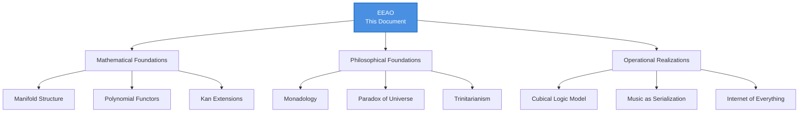
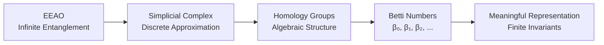
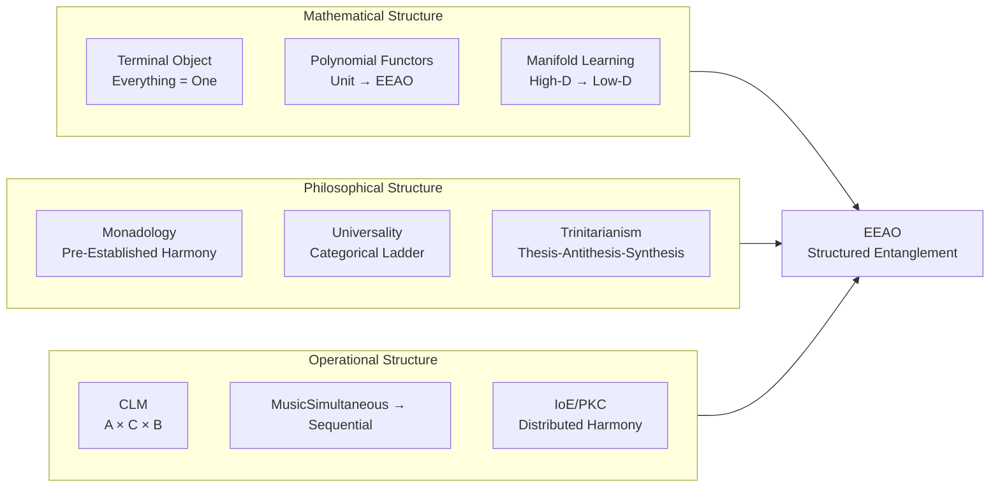

# EEAO: Everything, Everywhere, All at Once

> **Core Thesis**: EEAO is not chaos, but **structured entanglement**. It is the phenomenology of what it's like to be the **Terminal Object** in category theory—from the outside, a single coherent point; from the inside, infinitely rich with distinctions. This document provides a compact navigation hub to the EEAO conceptual network.

---

## Quick Navigation



---

## 1. The Paradox of the Universe: Everything = One

The category-theoretic foundation of EEAO (from **[[Monadic Duality Paradox#The Paradox of the Universe|Monadic Duality]]**):

| Category Theory | EEAO Interpretation |
|-----------------|---------------------|
| **Initial Object (Void)** | The Potential for all things |
| **Terminal Object (Unit)** | The Universe containing all things |
| **Paradox** | If you include **everything**, you lose the ability to distinguish anything *outside*. From outside, the Universe = One Point. |

**Conclusion**: **Everything (The Universe) = One (The Unit)**. EEAO is the **phenomenology of the Terminal Object**.

---

## 2. The Triadic Structure of EEAO

EEAO is not just duality—it requires a **third element** (from **[[Hub/Tech/Computational Trinitarianism|Computational Trinitarianism]]** and **[[Hub/Theory/Integration/The Triadic Completion - Why Dualities Require a Third Element|The Triadic Completion]]**):

```
           Thesis (Invariance/Static/Symmetry)
                        ↑
                        │ Witness/Proof/Adjunction
                        ↓
  Synthesis ←───────────┬───────────→ Antithesis (Variance/Dynamic/Breaking)
  (Third Element)       │
                        │
         ┌──────────────┴──────────────┐
         │    EEAO: The Manifold       │
         │    Math: Terminal Object    │
         │    Film: Evelyn's Choice    │
         │    Music: The Performance   │
         └─────────────────────────────┘
```

| Aspect | Thesis | Antithesis | Synthesis |
|--------|--------|------------|-----------|
| **EEAO** | All Possibilities (Multiverse) | One Path (Timeline) | The Coherent Section (Meaning) |
| **Category Theory** | Initial Object | Terminal Object | The Functors between them |
| **Film** | Jobu Tupaki (All at once) | Evelyn (One life) | The Reconciliation |

---

## 2.5 EEAO = "Adjunctions are Everywhere" (Mac Lane's Principle)

From [[Hub/Theory/Category Theory/Ubiquitous|Ubiquitous]] and [[Hub/Theory/Category Theory/Adjunction|Adjunction]]:

> "Adjoint functors arise **everywhere**." — *[[Literature/People/Saunders Mac Lane|Saunders Mac Lane]]*, *Categories for the Working Mathematician*

**The EEAO-Adjunction Correspondence**:

| Mac Lane's Phrase | EEAO Component | Mathematical Structure |
|-------------------|----------------|------------------------|
| **"Adjoint functors"** | **Everything** | The universal structure [[Hub/Theory/Category Theory/Adjunction\|L ⊣ R]] |
| **"arise"** | **All at Once** | Simultaneous naturality |
| **"everywhere"** | **Everywhere** | Present in all mathematical domains |

**Why Adjunctions ARE EEAO**:

1. **Everything**: Adjunctions generate all standard mathematical constructions (limits, colimits, free structures)
2. **Everywhere**: The same L ⊣ R pattern appears across logic, algebra, topology, physics
3. **All at Once**: The naturality condition ensures coherent simultaneous structure

$$\boxed{\text{EEAO} = \text{The Phenomenology of Ubiquitous Adjunctions}}$$

This connects EEAO to the deepest structural principle in mathematics: **ubiquity is not accident but necessity**—the same optimal structure MUST appear wherever there is structure at all.

---

## 3. Mathematical Foundations

### 3.1 EEAO as Manifold

From **[[Hub/Theory/Sciences/Everything, Everywhere, All at Once#1. EEAO as Manifold: The Mathematical Foundation|EEAO Manifold Structure]]**:

*   High-dimensional entanglement ($D \sim 10^3$–$10^5$) lives on **low-dimensional manifolds** ($d \sim 10$–$20$).
*   **Manifold Learning** techniques (Laplacian Eigenmaps, Spectral Embedding) recover the intrinsic structure.
*   **Harmonic Coordinates** provide the natural embedding that makes EEAO navigable.

#### Betti Numbers: Counting the Holes in EEAO

From **[[Hub/Theory/Category Theory/Betti numbers|Betti Numbers]]**:

The challenge of EEAO is that "Everything" is **immense and indivisible**—how do we extract **meaningful structure** from infinite entanglement? **Betti numbers** provide the answer: they are **topological invariants** that reduce infinite complexity to **finite, countable measures**.

| Betti Number | What It Counts | EEAO Interpretation |
|--------------|----------------|---------------------|
| $\beta_0$ | Connected components | How many **separate universes** exist |
| $\beta_1$ | Independent loops/cycles | How many **feedback loops** connect universes |
| $\beta_2$ | Enclosed voids | How many **regions of possibility** are isolated |

**Why This Matters for EEAO**:

1.  **Finite Representation of Infinite Structure**: Even if EEAO contains infinitely many universes, its Betti numbers are **finite**. They compress "Everything" into countable features.

2.  **Persistent Homology**: As we "zoom in" on EEAO at different scales, Betti numbers **persist** across robust features and vanish for noise. This is how we detect **meaningful structure** in the multiverse.

3.  **Topological Data Analysis (TDA)**: In practice, Betti numbers enable us to analyze high-dimensional datasets (neural activity, networks, genomics) by identifying which "holes" (patterns) are significant.



**The Reduction**: EEAO's "Everything Everywhere All at Once" seems intractable, but Betti numbers show that its **topological signature** is **finite and computable**. The manifold may be immense, but its **shape** (connected components, loops, voids) can be captured by a finite sequence of integers.

See: **[[Hub/Theory/Category Theory/Betti numbers|Betti Numbers]]**, **[[Persistent Homology]]**, **[[Topological Data Analysis]]**

### 3.2 Polynomial Functors: From Unit to EEAO

From **[[Hub/Theory/Sciences/Everything, Everywhere, All at Once#Polynomial Functors: The Expressive Bridge from Unit to EEAO|Polynomial Functors]]**:

$$\text{EEAO} = \lim_{n \to \infty} P_n \quad \text{where } P_0 = 1 \text{ (unit)}$$

*   **Structure**: Sums (choices), Products (combinations), Recursion (induction).
*   **Progression**: Unit → Polynomial → Limit = Terminal Object (Everything).

### 3.4 The Grand Synthesis: Yoneda, Path Integrals, Monkeys

EEAO is the phenomenological result of a deep structural trinity found in mathematics, physics, and probability.

| Component | Discipline | Role | Function |
| :--- | :--- | :--- | :--- |
| **[[The Infinite Monkey Principle]]** | Probability / AI | **The Generator** | Generates *all* possibilities (Noise + Signal). The "Everything". |
| **[[Feynman Path Integrals]]** | Physics | **The Filter** | Weights paths by Action ($e^{iS}$). Coherent paths interfere constructively. |
| **[[Yoneda Lemma]]** | Category Theory | **The Definition** | Defines Identity not as a point, but as the *sum of all relationships* (morphisms). |
| **[[EEAO]]** | Phenomenology | **The Result** | The experience of being the **Coherent Sum** of all possible selves. |

> **Synthesis**: **EEAO** is what it feels like to be a **Yoneda Object** constructed by **Feynman Path Integrals** running on an **Infinite Monkey** generator.

---

## 4. Philosophical Foundations

### 4.1 Monadology: Pre-Established Harmony

From **[[Hub/Theory/Integration/EEAO and Monadology - The Architecture of Simultaneous Harmony|EEAO and Monadology]]**:

| Leibniz's Monadology | EEAO Equivalent |
|----------------------|-----------------|
| **Monads** (Windowless) | Universes (Causally Separated) |
| **Pre-Established Harmony** | Protocol/Consensus (Same hash = same state) |
| **God (The Architect)** | The Multiverse (The Terminal Object) |

### 4.2 Universality

From **[[Hub/Theory/Category Theory/Logic/Universality|Universality]]**:

*   **Universal Properties**: The categorical ladder ∅ → 1 → + → × provides the compositional foundation.
*   **EEAO**: The "All at Once" is the limit of all universal constructions—the Terminal Object where all morphisms converge.

---

## 5. Operational Realizations

### 5.1 Cubical Logic Model (CLM)

From **[[Hub/Tech/Cubical Logic Model|CLM]]**:

| CLM Dimension | EEAO Role |
|---------------|-----------|
| **Abstract (A)** | The Multiverse (All Specs) |
| **Concrete (C)** | The Timeline (One Impl) |
| **Balanced (B)** | The Harmony (Validation) |

### 5.2 Music as Temporal Serialization

From **[[Hub/Theory/Integration/Music as Temporal Namespace - The Intentional Serialization of EEAO|Music as Temporal Namespace]]**:

*   **The Score** = EEAO (all notes exist simultaneously).
*   **The Performance** = Time serializes the score into experience.
*   **The Listener** = Reconstructs EEAO from sequential input.

### 5.4 Control, Governance, and the Conjugate Architecture

EEAO is not chaos; it is **governable complexity**. Its relationship to control theory and governance arises from the same mathematical structures that define **[[Hub/Theory/Sciences/Conjugation|Conjugation]]** and **[[Complex Numbers]]**.

#### 5.4.1 EEAO as Control Problem

The multiverse in EEAO represents the **state space** of all possible trajectories. Evelyn Wang's journey is a **control problem**: how to navigate an infinite-dimensional manifold to a desired terminal state (reconciliation with Joy).

| Control Theory Concept | EEAO Equivalent | Mathematical Structure |
| :--- | :--- | :--- |
| **State Space** | Multiverse (All Evelyns) | The Manifold $\mathcal{M}$ |
| **Control Input** | Evelyn's Choices | The Arrow/Morphism |
| **Disturbance/Noise** | Jobu Tupaki's Chaos | The Adversarial Input |
| **Desired State** | Reconciliation / Meaning | The Terminal Object |
| **Controller** | Waymond's Kindness / Love | The Stabilizing Feedback |

**Nihilism as Loss of Controllability**: Jobu Tupaki's "Everything Bagel" represents a state where the system becomes **uncontrollable**—all paths lead to the same absorbing state (meaninglessness). The philosophical victory of the film is demonstrating that **meaning can be locally constructed** even in an uncontrollable global system.

#### 5.4.2 Governance via the Conjugate Sandwich

The **[[Hub/Theory/Sciences/Conjugation|Conjugate Architecture]]** provides the governance mechanism for EEAO:

*   **The Real (Manifest)**: The timeline Evelyn is living in. The observable, the result.
*   **The Lateral (Potential)**: All other timelines. The possible, the hidden.
*   **Conjugation**: The act of "collapsing" the lateral potential into a real outcome.

In the film:
*   **Verse-Jumping** is the mechanism of accessing the Lateral (potential states).
*   **Returning with a Skill** is the conjugate collapse—extracting a Real (observable capability) from the Lateral.

$$\boxed{\text{EEAO Governance} = V_{pre}(\text{Verse-Jump}) \to P(\text{Action in Multiverse}) \to V_{post}(\text{Return with Skill})}$$

This is the **[[Permanent/Projects/PKC Kernel/VCard|VCard]] Conjugate Sandwich**: the action ($P$) is gated by pre-conditions (the verse-jump authorization) and post-conditions (the coherent integration of the skill).

#### 5.4.3 Complex Numbers and the Lateral-Axis Navigation

The navigation of EEAO is fundamentally a **complex number** operation (as in **[[Hub/Theory/Sciences/Computer Science/Programming Model/Algebra as the Science of Pure Time|Algebra as the Science of Pure Time]]**):

| Complex Plane | EEAO Navigation |
| :--- | :--- |
| **Real Axis** | The Current Timeline (Manifest Now) |
| **Lateral/Imaginary Axis** | The Multiverse (Potential Elsewhere) |
| **Magnitude** ($\|z\| = \sqrt{a^2+b^2}$) | The "Distance" from the Origin (Evelyn's Core Self) |
| **Phase** ($\theta = \arctan(b/a)$) | The "Direction" of the Verse-Jump |

**Evelyn's Journey**: She begins on the Real axis (a mundane life). She is then thrust into the Lateral axis (multiverse chaos). The resolution is not to stay in the Lateral, but to **conjugate back to the Real**—to collapse the infinite potential into a single, chosen, meaningful life.

$$\text{Meaning} = z \cdot \bar{z} = (\text{Reality} + i \cdot \text{Potential})(\text{Reality} - i \cdot \text{Potential}) = |\text{Reality}|^2 + |\text{Potential}|^2$$

The Pythagorean result is the **invariant "norm" of the self**—the irreducible meaning that survives the collapse.

#### 5.4.4 The Draper/Apollo Precedent

The EEAO governance model has a direct historical analog in the **[[Hub/Tech/Apollo Guidance Computer|Apollo Guidance Computer]]** designed by **[[Literature/People/Charles Stark Draper|Charles Stark Draper]]**:

| Apollo GN&C | EEAO |
| :--- | :--- |
| **Inertial Navigation (Self-Contained)** | Evelyn navigating by her own internal "gyroscope" (love for Joy) |
| **AGC (Autopilot / Multiverse Engine)** | The Alpha-verse Technology enabling verse-jumping |
| **Astronaut Override (Human in the Loop)** | Evelyn's final choice to embrace kindness over nihilism |
| **DSKY (Handle to the Blackbox)** | The "Googly Eyes" as the absurd yet functional Handle |

Both systems embody the principle that **the human must remain in the loop**. The AGC could compute trajectories, but Neil Armstrong took over for the final landing. The Alpha-verse could access all possibilities, but Evelyn had to make the choice.

---

### 5.5 Internet of Everything (IoE)

From **[[Hub/Theory/Sciences/Everything, Everywhere, All at Once#Internet of Everything as Operational EEAO|IoE as EEAO]]**:

*   **IoE** = Global EEAO infrastructure (everything connected).
*   **PKC/SON** = Operational realization ([[Hub/Tech/Sovereign Operational Network|Sovereign Operational Networks]]).

---

## 6. EEAO Across Domains

| Domain | EEAO Manifestation |
|--------|-------------------|
| **Neuroscience** | Ubiquitous representation, dense feedback |
| **Category Theory** | Terminal Object, Kan Extensions |
| **Quantum Mechanics** | Superposition, Entanglement |
| **Distributed Systems** | Consensus, Pre-Established Harmony |
| **Music** | Score = simultaneous, Performance = sequential |
| **Film** | Multiverse = All possibilities, Plot = One path |

---

## 7. Summary: The EEAO Framework



**One-Sentence Summary**: EEAO is **structured entanglement**—the mathematical reality that high-dimensional complexity lives on low-dimensional manifolds, where the Terminal Object (Everything = One) provides coherent navigation through infinite possibility.

---

## Related Documents

### Primary EEAO Articles
*   **[[Hub/Theory/Sciences/EEAO Detailed Treatment|EEAO Detailed Treatment]]** — Full manifold structure, GoI, Type Theory, IoE
*   **[[Fleeting/Diary/Mathematical EEAO|Mathematical EEAO]]** — ZFC, Axiom of Choice, Fibrations, Toposes
*   **[[Hub/Theory/Integration/EEAO and Monadology - The Architecture of Simultaneous Harmony|EEAO and Monadology]]** — Leibniz connection

### Theoretical Foundations
*   **[[Hub/Theory/Category Theory/Ubiquitous|Ubiquitous]]** — Mac Lane's "Everywhere" = EEAO
*   **[[Hub/Theory/Category Theory/Adjunction|Adjunction]]** — The universal structure (L ⊣ R)
*   **[[Hub/Tech/Computational Trinitarianism|Computational Trinitarianism]]** — Type-Algorithm-Proof
*   **[[Hub/Theory/Category Theory/Logic/Universality|Universality]]** — Universal Properties
*   **[[Hub/Theory/Category Theory/Logic/Computational Equivalence|Computational Equivalence]]** — Wolfram's PCE
*   **[[Monadic Duality Paradox|Monadic Duality]]** — Paradox of the Universe
*   **[[Hub/Theory/Spinoza's Ethics|Spinoza's Ethics]]** — Deus sive Natura = EEAO as Terminal Object

### Operational Realizations
*   **[[Hub/Tech/Cubical Logic Model|Cubical Logic Model]]** — Three-dimensional verification
*   **[[Hub/Theory/Integration/Music as Temporal Namespace - The Intentional Serialization of EEAO|Music as Temporal Namespace]]** — Serialization
*   **[[Hub/Tech/Browser-Embedded CLM - The EEAO Programming Model|Browser-Embedded CLM]]** — EEAO in the browser
*   **[[Hub/Tech/Sovereign Operational Network - The EEAO Infrastructure|SON - EEAO Infrastructure]]** — Distributed realization
*   **[[GASing with Universality - Arithmetic Grammar of Infinite Context|GASing Pedagogical Strategy]]** — Arithmetic as SpaceTime Navigator for EEAO

### Scale-Free Configuration Management
*   **[[Hub/Theory/Sciences/SoG/Unified Configuration Management|Unified Configuration Management]]** — EEAO as UCM: scale-free from edge to cloud
*   **[[Hub/Theory/Category Theory/Symmetric Monoidal Category and Unified Configuration Management|SMC and UCM]]** — The categorical foundation for EEAO
*   **[[Literature/PKM/Tools/Virtualization/Scale-free|Scale-Free Systems]]** — Directionality as scale-invariant property
*   **[[Hub/Tech/MLOps maturity model|MLOps Maturity Model]]** — Yoneda arithmetic at organizational scale

### Control Theory, Governance, and Conjugation
*   **[[Hub/Theory/Sciences/Conjugation|Conjugation]]** — The mirror of symmetry and engine of verification
*   **[[Hub/Theory/Sciences/Computer Science/Programming Model/Algebra as the Science of Pure Time|Algebra as the Science of Pure Time]]** — Hamilton's conjugate functions
*   **[[Hub/Tech/Apollo Guidance Computer|Apollo Guidance Computer]]** — Historical precedent for human-in-the-loop governance
*   **[[Literature/People/Charles Stark Draper|Charles Stark Draper]]** — The architect of inertial navigation as self-contained control
*   **[[Digital Apollo]]** — The definitive study of human-machine collaboration
*   **[[Hub/Theory/Sciences/SoG/Science of Governance|Science of Governance]]** — Governance as cybernetic control

### Extensions
*   **[[Hub/Theory/Integration/Kan Extensions - Efficient Representation and EEAO Bridge|Kan Extensions - EEAO Bridge]]** — Universal extension
*   **[[Hub/Theory/Mathematics/Spectral Embedding and EEAO|Spectral Embedding and EEAO]]** — Harmonic coordinates
*   **[[Hub/Theory/Integration/The Infinite Monkey Principle|The Infinite Monkey Principle]]** — Path Integrals, LLMs, Mythology (Hanuman, Sun Wukong)
*   **[[Hub/Theory/Integration/Feynman Path Integrals|Feynman Path Integrals]]** — The physics of summing over all paths

---

## 8. Detailed Mathematical Treatment

The following sections provide the **complete mathematical treatment** of EEAO. This content is organized in the **[[Fleeting/Diary/Mathematical EEAO|Mathematical EEAO]]** article, which covers:

*   **ZFC and Axiom of Choice** — EEAO as the multiverse machinery
*   **Fibrations** — Evelyn's multiverse as a Grothendieck fibration
*   **Toposes** — Each universe as a miniature mathematical world
*   **Banach Spaces** — Infinite-dimensional functional analysis
*   **Banach-Tarski Paradox** — The "Everything Bagel" as paradoxical decomposition

### Geometry of Interaction (GoI)

GoI interprets EEAO as a **vast, continuously executing proof net**. The "All at Once" nature is encoded by the execution series:

$$\operatorname{Exec} = U + U^2 + U^3 + \dots$$

This formalizes output as the **sum over all possible feedback paths**—exactly the [[Hub/Theory/Integration/Feynman Path Integrals|Feynman Path Integral]] structure.

### Type Theory Safety

**Dependent Type Theory** provides the safety protocol for EEAO:
*   **Proof-Carrying Code** — Nodes exchange proofs before interaction.
*   **State-Dependent Types** — Valid events depend on current state.
*   **Stratification** — Girard's Paradox requires hierarchical universes.

### The EEAO Data Structure

| Framework | Role in EEAO |
|-----------|--------------|
| **Manifold Geometry** | State space as $\mathcal{M}^d \subset \mathbb{R}^D$ |
| **Polynomial Functors** | Structural shape (sums-of-products containers) |
| **Type Theory** | Safety via dependent types |
| **Yoneda** | Identity via relational counting |
| **GoI** | Execution as sum over feedback paths |

For the complete treatment, see: **[[Fleeting/Diary/Mathematical EEAO|Mathematical EEAO]]**

---

## References

```dataview 
Table title as Title, authors as Authors
where contains(subject, "Everything, Everywhere, All at Once") or contains(subject, "EEAO")
sort modified desc
```