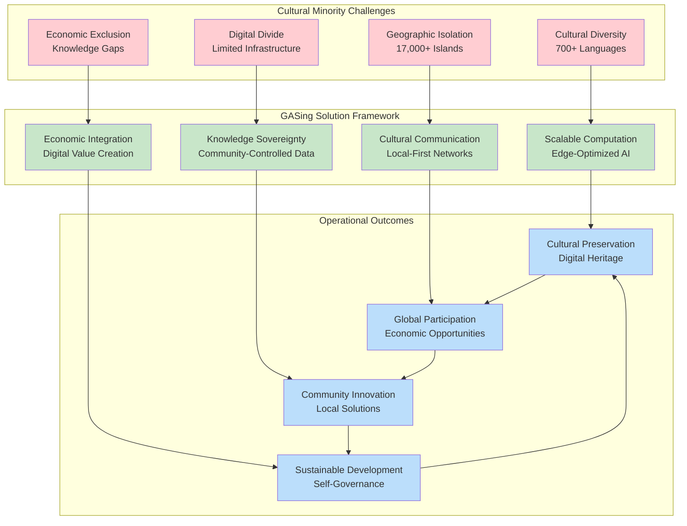
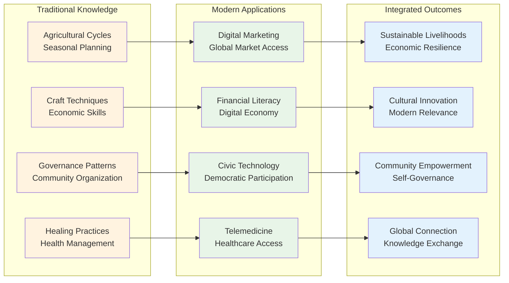
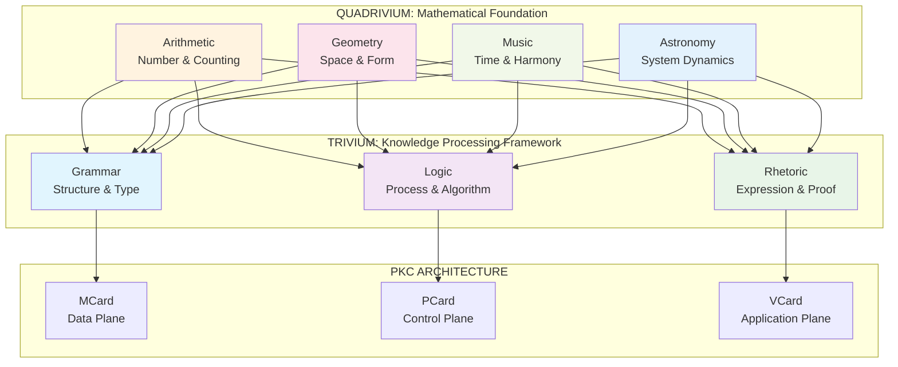
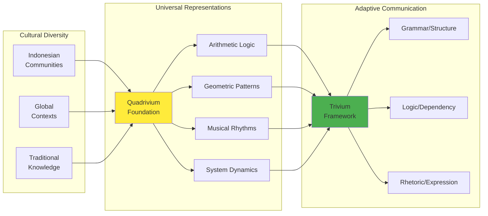
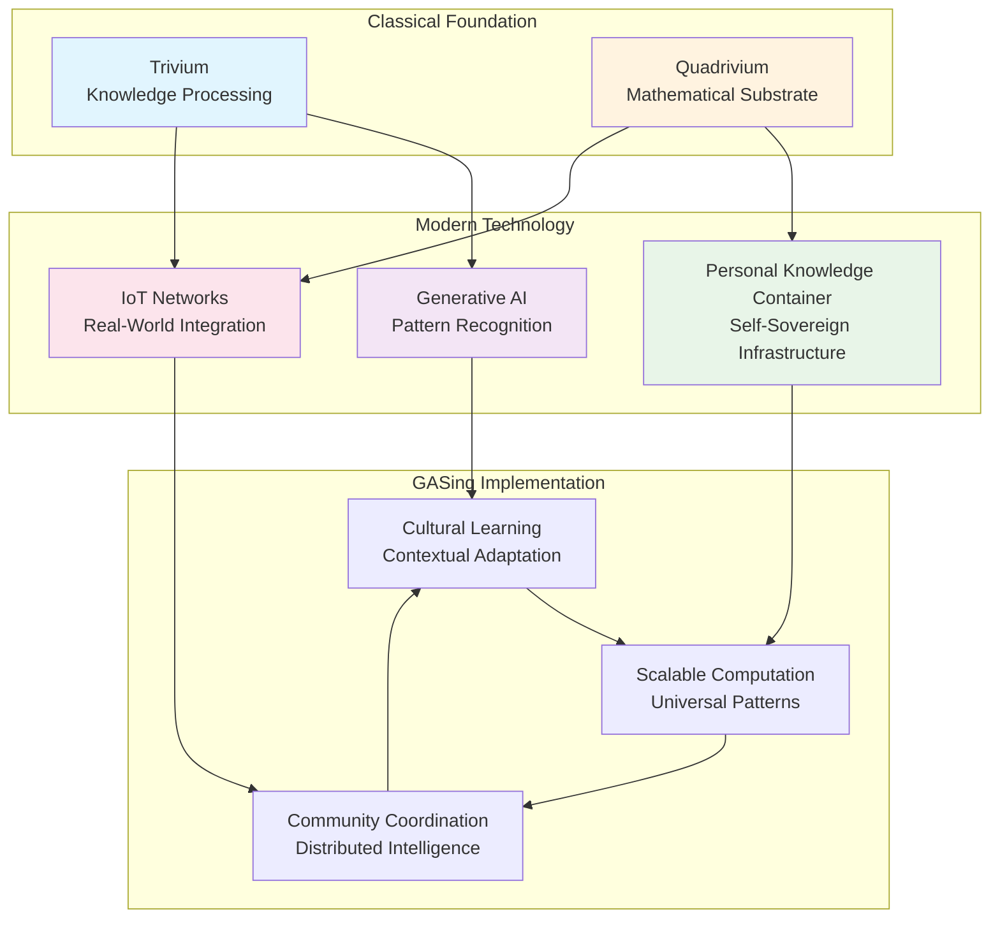

# GASing: The Educational Movement That Is Transforming Indonesian Mathematics Learning

> **Theoretical Framework & AI Implementation**: For comprehensive theoretical foundations and modern AI-powered scaling approaches, see [[Literature/PKM/Institution/Gasing Method.md|GASing Method: Scale-Free Personalized Learning in the AI Age]].
> 
> **Curriculum Architecture Overview**: For a canonical high-level view of how GASing, GASing Arithmetic, and GASing Literacy fit into a unified Trivium × Quadrivium and PKC-based design, see [[GASing Curriculum Architecture]].
>
> **The GASing Rhetoric Strategy**: GASing is the training program for the [[The Learnable Mind's Eye|Mind's Eye]] within the **[[Hub/Theory/Integration/The GASing Rhetoric Strategy|The GASing Rhetoric Strategy]]**. The stage is set by the historical trajectory from [[Immanuel Kant|Kant]] to [[William Rowan Hamilton|Hamilton]] to the [[Hub/Theory/Sciences/Computer Science/Programming Model/Algebra as the Science of Pure Time|Science of Pure Time]], where **all actions are built from Nothing by Sum and Product Types as sequences of compositional actions**.


## Trivium and Quadrivium as Architectural Backbone of GASing

Although GASing began as a culturally grounded mathematics movement, its modern, AI-enabled form is explicitly built on the **architectural synthesis** of the **[[Hub/Theory/Sciences/Reverse Trivium|Reverse Trivium]]** and **[[Hub/Theory/Sciences/Revived Quadrivium|Revived Quadrivium]]** as formalized in the [[ABC curriculum]] and the **[[Hub/Theory/Integration/The Universal Learning Architecture|Universal Learning Architecture]]**.

- The **[[Hub/Theory/Sciences/Reverse Trivium|Reverse Trivium]]** (Rhetoric → Logic → Grammar) provides the *knowledge-processing spine* of GASing:
  - **Rhetoric** (Value-Entry): The start. Activities begin with "Why" and "Social Meaning" ($Menyenangkan$ / Enjoyable), anchoring the learning in community value.
  - **Logic** (Process-Action): The middle. Learners transform representations through active problem-solving and play ($Asyik$ / Fun).
  - **Grammar** (Structure-Result): The end. Knowledge crystallizes into reproducible patterns and stored artifacts ($Gampang$ / Easy-to-retrieve).

- The **[[Hub/Theory/Sciences/Revived Quadrivium|Revived Quadrivium]]** (Arithmetic, Geometry, Music, Astronomy) supplies GASing’s *measurement and pattern substrate*:
  - **Arithmetic** ↔ The **Arithmetic Basis** ($Gampang$): The universal counting logic (digit-wise, resource-aware) providing the discrete foundation for universal connections.
  - **Geometry** ↔ The **Geometric Form** ($Asyik$): Spatial intuition and organization of relationships, providing forms and topology.
  - **Music** ↔ The **Musically Observables** ($Menyenangkan$): The temporal structure, rhythms, and feedback loops that govern the "rhythm of learning."
  - **Astronomy** ↔ The **Astronomical Scaled Microscope and Telescope**: The integrated spacetime view. In the context of the **[[The Learnable Mind's Eye|Mind's Eye]]**, this is the faculty of **[[Hub/Theory/Sciences/semantic zooming|Semantic Zooming]]** (Kan Extensions), physically grounded by tools produced by the **[[Hub/Tech/Make Almost Everything Kit|MAEK]]**.

In modern deployments, this Trivium × Quadrivium backbone is operationalized through PKCs, programmable learning workflows, and the **[[The Sovereign Language Architecture - From Empty Schema to Executable Intelligence|Sovereign Language Architecture]]**. GASing thus becomes not only a pedagogy but a **classically grounded, architecturally coherent operating system for learning** that can scale from village classrooms to national programs. By using the **MAEK** to fabricate physical optics, the learner's **Mind's Eye** is trained to see **[[Permanent/Projects/GovTech/architecture/Relentlessly Pursuing Learnable Opportunities|Relentlessly Pursuing Learnable Opportunities]]** across all scales.

## The Revolutionary Beginning: Making Mathematics "Gampang, Asyik, dan Menyenangkan"

**GASing began as Prof. [[Yohanes Surya]]'s revolutionary insight**: mathematics education fails when it ignores cultural context and student experience. In the late 1990s, Prof. Surya recognized that Indonesia's diverse archipelago—with **700+ languages** across **17,000+ islands**—required a fundamentally different approach to mathematics education that honored local wisdom while building universal mathematical understanding.

**The Core Philosophy**: "**Gampang, Asyik, dan Menyenangkan**" (Easy, Fun, and Enjoyable) emerged not as a simplification of mathematics, but as a sophisticated pedagogical framework that:
- Makes complex concepts **Gampang (Easy)** by connecting to familiar cultural patterns and everyday experiences
- Ensures learning is **Asyik (Fun)** through collaborative, game-like activities rooted in local traditions
- Creates **Menyenangkan (Enjoyable)** experiences that build lasting engagement and mathematical confidence

> **Mathematical Foundation**: The formal mathematical foundations that enable this philosophy to scale globally through typed functions, abstract-concrete mappings, and deterministic lookup tables are detailed in [[Literature/PKM/Institution/Gasing Method.md#Abstract-Concrete Iterative Mappings: The Mathematical Foundation of "Gampang, Asyik, dan Menyenangkan"|GASing Method: Mathematical Foundation of Easy, Fun, Enjoyable]].

**Cultural Mathematics Discovery**: Prof. Surya's breakthrough was recognizing that every Indonesian community already possessed sophisticated **[[Ethnoarithmetics|ethnoarithmetic]]** systems—from Javanese cyclical counting to Dayak spatial architecture, from Batak kinship rhythms to coastal tidal mathematics. Rather than replacing these systems, GASing builds upon them as foundations for universal mathematical understanding.

**Proven Educational Impact**: Over 20+ years, GASing has transformed mathematics education across Indonesia, reaching **millions of students** and training **500+ master practitioners**. The methodology's success stems from its ability to preserve cultural identity while building mathematical competency, proving that effective education must be both universal and contextual.

> **Modern Scaling Framework**: The theoretical foundations and AI-powered scaling approaches that have evolved from this educational movement are detailed in [[Literature/PKM/Institution/Gasing Method.md|GASing Method: Scale-Free Personalized Learning in the AI Age]].

## The Educational Innovation: From Local Wisdom to Universal Mathematics

### Prof. Surya's Pedagogical Breakthrough

**The Context Challenge**: Traditional mathematics education in Indonesia faced a fundamental problem—standardized curricula designed for homogeneous populations failed catastrophically in Indonesia's incredibly diverse cultural landscape. Students across the archipelago were being taught mathematics as if they all shared the same cultural references, counting systems, and ways of understanding quantity and space.

**The Cultural Mathematics Solution**: Prof. Surya's revolutionary insight was that **every community already possessed sophisticated mathematical thinking**—it was simply embedded in their cultural practices rather than expressed in Western mathematical notation. GASing methodology systematically identifies these existing mathematical competencies and uses them as bridges to formal mathematical understanding.

**Conceptual Analogies of Cultural Mathematical Foundations**:
- **Javanese Agricultural Cycles**: Complex temporal mathematics embedded in planting and harvesting schedules
- **Batak Kinship Systems**: Sophisticated relational mathematics governing social structures
- **Dayak Architecture**: Advanced geometric principles in traditional building techniques
- **Coastal Navigation**: Precise astronomical and trigonometric knowledge in traditional seafaring



### Technological Necessity for Cultural Identity Protection

**1. Computational Sovereignty for Knowledge Preservation**

Remote cultural communities require **locally-controlled computational infrastructure** to:
- **Digitize traditional knowledge** using culturally-appropriate representations
- **Create AI models** trained on local languages and cultural patterns
- **Maintain data sovereignty** preventing cultural appropriation by external entities
- **Enable intergenerational knowledge transfer** through digital preservation systems

**2. Communication Networks for Cultural Continuity**

Modern communication technologies are essential for:
- **Connecting dispersed community members** maintaining cultural cohesion across geographic distances
- **Facilitating cultural exchange** between related communities while preserving distinct identities
- **Accessing global markets** for cultural products and traditional knowledge applications
- **Participating in digital governance** ensuring cultural minority voices in policy decisions

**3. Economic Empowerment Through Digital Participation**

Scalable technologies enable cultural communities to:
- **Monetize traditional knowledge** through digital platforms while maintaining cultural control
- **Access global education** and economic opportunities without cultural assimilation
- **Develop local innovations** that combine traditional wisdom with modern technology
- **Create sustainable economies** based on cultural assets and digital capabilities

### Operationally Affordable Infrastructure: Ready for Global Deployment

**The Infrastructure Reality**: GASing's global deployment readiness stems from its **operationally affordable infrastructure** designed specifically for resource-constrained environments. The system's architecture prioritizes **low-cost, high-impact technologies** that can be deployed and maintained by local communities without external dependencies.

| **Infrastructure Component** | **Operational Affordability** | **Cultural Protection Benefit** | **Global Deployment Readiness** |
|------------------------------|--------------------------------|----------------------------------|-----------------------------------|
| **Edge-Optimized AI Models** | Solar-powered edge devices, offline-capable LLMs | Local language processing, cultural pattern recognition | Containerized deployment, automatic updates |
| **Local-First Networks** | Mesh networking, sneakernet protocols, intermittent connectivity | Community-controlled data flows, censorship resistance | Standard protocols, plug-and-play setup |
| **PKC Infrastructure** | Content-addressable storage, peer-to-peer sharing | Data sovereignty, community ownership | Docker containers, cloud-agnostic deployment |
| **Cultural Knowledge Systems** | Traditional devices, low-bandwidth requirements | Indigenous knowledge preservation, intergenerational transfer | Universal data formats, cross-platform compatibility |


### Global Deployment Infrastructure: Proven and Scalable

**Technical Readiness Indicators:**

| **Deployment Aspect** | **Current Status** | **Scalability Evidence** | **Cultural Adaptation Capability** |
|------------------------|-------------------|---------------------------|-------------------------------------|
| **Software Stack** | Containerized, cloud-native | 500+ master practitioners across Indonesia | Localized to 700+ languages and dialects |
| **Hardware Requirements** | Edge-optimized, solar-compatible | Deployed across 17,000+ islands | Adapted to diverse geographic conditions |
| **Network Infrastructure** | Offline-first, mesh-capable | Proven in intermittent connectivity environments | Respects local communication patterns |
| **Content Library** | Culturally-adaptive, AI-generated | 20+ years of proven educational content | Continuously expanding through community contribution |
| **Training Systems** | Community-led, peer-to-peer | Self-replicating trainer development | Preserves local knowledge transmission methods |

**Economic Sustainability Model:**
- **Community Ownership**: Local control reduces operational costs
- **Peer-to-Peer Learning**: Eliminates expensive instructor dependencies
- **Open Source Infrastructure**: Prevents vendor lock-in and reduces licensing costs
- **Cultural Value Creation**: Communities generate economic value from their cultural assets
- **Gradual Scaling**: Organic growth model reduces initial investment requirements

### The Imperative Conclusion: Technology as Cultural Lifeline

**The Existential Reality**: In the 21st century, **scalable computation and communication technologies are not optional enhancements but essential infrastructure for cultural minority survival**. Communities without access to these technologies face systematic marginalization, knowledge loss, and economic exclusion that threatens their very existence.

**GASing's Revolutionary Resolution**: The GASing methodology resolves the false choice between cultural preservation and economic participation by providing **culturally-grounded pathways to digital empowerment**. Through operationally affordable infrastructure and pragmatically useful learning content, remote communities can:

- **Preserve and strengthen cultural identity** while participating in the global digital economy
- **Maintain knowledge sovereignty** while accessing global educational and economic opportunities  
- **Innovate locally** by combining traditional wisdom with modern computational capabilities
- **Scale globally** through proven, deployment-ready infrastructure that respects cultural diversity

**Global Deployment Readiness**: With 20+ years of proven success across Indonesia's diverse archipelago, 500+ trained master practitioners, and operationally affordable infrastructure designed for resource-constrained environments, GASing represents **the world's most deployment-ready framework** for culturally-sensitive digital transformation.

The choice is clear: **embrace scalable technologies that preserve and amplify cultural diversity, or watch irreplaceable human knowledge disappear in the digital divide**. GASing provides the pathway forward—one that honors the past while building the future.

### The Educational Movement's Core Mission: Culturally-Grounded Mathematical Literacy

**GASing's Educational Philosophy**: The movement's mission centers on proving that **mathematical literacy is a universal human capacity** that manifests differently across cultures but can be systematically developed through culturally-respectful pedagogy. Rather than imposing external mathematical frameworks, GASing reveals and builds upon the mathematical thinking already present in every community.

**[[Ethnoarithmetics|Ethnoarithmetic]] Educational Foundations**: Prof. [[Yohanes Surya]] and Prof. [[Hokky Situngkir]] discovered that while Indonesia's 700+ languages interpret quantitative notions differently, **arithmetic thinking provides the universal cognitive foundation** for mathematical learning across all cultural contexts. This insight became the cornerstone of GASing's educational approach.

**The Trivium-Based Learning Process**: GASing implements a culturally-sensitive version of the classical **[[Trivium]]** framework:
- **[[Rhetoric]]** (Cultural Engagement): Begin with local cultural practices—songs, dances, crafts, games—that already contain mathematical patterns
- **[[Logic]]** (Pattern Recognition): Help students identify the mathematical principles embedded in their familiar cultural activities  
- **[[Grammar]]** (Formal Expression): Introduce standard mathematical notation as a way to express the mathematical thinking they already possess

### Why GASing Works: Compact, Culturally Neutral, and Operationally Scalable

GASing’s success comes from staying faithful to “Gampang, Asyik, Menyenangkan” using what communities already have.

- **Compact Representation (Easy)**: Instead of inventing new terms, GASing relentlessly reuses existing words and expressions in local languages and social settings. New vocabulary is not added until the desired abstract idea has been tied back to everyday meaning and checked through repeated, interactive activities. This keeps learning light and clear.
- **Cultural Neutrality (Fun)**: Lessons start from familiar rituals, tools, and stories. By anchoring ideas in what people already do—games, songs, craft rules—GASing avoids cultural bias while keeping engagement high. Abstract ideas grow naturally from shared experiences.
- **Scalable Operations (Enjoyable)**: Because GASing uses contextual rituals and situational resources (whatever is at hand: chalk lines, pebbles, hand claps, local games), it works in villages, towns, and cities alike. The same activities scale with group size and setting without extra equipment or jargon.

In short, GASing keeps language simple, grows meaning from lived practice, and turns common materials and routines into reliable learning workflows.

> **Modern Theoretical Framework**: The comprehensive theoretical foundations that have evolved from this educational approach are detailed in [[Literature/PKM/Institution/Gasing Method.md|GASing Method - Theoretical Foundations]].

### The Educational Methodology in Practice

**1. Cultural Context Discovery**: GASing educators begin by immersing themselves in local cultural practices, identifying the mathematical thinking already present in community activities. This requires deep cultural sensitivity and genuine respect for local knowledge systems.

**2. Mathematical Pattern Recognition**: Working with community members, educators help reveal the sophisticated mathematical concepts embedded in traditional practices—geometric principles in craft work, algebraic relationships in social structures, statistical thinking in resource management.

**3. Bridge-Building to Formal Mathematics**: Rather than abandoning cultural mathematical practices, GASing shows how they connect to and enhance formal mathematical understanding. Students learn that their cultural knowledge is mathematically sophisticated, not mathematically deficient.

**Educational Impact**: This approach has proven transformative because it validates rather than replaces existing cultural knowledge, creating confident learners who see mathematics as an extension of their cultural competency rather than a foreign imposition. Students develop both cultural pride and mathematical proficiency simultaneously.

## Agentic Workflow: Learning in the Age of Human-Machine Collaboration

Modern learning increasingly requires **Agentic Workflow**—the seamless collaboration between human agents and AI systems where both contribute their unique strengths to the learning process. Unlike traditional educational models that position technology as a delivery mechanism, GASing is fundamentally designed for this collaborative paradigm. It recognizes that effective learning in the AI era emerges from the dynamic interplay between human creativity, cultural wisdom, and computational power.

GASing addresses this need by organizing data and knowledge to inherently express both **social meaning** (how concepts connect to community practices, cultural values, and collaborative relationships) and **physical meaning** (how abstract ideas map to observable, measurable phenomena in the real world). This dual grounding ensures that when human learners collaborate with AI agents:

- **Human agents** contribute contextual understanding, creative insight, cultural wisdom, and meaning-making capabilities
- **AI agents** provide pattern recognition, computational processing, vast information synthesis, and personalized adaptation
- **The collaboration** produces learning experiences that are simultaneously rigorous, culturally relevant, and computationally enhanced

By embedding social and physical meaning directly into the data structure, GASing creates a shared semantic foundation that both human and artificial agents can understand and build upon through **[[Ethnoarithmetics|ethnoarithmetic]]** systems. This enables true partnership rather than mere tool usage, where learning becomes a collaborative story-building process between human creativity and computational capability.

**[[Trivium]] Ethnographic Orientation**: GASing begins with **[[Rhetoric]]** (in-situ observation of cultural practice—songs, dances, calls-and-response, crafts), then **[[Logic]]** (capturing insider meaning before introducing formal models), finally **[[Grammar]]** (creating data representations that preserve both cultural context and computational utility).

**Ritual-Gamification Bridge**: The **[[Trivium]]** methodology reveals deep mathematical connections between traditional ritual engagement and modern gamification systems, enabling culturally-respectful integration of sacred and secular engagement patterns. See [[Hub/Theory/Sciences/Ritual and Gamification.md|Ritual and Gamification]] for comprehensive analysis.

> **Cultural Foundations**: See [[Literature/PKM/Institution/Gasing Method.md#Origins: Contextual Arithmetic Logic for Cultural Diversity|GASing Method - Cultural Origins]] for detailed [[Ethnoarithmetics|ethnoarithmetic]] examples across Indonesian communities.

## The Three Pillars of Technology-Enhanced Inclusive Learning

GASing transforms the Indonesian philosophy of **"Gampang, Asyik, dan Menyenangkan"** (Easy, Fun, and Enjoyable) into a systematic framework for technology-enhanced learning. Each pillar demonstrates how GASing continuously identifies and deploys contextual resources to minimize entry barriers while maximizing engagement.

### Pillar 1: Gampang (Easy) — Zero Assumption and Opportunity Capture

GASing makes learning "Easy" by using technology to **automatically identify and adapt to available resources**, ensuring that complexity never becomes a barrier to entry. This is anchored in the **Zero Assumption Principle** and the **[[The Empty Schema Principle - Domain-Independent Knowledge Through Zero Assumptions|Empty Schema Principle]]**.

Guiding principles:
- **Zero Pre-mature Assumptions**: By starting with an "Empty Schema" (no rigid definitions), we minimize cognitive overhead and symbolic prejudice.
- **Maximum Opportunity Capture**: Knowledge is stored in its most general, domain-independent form as an **[[MCard]]** (Memory), preserving the highest potential for future synthesis.
- **Minimal Footprint**: Runs on modest devices; offline‑first with background sync via [[PKC]].
- **Zero‑Config Defaults**: Safe, sane presets; automatic workspace/bootstrap linking to local [[PKC]].

**Key Principle**: *Gampang (Easy) starts with **Emptiness** (Zero Assumption) to maximize the "Space for Correct Judgment."*

#### Gampang as Decaste-ing Knowledge

The "Gampang" (Easy) pillar is the operational antidote to the **[[Hub/Theory/Sciences/The unreasonable ineffectiveness of academic style of knowledge representation|academic caste system]]**. Traditional academia often maintains its social status by making knowledge intentionally "difficult" or "conformant"—requiring years of stylistic initiation (citations, jargon, tribal rituals) before one is granted access to the "essence." 

In the GASing framework, "Easy" is a **political act of democratization**. By relentlessly removing "symbolic prejudice" and starting with **Zero Assumption**, we ensure that knowledge is a **Sovereign Asset** available to anyone with a need, rather than a marker of social status for those with the privilege of time. GASing replaces the **Walled Garden** of the university with a **Knowledge Supply Network** that meets the learner where they are.


**How Technology Enables "Easy":**
- **Formal Knowledge Model (CLM)**: All content knowledge is formally specified as a human and machine readable [[Cubical Logic Model]], representable as web-based form known as [[PCard]], with three dimensions—Abstract Specification, Concrete Implementation, and Balanced Expectations—making knowledge precise, verifiable, and composable.
- **Representation and Provenance**: Every knowledge unit and asset is rendered as Cards in [[PKC]]: [[MCard]] (immutable content/data), [[PCard]] (process/flow/executable function), and [[VCard]] (verifiable, valuable tokens). Cards are content‑addressable, versioned, and permissioned, preserving lineage and authorship by hash.
- **Scenario Composition (Real-World Use Cases)**: Lessons, labs, and community projects are built by composing Cards into parameterizable workflows (executable graphs) that are replayable, auditable, and locally executable. Resource‑safe composition (Linear Logic) and identity‑preserving transformations ensure causal, correct-by-construction flows.
- **AI‑Powered Personalization**: Models use CLM metadata and execution history to adjust difficulty, select examples, and surface just‑in‑time hints that respect local constraints.
- **Progressive Scaffolding**: Sequences are derived from CLM dependencies; single‑page forms act as structured capture surfaces to collect and navigate accumulated knowledge in human‑readable, editable form.
- **Multi‑Modal Translation**: Content automatically adapts across text, visual, audio, and interactive formats based on learner preferences and device capabilities.
- **Conversational Programming ([[Vibe Coding]])**: Natural‑language interaction over [[Hypercard|HyperCards]] and [[CLM]] enables low‑barrier querying, linking, testing, and refactoring of knowledge and workflows.
- **Unified Namespace**: A single, function‑oriented vocabulary bound to local‑first databases keeps terms, artifacts, and workflows coherent and discoverable across devices and contexts.

**Practical Implementation:**
- Utilize interactive web apps to enable distance learning  
- Deploy offline-first mobile apps with periodic sync
- Use [[PKC]] to help manage personalized vocabulary and content knowledge
- Scale to immersive experiences (AR/VR) where hardware permits

**Key Principle**: *Technology should reduce cognitive load, not add to it.*

### Pillar 2: Asyik (Fun) — Collaborative Logic and Process

GASing makes learning "Fun" by leveraging technology to create **social, gamified experiences** that adapt to group dynamics and available collaborative tools. This pillar corresponds to the **Logic** phase, where patterns and algorithms (**[[PCard]]**) emerge from interaction.

**How Technology Enables "Asyik":**
- **Process-First Design**: Learning is framed as a series of transitions (PCards) rather than static facts, mirroring the **[[PTR|Polynomial Type Runtime]]** flow.
- **Adaptive Gamification**: Game mechanics adjust to cultural contexts—competitive leaderboards in some communities, collaborative achievements in others.
- **Peer Learning Networks**: Technology connects learners across distances, enabling knowledge exchange even in isolated areas.
- **Card-Composed Collaboration**: Team activities are modeled as [[PCard]] workflows over a shared [[PKC]] space; co-editing preserves provenance and permissions.
- **CLM-Backed Feedback Loops**: Group progress, hints, and challenges derive from CLM Balanced Expectations, turning outcomes into versioned evidence.

**Key Principle**: *Asyik (Fun) is the joy of discovery through **Process** (PCard) and pattern matching.*

**Practical Implementation:**
- Local multiplayer games on shared devices
- Turn-based challenges via SMS or messaging apps
- Synchronous online collaboration with video
- Asynchronous forums for different time zones

**Key Principle**: *Fun emerges from meaningful interaction, enabled by whatever technology is available.*

### Pillar 3: Menyenangkan (Enjoyable) — Value Anchoring and Verification

GASing makes learning "Enjoyable" by ensuring technology **connects abstract concepts to local realities**, creating lasting engagement through personal relevance and verified correctness. This corresponds to the **[[VCard]] Sandwich**—anchoring learning between initial Value ($V_{\text{pre}}$) and final Verification ($V_{\text{post}}$).

**How Technology Enables "Menyenangkan":**
- **Value Anchoring ($V_{\text{pre}}$)**: Every activity starts by identifying **"Why it matters"** (Rhetoric Entry), ensuring high motivation and anchorage in community need.
- **Verified Proof ($V_{\text{post}}$)**: Completion is marked by a **Verification VCard** (Grammar Exit), providing the satisfaction of mathematical certainty and recognized achievement.
- **Localized AI Models**: Models fine-tuned on regional dialects and cultural references to maintain **[[Hub/Theory/Sciences/SoG/Sovereign Operational Network|Sovereignty]]**.
- **Community Problem-Solving**: Use real-world results (MCard outputs) to solve local challenges, closing the loop between theory and application.
- **Attribution and Reward**: Verified contributions are recognized via VCards, enabling transparent credit and IP stewardship.

**Key Principle**: *Menyenangkan (Enjoyable) is the satisfaction of **Value** and **Verification** (VCard).*

**Practical Implementation:**
- Continuous updates of [[PKC]] by built-in upgradability across all layers of technology stacks
- Weather stations for agricultural communities
- Water quality sensors for coastal villages
- Traffic pattern analysis for urban areas
- Cultural artifact digitization projects

**Key Principle**: *Technology should amplify local relevance, not impose external contexts.*

### Integration Across All Three Pillars

The true power of GASing emerges when all three pillars work together:

1. **Resource Scanning**: Continuously assess available human, technological, and cultural resources
2. **Adaptive Deployment**: Match teaching methods to current capabilities while preparing for future upgrades
3. **Progressive Enhancement**: Start simple, add complexity as resources and readiness allow
4. **Community Feedback Loops**: Use data to refine and improve locally-relevant approaches

This integrated approach ensures that whether a community has basic feature phones or high-end computers, whether they're in remote villages or urban centers, GASing can deploy appropriate technology to make learning Easy, Fun, and Enjoyable for everyone.

> **AI-Age Scaling Theory**: The theoretical framework for scaling this educational approach through AI-powered personalized learning systems is detailed in [[Literature/PKM/Institution/Gasing Method.md|GASing Method: Scale-Free Personalized Learning in the AI Age]].

## From Cultural Arithmetic to AI-Powered Global Infrastructure

**[[Ethnoarithmetics|Ethnoarithmetic]] Infrastructure Foundation**: GASing's infrastructure success stems from recognizing that **[[Ethnoarithmetics|ethnoarithmetic]] systems serve as the universal cognitive foundation** across all cultural contexts. The **[[Quadrivium]]** provides the organizing framework:
- **Arithmetic** (Javanese cyclical counting)
- **Geometry** (Dayak spatial architecture) 
- **Music** (Batak kinship rhythms)
- **Astronomy** (Coastal tidal mathematics)

> **Cultural Examples**: See [[Literature/PKM/Institution/Gasing Method.md#Origins: Contextual Arithmetic Logic for Cultural Diversity|GASing Method - Cultural Foundations]] for detailed community-specific quantitative interpretations.

**Generative AI Amplification**: This **[[Ethnoarithmetics|ethnoarithmetic]] foundation** becomes exponentially powerful when combined with **Generative AI capabilities** through **[[Trivium]]** implementation:
- **[[Rhetoric]]**: GAI generates culturally-engaging content
- **[[Logic]]**: Mathematical reasoning across domains
- **[[Grammar]]**: Reproducible learning artifacts

> **Comprehensive AI Framework**: See [[Literature/PKM/Institution/Gasing Method.md#Generative AI Alignment|GASing Method - AI Implementation]] for detailed technological architecture.

GASing's infrastructure is built on a **scalable technology stack** that grows with communities—from basic SMS systems to advanced AI platforms. This infrastructure is designed to **scale both vertically** (increasing sophistication) and **horizontally** (expanding reach), ensuring that learning infrastructure can grow organically with available resources and community readiness.

### Personal Knowledge Container (PKC): Self-Sovereign Learning Platform

At the heart of GASing's technology ecosystem is the **[[Personal Knowledge Container]] (PKC)**—a self-sovereign digital container that adapts to available infrastructure while ensuring learners maintain ownership of their educational journey.

**Core Capabilities:**
- **Offline-First Design**: Functions without internet, syncs when connected
- **Progressive Web App**: Works on any device with a browser
- **Content Addressing**: Every piece of knowledge is uniquely identified and verifiable
- **Privacy Preservation**: Learners own and control their data

**Adaptive Deployment:**
- **Basic Mode**: Text-based interface for feature phones
- **Standard Mode**: Rich media support for smartphones/tablets
- **Advanced Mode**: Full ML/AI capabilities for powerful devices
- **Community Mode**: Peer-to-peer sharing in local networks

### Context-Sensitive Core Vocabulary (PKC + MCard)

To keep learning "Gampang, Asyik, Menyenangkan" while maximizing information density, GASing maintains a small, typed core vocabulary as `[[MCard]]`s and binds local surface terms contextually.

- **Core schema (MCard)**: `canonical_form`, `surface_forms` (dialectal variants), `type` (e.g., arithmetic primitive, rotation kernel), `invariants` (e.g., orientation/phase), `context_profile` (region/grade/device/modality), `links` (e.g., [[SO(2)]], [[GASing Triangles]]), provenance/permissions.
- **Resolver (PCard)**: Maps user utterance + device + region to the best-fit `surface_form` and returns the `canonical_form` id for consistent teaching and assessment.
- **Transport (PCard)**: Performs Kan-style extension of core terms across domains (Arithmetic → [[SO(2)]] → Fourier → [[SU(2)]]) while preserving invariants (angle/phase). See [[Kan extensions]].
- **Sovereignty & versioning**: Communities control additions/edits; content-addressed ids deduplicate identical cores; variants remain linked to the same canonical id.

This mechanism relentlessly compresses vocabulary to irreducibility while adapting surfaces to culture, modality, and device constraints.


### Connectivity Solutions: From Villages to Cities

**[[Overlay VPN]] and Mesh Networks:**
- **Low-Bandwidth Optimization**: Compression and caching for 2G/3G networks
- **Offline Sync**: Store-and-forward for intermittent connectivity
- **Peer-to-Peer Distribution**: Share content locally without internet
- **Security and Privacy**: End-to-end encryption for all communications

**Progressive Network Enhancement:**
1. **SMS Gateway**: Basic lessons via text messages
2. **USSD Menus**: Interactive learning with minimal data (See [[USSD]].)
3. **Local Wi-Fi**: School or community hotspots
4. **Mesh Networks**: Village-wide learning networks
5. **Cloud Integration**: Full internet when available

### Hands-On Learning Tools: Modular IoT Devices

**Adaptive Hardware Platform:**
- **Basic Sensors**: Temperature, humidity, light—powered by batteries
- **Smart Sensors**: Environmental monitoring with solar power
- **Interactive Kits**: Arduino/Raspberry Pi for advanced projects
- **Mobile Labs**: Shared resources that rotate between communities

**Community-Specific Applications:**
- Agricultural communities: Soil moisture, weather stations
- Coastal villages: Water quality, tide monitoring
- Urban areas: Air quality, traffic patterns
- All communities: Basic physics and chemistry experiments

### AI Partners: Culturally Aware Learning Assistants

**Locally Fine-Tuned Language Models:**
- **Language Support**: Regional dialects and indigenous languages
- **Cultural Context**: Understands local customs and references
- **Adaptive Complexity**: Adjusts explanations to learner level
- **Offline Capability**: Edge-deployed models for no-internet scenarios

**Progressive AI Enhancement:**
1. **Rule-Based Chatbots**: Simple Q&A for basic phones
2. **Lightweight Models**: Small LLMs for smartphones
3. **Full Models**: Advanced AI for capable devices
4. **Federated Learning**: Community models improve together

### Content Distribution: Decentralized Knowledge Commons

**Multi-Modal Content Delivery:**
- **IPFS/Decentralized Web Nodes**: Content-addressed, distributed storage (See [[IPFS]])
- **Local Content Servers**: School or community knowledge hubs
- **Sneakernet**: USB/SD card distribution for offline areas
- **Broadcast**: Radio/TV integration for wide reach

**Version Control and Collaboration:**
- **Git-Style Tracking**: Every change is recorded and attributable
- **Community Review**: Local experts validate content
- **Fork and Merge**: Communities adapt content to local needs
- **Attribution System**: All contributions are recognized

### Pragmatic Learning Content: Bridging Traditional Knowledge and Modern Applications

**Infrastructure-Enabled Content Delivery**: With **Generative AI** for cultural adaptation, **Self-Sovereign Content Distribution Networks** via IPFS/Decentralized Web Nodes for reliable delivery, and **PKC infrastructure** for community ownership, GASing can now provide **immediately useful, culturally-relevant learning content** that addresses real community needs while preserving local knowledge sovereignty.

**Knowledge Integration Framework**: The robust infrastructure enables seamless integration between traditional community knowledge and modern technological applications, creating learning pathways that honor cultural heritage while building practical digital capabilities:



**Infrastructure-Supported Learning Pathways**: The combination of **Generative AI cultural adaptation**, **decentralized content distribution**, and **community-owned PKC infrastructure** enables three key deployment-ready learning modules:

**1. Digital Literacy Through Cultural Practice**
- **Traditional Counting Systems** → **Digital Calculation Tools** (via culturally-adapted AI interfaces)
- **Storytelling Traditions** → **Digital Content Creation** (using decentralized publishing platforms)
- **Community Decision-Making** → **Digital Governance Platforms** (through PKC-enabled self-sovereign participation)
- **Cultural Arts** → **Digital Media Production** (leveraging local content servers and mesh networks)

**2. Economic Empowerment Through Technology**
- **Traditional Crafts** → **E-commerce Platforms** (supported by offline-first PKC infrastructure)
- **Agricultural Knowledge** → **Precision Farming Apps** (enhanced by IoT sensor networks and local AI models)
- **Resource Management** → **Digital Accounting Systems** (using content-addressed storage for transparency)
- **Community Networks** → **Digital Cooperatives** (facilitated by mesh networking and peer-to-peer sharing)

**3. Healthcare and Education Access**
- **Traditional Medicine** → **Telemedicine Integration** (via culturally-aware AI assistants and local knowledge validation)
- **Oral History** → **Digital Archives** (using IPFS for permanent, distributed preservation)
- **Apprenticeship Systems** → **Online Learning Platforms** (through PKC-enabled skill verification and community review)
- **Cultural Ceremonies** → **Virtual Community Events** (leveraging overlay VPN networks for secure, private gatherings)

**Seamless Knowledge Sovereignty**: This infrastructure-content integration ensures that communities maintain cryptographically protected **ownership and control** over their knowledge assets while gaining access to global learning networks and modern technological capabilities. The **progressive adoption framework** allows communities to integrate these capabilities at their own pace, building upon proven cultural practices rather than replacing them.

### The Universal Knowledge Representation: The Trivium & Quadrivium
For stories to be shared and understood, they need a common structure. The **[[GASing Trivium]]** (Rhetoric, Logic, Grammar) and **[[GASing Quadrivium]]** (Arithmetic, Geometry, Music, Astronomy) provide this universal representation of knowledge.

- The **Trivium** names the rules of storytelling—how to structure (Grammar), validate (Logic), and move an audience (Rhetoric). GASing intentionally flips the usual order to begin with lived culture and then crystallize rules:
  - **Begin with Rhetoric (participation)**: join communal rituals—singing, dancing, call‑and‑response, craft—so learners experience patterns already meaningful in society.
  - **Reveal the Logic (explanation)**: from shared activity, surface the why—causal structure, constraints, invariants, and success criteria that make the practice work.
  - **Congeal the Grammar (codification)**: name the repetitive patterns and encode them as reproducible artifacts—procedures, notations, checklists, code, models—for others to verify and reuse.

## Multi-Scale Conversational Learning

GASing orchestrates interactive technologies across multiple scales to sustain continuity and growth:
- **Spatial scales**: local (individual workspace), community (shared learning spaces), regional (distributed knowledge networks), and global (cross-cultural knowledge exchange).
- **Temporal scales**: micro (prompt/response turns), meso (lesson/task cycles), macro (course/community arcs).
- **Social scales**: individual → pair → cohort → regional community knowledge exchange.

It is necessary to systematically incorporate these interactive technologies into learning activities—so that dialogue structure (session types), verification (CLM), distribution (PKC Peer CDN), and flow feedback are embedded by design rather than added ad hoc.

Method mapping. Rhetoric ↔ participant observation; Logic ↔ analytic coding of practices; Grammar ↔ codification into reproducible artifacts validated by practitioners (member checking).

> **Theoretical Framework**: The comprehensive theoretical foundations for AI-powered scaling of this educational methodology are detailed in [[Literature/PKM/Institution/Gasing Method.md|GASing Method: Scale-Free Personalized Learning in the AI Age]].

- The **Quadrivium** offers four practical lenses for composing and verifying knowledge:
  - **Arithmetic (quantifiable logic)**: a computable framework to express, transform, and check quantified statements and constraints—numbers as executable logic.
  - **Geometry (shape and adjacency/topology)**: form, proximity, connectivity, and invariants under deformation—maps, meshes, graphs, and spaces.
  - **Music / Time (ordering)**: sequencing, rhythm, cadence, and partial orders that structure events and processes—windows, sampling, synchronization.
  - **Astronomy / Dynamical Systems (multi‑scale causality)**: any system with physical properties and causal relations evolving across space–time, not only celestial motion.

Cultural adaptation. Each lens respects local invariants: Ethno Arithmetic for counting practices; indigenous spatial logics for Geometry; community meter/phrasing for Music; seasonal/ecological cycles for Dynamics.

Together, they form a shared framework that allows personal stories to be composed into a universal library of human knowledge.

### The Publishing House: An Open-Source Knowledge Commons
Once a story is ready, it needs to be shared. The GASing ecosystem operates like a decentralized, **open-source publishing house**. Using tools and practices from the world of software development—like Git-style versioning, peer review, and federated updates—learners can:

- **Publish Their Work**: Share their knowledge stories with the community.
- **Collaborate and Remix**: Fork, merge, and improve upon the stories of others.
- **Build a Collective Library**: Contribute to an ever-growing, globally accessible commons of human knowledge, where every contribution is attributed and every voice can be heard.

Community co-authorship. Releases include local review (“member checks”) to ensure compressed representations preserve meaning and context.

## A Story for Everyone: Democratizing Knowledge from Cities to Villages

Great storytellers can come from anywhere. A central mission of GASing, led by Prof. [[Yohanes Surya]], is to bring these tools to the remote and underserved communities in Indonesia and beyond. The vision is not just to deliver content, but to empower every village to become a hub of knowledge creation.

This is achieved through a rugged, scalable technology stack designed for the real world:

- **Resilient Networks**: An **[[Overlay VPN]]** and mesh infrastructure that works in low-bandwidth and offline environments.
- **Hands-On Tools**: **Modular IoT devices** that allow students to gather data and tell stories about their own physical environment.
- **Culturally Fluent AI**: **Locally fine-tuned LLMs** that understand regional languages and contexts, acting as a creative partner that respects local wisdom.

Field protocols. [[Overlay VPN]] syncs low‑bandwidth field notes, while protecting content authorship and privacy; modularized [[IoT]] devices captures community‑chosen observables; local LLMs honor dialect, metaphor, and ritual semantics.

This ensures that the future of knowledge is not centralized in a few major cities, but is a rich tapestry woven from the stories of every community on Earth.

## The Never-Ending Story: Knowledge as a Living System

GASing rejects the idea of knowledge as a static collection of facts. Instead, it treats knowledge as a **living, evolving system**—a story that is constantly being written, revised, and extended.

Using principles from information theory, GASing measures progress by the **reduction of uncertainty ([[entropy]])**. A good story, like a good scientific theory, is one that makes the world more predictable and understandable. The entire ecosystem is designed for this continuous evolution, with built-in mechanisms for versioning, feedback, and federated improvement.

Ultimately, GASing is a journey: **"from numeracy to self-governance"**. By learning to tell clear, resource-aware, and verifiable stories about the world, we learn to tell better stories about ourselves. We become the authors of our own lives, capable of making better decisions, collaborating more effectively, and contributing our unique chapter to the grand, unfolding story of human progress.
**[[Ethnoarithmetics|Ethnoarithmetic]] as Universal Foundation**: GASing's breakthrough insight—that **[[Ethnoarithmetics|ethnoarithmetic]] systems bridge cultural diversity**—makes it uniquely powerful in the **Generative AI era**. The methodology's success in making quantitative reasoning accessible across Indonesia's **culturally distinct communities** through **[[Trivium]]** and **[[Quadrivium]]** frameworks directly parallels GAI's capacity for **cross-domain pattern synthesis**.

> **Foundational Methodology**: See [[Literature/PKM/Institution/Gasing Method.md|GASing Method]] for comprehensive cultural-arithmetic foundations and self-governance principles.

**Perfect AI Alignment**: Both GASing and GAI recognize that **meaningful knowledge emerges from pattern recognition across diverse contexts** rather than rigid rule application through **[[Trivium]]** methodology:
- **[[Rhetoric]]** (Cultural Sensitivity): Both systems adapt to local interpretive frameworks
- **[[Logic]]** (Universal Principles): Both extract transferable patterns from diverse examples  
- **[[Grammar]]** (Generative Capacity): Both create reproducible knowledge artifacts

**Remote Content Revolution**: This **[[Ethnoarithmetics|ethnoarithmetic]]-GAI alignment** enables **unprecedented remote education capabilities** across all **[[Quadrivium]]** domains—delivering both **breadth** (any cultural context) and **depth** (sophisticated mathematical reasoning) to the most isolated communities worldwide.

**Generative AI Era Advantages**: In today's **AI-powered global landscape**, GASing's **[[Ethnoarithmetics|ethnoarithmetic]] foundation** offers unprecedented advantages through **[[Trivium]]** and **[[Quadrivium]]** integration:

1. **Universal Cultural Accessibility**: Proven effectiveness across Indonesia's **700+ languages and diverse [[Ethnoarithmetics|ethnoarithmetic]] traditions** demonstrates scalability through **[[Quadrivium]]** domains

2. **AI-Human Collaborative Intelligence**: **[[Ethnoarithmetics|Ethnoarithmetic]] foundations** enable sophisticated **human-AI collaboration** through **[[Trivium]]** methodology

3. **Remote Knowledge Sovereignty**: **GAI-amplified delivery** ensures communities maintain **[[Ethnoarithmetics|ethnoarithmetic]] heritage** while accessing global computational knowledge

4. **Infinite Scalable Personalization**: **[[Trivium]]-[[Quadrivium]] framework + GAI generation** = unlimited contextually-relevant variations

> **Complete Framework**: See [[Literature/PKM/Institution/Gasing Method.md|GASing Method]] for detailed self-governance principles, cultural foundations, and AI implementation strategies.

### Agentic CI/CD/CT for National-Scale Learning

The convergence of **networked infrastructure** and **LLM content generation** enables a **CI/CD/CT** process that transforms GASing into a truly **[[Hub/Theory/Integration/Truth is Scale-Free|Truth is Scale-Free]]** learning platform for the AGI age:

-   **Continuous Integration (CI)**: The system naturally explores local cultural practices and, using LLMs, integrates them into the global knowledge graph as new learning modules.
-   **Continuous Deployment (CD)**: New content is immediately deployed to village-level edge devices, ensuring that learning opportunities are available as soon as they are identified.
-   **Continuous Training (CT)**: Local learning interactions are captured as feedback to drive **Continuous Training**. This allows the global model to "learn" from local variations (Ethnoarithmetic) and autonomously improve its delivery, achieving **[[Hub/Tech/MLOps maturity model|MLOps Maturity Level 4]]** at a national scale.

This automated cycle ensures that GASing evolves autonomously, relentlessly pursuing and generating new learnable opportunities across all scales.

## GASing Educational Framework: [[Trivium]] and [[Quadrivium]]

> **Complete Framework**: See [[Literature/PKM/Institution/Gasing Method.md|GASing Method]] for comprehensive [[Trivium]] and [[Quadrivium]] implementation with [[Ethnoarithmetics|ethnoarithmetic]] foundations.

## GASing [[Trivium]]

GASing implements **information processing modes** that directly align with modern **machine learning** and **data science** workflows through **[[Ethnoarithmetics|ethnoarithmetic]]** systems, creating mental models compatible with contemporary computational infrastructure. See [[GASing Trivium]] and [[GASing Quadrivium]].

### The Three Pillars of GASing [[Trivium]]:
GASing intentionally flips the classical order to implement a **Zero Assumption Strategy**. We begin with **[[Rhetoric]]** (Value entry) so learners first participate in lived **[[Ethnoarithmetics|ethnoarithmetic]]** practices, then surface the **[[Logic]]** (Process) already embodied in those practices, and finally congeal patterns as **[[Grammar]]** (Memory capture/Verification exit).

This sequence is operationalized as the **[[PTR|VCard Sandwich]]**:

- **Rhetoric (VCard Entry)**: Guided participation in local rituals; observe and join singing, dancing, and collaborative practice. **Zero Assumption**: Start with contextual value, not abstract definitions.
- **Logic (PCard Process)**: Extract causal structure and patterns from what is already observable; experience the *why* behind patterns; reason about relationships and invariants.
- **Grammar (MCard Storage & VCard Exit)**:
    - **Capture**: Encode repetitive patterns into reproducible **MCards** (maximizing opportunity).
    - **Verify**: Secure a **Verification VCard** to prove the path from Rhetoric-Entry to Grammar-Exit is mathematically sound.

## GASing Quadrivium

[[GASing Quadrivium]] reimagines the classical [[Quadrivium]] (Arithmetic, Geometry, Music, Astronomy) as four foundational languages for understanding and engaging with the world. Each offers a different way of counting, measuring, and mapping meaning across time and space, activating symbolic, spatial, temporal, and cosmic intelligence.

In practice, this also embraces culturally grounded counting traditions such as [[Ethno Arithmetic]], which root Arithmetic in lived community practices and contextual meaning.

| Quadrivium Domain | Type of Counting       | Description |
|-------------------|------------------------|-------------|
| **Arithmetic**    | Counting with symbols and numbers | The language of pure quantity and abstraction. Foundation for digital logic, coding, and symbolic reasoning. |
| **Geometry**      | Counting in Space       | Forms, shapes, and spatial relations. Enables design thinking, topological reasoning, and physical intuition. |
| **Music**         | Counting in Time        | Rhythm, sequence, harmonics. Supports pattern recognition, emotional flow, and expressive timing. |
| **Astronomy(Physics)**     | Counting in Space/Time  | Synthesis of space and time. Trains learners to see large-scale systems, cycles, and universal laws. |

### Symmetry‑Preserving Information Compression

GASing practices information compression by preserving the symmetries that make knowledge transferable. We compress representations while keeping their invariants intact—so meaning survives even as description length shrinks.

- **Idea (what to preserve)**: Identify group actions/symmetries (permutation, rotation, scaling, phase‑shift, time‑shift) that leave the phenomenon’s meaning unchanged. Preserve the corresponding invariants.
- **Method (how to compress)**:
  1) Observe lived patterns ([[Rhetoric]]) and note stable regularities (e.g., rhythm, motif, conservation).
  2) Surface causal/logical constraints ([[Logic]]) and choose invariants/features aligned with those symmetries.
  3) Congeal into rules/artifacts ([[Grammar]]) using quotienting, canonical forms, basis transforms, or hashing with provenance.
- **Quick examples across the Quadrivium**:
  - Arithmetic (quantifiable logic): normalize units, factor common terms, use canonical orderings; preserve equality/ordering relations.
  - Geometry (shape/topology): compress by shape descriptors (curvature, adjacency graphs); preserve isometries and topological invariants.
  - Music/Time (ordering): summarize by tempo, meter, n‑gram rhythm; preserve phase/tempo class and relative order (partial orders).
  - Astronomy/Dynamics (multi‑scale causality): multi‑resolution models (wavelets), conserved quantities; preserve invariants across scales.
- **Evaluation (did we compress without losing truth?)**:
  - Invariance tests (apply symmetry, reconstruction remains equivalent).
  - Predictive sufficiency (compressed features retain task performance).
  - Provenance fidelity (CLM/PKC hashes and tests verify reversibility/traceability).

Cultural invariants. Invariance tests are community‑informed: we preserve locally meaningful transformations (tempo class, adjacency, seasonal phase) before adopting features as curricular primitives.

Worked micro‑example (Music/Time). From a village song, extract meter class and motif n‑grams; validate via community sing‑back and tempo shifts. If identity is preserved under practitioner‑recognized changes, adopt the representation.

This ties GASing’s flipped Trivium to practice: begin with culturally meaningful patterns, extract causal structure, then codify minimal, symmetry‑respecting rules that travel across contexts with maximum clarity per token.

## Conclusion: From Two Decades of Success to a New Computational Era

After **20 years of proven success** in transforming education across Indonesia—from the most remote islands to bustling urban centers—GASing now stands at the threshold of an extraordinary new chapter. What began as Prof. [[Yohanes Surya]]'s vision to make mathematics and science accessible to all Indonesian children has evolved into a **mature, battle-tested educational infrastructure** that has trained tens of thousands of teachers and reached millions of students.

Now, with the convergence of **AI, IoT, blockchain, and decentralized networks**, GASing is entering a **new computational era** that amplifies its impact exponentially. The same principles that made GASing successful with chalk and blackboards—Gampang, Asyik, dan Menyenangkan—now power a sophisticated learning infrastructure that can adapt to any technology level, from SMS to quantum computing.

### The GASing 3×4 Matrix: A Bridge Between Tradition and Future

The synthesis of GASing's Trivium and Quadrivium, viewed through the cross-examined lenses of the [[Curry-Howard-Lambek isomorphism]], reveals a universal structure for learning and knowledge creation—one that bridges **20 years of pedagogical wisdom** with the **computational possibilities of the next century**.

### The Matrix
|| Trivium/Quadrivium|[[Arithmetic]] (Symbols/Numbers)|[[Geometry]] ([[Space]])|[[Music]] ([[Time]])|[[Astronomy]] ([[Spacetime]])|
|---|---|---|---|---|
|**[[Grammar]]**|Symbolic rules and formulae|Spatial axioms and structures|Rhythmic patterns and meter|Cosmic laws and cyclical harmonics|
|**[[Logic]]**|Quantitative reasoning and deduction|Geometric proofs and spatial logic|Harmonic inference and sequence|Spacetime causality and prediction|
|**[[Rhetoric]]**|Persuasive use of symbolic abstraction|Expressive spatial composition|Emotional time-based expression|Narrative in cosmic scale and orientation|

### GASing as an Meta-Learning Process
This matrix is more than a curriculum—it is a generative engine for meta-learning, creativity, and correctness. It invites both humans and AI to reason, create, and communicate with clarity and depth across all domains of knowledge. Every learning activity becomes an interplay of type, algorithm, and proof—mirroring perception, action, and reasoning, and embodying the essence of [[Computational Trinitarianism]].


Ethnography to formality. The matrix operationalizes an emic→etic pipeline: practice → analytic constraints → symmetry‑preserving artifacts—democratizing formal knowledge by ensuring cultural fit precedes abstraction.

By aligning:
- **Grammar** with **Type** (structural rules and categories),
- **Logic** with **Algorithm** (process and computation), and
- **Rhetoric** with **Proof** (expression and justification),

we establish a triadic foundation that empowers learners to move fluidly between abstraction, reasoning, and communication.

## The Trivium-Quadrivium Matrix: GASing's Educational Architecture

When this Trivium is woven together with the four domains of the Quadrivium—Arithmetic, Geometry, Music, and Astronomy—it forms a powerful 3×4 matrix that provides the complete educational architecture for GASing's universal applicability.



### The 3×4 Educational Matrix: Why Trivium and Quadrivium Matter for GASing

| **Trivium ↓ / Quadrivium →** | **Arithmetic** | **Geometry** | **Music** | **Astronomy** |
|------------------------------|----------------|--------------|-----------|---------------|
| **Grammar (Structure/Type)** | **Counting Systems**: Universal number representation across cultures | **Spatial Patterns**: Cultural geometric traditions and architectural forms | **Rhythmic Structures**: Traditional musical patterns and linguistic rhythms | **Cosmic Narratives**: Cultural creation stories and seasonal cycles |
| **Logic (Process/Algorithm)** | **Computational Thinking**: Arithmetic operations as cultural bridge-building | **Spatial Reasoning**: Geometric problem-solving in traditional crafts | **Temporal Coordination**: Musical timing in collaborative activities | **Systems Analysis**: Understanding complex cultural and natural systems |
| **Rhetoric (Expression/Proof)** | **Quantitative Communication**: Expressing mathematical insights culturally | **Visual Communication**: Geometric representation of abstract concepts | **Aesthetic Expression**: Musical and poetic forms for knowledge sharing | **Holistic Worldview**: Integrating knowledge into comprehensive understanding |

### Why This Matrix is Essential for GASing's Success

**1. Cultural Universality Through Universal Representations**


**2. Scalable Learning Architecture**

The Trivium-Quadrivium matrix enables GASing to scale from individual learning to community transformation:

| **Scale Level** | **Trivium Application** | **Quadrivium Foundation** | **GASing Implementation** |
|-----------------|-------------------------|---------------------------|---------------------------|
| **Individual** | Personal knowledge representation (Grammar), reasoning (Logic), communication (Rhetoric) | Arithmetic thinking, spatial awareness, temporal coordination, systems understanding | Self-directed learning with cultural grounding |
| **Community** | Shared vocabularies, collaborative reasoning, collective storytelling | Community counting systems, spatial organization, cultural rhythms, local ecosystem understanding | Community knowledge harvesting and validation |
| **Regional** | Standardized representations, distributed processing, coordinated communication | Regional mathematical traditions, geographic patterns, cultural harmonies, bioregional systems | Regional knowledge networks and innovation hubs |
| **Global** | Universal knowledge formats, scalable algorithms, cross-cultural communication | Universal mathematical principles, global geometric patterns, harmonic convergence, planetary systems thinking | Global ABC Curriculum deployment |

**3. Technological Integration Through Classical Wisdom**



### Operational Benefits of the Trivium-Quadrivium Integration

**Enhanced Learning Effectiveness:**
- **Cognitive Completeness**: Addresses all aspects of human learning (linguistic, logical, mathematical, spatial, temporal, systemic)
- **Cultural Sensitivity**: Respects diverse knowledge traditions while maintaining universal principles
- **Scalable Complexity**: Enables progressive learning from simple counting to complex system analysis

**Technological Synergy:**
- **AI Alignment**: Classical framework provides structure for GAI pattern recognition and generation
- **Infrastructure Integration**: Mathematical foundation enables seamless IoT and networking integration
- **Formal Verification**: Type-theoretic approach enables computational verification of learning processes

**Community Empowerment:**
- **Knowledge Sovereignty**: Communities maintain control over their cultural mathematical traditions
- **Economic Value Creation**: Mathematical literacy enables participation in digital economy
- **Sustainable Development**: Systems thinking enables long-term community planning and resource management

By embracing this integrated Trivium-Quadrivium approach, GASing positions itself as a universal, adaptable methodology for the evolving landscape of education and community intelligence—one that is capable of nurturing both foundational understanding and collective thinking for generations to come while preserving the wisdom of classical educational traditions.

### Connection to ABC Curriculum Global Framework

This Trivium-Quadrivium foundation directly enables the **[[Hub/Theory/Sciences/ABC curriculum.md|ABC Curriculum]]**'s global scaling strategy by providing:

**Classical Wisdom + Modern Infrastructure:**
- **Proven Educational Framework**: 2,500+ years of classical liberal arts success
- **Cultural Universality**: Mathematical foundations that transcend linguistic and cultural boundaries  
- **Computational Compatibility**: Type-theoretic terminologies that aligns with modern AI and networked utilities
- **Scalable Implementation**: Framework that works from individual learning to international education systems

**Operational Advantages:**
- **Reduced Implementation Risk**: Classical framework provides time-tested educational structure
- **Enhanced AI Integration**: Trivium-Quadrivium matrix provides optimal structure for GAI pattern recognition
- **Cultural Preservation**: Maintains local knowledge traditions while enabling global collaboration
- **Formal Verification**: Type-theoretic approach enables mathematical verification of educational processes

This integration demonstrates how GASing's **culturally-inclusive approach** can be systematically evolved into **globally-deployable educational infrastructure** through the principled application of classical educational wisdom enhanced with modern computational capabilities. For comprehensive implementation details, see **[[Hub/Theory/Sciences/Trivium x Quadrivium Framework for ABC Curriculum.md|Trivium x Quadrivium Framework for ABC Curriculum]]**.

## Appendices: Detailed Implementation Guides

### Core Methodology Documents

**[[Literature/PKM/Workflow/XLP/GASing Accountable Story Telling.md|Appendix I: Accountable Story Telling]]**
- The Universal Language of Counting
- Function-Story Formalization
- MVP Cards and Compression Principles
- Measurement for Diverse Group Learning

**[[Literature/PKM/Workflow/XLP/GASing Spinning Top Philosophy.md|Appendix II: Spinning Top Philosophy]]**
- Traditional Indonesian Wisdom
- GASing Method Steps and Principles
- Symmetry and Self-Governance
- Cultural-Technological Integration

**[[Literature/PKM/Workflow/XLP/GASing Modern Learning Philosophy.md|Appendix III: Modern Learning Philosophy]]**
- Decentralized Web Nodes (DWN) Framework
- Three-Pillar Integration (Easy, Fun, Enjoyable)
- Global Impact and Replication Model
- Remote Community Transformation

## Related Documents and Cross-References

### Core GASing Framework
- **[[Literature/PKM/Institution/Gasing Method.md|GASing Method]]** - Core methodology, cultural foundations, and self-governance principles
- **[[GASing Learning as a Democratized Information Compression Process]]** - Theoretical foundation for information compression in learning
- **[[Hub/Theory/Sciences/ABC curriculum.md|ABC Curriculum]]** - Global operational manifestation of GASing methodology with computational infrastructure
- **[[Hub/Theory/Sciences/ABC Roadmap.md|ABC Roadmap]]** - Implementation strategy for worldwide GASing adoption
- **[[Hub/Theory/Sciences/The unreasonable ineffectiveness of academic style of knowledge representation]]** — The central thesis explaining why the traditional academic model of gatekeeping must be replaced by the GASing knowledge supply network.

### Information Theory and Density
- **[[Information Density]]** - Quantitative approaches to measuring learning efficiency
- **[[Prologue of Spacetime]]** - Computational foundations of counting as universal primitive

### Educational Applications
- **[[Hub/Theory/Sciences/Trivium x Quadrivium Framework for ABC Curriculum.md|Trivium x Quadrivium Framework]]** - Comprehensive classical liberal arts integration with modern computational systems
- **[[GASing Arithmetic]]** - Specific mathematical applications
- **[[GASing Trivium]]** - Grammar, logic, and rhetoric applications
- **[[GASing Quadrivium]]** - Arithmetic, geometry, music, and astronomy applications

### Implementation and Practice
- **[[PKC]]** - Personal Knowledge Container for deploying GASing principles
- **[[Computational Trinitarianism]]** - Theoretical foundation for implementation
- **[[STEM]]** - Integration with science, technology, engineering, and mathematics education
- **[[Seven Liberal Arts as Foundation for Personal Sovereignty]]** - How the Seven Liberal Arts (Trivium × Quadrivium) enable personal freedom through ISSOT and Computational Trinitarianism

# References

```dataview
Table title as Title, authors as Authors
where contains(subject, "educaton") or contains(subject, "Gasing") or contains(subject, "GASing") or contains(subject, "Information Density") or contains(subject, "ABC curriculum") or
contains(title, "educaton") or contains(title, "Gasing") or contains(title, "Information") or contains(title, "ABC")
sort title, authors, modified
```