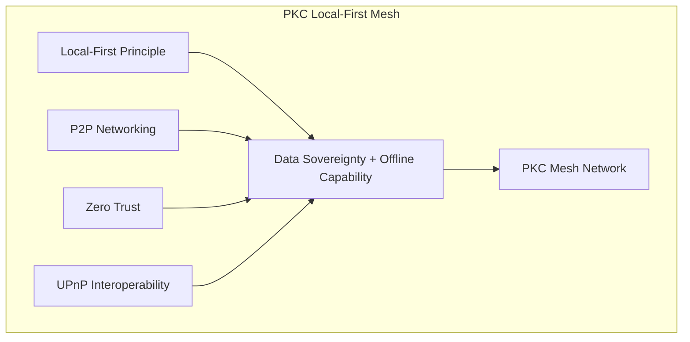

The Local-first principle in data asset management is a concept that prioritizes keeping data on a user's device or local network as the primary source of truth, while also allowing for synchronization and collaboration with other devices or users when necessary. This approach aims to provide the benefits of cloud-based collaboration and accessibility without sacrificing control, privacy, and ownership of data. It's particularly relevant in a world where data is increasingly stored and managed in online services and cloud platforms.

Here's how the Local-first principle is applied in data asset management using Obsidian, Anytype.io, and Excalidraw.io as examples:

1. [[Obsidian]]:
    
    - **Overview**: Obsidian is a popular note-taking and knowledge management application that embraces the Local-first principle.
    - **Implementation**: Obsidian stores all your notes and data on your local device as plain text Markdown files. This means that you have full control over your data and can use any text editor to access and edit it. However, Obsidian also offers synchronization options using third-party cloud services like Dropbox or self-hosted solutions like Syncthing. This allows you to collaborate with others and access your notes from different devices while maintaining the primary data on your local machine.
2. [[Anytype.io]]:
    
    - **Overview**: Anytype.io is a versatile data organization and collaboration tool that also follows the Local-first principle.
    - **Implementation**: Anytype.io uses a distributed data model where each user's device maintains a local copy of the data. Changes are synchronized between devices through a peer-to-peer network, ensuring that your data is always accessible even if you're offline. This approach provides the benefits of real-time collaboration while keeping your data primarily on your local device.
3. [[Excalidraw]]:
    
    - **Overview**: Excalidraw is a collaborative whiteboard tool that allows users to create diagrams and drawings together in real-time.
    - **Implementation**: Excalidraw implements the Local-first principle by allowing users to create and edit drawings directly in their web browsers. The drawings are stored in the browser's local storage, ensuring that your work is always available even without an internet connection. To collaborate with others, Excalidraw.io provides the option to export and import drawings as JSON files, which can be shared and merged manually. This approach prioritizes local data storage while facilitating collaboration when needed.

# Information Security and Local-first principle

The local-first principle in knowledge management tools like Obsidian, Anytype, and Logseq represents a fundamental shift from traditional cloud-centric storage to prioritizing data storage on a user's local device. This approach significantly impacts how information security is managed, offering several benefits and addressing security concerns in unique ways. Here’s how the local-first principle in these tools addresses information security:

### 1. **Data Ownership and Control**:

- **Enhanced Privacy and Control**: Local-first tools store data directly on the user’s device, giving users full control over their information. This means users don't have to rely on third-party cloud services, where data might be accessed or handled in ways that do not align with their personal or organizational security policies.

### 2. **Reduced Data Exposure**:

- **Minimized Attack Surface**: By keeping data localized, the exposure to cyber threats associated with online storage and data breaches is significantly reduced. Data isn’t constantly transmitted over the internet, which decreases the opportunities for intercepting or compromising data during transmission.

### 3. **Encryption and Security**:

- **End-to-End Encryption**: Many local-first applications offer robust encryption options. For instance, tools like Obsidian allow users to encrypt their data before backing it up to any online service, ensuring that data remains secure and private, even when using cloud synchronization for backup or multi-device access.

### 4. **Resilience to Internet Outages and Censorship**:

- **Offline Access and Independence**: Local-first tools work offline, which not only enhances accessibility but also provides resilience against internet outages, censorship, or service denials that could impact cloud-based services. This is crucial for maintaining continuous access to important knowledge and information.

### 5. **Data Longevity**:

- **Long-Term Accessibility**: With the local-first approach, data isn’t tied to the lifespan or business decisions of a cloud service provider. Users can access their data as long as they have functioning hardware, without concerns about service discontinuation or forced migrations.

### 6. **Compliance and Regulatory Requirements**:

- **Easier Compliance**: For businesses and individuals in regulated industries, local-first tools can simplify compliance with data protection regulations (like GDPR or HIPAA) that require strict data handling and storage protocols. Local storage can help ensure that data doesn’t cross borders or get handled in non-compliant ways.

### Challenges and Considerations:

While local-first tools significantly enhance information security, they also require users to take a more active role in managing their own data security, including performing regular backups, securing physical devices, and updating software to protect against vulnerabilities. Additionally, collaboration features, if not carefully implemented, can introduce complexities in ensuring synchronized and secure data sharing among multiple users.

From a security viewpoint, the local-first principle addresses many traditional information security concerns by giving users greater control over their data, minimizing reliance on third-party providers, and enhancing privacy through local storage and robust encryption practices. However, this approach also shifts more responsibility to the user to ensure their data is safely managed and protected.
# Conclusion
In all of these examples, the Local-first principle is applied to give users control over their data assets, making it available and editable locally while providing mechanisms for collaboration and synchronization when necessary. This approach helps address concerns related to data privacy, security, and ownership, which are increasingly important in today's digital landscape.

---

## 🌐 Local-First in PTR-Mesh Architecture

### Local-First as Architectural Foundation

In the [[Hub/Tech/mesh networking|PTR-Mesh Architecture]], Local-First is the **primary architectural principle** for [[Hub/Tech/Cubical Logic Model|CLM]] execution:

| Benefit | PTR-Mesh Implementation |
|---------|------------------------|
| **Data Ownership** | CLM functions and verification proofs cached locally (IndexedDB) |
| **Reduced Exposure** | Verification happens locally; only results shared with mesh |
| **Offline Capability** | Full CLM execution without network connectivity |
| **Long-term Accessibility** | Local verification cache persists independently |
| **Privacy** | Sensitive computations stay on device |

### Local-First Execution Pattern

```typescript
// Browser PTR with Local-First Execution
class BrowserPTR implements PTRRuntime {
  private wasmPTR: WasmModule           // Local execution engine
  private localCache: IndexedDB         // Local verification cache
  private p2pMesh: LibP2PNode           // Peer discovery and routing
  
  async executeCLM(clmFunction: CLMFunction): Promise<CLMResult> {
    // LOCAL-FIRST: Always try local execution first
    const localVerification = await this.localCache.get(clmFunction.hash)
    
    if (localVerification && this.canExecuteLocally(clmFunction)) {
      // Maximum local-first: execute entirely on device
      return await this.wasmPTR.execute(clmFunction)
    }
    
    // COMPOSABLE: Route to mesh only when necessary
    return await this.routeToPeer(clmFunction)
  }
}
```

### Local-First Observability

Even [[Hub/Theory/Sciences/SoG/Observability|observability]] follows local-first principles:
- **Buffer metrics locally first** before pushing to [[Hub/Tech/Prometheus|Prometheus]]
- **Works offline** with local metric storage
- **Preserves sovereignty** by keeping sensitive telemetry local

### Local-First Composability

From [[Hub/Theory/Category Theory/Composability|Composability]]:
```
For composition CLM_B ∘ CLM_A:
  IF canExecuteLocally(CLM_A) AND canExecuteLocally(CLM_B)
  THEN compose and execute locally (maximum local-first)
```

**See**: [[PTR - The Execution Sidecar|PTR - The Execution Sidecar]], [[Lens Protocol#6. Mesh Networking Integration|Lens Protocol Local-First]], and [[Hub/Tech/mesh networking|Mesh Networking]] for complete architecture

---

## 🆕 Local-First as Foundation for PKC Mesh

### The Four Pillars of PKC Local-First Mesh

Local-first is one of **four architectural pillars** that enable [[Hub/Tech/Approaches/PKC as the Mesh Network|PKC]] to be **highly integrated yet loosely coupled**:



### Why Local-First Enables Loose Coupling

**Local-First** is the key enabler of **loose coupling** in PKC mesh:

| Loose Coupling Aspect | Local-First Contribution |
|----------------------|--------------------------|
| **No Central Dependency** | Local execution first, mesh is fallback |
| **Failure Isolation** | Nodes operate independently |
| **Data Sovereignty** | Each node owns its data |
| **Offline Capability** | Full operation without connectivity |
| **Privacy Preservation** | Sensitive data never leaves device |

### Local-First + Zero Trust Synergy

**Local-First + Zero Trust** together create **resilient security**:

```
Traditional Cloud:
  Data on server → Server authenticates → Single point of failure

PKC Local-First Mesh:
  Data on device → Local VCard verification → Every node is authority
  
Result: No central server to compromise, no central data to breach
```

### UPnP-Compatible Local-First Discovery

PKC implements **UPnP-style auto-discovery** while preserving local-first:

1. **New node boots** with local-first defaults
2. **mDNS/DHT discovery** finds peers (non-blocking)
3. **VCard self-signing** enables immediate operation
4. **Peer endorsement** progressively upgrades credentials
5. **Mesh sync** happens in background (local always authoritative)

**See**: [[Hub/Tech/Approaches/PKC as the Mesh Network|PKC as the Mesh Network]] and [[Hub/Theory/Sciences/Computer Science/PKC as an Operating System for Data-Oriented Meta-Learning|PKC as Operating System]] for complete architecture.

---

# References

It would be useful to see [[FRESS]] as a [[File Retrieval and Editing SyStem]]

# References
```dataview 
Table title as Title, authors as Authors
where contains(subject, "Local-first") or contains(subject, "Local first") or contains(subject, "PKC")
sort title, authors, modified
```