---
tags:
  - prologue
  - pentadic-threshold
  - improvement-plan
  - wuxing
  - reverse-mathematics
  - master-algorithm
title: "Pentadic Improvement Plan for Prologue of Spacetime"
aliases:
  - Pentadic Enhancement
  - Five-Phase Prologue Upgrade
modified: 2026-02-10T19:00:00+08:00
created: 2026-02-10T19:00:00+08:00
subject: Prologue of Spacetime, Pentadic Threshold, Five Elements, Five Tribes, Big Five, Improvement Plan
authors: Ben Koo, Antigravity
---

# Pentadic Improvement Plan for Prologue of Spacetime

> **Seed Idea**: The [[The Pentadic Threshold|Pentadic Threshold]] reveals that the number **five** marks the edge of decomposability—the minimal complexity where simple approaches fail and *coordination* becomes necessary. The Prologue of Spacetime currently uses a **3×4** matrix (Trivium × Quadrivium). This plan proposes weaving the **five-fold structure** as a complementary organizing principle, enriching the existing framework without replacing it.

---

## Part 0: The Three "Fives" as Seed Ideas

Three independent domains have converged on five as a structural invariant. These become the seeds for improving the Prologue:

| Seed | Domain | The Five | Core Insight |
| :--- | :--- | :--- | :--- |
| **[[五行]]** (Wǔxíng) | Chinese Cosmology | Wood, Fire, Earth, Metal, Water | Minimal *dynamic* system with dual cycles (生/克). Models generative and destructive interactions simultaneously. |
| **Five Tribes** | Machine Learning ([[Master Algorithm]]) | Symbolists, Connectionists, Evolutionaries, Bayesians, Analogizers | No single paradigm suffices; unification (Tensor Logic) resolves the "paradigm deadlock." |
| **Big Five** | Foundational Logic ([[Reverse Mathematics]]) | $RCA_0, WKL_0, ACA_0, ATR_0, \Pi^1_1\text{-}CA_0$ | Mathematical theorems collapse into exactly five axiomatic strata—the natural joints in the logical landscape. |

**The Shared Lesson**: Complex systems resist decomposition into fewer than five independent components. The Prologue—which teaches participants to navigate complex systems—should mirror this irreducible structure.

---

## Part 1: Gap Analysis — What the Prologue Currently Lacks

### 1.1 The 3×4 Matrix is Complete but Static
The current 12-chapter structure (3 Trivium rows × 4 Quadrivium columns) is comprehensive for covering *topics*. But it lacks a **dynamic interaction model**—a way to describe how the 12 chapters *generate* and *overcome* each other.

**五行 Solution**: Overlay the 五行 cycles (生 = Generation, 克 = Overcoming) onto the chapter structure, giving the narrative a *living* quality.

### 1.2 No Explicit "Five Paradigms" for Learning
The Prologue teaches through Monadic Thinking (Haskell-style patterns), which is powerful but monolithic. It is essentially a **Symbolist** approach. The other four ML paradigms are implicit but not surfaced:

| ML Tribe | Present in Prologue? | How? |
| :--- | :--- | :--- |
| **Symbolists** (Rules) | ✅ Explicit | Monadic patterns, Type Theory, Lean proofs |
| **Connectionists** (Neural Nets) | ⚠️ Implicit | LLMs referenced but not structurally integrated |
| **Evolutionaries** (Selection) | ⚠️ Implicit | "Iterative refinement loop" mentioned but not framed as evolution |
| **Bayesians** (Probability) | ❌ Missing | No treatment of uncertainty as a first-class concern |
| **Analogizers** (Similarity) | ⚠️ Implicit | Cultural analogies used but not named as a learning paradigm |

**Five Tribes Solution**: Explicitly map each learning mode into the Prologue chapters, ensuring all five paradigms are covered.

### 1.3 No Recognition of the "Five Strata of Logic"
The Prologue asks participants to build from arithmetic upward, but never acknowledges that mathematical reasoning itself has **five natural levels** (the Big Five). This means participants lack a meta-awareness of *where* they are in the logical landscape.

**Big Five Solution**: Add a "logical depth meter" that tells participants which axiom system corresponds to the concepts they are currently engaging with.

---

## Part 2: The Five-Phase Enhancement Framework

### Proposal: Add a *五行 Layer* Orthogonal to the Existing 3×4 Grid

The existing 3×4 grid describes **what** is taught (Topics). The new 五行 Layer describes **how** it flows (Dynamics).

```mermaid
graph TB
    subgraph Current ["Current: 3×4 Trivium × Quadrivium"]
        T["12 Chapters<br/>(What to Learn)"]
    end

    subgraph New ["Proposed: 五行 Dynamic Layer"]
        W["Five Phases<br/>(How Learning Flows)"]
    end

    subgraph Output ["Enhanced Prologue"]
        E["12 Chapters × 5 Phases<br/>= 60 Dynamic Interactions"]
    end

    T --> E
    W --> E
```



Note: $12 \times 5 = 60 = |A_5|$ — the order of the smallest non-abelian simple group. This is not a coincidence but a hint that the Prologue, at full pentadic depth, reaches the **threshold of irreducible complexity**.

---

## Part 3: Concrete Improvement Proposals

### 3.1 — Map 五行 to the Prologue's Five Activity Modes

Every chapter already has multiple *modes of engagement*. Name them explicitly as Five Phases:

| 五行 Phase | Prologue Activity Mode | Cycle Role | Chapter Example |
| :--- | :--- | :--- | :--- |
| **木 Wood** (Growth) | **Explore / Diverge** — Generate new ideas, brainstorm, collect raw material | 生 → Fire | Ch 1: "Count *everything* you see" |
| **火 Fire** (Transform) | **Create / Prototype** — Build, code, write, experiment | 生 → Earth | Ch 3: "Compose a rhythm from your counts" |
| **土 Earth** (Ground) | **Consolidate / Integrate** — Synthesize, document, teach others | 生 → Metal | Ch 9: "Formalize your water measurement grammar" |
| **金 Metal** (Refine) | **Critique / Test** — Review, verify, refactor, prove | 生 → Water | Ch 12: "Verify calendar consensus across villages" |
| **水 Water** (Reflect) | **Internalize / Flow** — Meditate on what was learned, let patterns settle | 生 → Wood | Post-game: "What did you discover vs. invent?" |

**Overcoming Cycle (克)**:
- 木 overcomes 土: Exploration disrupts premature consolidation. ("Don't formalize too early!")
- 火 overcomes 金: Creation overrides excessive critique. ("Build before you judge!")
- 土 overcomes 水: Grounding stops aimless reflection. ("Write it down!")
- 金 overcomes 木: Testing prunes wild growth. ("Does this actually work?")
- 水 overcomes 火: Reflection tempers reckless creation. ("Pause and think.")

> **Implementation**: Each chapter should include explicit **Phase Transitions**—moments where participants consciously shift from one 五行 mode to the next, experiencing the generative and overcoming cycles firsthand.

---

### 3.2 — Map the Five Tribes to the Prologue's Five Learning Paradigms

Ensure all five ML learning paradigms are represented as explicit modes of engagement:

| ML Tribe | Learning Paradigm | Prologue Integration | Specific Enhancement |
| :--- | :--- | :--- | :--- |
| **Symbolists** | Learn by **Deduction** (rules → instances) | Already strong: Monadic Thinking, Type Theory | ✅ Keep as-is; label explicitly as "Symbolist Mode" |
| **Connectionists** | Learn by **Pattern Recognition** (data → features) | Enhance: Use LLMs as *conversational partners* whose pattern-matching ability is studied, not just used | 🔧 Add "Neural Mode" exercises where participants analyze *how* the LLM found its answer |
| **Evolutionaries** | Learn by **Selection** (variants → survival) | Enhance: Frame the "Iterative Refinement Loop" (§ in current Prologue) explicitly as evolution | 🔧 Add "Evolution Mode" where participants generate multiple versions of a scene, then select the fittest |
| **Bayesians** | Learn by **Updating Beliefs** (prior → posterior) | Add new: Introduce uncertainty explicitly through the [[Maybe]] monad *and* probabilistic reasoning | 🆕 Add "Bayesian Mode" exercises where participants estimate crop yield with confidence intervals |
| **Analogizers** | Learn by **Analogy** (this ≈ that) | Enhance: The cultural analogy method (Bali → Urban, Rice → API) is already analogical reasoning | 🔧 Add "Analogy Mode" where participants explicitly map Subak concepts to software architecture |

> **Implementation**: Each chapter should include a "**Five Modes**" sidebar that identifies which ML paradigm is currently dominant and invites exploration of the others.

---

### 3.3 — Map the Big Five to the Prologue's Logical Depth Levels

Create a "**Logical Depth Meter**" that tells participants which axiom system corresponds to the concept they are engaging with:

| Big Five Subsystem | Logical Depth | Prologue Concepts at This Level | Chapter(s) |
| :--- | :--- | :--- | :--- |
| **$RCA_0$** (Computable) | Level 1: Things you can *compute* | Counting, basic arithmetic, GASing operations, MVP Cards | Ch 1, 5, 9 |
| **$WKL_0$** (Compact) | Level 2: Things you can *choose* from infinite options | Compactness arguments, "best path" in a network, Heine-Borel | Ch 2, 6, 10 |
| **$ACA_0$** (Arithmetical) | Level 3: Things *defined by* arithmetic | Bolzano-Weierstrass, convergence, the Turing Jump, "every vector space has a basis" | Ch 3, 7, 11 |
| **$ATR_0$** (Transfinite) | Level 4: Things requiring *transfinite iteration* | Well-orderings, iterated procedures, calendar cycles extending across generations | Ch 4, 8 |
| **$\Pi^1_1\text{-}CA_0$** (Impredicative) | Level 5: Things *defined by reference to all sets* | Self-reference, self-aware causal networks, Tri Hita Karana as self-validating | Ch 12 |

> **Implementation**: Add a **Depth Badge** to each chapter header:
> ```
> ## Chapter 1 — The Value of Counting
> 🔬 Logical Depth: Level 1 ($RCA_0$ — Computable Mathematics)
> ```
> This tells participants: "The concepts in this chapter can all be verified by a Turing Machine." When they reach Chapter 12, the badge reads: "The concepts in this chapter require self-referential definitions—welcome to the edge of impredicativity."

---

### 3.4 — The Pentadic Bridge: Connecting 3×4 and 5

**How the 3×4 Matrix and 五行 Phases Interact**:

The 3×4 grid says *what* you learn. The 五行 layer says *how* you learn it. Together, they form a **pentadic enrichment** of the existing structure:

| Trivium Row | 五行 Phase most activated | Why |
| :--- | :--- | :--- |
| **Rhetoric** (Value/Why) | 木 **Wood** + 火 **Fire** | Rhetoric is about encountering value (growth) and creating narrative (transformation) |
| **Logic** (Process/What) | 土 **Earth** + 金 **Metal** | Logic is about consolidating understanding (grounding) and testing rigorously (refining) |
| **Grammar** (Structure/How) | 金 **Metal** + 水 **Water** | Grammar is about formal verification (refining) and deep internalization (flowing) |

But the **overcoming cycle** ensures healthy tension:
- 木 overcomes 土: Don't formalize Rhetoric too early!
- 金 overcomes 木: Logic tests Rhetoric's wild claims!
- 水 overcomes 火: Grammar tempers Logic's rush to patterns!

---

### 3.5 — New Section: "The Pentadic Threshold in Spacetime"

**Add a new section** to the main `Prologue of Spacetime.md` that explicitly connects the Pentadic Threshold to the Prologue's purpose:

> **Suggested Content**:
>
> The Prologue of Spacetime implicitly teaches participants to navigate systems that are **beyond the edge of decomposability**. The [[The Pentadic Threshold|Pentadic Threshold]] reveals why:
>
> - **Algebra ($A_5$)**: You cannot solve the general quintic by formula. You must understand the *structure* of the solution space. → *The Prologue teaches structural thinking, not formula memorization.*
> - **Dining Philosophers**: You cannot feed five philosophers with a naive algorithm. You must introduce a *coordination protocol*. → *The Prologue teaches Subak governance as a coordination protocol.*
> - **Five Tribes**: You cannot learn everything with one ML paradigm. You must *unify* all five. → *The Prologue should teach all five learning paradigms.*
> - **Big Five Subsystems**: Mathematical theorems sort into exactly five logical strata. → *The Prologue's chapters correspond to specific logical depths.*
> - **五行**: You cannot model dynamic systems with fewer than five interacting elements. → *The Prologue's learning activities should follow the five-phase cycle.*

---

## Part 4: Implementation Roadmap

### Phase 1: Quick Wins (This Sprint)
1. **Add Depth Badges** to each chapter header in [[Prologue of Spacetime - Master Navigation]].
2. **Add "Five Modes" sidebars** to at least Chapters 1, 5, and 12 as pilots.
3. **Add a "Pentadic Threshold" section** to the main Prologue document, linking to [[The Pentadic Threshold]].
4. **Update the Mermaid diagram** in the Master Navigation to show 五行 connections.

### Phase 2: Structural Enrichment (Next Sprint)
5. **Redesign each chapter's internal structure** to follow the 五行 cycle: Wood → Fire → Earth → Metal → Water.
6. **Add "Bayesian Mode" exercises** (the most absent paradigm) to Chapters 4, 8, and 12.
7. **Add "Evolution Mode" variants** where participants generate multiple solutions and select.

### Phase 3: Deep Integration (Future)
8. **Create an interactive "Logical Depth Meter"** as a Marimo widget.
9. **Build a 五行 Phase Tracker** that shows which phase participants are in during gameplay.
10. **Formalize the $12 \times 5 = 60 = |A_5|$ connection** as a mathematical appendix, exploring whether the chapter-phase interactions genuinely exhibit the algebraic structure of $A_5$.

---

## Part 5: The Meta-Argument — Why This Matters

### The Pentadic Threshold Proves the Prologue's Necessity

The Prologue of Spacetime exists because of the Pentadic Threshold:
- We live in a world with **more than four interacting subsystems** (economic, ecological, political, technological, cultural).
- No single formula, algorithm, or paradigm can decompose this world.
- **Coordination** (Subak governance, Tri Hita Karana, federated networks) is the only viable approach.
- The Prologue teaches exactly this: how to navigate **irreducibly complex** systems through counting, story, rhythm, and observation.

The fact that the Big Five of Reverse Mathematics, the Five Tribes of ML, and the 五行 of Chinese cosmology all converge on the same structural invariant is not a coincidence—it is **evidence that the Prologue is addressing a genuine, universal threshold**.

> **The Prologue is not just a game. It is a training ground for crossing the Pentadic Threshold.**

---

## See Also
*   **[[Prologue of Spacetime]]** — The main game document
*   **[[Prologue of Spacetime - Master Navigation]]** — The 12-chapter navigation hub
*   **[[The Pentadic Threshold]]** — Five as the edge of solvability
*   **[[The Reversibility of Truth - Discovery vs Invention]]** — How the Big Five support Discovery
*   **[[Master Algorithm]]** — The five ML paradigms
*   **[[五行]]** — The Chinese Five Phases
*   **[[Reverse Mathematics]]** — The Big Five logic subsystems
*   **[[Dining Philosophers Problem]]** — Five as the minimal deadlock configuration
