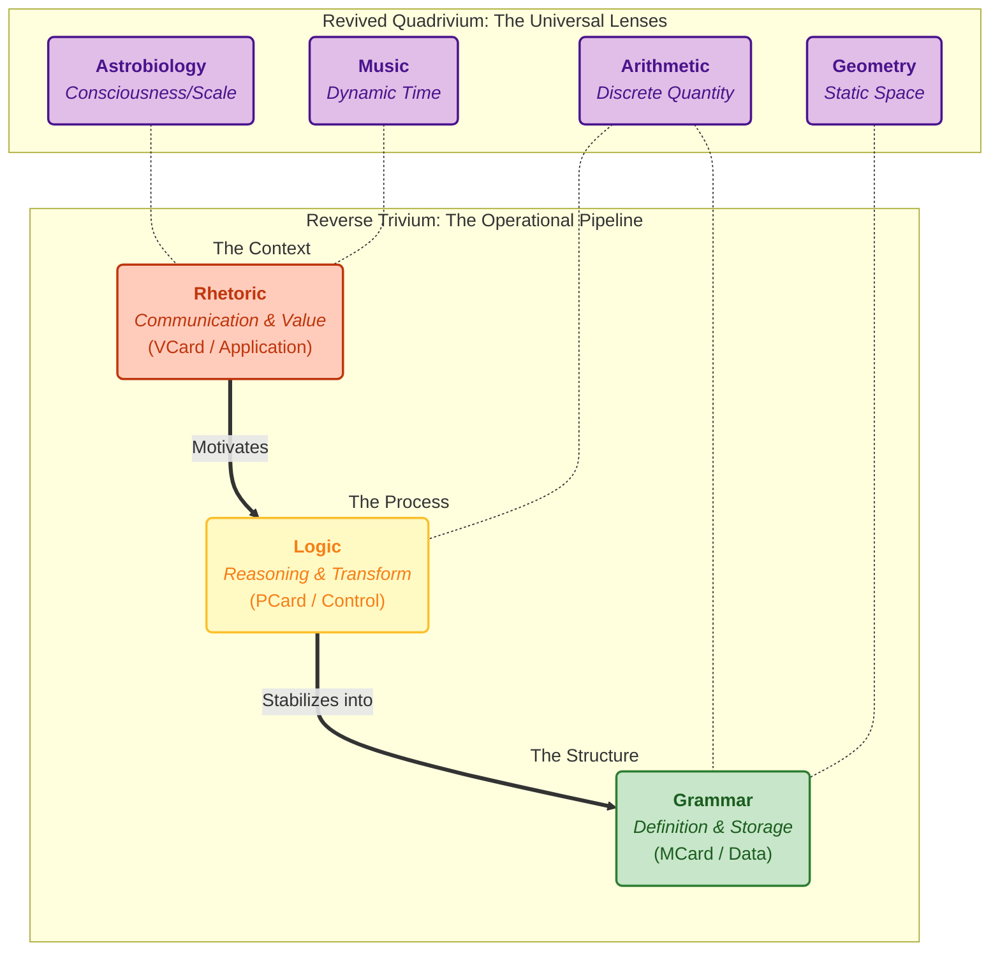

 

## Overview

The ABC curriculum's modern computational approach is deeply rooted in the classical **[[Trivium]]** and **[[Quadrivium]]** framework, demonstrating how timeless educational principles can be operationalized through contemporary **Programmable Learning Workflows** supported by **Generative AI** and **Software-Defined Networking** technologies.

### Public Curriculum Implementation: From Framework to Practice

To keep this framework actionable (not merely descriptive), public curriculum needs a shared delivery substrate:

- **Video-game supported activities** provide the Rhetoric-first simulation contexts.
- **[[Hub/Theory/Sciences/Computer Science/Digital Synesthesia - The Convergence of AI and Immersion|Digital Synesthesia]] provides the perception bridge** so Grammar/Logic abstractions remain experientially grounded.
- Low-cost **[[Literature/PKM/Tools/Internet of Things|IoT]] devices** provide repeatable instrumentation so claims can be tested and maintained under real constraints.

See: **[[GASing's 7 Liberal Arts - Arithmetic as Correctness Inference and Quantum Linguistics as the Scientific Foundation]]**.

## The Trivium: Language and Logic Foundation

The **Trivium** (Grammar, Logic, Rhetoric) provides the foundational structure for knowledge processing and communication within the ABC curriculum: See [[Monadology]]

### 1. Grammar (Structure and Representation)
- Maps to **MCard architecture** for atomic knowledge storage with physically meaningful grounding
- Implements **content-addressable, immutable records** using cryptographic hashes
- Establishes **type constraints** that make illegal knowledge states unrepresentable
- Provides the **vocabulary and syntax** for knowledge representation

### 2. Logic (Processing and Reasoning)
- Maps to **PCard architecture** for recursive composition with mediating meaning
- Implements **computable functions as polynomial functors** over MCard hash references
- Enables **formal verification** and **automated reasoning** through type systems
- Provides the **inference rules** and **computational processes** for knowledge transformation

### 3. Rhetoric (Communication and Application)
- Maps to **VCard architecture** for value representation with socially meaningful context
- Manages **value flows** and **economic coordination** through tokens and reputation systems
- Enables **contextual adaptation** and **cultural relevance** of knowledge presentation
- Provides the **communication strategies** and **persuasive frameworks** for knowledge dissemination

## The Quadrivium: Mathematical and Scientific Foundation

The **Quadrivium** (Arithmetic, Geometry, Music, Astronomy) provides the mathematical substrate that underlies the ABC curriculum's approach to universal pattern recognition:

### 1. Arithmetic (Number and Counting)
- Implements **GASing's universal arithmetic logic** for pattern recognition across domains
- Provides **scale-free computational primitives** that work from individual to distributed systems
- Enables **information compression** through arithmetic relationships and symmetries
- Forms the **foundational substrate** for all computational operations

### 2. Geometry (Space and Form)
- Implements **spatial reasoning** and **topological relationships** in knowledge structures
- Provides **geometric intuition** for understanding complex system behaviors
- Enables **visual representation** and **interactive manipulation** of abstract concepts
- Forms the **structural framework** for knowledge organization

### 3. Music (Time and Harmony)
- Implements **temporal dynamics** and **rhythmic patterns** in learning sequences
- Provides **harmonic relationships** for understanding knowledge composition
- Enables **aesthetic appreciation** and **emotional engagement** with learning content
- Forms the **temporal coordination** for distributed learning activities

### 4. Astronomy (System Dynamics and Universal Patterns)
- Implements **system-level thinking** and **emergent behavior** understanding
- Provides **universal pattern recognition** across scales and domains
- Enables **predictive modeling** and **long-term planning** capabilities
- Forms the **holistic perspective** for understanding complex interactions

## Cross-Reference Framework: Trivium and Quadrivium Integration

### The Reversed Trivium: Knowledge Processing and Communication Infrastructure

The **Trivium** provides the foundational infrastructure for how knowledge is structured, processed, and communicated. In the **[[Hub/Theory/Sciences/Reverse Trivium|Reverse Trivium]]** strategy, we invert the processing order to **Rhetoric → Logic → Grammar**.

This strategy mandates that we start with **Value and Context** ($V_{pre}$) to anchor knowledge in community needs before stabilizing it into formal structures. This "Zero Assumption" approach (see **[[Hub/Theory/Integration/The Empty Schema Principle|The Empty Schema Principle]]**) minimizes the "caste system" of pre-packaged definitions and ensures technology serves actual human utility.

| Trivium Element | Ontology | Property Type | Representables | Real-World Integration |
|-----------------|----------|---------------|----------------|------------------------|
| **Rhetoric** (Why) | **The Gap** (Opportunity) | **Interface** | [[VCard]] | Community engagement, economic value, cultural adaptation |
| **Logic** (How) | **[[Hub/Theory/Category Theory/Abstract\|Abstract]]** (Map) | **[[Hub/Theory/Sciences/Extrinsic Properties\|Extrinsic]]** (Relational) | [[PCard]] | Automated policy, traffic routing, federated learning |
| **Grammar** (What) | **[[Hub/Theory/Category Theory/Concrete\|Concrete]]** (Territory) | **[[Hub/Theory/Sciences/Intrinsic Properties\|Intrinsic]]** (Structural) | [[MCard]] | IoT sensor data, content-addressable storage, immutable records |

### The Revived Quadrivium: Universal Lenses for the Networked Age

As detailed in **[[Hub/Theory/Sciences/Revived Quadrivium|Revived Quadrivium]]**, we must update the four classical arts to serve as the **perception framework** for a globally networked civilization. Driven by **Generative AI** and **[[Hub/Theory/Sciences/QLP|Quantum Linguistic Processing]]**, these arts are no longer just academic subjects but **operational modes** for managing planetary-scale infrastructure.

Following the **[[Hub/Theory/Sciences/Reverse Trivium|Reverse Trivium]]** strategy, we verify these arts in the order of **Value (Rhetoric) → Process (Logic) → Structure (Grammar)**. This ensures that our technical definitions (Grammar) are always grounded in community needs (Rhetoric) and viable transformations (Logic).

| Quadrivium Element | Rhetoric (Why: Resource & Value) | Logic (How: Math & Process) | Grammar (What: Network & Structure) |
| :--- | :--- | :--- | :--- |
| **Arithmetic** *(Efficient Representation)* | **Economic Modeling**: Allocation of scarce resources/bandwidth; Tokenomics; Population statistics. | **GASing Universal Logic**: Vector embeddings; Linear algebra; Compression algorithms. | **Addressing & Counting**: IPv6 addressing; Packet counting; Ledger entries; Hash definitions. |
| **Geometry** *(Transformations)* | **Spatial Equity**: Urban planning; Infrastructure mapping; Geographic Information Systems (GIS). | **Geometric Algebra**: Graph theory; Topological reasoning; Spatial transformations (Rotors). | **Topology & Routing**: Mesh networking protocols; Geographic routing tables; Physical layer layout. |
| **Music** *(Periodic Motion)* | **Social Coordination**: Community rhythms; Cultural preservation; "Vibe" and flow state. | **Signal Processing**: Fourier analysis; Harmonic analysis; Wave mechanics. | **Synchronization**: Precision time protocol (PTP); Quality of Service (QoS); Frequency standards. |
| **Astronomy** *(System Dynamics)* | **Planetary Stewardship**: Ecosystem management; Climate resilience; **[[Astrobiology]]** (Life as cosmic phenomenon). | **Emergence Models**: Predictive analytics; Evolutionary dynamics; **[[Functional Information]]**. | **Observability**: Network telemetry; Distributed monitoring; Capacity planning; Logs & Traces. |

## Integrated Framework: How Trivium and Quadrivium Shape ABC Curriculum Arrangement

The integration of Trivium and Quadrivium creates a comprehensive framework that fundamentally shapes how the ABC curriculum is arranged to address real-world networked infrastructures:

### 1. Mathematics as Universal Language (Quadrivium Foundation)
- **Arithmetic** provides the computational primitives that enable IoT sensors to process and transmit data efficiently
- **Geometry** enables spatial understanding of network topologies and geographic distribution of resources
- **Music** introduces temporal coordination necessary for synchronized operations across distributed systems
- **Astronomy** develops systems thinking required to understand emergent behaviors in complex networked environments

### 2. Networking Technology Vocabulary (Bridging Trivium and Quadrivium)
- **Protocol Understanding**: Students learn networking protocols not as abstract concepts but as concrete implementations of mathematical principles
- **Infrastructure Literacy**: Network topology becomes a geometric exercise; bandwidth management becomes an arithmetic optimization problem
- **System Coordination**: Quality of Service (QoS) management becomes a musical harmony problem; network monitoring becomes an astronomical observation exercise

### 3. Concrete Societal Resources Integration (Trivium Application)
- **Grammar (Data Representation)**: IoT sensor data from environmental monitoring, traffic systems, and community resources is structured using type-safe knowledge representations
- **Logic (Processing and Analysis)**: SD-WAN infrastructure enables real-time processing of community data to support local decision-making and resource optimization
- **Rhetoric (Community Engagement)**: Local economic coordination systems enable communities to create value from their networked infrastructure investments

### 4. The Civic Trivium: Science of Governance Integration
The framework extends directly into the **[[Science of Governance]]**, mapping the lifecycle of the State to the Trivium:

- **Grammar (Educational Programs)**:
    - *Role*: **Symbol Grounding**. Teaching the vocabulary of citizenship and value.
    - *Activity*: Defining the "Types" of the state (Resources, Rights, Duties).
- **Logic (Governance Function Cataloging)**:
    - *Role*: **Consensus & Coherence**. Organizing public services and operations into a logical catalog.
    - *Activity*: "Voting with Action" (Usage) creates the logic of the state machinery.
- **Rhetoric (Formal Regulations)**:
    - *Role*: **Codification & Binding**. The formal expression of Authority.
    - *Activity*: Inventing Predicates (Laws) that stabilize usage into reliable public goods.

*See **[[Science of Governance#The Three Stages of Governance Process]]** for the deeper analysis.*

### 5. Accounting as the Operational Bridge: Arithmetic Made Social

> **Key Insight**: **Accounting** is where **Arithmetic** (Quadrivium) meets **Grammar + Logic** (Trivium). It is the **operational discipline** that translates abstract number theory into **verifiable, auditable records** of value exchange—the foundation of all long-term social coordination.

#### Why Accounting is Foundational

The classical arts were designed for **free citizens** managing their own affairs. Accounting—the systematic tracking of resources, obligations, and exchanges—is the **practical arithmetic** that enables sovereignty:

| Accounting Concept | Arithmetic Foundation | Trivium × Quadrivium Synthesis |
|-------------------|----------------------|--------------------------------|
| **Double-Entry Bookkeeping** | Conservation law: $\sum \text{Debits} = \sum \text{Credits}$ | **Arithmetic** (balance) × **Grammar** (structure) |
| **Trial Balance** | Equivalence verification | **Arithmetic** (equality) × **Logic** (verification) |
| **Depreciation** | Time series: $V(t) = V_0 \cdot f(t)$ | **Music** (temporal dynamics) × **Logic** (rule application) |
| **Interest/Compounding** | Exponential: $A = P(1+r)^t$ | **Arithmetic** (iteration) × **Music** (time) |
| **Ledger** | Append-only log | **Grammar** (immutable record) |
| **Audit Trail** | Hash chain | **Logic** (verifiable transformation) |

#### Social Rituals and Long-Term Relations

**Accounting** is meaningful only within **long-term social relations**. **Rituals** are the **periodic, reliable events** that create and maintain these relations:

| Ritual Property | Network Infrastructure | Trivium × Quadrivium |
|-----------------|----------------------|---------------------|
| **Periodicity** | Scheduled execution, cron, heartbeats | **Music** (temporal coordination) |
| **Reliability** | SLA guarantees, fault tolerance | **Logic** (deterministic rules) |
| **Participation** | Node membership, quorum | **Rhetoric** (social invitation) |
| **Memory** | State persistence, ledgers | **Grammar** (immutable records) |
| **Meaning** | Application semantics, value | **Astronomy** (systemic purpose) |

**Without rituals**, there is no **accumulated trust**. Without trust, there is no basis for **credit, debt, or long-term exchange**—the core subject matter of accounting.

#### Zero Trust Security and Hard Currencies

Modern distributed systems require **Zero Trust** architecture—trust must be **continuously verified**, not assumed:

| Zero Trust Principle | Social/Economic Analog | Verification Technology |
|---------------------|----------------------|------------------------|
| **Never Trust, Always Verify** | Reputation via repeated interaction | Hash-based content verification (MCard) |
| **Least Privilege** | Earned authority | Role-based access (VCard) |
| **Assume Breach** | Anticipate defection | Byzantine fault tolerance |
| **Continuous Validation** | Ongoing reciprocity | Certificate rotation, attestation |

**Currencies as Trust Technologies**:

| Currency Type | Trust Model | Verification | Trivium Mapping |
|---------------|------------|--------------|-----------------|
| **Reputation** (Soft) | Social memory | Community attestation | **Rhetoric** |
| **Gold/Commodity** (Hard) | Physical scarcity | Material verification | **Grammar** |
| **Fiat** (State-backed) | Institutional trust | Legal enforcement | **Rhetoric** × **Logic** |
| **Crypto** (Mathematical) | Computational scarcity | Hash verification, consensus | **Logic** × **Arithmetic** |

**The Evolution**: Crypto-currencies represent the **purest synthesis** of Arithmetic and Logic—value verified by mathematical proof rather than social or material trust.

#### Arithmetic as Security Foundation

**Zero Trust security reduces to arithmetic operations**:

$$\text{Security} = \text{Hash}(\text{content}) + \text{Signature}(\text{authority}) + \text{Consensus}(\text{quorum})$$

- **Hash Functions**: Collision-free identification ← **Prime Number Theory**
- **Digital Signatures**: Unforgeable attestation ← **Modular Arithmetic**
- **Merkle Trees**: Efficient state verification ← **Logarithmic Proofs**
- **Consensus Protocols**: Byzantine agreement ← **Threshold Arithmetic**

This is why **Arithmetic is the foundation**: all security guarantees ultimately rest on number-theoretic properties that are implemented through the **Grammar** (data structures) and **Logic** (verification rules) of the Trivium.

#### The Complete Synthesis

$$\boxed{\text{Long-Term Social Coordination} = \text{Rituals} \times \text{Accounting} \times \text{Security}}$$

Where:
- **Rituals** = **Music** (temporal) × **Rhetoric** (social meaning)
- **Accounting** = **Arithmetic** (substrate) × **Grammar** (records) × **Logic** (rules)
- **Security** = **Arithmetic** (cryptography) × **Logic** (verification)

**Curriculum Implication**: Students must understand that **Arithmetic is not abstract**—it is the **operational foundation** for:
- ✅ All accounting and financial systems
- ✅ All cryptographic security
- ✅ All distributed consensus
- ✅ All verifiable long-term social coordination

**→ See Also**: [[ABC curriculum#Social Rituals Trust Networks and Accounting as Arithmetic|ABC Curriculum: Social Rituals, Trust Networks, and Accounting as Arithmetic]]

### 6. Curriculum Arrangement Impact
This integrated approach means the ABC curriculum is arranged to:
- **Start with Mathematical Foundations**: Begin with arithmetic and geometric thinking that directly applies to network design and IoT sensor deployment
- **Progress to Infrastructure Understanding**: Move from abstract mathematical concepts to concrete networking technologies and protocols
- **Culminate in Community Application**: Apply learned concepts to real-world community challenges using actual networked infrastructure and IoT deployments
- **Maintain Continuous Integration**: Ensure that classical liberal arts wisdom (Trivium/Quadrivium) remains connected to modern technological capabilities throughout the learning journey

This arrangement ensures that students develop both the theoretical understanding (classical liberal arts) and practical capabilities (modern networking and IoT technologies) necessary to create meaningful value in their communities through intelligent use of networked infrastructure.

## The Cognitive Imperative: From Bayhem to Epiplexity

The central challenge of the modern age is not scarcity of information, but the overwhelming **[[Hub/Culture/Bayhem|Bayhem]]**—the high-entropy, kinetic chaos of raw data streams. The Trivium x Quadrivium framework is the toolset for taming this chaos.

### 1. The Problem: Bayhem (High Entropy)
*   **Nature**: Raw, unprocessed reality is a "Michael Bay movie"—constant movement, explosions of data, and high **[[Hub/Theory/Category Theory/Combinatorics/Shannon Entropy|Entropy]]**.
*   **Curriculum Role**: The curriculum accepts Bayhem as the starting input state ($\mathbb{R}^n$). We do not retreat from it; we learn to navigate it.

### 2. The Method: Parallax (Reverse Trivium)
*   **Mechanism**: To find depth in the chaos, one must *move*. **[[Hub/Culture/Parallax|Parallax]]**—the displacement of perspective—transforms static 2D noise into 3D structure.
*   **Application**: The **[[Hub/Theory/Sciences/Reverse Trivium|Reverse Trivium]]** (Rhetoric $\to$ Logic $\to$ Grammar) is a *kinetic* operation. We start by moving towards Value (Rhetoric), which generates the Parallax needed to discern Logic and stabilize Grammar.

### 3. The Goal: Information Density (Epiplexity)
*   **Metric**: The objective is to convert high-entropy noise into high **[[Hub/Theory/Sciences/information density|Information Density]]**.
*   **Result**: This creates **[[Hub/Tech/Epiplexity|Epiplexity]]**—patterns that are intricate yet learnable. The liberal arts are the compression algorithms that turn "Sound and Fury" into "Music and Meaning."

## Programmable Learning Workflows: Operationalizing Classical Wisdom

The integration of Trivium and Quadrivium through modern technology enables **Programmable Learning Workflows** that:

1. **Preserve Classical Wisdom**: Maintain the time-tested educational principles while adapting to contemporary technological capabilities
2. **Enable Scalable Implementation**: Use **SD-WAN infrastructure** to distribute classical educational approaches across diverse geographical and cultural contexts
3. **Support Adaptive Learning**: Leverage **Generative AI** to personalize classical educational sequences based on individual learning patterns and cultural contexts
4. **Maintain Cultural Relevance**: Ensure that universal educational principles are contextualized for local communities and traditions
5. **Create Measurable Outcomes**: Provide formal verification methods to assess the effectiveness of classical educational approaches in modern contexts

This classical foundation ensures that the ABC curriculum's technological innovations are grounded in proven educational wisdom while enabling unprecedented scale and accessibility through modern computational infrastructure.

## The Modern Lingua Franca: Extending Trivium × Quadrivium

The classical Trivium × Quadrivium framework achieves contemporary relevance through three interlocking extensions that constitute the **lingua franca** of modern knowledge work:

### Software Libraries as Linguistic-Based Mental Models

Modern software libraries are not merely tools—they are **vocabularies that shape thought**. The Trivium maps directly to library structure:

| Trivium Layer | Library Manifestation | Example Libraries |
|---------------|----------------------|-------------------|
| **Grammar** | API Type Signatures | Schemas, Protobuf, OpenAPI |
| **Logic** | Composition Rules | Functors, Monads, Pipelines |
| **Rhetoric** | Idiomatic Patterns | Community best practices, Style guides |

The Quadrivium provides the **content domains** that libraries operationalize:

| Quadrivium Art | Library Domain | Modern Examples |
|----------------|---------------|----------------|
| **Arithmetic** | Data Processing | NumPy, Pandas, TensorFlow |
| **Geometry** | Spatial/Graph | NetworkX, PostGIS, Three.js |
| **Music** | Temporal/Signal | Prometheus, RxJS, Apache Kafka |
| **Astrobiology** | System/Lifecycle | Kubernetes SDK, Terraform, Pulumi |

**Educational Imperative**: Library fluency is **linguistic competency**—learners who cannot read library documentation as structured knowledge lack the vocabulary for modern engineering discourse.

### IoT as the Physical-Social Grounding Layer

The **[[Literature/PKM/Tools/Internet of Things|Internet of Things]]** provides the **cyber-physical substrate** where Trivium × Quadrivium becomes operationally visible:

| Framework | IoT Manifestation | Constraint Category |
|-----------|------------------|--------------------|
| **Trivium** | Sensor → Pattern → Schema pipeline | Linguistic reasoning about system integrity |
| **Quadrivium** | Space (GPS) × Time (series) × Life (ecosystem) | Content knowledge made tangible |

**Material Sourcing Constraints**: IoT introduces learners to realities that abstract curricula ignore:
- **Supply chains**: Physical components have logistics dependencies
- **Power budgets**: Edge devices operate under strict energy limits
- **Bandwidth**: Remote sensors cannot assume unlimited connectivity
- **Latency**: Real-time control demands predictable timing

**→ See**: [[Hub/Theory/Sciences/ABC Roadmap#Internet of Things as the Operational Compass for ABC Curriculum|ABC Roadmap: IoT as Operational Compass]] for complete integration.

### Network-Oriented Operating System Mindset

The modern curriculum must instill a **network-first worldview** where classical OS concepts map to distributed equivalents:

| Classical OS | Network-Oriented | Trivium × Quadrivium |
|-------------|-----------------|---------------------|
| Process | Container/Pod | Grammar (typed execution unit) |
| File | Content-addressed blob | Grammar (MCard identity) |
| IPC | Service RPC | Logic (PCard transformation) |
| User/Group | Identity/Role (OIDC) | Rhetoric (VCard authority) |
| Filesystem | Distributed namespace | Arithmetic (addressing) |
| Kernel | Control Plane (K8s) | Astronomy (system dynamics) |

**The Network IS the Computer**: Local computation is a degenerate case of distributed computation. SD-WAN provides the programmable infrastructure that makes this vision operational.

### Integration Formula

$$\boxed{\text{Modern Trivium × Quadrivium} = \text{Library Literacy} \times \text{IoT Groundedness} \times \text{Network Mindset}}$$

This extension ensures that the classical framework produces learners who:
- ✅ Read library documentation as structured knowledge (Trivium)
- ✅ Design systems respecting physical/material constraints (Quadrivium made concrete)
- ✅ Think in distributed paradigms that scale (Network-first)
- ✅ Navigate the vocabulary of modern infrastructure (Lingua Franca)

## Trivium & Quadrivium as Architectural Backbone of GASing

While the sections above map Trivium and Quadrivium to specific representables (MCard/PCard/VCard) and network technologies, their deeper role is as **cross-cutting architectural concerns** that shape how [[GASing]] and the [[ABC curriculum]] are designed and executed at every scale.

### Trivium as the Knowledge-Processing Spine

Across all GASing workflows and ABC learning paths, the **Trivium** provides a **three-stage processing pipeline** that repeats at every granularity:

1. **Grammar → MCard / Structural Layer**
   - Defines *what can exist* in the system: typed content, legal knowledge states, and valid configurations.
   - Implemented as [[MCard]]-based, content-addressable records (data plane) that make illegal states unrepresentable.

2. **Logic → PCard / Transformational Layer**
   - Defines *how things change*: inference rules, workflows, algorithms, and policy engines.
   - Implemented as [[PCard]] polynomial functors (control plane) that compose transformations over MCard graphs.

3. **Rhetoric → VCard / Value & Engagement Layer**
   - Defines *why it matters and to whom*: context, incentives, roles, evaluation, and communication.
   - Implemented as [[VCard]]s (application plane) that gate access, express reputation, and shape stakeholder experience.

In [[GASing]] and the [[ABC curriculum]], this Trivium pipeline appears at multiple levels:

- **Lesson Design**: start from motivating problems and community narratives (Rhetoric), identify patterns and reasoning chains (Logic), then stabilize as formal concepts, notations, and tests (Grammar).
- **PKC Architecture**: user-facing tasks and dashboards (Rhetoric) invoke workflows and policies (Logic) that operate over typed content and telemetry (Grammar).
- **Governance & XLP**: community goals and norms (Rhetoric) constrain decision and review processes (Logic) that continuously reshape the knowledge base (Grammar).

This is exactly the **Reverse Trivium** pattern highlighted in [[ABC curriculum]] and [[ABC Roadmap]]: **Rhetoric → Logic → Grammar** as a *directional, non-commutative pipeline* that is reused everywhere from micro‑activities to national curricula.

### Quadrivium as the Measurement & Pattern Substrate

The **Quadrivium** supplies the **universal “senses” of the system**—the ways GASing and ABC perceive and measure learning, infrastructure, and community change:

1. **Arithmetic**
   - Universal counting and pattern‑recognition substrate.
   - In GASing, it appears as [[GASing Arithmetic]] and [[Ethnoarithmetics]], making culturally grounded counting the bridge to formal mathematics.
   - In ABC/PKC, it underlies metrics, telemetry, and resource accounting (tokens, time, bandwidth, difficulty levels).

2. **Geometry**
   - Spatial/topological intuition for networks, conceptual spaces, and document graphs.
   - In GASing projects, it shows up in layout, architecture, navigation, and modeling of environments (from Dayak houses to network topologies).
   - In ABC, it structures knowledge as graphs and lattices (see [[Lattice-based Knowledge Representation]] and DCPOs in the Roadmap).

3. **Music**
   - Temporal structure, rhythm, and multi-scale coordination.
   - In GASing, it shapes pacing of activities, repetition/variation cycles, and collaborative "rhythms" of play.
   - In ABC Temporal Architecture, it corresponds to calendars, sprints, and learning cadences—from beats (micro‑tasks) to movements (projects) to cycles (semesters).

4. **Astronomy**
   - Systemic, long‑horizon perspective across scales.
   - In GASing, it is visible in community‑scale projects, longitudinal tracking of cohorts, and emergence of “universality classes” of interventions.
   - In ABC Roadmap, it aligns with observability, governance, and strategic planning across PKC/SON federations.

Taken together, Quadrivium defines *how the system sees and measures itself*: quantities (Arithmetic), shapes/relations (Geometry), rhythms (Music), and trajectories across scale and time (Astronomy).

### How This Becomes the Backbone of GASing

The **GASing workflow** is where these cross-cutting concerns become operational:

- Every GASing learning arc starts from **Rhetoric** (local story, need, or challenge), passes through **Logic** (structured exploration and problem‑solving), and consolidates as **Grammar** (stable skills, language, and artifacts recorded as MCards).
- Progress along that arc is *measured* using the Quadrivium lenses: counts and basic arithmetic, spatial/graph structure of ideas, temporal rhythms of practice, and system‑level changes in community capacity.
- The ABC curriculum and ABC Roadmap formalize this as a **scale‑free architecture**: the same Trivium × Quadrivium pattern governs individual exercises, classroom projects, community deployments, and national programs.

From an architectural standpoint:

- **Trivium** defines the *processing spine* of GASing (how information and value flow through PKC/SON and programmable workflows).
- **Quadrivium** defines the *sensing and invariants* (what is measured, compared, and preserved as knowledge evolves).
- Together, they ensure that GASing is not just a collection of methods, but a **coherent, composable operating system for learning**, compatible with the Functional Programming foundation of ABC and the DCPO/directionality structure in the Roadmap.

For an applied, movement‑level perspective, see [[GASing]] and [[Literature/PKM/Institution/Gasing Method.md|GASing Method: Scale-Free Personalized Learning in the AI Age]], which instantiate this Trivium × Quadrivium architecture across Indonesian contexts.

## Related Concepts

### Core Framework Documents
- [[ABC curriculum]] — The operational manifestation of Trivium × Quadrivium
- [[ABC curriculum#The Modern Lingua Franca Software Libraries IoT and Network-Oriented Mindset|ABC Curriculum: Modern Lingua Franca]] — How libraries, IoT, and network thinking extend the classical framework
- [[Hub/Theory/Sciences/ABC Roadmap#Internet of Things as the Operational Compass for ABC Curriculum|ABC Roadmap: IoT as Operational Compass]] — Complete IoT integration with Trivium × Quadrivium
- [[GASing]] — Scale-free learning methodology grounded in Trivium × Quadrivium

### Classical Arts References
- [[Trivium]] — Grammar, Logic, Rhetoric
- [[Quadrivium]] — Arithmetic, Geometry, Music, Astronomy
- [[Hub/Theory/Sciences/Revived Quadrivium|Revived Quadrivium]] — Arithmetic as Universal Abstract System
- [[Hub/Theory/Sciences/Reverse Trivium|Reverse Trivium]] — The Zero Assumption Strategy (Rhetoric → Logic → Grammar)
- [[MIT quadrivium]]
- [[Seven Liberal Arts as Foundation for Personal Sovereignty]] — How the classical Seven Arts enable ISSOT and individual freedom

### Modern Infrastructure Integration
- [[Literature/PKM/Tools/Internet of Things|Internet of Things]] — Cyber-physical grounding layer
- [[Hub/Theory/Sciences/SoG/physical and social meanings of data|Physical and Social Meanings of Data]] — Orthogonal dimensions of data meaning
- [[Software-Defined Wide Area Networks]] — Programmable network infrastructure
- [[MVP Cards for PKC]] — MCard/PCard/VCard architecture
- [[Programmable Learning Workflows]]
- [[Orchestration]] — SD-WAN as performing theatre of opportunities
